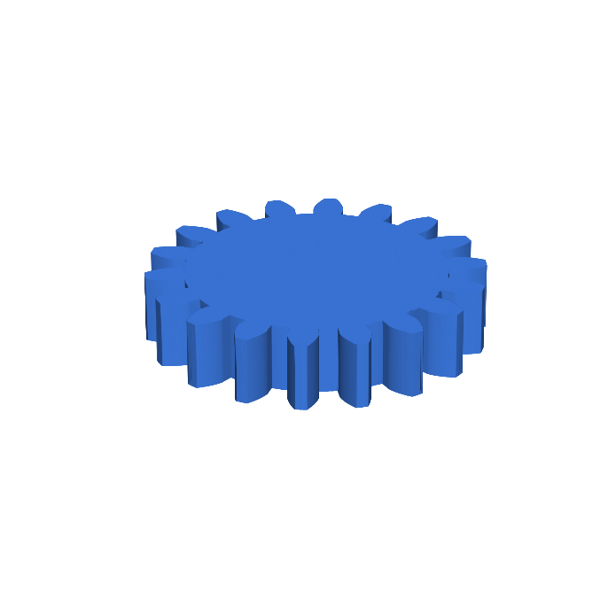
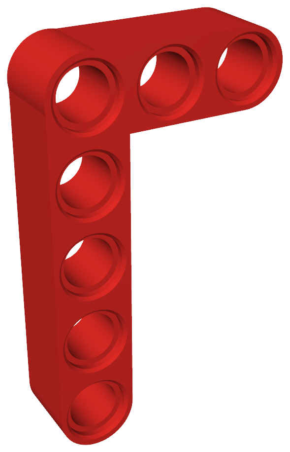
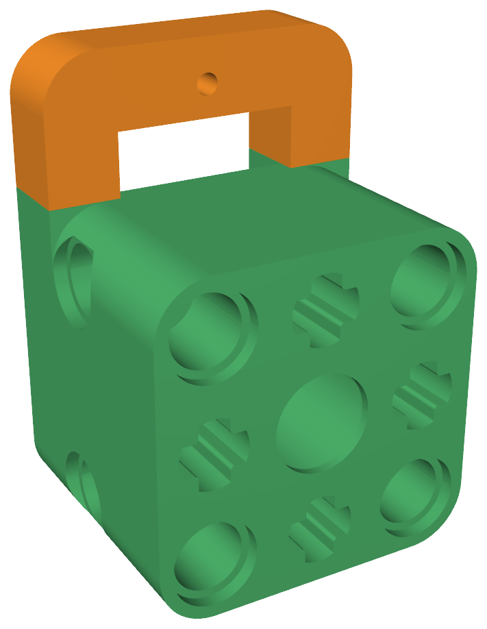
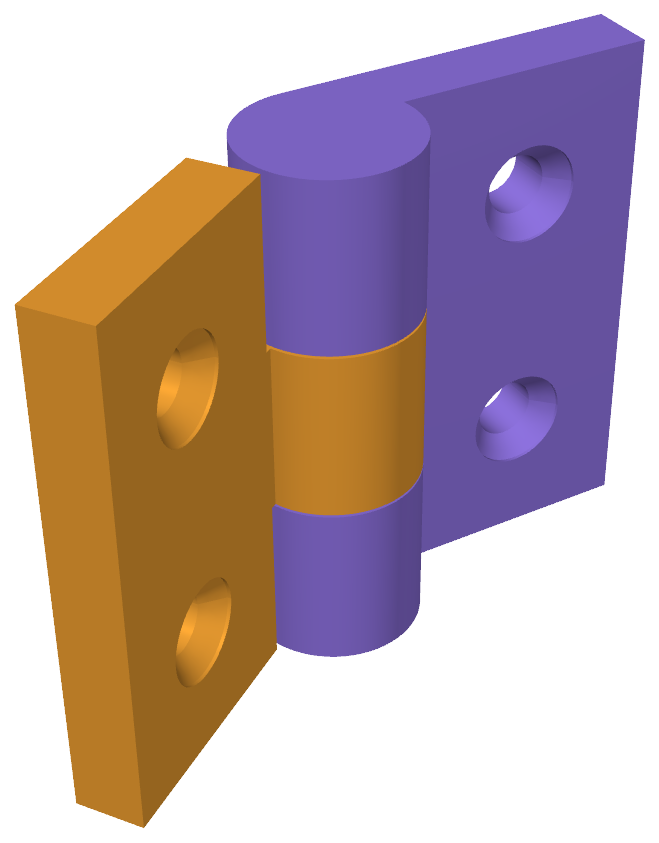

<h1 align="center">vibe-cading</h1>

<p align="center">
  <b>A parametric, AI-friendly Code-CAD library in Python.</b><br>
  Reusable mechanical components — plus adapters that bridge RC hardware to Lego&nbsp;Technic.
</p>

<p align="center">
  <a href="LICENSE"></a>
  
  
</p>

Built on [CadQuery](https://cadquery.readthedocs.io/), **every part is a Python class
whose geometry regenerates from typed parameters** — change a number, get a new part.
Standard families (screws, gears, nuts) build straight from real-world size tables.
And it's designed to be driven by humans *and* LLM agents.

---

## Samples

<table>
  <tr>
    <td align="center" width="50%">
      <a href="assets/sample-gear.stl" title="Click to rotate in 3D"></a><br>
      <sub><b>SpurGear</b> · <code>module=1.5, teeth=18</code></sub>
    </td>
    <td align="center" width="50%">
      <a href="assets/sample-lliftarm.stl" title="Click to rotate in 3D"></a><br>
      <sub><b>LegoTechnicLLiftarm</b> · 3×5 Technic L-liftarm</sub>
    </td>
  </tr>
  <tr>
    <td align="center" width="50%">
      <a href="assets/sample-servo.stl" title="Click to rotate in 3D"></a><br>
      <sub><b>ServoMountBase + ServoMountClamp</b> · SG90 → Lego, dovetail-clamped</sub>
    </td>
    <td align="center" width="50%">
      <a href="assets/sample-hinge.stl" title="Click to rotate in 3D"></a><br>
      <sub><b>PrintInPlaceHinge</b> · 2 countersunk M3 holes / leaf</sub>
    </td>
  </tr>
</table>

<p align="center"><sub>🔄 <b>Click any sample</b> to spin the real model in GitHub's interactive 3D viewer.</sub></p>

Each part is a few lines of Python. The geometry is a function of the parameters,
so a part is never a static shape — it's a generator:

```python
import cadquery as cq
from vibe_cading.mechanical.gears.spur import SpurGear

# Parameters drive the geometry — change teeth, get a new gear.
gear = SpurGear.from_iso(module=1.0, teeth=20, face_width=5.0)
cq.exporters.export(gear.solid, "gear.step")   # extension picks the format
```

---

## Why vibe-cading

- **Parametric by construction.** Every part regenerates from typed constructor
  parameters; there are no frozen meshes. Standard families come from size tables —
  `MetricMachineScrew.from_size("M3", length=12)`, `SpurGear.from_iso(module=1, teeth=20, face_width=5.0)` —
  so one class yields a whole catalogue of real-world parts.
- **Parametric both ways.** Forward is params → part. *Reverse* goes the other
  direction: bring an existing **STEP** file, let the engine's analysis tools
  measure it, and rebuild it — by hand or with an LLM agent — as editable parametric
  code. `boolean_diff` then confirms the rebuild matches the original to within ~1%
  by volume. That's how the **SG90 servo body** in the samples above was built:
  measured from a reference STEP, rebuilt as a parametric class. Works best on
  simple prismatic parts.
- **Print-ready fits.** Real-world *nominal* geometry stays fixed; per-machine,
  per-material clearances live in a separate **tolerance profile** you calibrate once.
  The same model bores a tight hole on one printer and a loose one on another — the
  profile absorbs that, not your code.
- **Built for humans *and* AI agents.** Drive it from Python, from the live OCP CAD
  viewer, or from any [MCP](docs/mcp.md) client. A multi-role agent workflow ships
  in-repo so models can be generated, validated, and reviewed by LLM agents.
- **RC ↔ Lego Technic.** A library of reusable mechanical components (screws, gears,
  joints, bearings, heat-set inserts, hinges, standoffs) plus adapters that mate RC
  hardware to the 8&nbsp;mm Lego Technic stud grid (motor mounts, ESC holders, axle adapters).

---

## Featured models

Each is parametric — the call below is the *whole* construction.

| Component | Build it | Parametric handle |
|---|---|---|
| Lego Technic beam | `LegoTechnicBeam(length_in_studs=5)` | studs → mm on the 8&nbsp;mm grid |
| Metric machine screw | `MetricMachineScrew.from_size("M3", length=12)` | M2–M5 size table; socket / flat / pan heads, hex / Torx / Phillips drives |
| Spur gear | `SpurGear.from_iso(module=1.0, teeth=20, face_width=5.0)` | ISO module + teeth → involute profile |
| Hex nut | `MetricHexNut.from_size("M3")` | M2–M8 size table |
| Snap-fit joint | `CantileverSnapFit(hook_depth=1.5, retention_angle=90)` | hook geometry; `.male()` solid / `.to_cutter()` cavity |

…plus magnets, enclosures, more fastener and bearing types, the Lego Technic
primitives, and the RC adapters. See [`vibe_cading/`](vibe_cading/) for the full library tree,
and four runnable demos under [`examples/`](examples/).

---

## Quick start

This project runs in a **VS Code Dev Container** — no local Python or CadQuery install.

1. Clone the repo, open it in VS Code, and click **Reopen in Container**
   (Python 3.11 + CadQuery + the OCP CAD viewer are provisioned for you).
2. Run an example — writes STEP + SVG to `examples/build/`:
   ```bash
   python3 examples/gear_from_iso.py
   ```
3. Preview any part live in the OCP CAD viewer (port 3939):
   ```bash
   python3 vibe_cading/tools/view.py vibe_cading.mechanical.gears.spur.SpurGear
   ```
4. **Before your first print**, calibrate the slip fit for your printer + material:
   print the axle gauge and run `python3 vibe_cading/tools/calibrate.py slip` — it
   writes the measured `slip.radial` into your gitignored `print_profiles_user.json`
   so Lego pins and axles fit. (Why it matters, plus the other knobs:
   [docs/print-tolerances.md](docs/print-tolerances.md).)

→ Full dev environment, the local test/lint/build loop (`python build.py`), and
adding your own parts: **[CONTRIBUTING.md](CONTRIBUTING.md)**.

---

## Tolerances & fit

Printed fits are printer- and material-dependent. vibe-cading keeps real-world
*nominal* geometry fixed and carries the per-machine clearance separately in a
**tolerance profile** — `fdm_standard`, `resin_precise`, and `cnc` ship in-repo,
selected via `PRINT_PROFILE` and overridable per-machine in a gitignored
`print_profiles_user.json`.

`slip.radial` (the Lego-axle slip fit) is the one knob almost everyone re-tunes;
calibrate it by printing a gauge and running `python3 vibe_cading/tools/calibrate.py slip`.
The `free` and `press` defaults work for most FDM printers out of the box.

→ Full fit-grade model and calibration workflow: **[docs/print-tolerances.md](docs/print-tolerances.md)**.

---

## Learn more

| If you want to… | Read |
|---|---|
| Set up, build, and contribute parts | [CONTRIBUTING.md](CONTRIBUTING.md) |
| Understand tolerances & calibration | [docs/print-tolerances.md](docs/print-tolerances.md) |
| Look up Lego Technic dimensions | [docs/lego-technic.md](docs/lego-technic.md) |
| Look up fastener sizes & fits | [docs/screws.md](docs/screws.md) |
| Drive the engine from an MCP client | [docs/mcp.md](docs/mcp.md) |
| Understand the multi-role agent workflow | [docs/agentic-workflow.md](docs/agentic-workflow.md) |
| **Onboard an AI coding agent** | **[AGENTS.md](AGENTS.md)** → [vibe/INSTRUCTIONS.md](vibe/INSTRUCTIONS.md) |

---

## License

[AGPLv3](LICENSE). See [LICENSE-FAQ.md](LICENSE-FAQ.md) for a plain-language guide
to what this means for your projects.

For commercial or closed-source use cases that are incompatible with AGPLv3,
dual-licensing is available. Contact licensing@vibe-cading.com for details.
