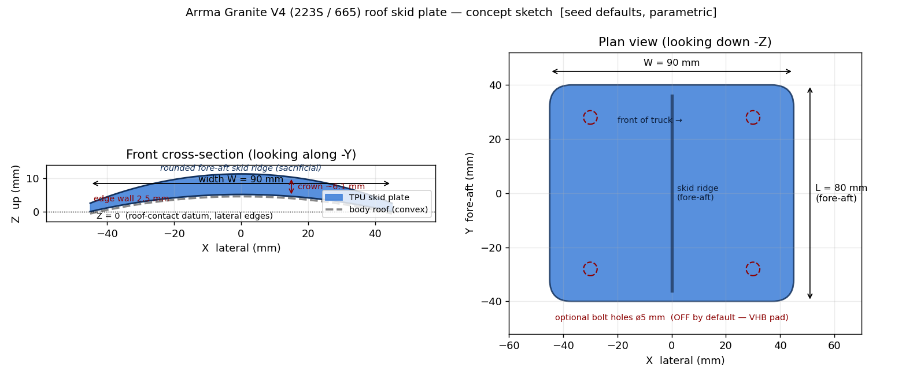

# Requirements: Arrma Granite Roof Skid Plate

<!-- Filename: 2026-06-07-granite-roof-skid-plate_req.md  (tracked in git under .agents/plans/) -->

## Meta
- **Initiator role**: @designer
- **Date**: 2026-06-07
- **Domain integrity gate**: YES — geometry depends on RC (Arrma Granite) body
  dimensions and on a deliberate, documented deviation from the project's
  Lego-8mm-grid hole constraint. A domain reviewer must confirm the
  approximated dimensions and the non-Lego deviation are reasonable.

---

## Problem Statement
When an Arrma Granite (1/10 4x4 class — **V4 body**, user codes 223S / 665,
which is a **distinct shell from the 3S BLX version**) rolls and lands inverted,
the polycarbonate body shell abrades and cracks on its roof. A printed, replaceable **roof skid plate** mounted to the top of the
shell takes that abrasion and impact instead, extending body life. The user has
**no reference geometry** (no STEP/measurements), so the part must be a
**fully parametric** CadQuery class with sensible default estimates for the
Granite roof, refinable later once the user measures their shell.

## User Story / Motivation
As an Arrma Granite owner, I need a tough, replaceable skid plate bonded to the
roof of my body shell so that rolling the truck wears a cheap printed part
instead of cracking the expensive polycarbonate body, and so I can reprint a new
one when it wears out.

## Concept Sketch (pre-design, indicative — NOT the formal visual contract)
<!-- Pre-design concept previews generated from a throwaway tmp/ probe of the
     *proposed* geometry at the seed defaults. Named with the `_concept_` infix
     (not `_design_`) so the CI visual-contract coverage gate (which globs
     `*_design_*.svg`) ignores them. The binding visual contract is produced
     later from the real model class at the design gate (Step 4) and regenerated
     at implementation (Step 5A), per the Visual Contract rule. -->

Annotated concept (renders inline — PNG):

3D views from a CadQuery build of the proposed geometry (open in a browser or an
SVG-preview extension; VS Code shows `.svg` as source by default):
- [iso_ne](2026-06-07-granite-roof-skid-plate_concept_iso_ne.svg) — top 3/4 view
- [underside iso](2026-06-07-granite-roof-skid-plate_concept_iso_bot_ne.svg) — concave roof-mating face
- [front](2026-06-07-granite-roof-skid-plate_concept_front.svg) — crown/ridge cross-section
- [right](2026-06-07-granite-roof-skid-plate_concept_right.svg) — fore-aft profile
- [top](2026-06-07-granite-roof-skid-plate_concept_top.svg) — footprint

Seed defaults shown: 90 mm (lateral) × 80 mm (fore-aft) footprint, 200 mm crown
radius, 2.5 mm edge wall, ~6 mm central skid ridge, optional ø5 mm bolt holes
(OFF by default). All parametric; figures are research-grounded estimates.

## Functional Requirements
<!-- Numbered, unambiguous, testable. MUST / MUST NOT language. -->
1. The deliverable MUST be a single parametric CadQuery model class
   (working name `GraniteRoofSkidPlate`) exposing a read-only `.solid` property,
   with strict type hints and a top-level docstring stating what `(0,0,0)`
   represents.
2. The class MUST accept, as constructor parameters with Granite-default values,
   at minimum: footprint length (fore-aft), footprint width (lateral),
   transverse roof-crown radius, shell wall thickness, and perimeter edge
   fillet. Every dimension MUST derive from a named parameter — **no magic
   numbers** buried in the build method.
3. The part's **roof-contact (mating) face MUST sit at the Z=0 datum**, with the
   body of the plate extruded into +Z, per the project's absolute zero-datum
   rule. The footprint MUST be centered on `X=0, Y=0`.
4. The underside MUST be a concave cylindrical surface (transverse crown about
   the fore-aft axis) approximating the roof, so the plate seats on the shell
   for adhesive bonding. The crown MUST flatten to near-planar as the
   `roof_radius` parameter grows large (graceful degenerate case).
5. The top surface MUST present a smooth, rounded sacrificial skid profile (a
   low fore-aft ridge / domed crown) so an inverted, sliding truck glides rather
   than catches. All exposed perimeter edges MUST be filleted/chamfered so they
   cannot snag and peel the plate off.
6. The class MUST support a TPU-oriented print and resolve all clearances via
   `vibe_cading.print_settings.get_profile(...)` (default profile parameter,
   not a hardcoded clearance float). Any subtractive feature MUST accept the
   resolved `ToleranceProfile`.
7. The class MUST expose **optional** bolt-through mounting holes, **disabled by
   default**, controlled by a boolean flag plus a list of `(x, y)` centers and a
   diameter parameter. When disabled, the part is a solid pad for VHB adhesive
   mounting (the recommended v1 mount, requiring no shell measurement).
8. The final geometry MUST be a single contiguous solid
   (`assert len(result.solids().vals()) == 1`).
9. A co-located `_design_iso_ne.svg` visual contract MUST be produced at the
   design gate and regenerated from the implemented class, per the project's
   Visual Contract Deliverable rule.

## Non-Functional Constraints
- Pure CadQuery (Python), units in **mm**, no STEP/STL scaling.
- No `ocp_vscode` import or `__main__` block in the class file (CI-enforced).
- AGPLv3 header on the new source file.
- Prefer 2D sketch → extrude / revolve / shell over costly 3D boolean stacks
  for the shell body (performance + seam-free).
- Registration in `build.toml` is **out of scope until explicit user approval**
  (project rule) — present the block, do not auto-register.

## Known Domain Constraints
- **Lego 8mm stud-grid hole constraint does NOT apply** to this part. It mounts
  to an RC polycarbonate shell, not a Technic assembly. This is a deliberate,
  documented deviation from the project's default key-constraint and must be
  called out in the design artifact so it is not "fixed" by a later reviewer.
- Variant identity (web-researched, 2026-06-07): "223S" = ARA4302V4
  (brushless), "665" = ARA4202V4 (MEGA brushed); both share the **same V4 body
  shell** (clipless trimmed body ARA-1621) and it is **distinct from the V3 /
  3S BLX shell** (body mounts not interchangeable).
- Official **full-vehicle** dims: L 470 × W 340 × H 204 mm, wheelbase 284 mm.
  Body-mount hole ≈ 5 mm factory (6 mm when converted to clipless mounts).
- **Roof-flat length/width and crown radius are NOT published by any source.**
  Research-grounded estimates: flat length ~70–90 mm, flat width ~80–100 mm,
  crown radius ~150–250 mm (gently domed, not flat). Defaults below are seeded
  from these ranges; correctness for the user's shell still comes from
  re-running with measured params. A community roof skid for the Granite 223S
  exists (Thingiverse thing:6921319) — measuring its STL bounding box would
  resolve the unpublished figures exactly.
- TPU is flexible; the design must not rely on rigid-material stiffness
  assumptions (e.g. thin unsupported spans are acceptable / desirable).

## Out of Scope
- Reverse-engineering an actual Granite body STEP/STL (no reference provided).
- Precise body-post hole positions (user has not measured; holes ship
  disabled-by-default and parametric).
- Multi-part assembly, integrated body clips/pins, or Lego-Technic interface.
- Drilling guidance / hardware kitting for the bolt-through option.
- `build.toml` registration (deferred to explicit user approval).

## Open Questions
<!-- Resolved during co-design (Step 3) before sign-off. -->
- [x] Default footprint dimensions for the Granite V4 (223S / 665) roof.
      **Resolved**: Length 80 mm (fore-aft) × width 90 mm × crown radius 200 mm, wall 2.5 mm, edge fillet 3 mm. Optional bolt-hole default diameter 5 mm (clipless = 6 mm). User may override with measured params or the schlnk STL (thing:6921319) bounding box.
- [x] Skid-profile style: single fore-aft rounded ridge vs. full domed shell vs. multiple low ribs.
      **Resolved**: Single fore-aft rounded ridge (best for sliding & reprint economy).
- [x] Fore-aft vs. lateral axis assignment (which model axis is the vehicle travel direction).
      **Resolved**: X-axis = Fore-Aft (vehicle travel direction), Y-axis = Lateral.
- [x] Whether to add a thin recessed wear-indicator or keep v1 minimal.
      **Resolved**: Keep v1 minimal (no wear indicator).

---

## Human Confirmation Checkpoint
- [x] Requirements reviewed and confirmed by human
<!-- Do not proceed to design until this box is checked. -->
