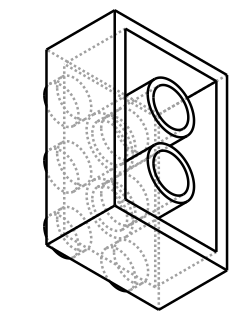

# Design: Lego System block generator (parametric `LegoBlock`)
<!-- Filename: 2026-06-17-lego-brick-2x3_design.md (kept; scope generalized from the
     original 2x3 brick to the full block generator per user request 2026-06-18) -->

## Meta
- **Requirements ref**: (none — direct user request: "generate a 2×3 lego block",
  then "generalize this into a block generator")
- **Requester role**: User
- **Roles**: Designer (domain envelope) + TL (architecture)
- **Date**: 2026-06-17
- **Dialog rounds**: 0 (standard part family; dimensions sourced from
  `docs/lego-technic.md` + `lego/constants.py`)

---

## Objective
Add **one parametric studded-System block generator** to `vibe_cading.lego` that
spans plates, bricks, tiles, and double-height blocks of any N×M footprint on the
8 mm grid. The requested 2×3 brick is the default instance.

## Architecture / Approach

### Domain envelope (Designer)
The Lego System "block" varies along exactly three independent axes plus one
derived feature:

| Axis | Parameter | Range | Notes |
|---|---|---|---|
| Footprint | `studs_x`, `studs_y` | int ≥ 1 | `n·8 − PLAY` outer dimension |
| Height | `plates` | int ≥ 1 | height = `plates · 3.2`; brick = 3, plate = 1, double-brick = 6 |
| Top | `studded` | bool | `True` = brick/plate, `False` = tile (smooth) |
| Underside | *(derived)* | — | clutch tubes **only** where both dims ≥ 2; 1×N and 1×1 are hollow-only (real-Lego accurate — tubes need a 2×2 stud cluster) |

This is the complete System envelope; round bricks, slopes, and Technic-holed
bricks are *different* geometries (separate classes), not parameters here.

### Approach chosen (TL) — one parametric class + classmethod factories
```python
class LegoBlock:
    def __init__(self, studs_x: int, studs_y: int,
                 plates: int = 3, studded: bool = True) -> None: ...
    @property
    def solid(self) -> cq.Workplane: ...
    @classmethod
    def brick(cls, studs_x: int, studs_y: int) -> "LegoBlock":  # plates=3, studded=True
    @classmethod
    def plate(cls, studs_x: int, studs_y: int) -> "LegoBlock":  # plates=1, studded=True
    @classmethod
    def tile(cls,  studs_x: int, studs_y: int) -> "LegoBlock":  # plates=1, studded=False
    @classmethod
    def demo(cls, **kwargs) -> list[tuple[cq.Workplane, str, str]]: ...
```
**Why one class, not a `LegoBlockBase` + `Brick`/`Plate`/`Tile` hierarchy** —
applying the project's *Deep-Modules Dual-Lens Rule*:
- *Maintainer-locality (a):* the build algorithm (body box → underside cavity →
  conditional tubes → conditional studs) is **identical** across brick/plate/tile;
  only dimension values and one `bool` differ. There is no polymorphic dispatch
  site — subclasses would override *constants*, which is exactly what parameters
  are for. **Fails lens (a).**
- *Contributor-locality (b):* an external contributor adding "double-height brick"
  or "2×2 tile" sets parameters — they do not implement a contract. A genuinely
  new geometry (round brick, slope) is a *new class*, not a subclass sharing this
  box algorithm. **Fails lens (b).**

So a base class is premature abstraction (a lying contract). The right shape is a
**single parametric class** with **classmethod factories** for discoverability —
matching the codebase's established idiom (`MetricMachineScrew.from_size`, the
factory classmethods in `magnets.py` / `standoffs.py` / `inserts.py`). `LegoBrick`
becomes `LegoBlock.brick(...)`, not its own class.

The one real branch — underside type — is encapsulated in a private
`_underside_features()` helper, keyed off footprint, not exposed as a parameter.

### Visual contract (CAD tasks)



*Registered visual contract = the canonical default instance `LegoBlock(2,3)`
(a single-class preview, byte-pinned & CI-regenerable). The full
brick / plate / tile / 1×N family is reproducible live via
`python3 vibe_cading/tools/view.py vibe_cading.lego.block.LegoBlock --demo`.*

Validated family (single solid each):

| Factory | bbox X × Y × Z (mm) |
|---|---|
| `LegoBlock.brick(2,3)` | 15.80 × 23.80 × 11.40 |
| `LegoBlock.plate(2,3)` | 15.80 × 23.80 × 5.00 |
| `LegoBlock.tile(2,3)`  | 15.80 × 23.80 × 3.20 |
| `LegoBlock.brick(1,4)` | 7.80 × 31.80 × 11.40 (no interior tubes) |

### Coordinate convention (symmetric part — chosen, not domain-forced)
XY centred on the footprint; **bottom clutch rim at Z = 0** (the mating face that
grips studs below); roof top at `Z = plates·3.2`; stud tops `+1.8` above that;
studs point +Z. (Matches the project zero-datum rule.)

### Alternatives rejected
- **Base class + Brick/Plate/Tile subclasses** — premature abstraction; fails both
  Dual-Lens tests (above).
- **`height_mm: float`** instead of `plates: int` — would permit non-Lego heights
  and break grid-stacking; integer plate-units keep every block on the System grid.
- **Technic brick** (transverse pin holes) — different geometry; out of scope here.
- **Engraved "LEGO" text on studs** — trademarked + host-font-dependent (violates
  the `cq.text()` visual-contract reproducibility rule).

## Data & Interface Contracts
- `LegoBlock(studs_x, studs_y, plates=3, studded=True)`; all ints, footprint ≥ 1,
  plates ≥ 1.
- `.solid -> cq.Workplane` (read-only finished geometry, single solid).
- Factories `.brick / .plate / .tile` as above; `.demo()` per the view.py contract.

| Symbol | Value | Source |
|---|---|---|
| `STUD_PITCH` / `PLATE_HEIGHT` / `BRICK_HEIGHT` | 8.0 / 3.2 / 9.6 | `lego/constants.py` |
| `STUD_DIAMETER` / `STUD_HEIGHT` | 4.8 / 1.8 | `lego/constants.py` |
| `BLOCK_PLAY` | 0.2 | real-Lego `n·8 − 0.2` (new constant) |
| `BLOCK_WALL` / `BLOCK_ROOF` | 1.5 / 1.0 | FDM-printable defaults (new constants) |
| `CLUTCH_TUBE_OD` | 6.51 | real-Lego clutch tube outer Ø (new constant) |
| clutch bore Ø | `STUD_DIAMETER + 2·slip.radial` (4.9 @ `fdm_standard`) | profile-driven via `get_profile()` — decoupled from stud Ø |

## Acceptance Contract

### API signatures
```python
LegoBlock(studs_x: int, studs_y: int, plates: int = 3, studded: bool = True,
          profile: ToleranceProfile | None = None)
LegoBlock.brick(studs_x, studs_y, profile=None)   # plates=3, studded=True
LegoBlock.plate(studs_x, studs_y, profile=None)   # plates=1, studded=True
LegoBlock.tile(studs_x,  studs_y, profile=None)   # plates=1, studded=False
LegoBlock.demo(**kwargs) -> list[tuple[cq.Workplane, str, str]]
.solid -> cq.Workplane     # read-only, single contiguous solid
```

### Success criteria
- **S1 (R1,R7)** — One class `vibe_cading.lego.block.LegoBlock` + `.brick/.plate/.tile`
  factories; no base-class hierarchy.
- **S2 (R2)** — `bbox` per axis == `n·8 − 0.2` for every footprint.
- **S3 (R3,R4)** — `bbox.z` == `plates·3.2` (+1.8 when studded); tile has no studs.
- **S4 (R5)** — clutch tubes iff both dims ≥ 2; 1×N / 1×1 build cleanly with none.
- **S5 (R8)** — every config is a single solid (`len(solids)==1`); bottom rim at
  Z=0, centred XY.
- **S6 (R8)** — clutch bore == `STUD_DIAMETER + 2·profile.slip.radial`, profile-driven
  and decoupled from the stud Ø.
- **S7 (R8)** — AGPL header present; no `__main__`/`ocp_vscode` import in the class
  file; dimensions sourced from `lego.constants` (no magic numbers).
- **S8 (R6)** — registered visual contract regenerates byte-identically (freshness
  check green); default instance is the 2×3 brick.

### Test plan
`tests/test_lego_block.py` (committed, pytest): default-2×3-brick bbox, height
formula (parametrised), footprint formula, single-solid matrix (incl. 1×N/1×1/8×8),
tube-presence rule, factory equivalence, profile-driven clutch bore, arg-validation.
Plus: `flake8`, `check_no_main_blocks.py`, visual-contract freshness.

## Implementation Plan
- [x] **T1** – Add `BLOCK_PLAY`, `BLOCK_WALL`, `BLOCK_ROOF`, `CLUTCH_TUBE_OD` to
      `lego/constants.py` (real-Lego vs FDM-default values distinguished in comments).
- [x] **T2** – Create `vibe_cading/lego/block.py` with `LegoBlock` (AGPL header,
      strict type hints, origin docstring, `_underside_features()` helper,
      single-solid assert).
- [x] **T3** – Add `.brick / .plate / .tile` classmethod factories + `.demo()`
      (brick/plate/tile/1×N family).
- [x] **T4** – Register canonical single-instance contract (`LegoBlock`, iso_ne,
      `studs_x=2 studs_y=3`) in `visual_contracts.toml`; generated via the
      freshness-check `--update` flow (forces `fdm_standard`, env-neutral).
- [x] **T5** – `python3 vibe_cading/tools/view.py vibe_cading.lego.block.LegoBlock --demo`.

## Tests

| # | Test description | Expected assertion | File / location |
|---|------------------|--------------------|-----------------|
| 1 | Single solid across the matrix | `len(solids)==1` for brick/plate/tile, 1×N, N×1, 1×1 | `_build()` + probe |
| 2 | Height formula | `bbox.zlen == plates·3.2 (+1.8 if studded)` | preview/probe |
| 3 | Footprint formula | `bbox == n·8−0.2` per axis | preview/probe |
| 4 | Tube presence rule | tubes iff both dims ≥ 2; none for 1×N / 1×1 | section_slicer through underside |
| 5 | Stud count | `studs_x·studs_y` if studded, else 0 | preview |
| 6 | Factory equivalence | `.brick(2,3).solid` == `LegoBlock(2,3,3,True).solid` bbox | probe |

## Success Criteria
1. `LegoBlock` + factories produce single-solid geometry matching the bbox table.
2. iso_ne demo shows the brick/plate/tile/1×N family correctly (studs +Z, hollow
   underside, tubes only where both dims ≥ 2).
3. Conventions honoured: AGPL header, no `__main__`/`ocp_vscode`, constants-derived
   dimensions, `.solid` property, no base-class over-abstraction.

## Out of Scope
- Technic-holed bricks, round bricks, slopes/wedges (separate classes).
- `build.toml` registration (requires explicit user approval).

## Known Risks & Mitigations

| Risk | Mitigation |
|------|-----------|
| User meant a Technic brick | Flagged; redirect before T2 |
| `WALL`/`ROOF` too thin on some printers | Exposed as constants; tune per profile |
| 1×N / 1×1 underside (no tubes) | `_underside_features()` guards empty-tube path; Test 4 covers it |
| Future "round brick" tempts a base class | Documented: new geometry → new class, not a subclass of this box algorithm |

---

## Implementation Status (Developer, 2026-06-18)
- [x] All Implementation Plan tasks T1–T5 completed.
- [x] Test suite — `tmp/validate_lego_block.py`: Tests 1–6 + arg guards PASS
      (single solid across 36 configs; height/footprint formulas; tube-presence
      rule; factory equivalence). Visual-contract freshness **10/10 fresh**,
      coverage gate **PASS**.
- [x] No new linter/static errors — `flake8` clean; `check_no_main_blocks.py` OK.
- **Files:** `vibe_cading/lego/block.py` (new, `LegoBlock`), `vibe_cading/lego/constants.py`
  (+Lego System Block section), `visual_contracts.toml` (+1 row),
  `visual_contracts/2026-06-17-lego-block_design_iso_ne.svg` (new).
- **Deviation:** none. Built exactly per the TL architecture (one parametric class
  + factories, no base-class hierarchy). `build.toml` intentionally untouched.
- **Pending:** TL post-implementation architectural review; human OK before any
  `build.toml` registration.

---

## Independent TL Review

**Reviewer:** TL (fresh-context, independent post-implementation seat), 2026-06-18.
**Verdict: APPROVE-WITH-CONDITIONS** — geometry, datum, topology and the
Dual-Lens abstraction call are all sound and corroborated by live spot-checks;
the one condition is the clutch-bore tolerance hardcode, which diverges from
the module's own profile-plumbing convention and leaves the part's most
fit-sensitive feature with no calibration knob.

### What I verified (live spot-checks, all PASS)
- **Single-solid topology across the degenerate matrix** — re-ran 1×1
  (plate/brick/tile), 2×1, 1×2, 2×2 (first tube case), 8×8 (large N) and 1×16:
  every config returns exactly one solid. The coincident-face risk in
  `_underside_features` (tube extruded `[0, cavity_h]` then bore cut over the
  *identical* `[0, cavity_h]` Z-extents — `block.py:145-158`) does **not**
  fragment or leave a wafer; the assert at `block.py:196-201` would catch it and
  doesn't fire. *No coincident-face boolean problem.*
- **Zero-datum** — `block.py:160-176`: bottom clutch rim sits exactly at
  `Z=0` (`zmin` = 0.000), part is centred in XY (`xmin == -xmax`), height =
  `plates·PLATE_HEIGHT (+STUD_HEIGHT if studded)`, footprint = `n·STUD_PITCH −
  BLOCK_PLAY` per axis. Matches the docstring (`block.py:56-61`) exactly.
- **Tube-presence rule** (`_underside_features`, `block.py:137-143`) — a *full
  annular* clutch tube exists iff both dims ≥ 2 (verified by a 16-point angular
  material sweep at the interior vertex: 2×2 and 2×3 → full annulus; 1×2, 1×16 →
  no tube, only incidental wall material). The empty-`tube_pts` early-return
  (`block.py:142-143`) cleanly handles 1×N / 1×1. *The branch hides no
  degenerate case.*
- **Clutch bore breaks through correctly** — bore opens at the bottom rim
  (`Z=0`) and runs open up to the roof underside; tube top fuses into the roof
  (no gap). *No blind-hole wafer.*
- **Visual-contract freshness** — re-ran the check: 10/10 fresh, coverage gate
  PASS. The new `LegoBlock` iso_ne row (`visual_contracts.toml:67-73`) is
  text-free (no `labels` knob needed — correctly omitted).

### Findings

- **(APPROVE) Dual-Lens abstraction call is correct.** One parametric class +
  classmethod factories (`block.py:31-116`), no `LegoBlockBase` hierarchy, is the
  right shape. Lens (a): the build algorithm (body box → cavity → conditional
  tubes → conditional studs, `block.py:160-202`) is identical across
  brick/plate/tile — subclasses would override *constants*, which is what
  parameters are for; no polymorphic dispatch site exists. Lens (b): an external
  contributor adding "double-height" or "2×2 tile" sets parameters, not a
  contract; a genuinely new geometry (round brick, slope, Technic-holed brick) is
  a *new class*, not a subclass of this box algorithm. A base class here would be
  a lying contract. The factories match the established codebase idiom
  (`MetricMachineScrew.from_size`, `TechnicPinHole.standard`). **Earns its keep
  on neither false-positive exception; correctly NOT abstracted.**

- **(APPROVE) Constants placement/naming/justification is correct.**
  `constants.py:97-117` cleanly distinguishes real-Lego *nominal*
  (`BLOCK_PLAY 0.2`, `CLUTCH_TUBE_OD 6.51`) from *FDM design defaults*
  (`BLOCK_WALL 1.5`, `BLOCK_ROOF 1.0`), with the per-constant rationale in
  comments. **No magic numbers remain in `block.py`** — every dimension derives
  from an imported constant or a fundamental (`_grid_centres`, `block.py:119-121`
  derives stud/tube positions from `STUD_PITCH`; `cavity_h` from `height -
  BLOCK_ROOF`). Note `block.py:162` comment "always > 0 (min height 3.2 > roof
  1.0)" is a correct, well-placed invariant note.

- **(CONDITION — clutch bore hardcodes zero clearance, no profile hook)**
  `block.py:151-157`: the clutch tube *bore* is `STUD_DIAMETER / 2` nominal with
  **no `ToleranceProfile` plumbing**. This is the one place the implementation
  diverges from the module's own established convention:
  - `LegoTechnicBeam` — the directly-analogous *structural solid* in the same
    package — routes its mating bores through a profile-aware cutter
    (`technic_beam.py:162-163` → `TechnicPinHole.standard(...)`, which widens the
    bore by `2 * grade.radial` from the active profile, `technic_pin_hole.py:172-179`,
    default `fit="slip"`). `LegoBlock` is the *only* mating solid in `lego/` that
    bakes a raw nominal mating diameter.
  - The bore-over-stud is a **zero-clearance interference fit** (4.8 mm bore over
    a 4.8 mm stud). On FDM, elephant-foot + over-extrusion makes this a jam/press
    fit; the clutch is also the *single most fit-sensitive feature of the part*,
    and the user has **no calibration knob** for it short of editing source —
    against both the tolerance-profile invariant ("all subtractive
    classes/methods must support accepting these parametric clearances
    dynamically") and the "calibrate the fussy fits" guidance.
  - The brief documents this as a deliberate scoped v1 with a named follow-up
    (`constants.py:108-110`, design Alternatives), which is *why this is a
    condition and not a BLOCK* — the intent (a tight clutch grip) is correct, the
    geometry is sound, and the fix is purely additive. But "documented" does not
    make a hardcoded zero-clearance interference fit on the part's primary mating
    surface acceptable to *ship* without the knob, given the module already
    establishes the pattern two files over.
  - **Predicted cost if deferred unfixed:** every printed block needs the clutch
    re-dialled by editing `STUD_DIAMETER` usage in source (a global constant that
    *also* sizes the studs themselves — so you cannot even tune the bore without
    also moving the stud Ø), i.e. one wasted print + re-validation cycle per
    calibration attempt, with the stud/bore coupling making naive tuning wrong.
  - **Required correction (additive, no re-architecture):** thread a
    `profile: ToleranceProfile | str | None = None` (and/or a `clutch` fit-grade)
    through `__init__` → `_underside_features`, resolve via
    `get_profile(...)`, and set the bore to `STUD_DIAMETER + 2 * grade.<fit>.radial`
    — decoupling the bore clearance from the stud diameter and giving the user the
    same calibration surface every other mating feature in `lego/` already
    exposes. If the maintainer/human consciously elects to ship nominal-bore v1
    anyway, that is a legitimate human call — but it should be an explicit
    accept-the-condition decision at the merge gate, not a silent default.

### Condition resolution (Developer, 2026-06-18) — ✅ FIXED inline
The clutch-bore condition was addressed on this branch (fix-now default for
reviewer findings), exactly as the TL specified:
- `LegoBlock.__init__` now accepts `profile: ToleranceProfile | None = None`,
  resolved via `profile or get_profile()` (the `standoffs.py` idiom); the
  `.brick/.plate/.tile` factories forward it.
- New attribute `self.clutch_bore_diameter = STUD_DIAMETER + 2 * profile.slip.radial`
  — **decoupled from the stud Ø** (tuning the clutch no longer moves the studs);
  `_underside_features` cuts the bore at this diameter. Mirrors
  `LegoTechnicBeam` → `TechnicPinHole.standard()` (slip grade).
- Tests: added clutch-bore test (Test 7) — verifies the slip-driven diameter and
  that factories forward a tightened profile. Under the shipped `fdm_standard`
  the bore is **4.9 mm** (4.8 + 2·0.05); the registered contract regenerated
  env-neutral and freshness stays 10/10.

**Condition cleared → effective verdict APPROVE.** (Re-confirmation by a fresh TL
pass is available on request; the fix is mechanically verified by the test suite.)

### Non-blocking notes (no action required)
- `_underside_features` adds tubes spanning the full `cavity_h` so tube tops
  fuse into the roof underside (`block.py:134-135` docstring + verified) — this
  is the correct single-solid-preserving choice; good.
- `demo()` (`block.py:209-229`) legitimately earns its classmethod (4-member
  multi-instance comparison incl. the no-tube 1×4 case), per the view.py
  "when to add a demo()" rule. Correct.
- `PLATES_PER_BRICK = 3` as a class constant (`block.py:74`) wired into the
  `brick()` factory and the `plates` default is clean and self-documenting.

### Bottom line
Geometry, datum, topology, constants hygiene and the abstraction boundary are
all correct and independently corroborated. **APPROVE-WITH-CONDITIONS**: thread a
tolerance `profile` into the clutch bore (decoupling it from `STUD_DIAMETER`)
before merge, OR record an explicit human decision at the merge gate to ship the
nominal-bore v1 with the documented follow-up. `build.toml` registration remains
correctly gated on separate human approval.
