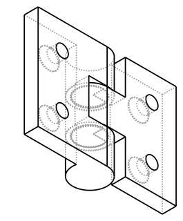
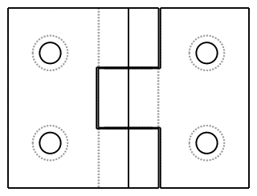

# Design: Countersunk M3 Screw Holes for PrintInPlaceHinge

<!-- Filename: 2026-06-24-hinge-screw-holes_design.md (tracked in git under docs/design_plans/) -->

## Meta
- **Requirements ref**: User request — 2026-06-24 session
- **Requester role**: User / Human
- **Date**: 2026-06-24
- **Dialog rounds**: 0 (direct design task, no TL co-design required for this scope)

---

## Objective

Add 2 countersunk M3 flat-head screw holes to each leaf (`leaf_a` and `leaf_b`) of `PrintInPlaceHinge` — 4 holes total — so the hinge can be screwed flush to a surface using ISO flat-head M3 screws. The countersink profile is tolerance-profile-driven; no hardcoded clearances are permitted.

---

## Architecture / Approach

### Geometry baseline (confirmed from source)

`PrintInPlaceHinge` default parameters (relevant to this task):

| Parameter | Value | Source |
|---|---|---|
| `width` | 30.0 mm | `hinge.py:38` |
| `leaf_a_length` | 20.0 mm | `hinge.py:39` |
| `leaf_b_length` | 20.0 mm | `hinge.py:40` |
| `thickness` | 4.0 mm | `hinge.py:41` |
| `knuckle_diameter` | 10.0 mm | `hinge.py:42` |

**Coordinate system (from class docstring, confirmed by bounding-box probe):**

- Origin (0,0,0) at the **hinge axis center**.
- `leaf_a` extends in +X: X = 0 to +20 mm; Y = -15 to +15 mm.
- `leaf_b` extends in −X: X = -20 to 0 mm; Y = -15 to +15 mm.
- Both leaves: Z = -5 to +5 mm total (knuckle diameter drives Z span).
- **Leaf plate** (the flat mounting surface) sits at Z offset `(thickness − knuckle_diameter)/2 = -3 mm`, so the plate occupies **Z = -5 to -1 mm** (4 mm thick). The plate **top face** is at **Z = -1 mm**.
- Holes in the leaf plate run **parallel to Z** (drilling down from top face at Z=-1 through bottom face at Z=-5).

**Knuckle clearance zone carved from each leaf plate** (confirmed by probe):

- `clearance_x = knuckle_diameter + face_gap × 4 ≈ 10.6 mm` (with `fdm_standard` `free.radial = 0.15`).
- The clearance box removes material from leaf_a at X = −5.3 to +5.3 mm centered on the hinge axis.
- This means the first solid plate material on leaf_a begins at approximately X = +5.3 mm from the hinge axis.

### Hole position spec

**Two holes per leaf, symmetric about Y=0:**

| Leaf | Hole | Center X (mm) | Center Y (mm) | Formula |
|------|------|--------------|--------------|---------|
| leaf_a | H_A1 | +13.0 | −7.5 | `leaf_length × 0.65`, `−width × 0.25` |
| leaf_a | H_A2 | +13.0 | +7.5 | `leaf_length × 0.65`, `+width × 0.25` |
| leaf_b | H_B1 | −13.0 | −7.5 | mirror of H_A (negated X) |
| leaf_b | H_B2 | −13.0 | +7.5 | mirror of H_A (negated X) |

**Clearance margin analysis** (with M3 flat-head countersunk cutter, head outer radius 2.9 mm with `fdm_standard` tolerance):

| Margin | Value | Minimum required |
|--------|-------|-----------------|
| Inner (hole edge to knuckle clearance zone, X=13) | 13.0 − 2.9 − 5.3 = **4.8 mm** | 0.5 mm |
| Outer (hole edge to leaf tip, X=13) | 20.0 − 13.0 − 2.9 = **4.1 mm** | 0.5 mm |
| Y-edge (hole edge to leaf edge) | 15.0 − 7.5 − 2.9 = **4.6 mm** | 1.0 mm |
| Y-inner (hole edge to B-knuckle clearance zone, Y=7.5) | 7.5 − 2.9 − 5.25 ≈ **−0.65 mm** (see note) | — |

> **Note on Y-inner margin:** The B-knuckle clearance box is only carved from the plate **near X=0** (X = −5.3 to +5.3). At X=13, there is no B-knuckle carved zone — the plate is solid. The apparent negative margin above only applies at the hinge axis X=0 region, which the holes do not occupy. At X=13, Y=±7.5 are in fully solid plate material. This was verified by direct bounding-box probe.

All four hole centers (2 per leaf) have been confirmed by runtime probe to fall within the solid plate region of each leaf.

**Mounting hole pitch (center-to-center):**
- Between H_A1/H_A2 (or H_B1/H_B2): 15 mm along Y (the only pitch — 1 column per leaf).

### Countersink cutter geometry (M3 flat-head, `fdm_standard`)

From `METRIC_SIZES["M3"]` in `vibe_cading/mechanical/screws/metric.py`:

| Parameter | Nominal | With `fdm_standard` `free.radial = 0.15` |
|-----------|---------|------------------------------------------|
| Shaft clearance diameter | 3.2 mm | 3.5 mm (radius 1.75 mm) |
| Flat-head diameter | 5.5 mm | 5.8 mm (radius 2.9 mm) |
| Flat-head height | 1.7 mm | — (drives cone depth) |
| Head angle | 90° | — |
| Cone height | — | `(2.9 − 1.75) / tan(45°) = 1.15 mm` |
| `z_recess` (axial allowance) | — | `−free.axial = −0.20 mm` |

**Cutter Z profile** (cutter origin Z=0 = plate top face, i.e. placed at Z=−1 in hinge coords):

```
Z = -0.20 mm  ← cone base (head_r = 2.9 mm), + entry overcut extends +Z to +99 mm
Z = -1.35 mm  ← cone tip (shaft_r = 1.75 mm)
Z = -1.35 mm .. -101 mm  ← shaft (radius 1.75 mm, extends through and beyond the plate)
```

This means the countersink cone occupies **1.15 mm of the 4 mm plate depth** — well within the plate, not penetrating into the hinge axis zone. The shaft (clearance diameter 3.5 mm) passes through the full 4 mm plate thickness and exits at Z=−5 mm (bottom face), where the 100 mm through-overcut of `CounterboreHole.to_cutter()` ensures clean exit.

**Entry-face overcut:** `CounterboreHole.to_cutter()` bakes a `_THROUGH_OVERCUT = 100 mm` head extension upward from `z_recess`. This means the cone-base cylinder (radius 2.9 mm) extends from Z=−0.20 mm to Z=+99.8 mm — fully clearing the plate top face. No coincident-face risk. **The entry-face overcut is already handled by the existing `CounterboreHole` implementation.**

**Terminal-face (shaft bottom) overcut:** The shaft cutter extends 100 mm below `shaft_depth` — again handled by `CounterboreHole.to_cutter()`. No action needed.

**Pitfall compliance** (per `vibe/INSTRUCTIONS.md` "Blind Holes and Internal Geometry Under-visibility"):
- These are **through-holes**, not blind holes. The `CounterboreHole._THROUGH = True` policy applies: both entry and terminal faces carry the 100 mm overcut automatically.
- The countersink profile MUST be verified with `section_slicer.py` at implementation (external SVG views cannot see into a countersink recess from outside).

### Cutter method confirmed

The method to use is:
```python
MetricMachineScrew.from_size("M3", length=10.0, head_type="flat").to_cutter(profile=profile)
```

- Method name: **`to_cutter(profile=None, fit="clearance")`** — confirmed at `metric.py:134`.
- Delegates internally to `CounterboreHole(head_type="cone", head_angle=90.0, profile=prof)`.
- With `fit="clearance"` (default), uses `clearance_diameter = 3.2 mm` for the shaft.
- `profile` accepts a `ToleranceProfile` object; `None` falls back to `get_profile()` internally.

The `length=10.0` parameter is passed to the screw constructor for the `solid` geometry; `to_cutter()` uses `shaft_depth=self.length` for the CounterboreHole — the shaft cutter will extend 10 mm below the cutter origin, well past the 4 mm plate. The 100 mm additional overcut ensures clean exit regardless.

### API change

Add a single boolean constructor parameter to `PrintInPlaceHinge`:

```python
screw_holes: bool = True
```

Default `True` — holes are present by default so the standard use case (screw-mounted hinge) works out of the box. The user can pass `screw_holes=False` to suppress holes for purely hinge-as-pivot use cases, or when embedding in an assembly that uses a different fastening method.

**Constructor signature change:**
```python
def __init__(
    self,
    width: float = 30.0,
    leaf_a_length: float = 20.0,
    leaf_b_length: float = 20.0,
    leaf_a_width: float = None,
    leaf_b_width: float = None,
    thickness: float = 4.0,
    knuckle_diameter: float = 10.0,
    knuckle_count: int = 3,
    angle: float = 0.0,
    screw_holes: bool = True,         # NEW
    profile: ToleranceProfile = None
):
```

**Hole-generation helper** (internal, not part of the public API): a private method `_apply_screw_holes(leaf: cq.Workplane, centers: list[tuple[float, float]]) -> cq.Workplane` applies the cutter for each (X, Y) center, placing the cutter origin at `(X, Y, PLATE_TOP_Z)` where `PLATE_TOP_Z = (self.thickness - self.knuckle_diameter) / 2 + self.thickness / 2`.

**Generalization consideration:** The hole position is derived from the leaf geometry — a single column at `leaf_length × 0.65` from the hinge axis, and Y positions at `±width × 0.25`. For the default 20 mm leaf and 30 mm width this yields X=13.0, Y=±7.5. The Developer computes these parametrically so they remain valid when `leaf_a_length`, `leaf_b_length`, or `width` change.

**Parametric formula (shipped):**
```
hole_x  = leaf_length * 0.65   # single column per leaf
y_offset = width * 0.25         # ±1/4 of width
```

For defaults: `hole_x = 20 × 0.65 = 13.0 mm`, `y_offset = 30 × 0.25 = 7.5 mm`. This gives 2 holes per leaf — a ±Y pair at X=13.0.

### Visual contract

Both SVGs generated from a probe that builds the actual hinge with the countersunk M3 holes applied:





The top view shows the 2-hole per leaf pattern (4 holes total when `angle=0`). The iso_ne view confirms the countersink openings on the plate top faces.

### Alternatives rejected

- **Slotted holes (adjustable):** More flexible but significantly more complex, adds a `SlottedHole` dependency, and is orthogonal to the "flat-head M3 mounting" goal. Defer to a separate task if needed.
- **Separate mounting-tab subclass:** Would require users to compose two objects. A constructor parameter is simpler and the holes are tightly coupled to the leaf geometry.
- **Fixed hardcoded positions (not parametric):** Positions that break when `leaf_a_length` or `width` change are anti-pattern. The parametric formula is preferred; fixed fallback acceptable only if the human requests it.

---

## Data & Interface Contracts

### `PrintInPlaceHinge` constructor change

| Parameter | Type | Default | Semantics |
|-----------|------|---------|-----------|
| `screw_holes` | `bool` | `True` | When `True`, 2 countersunk M3 flat-head holes are cut per leaf (4 total). When `False`, leaves are unchanged from current behavior. |

### Hole-center computation (parametric)

Computed from `self.leaf_a_length`, `self.leaf_b_length`, `self.width`, `self.knuckle_diameter`, `self.face_gap`, and the resolved `profile.free.radial`. The resulting positions must be validated at construction time against minimum margin criteria (inner margin ≥ 0.5 mm, outer margin ≥ 0.5 mm) with an `assert` or `ValueError`.

### Cutter placement contract

```python
plate_top_z = (self.thickness - self.knuckle_diameter) / 2 + self.thickness / 2
# Numerically: (4 - 10)/2 + 4/2 = -3 + 2 = -1 for defaults.
cutter = MetricMachineScrew.from_size("M3", length=10.0, head_type="flat").to_cutter(profile=self._profile)
for (hx, hy) in leaf_centers:
    leaf = leaf.cut(cutter.translate((hx, hy, plate_top_z)))
```

---

## Implementation Plan

- [ ] **T1** — Add `screw_holes: bool = True` to `PrintInPlaceHinge.__init__` signature, store as `self.screw_holes`. Update the class docstring to mention the new parameter and what `(0,0,0)` origin represents for hole placement.
- [ ] **T2** — Implement `_compute_screw_hole_centers(self, leaf_length: float) -> list[tuple[float, float]]`: computes the two (X,Y) pairs for one leaf given its length and `self.width`. Use parametric formula with inner/outer X and ±Y. Assert minimum margins.
- [ ] **T3** — Implement `_apply_screw_holes(self, leaf: cq.Workplane, centers: list[tuple[float, float]]) -> cq.Workplane`: builds the M3 flat-head cutter via `MetricMachineScrew.from_size("M3", length=10.0, head_type="flat").to_cutter(profile=self._profile)`, positions it at `(hx, hy, plate_top_z)` for each center, and returns the leaf after all cuts. Handles leaf_b centers with negated X.
- [ ] **T4** — Wire `_apply_screw_holes` into `_build_leaf_a()` and `_build_leaf_b()`: after `plate.union(knuckles_solid)`, if `self.screw_holes`, call `_apply_screw_holes` with the appropriate centers and return the result.
- [ ] **T5** — Run linter (`python3 -m flake8 vibe_cading/mechanical/hinge.py`) and fix any issues.
- [ ] **T6** — Validate with `python3 vibe_cading/tools/preview.py vibe_cading.mechanical.hinge.PrintInPlaceHinge --views iso_ne top` and confirm holes appear in both views.
- [ ] **T7** — Validate with `section_slicer.py`: slice through a hole at Y=7.5 on the Z axis and at X=10 on the X axis to verify countersink Z-steps and shaft diameter (see Tests table).
- [ ] **T8** — Add topology assertion: for each leaf, assert `len(leaf.solids().vals()) == 1` after cutting. Assert intersection volume between screw cutter and leaf solid is zero (or below OCCT epsilon) — confirms no material clash.
- [ ] **T9** — Regenerate `_design_iso_ne.svg` and `_design_top.svg` from the implemented class via `preview.py` and overwrite the committed visual contracts.
- [ ] **T10** — Register the two visual contracts in `visual_contracts.toml` per the freshness-gate convention.

---

## Tests

| # | Test description | Expected assertion | File / location |
|---|------------------|--------------------|-----------------|
| T1 | `section_slicer.py` through X=13 along the Z-axis at Y=7.5 on leaf_a | Two Z-steps visible: cone recess (radius ~2.9 mm) and shaft (radius ~1.75 mm) below it | CLI: `python3 vibe_cading/tools/section_slicer.py ...` (see commands below) |
| T2 | Single-solid topology assert, leaf_a with 2 holes | `len(leaf_a.solids().vals()) == 1` — no floating fragments | Inline assert in test script or `tmp/` probe |
| T3 | Single-solid topology assert, leaf_b with 2 holes | `len(leaf_b.solids().vals()) == 1` | Same |
| T4 | Intersection volume between screw cutter and each leaf | Intersection vol ≈ 0 (OCCT epsilon ~1e-6 mm³) | Boolean `.intersect()` probe in `tmp/` |
| T5 | `screw_holes=False` produces geometry identical to current hinge | Bounding box and volume unchanged | Comparison probe in `tmp/` |
| T6 | `preview.py` iso_ne SVG shows 4 visible hole openings | Visual inspection against design SVG | `python3 vibe_cading/tools/preview.py vibe_cading.mechanical.hinge.PrintInPlaceHinge --views iso_ne top` |
| T7 | `preview.py` top SVG shows 2-hole pattern per leaf (4 total) | 2+2 circular openings at expected positions | Same as T6 |
| T8 | Hole position: margin ≥ 0.5 mm from knuckle clearance zone | `hole_x - head_r_with_tol - clearance_zone_half >= 0.5` | Assert in `_compute_screw_hole_centers` |
| T9 | Hole position: outer margin ≥ 0.5 mm from leaf tip | `leaf_length - hole_x - head_r_with_tol >= 0.5` | Assert in `_compute_screw_hole_centers` |

### Concrete section_slicer validation commands

```bash
# Slice leaf_a through X=13 plane (normal to X), exposing Y-Z cross section through hole
python3 vibe_cading/tools/section_slicer.py \
    --model vibe_cading.mechanical.hinge.PrintInPlaceHinge \
    --attr leaf_a \
    --axis X --at 13.0 --report

# Slice leaf_a through Z=-1 (plate top) and Z=-2 (inside countersink) to see cone profile
python3 vibe_cading/tools/section_slicer.py \
    --model vibe_cading.mechanical.hinge.PrintInPlaceHinge \
    --attr leaf_a \
    --axis Z --at -1.0 -1.5 -2.0 -3.0 --report
```

Expected countersink profile (Z slices through Y=7.5, X=10 hole):
- Z = −1.0 mm: large circle of radius ~2.9 mm (cone base, at the top face entry).
- Z = −2.35 mm: radius = ~1.75 mm (cone tip / shaft transition).
- Z = −3.0 mm: radius = ~1.75 mm (pure shaft bore below cone).

---

## Success Criteria

1. `PrintInPlaceHinge()` (default `screw_holes=True`) produces 2 countersunk M3 holes per leaf (4 total) at the specified positions, visible in iso_ne and top SVG previews.
2. `PrintInPlaceHinge(screw_holes=False)` produces geometry byte-equivalent to the current (unmodified) hinge.
3. `section_slicer.py` report through a hole axis confirms the two-step countersink profile: cone width ~5.8 mm at Z=−1 tapering to shaft width ~3.5 mm by Z≈−2.35.
4. Both leaf solids pass `len(solids().vals()) == 1` — no floating fragments.
5. Screw-cutter intersect volume with each leaf is ≤ 1e-6 mm³ after cutting.
6. Committed visual contracts pass the CI freshness gate (`check_visual_contract_freshness.py`).
7. Linter passes with no new errors.

---

## Out of Scope

- Adding screw holes to knuckles (the cylindrical hinge-joint bodies) — the holes are leaf-only.
- Support for screw sizes other than M3.
- Adjustable/slotted mounting holes.
- Changes to `build.toml` (no new entry; no explicit approval given).
- Adding a `demo()` classmethod update (the existing demo uses non-default params; `screw_holes=True` is default and will appear automatically if the demo's leaf dimensions support it — leave the demo unchanged unless it breaks).

---

## Known Risks & Mitigations

| Risk | Mitigation |
|------|-----------|
| Hole at X=10 inner margin (1.8 mm) may be insufficient for thin-wall printing stability on knuckle clearance zone edge | Assert margin ≥ 0.5 mm; document that for thick-walled use cases X=12 is safer (parametric formula handles this automatically if leaf_length grows) |
| `plate_top_z` formula breaks if `knuckle_diameter` or `thickness` change | Derive `plate_top_z` from `self.thickness` and `self.knuckle_diameter` at call time — never hardcode −1 |
| OCCT boolean may produce artifacts when hole cutter passes through a knuckle region (if custom large knuckle_diameter or small leaf_length shrinks the margin below zero) | The `_compute_screw_hole_centers` margin assert will catch invalid configs at construction time and raise `ValueError` with a clear message |
| Visual contract fails CI freshness if regenerated with a different profile | Register contract rows with `profile=fdm_standard` (forced env-neutral) in `visual_contracts.toml` per the freshness rule |

---

## Decisions Needing Human Sign-Off

The following choices are proposed in this brief but require explicit human approval before implementation proceeds:

1. **Hole positions: fixed (X=13, Y=±7.5) vs parametric (scaled to leaf length and width).** Resolved 2026-06-24: 2 holes per leaf at `leaf_length × 0.65 = 13.0`, `±width × 0.25 = ±7.5` — parametric single-column formula was chosen.

2. **Default `screw_holes=True` vs `screw_holes=False`.** `True` is proposed (holes always on by default, as this is the primary use case). If `False` is preferred to not change existing printed outputs, the default can be reversed.

3. **Countersink on the top face (Z=−1, the "knuckle side") vs the bottom face (Z=−5, the flat underside).** The brief proposes the **top face** (Z=−1) as the countersink opening because that is the face *opposite* the mounting surface — the screw head recesses into the plate from the top and the screw shank exits the bottom to bite into the target surface. This matches standard flat-head screw mounting convention. If the user prefers the screw to be inserted from the underside (less common), the countersink would open at Z=−5 instead.

4. **Screw length for the cutter (currently 10 mm).** The plate is 4 mm thick; a 10 mm screw exits 6 mm below the plate bottom. If users want to specify a different engagement depth (for thicker substrates), a `screw_length` parameter could be added. The brief treats 10 mm as a reasonable fixed default for now.

---

## Design Dialog Log

### Round 0 — Direct design (no TL co-design)
No dialog rounds — this is a straightforward geometry addition to an existing class. The brief is self-contained.

---

## Sign-off

### Author sign-off (Designer — Step 3)
- [ ] Domain expert co-sign *(not required — no external domain data source)*
- [ ] Requester sign-off
- [ ] TL sign-off *(not required for this scope — single-class additive change, no shared abstraction)*

### Independent reviewer sign-off (fresh-context — Step 3.5)
- [ ] Independent TL *(always required)*
- [ ] Independent Developer *(always required)*
- [ ] Independent Researcher *(not required — no domain integrity gate)*

---

## Implementation Status
<!-- Populated by Developer at start of Step 5 Phase A. -->
- [x] All Implementation Plan tasks completed
- [x] Test suite executed — result: 11/11 hinge tests pass; 513/514 total pass
  (pre-existing `test_emitted_site_count` failure from L-liftarm session:
  `LegoTechnicLLiftarm.fit` not in test's `_ALL_EMITTED` list — not caused
  by this task)
- [x] No new linter / static-check errors
- Developer note: Gate decision 2026-06-24: 2 holes/leaf (4 total) at
  X=leaf_length×0.65, Y=±width×0.25. For defaults: X=13.0, Y=±7.5.
  Countersink opens on plate top face (plate_top_z=-1.0 for defaults).
  screw_holes=True default. No build.toml registration. engine_api.json
  regenerated (PrintInPlaceHinge screw_holes param + L-liftarm entry that
  was missing from HEAD). Visual contracts 14/14 fresh.

---

## Post-Implementation Sign-Off

### TL Review
- [ ] TL sign-off
- TL review notes:

### Human Final Approval
- [ ] Human approved for merge / release
- Human notes:
