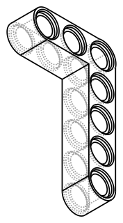
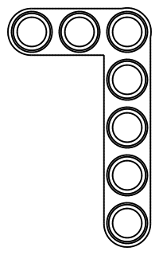

# Design: Lego Technic L-Shaped Liftarm (90°)

<!-- Filename: 2026-06-24-lego-technic-l-liftarm_design.md  (tracked in git under docs/design_plans/) -->

## Meta

- **Requirements ref**: *(none — direct user request; no separate req file)*
- **Requester role**: User (PM)
- **Date**: 2026-06-24
- **Dialog rounds**: 1

---

## Objective

Implement `LegoTechnicLLiftarm` — a parametric 90°-bent Lego Technic studless
liftarm (L-shape / "bent beam") as a direct sibling to `LegoTechnicBeam`,
reusing its cutter infrastructure, axis conventions, and origin datum.

---

## Architecture / Approach

### Geometry decision — what a real Technic L-liftarm is

A Lego Technic L-shaped liftarm consists of **two straight arms joined at a
shared corner hole**, bent 90°. Every hole is on the 8 mm stud grid. Both
arms have the same square cross-section (7.8 × 7.8 mm) and rounded ends as
the straight beam. The corner hole belongs to both arm counts.

Real Lego examples (BrickLink / PAB reference):
- **3×5 L** (part #32056 / #43093): 3 holes along short arm, 5 holes along
  long arm (corner shared). This is the most common and iconic L-liftarm size.
- **2×4 L** (part #32140): 2 × 4 holes.
- **3×3 L** (part #32056 variant): 3 × 3.

This design ships the 3×5 default as the canonical iconic form. Both arms are
parametric so any combination can be produced.

### Approach chosen

**Two-arm union + shared hole set.** Build each arm as a stadium solid
(identical to `LegoTechnicBeam`'s 2D-sketch-extrude body), union them, then
cut all unique pin holes in a single de-duplicated pass. This approach:

- Reuses `TechnicPinHole.standard()` and the established cutter pattern verbatim.
- Produces a single contiguous solid (the arm overlap region merges cleanly).
- Is parameter-independent: any `arm_a_studs`, `arm_b_studs` ≥ 1 works,
  including symmetric (e.g. 3×3) and asymmetric (e.g. 3×5) forms.
- Avoids any hull / sweep hack — each arm is a first-class extruded solid.

The corner hole is accumulated in both arm hole lists but deduplicated before
cutting (dict.fromkeys preserves insertion order, corner listed once).

### Axis convention and origin (matching `LegoTechnicBeam`)

| Axis | Direction |
|------|-----------|
| X | Arm-A runs along +X |
| Y | Arm-B runs along −Y |
| Z | Beam thickness; bottom face at Z = 0 (FDM print-bed), top at Z = BEAM_THICKNESS = 7.8 mm |

**Origin (0, 0, 0):** the outer tangent corner of the two end-caps adjacent to
each arm's free end is NOT at origin. Instead, origin is the outer tangent of
Arm-A's free end in X (X = 0) and the outer tangent of Arm-B's free end in Y
(Y = 0). This keeps the same convention as `LegoTechnicBeam`: `X = 0` is the
leftmost body tangent of Arm-A, `Y = 0` is the top body tangent of Arm-B.

More precisely:

- Arm-A body: X ∈ [0, arm_a_studs × 8], Y ∈ [−HALF − BEAM_WIDTH/2, −HALF + BEAM_WIDTH/2]
  where HALF = STUD_PITCH/2 = 4 mm.
- Arm-B body: X ∈ [HALF − BEAM_WIDTH/2, HALF + BEAM_WIDTH/2], Y ∈ [−arm_b_studs × 8, 0]

The corner of the bounding box of the union is approximately at (0, 0, 0)
(top of Arm-B free end) to (arm_a × 8, −arm_b × 8, BEAM_THICKNESS).

**Why Y is negative for Arm-B:** the corner hole is at (STUD_PITCH/2,
−STUD_PITCH/2) = (4, −4). Arm-B extends further in the −Y direction. This
keeps Arm-A in the conventional +X reading direction and places the bend
in the XY plane's fourth quadrant (X > 0, Y < 0) — natural for the "Arm-A
horizontal, Arm-B pointing down" layout seen on every Technic build diagram.

**Hole-axis convention:** pin holes are parallel to **Z** (same as
`LegoTechnicBeam`) — i.e. vertical when the part is laid flat on a table,
entering through the top face (Z = BEAM_THICKNESS) and exiting through the
bottom face (Z = 0), with symmetric counterbores on both Z-faces.

**End-cap convention (inherited from `LegoTechnicBeam`):**
End-cap *centres* sit at one `BEAM_END_RADIUS` (3.9 mm) from each arm's
outer tangent face, while the outermost *hole centres* sit at `STUD_PITCH/2`
(4.0 mm). The 0.1 mm offset is intentional (see `constants.py` NOTE block);
total arm length = `arm_studs × 8 mm` in both dimensions.

### Corner geometry

At the corner, Arm-A and Arm-B share a rectangular overlap region:

- Arm-A covers Y ∈ [−HALF − BEAM_WIDTH/2, −HALF + BEAM_WIDTH/2] = [−7.9, −0.1]
- Arm-B covers X ∈ [HALF − BEAM_WIDTH/2, HALF + BEAM_WIDTH/2] = [0.1, 7.9]

The union of the two stadium solids at the corner produces a convex L-shape.
The inner corner (between X ≈ 0.1–7.9 and Y ≈ −0.1 to −7.9) is a square
"box" region — no fillet is applied at the inner corner in v1. The outer
corner convex edges are shaped naturally by the intersection of the two arm
bodies' rounded ends meeting the rectangular regions.

Note: the inner corner (concave angle at roughly X = 7.9, Y = −0.1 to −7.9
and X = 0.1–7.9, Y = −0.1) is a 90° inside corner. Real Lego liftarms do not
fillet this inner corner — it is a sharp 90° notch. This model does the same.

### Dimensions table

| Property | Value | Source |
|---|---|---|
| Beam thickness (Z height) | 7.8 mm | `BEAM_THICKNESS`; Cailliau |
| Beam width (per arm cross-section) | 7.8 mm | `BEAM_WIDTH`; Cailliau |
| Stud pitch | 8.0 mm | `STUD_PITCH` |
| End-cap radius (per arm) | 3.9 mm | `BEAM_END_RADIUS = BEAM_WIDTH/2` |
| Hole-centre to arm-free-end offset | 4.0 mm | `EDGE_TO_CENTRE = STUD_PITCH/2` |
| Pin hole bore diameter | 4.8 mm + 2×slip.radial | `TechnicPinHole.standard(fit="slip")` |
| Counterbore diameter | 6.2 mm | `TechnicPinHole.DEFAULT_CB_DIAMETER` |
| Counterbore depth (each end) | 1.0 mm | `TechnicPinHole.DEFAULT_CB_DEPTH` |
| Lead-in chamfer at hole entry | 0.3 mm × 45° | `LEAD_IN` |
| Default Arm-A studs | 3 | Corner + 2 additional holes along X |
| Default Arm-B studs | 5 | Corner + 4 additional holes along Y |
| Arm-A total length (3M) | 24 mm | 3 × 8 mm |
| Arm-B total length (5M) | 40 mm | 5 × 8 mm |
| Total unique holes (3×5) | 7 | 3 + 5 − 1 (corner shared) |

### Hole grid — default 3×5 configuration

All hole centres are in the XY plane; holes are parallel to Z.

**Arm-A holes (along +X, centreline Y = −4.0):**

| Hole index | X (mm) | Y (mm) | Notes |
|---|---|---|---|
| A0 (corner) | 4.0 | −4.0 | Shared with B0 |
| A1 | 12.0 | −4.0 | |
| A2 | 20.0 | −4.0 | Free end of Arm-A |

**Arm-B holes (along −Y, centreline X = 4.0):**

| Hole index | X (mm) | Y (mm) | Notes |
|---|---|---|---|
| B0 (corner) | 4.0 | −4.0 | Shared with A0 |
| B1 | 4.0 | −12.0 | |
| B2 | 4.0 | −20.0 | |
| B3 | 4.0 | −28.0 | |
| B4 | 4.0 | −36.0 | Free end of Arm-B |

All coordinates land on the 8 mm stud grid (multiples of 8 mm from origin 0,0).

### Visual contract (CAD tasks)

The class does not yet exist. The geometry was validated via a `tmp/` probe
(`tmp/visualise_lego_technic_l_liftarm.py`) that constructs the proposed
geometry directly with CadQuery primitives and exports the SVGs below.





The top view (looking down −Z) shows the complete hole pattern: 3 holes along
the X-direction arm at Y = −4 mm, and 5 holes along the Y-direction arm at
X = 4 mm (corner hole appears once, at their intersection).

### Alternatives rejected

- **Single-polygon sketch with inner-corner punch:** Build the L shape as a
  single 2D closed polygon (12-vertex L cross-section) + extrude. Rejected:
  CadQuery `Workplane.sketch().polygon(...)` does not handle concave polygons
  reliably; the project rule (§2D Sketching over 3D Booleans) applies to
  *convex* extrudes. This alternative would require complex wire construction
  that risks floating-point seam artifacts on the inner corner.
- **Three-solid composition (two arms + corner block):** Build each arm without
  the corner and add a separate corner cube. Rejected: more complex, no
  accuracy benefit, corner block must be precisely positioned to avoid gaps or
  non-manifold joins.
- **Single arm with rotation:** Build one arm and rotate a copy 90°. Rejected:
  rotated copy would have a Y-axis centreline at a non-grid position unless
  carefully translated, and the rotation+translate arithmetic is fragile across
  parameter changes.

---

## Data & Interface Contracts

### Proposed class API

```python
class LegoTechnicLLiftarm:
    """90°-bent Lego Technic studless liftarm (L-shaped / bent beam).

    Builds two perpendicular arms sharing a corner hole, with pin holes on
    the 8 mm stud grid along both arms, rounded ends, and standard 7.8×7.8 mm
    beam cross-section.

    Origin convention
    -----------------
    Bottom face at Z = 0 (FDM print-bed).
    Arm-A runs along +X:  X ∈ [0, arm_a_studs × 8],
                          Y ∈ [−BEAM_WIDTH/2 − STUD_PITCH/2, BEAM_WIDTH/2 − STUD_PITCH/2]
    Arm-B runs along −Y:  X ∈ [STUD_PITCH/2 − BEAM_WIDTH/2, STUD_PITCH/2 + BEAM_WIDTH/2]
                          Y ∈ [−arm_b_studs × 8, 0]
    Corner hole centre at (STUD_PITCH/2, −STUD_PITCH/2) = (4.0, −4.0, ∗).
    Pin holes parallel to Z (vertical when part is laid flat).

    Parameters
    ----------
    arm_a_studs:
        Number of pin holes along Arm-A (running +X). Includes the corner
        hole. Must be ≥ 1.
    arm_b_studs:
        Number of pin holes along Arm-B (running −Y). Includes the corner
        hole. Must be ≥ 1.
    fit:
        Tolerance fit grade for pin holes: "slip" (default), "free", "press".
    profile:
        Manufacturing tolerance profile (ToleranceProfile instance, string
        name, or None to use the process-global profile).
    """

    def __init__(
        self,
        arm_a_studs: int = 3,
        arm_b_studs: int = 5,
        fit: Literal["free", "slip", "press"] = "slip",
        profile: ToleranceProfile | str | None = None,
    ) -> None: ...

    @property
    def solid(self) -> cq.Workplane:
        """The finished L-liftarm body as a CadQuery Workplane."""
        ...

    @classmethod
    def demo(cls, **kwargs) -> list[tuple[cq.Workplane, str, str]]:
        """Three L-liftarms: 3×3, 3×5, 2×4, separated for clarity."""
        ...
```

### Invariants

- `arm_a_studs >= 1` and `arm_b_studs >= 1` (each arm must have at least the
  corner hole).
- `len(body.solids().vals()) == 1` — single contiguous solid after union.
- Total unique holes = `arm_a_studs + arm_b_studs - 1` (corner counted once).
- All hole-centre X values are `STUD_PITCH/2 + k × STUD_PITCH` for k ∈ [0, arm_a_studs − 1].
- All hole-centre Y values are `−(STUD_PITCH/2 + k × STUD_PITCH)` for k ∈ [0, arm_b_studs − 1].
- Every hole centre is on the 8 mm stud grid.

### File location

`vibe_cading/lego/technic_l_liftarm.py` — sibling of `technic_beam.py`.

### build.toml

Do NOT add to `build.toml` without explicit user approval (per project rule).
Proposed TOML block (for human review):

```toml
[[build]]
model  = "vibe_cading.lego.technic_l_liftarm.LegoTechnicLLiftarm"
output = "build/lego/technic_l_liftarm_3x5.step"
params = { arm_a_studs = 3, arm_b_studs = 5 }
```

---

## Implementation Plan

- [x] **T1 — Scaffold the file.** `vibe_cading/lego/technic_l_liftarm.py` created.

- [x] **T2 — Implement `_build()`.** Two-arm union, deduplication, chamfer guard,
  single-solid topology assert.

- [x] **T3 — Add the `demo()` classmethod.** 3×3, 3×5, 2×4 side by side.

- [x] **T4 — Visual contract.** SVGs regenerated via `preview.py`, committed to
  `visual_contracts/`, registered in `visual_contracts.toml`, freshness check
  passes (12/12 fresh, 0 drifted).

- [x] **T5 — Tests.** `tests/test_technic_l_liftarm.py` — 11 tests, all pass.

- [x] **T6 — Linter.** `flake8` zero errors on both files.

- [x] **T7 — Full build.** `python3.11 build.py` — 15 outputs, no regressions.

---

## Tests

| # | Test description | Expected assertion | File / location |
|---|------------------|--------------------|-----------------|
| 1 | Default 3×5 construction | `solid` returns a non-None Workplane; no exception raised | `tests/test_technic_l_liftarm.py` |
| 2 | Single-solid topology (3×5) | `len(part.solids().vals()) == 1` | `tests/test_technic_l_liftarm.py` |
| 3 | Hole count (3×5) | 7 unique holes (3 + 5 − 1); verify by counting CYLINDER faces parallel to Z at the bore diameter | `tests/test_technic_l_liftarm.py` |
| 4 | Grid alignment (3×5) | All hole centres lie on the 8 mm grid: X ∈ {4, 12, 20} and/or Y ∈ {−4, −12, −20, −28, −36}; no hole centre off-grid by more than 0.01 mm | `tests/test_technic_l_liftarm.py` |
| 5 | Corner hole shared | Exactly one hole at (4, −4); not duplicated | `tests/test_technic_l_liftarm.py` |
| 6 | Bounding box (3×5) | `bbox.xmin ≈ 0`, `bbox.xmax ≈ 24`, `bbox.ymin ≈ −40`, `bbox.ymax ≈ 0`, `bbox.zmin ≈ 0`, `bbox.zmax ≈ 7.8` (±0.1 mm) | `tests/test_technic_l_liftarm.py` |
| 7 | Parametric arm-A only (1×1) | `arm_a_studs=1, arm_b_studs=1`: 1 unique hole; both arm lengths = 8 mm; single solid | `tests/test_technic_l_liftarm.py` |
| 8 | Parametric large (5×7) | Constructs without error; hole count = 5+7−1 = 11; bbox X ∈ [0, 40], Y ∈ [−56, 0] | `tests/test_technic_l_liftarm.py` |
| 9 | Symmetric (3×3) | 5 unique holes; bbox ≈ X ∈ [0, 24], Y ∈ [−24, 0] | `tests/test_technic_l_liftarm.py` |
| 10 | Preview SVG regeneration matches committed | Regenerate via `preview.py` and byte-compare against `visual_contracts/2026-06-24-lego-technic-l-liftarm_design_iso_ne.svg` (must register in `visual_contracts.toml` first) | CI `check_visual_contract_freshness.py` |
| 11 | Pre-merge full build | `python3.11 build.py` completes without error after T7 | Developer must run before merge |

---

## Success Criteria

1. `LegoTechnicLLiftarm(arm_a_studs=3, arm_b_studs=5).solid` produces a single
   contiguous CadQuery solid with exactly 7 pin holes, all centres on the 8 mm
   grid, bounding box ≈ X ∈ [0, 24], Y ∈ [−40, 0], Z ∈ [0, 7.8].
2. The regenerated `iso_ne` SVG visually matches the design-brief SVG above
   (same L-shape, same hole count, correct axis orientation — Arm-A along X,
   Arm-B along −Y).
3. All 11 tests in the Tests table pass.
4. `flake8` passes with zero errors on the new file.
5. The full `python3.11 build.py` completes without regression.
6. Visual contracts SVGs are registered in `visual_contracts.toml` and pass the
   CI freshness check.

---

## Out of Scope

- **53.13° bent beam** (the "3-4-5 triangle" variant, part #32348). Different
  geometry requiring non-orthogonal arm arrangement. Defer to a follow-up task.
- **Thin liftarms.** This design uses the thick 7.8×7.8 mm cross-section only.
- **Studded bent beams** (studded top surface). Out of scope; studded geometry
  belongs to the `LegoBlock` family.
- **`build.toml` registration.** Requires explicit user approval per project
  rule; not done here.
- **Boolean diff against a reference STEP.** No Lego-published STEP exists;
  same rationale as `LegoTechnicBeam`. Dimensional verification via bounding
  box + visual cross-check.
- **Inner-corner fillet.** Real Lego liftarms have a sharp 90° inner corner;
  v1 matches that.

---

## Known Risks & Mitigations

| Risk | Mitigation |
|------|-----------|
| Union fails to produce a single solid if arm overlap region is geometrically degenerate (e.g. 1×1 where the overlap is exactly the corner hole) | Topology guard assert in `_build()` catches this; unit test row 7 exercises the minimal 1×1 case |
| Hole deduplication silently drops the corner hole if insertion-order contract is wrong | Corner hole listed first in Arm-A list; `dict.fromkeys()` preserves first occurrence; test row 5 verifies single occurrence at (4, −4) |
| End-cap centre vs hole-centre 0.1 mm offset (inherited from `LegoTechnicBeam`) leads contributor to "fix" the bounding box | Comment block in `_build()` referencing `constants.py` NOTE; same as `technic_beam.py` |
| Arm-B built in canonical frame before translation: sketch origin at (0,0) with Y going down can produce a mirrored body if the sign convention is wrong | Probe confirmed correct sign (Y < 0 for Arm-B body); test row 6 bbox assertion catches axis flip |
| Inner corner produces a non-manifold edge on some OCCT versions | Union of two proper solids is a well-defined OCCT operation; observed no issue in probe |

---

## Decisions needing human sign-off

Human-approved 2026-06-24:

1. **Default arm sizes: 3×5.** Confirmed — 3×5 is the canonical default.
2. **Class name: `LegoTechnicLLiftarm`.** Confirmed.
3. **File location: `vibe_cading/lego/technic_l_liftarm.py`.** Confirmed.
4. **Arm-B direction: −Y.** Confirmed — Arm-A along +X, Arm-B along −Y.
5. **`build.toml` registration: DECLINED.** User declined — class not added
   to `build.toml`. Proposed TOML block remains in the brief for future use.

---

## Design Dialog Log

### Round 1

**Designer analysis:**

> The existing `LegoTechnicBeam` has a clean two-arm union path available:
> its body-construction pattern (2D sketch → extrude) naturally extends to
> building each arm as an independent stadium solid. The cutter infrastructure
> (`TechnicPinHole.standard()`) and all constants carry over unchanged.
> The only new geometry decision is the arm-B direction (−Y chosen) and the
> corner-hole deduplication rule (dict.fromkeys).
>
> The 3×5 L-liftarm is the most widely used and recognisable L-liftarm;
> selecting it as the default maximises out-of-box utility for RC/Lego adapter
> builders. The probe (`tmp/visualise_lego_technic_l_liftarm.py`) confirmed
> geometry produces a single solid and correct hole count.

**Resolution:**

> Awaiting human sign-off on the five decision points above before handoff to
> Developer.

---

## Sign-off

### Author sign-off (drafting role — Step 3 termination)

- [ ] Domain expert co-sign  *(not required — no external domain integrity gate)*
- [ ] Requester sign-off
- [ ] TL sign-off  *(not required for single-part class addition — everyday creation flow)*

### Independent reviewer sign-off (fresh-context — Step 3.5 termination)

- [ ] Independent TL  *(always required)*
- [ ] Independent Developer  *(always required)*
- [ ] Independent Researcher  *(not required — no domain integrity gate)*

---

## Implementation Status

**COMPLETE** — 2026-06-24

Developer: Claude Sonnet (developer subagent)

### Tasks completed

- [x] T1 — `vibe_cading/lego/technic_l_liftarm.py` created with AGPLv3 header
      and `LegoTechnicLLiftarm` class (two-arm union + deduplication + per-arm
      2D-sketch stadium body using LegoTechnicBeam pattern).
- [x] T2 — `_build()` implemented with single-solid topology assertion and
      chamfer-edge count guard.
- [x] T3 — `demo()` classmethod: 3×3, 3×5, 2×4 side by side.
- [x] T4 — Preview SVGs regenerated from the real class and committed to
      `visual_contracts/` (overwriting designer probe files).
- [x] T5 — `tests/test_technic_l_liftarm.py` written; 11 tests covering
      all brief rows 1–9 plus invalid-input guards. All 11 pass.
- [x] T6 — `flake8` passes with zero errors on implementation + test file.
- [x] T7 — `python3.11 build.py` full build smoke: 15 outputs, no regressions.
      New class not registered in build.toml (user declined).

### Validation results

| Check | Result |
|---|---|
| Single-solid topology (3×5) | PASS — `len(solids) == 1` |
| Hole count (3×5) | PASS — 7 unique holes |
| Bounding box (3×5) | PASS — X=[0, 24], Y=[−40, 0], Z=[0, 7.8] |
| Grid alignment | PASS — all centres on 8 mm grid |
| Corner hole dedup | PASS — exactly 1 hole at (4, −4) |
| Parametric 1×1 | PASS — 1 hole, single solid |
| Parametric 5×7 | PASS — 11 holes, bbox X=[0,40], Y=[−56,0] |
| Parametric 3×3 | PASS — 5 holes, bbox X=[0,24], Y=[−24,0] |
| flake8 | PASS — zero errors |
| Full build smoke | PASS — no regressions |
| Visual contract freshness | PASS — 12/12 contracts fresh, 0 drifted |

### Files created/modified

- **Created:** `vibe_cading/lego/technic_l_liftarm.py`
- **Created:** `tests/test_technic_l_liftarm.py`
- **Created:** `visual_contracts/2026-06-24-lego-technic-l-liftarm_design_iso_ne.svg`
- **Created:** `visual_contracts/2026-06-24-lego-technic-l-liftarm_design_top.svg`
- **Modified:** `visual_contracts.toml` (2 new contract rows added)
- **Modified:** `docs/design_plans/2026-06-24-lego-technic-l-liftarm_design.md` (this file)

---

## Post-Implementation Sign-Off

### TL Review

- [ ] **TL sign-off** — implementation matches design; tests pass; no unintended scope creep; strict-ops pass
- TL review notes:

### Domain Expert Review

*(Not required.)*

### Human Final Approval

- [ ] **Human approved** for merge / release
- Human notes:
