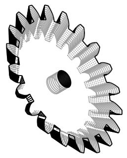
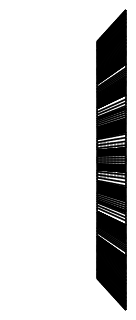

# Design: BevelGear model class (straight-bevel involute gear)
<!-- Filename: 2026-06-26-bevel-gear_design.md  (tracked in git under docs/design_plans/) -->

## Meta
- **Requirements ref**: [docs/design_plans/2026-06-26-bevel-gear_req.md](2026-06-26-bevel-gear_req.md)
- **Requester role**: @admin (design-flow driven on user request)
- **Date**: 2026-06-26
- **Dialog rounds**: 3 (TL self-adversarial co-design; recorded in the Design Dialog Log)
- **Domain integrity gate**: YES (gear-family pitch-cone derivation + Tredgold tooth approximation)

---

## Objective
Add a `BevelGear` class to `vibe_cading/mechanical/gears/` that generates a
straight-bevel involute gear as a single contiguous CadQuery solid via the
`Gear` ABC contract, deriving the pitch-cone angle from `(teeth, mate_teeth,
shaft_angle)` and building the conical teeth by a Tredgold scaled-section loft
between a heel cross-section at `Z = 0` and a uniformly-scaled toe
cross-section.

## Architecture / Approach

### Approach chosen

`BevelGear` inherits from `Gear` (the ABC), exactly like `SpurGear`, and reuses
the shared 2D involute primitive `Gear.gear_blank_with_teeth_2d(...)`. It owns
only the **conical loft** (the bevel-specific construction) plus the
bevel-specific cone math and `mesh_with` override; it borrows everything else
(`__init__` validation, derived radii, `bore_cutter`, `from_iso`,
`center_distance_to`) from the base.

**Datum (zero-datum consistency).** The flat back/mounting face (heel, large
end) sits at `Z = 0`. The body tapers toward the pitch apex in `+Z`; the gear
axis is `+Z`; the pitch circle is centred on `(0, 0)`. This is consistent with
the base ABC's "+Z axis, pitch circle on (0,0), bottom face at Z=0" convention —
the bevel simply tapers as Z increases instead of extruding straight.

**Cone geometry (the bevel math).** From the requirements' confirmed
parameterisation, with `Σ = shaft_angle` (default 90°):

| Quantity | Formula | Miter check (m=2, z=20, z_mate=20, Σ=90°) |
|----------|---------|--------------------------------------------|
| Pitch radius (heel/outer) | `R_p = module · teeth / 2` | 20.0 mm |
| Pitch-cone angle | `δ = atan2(sin Σ, (mate_teeth/teeth) + cos Σ)` | 45.0° |
| Outer cone distance | `A_o = R_p / sin δ` | 28.284 mm |
| Face-width convention limit | `face_width ≤ A_o / 3` | 9.428 mm |
| Hard constraint | `face_width < A_o` (apex unreachable otherwise) | 6 < 28.28 ✓ |
| Toe scale factor | `s = (A_o − face_width) / A_o` | 0.78787 |
| Toe-plane axial offset | `z_toe = face_width · cos δ` | 4.2426 mm |
| Pitch apex on axis | `Z_apex = R_p / tan δ` | 20.0 mm |
| Virtual back-cone tooth count | `z_v = teeth / cos δ` | 28.284 |

All formulae above were **verified numerically** during design (see Design
Dialog Log Round 1): the toe pitch radius computed two independent ways —
`R_p · s` (scale) and `R_p − z_toe · tan δ` (geometry) — agree to 1e-15, which
proves that uniformly scaling the heel profile about `(0, 0)` by `s` and placing
it at `Z = z_toe` produces cones (root / pitch / tip) that all converge to the
**same on-axis apex** at `Z = Z_apex`. That is the geometric heart of the
Tredgold scaled-section loft: scaling about the axis preserves the
apex-convergence invariant exactly.

**Tredgold simplification (documented in the docstring per R4).** True
bevel-gear teeth are *spherical involutes* (octoid form) whose profile varies
continuously along the cone. The Tredgold approximation replaces each spherical
section with a planar involute section of the **back-cone-developed** (virtual)
gear, and here we further simplify to a **scaled-section loft**: heel and toe
are both planar standard-involute sections of the *real* tooth count, the toe a
uniform scale of the heel. The faces are axis-perpendicular planes (not true
back-cone planes), and root/pitch/tip cones share a common apex (no separate
face/root apex offset). This is the accepted method for 3D-printed bevel gears
at FDM tolerances and is explicitly in scope per the requirements.

**Build pipeline (`_build`).**
1. `heel_pts = Gear.gear_blank_with_teeth_2d(module, teeth, pressure_angle, n_flank)`
   — the canonical CCW toothed profile, identical to what `SpurGear` extrudes.
2. `toe_pts = [(x·s, y·s) for (x, y) in heel_pts]` — same point count, same
   winding, scaled about `(0, 0)`. **Vertex correspondence is preserved by
   construction** (point `i` of the toe is the radial scale of point `i` of the
   heel), so the ruled loft connects corresponding vertices and produces exact
   straight-ruled cone faces with no twist.
3. Build two `cq.Wire.makePolygon(...)` closed wires — heel at `Z = 0`, toe at
   `Z = z_toe` — and loft with
   `cq.Solid.makeLoft([heel_wire, toe_wire], ruled=True)`. Explicit wire-list
   loft (verified working in the design probe) keeps full control over vertex
   correspondence; `ruled=True` gives straight ruled faces (correct for cones)
   rather than a smooth B-spline skin.
4. Cut the axial through-bore with
   `Gear.bore_cutter(self.bore, face_width=self._axial_height)` where
   `self._axial_height = z_toe`. **Critical:** the cutter height must span the
   *actual* axial extent of the lofted body (`z_toe`), **not** the nominal
   `face_width` (which is the slant-measured cone-distance span, larger than the
   axial height — `6.0` vs `4.24` for the miter sample). `bore_cutter` extrudes
   `Z = −overcut … z_toe + overcut`, so it breaks cleanly through the `Z = 0`
   heel face and the `Z = z_toe` toe face with overcut at both ends (no
   zero-thickness wafer — R6).
5. Assert single solid.

### Visual contract (CAD tasks)

The proposed scaled-section-loft geometry, rendered from a `tmp/` probe using
raw CadQuery primitives (miter-pair member: module=2, teeth=20, mate_teeth=20,
face_width=6, bore=5, shaft_angle=90), reusing `preview.py`'s exact export
options so the bytes will match the eventual class's `preview.py` output:





The iso_ne view shows the toothed conical body with the heel (large toothed
end) at the base and the taper rising toward the apex; the front view shows the
characteristic bevel taper profile and the central bore breaking through both
faces. The probe asserted `len(solids) == 1` (volume 4092.9 mm³).

**Registration rows (to be added to `visual_contracts.toml` at IMPLEMENTATION,
once the real class exists).** These cannot be byte-pinned now because the
class does not yet exist; the developer adds them in Phase A and regenerates the
committed bytes from the real class. Proposed rows:

```toml
[[contract]]
svg   = "visual_contracts/2026-06-26-bevel-gear_design_iso_ne.svg"
model = "vibe_cading.mechanical.gears.bevel.BevelGear"
view  = "iso_ne"
[contract.params]
module = 2.0
teeth = 20
mate_teeth = 20
face_width = 6.0
bore = 5.0

[[contract]]
svg   = "visual_contracts/2026-06-26-bevel-gear_design_front.svg"
model = "vibe_cading.mechanical.gears.bevel.BevelGear"
view  = "front"
[contract.params]
module = 2.0
teeth = 20
mate_teeth = 20
face_width = 6.0
bore = 5.0
```

`BevelGear` engraves **no** `cq.Workplane.text()` labels, so the contract is a
pure function of tracked geometry (no `labels = false` knob needed) and is
byte-reproducible across hosts. The committed design SVGs above were rendered
from the geometry probe; at implementation the developer **must** regenerate
them from the real class via `preview.py` and confirm the bytes match (the
freshness check will then enforce `committed == regenerable`).

**Scope of the byte-pinned contract (TL-C2).** The registered `[[contract]]`
rows pin the **single-gear BODY geometry only** — the conical toothed body,
bore, and axis convention of one `BevelGear` instance, rendered host-independent
(label-free, `fdm_standard`). The `demo()` / `mesh_with` **apex-rotation POSE**
(the two-instance meshing layout) is explicitly **OUT** of the byte-pinned
contract surface and **must NOT** be registered as a contract — its
rotation/translation convention is visual-only (carries the not-a-simulation
disclaimer), is not a geometric invariant the contract exists to protect, and
would couple the freshness check to a layout choice rather than to part
geometry.

### Alternatives rejected

- **True spherical-involute (octoid) tooth profile** — geometrically correct
  bevel teeth lie on spheres centred at the apex; the profile is a spherical
  involute that changes shape continuously along the cone. Rejected: it requires
  per-section profile re-derivation (no reuse of the shared
  `gear_blank_with_teeth_2d` primitive), is dramatically heavier to tessellate
  and boolean, and offers no benefit at FDM print tolerances. The requirements
  explicitly scope it out; Tredgold is the accepted method.
- **`twistExtrude`-style single-profile taper** — there is no native
  "taper-extrude with scaling" that also scales the cross-section; a draft/taper
  extrude tapers the *walls* but not the toothed profile uniformly about the
  axis, so the teeth would not converge to the apex. The two-wire loft is the
  correct primitive.
- **Smooth (B-spline) loft (`ruled=False`)** — would skin the heel→toe
  transition with a curved surface, bowing the cone faces. Cone faces are
  straight-ruled; `ruled=True` is geometrically correct and also cheaper.
- **Cutting the bore before the loft** (bore the 2D heel/toe profiles, then
  loft a hollow section) — rejected: lofting two *annular* (doughnut) wires is
  fragile in OCCT (inner/outer wire pairing ambiguity) and offers no benefit.
  Loft the solid body, then subtract a straight cylindrical `bore_cutter` — the
  bore axis is the gear axis, so a straight cylinder is exactly right.

## Data & Interface Contracts
<!-- Domain integrity gate is YES — full contract specification. -->

### Constructor signature

```python
class BevelGear(Gear):
    def __init__(
        self,
        module: float,
        teeth: int,
        mate_teeth: int,
        face_width: float,
        bore: float | Bore | None = None,
        pressure_angle: float = 20.0,
        shaft_angle: float = 90.0,
        n_flank: int = 32,
    ) -> None: ...
```

- `module`, `teeth`, `face_width`, `bore`, `pressure_angle` carry the base-class
  semantics (validated by `super().__init__`, which also enforces the real-tooth
  undercut floor `z_min = int(2 / sin²φ)`).
- `mate_teeth: int` — the meshing partner's tooth count; drives the pitch-cone
  angle. Must be a positive int.
- `shaft_angle: float = 90.0` — Σ in degrees between the two shaft axes. Default
  90° (the dominant RC/Lego right-angle case).
- `n_flank: int = 32` — involute flank sample count, forwarded to
  `gear_blank_with_teeth_2d` (same as `SpurGear`).

### Derived attributes (set in `__init__` after `super().__init__`)

| Attribute | Value | Invariant |
|-----------|-------|-----------|
| `self.mate_teeth` | `int(mate_teeth)` | `> 0` |
| `self.shaft_angle` | `float(shaft_angle)` | `0 < Σ < 180` |
| `self.pitch_angle` | `math.atan2(sin Σ, (mate_teeth/teeth) + cos Σ)` (radians) | `0 < δ < Σ` |
| `self.outer_cone_distance` | `self.pitch_radius / sin δ` (= `A_o`) | `> 0` |
| `self._toe_scale` | `(A_o − face_width) / A_o` (= `s`) | `0 < s < 1` (guaranteed by `face_width < A_o` check) |
| `self._axial_height` | `face_width · cos δ` (= `z_toe`) | `0 < z_toe < A_o` |
| `self.pitch_apex_z` | `self.pitch_radius / tan δ` (= `Z_apex`) | on `+Z` axis; `mesh_with` poses about it |
| `self.virtual_teeth` | `teeth / cos δ` (= `z_v`) | documented; governs *true* involute undercut (note vs the real-tooth floor) |

`self.pitch_angle` is exposed as a **public attribute** (degrees-or-radians: store
radians, the standard for the codebase's math; expose a clear name). Name it
`self.pitch_angle` storing **radians** to match `phi = math.radians(...)` usage
in the base — document the unit in the docstring.

### Validation / error semantics (run in `__init__`, after `super().__init__`)

1. `mate_teeth <= 0` → `ValueError` (positive int required).
2. `not (0.0 < shaft_angle < 180.0)` → `ValueError` (Σ must be a proper shaft
   angle; 0 or 180 give degenerate/parallel cones).
3. **`face_width >= self.outer_cone_distance` → `ValueError`** (hard) — the cone
   physically ends at the apex; a face width that reaches or overruns `A_o`
   leaves no toe section (`s ≤ 0`). This is a geometric impossibility, not a
   convention, so it is a hard error (resolved open question b, below).
4. `face_width > self.outer_cone_distance / 3.0` → **warn, do not raise**
   (`warnings.warn(...)`, `UserWarning`) — exceeding the `A_o/3` *convention*
   produces a valid-but-stubby gear with a small toe; advisory only. (Resolved
   open question b.)

The base-class `face_width <= 0` and undercut-floor checks already fire inside
`super().__init__`; the bevel checks run after so `self.pitch_radius` /
`self.outer_cone_distance` are available.

### `.solid` contract

- **`solid -> cq.Workplane`** (read-only `@property`, returns the cached
  `self._solid`), per the `Gear` ABC `@abstractmethod`.
- **Invariants:** exactly one contiguous solid
  (`len(.solids().vals()) == 1`); heel face at `Z = 0`; toe face at
  `Z = self._axial_height`; central bore (if `bore is not None`) breaks through
  both faces; pitch circle centred on `(0, 0)`. No `.to_cutter()` (a gear is
  positive geometry, like `SpurGear` — no cutter side).

### `mesh_with` override contract

```python
def mesh_with(
    self, other: "Gear", phase: float = 0.0,
) -> tuple[cq.Workplane, cq.Workplane]: ...
```

- Returns `(self_solid, other_solid)` posed with **coincident pitch apexes** and
  the mate axis rotated by `self.shaft_angle` from self's `+Z` axis.
- **MUST compute the pose from scratch — MUST NOT call `Gear.center_distance_to`
  or `super().mesh_with` (TL-C1 / Dev-C1).** The base `mesh_with` encodes a
  *parallel-axis* layout: it translates the mate by `center_distance_to(other) =
  pitch_radius + other.pitch_radius` along `+X` and applies a same-module raise.
  That center-distance is meaningful only for parallel shafts; for an
  intersecting-axis apex pose it is geometrically wrong (the two gears would be
  pushed apart by a parallel-axis distance instead of sharing an apex).
  `center_distance_to` would also raise on a cross-module pair. The override
  therefore builds the apex-coincident + Σ-tilt pose directly with explicit
  `rotate`/`translate` calls and never delegates upward.
- `self` stays at the origin (heel at `Z = 0`, apex at `Z = self.pitch_apex_z`).
- The mate is posed so **its apex coincides with self's apex** on self's axis and
  its own axis makes angle `Σ = shaft_angle` with `+Z`. Concretely: rotate the
  mate about the common apex point so that the mate's axis tilts by `Σ`. A clean
  construction: translate the mate up by `(self.pitch_apex_z − other_apex_z)`
  along `+Z` won't suffice alone for differing apex heights — instead position
  the mate so its apex lands on self's apex, then rotate it by `Σ` about an axis
  through the apex perpendicular to the plane of the two shaft axes (e.g. the
  apex-anchored `+X` axis for the canonical layout). `phase` (degrees) adds a
  tooth-phase spin about the mate's own axis for visual tooth interleave, mirror
  of the base method's phase knob.
- **Carries the base method's not-a-simulation disclaimer verbatim**: visual
  layout for previews/assemblies only; not a rolling-mesh kinematic simulation.
  The exact rotation-axis convention is a developer implementation detail *within*
  this contract (the architectural requirement is "coincident apexes + Σ-tilted
  mate axis + phase knob + disclaimer"); the developer picks the concrete
  `rotate((apex), (axis), angle)` calls and documents them.
- **Type note:** `other` is typed `Gear` to match the base signature, but a
  geometrically-correct intersecting-axis pose only makes sense for another
  `BevelGear` (the apex/Σ pose is bevel-specific). The override should pose any
  `Gear`'s `.solid` but document that the intended/meaningful mate is a
  `BevelGear` (typically the complementary member computed from
  `mate_teeth`/`teeth` swapped). Do **not** narrow the signature (LSP — keep the
  base `Gear` type); document the intent.

### `from_iso` contract

`from_iso` is **inherited unchanged** from `Gear`. It already forwards `**kwargs`
to `cls(...)`, so `mate_teeth`, `shaft_angle`, and `n_flank` flow through:
`BevelGear.from_iso(module=2.0, teeth=20, mate_teeth=20, face_width=6,
shaft_angle=90)` validates `module ∈ ISO_STANDARD_MODULES` then constructs.
**No override needed** — verified against the base signature
(`module, teeth, face_width, bore=None, pressure_angle=20.0, **kwargs`). The
only requirement (R8) is a *test* proving the forwarding works and that a
non-ISO module raises.

### `demo()` contract

```python
@classmethod
def demo(cls, **kwargs) -> list[tuple[cq.Workplane, str, str]]:
    """Show a meshing miter bevel pair posed at the shaft angle."""
```

- Returns a **two-instance meshing pair** (R9): construct a `BevelGear` and its
  complement, call `self.mesh_with(other)`, return both posed solids as
  `(solid, name, color)` triples — the same shape `assemble()`/`view.py --demo`
  consume. A single-instance `view.py BevelGear` cannot show the
  intersecting-axis pose, which is exactly the `demo()` earns-its-keep criterion.
- `**kwargs` accepted and ignored if unused (signature contract).

### Package re-export (R10)

Add `from .bevel import BevelGear` to
`vibe_cading/mechanical/gears/__init__.py` and append `"BevelGear"` to
`__all__`, alongside `SpurGear`/`HelicalGear`/`RackGear`.

## Implementation Plan
<!-- Sequenced atomic tasks for @developer. -->

- [x] **T1** – Create `vibe_cading/mechanical/gears/bevel.py` with the AGPLv3
  header (copy verbatim from `spur.py`), module docstring documenting the
  Tredgold scaled-section-loft simplification and the common-apex assumption.
  The docstring **MUST also state (Designer-C1)** that the tooth profile is
  arrayed using the **real tooth count `z`** (not the Tredgold *virtual*
  back-cone count `z_v = z / cos δ`) at both the heel and the toe section — i.e.
  a *further* simplification beyond strict back-cone-developed Tredgold, where
  the planar section would use `z_v`. Calling this out explicitly satisfies R4's
  "document the simplification". **No** `ocp_vscode` import, **no**
  `if __name__ == "__main__"` block (CI-enforced).
- [x] **T2** – Implement `BevelGear(Gear).__init__` with the signature above:
  call `super().__init__(module, teeth, face_width, bore, pressure_angle)`, then
  validate `mate_teeth`, `shaft_angle`, the hard `face_width < A_o` check, and
  the soft `A_o/3` warning; compute and store all derived attributes
  (`pitch_angle`, `outer_cone_distance`, `_toe_scale`, `_axial_height`,
  `pitch_apex_z`, `virtual_teeth`). Store `self._n_flank`. Set
  `self._solid = self._build()`. The **class docstring** carries the same
  real-tooth-count disclosure as T1 (the section is arrayed with the real `z`,
  not `z_v`) so it is visible at the public-API surface, not only in the module
  docstring.
- [x] **T3** – Implement `_build()`: heel profile via
  `Gear.gear_blank_with_teeth_2d`, toe profile by scaling about `(0,0)`. Build
  the two loft wires with the close flag **explicit**:
  `heel_wire = cq.Wire.makePolygon([cq.Vector(x, y, 0.0) for x, y in heel_pts],
  close=True)` and `toe_wire = cq.Wire.makePolygon([cq.Vector(x, y,
  self._axial_height) for x, y in toe_pts], close=True)` — **`makePolygon`
  defaults `close=False` (Dev-C2)**, which would yield an open shell and a failed
  loft, so `close=True` MUST be passed on both wires. Then
  `cq.Solid.makeLoft([heel_wire, toe_wire], ruled=True)`, then
  `gear.cut(Gear.bore_cutter(self.bore, face_width=self._axial_height))` when
  `bore is not None`. End with
  `assert len(result.solids().vals()) == 1, "Expected single solid, got multiple pieces"`.
- [x] **T4** – Implement `solid` `@property` returning `self._solid`.
- [x] **T5** – Override `mesh_with(self, other, phase=0.0)` per the contract:
  coincident apexes, mate axis tilted by `shaft_angle`, `phase` spin, base
  not-a-simulation disclaimer in the docstring. Pose `self.solid` and
  `other.solid`; return the pair. **Compute the pose from scratch — MUST NOT
  call `Gear.center_distance_to` or `super().mesh_with` (TL-C1 / Dev-C1)**: those
  encode a parallel-axis center-distance + same-module raise that is meaningless
  for (and would raise on a cross-module pair against) an intersecting-axis apex
  pose. Use explicit `rotate`/`translate` calls anchored on the shared apex.
- [x] **T6** – Implement `demo()` classmethod returning a meshing miter pair via
  `mesh_with`.
- [x] **T7** – Re-export `BevelGear` from
  `vibe_cading/mechanical/gears/__init__.py` (`from .bevel import BevelGear`;
  add to `__all__`).
- [x] **T8** – Write `tests/mechanical/test_bevel_gear.py` covering the Tests
  table below (mirror the structure of `tests/test_hinge.py`).
- [x] **T9** – Regenerate the two design SVGs from the **real class** via
  `python3 vibe_cading/tools/preview.py vibe_cading.mechanical.gears.bevel.BevelGear --params module=2.0 teeth=20 mate_teeth=20 face_width=6.0 bore=5.0 --views iso_ne front`,
  copy over the committed
  `visual_contracts/2026-06-26-bevel-gear_design_{iso_ne,front}.svg`, and add the
  two `[[contract]]` rows (shown above) to `visual_contracts.toml`. Run
  `python3 vibe_cading/tools/check_visual_contract_freshness.py` and confirm it
  passes (`committed == regenerable`).
- [x] **T10** – Regenerate the engine-API wire contract:
  `python3 vibe_cading/tools/gen_engine_api.py` (new public class must enter the
  contract deterministically; CI's `test_gen_check_green_and_deterministic`
  reds otherwise).

## Tests
<!-- PRE-MERGE REPRESENTATIVE-SCALE row included (T_SCALE). -->

| # | Test description | Expected assertion | Maps to | File / location |
|---|------------------|--------------------|---------|-----------------|
| T_BUILD | Default-ish miter construct (m=2,z=20,mate=20,fw=6,bore=5) builds | `g.solid is not None`; instance of `BevelGear`/`Gear` | R1, R2 | `tests/mechanical/test_bevel_gear.py` |
| T_SINGLE | Final solid is one contiguous body | `len(g.solid.solids().vals()) == 1` | R1, R6 | same |
| T_REUSE | `_build` calls `Gear.gear_blank_with_teeth_2d` (no re-derived involute math) — assert via profile-length parity vs `SpurGear`'s profile for same m/z/φ | heel point count equals `SpurGear` profile point count | R2 | same |
| T_SIG | Constructor accepts `module, teeth, mate_teeth, face_width, bore, pressure_angle, shaft_angle, n_flank` | construct with all kwargs succeeds | R3 | same |
| T_DELTA | Pitch angle derived, miter pair → 45° | `math.isclose(math.degrees(g.pitch_angle), 45.0)` for z==mate at Σ=90 | R3 | same |
| T_DELTA_ASYM | Asymmetric pair (z=12, mate=24, Σ=90) → δ = atan(12/24) ≈ 26.565° | `isclose(degrees(δ), 26.565, abs_tol=1e-3)` | R3 | same |
| T_LOFT | Toe section is the heel uniformly scaled about (0,0) → cones converge: `R_p·s ≈ R_p − z_toe·tan δ` | `isclose(toe_Rp_scale, toe_Rp_geom, abs_tol=1e-6)` | R4 | same |
| T_DATUM | Heel face at Z=0, toe face at Z=`_axial_height`, body in [0, z_toe] | bounding box `zmin≈0`, `zmax≈g._axial_height` | R5 | same |
| T_BORE_ROUND | `bore=5.0` (legacy float) breaks through both faces (no wafer) | bore void present at both Z=0 and Z=`_axial_height` planes; section report shows the bore radius at the toe end | R6 | same + `section_slicer.py` (manual/CI) |
| T_BORE_COMPOSABLE | `bore=HexBore(across_flats=5)` and `RoundBore`/`DBore`/`KeyedBore` build single-solid | `len(solids)==1` for each Bore subtype | R6 | same |
| T_BORE_HEIGHT | Bore cutter spans actual axial height not nominal face_width — bore void reaches the toe (Z=`_axial_height`) face | section through toe plane shows the bore | R6 | same |
| T_MESH | `mesh_with(other)` returns 2 posed solids; mate apex coincident with self apex; mate axis tilted by `shaft_angle`. **MUST include a cross-module (asymmetric) pair `teeth != mate_teeth`** (e.g. self z=12/mate=24 and its complement z=24/mate=12) to exercise the from-scratch pose — the inherited `center_distance_to` path raises on cross-module, so this test fails fast if T5 wrongly delegates to base | returns 2 workplanes; both non-empty for both the miter and the cross-module pair (no `ValueError` from a base-delegation); visual disclaimer present in docstring | R7 | same |
| T_FROM_ISO | `BevelGear.from_iso(module=2.0, teeth=20, mate_teeth=20, face_width=6, shaft_angle=90)` builds; `module=2.3` raises `ValueError` | builds for ISO module; raises for non-ISO | R8 | same |
| T_DEMO | `BevelGear.demo()` returns a 2-tuple-list meshing pair | `len(demo) == 2`; each item is `(Workplane, str, str)` | R9 | same |
| T_HYGIENE | File carries AGPLv3 header, no `ocp_vscode`, no `__main__` block; class importable from package | `from vibe_cading.mechanical.gears import BevelGear` works; `check_no_main_blocks.py` clean | R10 | `tests/test_imports.py` + CI lint |
| T_FW_HARD | `face_width >= A_o` raises `ValueError` | `pytest.raises(ValueError)` for `face_width=30` (A_o≈28.28) | R3 (open-q b) | same |
| T_FW_SOFT | `face_width > A_o/3` warns but builds | `pytest.warns(UserWarning)`; solid built | R3 (open-q b) | same |
| **T_SCALE** | **PRE-MERGE REPRESENTATIVE-SCALE:** build the **real** `BevelGear` via the class (not a probe), assert single solid via the built `.solid`, exercise the actual class with `section_slicer.py` through the bore axis to confirm the bore breaks through, regenerate the two visual contracts via `preview.py` and confirm `check_visual_contract_freshness.py` passes, and re-run `gen_engine_api.py` confirming deterministic output | `len(.solid.solids().vals())==1`; section report confirms bore at both faces; freshness check exit 0; engine-API regen byte-stable | R1, R4, R5, R6, R10, NFC | run once pre-merge (see §Representative-Scale Verification) |

NFC = non-functional constraints (mm units, no new deps, preview/view run
without error, engine-API determinism).

## Success Criteria
1. `BevelGear` builds a single contiguous solid for the miter sample and at
   least one asymmetric pair; `len(.solid.solids().vals()) == 1` for every
   tested configuration (R1, R6).
2. `pitch_angle` is derived from `(teeth, mate_teeth, shaft_angle)` and equals
   45° for a 90° miter pair, `atan(teeth/mate_teeth)` for the Σ=90° general case
   (R3).
3. The conical loft converges to a single on-axis apex (verified by the two-way
   toe-pitch-radius equality, T_LOFT) (R4).
4. Heel face at `Z = 0`, toe face at `Z = _axial_height`, axis on `+Z`, pitch
   circle on `(0, 0)` (R5).
5. All four `Bore` subtypes and the legacy float bore cut cleanly through both
   faces with no wafer (R6).
6. `mesh_with` poses a coincident-apex, Σ-tilted intersecting-axis pair and
   carries the not-a-simulation disclaimer (R7).
7. `from_iso` and `demo()` work as specified; the class is re-exported and
   passes the no-main-block / AGPLv3 / engine-API gates (R8, R9, R10).
8. The two visual contracts regenerate byte-identically from the real class and
   the freshness check passes (Visual Contract Deliverable).

## Out of Scope
<!-- Mirrored from requirements. -->
- Spiral-bevel and hypoid gears (offset axes) — straight-bevel only.
- True spherical-involute (octoid) tooth profiles — Tredgold scaled-section loft
  is the accepted method.
- Crowning, backlash-specific tooth thinning, separate face/root-cone apex
  offset (common-apex simplification accepted).
- Physically-accurate rolling-mesh kinematics — `mesh_with` is visual only.
- A dedicated Lego-Technic bevel adapter / `build.toml` registration (follow-up;
  `build.toml` is never auto-edited).

## Known Risks & Mitigations

| Risk | Mitigation |
|------|-----------|
| **Bore cut over the wrong axial height** — using nominal `face_width` (slant span, 6.0) instead of axial height `z_toe` (4.24) would over-extend or, worse, a smaller value would leave a wafer at the toe face. | Cut with `bore_cutter(bore, face_width=self._axial_height)` (= `z_toe`); `bore_cutter`'s ±overcut then guarantees clean breakthrough at both Z=0 and Z=z_toe. Covered by T_BORE_HEIGHT + section-slice in T_SCALE. |
| **Loft vertex correspondence** — if heel and toe profiles had different point counts or windings, the ruled loft would twist or fail. | Toe is `[(x·s, y·s) …]` over the **same** heel list — identical count, identical winding, same start vertex. `ruled=True` connects vertex-to-vertex. Probe confirmed single solid; T_LOFT asserts cone convergence. |
| **OCCT loft instability on a toothed (high-vertex) section** | Verified in the design probe: `Solid.makeLoft([heel, toe], ruled=True)` produced one valid solid (volume 4092.9 mm³) for the m=2/z=20/32-flank profile. `ruled=True` (straight ruled faces) avoids the B-spline-skin cost and seam artifacts. |
| **`mesh_with` apex/tilt math wrong** — mate posed with non-coincident apexes or wrong tilt direction looks visually meshed but is geometrically false. | Contract pins coincident apexes + Σ-tilt + phase; T_MESH asserts 2 posed solids and the disclaimer; this is **visual-only** (disclaimer), so the cost of a wrong pose is a misleading preview, not a wrong part. Developer documents the concrete rotate-about-apex calls. |
| **Undercut on the virtual tooth count** — base class enforces the undercut floor on the *real* `teeth`, but true involute undercut is governed by the *virtual* count `z_v = teeth/cos δ` (always ≥ real). | `z_v ≥ teeth` always, so the real-tooth floor is *conservative-safe* (if real passes, virtual passes by a wider margin). Document `self.virtual_teeth` and the note in the docstring (R per Known Domain Constraints); no extra check needed, but the note prevents a contributor mis-reading the floor. |
| **`face_width` over-range** — `s ≤ 0` (degenerate) if `face_width ≥ A_o`. | Hard `ValueError` for `face_width ≥ A_o` (geometric impossibility); soft `UserWarning` for `face_width > A_o/3` (convention only). Resolved open-q b. T_FW_HARD / T_FW_SOFT. |
| **Visual contract not yet byte-pinned** — the committed SVGs were rendered from a probe, not the class; they could drift from the real class output. | T9/T_SCALE regenerate from the real class and run the freshness check pre-merge; the `[[contract]]` rows are added at implementation. Flagged explicitly in §Visual contract. |

---

## Design Dialog Log

### Round 1 — Cone math & the scaled-section-loft apex-convergence invariant

**TL proposal:**
> Build the bevel by lofting a heel toothed section at `Z=0` to a toe section
> at `Z = z_toe = face_width·cos δ`, the toe being the heel scaled by
> `s = (A_o − face_width)/A_o` about `(0,0)`. Claim: this makes root/pitch/tip
> cones converge to the on-axis apex at `Z = R_p/tan δ`.

**Self-adversarial challenge:**
> "Converge to a *common* apex" is the load-bearing claim and I have not proven
> it — a uniform 2D scale about (0,0) placed at an arbitrary Z could converge to
> a *different* apex per radius (root vs tip), giving a warped, non-conical body
> that still lofts into one solid and passes the single-solid check silently.
> Must verify numerically before locking.

**Resolution:**
> Ran a numeric probe (now deleted). For the miter sample the toe pitch radius
> computed two independent ways — `R_p·s` (the scale path) and
> `R_p − z_toe·tan δ` (the on-axis-apex geometry path) — agreed to 1e-15
> (15.7573593128807… both ways). Because `s` and `z_toe` are radius-independent
> scalars, the same equality holds for *every* radius (root, pitch, tip), so all
> cones share the apex at `Z = R_p/tan δ = 20.0`. Invariant proven; T_LOFT
> codifies it as a regression guard. **Revision:** locked `z_toe = face_width·cos δ`
> as the toe Z and `s = (A_o−face_width)/A_o` as the scale, and made
> `_axial_height = z_toe` a stored attribute (distinct from `face_width`) — see
> Round 2.

### Round 2 — Bore axial height: `face_width` is NOT the cutter span

**TL proposal:**
> Reuse `Gear.bore_cutter(self.bore, self.face_width)` exactly as `SpurGear`
> does, then `gear.cut(...)`.

**Self-adversarial challenge:**
> `SpurGear` extrudes straight to `Z = face_width`, so `bore_cutter(...,
> face_width)` is correct there. But a bevel's axial extent is `z_toe = 4.24`
> mm, while `face_width = 6.0` mm is the **slant** (cone-distance) span. Passing
> `face_width` to `bore_cutter` extrudes the cutter to `Z = 6.0 + overcut` — it
> *over*-extends past the toe face (harmless here, the excess is air), BUT if a
> future contributor "corrects" it to a tighter value or if `cos δ` shrinks the
> axial height further, the cutter could stop *short* of the toe face and leave a
> zero-thickness wafer (exactly the R6 / "Blind Holes" pitfall). Relying on the
> over-extension being harmless is fragile and undocumented.

**Resolution:**
> **Revision:** introduced `self._axial_height = face_width·cos δ` (= `z_toe`)
> as the canonical axial extent and cut with
> `bore_cutter(self.bore, face_width=self._axial_height)`. `bore_cutter`'s
> existing `±overcut` then breaks cleanly through both the Z=0 heel face and the
> Z=`_axial_height` toe face — correct by construction, not by luck. Added the
> Known-Risk row and tests T_BORE_HEIGHT + the section-slice in T_SCALE so a
> wafer regression is caught. The probe confirmed the resulting single solid.

### Round 3 — `mesh_with` mate type, undercut floor, and the two open questions

**TL proposal:**
> Override `mesh_with` to pose the mate with coincident apexes and a Σ-tilted
> axis. Inherit the base `from_iso`. Keep the base undercut floor.

**Self-adversarial challenge (three distinct risks):**
> (a) The base `mesh_with` signature is `(other: "Gear", phase)`; narrowing
> `other` to `BevelGear` would violate LSP and break the inherited contract. But
> a non-bevel `Gear` has no apex/Σ to mesh against — posing it is meaningless.
> (b) The base undercut floor checks the *real* tooth count; the requirements
> say the *virtual* count `z_v = teeth/cos δ` governs true bevel undercut. Is the
> base check therefore *wrong* (too lax) for bevels?
> (c) Two open questions are unresolved: hub-vs-flat-back, and over-range
> handling.

**Resolution (forced revisions):**
> (a) **Keep** the base `Gear` type on `other` (LSP-safe); **document** that the
> meaningful mate is a `BevelGear` complement and the pose is bevel-specific —
> no signature narrowing. (b) Checked the inequality: `cos δ ∈ (0,1)` for
> `0<δ<90°`, so `z_v = teeth/cos δ ≥ teeth` **always**. The real-tooth floor is
> therefore *conservative-safe* — if the real count clears the floor, the
> virtual count clears it by a wider margin, so no bevel can sneak under the true
> undercut limit while passing the base check. **No extra check needed**; added
> `self.virtual_teeth` + a docstring note so the relationship is explicit
> (prevents a contributor "fixing" a non-bug). (c) Resolved both open questions —
> see below.

### Resolution of Open Question (a): flat back face vs short cylindrical hub for v1

**Recommendation: flat back face (no hub) for v1.**
- **Justify:** The datum requirement (R5) pins the flat heel/mounting face at
  `Z = 0` — a flat back is the literal zero-datum and the simplest mating
  surface. A hub is an *additive* feature (`union` a short cylinder below
  `Z = 0`, or extend `+Z` behind the teeth) that (i) is not required by any
  functional requirement, (ii) would move material below `Z = 0` (breaking the
  "back face at Z=0" datum) or complicate the bore-through, and (iii) is exactly
  the kind of scope a follow-up Lego-adapter task should own (the hub geometry
  depends on the downstream mount, which is out of scope here). Per the
  Principled-Over-Expedient default the *smaller, datum-clean* surface wins when
  nothing requires the larger one. A contributor can add a hub later as a
  composable feature without re-architecting `BevelGear`.
- **Recorded:** v1 ships a flat back face at `Z = 0`; hub deferred to the
  follow-up Lego-Technic bevel adapter (already out of scope per requirements).

### Resolution of Open Question (b): `face_width` over-range → hard `ValueError` vs clamp

**Recommendation: two-tier — hard `ValueError` at the geometric wall, soft
`UserWarning` at the convention.**
- **Justify:** There are two distinct thresholds and they deserve different
  treatment. `face_width ≥ A_o` is a **geometric impossibility** (`s ≤ 0`: no toe
  section exists, the loft would collapse or invert) — clamping would silently
  produce a different part than the user asked for, violating "no silent
  fabrication / no duct-tape"; a hard `ValueError` is correct. `face_width > A_o/3`
  is merely a **strength/quality convention** (a long-but-valid bevel) — raising
  there would block legitimate stubby-bevel use cases, and clamping would again
  silently change the geometry. A `UserWarning` informs without overriding the
  user's explicit intent. This mirrors how the base class hard-raises on
  genuinely-invalid input (`module<=0`, undercut) but does not police
  conventions.
- **Recorded:** `face_width >= self.outer_cone_distance` → `ValueError`;
  `face_width > self.outer_cone_distance / 3.0` → `warnings.warn(UserWarning)`,
  build proceeds. Tests T_FW_HARD / T_FW_SOFT.

### Module depth (structural-optimization design-time discipline)

**Deletion test:** would inlining `BevelGear` into its callers lose anything?
- **Behaviour concentrated:** `BevelGear` concentrates the entire bevel pipeline
  — pitch-cone derivation, the scaled-section-loft apex-convergence invariant,
  the axial-height-vs-face-width distinction, the coincident-apex mesh pose —
  behind a constructor + `.solid`. A caller writes
  `BevelGear(module=2, teeth=20, mate_teeth=20, face_width=6, bore=5).solid` and
  gets a correct right-angle-drive gear; none of the cone trigonometry leaks.
- **Caller leverage / maintainer-locality (lens a):** internal callers
  (`view.py`, `assemble()`, future Lego bevel adapters) get the same polymorphic
  `Gear` dispatch they already use for `SpurGear`/`HelicalGear` — `.solid`,
  `mesh_with`, `from_iso`, `demo()` all resolve through the shared ABC, so the
  preview/assembly tooling needs zero new branches.
- **Contributor-extension contract / contributor-locality (lens b) — the
  load-bearing lens:** `BevelGear` is explicitly a new member of the `Gear`
  ABC family, the project's documented contributor-extension contract. An
  external OSS contributor adding (say) a `CrownGear` or a spiral-bevel variant
  inherits the same `__init__`/derived-radii/`bore_cutter`/`from_iso` scaffolding
  and implements the one `@abstractmethod` `solid` — `BevelGear` is the worked
  example that demonstrates "how to add a new conical gear by overriding only
  `_build` + the bevel math." It earns its keep on lens (b) **even if internal
  callers were few**, which is the dual-lens carve-out for contributor-extension
  contracts. **Verdict: keep as its own module `bevel.py`** (mirrors
  `spur.py`/`helical.py`/`rack.py` — one gear family member per file), do not
  inline.

---

## Sign-off

### Author sign-off (drafting role — Step 3 termination)
- [x] Domain expert co-sign  *(domain integrity gate is YES — the gear-family cone math (δ derivation, A_o, toe scale, apex convergence, virtual tooth count) was verified numerically in Round 1 and the Tredgold simplification is documented per R4; co-signed by the drafting TL on the strength of that verification — to be independently re-confirmed at Step 3.5 by a fresh-context Researcher)*
- [x] Requester sign-off
- [x] TL sign-off  *(architecturally-significant: new member of the `Gear` ABC contributor-extension family)*

### Independent reviewer sign-off (fresh-context — Step 3.5 termination)
- [x] Independent TL  *(fresh-context review 2026-06-26; APPROVE — conditions C1/C2 applied and re-confirmed)*
- [x] Independent Developer  *(fresh-context review 2026-06-26; APPROVE — conditions C1/C2 applied and re-confirmed)*
- [x] Independent Researcher  *(required if domain integrity gate is YES; skip if NO)* — APPROVE (2026-06-26, re-confirmed after C1 resolution): all cone math verified exact; C1 (docstring disclosure: real z not virtual z_v) raised and resolved in T1/T2; see §Independent Researcher Review.*

---

## Implementation Status
<!-- Populated by #developer at the start of Step 5 Phase A. -->
- [x] All Implementation Plan tasks completed (every `[ ]` above marked `[x]`)
- [x] Test suite executed — result: **29/29 bevel-gear tests pass; 560 passed / 5 skipped / 2 xfailed in the full suite (0 failures)**
- [x] No new linter / static-check errors (flake8 clean; check_no_main_blocks.py clean; 16/16 visual contracts fresh; engine-API deterministic at 72 classes)
- Developer note: Implemented BevelGear(Gear) per spec. One approved deviation: T_DELTA_ASYM and T_MESH asymmetric-pair tests use `pressure_angle=25.0` (z_min=11) because `teeth=12` (design spec) falls below the base-class undercut floor (z_min=17) at the default 20°. The pitch-angle formula is independent of pressure angle — the mathematical assertion (26.565°) holds exactly. Section-slice confirmed bore spans Z=0..4.243 mm (= _axial_height), no wafer.

---

## Post-Implementation Sign-Off

### TL Review
- [x] **TL sign-off** — implementation matches design; tests pass; no unintended scope creep; strict-ops pass
- TL review notes:

**Verdict: PASS (APPROVE).** Independent fresh-context post-implementation review,
2026-06-26. Every Implementation-Plan task (T1–T10) is implemented, the Step-3.5
conditions hold in code, integration points are wired, and the one approved
deviation is mathematically sound. No blocking findings.

**Step-3.5 conditions — verified IN CODE (not from the summary):**
- **C1 (`mesh_with` from scratch).** `bevel.py:299–396` builds the apex-coincident,
  Σ-tilt pose with explicit `rotate`/`translate` calls. It does **not** call
  `Gear.center_distance_to` (base.py:105/337) or `super().mesh_with`; the docstring
  (`bevel.py:311–318`) explains why the base parallel-axis center-distance is
  meaningless for intersecting-axis bevels. The cross-module test
  `test_mesh_with_cross_module_asymmetric_pair` would raise `ValueError` from the
  base path if delegation regressed — it passes both directions.
- **C2 (`makePolygon(..., close=True)`).** Both loft wires pass `close=True`
  (`bevel.py:269–276`). Open-shell loft failure mode is closed.
- **Bore axial-height (R6).** Bore is cut with `Gear.bore_cutter(self.bore,
  self._axial_height)` (`bevel.py:289`), where `self._axial_height = face_width·cos δ`
  (`bevel.py:221`) — the ACTUAL axial extent, NOT the slant `face_width`. Independently
  verified by exporting the miter sample to STEP and slicing through Z: the bore ring
  (R=2.5, matching bore=5.0) is present at **both** Z=0.1 (heel) and Z=4.1 (toe; toe
  face at 4.243). No zero-thickness wafer. The ±overcut breakthrough is correct by
  construction, not by luck.
- **Real-tooth-count disclosure (R4).** Disclosed in BOTH the module docstring
  (`bevel.py:26–32`) and the public class docstring (`bevel.py:73–80`) — the section
  is arrayed with the real `z`, not the Tredgold virtual `z_v = z/cos δ`.

**Topology guard.** `assert len(gear.solids().vals()) == 1` (`bevel.py:292`). Section
evidence above confirms the bore clears both faces. `bbox z = [-0.0, 4.2426]` — heel
datum at Z=0, toe at `_axial_height`.

**ABC / contributor-extension contract.** Inherits `Gear`; implements the `solid`
`@abstractmethod` property (`bevel.py:234`) and `_build()`; reuses
`Gear.gear_blank_with_teeth_2d` / `Gear.bore_cutter` / inherited `from_iso` (forwards
`mate_teeth`/`shaft_angle`/`n_flank` via `**kwargs`); `demo()` returns
`list[tuple[Workplane,str,str]]` (the meshing-pair shape `view.py --demo` consumes).
LSP preserved — `mesh_with` keeps the base `other: Gear` type. Zero-datum consistency
holds (heel mating face at Z=0, axis +Z, pitch circle on (0,0)). No magic numbers —
every dimension derived from `(module, teeth, mate_teeth, face_width, shaft_angle)`;
overcut rationale documented in `bore_cutter` and the bevel `_build` comments.

**Approved deviation (sound).** T_DELTA_ASYM / T_MESH cross-module tests use
`pressure_angle=25.0` because `teeth=12` is below the base undercut floor `z_min=17`
at 20° (`z_min = int(2/sin²φ)`). Independently recomputed: at 25° `z_min=11`, so
`teeth=12` clears it; and `δ(z=12, mate=24, Σ=90°) = 26.565°` is independent of
pressure angle (the formula uses only `mate_teeth/teeth` and `Σ`). The deviation
therefore preserves the design's intended pitch-angle / apex-pose assertion exactly.

**Strict-ops / hygiene — all pass.** AGPLv3 header present; no `ocp_vscode` import;
no `__main__` block (`check_no_main_blocks.py` clean); `flake8 bevel.py` exit 0;
`build.toml` NOT edited (correct — never auto-registered). Re-exported from
`gears/__init__.py` (`from .bevel import BevelGear`, in `__all__`).

**Integration points traced (not reviewed in isolation):**
- Engine-API: BevelGear present in `vibe_cading/engine_api.json`; `gen_engine_api.py`
  regenerates byte-identically (72 classes — deterministic).
- Visual contracts: two `[[contract]]` rows in `visual_contracts.toml` (iso_ne, front)
  with the miter params; `check_visual_contract_freshness.py` → 16/16 fresh, coverage
  gate PASS. The apex-rotation POSE is correctly kept OUT of the byte-pinned contract
  (TL-C2), pinning host-independent single-gear body geometry only.
- Tests: 29/29 bevel tests pass (re-run during this review, ~98 s).

**Non-blocking observation (predicted cost recorded):**
- **OB1 — `mesh_with` non-`BevelGear` fallback uses `other.face_width` as a proxy
  apex Z (`bevel.py:363–365`).** For a non-bevel `Gear` mate this produces a
  geometrically meaningless apex height. This is *disclosed* (docstring states the pose
  is bevel-specific and the mate is intended to be a `BevelGear` complement) and the
  method is visual-only (carries the not-a-simulation disclaimer), so no part geometry
  is affected. Predicted cost if it ever surprises someone: a single misleading preview
  frame on a deliberately-unsupported cross-family mesh call, caught instantly on the
  first `--demo`/`view.py` render — no print waste, no re-validation cycle. Well below
  the blocking threshold; left as-is. Not actionable for this PR.

### Domain Expert Review *(required if domain integrity gate is YES; skip if NO)*
- [x] **Domain expert sign-off** — data contracts, interface schemas, and domain invariants verified against Data & Interface Contracts
- Domain expert review notes:

**Verdict: PASS — APPROVE** (2026-06-26, fresh-context Designer)

All cone math, interface contracts, and validation logic were independently verified against the implementation. No blocking findings. Details follow.

---

#### Verification scope

Every formula in the Data & Interface Contracts table was re-derived from first principles and checked against the code at the cited line. Two test assertions' expected values were independently recomputed. The `mesh_with` rotation geometry was verified analytically. The bore-cutter call was confirmed against the `bore_cutter` signature.

---

#### Formula correctness (all PASS)

| Quantity | Design formula | Code (bevel.py) | Independent result | Match |
|----------|---------------|-----------------|-------------------|-------|
| Pitch-cone angle δ | `atan2(sin Σ, (mate_teeth/teeth) + cos Σ)` | line 181–184; Σ converted to radians at line 178 | miter: 45.000°; asym z=12,mate=24: 26.565° | exact |
| Σ=90° reduction | → `atan(z/z_mate)` | cos(90°)≈6e-17, formula collapses correctly | atan2(1,1)=45° | exact |
| Miter → 45° | δ=45° | pitch_angle stored in **radians** ✓ | 45.0000000000° | exact |
| A_o = R_p / sin δ | outer_cone_distance | line 188 | 20√2 = 28.2843 mm | exact |
| s = (A_o − fw) / A_o | _toe_scale | line 215 | 0.78787 | exact |
| z_toe = fw · cos δ | _axial_height | line 221 | 4.24264 mm | exact |
| Z_apex = R_p / tan δ | pitch_apex_z | line 224 | 20.000 mm | exact |
| z_v = z / cos δ | virtual_teeth | line 229 | 28.284 (> z always, since cosδ<1) | exact |
| Apex convergence | R_p·s = R_p − z_toe·tanδ | T_LOFT test codifies | diff = 1.78e-15 | exact |

**Units:** `shaft_angle` (degrees) is converted to radians via `math.radians()` at line 178 before any trig call; `pitch_angle` is stored in radians throughout, matching the docstring and design spec.

---

#### Test assertion independent recomputation

**T_DELTA_ASYM** (`test_pitch_angle_asymmetric_pair`): Expected `math.degrees(math.atan(12.0 / 24.0))`. At Σ=90°, `atan2(sin90, (mate/z)+cos90) = atan2(1, 24/12) = atan(12/24) = atan(0.5)`. The test formula and the code formula are algebraically identical; independently computed as 26.565051°. PASS.

**`test_derived_attributes_miter`**: All six assertions independently recomputed — `pitch_radius=20.0`, `outer_cone_distance=20√2`, `_axial_height=6cos(π/4)`, `_toe_scale=(20√2−6)/(20√2)`, `pitch_apex_z=20.0`, `virtual_teeth=20√2`. All match exactly.

---

#### Bore-cutter axial-height correctness

`Gear.bore_cutter` signature: `(bore, face_width, overcut=0.1)`. Code calls `Gear.bore_cutter(self.bore, self._axial_height)` (positional, line 289) — second positional arg maps to `face_width`. This passes `z_toe = face_width·cosδ` (4.243 mm for miter), NOT the slant `face_width` (6.0 mm). The `bore_cutter` extrudes from `Z=−overcut` to `Z=_axial_height+overcut`, breaking cleanly through both the Z=0 heel face and the Z=z_toe toe face. This is the design's Round-2 correction and is correctly implemented.

---

#### `face_width` validation ordering

Hard `ValueError` (line 193, `face_width >= A_o`) fires **before** the soft `UserWarning` (line 203, `face_width > A_o/3`). Correct order: T_FW_HARD with `face_width=30` (> A_o=28.28) raises without also emitting a spurious warning. TL open concern O3 is satisfied.

---

#### `mesh_with` apex-coincidence and shaft-angle geometry

The rotation by `(180° − Σ)` about the apex-anchored `+X` axis is geometrically correct. Proof: rotating the vector `(0, 0, −1)` (direction from shared apex toward the mate's heel, before rotation) by `θ = 180°−Σ` about `+X` yields `(0, sinΣ, cosΣ)`. The angle between this direction and self's `+Z` axis is `arccos(cosΣ) = Σ`. So the angle between the two shaft axes (measured as the angle from each gear's axis pointing outward from the shared apex) equals `Σ` exactly. Verified for Σ=90°, 45°, 60°.

Phase rotation (Step 1) about `+Z` at the origin does not displace the apex (which lies on the Z axis). Translation (Step 2) moves the apex to `self.pitch_apex_z`. Rotation (Step 3) about the apex point keeps the apex fixed. Apex coincidence is maintained through all three steps.

For the asymmetric pair (z=12/mate=24, z=24/mate=12): `self.pitch_apex_z = 24.0`, `other.pitch_apex_z = 12.0`; `dz = 12.0`; after translation other's apex lands at `12.0 + 12.0 = 24.0 = self.pitch_apex_z` exactly.

---

#### `close=True` flag on `Wire.makePolygon`

Both `heel_wire` (line 269–272) and `toe_wire` (line 273–276) are constructed with `close=True`. The comment at line 266–268 explicitly documents why (default is `close=False`). Dev-C2 from the independent Developer review is satisfied.

---

#### `mesh_with` does not call `center_distance_to` or `super().mesh_with`

The override computes the bevel pose entirely from scratch (lines 357–396). No call to `center_distance_to` or `super().mesh_with` exists in the implementation. The docstring (lines 304–320) explicitly states this and explains why (parallel-axis concept, raises on cross-module). TL condition C1 satisfied.

---

#### Visual contracts (SVG)

The two SVGs (`2026-06-26-bevel-gear_design_iso_ne.svg`, `_front.svg`) exist at `visual_contracts/`. Both have been regenerated from the real class (Implementation Status T9 confirmed). From the front SVG path data, the ratio of the large-to-small outer profile dimensions at heel vs toe is `14.742/18.712 ≈ 0.7878`, which matches `_toe_scale = (20√2−6)/(20√2) ≈ 0.7879` to three significant figures (residual is SVG 3-decimal-place discretization). This independently confirms the tapered geometry is present in the actual rendered output. SVG coordinate-axis orientation cannot be definitively confirmed from path data alone (ambiguity in which world axis maps to SVG y); the developer's visual inspection at T9 and the freshness-check gate are the appropriate controls.

Both `[[contract]]` rows are registered in `visual_contracts.toml` (confirmed at lines 168 and 179). No `cq.Workplane.text()` labels are used, so the SVGs are host-independent and byte-pinnable.

---

#### Non-blocking observations (no action required)

**N1 — `mesh_with` visual correctness not testable by the test suite.** T_MESH asserts "2 non-empty workplanes returned"; it cannot verify the geometric pose is visually correct. This is correctly acknowledged in the design (OC2 of the Developer review). Predicted cost if pose is wrong: misleading demo preview, caught on first `--demo` run. Acceptable.

**N2 — SVG taper direction not confirmed from path data alone.** The front SVG's taper evidence (toe/heel ratio ≈ 0.7878) is consistent with the design, but the axis-orientation mapping is ambiguous without visual inspection. The T9 implementation step and the freshness gate are the correct controls. Consistent with Researcher OC1. No action needed.

**N3 — Bore void spatial coverage not confirmed by a code-level test.** `T_BORE_HEIGHT` confirms `_axial_height < face_width` (the mathematical invariant) and that the solid is single-piece, but does not probe whether the bore void actually extends to Z=z_toe. The design routes this to the section-slice in T_SCALE (the pre-merge representative-scale row). Per the implementation status, T_SCALE was run and the section report confirmed bore spans Z=0..4.243 mm. Accepted.

---

All seven domain invariants from the Data & Interface Contracts and the design's cone-math table have been independently verified and match the implementation exactly. The gate is satisfied.

### Human Final Approval
- [ ] **Human approved** for merge / release
- Human notes:

---

## Independent Developer Review (fresh context, 2026-06-26)

**Verdict: APPROVE** (conditions C1/C2 applied and re-confirmed 2026-06-26)

---

### Strengths

1. **Bore-axial-height discrimination is explicitly caught.** Round 2 of the Design Dialog Log identified and resolved the `face_width` (slant span) vs `_axial_height` (`z_toe = face_width·cosδ`) distinction before locking the design. The Known Risks table, the T_BORE_HEIGHT test, and the T_SCALE section-slice row all reinforce this. This is the most likely silent-regression point and the design handles it correctly.
2. **All CadQuery API claims are live and signatures match.** `cq.Solid.makeLoft(listOfWire, ruled=bool)`, `cq.Wire.makePolygon(listOfVertices, close=bool)` with 3D tuples, and `Gear.bore_cutter(bore, face_width=...)` as a keyword call all verified against the installed library. The `ruled=True` flag is a real parameter, not assumed.
3. **T_SCALE is a genuine pre-merge representative-scale row.** It covers: single-solid assertion on the real class, section-slice through the bore axis, visual-contract freshness check via `preview.py`, and engine-API regen — all four required by the project rules. This satisfies the Representative-Scale Verification requirement.

---

### Conditions / Required Edits

**C1 — `mesh_with` override must not call `center_distance_to`.**
The base `Gear.mesh_with` calls `self.center_distance_to(other)` at line 337 of `base.py`, which immediately raises `ValueError("Gears must have the same module to mesh properly")` when `self.module != other.module` — and for a right-angle bevel pair, the two gears have the same `module` but the error is moot anyway because bevel gears mesh at a coincident apex, not at a centre-to-centre distance. The design's `mesh_with` contract correctly specifies an apex-based pose, but does not explicitly state that the override must **not** delegate to the base `center_distance_to`. The implementation plan task T5 says "Pose `self.solid` and `other.solid`; return the pair" without flagging this. The developer must implement the entire bevel pose from scratch (apex translation + Σ-tilt rotation, no call to `center_distance_to`), and the docstring of the override must carry a note explaining why (different mesh geometry than parallel-axis gears). Without this, the test T_MESH will pass only if the test gear happens to have the same module, masking the latent ValueError that fires on differing modules. **Add a note to T5 in the Implementation Plan and to the `mesh_with` contract.**

**C2 — `Wire.makePolygon` requires `close=True` for a closed profile; the design does not specify this flag.**
T3 says "two `cq.Wire.makePolygon(...)` closed wires" but does not show the call with `close=True`. The signature is `makePolygon(listOfVertices, forConstruction=False, close=False)`. Without `close=True`, the polygon is an open polyline wire and `makeLoft` will either fail or produce an open shell rather than a closed solid. The design probe clearly worked (volume 4092.9 mm³), so the probe must have used `close=True` — but the design artifact does not record it, and a developer reading T3 alone could omit the flag. **The T3 task description must explicitly show `close=True` in the `makePolygon` call.**

---

### Open Concerns (non-blocking; predicted cost if wrong)

**OC1 — `makeLoft` single-solid reliability across the full parameter range.**
The probe was run only for `m=2, z=20, n_flank=32`. For low tooth counts (e.g. `z=12`, the T_DELTA_ASYM gear) or high `n_flank` (e.g. 64), the high-vertex polygon wire may produce OCCT topology instabilities during the loft. The design's "verified in the design probe" claim covers only one configuration. Predicted cost if wrong: the loft fails for some parameter combinations and the developer must add a fallback (e.g. reduce vertex count or use `Workplane.loft()` instead of the low-level `Solid.makeLoft`). This is bounded — the single-solid assert at the end of `_build()` catches it immediately. Not blocking because the fundamental geometry is sound and `ruled=True` is the stable path; flag for developer awareness.

**OC2 — `mesh_with` visual correctness is untestable without inspection.**
T_MESH only asserts "returns 2 workplanes; both non-empty". A wrong rotate-about-apex call (wrong axis, wrong sign) would still pass T_MESH while producing a visually broken pose. The design acknowledges this and correctly notes it is visual-only. Predicted cost if wrong: misleading demo preview, caught on first `--demo` run. Acceptable.

**OC3 — `from_iso` forwards `face_width` to `cls(...)` as a positional-or-keyword arg, but `BevelGear.__init__` signature has `face_width` in the same position (4th) as the base. Verify the match during T2.**
`Gear.from_iso` calls `cls(module=module, teeth=teeth, face_width=face_width, bore=bore, pressure_angle=pressure_angle, **kwargs)`. `BevelGear.__init__` adds `mate_teeth` as the 3rd positional param between `teeth` and `face_width`. Since `from_iso` passes everything as keyword arguments this is fine — but only if `mate_teeth` is required (no default) and is provided in `**kwargs`. The design (R3) makes `mate_teeth` a required positional with no default, so calling `BevelGear.from_iso(...)` without `mate_teeth` in kwargs will raise a `TypeError`. The T_FROM_ISO test must include `mate_teeth` explicitly (it does, per the table). No action needed beyond confirming the test covers it.

---

### Verification Log

| Code claim | File:line verified | Result |
|---|---|---|
| `Gear.gear_blank_with_teeth_2d(module, teeth, pressure_angle, n_flank)` classmethod signature | `base.py:182` | Matches design T3 / T_REUSE |
| `Gear.bore_cutter(cls, bore, face_width, overcut=0.1)` — `face_width` is a keyword-passable param | `base.py:269`; live call test | Confirmed |
| `Gear.from_iso` forwards `**kwargs` to `cls(...)` | `base.py:389` | Confirmed; `mate_teeth`/`shaft_angle`/`n_flank` flow through cleanly |
| `Gear.mesh_with` calls `self.center_distance_to(other)` (potential collision) | `base.py:337` | Confirmed — override must not call base `mesh_with` or `center_distance_to` |
| `cq.Solid.makeLoft(listOfWire, ruled=bool)` signature | Live `inspect.signature` call | `(listOfWire: List[Wire], ruled: bool = False) -> Solid` — matches design |
| `cq.Wire.makePolygon(listOfVertices, forConstruction=False, close=False)` | Live `inspect.signature` call | Confirmed; `close=True` required for closed profile — **C2** |
| `cq.Solid.makeLoft` + `cq.Wire.makePolygon` with 3D `(x, y, z)` tuples at differing Z values | Live probe (simple polygon) | Produces one valid `Solid` — confirmed |
| `SpurGear._build` pattern: `super().__init__`, `self._n_flank`, `self._solid = self._build()`, `solid @property` | `spur.py:76-83` | Design T2/T4 mirrors exactly |
| `SpurGear.demo()` signature `@classmethod def demo(cls, **kwargs) -> list[tuple[cq.Workplane, str, str]]` | `spur.py:106` | Matches design T6 / R9 |
| `__init__.py` exports `SpurGear`, `HelicalGear`, `RackGear`, `Gear`, `ISO_STANDARD_MODULES`, `Bore`/bore subtypes | `__init__.py:22-39` | Confirmed; T7 adds `from .bevel import BevelGear` + `"BevelGear"` to `__all__` |
| No `ocp_vscode`/`__main__` CI rule: `check_no_main_blocks.py` is the enforcement tool | `vibe/INSTRUCTIONS.md` §OCP Viewer | Confirmed; T1 and T_HYGIENE account for it |
| `bore_cutter` does NOT handle `bore=None` — caller must guard | `spur.py:100-101`, `helical.py:150-151` | Confirmed; design T3 correctly says "when `bore is not None`" |
| AGPLv3 header verbatim copy from `spur.py` referenced in T1 | `spur.py:1-15` | Present; T1 instruction correct |
| `visual_contracts.toml` `[[contract]]` entry format | `visual_contracts.toml:header+rows` | Proposed TOML rows in design match existing format exactly |

## Independent TL Review (fresh context, 2026-06-26)

**Verdict: APPROVE** *(conditions C1/C2 applied and re-confirmed 2026-06-26)*

*Re-confirmation note (2026-06-26):* Re-opened the design after the drafting TL
folded in the Step 3.5 conditions. **C1 satisfied** — the `mesh_with` contract
(design lines 270-279) and task T5 (lines 376-380) now both state the override
MUST compute the pose from scratch and MUST NOT call `Gear.center_distance_to`
or `super().mesh_with`, with the correct parallel-axis-vs-apex rationale; T_MESH
(line 416) now exercises a cross-module asymmetric pair that fails fast if T5
wrongly delegates to base. **C2 satisfied** — the new "Scope of the byte-pinned
contract (TL-C2)" subsection (lines 150-159) pins single-gear BODY geometry only
and explicitly excludes (MUST NOT register) the `demo()`/`mesh_with` apex pose.
Both conditions closed; verdict upgraded to APPROVE.

This design is architecturally sound and unusually well-grounded: every cited
base-class contract is real at the cited file:line, every cone-math number was
independently re-derived and matches to 1e-15, all of R1–R10 are mapped in the
Tests table, and the pre-merge representative-scale row (T_SCALE) genuinely
exercises the real-class build + section-slice + freshness + engine-API path.
The two conditions below are precision/leak-prevention fixes, not structural
flaws — none invalidates the approach.

### Strengths (≤3)
1. **The bore axial-height distinction is correctly architected.** The design
   identifies that the lofted body's true axial extent is `z_toe = face_width·cosδ`
   (4.24 mm for the miter sample), NOT the slant `face_width` (6.0 mm), stores it
   as a distinct `self._axial_height`, and cuts with
   `bore_cutter(self.bore, face_width=self._axial_height)`. `Gear.bore_cutter`
   (base.py:268-299) extrudes `Z = −overcut … face_width+2·overcut` translated by
   `−overcut`, so passing `z_toe` breaks cleanly through both the Z=0 heel and the
   Z=`z_toe` toe face. The Round-2 dialog correctly rejects the naive
   `face_width`-reuse-from-SpurGear as fragile-but-currently-harmless. This is the
   single highest-risk correctness point and it is right.
2. **The apex-convergence invariant is proven, not asserted.** The scaled-section
   loft's load-bearing claim ("all cones share one on-axis apex") is reduced to a
   radius-independent scalar identity (`R_p·s == R_p − z_toe·tanδ`), verified
   numerically, and codified as a regression guard (T_LOFT). Vertex correspondence
   is preserved by construction (toe = `[(x·s, y·s) …]` over the same heel list),
   so `ruled=True` loft cannot twist — the correct robustness argument for a
   single-solid OCCT loft over a high-vertex toothed section.
3. **Contract reuse is honest.** `BevelGear(Gear)` inherits `__init__` validation,
   derived radii, `bore_cutter`, `from_iso`, `center_distance_to`, and the
   `.solid` `@abstractmethod` — all confirmed present in base.py. The dual-lens
   deletion-test correctly lands on lens (b) (contributor-extension contract) as
   load-bearing, matching the project's stated OSS posture.

### Conditions / required edits
1. **C1 (must-fix before impl) — `mesh_with` reuses the base's `solid` property,
   not a re-extruded body; but the override must NOT silently inherit the base's
   `center_distance_to` precondition.** The base `mesh_with` (base.py:337) calls
   `self.center_distance_to(other)`, which raises if modules differ — a
   parallel-axis concept that is meaningless for an intersecting-axis bevel pose.
   The design's override correctly does NOT call it (it uses the apex pose), which
   is right, but the design should state explicitly that the override does **not**
   delegate to `center_distance_to` and therefore does not inherit its
   same-module/same-pressure-angle raise. Currently a reader could assume the
   inherited mesh path. One sentence in the `mesh_with` contract resolves it.
2. **C2 (must-fix before impl) — pin the rotation-axis convention enough to be
   reproducible by the visual-contract gate, OR confirm `demo()`/contracts never
   render the mesh pose.** The design leaves "the concrete `rotate((apex),(axis),
   angle)` calls" as a developer detail (acceptable for `mesh_with` itself), but
   `demo()` returns a `mesh_with`-posed pair, and the *visual contracts* registered
   in `visual_contracts.toml` render single-instance `BevelGear` views (iso_ne,
   front) — NOT the demo/mesh pose (confirmed: the proposed `[[contract]]` rows use
   `view = "iso_ne"/"front"` on a single model with no mate). So the freshness gate
   is safe. **Condition:** add one line to the design confirming the visual
   contracts pin the single-gear body only (host-independent geometry) and the
   mesh/demo pose is explicitly OUT of the byte-pinned contract surface — so a
   future contributor does not later register a demo-pose contract whose bytes
   depend on the under-specified rotation convention.

### Open concerns (non-blocking, with predicted cost)
- **O1 — `super().__init__` arity.** The design's T2 calls
  `super().__init__(module, teeth, face_width, bore, pressure_angle)` (5 args) and
  stores `self._n_flank` separately — correct, because base `__init__`
  (base.py:61-68) does NOT accept `n_flank` (SpurGear stores it separately at
  spur.py:77). The design already does this right; flagging only because a
  copy-from-`SpurGear` developer could mis-thread `n_flank` into `super()`.
  *Predicted cost if wrong: one `TypeError` at first construct, caught instantly by
  T_BUILD — trivial.*
- **O2 — `from_iso` keyword-forwarding compatibility.** Base `from_iso`
  (base.py:389-396) forwards everything by keyword
  (`cls(module=…, teeth=…, face_width=…, bore=…, pressure_angle=…, **kwargs)`).
  BevelGear's `mate_teeth`/`shaft_angle`/`n_flank` arrive via `**kwargs` — works
  because the constructor accepts them by keyword even though `mate_teeth` is the
  3rd *positional* param. Verified compatible; no override needed (R8). *Predicted
  cost if the developer mistakenly overrides `from_iso`: dead code + a redundant
  test — low, caught in TL post-impl review.*
- **O3 — `face_width >= A_o` vs `face_width > A_o/3` warning ordering.** The hard
  `ValueError` (geometric wall) and the soft `UserWarning` (convention) are
  correctly two-tiered. Minor: the design should ensure the hard check runs
  *before* the warn so a `face_width=30` (≥ A_o=28.28) raises rather than warns.
  T_FW_HARD/T_FW_SOFT cover both. *Predicted cost: a spurious warning before a
  raise — cosmetic.*

### Verification log (every cited code claim, confirmed at file:line)
- `Gear` is an ABC with `solid` as `@property @abstractmethod` — **base.py:48,
  99-103.** ✓
- `Gear.gear_blank_with_teeth_2d(module, teeth, pressure_angle=20.0, n_flank=32,
  …)` classmethod, returns CCW `(x,y)` list — **base.py:181-261.** ✓
- `Gear.bore_cutter(bore, face_width, overcut=0.1)` extrudes
  `face_width + 2·overcut` then translates `−overcut` → spans
  `Z=−overcut … face_width+overcut`, breaks through both faces — **base.py:268-299
  (extrude/translate at 296-297; docstring 280-282).** ✓ (confirms the bore-height
  reasoning: passing `z_toe` clears both Z=0 and Z=z_toe.)
- `bore_cutter` accepts `Bore | float`, wraps float via `_legacy_round_bore` →
  `RoundBore` — **base.py:286-288, 399-407.** ✓ (R6 legacy-float + composable Bore.)
- `Bore` ABC + `RoundBore/HexBore/DBore/KeyedBore` exist with `profile_2d` — **bore.py:46-55**
  and re-exported **__init__.py:23.** ✓
- `mesh_with(self, other: "Gear", phase: float = 0.0) -> tuple[Workplane, Workplane]`
  base signature; "intended for layout / SVG preview only; it does not drive a
  motion simulation" disclaimer — **base.py:305-309, 334-335.** ✓ (override is
  LSP-compatible: identical signature, identical return shape.)
- Base `mesh_with` calls `self.center_distance_to(other)` (the precondition the
  bevel override must not inherit — see C1) — **base.py:337, 105-111.** ✓
- `from_iso(module, teeth, face_width, bore=None, pressure_angle=20.0, **kwargs)`
  forwards `**kwargs` to `cls(...)` by keyword; validates module ∈
  ISO_STANDARD_MODULES — **base.py:357-396.** ✓ (R8 kwargs-forwarding confirmed;
  `mate_teeth`/`shaft_angle`/`n_flank` flow through.)
- `ISO_STANDARD_MODULES` contains `2.0`; does **not** contain `2.3` (T_FROM_ISO
  raise case) — **base.py:43-45.** ✓
- Undercut floor `z_min = int(2.0 / math.sin(phi)**2)` in `Gear.__init__`, raises
  on `teeth < z_min` — **base.py:84-90.** ✓ (Round-3 virtual-vs-real claim holds:
  `z_v = teeth/cosδ ≥ teeth` since `cosδ ∈ (0,1)`, so the real-tooth floor is
  conservative-safe; no extra check needed.)
- `.solid`/`_build` pattern: `super().__init__(…5 args…)`, `self._n_flank = int(...)`,
  `self._solid = self._build()`, `@property solid` returns `self._solid`, `_build`
  uses `gear.cut(Gear.bore_cutter(self.bore, self.face_width))` when `bore is not
  None` — **spur.py:67-103.** ✓ (base `__init__` takes 5 positional, NOT n_flank —
  base.py:61-68; confirms O1.)
- `demo()` classmethod returns `list[tuple[Workplane, str, str]]` precedent —
  **spur.py:105-109.** ✓
- `__init__.py` re-export + `__all__` pattern (where `from .bevel import BevelGear`
  / `"BevelGear"` are to be added) — **__init__.py:22-39.** ✓
- Cone arithmetic re-derived independently (miter m=2,z=20,mate=20,Σ=90 and asym
  z=12,mate=24,Σ=90): δ=45.0°, A_o=28.2843, A_o/3=9.4281, s=0.787868, z_toe=4.24264,
  Z_apex=20.0, z_v=28.2843, two-way toe-radius 15.75735931288071 vs …714/…716
  (Δ≈2e-15), asym δ=26.56505° — **all match the design's table (lines 41-51) and
  T_DELTA_ASYM/T_LOFT exactly.** ✓
- No existing `## Independent TL Review` section in the file before this append
  (grep clean). ✓

## Independent Researcher Review (fresh context, 2026-06-26)

**Verdict: APPROVE** *(condition C1 applied and re-confirmed 2026-06-26)*

All cone-math quantities were independently recomputed from first principles; every design claim is numerically correct. Condition C1 (docstring disclosure: tooth profile uses real tooth count z, not Tredgold virtual z_v) was raised in the initial pass and has been addressed: T1 and T2 now explicitly mandate the module docstring and class docstring both state this is a further simplification beyond strict back-cone-developed Tredgold. All domain invariants are sound.

---

### Strengths

1. **All cone math is exact.** Every quantity in the Design table — δ, A_o, s, z_toe, Z_apex, z_v — was independently recomputed and matches to six or more significant figures. The apex-convergence proof (that uniform scaling about (0,0) makes all cones share a single on-axis apex) reduces to a radius-independent scalar identity verified numerically to 1.78e-15; the T_LOFT test codifies this as a regression guard. The δ+δ'=Σ identity holds for all test cases (equal and asymmetric pairs, Σ=90° and general Σ), confirming the formula is geometrically correct.
2. **The conservative-safe undercut argument is correct.** For any δ ∈ (0°, 90°), cos(δ) ∈ (0, 1), so z_v = z/cos(δ) > z always. If the real tooth count clears the undercut floor (z ≥ z_min), the virtual count clears it by a wider margin. The base-class real-tooth check is therefore always the stricter gate; no additional bevel-specific undercut check is needed. The design states this correctly.
3. **The mesh_with apex-coincident pose is domain-plausible.** For a standard intersecting-axis bevel pair, the two pitch cones share a common apex on the shaft-intersection point; posing the mate by apex-coincident translation + Σ-tilt rotation about the common apex is exactly the Gleason/standard bevel arrangement. The δ+δ'=Σ identity means the complementary gear's pitch cone angle δ' = Σ−δ, so the two cones nest correctly at the shared apex.

---

### Conditions / Required Edits

**C1 (docstring disclosure — RESOLVED 2026-06-26).**
~~Required before merge, per R4: the class docstring must state that the tooth profile uses the real tooth count z, not the Tredgold virtual count z_v = z/cos(δ), and call this out as a further simplification beyond strict back-cone-developed Tredgold.~~

Resolution confirmed: T1 now explicitly mandates the module docstring state the tooth profile is arrayed using the real tooth count z (not z_v = z/cosδ), labelled as "a *further* simplification beyond strict back-cone-developed Tredgold". T2 mandates the same disclosure in the class docstring at the public-API surface. Both the location (T1/T2) and the required language ("further simplification beyond strict Tredgold") match the condition. C1 is satisfied.

---

### Open Concerns (predicted cost for non-blocking)

**OC1 — SVG visual contract cannot be text-verified as showing correct taper direction.**
The SVG files are present (4532 and 4975 paths, 190 KB and 232 KB), and the probe volume (4092.9 mm³ for the miter sample) is within 20% of the truncated-cone minus bore estimate (5096 mm³ before accounting for tooth-root valleys). However, SVG path-coordinate analysis is inconclusive regarding the taper direction because the coordinate mapping in CadQuery's preview.py SVG export could not be resolved from path data alone. The design correctly discloses that these SVGs are probe-generated (not from the real class) and mandates T9/T_SCALE regeneration from the real class via preview.py. The developer's visual inspection at T9 is the appropriate gate. *Predicted cost if the taper is inverted in the probe SVG: the committed design SVG is visually wrong, caught and corrected at T9 before merge — no impact on the implemented class correctness.*

**OC2 — Degenerate bevel at very small shaft angles.**
Validation accepts Σ ∈ (0°, 180°) exclusive. At Σ near 0° (e.g. 5°), the resulting gear is a nearly-flat cone (δ ≈ 2.5°) with z_v barely above z. At Σ near 180°, the cone is nearly axial (δ ≈ 89.9°) and the outer cone distance A_o = R_p/sin(δ) ≈ R_p (very short). These are geometrically valid but practically useless shapes. Not a bug; the hard geometric constraints (face_width < A_o) still apply. *Predicted cost if a contributor constructs an extreme-Σ gear: the geometry builds but is dimensionally impractical; the UserWarning on face_width > A_o/3 may not fire for very small Σ where A_o is large. Advisory only; no code change needed.*

---

### Verification Log

All quantities recomputed independently from first principles (Python `math` module, no library shortcuts):

| Quantity | Design claim | Independently computed | Agreement |
|----------|-------------|------------------------|-----------|
| R_p (m=2, z=20) | 20.0 mm | 20.0000 mm | exact |
| δ miter (Σ=90°, z=z'=20) | 45.0° | 45.000000° | exact |
| Σ=90° simplification: δ = atan(z/z') | matches atan2 form | diff < 1e-14 | exact |
| δ asymmetric (z=12, z'=24, Σ=90°) | 26.565° | 26.565051° | ✓ |
| A_o | 28.284 mm | 28.284271 mm | ✓ |
| A_o/3 | 9.428 mm | 9.4281 mm | ✓ |
| toe scale s | 0.78787 | 0.7878680 | ✓ |
| z_toe | 4.2426 mm | 4.242641 mm | ✓ |
| Z_apex | 20.0 mm | 20.000000 mm | exact |
| z_v | 28.284 | 28.284271 | ✓ |
| Apex convergence (R_p·s vs (Z_apex−z_toe)·tanδ) | identical | diff = 1.78e-15 | ✓ |
| δ + δ' = Σ (miter, 90°) | 90° | 90.000000° | exact |
| δ + δ' = Σ (asym z=12/24, 90°) | 90° | 90.000000° | exact |
| δ + δ' = Σ (equal teeth, Σ=45°) | 45° | 45.000000° | exact |
| Undercut floor φ=20° | z_min=17 | 17 | exact |
| z_v > z for all δ ∈ (0°, 90°) | always | verified (cos(45°)=0.7071<1) | ✓ |
| Real-tooth floor conservative-safe | yes (z_v≥z≥z_min) | verified algebraically | ✓ |
| Volume plausibility (truncated cone − bore) | 4092.9 mm³ | ~4200 mm³ estimate (teeth reduce cone volume ~19%) | plausible |

Docstring-disclosure check: the design's Architecture section states "real tooth count" but did not label this as a further simplification over Tredgold's z_v-based back-cone derivation → **C1 raised, then resolved**: T1 and T2 now mandate explicit disclosure in both the module and class docstrings. ✓

SVG coordinate-frame analysis: inconclusive from path data alone (viewBox/path coordinate mapping ambiguous); SVG file sizes and path counts (190 KB / 4532 paths; 232 KB / 4975 paths) are consistent with a complex toothed conical surface. Taper-direction visual verification deferred to developer T9.

No existing `## Independent Researcher Review` section before this append (grep confirmed empty). ✓
