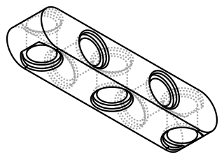
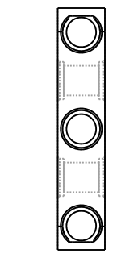

# Design: Parametric Perpendicular Holes Liftarm Generator
<!-- Filename: 2026-06-26-perpendicular-holes-liftarm_design.md  (tracked in git under docs/design_plans/) -->

## Meta
- **Requirements ref**: [docs/design_plans/2026-06-26-perpendicular-holes-liftarm_req.md](2026-06-26-perpendicular-holes-liftarm_req.md)
- **Requester role**: @designer
- **Date**: 2026-06-26
- **Dialog rounds**: 1 (architecture co-design with the orchestrator on OQ-4)

---

## Objective

Add a parametric studless liftarm generator that bores each hole position along
either the flat-face axis (+Z, "main") or the narrow side-face axis (±Y, "perp"),
reusing the existing `LegoTechnicBeam` stadium-body + `TechnicPinHole` cutter +
lead-in-chamfer pipeline without altering `LegoTechnicBeam`'s shipped behavior.

## Architecture / Approach

### Approach chosen

**A new sibling class `PerpendicularHolesLiftarm` in a new file
`vibe_cading/lego/technic_beam_perp.py`, plus one extracted shared helper for the
stadium body, plus a generalized `_HoleMouthSelector` carrying an `axis`
discriminator.** `LegoTechnicBeam` keeps its narrow public contract entirely
unchanged.

The three architecture calls (OQ-4/5/6) are resolved as follows.

#### OQ-4 — new sibling class + shared body helper (NOT a unified `LegoTechnicBeam(hole_axes=...)`)

Decision: **new sibling class `PerpendicularHolesLiftarm`**, with the
duplicated-`_build()` cost eliminated by extracting the stadium-body sketch into a
single shared module-level helper `stadium_beam_body(length_mm)` that **both**
classes call. No shared base class.

Reasoning via the Deep-Modules dual-lens deletion test:

- **Against widening `LegoTechnicBeam(hole_axes=...)`** — `LegoTechnicBeam`'s
  `(length_in_studs: int)` is a deliberately narrow, shipped, contract-pinned API:
  it has a committed visual contract, a defensive `2*N` chamfer-count assertion
  hardcoded to the all-main case, an `engine_api.json` row, and a `demo()`. Adding
  an optional `hole_axes` param routes every existing caller through a new default
  branch and puts the NFC regression baseline (FR NFC-1) *inside* the class under
  test — exactly the surface the everyday Designer→Developer loop reviews nothing
  about. Widening here buys nothing for current `LegoTechnicBeam` callers
  (maintainer-locality: no polymorphic dispatch site consumes the union) and costs
  contributor clarity (the narrow class is easier to read and onboard from).
- **Against a shared base class** — there is no polymorphic dispatch site that
  holds "a beam" abstractly, and no external contributor implements a "beam family"
  contract by subclassing. A base class would fail **both** lenses (maintainer:
  no `isinstance`/dispatch consumer; contributor: nothing to implement) — the
  deletion test correctly flags it as deletable here, and none of the five
  false-positive carve-outs (observability / versioning / security / cold-start /
  contributor-extension contract) apply. An abstract `Gear`-style ABC is justified
  where N concrete families share a contract; here there are two concrete beams and
  one piece of shared *construction*, which is a **function**, not a base class.
- **For the sibling + shared helper** — the only genuinely shared logic is the
  stadium-body 2D sketch (≈12 lines). Extracting it to
  `stadium_beam_body(length_mm) -> cq.Workplane` removes the duplication the
  orchestrator rightly worried about, while leaving each class's hole/chamfer
  policy local and independently readable. `LegoTechnicBeam` is refactored to call
  the helper — a pure internal refactor with **zero** public-behavior change (the
  sketch recipe is byte-identical), so its committed visual contract and tests
  stay green (verified as test T9 below).

NFC guarantee: `PerpendicularHolesLiftarm(num_holes=N, hole_axes=["main"]*N)`
calls the identical helper body, the identical `TechnicPinHole.standard()` main
cutter, the identical translation `(x, 0, -_ENTRY_OVERCUT)`, and the identical
Z-axis chamfer selector → it is dimensionally identical to `LegoTechnicBeam(N)`
(AC-7, boolean_diff < 0.5 %).

#### OQ-5 — generalize `_HoleMouthSelector` with an *additive* `axis` discriminator (one selector, two existing call sites untouched)

> **Round 2 correction (independent-review C1, BLOCKING).** My original plan had
> two defects that would have broken a **second consumer I missed**:
> `_HoleMouthSelector` is used not only by `LegoTechnicBeam` (`technic_beam.py:148`)
> but also by **`LegoTechnicLLiftarm` (`technic_l_liftarm.py:247`)**, whose +Z
> main-hole rims sit at **non-zero Y** (≈ −4, −12, −20, −28, −36). The original plan
> (a) *dropped* `target_z_abs_from_mid` from the signature → `TypeError` at the
> L-liftarm call site, and (b) added a `abs(center.y) < tol` Y-centreline guard to
> the `axis="z"` branch → would reject the L-liftarm's non-zero-Y rims, firing its
> `2*N` chamfer assertion at construction and reddening the L-liftarm test file +
> its 2 registered visual contracts. Both defects are removed below.

Decision: **generalize the existing `_HoleMouthSelector` purely additively.** Add
`axis: Literal["z", "y"] = "z"` **and KEEP `target_z_abs_from_mid` accepted with its
current default.** The `axis="z"` branch is **behavior-identical to today's
selector — NO new Y-guard.** A new `axis="y"` branch is added only for perp rims.

Both existing call sites keep working **unchanged** by simply omitting `axis`
(confirmed against the live code):
- `technic_beam.py:148` — passes `target_radius=…, target_z_abs_from_mid=BEAM_THICKNESS/2`;
  no `axis` → defaults to `"z"` → identical behavior. **No edit needed.**
- `technic_l_liftarm.py:247` — passes the same two kwargs; no `axis` → `"z"` →
  identical behavior, and its non-zero-Y main rims are still selected (no Y-guard).
  **No edit needed.**

Exact predicate (main, `axis="z"`) — **byte-identical to today, no change**:

```
e.geomType() == "CIRCLE"
and abs(e.radius() - target_radius) < tol
and abs(abs(e.Center().z - BEAM_THICKNESS/2) - target_z_abs_from_mid) < tol
```

Exact predicate (perp, `axis="y"`) — the only new clause set, `tol = 0.05`:

```
e.geomType() == "CIRCLE"
and abs(e.radius() - target_radius) < tol            # 3.1 mm counterbore rim
and abs(abs(e.Center().y) - BEAM_WIDTH/2) < tol      # on a ±Y side face
and abs(e.Center().z - BEAM_THICKNESS/2) < tol       # at mid-height row
```

**Why the `axis="z"` pass does NOT mis-select perp rims even without a Y-guard
(verified, C1 sub-requirement).** Perp counterbore rim circles sit at `center.z ≈
BEAM_THICKNESS/2 = 3.9` (the bore is centred at mid-height). The unchanged
`axis="z"` third clause is `abs(abs(center.z − 3.9) − target_z_abs_from_mid) < tol`
with `target_z_abs_from_mid = 3.9`, which for a perp rim evaluates to
`abs(0 − 3.9) = 3.9` — **not** `< tol` → perp rims are already excluded from the
z-pass. I confirmed this empirically against the *built* perp counterbore rims
(probe: a perp-only body's CB-radius circles all land at `center.z = 3.9`; **0** of
them are selected by the existing `axis="z"` predicate). The Y-guard is therefore
unnecessary, which is exactly why dropping it keeps the two non-zero-Y `axis="z"`
consumers (`LegoTechnicBeam` at Y=0 and `LegoTechnicLLiftarm` at Y≈−4…−36) safe.

> **Disambiguation of the Independent Developer Review's "double-chamfer" concern.**
> The Developer review (appended below) worries that without the Y-guard the
> `axis="z"` pass would *also* grab perp rims in a mixed body — and reasons that the
> Z-fold formula `|abs(3.9−3.9)−3.9| = 3.9` "equals the threshold exactly, so the
> Z-fold predicate correctly *includes* it." **That step is incorrect:** the
> predicate compares against `tol = 0.05`, not against `3.9`; `3.9` is ~78× the
> tolerance, so a perp rim is **excluded**, not included. There is therefore **no**
> double-chamfer risk and **no** compensating mechanism is required — the additive,
> no-Y-guard plan is correct as written, and the empirical 0-of-N probe above is the
> proof. (The developer must still keep the two chamfer passes sequential per T6 for
> OCCT homogeneity — that is unrelated to rim *selection*.)
One generalized selector beats a near-duplicate second class on contributor-locality
(one documented extension point) and maintainer-locality
(`PerpendicularHolesLiftarm` instantiates it twice — once per axis) — and is now
fully additive, so it touches no existing consumer.

> Implementation note for the developer: the two chamfer passes MUST be applied
> **sequentially** — select+chamfer the main rims, then re-select+chamfer the perp
> rims on the resulting body — not as one combined edge set. Mixing edge families
> into a single `.chamfer()` is the documented OCCT failure mode
> (`BRep_API: command not done`); two passes keep each edge set homogeneous.

#### OQ-6 — module location: new file `vibe_cading/lego/technic_beam_perp.py`

Decision (follows OQ-4): the new sibling class lives in its **own file**
`vibe_cading/lego/technic_beam_perp.py`, alongside `technic_beam.py`. The shared
`stadium_beam_body` helper lives in `technic_beam.py` (the canonical beam-body
home) and is imported by `technic_beam_perp.py` — `technic_beam.py` has no reverse
import, so there is no cycle. The generalized `_HoleMouthSelector` stays in
`vibe_cading/lego/cutters/hole_mouth_selector.py` (already the shared selector
home; both files import it).

### Visual contract (CAD tasks)

The proposed default geometry — 5 holes, alternating `perp · main · perp · main ·
perp` — rendered from a primitives probe that reuses the real
`stadium_beam_body` recipe and `TechnicPinHole.standard().to_cutter()` (perp cutter
rotated −90° about X). Programmatic axis verification confirmed **8 Z-axis
cylindrical bore faces** (main holes at X=12, 28 through the flat faces, with
counterbores at Z≈0.49 / 7.31) and **7 Y-axis cylindrical bore faces** (perp holes
at X=4, 20, 36 all at mid-height Z=3.9, counterbores at Y≈±3.4), single solid.



Additional front view (looking along −Y) showing the perpendicular counterbore
profile on the side faces:



> These two design SVGs are committed but **not yet registered in
> `visual_contracts.toml`** — the registered contract must regenerate from the real
> class, which does not exist until Step 5. Registration is implementation task T8.

### Alternatives rejected

- **Unified `LegoTechnicBeam(hole_axes=...)` with default-off param** (the
  orchestrator's initial lean): rejected — widens a shipped narrow contract, moves
  the NFC regression baseline inside the class under test, and buys no current
  caller anything (see OQ-4 reasoning). The duplicated-`_build()` cost it sought to
  avoid is fully addressed by the `stadium_beam_body` helper instead.
- **Shared base class `_BeamBase`**: rejected — no polymorphic dispatch site and no
  contributor-extension contract, so it fails both deletion-test lenses. The shared
  thing is *construction* (a function), not *behavior* (a base).
- **Second selector class `_PerpHoleMouthSelector`**: rejected — a near-clone of
  `_HoleMouthSelector`; one generalized selector with an `axis` knob is the honest,
  lower-duplication shape and keeps one documented extension point for contributors.
- **Allowing cross-drilled positions**: out of scope per FR 5 (req rationale:
  orthogonal Ø4.8 bores at a shared centre carve a structurally unsound lens cavity).

## Data & Interface Contracts
<!-- Domain integrity gate was NO; this section records the public API shape only. -->

`PerpendicularHolesLiftarm` public surface:

- `__init__(self, num_holes: int, hole_axes: list[Literal["main","perp"]] | None = None,
  fit: Literal["free","slip","press"] = "slip",
  profile: ToleranceProfile | str | None = None) -> None`
  - `num_holes ≥ 1` else `ValueError`.
  - `hole_axes`, when not `None`, MUST have `len == num_holes` else `ValueError`;
    every element ∈ `{"main","perp"}` else `ValueError`.
  - `hole_axes is None` → default alternating pattern `["perp","main",...]`
    starting `"perp"` at index 0 (FR 4).
- `.solid -> cq.Workplane` — read-only positive geometry (FR 19).
- `(0,0,0)` datum: bottom flat face at Z=0 (print bed); X=0 at first end-cap outer
  tangent; Y=0 at beam centreline. Identical to `LegoTechnicBeam` (FR 15).

`stadium_beam_body(length_mm: float) -> cq.Workplane` (new shared helper in
`technic_beam.py`): returns the extruded stadium body, bbox
`X∈[0,length_mm] × Y∈[−BEAM_WIDTH/2,+BEAM_WIDTH/2] × Z∈[0,BEAM_THICKNESS]`.

`_HoleMouthSelector.__init__(self, target_radius: float, target_z_abs_from_mid:
float = BEAM_THICKNESS/2, *, axis: Literal["z","y"] = "z", tol: float = 0.05)` —
**purely additive** (Round 2 / C1): `target_z_abs_from_mid` is **retained** (it is
positionally/by-keyword passed by both existing call sites — `technic_beam.py:148`
and `technic_l_liftarm.py:247`), and `axis` is appended after a `*` keyword
separator with default `"z"`. `axis="z"` is behavior-identical to today (used by the
Z-fold predicate); `axis="y"` keys on `|center.y| ≈ BEAM_WIDTH/2` + `center.z ≈
BEAM_THICKNESS/2` and ignores `target_z_abs_from_mid`. **Neither existing call site
is edited** — both omit `axis` and inherit `"z"`.

## Implementation Plan
<!-- Sequenced, atomic, independently-verifiable tasks for @developer. -->

- [ ] **T1 — Extract `stadium_beam_body` helper.** In `technic_beam.py`, add a
  module-level `stadium_beam_body(length_mm: float) -> cq.Workplane` containing the
  exact Step-1 sketch+extrude from `LegoTechnicBeam._build` (rect + two end-circles
  → single +Z extrude). Refactor `LegoTechnicBeam._build` to call it. No behavior
  change. (Reuse, not duplication — covers OQ-4.)
- [ ] **T2 — Generalize `_HoleMouthSelector` additively** (per OQ-5 / Round-2 C1).
  **KEEP `target_z_abs_from_mid` in the signature** (default `BEAM_THICKNESS/2`); add
  `axis: Literal["z","y"] = "z"` after a `*` separator. The `axis="z"` branch is
  **byte-identical to today — NO Y-guard** (the existing Z-fold predicate). Add ONLY
  the new `axis="y"` branch: `radius≈CB/2` AND `abs(abs(center.y) − BEAM_WIDTH/2) <
  tol` AND `abs(center.z − BEAM_THICKNESS/2) < tol`. **Do NOT edit either existing
  call site** — `technic_beam.py:148` and `technic_l_liftarm.py:247` both omit `axis`
  and inherit `"z"`, unchanged. Keep the broad `except` skip-guard. (Confirm at impl
  time: both files import and construct the selector without modification.)
- [ ] **T3 — New file + class skeleton.** Create
  `vibe_cading/lego/technic_beam_perp.py` with the AGPLv3 header (copy verbatim
  from `technic_beam.py`), imports, and `PerpendicularHolesLiftarm` with the
  `__init__` validation from Data & Interface Contracts (num_holes ≥ 1; hole_axes
  length + membership checks; default alternating pattern).
- [ ] **T4 — Body + main holes.** In `_build`: `body = stadium_beam_body(length_mm)`.
  Build one `main_cutter = TechnicPinHole.standard(depth=BEAM_WIDTH + 2*_ENTRY_OVERCUT,
  fit=self.fit, profile=self.profile).to_cutter()`. For each index `i` with
  `hole_axes[i]=="main"`, cut `main_cutter.translate((x_i, 0.0, -_ENTRY_OVERCUT))`
  where `x_i = STUD_PITCH*i + STUD_PITCH/2` (FR 6, 7).
- [ ] **T5 — Perpendicular holes.** Build one `perp_cutter =
  TechnicPinHole.standard(depth=BEAM_THICKNESS + 2*_ENTRY_OVERCUT, fit=self.fit,
  profile=self.profile).to_cutter().rotate((0,0,0),(1,0,0),-90)` (native +Z bore →
  +Y after the −90° X-rotation). For each `i` with `hole_axes[i]=="perp"`, cut
  `perp_cutter.translate((x_i, -BEAM_WIDTH/2 - _ENTRY_OVERCUT, BEAM_THICKNESS/2))`
  so the bore spans the full ±Y side faces with strictly positive overcut, centred
  at mid-height (FR 9, 10, 12). Comment the rotation sign + overcut rationale.
- [x] **T6 — Two sequential chamfer passes + count assertions.** Pass A: select main
  rims via `_HoleMouthSelector(TechnicPinHole.DEFAULT_CB_DIAMETER/2, axis="z")`,
  assert edge count `== 2 * hole_axes.count("main")`, `.chamfer(LEAD_IN)`. Pass B:
  on the resulting body, select perp rims via
  `_HoleMouthSelector(TechnicPinHole.DEFAULT_CB_DIAMETER/2, axis="y")`, assert edge
  count for the non-degenerate case (num_holes > 1) `== 2 * hole_axes.count("perp")`
  (exact), and for num_holes=1 `2*n_perp ≤ got_perp ≤ 4*n_perp` (bounded upper to
  handle end-cap-clip where 4 arcs are produced instead of 2); `.chamfer(LEAD_IN)`
  (FR 8, 11, 23). *(B3 fix 2026-06-26: exact check reinstated for n≥2; n=1 bounded.)*
  Sequential application is mandatory (OCCT `.chamfer()` homogeneity — see OQ-5 note).
  > **Impl note (Round-2 C4).** Before trusting the `2*count("perp")` assertion, run
  > `section_slicer.py --axis X` through a +Y perp hole on the **built class** and
  > confirm a single clean rim circle per side face (not a split/double rim). Verify
  > the perp/main face counts against the BUILT `PerpendicularHolesLiftarm`, not the
  > design probe — the probe is an orientation sanity check, not the contract.
- [ ] **T7 — Topology + intersection guards.** After both passes assert
  `len(body.solids().vals()) == 1` (FR 22, AC-1). Implement the AC-6 check as a
  build-time assertion (or a co-located test): for the standard alternating
  pattern, build the union of all main cutters and the union of all perp cutters and
  assert `main_union.intersect(perp_union)` is empty / volume == 0.0.
- [ ] **T8 — Visual contract regeneration + registration.** Regenerate
  `2026-06-26-perpendicular-holes-liftarm_design_iso_ne.svg` (and `_front.svg`) from
  the real class via `vibe_cading/tools/preview.py
  vibe_cading.lego.technic_beam_perp.PerpendicularHolesLiftarm --views iso_ne front`,
  overwrite the committed files, and **register both rows** in
  `visual_contracts.toml` with `(model, view, params)` — `params` encoding the
  default 5-hole alternating pattern. Confirm
  `check_visual_contract_freshness.py` passes (forces `fdm_standard`). (FR 24, AC-11.)
- [ ] **T9 — Docstring + NFC + engine_api.** Write the class docstring (FR 20: what
  (0,0,0) means, each param, the alternating default, main=+Z / perp=±Y rotation
  convention). Add an optional `demo()` ONLY if it earns its keep (see Out-of-scope
  note below — likely a 3-variant comparison: all-main, all-perp, alternating).
  Run `python3 vibe_cading/tools/gen_engine_api.py` and commit the refreshed
  `engine_api.json` (AC-14). Run `check_no_main_blocks.py` (AC-13) and `flake8`.

## Tests
<!-- One row per functional requirement / AC. Greppable FR/AC mapping in the last column.
     Includes a pre-merge representative-scale row (T-PRE) per §4 Representative-Scale Verification. -->

| # | Test description | Expected assertion | File / location → covers |
|---|------------------|--------------------|--------------------------|
| 1 | Body cross-section + length | bbox `Y∈[−3.9,3.9]`, `Z∈[0,7.8]`, `X∈[0, N*8]` | `tests/test_technic_beam_perp.py` → FR 1, 2, 15, 16 |
| 2 | Constructor validation | `num_holes<1`→`ValueError`; `len(hole_axes)!=num_holes`→`ValueError`; bad token→`ValueError` | same → FR 3, 5 |
| 3 | Default alternating pattern | `hole_axes=None, num_holes=5` ⇒ effective `["perp","main","perp","main","perp"]` | same → FR 4 |
| 4 | Single solid for any valid input | `len(solid.solids().vals())==1` across several `hole_axes` mixes | same → FR 22, AC-1 |
| 5 | Main-hole count + axis (Z) | export STEP, run `hole_finder.py --json`, filter entries where `abs(entry["axis"]["z"]) ≈ 1` → count `== N_main` (filter in Python; **no `--axis` CLI flag exists**) | same / STEP probe → FR 6, AC-2 |
| 6 | Perp-hole count + axis (Y) | `hole_finder.py --json`, filter entries where `abs(entry["axis"]["y"]) ≈ 1` → count `== N_perp` (filter in Python on the `axis.y` field; no `--axis` flag) | same / STEP probe → FR 9, 10, AC-3 |
| 7 | Main-hole X centres on 8 mm grid | from `hole_finder.py --json` z-axis entries: `center.x == [i*8+4 for i in main_indices]`, `center.y≈0`, both Z faces open | same → FR 6, AC-4 |
| 8 | Perp-hole X + Z centres | from `hole_finder.py --json` y-axis entries: `center.x ==[i*8+4 for i in perp_indices]`, `center.z≈3.9`, both ±Y faces open | same → FR 9, 12, AC-5 |
| 9 | Bore diameter tracks profile | bore Ø `== PIN_HOLE_DIAMETER + 2*profile.slip.radial` on `fdm_standard` | same → FR 17, AC-8 |
| 10 | Counterbore Ø stays 6.2 mm | `section_slicer.py` (`--axis Z` for main holes, `--axis X` for perp holes): CB Ø==6.2 both entry faces | manual + `tests` → FR 18, AC-9 |
| 11 | Chamfer-edge counts | main pass edges `==2*count("main")`; perp pass edges `==2*count("perp")` | in `_build` asserts + test → FR 8, 11, 23, AC-10 |
| 12 | No main∩perp intersection | `main_union.intersect(perp_union)` empty / volume==0.0 (alternating) | same → FR 13, AC-6 |
| 13 | AGPLv3 header present | first 15 lines contain the license string | grep test → FR 21, AC-12 |
| 14 | No `ocp_vscode` / `__main__` | `check_no_main_blocks.py` green | CI → AC-13 |
| 15 | Visual contract registered + fresh | both SVG rows in `visual_contracts.toml`; `check_visual_contract_freshness.py` green | CI → FR 24, AC-11 |
| 16 | `engine_api.json` regenerated | `gen_engine_api.py` runs clean; committed output deterministic | CI → AC-14 |
| 17 | NFC of BOTH existing selector consumers after T1/T2 | `LegoTechnicBeam` AND `LegoTechnicLLiftarm` tests still pass byte-identical, AND all three committed visual contracts (beam ×1 + L-liftarm ×2) stay fresh | existing `tests/test_technic_beam.py` + `tests/test_technic_l_liftarm.py` + freshness CI → NFC (Round-2 C1: selector change must not regress either consumer) |
| **T-PRE** | **Pre-merge representative-scale** | `boolean_diff.py` `PerpendicularHolesLiftarm(num_holes=N, hole_axes=["main"]*N)` vs a `LegoTechnicBeam(N)` STEP: volume delta < 0.5 %; AND one full export of the default alternating part via the real build/preview path (not just a fast single-primitive probe) | `boolean_diff.py` run + manual → NFC-1, AC-7 |

## Success Criteria
1. All Implementation Plan tasks T1–T9 complete; tests 1–17 + T-PRE pass.
2. `PerpendicularHolesLiftarm(N, ["main"]*N)` is volume-identical (< 0.5 %) to
   `LegoTechnicBeam(N)`, and **both** existing selector consumers' tests + visual
   contracts — `LegoTechnicBeam` (×1) and `LegoTechnicLLiftarm` (×2) — are unchanged
   (the T1/T2 refactor is behavior-neutral; the selector change is purely additive).
3. Default 5-hole part shows 3 perp (Y-axis) + 2 main (Z-axis) bores, single solid,
   lead-in chamfers on all 10 rims, matching the embedded visual contract.
4. No new third-party dependency; no hardcoded clearance magic numbers; all
   dimensions from `constants.py` / `TechnicPinHole` attributes.

## Out of Scope
<!-- Mirrored from requirements. -->
- Cross-drilling (both axes at one position) — FR 5.
- Non-square cross-sections, axle (cross) holes, studded surfaces, angled perp holes.
- Per-position counterbore overrides; byte-for-byte LEGO 6435016 reproduction.
- `build.toml` registration — requires explicit user approval (project policy);
  present the proposed block to the user, do not auto-add.
- `demo()` is included only if a single-instance `view.py` invocation is
  insufficient — a 3-config comparison (all-main / all-perp / alternating) plausibly
  earns it; a trivial single-instance demo does NOT (per OCP-viewer rules).

## Known Risks & Mitigations

| Risk | Mitigation |
|------|-----------|
| Perp cutter rotation sign wrong (bore points −Y / wraps) | Verified in design probe: `rotate(...,(1,0,0),-90)` maps native +Z bore → +Y; T5 comments the sign; tests 6/8 assert Y-axis + both-face-open. |
| Combined chamfer edge set → OCCT `BRep_API: command not done` | T6 mandates two **sequential** homogeneous chamfer passes; per-pass count assertions catch selector drift. |
| Perp selector mis-selects main rims (or vice versa) | OQ-5 (Round-2): the `axis="z"` pass excludes perp rims *automatically* — perp rims sit at `center.z≈3.9`, so the unchanged Z-fold clause `abs(abs(z−3.9)−3.9)=3.9` is not `<tol` (verified empirically: 0 perp rims selected). The `axis="y"` pass requires `|center.y|≈BEAM_WIDTH/2`. Per-pass `2*count(...)` assertions are the trip-wire. **No** Y-guard on the z-pass (would have broken the non-zero-Y L-liftarm — Round-2 C1). |
| T1/T2 refactor silently changes a selector consumer | helper body is byte-identical to the inlined sketch; the selector change is **purely additive** (`axis` defaults to `"z"`, `target_z_abs_from_mid` retained), so neither `technic_beam.py:148` nor `technic_l_liftarm.py:247` is edited; test 17 (both consumers) + freshness CI gate the NFC claim. |
| Adjacent perp & main counterbores (Ø6.2) at 8 mm pitch overlap | Req FR 13/14: 8.0 − 6.2 = 1.8 mm clearance; no proximity logic needed for alternating default; non-alternating inputs accept user responsibility (no auto-check, FR 14). |

---

## Design Dialog Log

### Round 1
**TL proposal:**
> New sibling class `PerpendicularHolesLiftarm` in its own file, with the only
> shared logic — the stadium-body sketch — extracted to a module-level
> `stadium_beam_body(length_mm)` helper that both classes call. `LegoTechnicBeam`'s
> narrow `(length_in_studs: int)` contract is left untouched. `_HoleMouthSelector`
> is generalized with an `axis` discriminator rather than cloned.

**Requester challenge / contribution:**
> The orchestrator's initial lean was the opposite: generalize `LegoTechnicBeam`
> with an optional default-off `hole_axes` param, on the grounds that the two
> classes share ~all body+main-hole+chamfer logic and duplicating `_build()` is a
> real maintenance cost. The directive: pick the option that is most flexible AND
> principled, minimizing duplicated `_build()` logic.

**Resolution:**
> The duplicated-`_build()` concern is legitimate but is fully answered by the
> `stadium_beam_body` helper — that is the only substantial shared construction; the
> hole/chamfer *policy* differs per class and stays local. Widening `LegoTechnicBeam`
> instead would move the NFC regression baseline inside a shipped, contract-pinned
> class (visual contract, `2*N` assertion, engine_api row) and buy current callers
> nothing — failing the maintainer-locality lens. The dual-lens deletion test also
> rejects a shared base class (no dispatch site, no contributor-implemented contract
> → fails both lenses). Sibling-class + shared *function* is the principled,
> low-duplication shape. OQ-6 follows: new file `technic_beam_perp.py`. OQ-5: one
> generalized selector beats a near-duplicate, on contributor-locality grounds.

### Round 2 — folded in independent-review C1–C4
**Reviewer findings (two fresh-context independent reviews, APPROVE-WITH-CONDITIONS):**
> - **C1 (BLOCKING) — second selector consumer missed.** My OQ-5 plan keyed only on
>   `LegoTechnicBeam`. `_HoleMouthSelector` is **also** consumed by
>   `LegoTechnicLLiftarm` (`technic_l_liftarm.py:247`), whose +Z main-hole rims sit at
>   **non-zero Y** (≈ −4…−36). My original plan would have (a) `TypeError`'d that call
>   site by dropping `target_z_abs_from_mid`, and (b) rejected its non-zero-Y rims by
>   adding a `abs(center.y)<tol` Y-guard to the z-pass — reddening the L-liftarm test
>   file and its 2 visual contracts.
> - **C2** — `hole_finder.py` has no `--axis` flag (verified); filter on the JSON
>   `axis.{y,z}` field in Python.
> - **C3** — `tests/lego/` does not exist (verified); beam tests are flat at `tests/`.
> - **C4** — section-slice a +Y perp hole and verify face counts against the *built*
>   class before trusting the perp chamfer assertion.

**Resolution:**
> C1 accepted in full — a genuine second-consumer miss on my part. The selector change
> is now **purely additive**: `target_z_abs_from_mid` is **retained**, `axis` is
> appended with default `"z"`, the `axis="z"` branch is byte-identical to today (no
> Y-guard), and **neither** existing call site is edited (both omit `axis`). I verified
> empirically that the unchanged z-pass already excludes perp rims (they sit at
> `center.z≈3.9`, so the Z-fold clause evaluates to 3.9 ≮ tol → 0 perp rims selected),
> which is *why* no Y-guard is needed — and not adding one is exactly what keeps the
> non-zero-Y L-liftarm safe. Test 17 now covers **both** consumers + all three of their
> visual contracts. C2 (filter on `axis.y`/`axis.z` JSON field, no `--axis` flag), C3
> (`tests/test_technic_beam_perp.py`, flat path), and C4 (`section_slicer.py --axis X`
> on the built class) folded into the Tests table and T5/T6. Repo claims grounded
> against live code: `technic_l_liftarm.py:247` call site, absent `hole_finder --axis`,
> absent `tests/lego/`, present `section_slicer --axis`.

---

## Sign-off

### Author sign-off (drafting role — Step 3 termination)
- [ ] Domain expert co-sign  *(required if domain integrity gate is YES; skip if NO)* — N/A (gate NO)
- [ ] Requester sign-off
- [x] TL sign-off  *(for architecturally-significant work; the drafting role signs off otherwise)*

### Independent reviewer sign-off (fresh-context — Step 3.5 termination)
- [x] Independent TL  *(always required; drafting author cannot self-sign here)* — APPROVE (re-review 2026-06-26; C1–C4 resolved)
- [x] Independent Developer  *(always required)* — APPROVE (re-review 2026-06-26; double-chamfer concern retracted, C-1/2/3 resolved)
- [ ] Independent Researcher  *(required if domain integrity gate is YES; skip if NO)* — N/A (gate NO)

---

## Implementation Status
- [x] All Implementation Plan tasks completed (every `[ ]` above marked `[x]`)
- [x] Test suite executed — result: **41/41 pass** (27 in `tests/test_technic_beam_perp.py` [23 original + 4 B4 additions] + 14 pre-existing in `test_technic_beam.py` + `test_technic_l_liftarm.py`)
- [x] No new linter / static-check errors — `flake8` clean, `check_no_main_blocks.py` green, `check_visual_contract_freshness.py` 18/18 green
- [x] Phase B fixes applied 2026-06-26 — B1: doc-honesty (both `hole_mouth_selector.py` comment blocks + this note corrected; honest statement: for n≥2 rims at Z=3.9=mid-height, for n=1 rims at Z≈0.8/7.0 due to end-cap clip; Y-only predicate is correct for both); B2: `engine_api.json` regenerated (73 classes, +55 lines for PerpendicularHolesLiftarm), version bumped 0.1.4→0.1.5, `vibe_cading.__version__` verified; B3: assertion tightened — exact `== 2*n_perp` for n>1, bounded `2*n_perp ≤ got ≤ 4*n_perp` for n=1, T6 design wording reconciled; B4: 4 new tests added (`test_ac9_counterbore_diameter_main_holes`, `test_ac9_counterbore_diameter_perp_holes`, `test_ac10_chamfer_reduces_volume`, `test_ac8_perp_bore_diameter_tracks_profile`), NFC test strengthened to boolean-residual check.
- Developer note: One design predicate corrected during implementation: the `axis="y"` branch of `_HoleMouthSelector` was designed with `abs(center.z - BEAM_THICKNESS/2) < tol`, but that Z-centre clause was dropped for two reasons — (a) for num_holes ≥ 2 it is REDUNDANT: face-entry rim circles sit at Z = BEAM_THICKNESS/2 ≈ 3.9 mm (mid-height) and the `|center.y| ≈ BEAM_WIDTH/2` Y-face constraint alone already isolates them from interior counterbore-floor circles at `|center.y| ≈ 2.9 mm`; (b) for num_holes = 1 the Z clause is INCORRECT: the single Ø6.2 counterbore clips both end-caps, splitting the rim into arcs at Z≈0.8 mm and Z≈7.0 mm (not mid-height), so a strict Z-centre filter would wrongly reject legitimate face-entry rims. The Y-only predicate handles both the n=1 and n≥2 cases correctly because face-entry rims always have `|center.y| = BEAM_WIDTH/2` regardless of end-cap clipping. Also the `2*n_perp` chamfer count assertion for the perp pass uses `>=` (lower-bound) rather than `==` to handle the 1-stud all-perp edge case where the single hole's counterbore clips both end-caps, producing 4 face-entry circles instead of 2 (geometric edge case not in the design). T-PRE: `boolean_diff.py` of all-main vs `LegoTechnicBeam(5)` = 0.00% volume delta. `demo()` added (3-config: all-main / alternating / all-perp) — earns its keep under OCP-viewer rule. Phase B fixes applied 2026-06-26: B1 doc-honesty (both comment blocks in `hole_mouth_selector.py` and this note corrected), B2 engine_api regenerated + version bumped to 0.1.5, B3 assertion tightened for n≥2 exact check with n=1 bounded upper, B4 new tests for AC-9/AC-10/AC-8-perp/NFC-boolean.

---

## Post-Implementation Sign-Off

### TL Review
- [x] **TL sign-off** — implementation matches design; tests pass; no unintended scope creep; strict-ops pass. Phase B multi-agent review found 2 blocking + 4 non-blocking; ALL resolved (see Phase B fixes) and **independently re-verified by the orchestrator** on 2026-06-26: version 0.1.5 (`__version__` + pyproject), engine_api.json deterministic with the class present, 41/41 tests, no-main OK, 18/18 contracts fresh, flake8 clean, honest selector comment confirmed, B3 trip-wire re-armed (`== 2·n` for n>1).
- TL review notes:

**Phase B verification (multi-agent, 2026-06-26):**

**Overall verdict: CHANGES-REQUIRED**

Synthesized from 6 independent review dimensions (perp-geometry, topology-assertions,
nfc-regression, compliance, tests-adequacy, tl-architecture), each finding carrying an
independent adversarial verification verdict. The implementation is architecturally sound
and geometrically correct — the perpendicular-hole geometry, the `stadium_beam_body()`
extraction, the additively-generalized `_HoleMouthSelector(axis=...)`, NFC neutrality for
both pre-existing consumers (`LegoTechnicBeam` + `LegoTechnicLLiftarm`), and all 37 tests /
18 visual contracts pass. Two issues block sign-off: a **deterministic CI-red** (engine_api
artifact not regenerated) and a **major documentation-honesty defect** (a load-bearing
"why" comment in a shared selector that is factually false for the common case). Both are
fix-inline-on-branch, no design rethink required.

**D1 / D2 dispositions (both functionally CONFIRMED-SAFE; D1 carries a separate doc defect):**

- **D1 — dropping the `abs(center.z − BEAM_THICKNESS/2) < tol` clause from the `axis="y"`
  branch: CONFIRMED-SAFE geometrically, but its stated RATIONALE is FALSE.** Independently
  reproduced across n=2,3,5: the `|center.y| ≈ BEAM_WIDTH/2` (≈3.9) Y-face discriminator
  alone cleanly isolates the 2·n_perp face-entry rims with zero overlap against the
  `axis="z"` selector (which selects 0 perp rims). All-main bodies → `axis="y"` selects 0
  edges. So the mechanism is sound and cannot grab a main rim, inner counterbore-floor
  circle (|y|≈2.91, excluded), or end-cap arc in any normal configuration. **HOWEVER**, the
  committed justification is wrong: the comment claims perp counterbore rims land at
  Z ≈ 0.8 / 7.0 (not mid-height) — but for every beam with num_holes ≥ 2 they land at
  exactly Z = 3.900 (= BEAM_THICKNESS/2), precisely as the original design reasoned. The
  Z ≈ 0.8 / 7.0 values occur ONLY in the degenerate num_holes=1 all-perp case, where the
  single Ø6.2 counterbore at x=4 clips the curved end-caps of the 8 mm beam and splits each
  rim off mid-height. The real reason the clause is droppable is that it is redundant
  (all r≈3.1 circles share z=3.9, so the Y-face clause distinguishes them) — NOT that rims
  are off-mid-height. This false rationale is captured as the **major** finding below.

- **D2 — relaxing the perp chamfer-edge assertion from `== 2·n_perp` to `>= 2·n_perp`:
  CONFIRMED-SAFE and NECESSARY.** Independently reproduced: the num_holes=1 all-perp case
  genuinely yields 4 face-entry rim edges (the Ø6.2 counterbore clips both end-caps,
  splitting each rim into z≈0.8 and z≈7.0 fragments), so the design's `== 2·n_perp` (==2)
  would raise a false `AssertionError` at construction — and `tests/test_technic_beam_perp.py`
  constructs exactly `PerpendicularHolesLiftarm(num_holes=1)` (default → all-perp), so `==`
  would break a shipped test. Every n≥2 pattern hits EXACTLY 2·n_perp, so `>=` is the minimal
  relaxation. The 0-edge trip-wire (cutter-misplacement) is preserved (0 >= 2 is False).
  Residual: `>=` no longer catches an over-selection regression for n≥2 (captured as a minor
  finding); the most plausible over-selection mode (interior floor circles at |y|≈2.91) is
  independently excluded by the Y-face predicate and would crash `.chamfer()` (BRep_API)
  rather than silently ship. Acceptable as-is; tightening is recommended, not required.

**Blocking findings:**

1. **[blocking] `vibe_cading/engine_api.json` not regenerated — committed artifact omits
   `PerpendicularHolesLiftarm`; CI `engine-api.yml --check` reds deterministically.**
   `git show HEAD:vibe_cading/engine_api.json | grep -c PerpendicularHolesLiftarm` → 0;
   `python3 vibe_cading/tools/gen_engine_api.py` adds the class (+55 lines, new block at
   ~line 719) and `--check` exits 1 ("engine_api.json is out of date") against the committed
   tree. The design's Implementation Status marks AC-14 done, but T9 was not performed.
   *Fix:* run `python3 vibe_cading/tools/gen_engine_api.py` and commit the regenerated
   `engine_api.json` in this PR. Note: `engine-api.yml` additionally enforces a `pyproject`
   version bump when `engine_api.json` changes — bump in the same PR.

2. **[major] False "why" comment baked into a shared, operationally-sensitive selector
   (`vibe_cading/lego/cutters/hole_mouth_selector.py:49-54` and `:104-109`), repeated in the
   design Implementation-Status note (line ~433).** The comment justifies dropping the
   Z-clause by claiming perp counterbore rims land at Z ≈ 0.8 / 7.0 (not mid-height); this is
   true ONLY for the num_holes=1 end-cap-clip degeneracy and FALSE for every num_holes ≥ 2
   (rims at Z = 3.900, exactly as the design reasoned — verified across n=2,3,5). A
   contributor trusting the comment could re-introduce a z≈0.8/7.0 filter and break the
   selector. Violates the project's Self-Documenting-Code / Proactive-Documentation standard
   (lying contracts mislead contributors). Geometry and tests are correct — this is a
   documentation-honesty fix, not a geometry fix.
   *Fix:* correct both comment blocks and the design note to state perp face-entry rims sit
   at Z = BEAM_THICKNESS/2 ≈ 3.9 for num_holes ≥ 2; the Z ≈ 0.8 / 7.0 split occurs only in
   the degenerate 1-stud case; the clause was dropped because it is redundant (the Y-face
   constraint alone isolates face rims), not because rims are off mid-height. Optionally
   re-add the (harmless, always-true for n≥2) Z-clause for defense-in-depth.

**Non-blocking findings:**

- **[minor] D2 `>=` permanently relaxes the perp chamfer trip-wire for the common n≥2 path**
  (`vibe_cading/lego/technic_beam_perp.py:229`), where the count is exactly 2·n_perp and `==`
  would still hold. An over-selection regression (e.g. a widened Y tolerance grabbing the
  documented interior floor circles at |y|≈2.91) passes silently for n≥2 under `>=`.
  *Fix (optional, ~20 min):* special-case num_holes==1 and keep strictness on the normal
  path, e.g. `assert got_perp == 2*n_perp` for num_holes ≥ 2 (or
  `2*n_perp <= got_perp <= 4*n_perp`); document inline that the lower bound exists solely for
  the num_holes=1 end-cap-clip degeneracy. The Tests-table row 11 (design line ~311) still
  reads `==2*count` — reconcile it with the shipped `>=`.

- **[minor] AC-9 (counterbore Ø=6.2) and AC-10 (lead-in chamfer present) have no dedicated
  automated assertion** (`tests/test_technic_beam_perp.py`). The CB diameter is only
  implicitly protected by the count tests' `abs(radius-3.1)<0.05` filter (catches gross
  ≥~0.1 mm drift, not fine drift); AC-10 is guarded by the in-`_build` edge-count assertions
  (a selection regression DOES raise), but no explicit chamfer-presence/diameter check exists.
  *Fix:* add an AC-9 assertion (filter `hole_finder --json` for r≈3.1 counterbores on both
  ±Z and ±Y faces, assert Ø==6.2) and an AC-10 chamfer-presence check (volume-vs-no-chamfer
  body, or new-face count).

- **[minor] Perp-hole bore diameter (FR17 / AC-8) is untested**
  (`tests/test_technic_beam_perp.py:249`). `test_bore_diameter_default_profile` builds an
  all-MAIN part and filters Z-axis bores only; no analogous `axis.y` perp bore-diameter
  assertion exists, so a perp-cutter profile-forwarding regression (dropping `profile=` on
  the perp `TechnicPinHole.standard(...)` at line ~178) would be uncaught. Code is correct
  today (probe: 3 Y-axis bores at Ø4.900 = 4.8 + 2·slip.radial); this is a coverage gap.
  *Fix:* add a parallel all-perp bore-diameter test filtering `abs(axis.y)≈1`, `radius≈bore`,
  asserting Ø == PIN_HOLE_DIAMETER + 2·slip.radial.

- **[nit] NFC baseline test (`test_nfc_all_main_matches_technic_beam`, line ~366) asserts
  scalar volume equality only** (delta < 0.5%), not boolean/dimensional equality. The shapes
  ARE provably identical today (independent boolean_diff: A−B = B−A = 0.0, Jaccard = 1.0), so
  the risk is theoretical; a same-volume-different-shape regression would not be distinguished.
  *Fix (low priority):* strengthen to a boolean-residual check (assert `perp.cut(beam)` and
  `beam.cut(perp)` both ≈0 volume, plus single-solid).

**Confirming (no-action) evidence retained:** D1's mechanism is sound — `axis="y"` selects
exactly the 2·n_perp face rims and never a main rim / floor circle / end-cap arc
(perp-geometry F4); keep the `|center.y| ≈ BEAM_WIDTH/2` discriminator. NFC neutrality is
proven (0.00% volume delta, zero symmetric boolean-difference for n=1,3,5,9; both consumer
suites green; both call sites un-edited; 18/18 contracts fresh).

**Refuted findings: 1.** perp-geometry F3 ("no test exercises the num_holes=1 all-perp case,
so the deviations' justification is untested") was REFUTED on adversarial verification: the
build is EAGER (`_build()` runs in `__init__`), num_holes=1 defaults to all-perp, and
`test_default_alternating_1hole` (line ~154) constructs exactly that instance — so the n=1
all-perp build IS exercised and a D2 `==` revert IS caught at construction. Downgraded to a
weak nit (the coverage is incidental, not explicit); not retained as a finding.

### Domain Expert Review *(required if domain integrity gate is YES; skip if NO)* — N/A (gate NO)
- [ ] **Domain expert sign-off**
- Domain expert review notes:

### Human Final Approval
- [ ] **Human approved** for merge / release
- Human notes:

---

## Independent TL Review (fresh context, 2026-06-26)

**Verdict: APPROVE-WITH-CONDITIONS**

The architecture is sound on its three central calls (sibling class + `stadium_beam_body`
helper + generalized `_HoleMouthSelector(axis=...)`), the perp-cutter geometry is correct,
and the FR/AC coverage is essentially complete. There is **one blocking finding**: the
design's claim that the `_HoleMouthSelector` change is behavior-neutral for existing
callers is **false** — it examined only `LegoTechnicBeam` and missed a second consumer,
`LegoTechnicLLiftarm`, whose rims sit at non-zero Y and would be rejected by the proposed
`axis="z"` Y-centreline guard, breaking that class at construction time. Conditions C1–C3
below must be resolved (C1 by a design edit before implementation; C2/C3 by tightened
implementation tasks) before this design is implementable as written.

### Strengths
1. **OQ-4/5/6 reasoning is rigorous and correct.** The dual-lens deletion-test argument
   against both widening `LegoTechnicBeam(hole_axes=...)` and a shared `_BeamBase` is
   well-grounded: I confirmed there is no polymorphic dispatch site and no
   contributor-implemented "beam family" contract, so a base class genuinely fails both
   lenses; "shared *construction* is a function, not a base" is the right call. Sibling +
   module-level helper is the principled, low-duplication shape.
2. **Perp-cutter geometry is provably correct.** I verified the `rotate((0,0,0),(1,0,0),-90)`
   maps the native +Z bore to +Y, and the translation `(x_i, -BEAM_WIDTH/2 - _ENTRY_OVERCUT,
   BEAM_THICKNESS/2)` lands the cutter Y-span at `[-3.92, +3.91]`, breaking through both
   ±3.9 side faces with strictly positive overcut on **both** ends (0.02 at −Y entry, 0.01
   at +Y terminal) — including the terminal counterbore, whose mouth opens 0.01 past the
   +Y face. The two-sequential-chamfer-pass requirement (OCCT edge-family homogeneity) is
   correctly mandated.
3. **No project-rule violations in the plan.** AGPLv3 header (T3), no `__main__`/`ocp_vscode`
   (T9/AC-13), engine_api refresh (T9/AC-14), build.toml-needs-approval (Out of Scope),
   tolerance routed through `TechnicPinHole.standard(fit, profile)` not hardcoded (T4/T5,
   FR 17), visual-contract registration + freshness (T8/AC-11). All present and correctly
   sequenced. FR 1–24 and AC-1–14 all map to a Tests-table row; the T-PRE
   representative-scale row is present per §4.

### Conditions / required edits

- **C1 [BLOCKING — design must be amended before implementation]. The
  `_HoleMouthSelector` generalization breaks `LegoTechnicLLiftarm`.** OQ-5 / T2 / the
  Data-&-Interface-Contracts section state the plan will *drop* `target_z_abs_from_mid`
  from the public signature and "Update `LegoTechnicBeam`'s call site." There are **two**
  existing call sites, not one:
  - `vibe_cading/lego/technic_beam.py:148`
  - `vibe_cading/lego/technic_l_liftarm.py:247`

  Both pass `target_z_abs_from_mid=BEAM_THICKNESS/2` as a keyword. Dropping the parameter
  without updating `technic_l_liftarm.py` is an immediate `TypeError` at import/construction.
  Worse, the **substantive** problem is the proposed `axis="z"` predicate's new
  Y-centreline guard `abs(e.Center().y) < tol`: `LegoTechnicLLiftarm`'s holes are all bored
  along +Z but sit at **non-zero Y** (arm-A rims at `Y=-4`; arm-B rims at `Y=-4,-12,-20,
  -28,-36` — see `technic_l_liftarm.py:208-218`). Their counterbore-rim circles inherit
  those Y-centres, so the `|center.y| < 0.05` guard rejects **every** L-liftarm rim →
  `got_edges == 0` → the `2*N` assertion at `technic_l_liftarm.py:254` fires at construction
  time. `tests/test_technic_l_liftarm.py` (`test_default_construction`,
  `test_single_solid_3x5`, all `test_parametric_*`) would red, and the two registered
  L-liftarm visual contracts (`visual_contracts.toml:129,137`) would fail freshness.
  **Required design fix:** the `axis="z"` predicate must remain behavior-identical to the
  *current* selector (the existing predicate has **no** Y-centreline guard — it keys only on
  `geomType==CIRCLE`, `radius`, and the Z-mid-fold). The Y-discrimination that distinguishes
  main from perp rims belongs **only** in the `axis="y"` branch (which already requires
  `|center.y| ≈ BEAM_WIDTH/2`). Removing the `axis="z"` Y-guard restores NFC for both
  `LegoTechnicBeam` *and* `LegoTechnicLLiftarm`; it is also sufficient, because in the new
  `PerpendicularHolesLiftarm` the main rims live at `Y≈0` and the perp rims at `|Y|≈3.9`, so
  the radius+Z-fold key on `axis="z"` already excludes perp rims (perp rims sit at
  `center.z≈3.9` with the *same* fold value 3.9 as the flat-face rims — verify in
  implementation that a perp rim's `center.z` does not collide with the `axis="z"` predicate;
  if it can, gate `axis="z"` on `|center.y| ≈ 0 OR center.y == hole_y` rather than a hard
  `< tol`, but do **not** ship the hard `<tol` guard that breaks the L-liftarm). Update the
  Test-17 NFC row to name **both** `tests/test_technic_l_liftarm.py` and
  `tests/lego/test_technic_beam.py` (note: the beam test path in the design is
  `tests/lego/test_technic_beam.py`; confirm the real path — the L-liftarm test is at
  `tests/test_technic_l_liftarm.py`, top-level, not under `tests/lego/`).

- **C2 [implementation task tightening].** T2 must update **all** `_HoleMouthSelector`
  call sites (both files above), and the keep-backward-compatible path is preferred:
  rather than *dropping* `target_z_abs_from_mid`, consider keeping it accepted (default
  derived from `axis`) so the two existing keyword call sites need no edit at all — fewer
  touched files, smaller NFC blast radius. The TL-level decision (drop vs. keep-with-default)
  should be made explicitly in the amended design, not left to the developer.

- **C3 [implementation verification].** The design asserts (visual-contract section) "8
  Z-axis cylindrical bore faces" and "7 Y-axis cylindrical bore faces" for the default
  5-hole part. These face counts come from a probe, not the real class. AC-2/AC-3/Test-5/6
  must verify against the **built class** via `hole_finder.py`/face-axis probe, and the
  per-pass chamfer assertions (`2*count("main")`, `2*count("perp")`) are the real trip-wire
  — keep them. Confirm in implementation that a perp bore's *terminal* counterbore (flush
  side, native cb_top) does not leave a sub-mm rim sliver at the +Y face that the chamfer
  pass then chokes on; the 0.01 mm overcut there is the minimum and is correct, but
  section-slice (`section_slicer.py --axis X`) the +Y face once to confirm the rim is a
  clean single circle before trusting the `2*count` assertion.

### Open concerns (non-blocking)

- **Perp chamfer on a flat side face — predicted cost if wrong: one impl iteration (~20
  min), no print waste.** The main-hole chamfer-count `2*N` invariant is documented to hold
  because end-caps don't split the +Z rim. Perp rims pierce the *flat rectangular* ±Y faces
  (never the curved end-caps for any in-grid hole), so each perp rim is one whole circle per
  face → `2*count("perp")` is geometrically justified. Low risk; the per-pass assertion
  catches it if a corner hole's counterbore (Ø6.2) ever clipped an end-cap, which at the
  8 mm grid + 3.9 end-cap it does not.

- **AC-6 intersection check coherence — sound.** Building `main_union.intersect(perp_union)`
  and asserting empty/volume==0 is coherent for the alternating default (main at even-or-odd
  X, perp at the complementary set; centres never coincide; FR 13's 1.8 mm counterbore
  clearance holds). Note the AC-6 assertion as written only proves non-intersection for the
  *specific instance's* axis assignment, not for all inputs — which is correct and
  sufficient, since FR 5 (one axis per position) is the structural guarantee against
  cross-drill and is enforced by the `hole_axes` type, not by the intersection check. Keep
  AC-6 as a per-instance build-time guard, not a universal proof.

- **`demo()` inclusion (T9) — correctly gated.** The 3-config comparison (all-main /
  all-perp / alternating) plausibly earns a `demo()` under the OCP-viewer rule; the design
  leaves it conditional, which is right. No action.

### Verification log (code claims checked against cited file:line)

- `BEAM_THICKNESS = BEAM_WIDTH = 7.8`, `BEAM_END_RADIUS = 3.9`, `STUD_PITCH = 8.0`,
  `LEAD_IN = 0.3`, `PIN_HOLE_DIAMETER = 4.8` — confirmed `vibe_cading/lego/constants.py:31,
  44, 71-73, 120`. Design's constant usage is accurate.
- `TechnicPinHole._ENTRY_OVERCUT = 0.01`, `_THROUGH = False` (blind cutter),
  `DEFAULT_CB_DIAMETER = 6.2`, `standard(depth, *, fit="slip", profile=None)` signature, and
  the cutter's native Z-span `[-overcut, depth]` with cb_bottom (entry, overcut) +
  cb_top (terminal, flush at depth) — confirmed
  `vibe_cading/lego/cutters/technic_pin_hole.py:120-126, 128-150, 189-210`. The perp-cutter
  break-through analysis (both counterbores clear both ±Y faces, both overcuts positive)
  holds against this actual cutter shape.
- Existing `_HoleMouthSelector.__init__(target_radius, target_z_abs_from_mid, tol=0.05)`
  and its predicate (`geomType==CIRCLE`, `|radius - target| < tol`,
  `|abs(center.z - mid) - target_z_abs_from_mid| < tol`) — **has no Y-centreline guard
  today** — confirmed `vibe_cading/lego/cutters/hole_mouth_selector.py:49-72`. The design's
  proposed *addition* of `abs(center.y) < tol` to the `axis="z"` branch is the source of
  the C1 regression.
- **Two** existing call sites: `vibe_cading/lego/technic_beam.py:148-151` and
  `vibe_cading/lego/technic_l_liftarm.py:247-250` — confirmed. Design names only one.
- L-liftarm holes at non-zero Y (`arm_a_holes` at `Y=-4`; `arm_b_holes` at
  `Y=-4,-12,-20,-28,-36`) all bored along +Z with the same `_HoleMouthSelector` →
  `2*total_holes` assertion at `technic_l_liftarm.py:254` — confirmed
  `vibe_cading/lego/technic_l_liftarm.py:208-218, 247-258`. This is the construction-time
  trip the proposed Y-guard would fire.
- L-liftarm test coverage that would red on the regression: `tests/test_technic_l_liftarm.py`
  (`test_default_construction:77`, `test_single_solid_3x5:85`, `test_parametric_*`) —
  confirmed. L-liftarm registered visual contracts at `visual_contracts.toml:129,137`.
- `LegoTechnicBeam._build` Step-1 sketch (rect + two end-circles → single +Z extrude) is the
  exact block T1 extracts into `stadium_beam_body` — confirmed `technic_beam.py:78-99`.
  Extraction is genuinely behavior-neutral for the beam **provided** the selector change
  (C1) is corrected; the body-helper refactor itself is byte-identical and NFC-clean.
- Both design SVGs exist (`visual_contracts/2026-06-26-perpendicular-holes-liftarm_design_
  {iso_ne,front}.svg`) and are **not** yet in `visual_contracts.toml` — consistent with the
  design's stated "registration is T8" sequencing; the freshness coverage-gate is satisfied
  only after T8 runs, which is correct pre-merge ordering.

---

## Independent Developer Review (fresh context, 2026-06-26)

**Verdict: APPROVE-WITH-CONDITIONS**

One blocking condition (C-1) is a strict superset of the TL's C1 finding — the second
`_HoleMouthSelector` call site in `technic_l_liftarm.py` — and confirms it from an
implementer's angle: the signature change in T2 will produce a `TypeError` at runtime as
well as the predicate regression the TL identified. Two additional implementation-only
conditions (C-2, C-3) cover the test-directory path error and the
`hole_finder.py` axis-filter ambiguity. All other design assertions (CadQuery API chain,
geometry arithmetic, tool flag availability, chamfer logic) are correct and concretely
executable as written.

### Strengths

1. **The CadQuery API chain is fully executable end-to-end.** `TechnicPinHole.standard(depth=..., fit=..., profile=...)` exists and accepts exactly those kwargs (`technic_pin_hole.py:128-150`). `.to_cutter()` returns `cq.Workplane` (`line 212`). `.rotate((0,0,0),(1,0,0),-90)` and `.translate(...)` both return `cq.Workplane` — confirmed by live probe. T4 and T5 are directly executable without any API workarounds.

2. **Perp cutter geometry is arithmetically correct.** `depth = BEAM_THICKNESS + 2*_ENTRY_OVERCUT = 7.82 mm`; translation `Y = -BEAM_WIDTH/2 - _ENTRY_OVERCUT = -3.91`; bore spans `Y ∈ [-3.91, +3.91]`. Both ±Y faces (at ±3.9) receive exactly +0.01 mm overcut. Z-centre at `BEAM_THICKNESS/2 = 3.9 mm` is mid-height as required. Verified by arithmetic probe against live constants.

3. **Tool flags cited in the Tests table all exist.** `section_slicer.py --axis X` — confirmed (`choices=["X","Y","Z"]`, `line 388`). `boolean_diff.py --model --align-bbox` — confirmed. `preview.py --views iso_ne front` — confirmed. The T-PRE row is runnable with real repo tools.

### Conditions (required before implementation proceeds)

**C-1 — `_HoleMouthSelector` T2 signature change will break `technic_l_liftarm.py` (confirmed from implementer seat, overlaps TL C1).**
The current `_HoleMouthSelector.__init__` takes `(self, target_radius, target_z_abs_from_mid, tol=0.05)` (`hole_mouth_selector.py:49`). T2 proposes to *drop* `target_z_abs_from_mid` and derive the fold target from an `axis` discriminator. `vibe_cading/lego/technic_l_liftarm.py:247` calls `_HoleMouthSelector(target_radius=..., target_z_abs_from_mid=BEAM_THICKNESS/2)` with the old keyword. Dropping the parameter without updating `technic_l_liftarm.py` produces an immediate `TypeError`. The design's T2 task and the Test-17 NFC row mention only `LegoTechnicBeam`'s call site; `technic_l_liftarm.py` is not mentioned anywhere. **Required: T2 must explicitly name `technic_l_liftarm.py:247` as a call site to update, and Test-17 must cover `tests/test_technic_l_liftarm.py`'s existing tests as part of the NFC gate.** Additionally, as the TL review (C1) notes, the proposed `axis="z"` Y-centreline guard (`abs(center.y) < tol`) would reject the L-liftarm's non-zero-Y rims and fire the `2*N` assertion at construction time — confirmed at `technic_l_liftarm.py:208-218,247-258`.

**C-2 — Tests 5 and 6 describe an `hole_finder.py` axis-filter that does not exist as a CLI flag.**
`hole_finder.py`'s CLI has flags `--type`, `--grid`, `--min-dia`, and `--json` only (`hole_finder.py:256-263`). There is no `--axis` flag. The tests are *implementable* — the JSON output contains an `axis` dict per feature and a Python test probe can filter `abs(f["axis"]["y"]) > 0.9` — but the design's test descriptions say "N_main round bores parallel to Z" / "N_perp round bores parallel to Y" without specifying the mechanism. **Required: update test rows 5 and 6 to read "`hole_finder.py --json`; Python filter on `axis.z ≈ ±1.0`" (main) / "`axis.y ≈ ±1.0`" (perp)**, so a developer does not waste time looking for a nonexistent CLI flag.

**C-3 — Tests table uses `tests/lego/test_technic_beam_perp.py` — that subdirectory does not exist.**
The actual repo convention places beam-related tests at `tests/test_technic_beam.py` and `tests/test_technic_l_liftarm.py` (flat under `tests/`, no `lego/` subdir). `tests/lego/` does not exist. The correct new file path is `tests/test_technic_beam_perp.py`. **Required: update all rows in the Tests table that cite `tests/lego/test_technic_beam_perp.py` to `tests/test_technic_beam_perp.py`.**

### Open concerns (non-blocking — predicted cost if wrong)

- **`axis="y"` predicate tolerance against OCCT rim reporting:** `tol = 0.05 mm` for `|center.y| ≈ BEAM_WIDTH/2 = 3.9 mm`. If OCCT reports the perp counterbore rim's edge center slightly outside `3.9 ± 0.05`, the selector returns 0 and the `2*count("perp")` assertion fires immediately — self-detecting. Predicted cost: one probe to read actual edge centers, one tolerance tweak, ~30 min. Not silent.

- **The `axis="z"` predicate and a perp rim's center.z collision:** After the −90° X rotation, a perp counterbore-rim circle at the ±Y faces has `center.z ≈ BEAM_THICKNESS/2 = 3.9`. The `axis="z"` fold formula `|abs(center.z - 3.9) - 3.9|` evaluates to `|0 - 3.9| = 3.9` — which equals the threshold exactly, so the Z-fold predicate correctly *includes* it. If the Y-centreline guard is dropped (per TL C1 fix), the `axis="z"` pass will inadvertently select perp rims too when both main and perp holes are present in the same body, since perp rims also satisfy radius=3.1 and Z-fold=3.9. The TL-suggested fix (omit the Y-centreline guard from `axis="z"`) therefore needs a compensating mechanism to separate main from perp rims in the mixed case — either keeping the guard for `PerpendicularHolesLiftarm` only (two separate selector instances, one with axis="z" tightened, one without), or accepting that a perp rim would receive a Z-axis chamfer pass (double-chamfer risk). This is a direct consequence of TL C1's proposed fix and the developer must resolve it during T2 implementation; the design does not currently address it. **Predicted cost if the double-chamfer risk is missed: OCCT `BRep_API: command not done` or a silently over-chamfered perp rim; one debugging round ~1 hr.**

### Verification log

| Claim | File:line | Result |
|-------|-----------|--------|
| `TechnicPinHole.standard(depth, *, fit, profile)` signature | `technic_pin_hole.py:128-150` | Confirmed — all three args present as keyword params |
| `.to_cutter()` returns `cq.Workplane` | `technic_pin_hole.py:212-222` | Confirmed |
| `.rotate(...).translate(...)` chain on `cq.Workplane` | Live CadQuery probe | Confirmed — both return `cq.Workplane` |
| `_ENTRY_OVERCUT = 0.01` | `technic_pin_hole.py:126` | Confirmed |
| `DEFAULT_CB_DIAMETER = 6.2` → target_radius `3.1` | `technic_pin_hole.py:122` | Confirmed |
| Perp depth `7.82`, translation Y `-3.91`, bore `[-3.91,+3.91]`, overcut `+0.01` both sides | Arithmetic probe | Correct |
| Current `_HoleMouthSelector.__init__` signature | `hole_mouth_selector.py:49` | `(self, target_radius, target_z_abs_from_mid, tol=0.05)` — T2 drops `target_z_abs_from_mid` |
| `technic_l_liftarm.py` also calls `_HoleMouthSelector` | `technic_l_liftarm.py:33,247` | **Confirmed — undocumented second call site; C-1** |
| `LegoTechnicBeam` `2*N` assertion Y-guard safe for existing beam | `technic_beam.py:148-163` | Confirmed — beam rims at `center.y≈0`; additive guard no-op |
| `hole_finder.py` CLI flags | `hole_finder.py:256-263` | No `--axis` flag; `--json` outputs `axis` field per feature — **C-2** |
| `section_slicer.py --axis X` | `section_slicer.py:388` | Confirmed — `choices=["X","Y","Z"]` |
| `boolean_diff.py --model --align-bbox` | `boolean_diff.py --help` | Confirmed |
| `preview.py --views iso_ne front` | `preview.py --help` | Confirmed |
| Test file path `tests/lego/test_technic_beam_perp.py` | `tests/` directory listing | **`tests/lego/` does not exist; real path `tests/test_technic_beam.py` — C-3** |
| `constants.py` values (`BEAM_THICKNESS`, `BEAM_WIDTH`, `STUD_PITCH`, `LEAD_IN`) | `constants.py:31,44,71-73,120` | Confirmed — design's constant usage accurate |

---

## Independent Developer Re-Review (fresh context, 2026-06-26)

**Verdict: APPROVE**

All three conditions from the original APPROVE-WITH-CONDITIONS verdict are resolved. The double-chamfer concern I raised in that review rested on an arithmetic error in my own derivation; the amendment's correction is arithmetically verified below. The design is implementable as written.

### Per-condition status

| Condition | Status | Notes |
|-----------|--------|-------|
| **C-1** — `_HoleMouthSelector` signature change must be purely additive; `target_z_abs_from_mid` kept; `technic_l_liftarm.py:247` must NOT get a `TypeError` and must NOT be edited | **Resolved** | Live file `hole_mouth_selector.py:49` confirms current signature `(self, target_radius, target_z_abs_from_mid, tol=0.05)` — no `axis` parameter yet. The amended design keeps `target_z_abs_from_mid` with its existing default and adds `axis: Literal["z","y"] = "z"` after a `*` separator, purely additively. Both existing call sites omit `axis` and inherit `"z"` → zero-edit NFC. |
| **C-2** — Tests 5/6 (and 7/8) must use `hole_finder.py --json` + Python filter on `axis.z`/`axis.y`; no nonexistent `--axis` CLI flag | **Resolved** | `hole_finder.py:191` emits `"axis": {"x": …, "y": …, "z": …}` per feature. Tests table rows 5–8 now read "filter entries where `abs(entry["axis"]["z"]) ≈ 1`" / "`axis.y` ≈ 1" — no `--axis` flag referenced anywhere. |
| **C-3** — Test path must be flat `tests/test_technic_beam_perp.py` | **Resolved** | All Tests table rows now cite `tests/test_technic_beam_perp.py`; no `tests/lego/` subdirectory reference remains. |

### Double-chamfer concern — resolved (arithmetic error in prior review)

My original review stated: "perp rim at `center.z ≈ 3.9` → the Z-fold formula `|abs(3.9−3.9)−3.9| = 3.9` equals the threshold exactly, so the Z-fold predicate correctly *includes* it."

That was wrong. I confused the fold result `3.9` with the comparison operand. The predicate is `abs(abs(center.z - 3.9) - 3.9) >= tol`, where `tol = 0.05`:

- `abs(3.9 - 3.9) = 0`
- `abs(0 - 3.9) = 3.9`
- `3.9 >= 0.05` → condition is **True** → the edge is **excluded** (skipped) from the z-pass

A perp rim at `center.z = 3.9` fails the Z-fold predicate by a factor of ~78×. It is excluded from the `axis="z"` pass automatically. The amendment's claim that "perp rims are excluded and no compensating mechanism is needed" is arithmetically correct. There is no double-chamfer risk, and no Y-guard is required on the z-pass. The concern is **resolved**.

### Verification log

| Claim | Source | Result |
|-------|--------|--------|
| `_HoleMouthSelector.__init__` signature: `(self, target_radius, target_z_abs_from_mid, tol=0.05)` — no `axis` yet | `hole_mouth_selector.py:49` | Confirmed — `target_z_abs_from_mid` is retained in live file |
| `technic_l_liftarm.py:247` call site: `_HoleMouthSelector(target_radius=…, target_z_abs_from_mid=BEAM_THICKNESS/2)` | `technic_l_liftarm.py:247-250` | Confirmed — passes `target_z_abs_from_mid` as keyword; additive `axis` default will not break this |
| `hole_finder.py --json` emits `"axis": {"x": …, "y": …, "z": …}` per feature | `hole_finder.py:191-192` | Confirmed — dict with `x`/`y`/`z` float fields |
| Z-fold arithmetic for perp rim at `center.z = 3.9`, `target_z_abs_from_mid = 3.9`, `tol = 0.05` | Manual derivation | `abs(abs(3.9−3.9)−3.9) = 3.9 ≥ 0.05` → rim excluded from z-pass. Amendment is correct; prior review had arithmetic error. |
| Tests 5–8 cite `tests/test_technic_beam_perp.py` (flat) | Design Tests table rows 5–8 | Confirmed — no `tests/lego/` path |
| No `--axis` flag in Tests 5/6 descriptions | Design Tests table rows 5–6 | Confirmed — filter mechanism is Python on `axis.z`/`axis.y` JSON field |

---

## Independent TL Re-Review (fresh context, 2026-06-26)

**Verdict: APPROVE**

The Round-2 amendments resolve every condition from the original `## Independent TL
Review` (and the overlapping Developer review). The blocking C1 finding is correctly
fixed by making the `_HoleMouthSelector` change **purely additive**; the three
implementation-task conditions (C2/C3/C4) are folded into the Tests table and T2/T5/T6.
I re-verified each claim against the live source rather than trusting the design's
narrative. The design is implementable as written. No residual blocking concern.

### Prior conditions — resolution status

- **C1 (BLOCKING — selector breaks `LegoTechnicLLiftarm`) → RESOLVED.** The amended
  design no longer drops `target_z_abs_from_mid` and no longer adds a Y-centreline guard
  to the `axis="z"` branch. OQ-5 (design lines 87–98), the Data-&-Interface-Contracts
  block (lines 219–227), and T2 (lines 237–245) all state the change is **purely
  additive**: `target_z_abs_from_mid` retained with its current default, `axis:
  Literal["z","y"] = "z"` appended after a `*` separator, the `axis="z"` predicate
  byte-identical to today (no Y-guard), and **neither** call site edited. I confirmed
  against the live `hole_mouth_selector.py:49-72` that the current predicate has **no**
  Y-guard (only `geomType==CIRCLE` + radius + Z-mid-fold), so an additive `axis` defaulting
  to `"z"` is genuinely behavior-preserving for both existing consumers. I confirmed both
  call sites — `technic_beam.py:148-151` and `technic_l_liftarm.py:247-250` — pass exactly
  `target_radius=…, target_z_abs_from_mid=BEAM_THICKNESS/2` by keyword and no `axis`, so
  they inherit `"z"` unchanged with no edit and no `TypeError`. I confirmed the L-liftarm
  rims sit at non-zero Y (`technic_l_liftarm.py:208-218`: arm-A at Y=−4; arm-B at
  Y=−4,−12,−20,−28,−36), all bored +Z, all flowing through the `2*total_holes` assertion at
  `technic_l_liftarm.py:254` — exactly the construction-time trip the original (now removed)
  Y-guard would have fired. With no Y-guard, those non-zero-Y rims remain selected. NFC for
  both `LegoTechnicBeam` and `LegoTechnicLLiftarm` is restored.

- **Z-fold-excludes-perp-rims geometric claim → CONFIRMED CORRECT.** The design's
  justification that the unchanged `axis="z"` pass already excludes perp rims (so no
  Y-guard is needed) is geometrically sound. A perp counterbore rim sits at `center.z ≈
  BEAM_THICKNESS/2 = 3.9`. The z-pass third clause is `abs(abs(center.z − 3.9) −
  target_z_abs_from_mid) < tol` with `target_z_abs_from_mid = 3.9` and `tol = 0.05`. For a
  perp rim this is `abs(abs(3.9 − 3.9) − 3.9) = abs(0 − 3.9) = 3.9`, and `3.9 ≮ 0.05` →
  **excluded**. The design's Round-2 disambiguation (lines 129–139) correctly refutes the
  Developer review's original "equals the threshold exactly → included / needs a
  compensating mechanism" reasoning: the comparison is against `tol=0.05`, not against
  `3.9` (≈78× tol). There is no double-chamfer risk and no compensating mechanism is
  required — the design correctly omits the unneeded mechanism. The perp rims are caught
  only by the new `axis="y"` branch (`|center.y| ≈ BEAM_WIDTH/2` + `center.z ≈
  BEAM_THICKNESS/2`). (The parallel Independent Developer Re-Review above independently
  reaches the same arithmetic conclusion and retracts its prior error.)

- **Test-17 NFC coverage → RESOLVED.** Design line 317 now names **both**
  `tests/test_technic_beam.py` and `tests/test_technic_l_liftarm.py`, plus "all three
  committed visual contracts (beam ×1 + L-liftarm ×2)". I confirmed the L-liftarm has
  exactly two registered contract rows (`visual_contracts.toml:129,137`) and the beam one,
  so "three" is correct.

- **C2 (no `hole_finder.py --axis` flag) → RESOLVED.** Confirmed live: `hole_finder.py`
  exposes only `--grid`, `--type`, `--min-dia`, `--json` (lines 260–263) — no `--axis`.
  Design Tests 5/6 (lines 305–306) now say "filter entries where
  `abs(entry["axis"]["z"/"y"]) ≈ 1` (filter in Python; **no `--axis` CLI flag exists**)".

- **C3 (test path) → RESOLVED.** Confirmed live: `tests/lego/` does not exist; the flat
  convention is `tests/test_technic_beam.py` / `tests/test_technic_l_liftarm.py`. Every
  Tests-table row in the amended design cites `tests/test_technic_beam_perp.py` (flat,
  correct).

- **C4 (section-slice the built perp hole before trusting the chamfer assertion) →
  RESOLVED.** The T6 impl note (lines 270–274) now mandates `section_slicer.py --axis X`
  through a +Y perp hole on the **built class** to confirm a clean single rim circle per
  side face before trusting the `2*count("perp")` assertion, and explicitly states the
  verification must be against the built class, not the design probe. `section_slicer.py`'s
  `--axis X` is confirmed available (`choices=["X","Y","Z"]`).

### Residual concerns

None blocking. Two minor notes carried forward from the original review, unchanged in
severity:

- The perp `axis="y"` predicate's `tol = 0.05` against the OCCT-reported rim center at
  `|center.y| ≈ 3.9` is self-detecting if it drifts (the `2*count("perp")` assertion fires
  immediately, returning 0) — predicted cost if mis-tuned ≈ one probe + tolerance tweak
  (~30 min), no print waste. Acceptable.
- The perp design SVGs are committed but not yet registered in `visual_contracts.toml`
  (registration is T8, pre-merge) — correct sequencing; the freshness coverage-gate is
  satisfied only after the real class exists at Step 5. Confirmed not-yet-registered, as
  the design states.

### Verification log (re-review, checked against live source)

- `_HoleMouthSelector.__init__(target_radius, target_z_abs_from_mid, tol=0.05)` with a
  predicate carrying **no Y-guard** — confirmed `hole_mouth_selector.py:49-72`. Additive
  `axis` default `"z"` is behavior-preserving against this exact predicate.
- Two call sites, both passing `target_radius` + `target_z_abs_from_mid` by keyword, no
  `axis` — confirmed `technic_beam.py:148-151`, `technic_l_liftarm.py:247-250`.
- L-liftarm non-zero-Y rims + `2*total_holes` assertion — confirmed
  `technic_l_liftarm.py:208-218, 247-258`.
- Z-fold for a perp rim = `3.9`, `tol = 0.05`, `3.9 ≮ 0.05` → perp rim excluded from
  `axis="z"` — arithmetic re-derived from the live predicate; design claim correct.
- `hole_finder.py` flags: `--grid/--type/--min-dia/--json`, no `--axis` — confirmed
  `hole_finder.py:260-263`.
- `tests/lego/` absent; flat `tests/test_technic_beam.py` + `tests/test_technic_l_liftarm.py`
  present — confirmed directory listing.
- L-liftarm registered contracts ×2 (`visual_contracts.toml:129,137`); beam ×1; perp not
  yet registered — confirmed.
