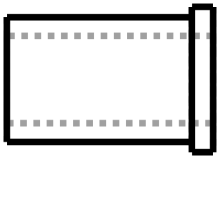

# Design: Technic Pin-Hole Bushing
<!-- Filename: 2026-08-10-technic-pin-hole-bushing_design.md  (tracked in git under docs/design_plans/) -->

## Meta
- **Requirements ref**: [`docs/design_plans/2026-08-10-technic-pin-hole-bushing_req.md`](2026-08-10-technic-pin-hole-bushing_req.md)
- **Requester role**: @admin (on behalf of user request)
- **Date**: 2026-08-10
- **Dialog rounds**: 1 (single self-contained co-design pass — both Open Questions are mechanical/convention questions resolvable from codebase precedent, not product decisions; see Design Dialog Log)

---

## Objective

Add a single new model class, `TechnicPinHoleBushing`, that produces a plain
round tube whose outer diameter friction-fits a real Lego Technic pin hole, whose
bore is an M3 clearance hole, and which carries an optional single retaining
flange below `Z=0` — with every diameter derived from existing constants and the
active `ToleranceProfile`, never hardcoded.

**Requirements reconciliation — R10 supersedes R1's "no flange" clause.** R1
literally describes *"a plain OD/bore tube, no flange, no external features"*; R10,
added later by the human, mandates an optional flange defaulting to **enabled**. R10
is the authoritative current requirement and R1's "no flange" wording is superseded —
R1 survives only as the description of the *barrel*, whose plain-tube shape and
Z-extent are unaffected by the flange flag (D3, D5, Tests row 9). A reader diffing R1
against the shipped class should not read "no flange" as a live constraint.

## Architecture / Approach

### Approach chosen

**One concrete class, no new abstraction.** The part is a two-cylinder union with
one through-bore. It introduces no shared contract, no base class, no `Protocol`
implementation beyond the already-universal `.solid` accessor. Per the
Deep-Modules Dual-Lens Rule, an abstraction here would fail both lenses: no
internal caller would dispatch on it, and no external contributor adds "a new
bushing family member" — they parameterise this one.

**File / class (resolves Open Question 2).**
`vibe_cading/lego_adapters/technic_pin_hole_bushing.py`, class
`TechnicPinHoleBushing`. **Confirmed** — `lego_adapters/` is correct and
`vibe_cading/lego/` is wrong. The directory boundary observable in the tree is
"pure Lego geometry" vs "bridge between Lego and a non-Lego component":
`vibe_cading/lego_adapters/technic_axle_to_bearing_sleeve.py:22`
(`TechnicAxleToBearingSleeve` — Lego axle ↔ ball bearing) and
`vibe_cading/lego_adapters/axle_to_pin_bore_adapter.py:19`
(`AxleToPinBoreAdapter`) both sit there, while
`vibe_cading/lego/cutters/technic_pin_hole.py:42` (pure Lego feature) does not.
This bushing exists specifically to interface a Lego pin hole with an M3 machine
screw, so it belongs with the adapters.

#### D1 — Outer-diameter formula (resolves Open Question 1)

```python
OD = PIN_HOLE_DIAMETER - 2 * getattr(profile, fit).radial      # fit default: "press"
```

With shipped `fdm_standard` (`press.radial = 0.04`, `vibe_cading/print_profiles.json`
— the shipped source of truth; `_FALLBACK_PROFILES` in `print_settings.py` carries
identical numbers but is only read when both JSON files are unreadable, so do **not**
treat it as authoritative): `OD = 4.8 - 0.08 = 4.72 mm`.

**Absolute-fit caveat (not just the sign).** 4.72 mm is **0.08 mm under** the 4.8 mm
nominal pin hole. The *modelled* part is therefore a slight clearance fit, not a
modelled interference fit — retention comes solely from FDM/TPU over-extrusion
closing that gap in plastic. A builder whose print still comes out loose must set a
**negative** `press.radial` in `print_profiles_user.json` to obtain true modelled
interference. This absolute statement is required in the class docstring (T1) and in
Success Criterion 2; the Tests table's row 2 asserts only the *relative* grade
ordering and cannot catch an absolute-fit misunderstanding.

**The sign is opposite to `TechnicPinHole`'s female bore, and that is correct.**
`vibe_cading/lego/cutters/technic_pin_hole.py:179` reads
`bore_diameter = PIN_HOLE_DIAMETER + 2 * grade.radial`. Three independent lines of
evidence establish that a *male* feature negates that term:

1. **The dataclass docstring states it literally.**
   `vibe_cading/print_settings.py:23-26`: *"add `radial` mm to a hole radius for a
   through-hole clearance, or **subtract `radial` mm for a press-fit shaft**."*
   `FitGrade`'s own docstring repeats it at
   `vibe_cading/print_settings.py:249`: *"positive widens a hole, negative
   shrinks a peg."*
   `docs/print-tolerances.md:45` states the same in doc prose.

2. **The unifying rule behind every existing consumer.** Every current call site
   is a *printed void* receiving a *rigid real* part — `TechnicPinHole` (Lego
   pin), `Bearing.outer_pocket` (`vibe_cading/mechanical/bearings.py:81`),
   the `MetricHexNut` press pocket (whose actual `+ radial` expression lives in
   `CaptiveNutPocket.to_cutter`, `vibe_cading/mechanical/holes.py:440`; the
   `nuts/metric.py:119-124` block only *synthesises* a profile that routes
   `press` through `free` into that same expression),
   `TechnicAxleHole` (`vibe_cading/lego/cutters/technic_axle_hole.py:147`) — and
   every one of them writes `nominal + 2 * radial`. The invariant is not "always
   add"; it is **"remove `2 * radial` of material from the printed side of the
   interface."** On a void, removing material *increases* the diameter (`+`); on a
   solid, removing material *decreases* it (`−`). Our case is the mirror image
   never yet exercised in this codebase: a *printed peg* entering a *rigid real*
   Lego hole whose 4.8 mm nominal we cannot alter.

3. **Grade monotonicity — the decisive check.** The shipped radials are ordered
   `press 0.04 < slip 0.05 < free 0.15` (`vibe_cading/print_profiles.json`),
   i.e. *smaller allowance = tighter fit*. Under subtraction the resulting ODs are
   `press 4.72 > slip 4.70 > free 4.50` — press is the largest peg, therefore the
   tightest fit, matching `docs/print-tolerances.md:15-17`. Under **addition** the
   ordering inverts (`press 4.88 < free 5.10`), which would make `fit="press"` the
   *loosest* of the three grades — a semantic inversion of the fit-grade contract.
   Subtraction is the only sign that preserves the grade ordering.

`docs/print-tolerances.md:17` — *"press: the peg is **larger** than the nominal
hole envelope"* — describes the **as-printed** outcome, not the modelled number:
FDM/TPU over-extrudes into the void, so a peg modelled at 4.72 lands near or above
4.80 in plastic. The formula is therefore also sign-agnostic in the user's favour:
a builder whose calibration still prints loose sets a **negative** `press.radial`
in `print_profiles_user.json` and the same expression yields `OD > 4.8` for true
interference. No class-level branch, no TPU special-case — exactly as the
requirements' *Known Domain Constraints* demand.

The formula MUST carry an inline comment stating the negation and its reason —
this is the first male-side profile consumer in the codebase and the sign is the
single most reversible mistake in the part.

**Anti-precedent, explicitly rejected:** `AxleToPinBoreAdapter`
(`vibe_cading/lego_adapters/axle_to_pin_bore_adapter.py:23`) sizes its male rod
with hardcoded magic numbers (`axle_shrink=0.02`, `rod_diameter=3.40`) and no
profile at all. Do not copy it; it predates the tolerance-profile model and
violates the *Manufacturing & Tolerance Profiles* rule.

#### D2 — Bore sizing (resolves requirement R3, with one deliberate deviation)

```python
bore_nominal = MetricMachineScrew.from_size("M3", length=total_height).clearance_diameter   # 3.2
bore = ClearanceHole(diameter=bore_nominal, depth=total_height, profile=profile)
part = part.cut(bore.to_cutter())
```

With `fdm_standard` (`free.radial = 0.15`): bore = `3.2 + 0.30 = 3.50 mm`.

**Do NOT call `MetricMachineScrew.to_cutter(fit="clearance")`.** Reading
`vibe_cading/mechanical/screws/metric.py:155-174`, that method delegates to
`CounterboreHole` and returns a **shaft + head-recess** cutter — for an M3 socket
head that is a Ø5.5 mm, 3.0 mm-deep counterbore
(`vibe_cading/mechanical/screws/metric.py:25`). Applied to this part it would
destroy the entire flange (flange thickness 0.8 mm ≪ 3.0 mm recess) and blow a
Ø5.5 mm crater through a Ø4.72 mm barrel. R3's literal call is unusable here.

R3 says *"or equivalent"*, and this is the equivalent that satisfies its actual
intent — *reuse the project's M3 clearance convention, not a hardcoded number*.
The M3 clearance nominal still comes from the public factory
(`METRIC_SIZES["M3"]["clearance"] = 3.2`,
`vibe_cading/mechanical/screws/metric.py:25`, surfaced as
`.clearance_diameter` at `metric.py:49/97`), and the profile widening comes from
the canonical hole primitive `ClearanceHole`
(`vibe_cading/mechanical/holes.py:57-98`), which applies `free.radial`
(`holes.py:92`) and bakes the 100 mm through-overcut on both faces
(`holes.py:38, 93`) — satisfying the *Infinite Cutter Overcuts* rule for free.
`free` is the correct grade: R3 requires a pass-through, non-threaded,
non-rotating clearance, which is exactly `free`'s documented semantic
(`docs/print-tolerances.md:15`).

**`fit` governs the OD ONLY — the bore is always `free`-graded.**
`ClearanceHole.to_cutter()` reads `tol.free.radial` **unconditionally**
(`vibe_cading/mechanical/holes.py:92`); it has no grade parameter. So passing
`fit="slip"` or `fit="press"` changes the barrel OD and nothing else — the bore is
`nominal + 2 * free.radial` in every configuration. This asymmetry is deliberate
(the bore's job is a screw pass-through, which is `free` by definition and has no
reason to track the pin-hole interference grade), but it is **not** what a caller
reading a `fit: ["free","slip","press"]` parameter on a part that has a bore will
assume. It MUST therefore be stated explicitly in both the class docstring (T1) and
the `_VALUE_DOC` gloss that the engine-api wire contract exposes (T2).

Because `ClearanceHole.to_cutter()` spans `−(depth+100)` to `+100` about its own
origin (`holes.py:94-98`), it engulfs the whole body without translation; the
developer cuts with it untranslated and does **not** add a further overcut.

#### D3 — Flange (resolves requirement R10)

Geometry: a disc from `Z = -flange_thickness` to `Z = 0`, unioned to the barrel,
strictly at `Z <= 0`. The barrel is unconditionally `Z = 0 … length` whether or
not the flange is present, which is precisely R10's "barrel unaffected" clause and
is the reason we do **not** copy `TechnicAxleToBearingSleeve`'s layout
(`vibe_cading/lego_adapters/technic_axle_to_bearing_sleeve.py:70-86`), where the
flange occupies `Z = 0 … flange_thickness` and the body is pushed up above it.
That class's datum is the flange face; ours is the beam mating face.

Defaults, each derived rather than invented:

| Param | Default | Derivation |
|---|---|---|
| `flange` | `True` | R10 ("default enabled") |
| `flange_od` | `7.0` mm | Direct precedent — `TechnicAxleToBearingSleeve.__init__`, `vibe_cading/lego_adapters/technic_axle_to_bearing_sleeve.py:60`, the identical "retaining flange on a Lego-adapter sleeve" role. Three independent bounds confirm it: (a) `> TECHNIC_PIN_CB_DIAMETER = 6.2` (`vibe_cading/lego/cutters/technic_pin_hole.py:25`) so the flange lands on the beam's **outer face** instead of dropping into the real pin hole's Ø6.2 counterbore and becoming a recessed non-stop; (b) `< STUD_PITCH = 8.0` (`vibe_cading/lego/constants.py:31`) so bushings in adjacent holes cannot collide; (c) `> M3 socket_head_dia = 5.5` (`vibe_cading/mechanical/screws/metric.py:25`) so the screw head bears fully on the flange — which is the user story's "spread axial clamp load" motivation. |
| `flange_thickness` | `0.8` mm | Direct precedent — `technic_axle_to_bearing_sleeve.py:61`. Also exactly 4 layers at the common 0.2 mm FDM layer height. |

The flange is deliberately **not** profile-widened: it is a free-standing external
face touching nothing dimensionally critical, so a tolerance term on it would be
noise. This mirrors the reasoning `TechnicPinHole` applies to its counterbore
(`vibe_cading/lego/cutters/technic_pin_hole.py:77-84`).

#### D4 — Public API

```python
class TechnicPinHoleBushing:
    def __init__(
        self,
        length: float = BEAM_THICKNESS,                        # 7.8 (constants.py:71)
        fit: Literal["free", "slip", "press"] = "press",       # R2 — OD only (see D2)
        flange: bool = True,                                   # R10
        flange_od: float = 7.0,
        flange_thickness: float = 0.8,
        bore_nominal_diameter: float | None = None,            # None → M3 clearance (3.2)
        profile: ToleranceProfile | str | None = None,         # R6
    ) -> None: ...

    @property
    def solid(self) -> cq.Workplane: ...                       # R5
```

- **`fit` scopes to the outer diameter only.** It selects the grade fed to the OD
  formula (D1); the bore is always widened by `free.radial` because
  `ClearanceHole.to_cutter()` hardcodes that grade (D2). Docstring and `_VALUE_DOC`
  must both say so.
- **`profile` accepts instance | name-string | `None`**, resolved exactly as
  `TechnicPinHole` does (`vibe_cading/lego/cutters/technic_pin_hole.py:172-173`).
  R6's `"fdm_standard"` default is honoured through `get_profile()`'s own default
  chain (`vibe_cading/print_settings.py:611`, delegating to
  `get_default_profile_name()` at `:622`), which is the correct plumbing —
  hardcoding the string in the signature would defeat the user's `PRINT_PROFILE`
  env override.
- **No `.to_cutter()`.** R5 makes it optional; adding one now would be a guess at
  a pocket contract nobody consumes (the requirements list that workflow as Out of
  Scope). The class exposes `.solid` only; a bushing pocket is a clean follow-up.
- **No `demo()` classmethod.** Per the *When to add a `demo()`* rule, a single
  instance is fully demonstrated by `view.py <Class> --params …`.
- **`bore_nominal_diameter` semantics deliberately differ from
  `TechnicPinHole.diameter`.** `TechnicPinHole`'s explicit `diameter=` wins *as-is
  with no profile widening* (`technic_pin_hole.py:96-102, 167-168`), a carve-out
  that exists solely for `ToleranceGauge`, which pre-computes exact bores. We have
  no such consumer, and a "sometimes the profile applies, sometimes it doesn't"
  parameter is a contributor trap. Here the override replaces the **nominal** only
  (3.2 → e.g. M4's 4.3) and profile widening **always** applies. The parameter name
  carries the distinction; the docstring must state it explicitly.

#### D5 — Origin / datum (R8)

`(0, 0, 0)` is the **centre of the barrel's bottom face** — the plane that mates
against the Lego beam face — with the bore axis on `+Z`. Barrel occupies
`Z ∈ [0, length]`; the optional flange occupies `Z ∈ [-flange_thickness, 0]`.
This satisfies *Absolute Zero-Datum Consistency* (the primary physical interface
sits at the origin) and R10 simultaneously: the flange is the only geometry below
`Z=0`, so the barrel's placement is invariant under the `flange` flag.

Note the print-bed consequence: with `flange=True` the print bed is at
`Z = -flange_thickness`, not `Z = 0`. That is intentional — the *mating* face wins
the datum over the *bed* face here, because the mating face is the one the user
positions against a beam in an assembly. The docstring must say so.

#### D6 — Engine-api registration (R7)

`fit` is exposed, so it must be registered. Pattern confirmed by reading
`tests/tools/test_engine_api_allowed_values.py:164-170` — Group E is the
`ToleranceProfile`-grade group and is enforced by **equality** against the live
grade fields (`test_drift_group_e_fit_grade_equality`, line 461-472). Add one row
alongside the four existing siblings (`TechnicPinHole`, `TechnicAxleHole`,
`LegoTechnicLLiftarm`, `PerpendicularHolesLiftarm`):

```python
("TechnicPinHoleBushing", "__init__", "fit"): ["free", "slip", "press"],
```

Additionally add a module-level `_VALUE_DOC` gloss mirroring
`vibe_cading/lego/cutters/technic_pin_hole.py:33-39`. It is *optional* to the
extractor (`vibe_cading/tools/engine_api/extractor.py:862-868` returns `None` when
absent) but is required judgement here: this is the codebase's first **male**
`fit` consumer, so the per-grade meaning is inverted relative to every other
`fit` the engine-api exposes, and an LLM client reading the wire contract will
otherwise infer the female semantics.

`engine_api.json` must be regenerated (`python3 vibe_cading/tools/gen_engine_api.py`)
and `pyproject.toml` `[project].version` bumped with a CHANGELOG entry in the same
PR, or CI's version-bump-guard reds the `engine-api` job.

### Visual contract (CAD tasks)

Rendered with the shipped `fdm_standard` profile at the defaults above
(`length=7.8`, `fit="press"` → OD 4.72, flange Ø7.0 × 0.8, bore Ø3.50). Note the
flange sitting entirely below the barrel's `Z=0` datum face.




Both are text-free, so no `labels` knob is required and both are byte-reproducible
across hosts. Register both in `visual_contracts.toml` following the
`PerpendicularHolesLiftarm` block at the file tail.

### Alternatives rejected

- **`OD = PIN_HOLE_DIAMETER + 2 * radial`** (mirroring `TechnicPinHole` verbatim) —
  rejected: inverts the fit-grade ordering so `press` becomes the loosest grade
  (D1, evidence 3), and contradicts `print_settings.py:23-26`.
- **A hardcoded shrink constant** à la `AxleToPinBoreAdapter`
  (`axle_to_pin_bore_adapter.py:23`) — rejected: violates *Manufacturing &
  Tolerance Profiles*; removes the user's only TPU calibration lever.
- **`MetricMachineScrew.to_cutter(fit="clearance")` for the bore** — rejected:
  returns a counterbore cutter that destroys the flange (D2).
- **A shared `LegoPinFitBoss` / male-boss base class or mixin** — rejected on the
  Dual-Lens Rule. One implementation, one line of arithmetic; the abstraction would
  fail maintainer-locality (no polymorphic caller) and contributor-locality (nobody
  extends a bushing family). If a second male-into-pin-hole part appears, the right
  move is a one-line helper in `vibe_cading/cq_utils.py`, not a class hierarchy —
  noted, not built.
- **Reusing `TechnicAxleToBearingSleeve`'s flange-at-`Z=0…t` layout** — rejected:
  it makes the barrel's Z-extent depend on the flange flag, directly violating R10.
- **Exposing a `screw_size: Literal["M2",…,"M5"]` parameter** — rejected as scope
  creep: R3 specifies M3, and it would add a second engine-api registry entry and
  drift-test surface. `bore_nominal_diameter` covers the escape hatch at zero
  contract cost.
- **Placing the class in `vibe_cading/lego/`** — rejected (Open Question 2, D1).

## Data & Interface Contracts

Domain integrity gate: **NO** (per requirements Meta). No data/schema contracts
apply. The only interface surface is the public constructor and `.solid`,
specified in D4.

## Implementation Plan

### Delivery sequencing — ONE PR (mandatory)

The design artifact, **both** visual-contract SVGs, the implementation, the two
`visual_contracts.toml` `[[contract]]` rows, the regenerated `engine_api.json`, and
the version bump + CHANGELOG entry MUST all land in a **single** PR.

This is not a preference — a design-only commit that carries the two SVGs **reds CI
deterministically**. `check_visual_contract_freshness.py`'s coverage gate globs the
`visual_contracts/` **directory** (not git-tracked-ness or a manifest), and any
tracked design SVG without a registration row fails it. The rows cannot be added
until `TechnicPinHoleBushing` exists, because each row names the model class the
checker imports and re-renders. Verified during independent review: with both SVGs
on disk and the class absent, the checker reports `18 / 18 contracts fresh, 0
drifted` **but `Coverage gate: FAIL`**, both new SVGs `UNREGISTERED`.

Two acceptable orderings, no third: (a) everything in one PR — the default; or
(b) if the design artifact must be merged ahead of the implementation, the two SVGs
stay **out** of that earlier commit entirely (kept locally / attached to the design
gate out-of-tree) and enter only with the implementation PR.

- [ ] **T1** – Create `vibe_cading/lego_adapters/technic_pin_hole_bushing.py` with
      the AGPLv3 header (copy verbatim from
      `vibe_cading/lego_adapters/technic_axle_to_bearing_sleeve.py:1-14`) and the
      class docstring, which MUST state: the `(0,0,0)` datum per D5 (including the
      "bed is at `-flange_thickness` when flanged" note), the OD formula and its
      **negated sign** with the D1 rationale, the bore derivation, and the
      `bore_nominal_diameter` semantics per D4. Three further statements are
      **mandatory** in the docstring, not optional colour:
      - **`fit` governs the OD only** — the bore is *always* `free`-graded because
        `ClearanceHole.to_cutter()` reads `tol.free.radial` unconditionally
        (`holes.py:92`), regardless of the `fit` argument (D2).
      - **The absolute-fit caveat** — at the shipped `fdm_standard`, OD 4.72 mm is
        **0.08 mm under** the 4.8 mm nominal hole; the modelled part is a slight
        *clearance* fit and interference is delivered only by FDM/TPU
        over-extrusion. A builder whose print comes out loose must set a
        **negative** `press.radial` override. State the absolute numbers, not only
        the relative sign convention.
      - **The wall thickness at defaults** (0.61 mm — OD 4.72, bore 3.50) and the
        calibration lever for a user needing more, per *Known Risks*.
- [ ] **T2** – Add the module-level `_VALUE_DOC` dict keyed
      `"TechnicPinHoleBushing.fit"`, structured exactly like
      `vibe_cading/lego/cutters/technic_pin_hole.py:33-39`, with **male-side**
      glosses (`press` = tightest peg / friction-retained, `free` = loosest peg).
      The gloss MUST also state that this `fit` **scopes to the outer diameter
      only** and does not affect the bore, which is always `free`-graded (D2) — the
      `_VALUE_DOC` text is what an LLM/engine-api client reads, and it is the only
      place that misreading can be pre-empted at the wire contract.
- [ ] **T3** – Implement `__init__` with the D4 signature. Resolve `profile` via
      the `TechnicPinHole` pattern (`technic_pin_hole.py:172-173`). Compute and
      store `self.od = PIN_HOLE_DIAMETER - 2 * getattr(prof, fit).radial` with the
      inline sign comment. Compute
      `self.bore_nominal = bore_nominal_diameter if ... else
      MetricMachineScrew.from_size("M3", length=self.total_height).clearance_diameter`
      — carry a one-line inline comment noting that the `length=` argument is
      required by the factory but irrelevant here: `.clearance_diameter` is a
      length-independent catalog lookup and no screw geometry is built.
      Define `self.total_height = length + (flange_thickness if flange else 0.0)`.
      Raise `ValueError` for each of the three degenerate-geometry cases —
      symmetric guards, all at construction time, all with named messages:
      1. `length <= 0`.
      2. `flange and flange_od <= self.od` — a flange no larger than the barrel is
         not an axial stop.
      3. **`self.bore_nominal + 2 * prof.free.radial >= self.od`** — the
         *as-cut* bore diameter (widened by `free.radial`, matching what
         `ClearanceHole.to_cutter()` will actually produce; note `free`, not
         `getattr(prof, fit)`, per D2) must be strictly smaller than the barrel OD
         or the cut annihilates the barrel wall. Worked failure case: an M4
         override on a `free`-fit barrel gives bore `4.3 + 0.30 = 4.60` against
         OD `4.8 - 0.30 = 4.50` — a fully-consumed wall. Without this guard the
         T5 single-solid assert fires *loudly and unhelpfully* in the worst case,
         and a thin-but-nonzero wall (e.g. 0.05 mm) passes every automated check
         while being unprintable. The guard converts both into a named
         construction-time error.
- [ ] **T4** – Implement `_build()`: barrel via
      `vibe_cading.cq_utils.cylinder(self.od / 2, length)` at `center=(0,0,0)`
      (`vibe_cading/cq_utils.py:179-201`); conditionally union the flange disc via
      `cylinder(flange_od / 2, flange_thickness, center=(0, 0, -flange_thickness))`;
      then cut with
      `ClearanceHole(diameter=self.bore_nominal, depth=self.total_height,
      profile=prof).to_cutter()` untranslated (its ±100 mm overcut engulfs the
      body — `vibe_cading/mechanical/holes.py:94-98`).
- [ ] **T5** – Add the topology guard
      `assert len(result.solids().vals()) == 1, "Expected single solid, got multiple pieces"`
      at the end of `_build()` (precedent:
      `vibe_cading/lego_adapters/axle_to_pin_bore_adapter.py:60`). Expose the
      read-only `solid` property.
- [ ] **T6** – Register the `fit` row in `_GROUP_E` of
      `tests/tools/test_engine_api_allowed_values.py` (after line 169).
- [ ] **T7** – Regenerate the wire contract:
      `python3 vibe_cading/tools/gen_engine_api.py`. Bump `pyproject.toml`
      `[project].version` (minor — additive public surface) and add the matching
      `CHANGELOG.md` entry in the same commit.
- [ ] **T8** – Regenerate both visual contracts from the implemented class:
      `python3 vibe_cading/tools/preview.py vibe_cading.lego_adapters.technic_pin_hole_bushing.TechnicPinHoleBushing --views iso_ne front`,
      copy over the two committed files in `visual_contracts/`, and add two
      `[[contract]]` blocks to `visual_contracts.toml` (model path, view, empty
      `[contract.params]` — all defaults), following the
      `PerpendicularHolesLiftarm` blocks at the file tail. Then verify with
      `python3 vibe_cading/tools/check_visual_contract_freshness.py` and confirm
      **both** the freshness result *and* `Coverage gate: PASS`. Per *Delivery
      sequencing* above, the SVGs and their `[[contract]]` rows MUST be in the same
      commit/PR as the class — the coverage gate reds otherwise.
- [ ] **T9** – Add the new tests listed in the Tests table.
- [ ] **T10** – Run the pre-merge full-scale gate (Tests row 11) and record the
      result in *Implementation Status*.
- [ ] **T11** – Do **NOT** touch `build.toml`. Present this proposed block to the
      human for explicit approval and stop:
      ```toml
      [[build]]
      module = "vibe_cading.lego_adapters.technic_pin_hole_bushing"
      class  = "TechnicPinHoleBushing"
      ```

## Tests

New file: `tests/lego_adapters/test_technic_pin_hole_bushing.py` unless stated
otherwise. All numeric expectations are computed from
`get_profile("fdm_standard")` in the test body, never as bare literals — a
hardcoded 4.72 would silently pass if the formula's sign flipped *and* someone
edited the constant.

| # | Test description | Expected assertion | File / location | Maps to |
|---|------------------|--------------------|-----------------|---------|
| 1 | Barrel OD equals the male formula at the default `press` grade, **and the part is X/Y-centred on the origin** | `max(bbox.xlen, bbox.ylen)` over the barrel region `== PIN_HOLE_DIAMETER - 2 * prof.press.radial` (±1e-6), asserted **symbolically** against `get_profile("fdm_standard")`, not `4.72`; **plus** `abs(bbox.xmin + bbox.xmax) < 1e-6` and `abs(bbox.ymin + bbox.ymax) < 1e-6` — the bore axis sits on `(0, 0)` per R8 (assert for both `flange=True` and `flange=False`) | new test file | R2, R8 |
| 2 | **Sign guard** — grade monotonicity | `OD(fit="press") > OD(fit="slip") > OD(fit="free")`; explicitly fails if the `+` sign is ever reintroduced (D1 evidence 3) | new test file | R2 |
| 3 | Profile plumbing: a `ToleranceProfile` instance, a name string, and `None` all resolve; a synthetic profile with a **negative** `press.radial` yields `OD > PIN_HOLE_DIAMETER` | all three accepted without error; negative-radial case produces true interference OD | new test file | R2, R6 |
| 4 | Bore diameter equals the M3 clearance convention | bore Ø `== MetricMachineScrew.from_size("M3", length=L).clearance_diameter + 2 * prof.free.radial`; verified from the through-hole cross-section, and asserted `< self.od` (bore must fit inside the barrel) | new test file | R3 |
| 4b | **Bore-vs-barrel guard** — an oversized `bore_nominal_diameter` is rejected at construction, not at build | `TechnicPinHoleBushing(bore_nominal_diameter=6.0)` raises `ValueError` (not an OCCT/assert failure); the M4-on-`free` boundary case (`bore 4.3` + `2*free.radial` vs `fit="free"` OD) also raises; a valid in-range override (e.g. M3 default) does **not** raise | new test file | R3, robustness |
| 5 | Default `length == BEAM_THICKNESS`; an override `length=15.6` produces a barrel of exactly that Z-extent above `Z=0` | bbox `zmax == 15.6` (±1e-6) | new test file | R4 |
| 6 | `.solid` exists, is a `cq.Workplane`, is idempotent across two reads, and the result is a **single** solid | `isinstance(...) is True`; `len(solid.solids().vals()) == 1` | new test file | R1, R5 |
| 7 | Material/profile kwarg default resolves without an explicit argument and does not raise | construction with no args succeeds; `.solid` builds | new test file | R6 |
| 8 | `fit` is registered in the engine-api allowed-values registry and the emitted record matches | existing Group E drift tests pass with the new row; `("TechnicPinHoleBushing","__init__","fit")` present in `_GROUP_E`; `gen_engine_api.py` re-run is a no-op diff | `tests/tools/test_engine_api_allowed_values.py`, plus the existing `test_gen_check_green_and_deterministic` | R7 |
| 9 | **Datum invariance under the flange flag** — barrel geometry is identical with `flange=True` and `flange=False` | for both instances, the cross-section at `Z = length/2` has the same outer radius; `bbox.zmax == length` in both; `bbox.zmin == -flange_thickness` (flanged) vs `0.0` (unflanged); **no** material at `Z > length` in either | new test file | R8, R10 |
| 10 | Flange is a genuine axial stop and clears its neighbours | `flange_od (7.0) > TECHNIC_PIN_CB_DIAMETER (6.2)`, `< STUD_PITCH (8.0)`, `> METRIC_SIZES["M3"]["socket_head_dia"] (5.5)` — asserted against the live constants, not literals; `flange_od <= od` raises `ValueError` | new test file | R10 |
| 11 | **PRE-MERGE REPRESENTATIVE-SCALE ROW** — full-tree build integration. Temporarily register the class in `build.toml`, run `python build.py` once end-to-end, confirm the STEP exports and the whole tree still builds, then revert the `build.toml` edit (registration stays human-gated per T11). Additionally run `python3 vibe_cading/tools/check_visual_contract_freshness.py` over the **whole** registered contract set. | `build.py` exits 0 and emits a valid non-empty STEP for the class; freshness check reports 0 drifted contracts across all registered rows | manual pre-merge run; result pasted into *Implementation Status* | R9 + build-integration |
| 12 | Visual contracts are registered and byte-reproducible | both `_design_iso_ne.svg` and `_design_front.svg` appear in `visual_contracts.toml`; `check_visual_contract_freshness.py` passes (coverage gate rejects unregistered tracked design SVGs) | `visual_contracts.toml` + CI *Visual contract freshness* step | R9 |
| 13 | AGPLv3 header present; no `ocp_vscode` import and no `__main__` block | existing `vibe_cading/tools/check_no_main_blocks.py` CI step passes on the new file | CI lint step | Non-functional constraints |

Row 11 is the mandatory *Representative-Scale Verification* gate: rows 1-10 are
fast in-process probes and cannot exercise build-manifest wiring or whole-tree
export.

**Why there is no dedicated bore/OD concentricity test.** Bore-to-OD concentricity is
guaranteed *structurally*, not by assertion: T4 builds the barrel with
`cq_utils.cylinder(..., center=(0, 0, 0))` and the flange with
`center=(0, 0, -flange_thickness)` — both on the `(0, 0)` axis — and cuts with an
**untranslated** `ClearanceHole.to_cutter()`, which is itself built on a bare
`cq.Workplane("XY", origin=(0, 0, …))` with no X/Y offset. All three primitives are
therefore co-axial by construction, and there is no code path in the design that
could de-centre one without de-centring the others. Row 1's X/Y bbox-centring
assertion (added per independent-TL C4) pins the composite result on the origin,
which is the property R8 actually requires; a separate runtime concentricity check
would add no coverage. This note exists so a future reader does not read the absence
as an oversight.

## Success Criteria

1. `vibe_cading/lego_adapters/technic_pin_hole_bushing.py` exists with the AGPLv3
   header and exposes `TechnicPinHoleBushing` with the exact D4 signature.
2. Barrel OD is computed as `PIN_HOLE_DIAMETER - 2 * getattr(profile, fit).radial`
   with `fit` defaulting to `"press"`, carrying the inline sign comment; **no**
   hardcoded diameter appears anywhere in the file. The class docstring states the
   **absolute** fit caveat, not merely the relative sign convention: at
   `fdm_standard` the OD of 4.72 mm is **0.08 mm under** the 4.8 mm nominal hole, so
   the modelled part is a slight *clearance* fit whose interference comes only from
   FDM/TPU over-extrusion, and a loose print is corrected by a **negative**
   `press.radial` override in `print_profiles_user.json`.
3. Both the class docstring (T1) and the `_VALUE_DOC` gloss (T2) state that `fit`
   governs the **OD only** — the bore is always `free`-graded because
   `ClearanceHole.to_cutter()` reads `tol.free.radial` unconditionally.
4. The constructor raises a named `ValueError` for all three degenerate cases:
   `length <= 0`, `flange_od <= od` (when flanged), and
   `bore_nominal + 2 * free.radial >= od`; Tests row 4b covers the third.
5. Bore is derived from `MetricMachineScrew.from_size("M3", …).clearance_diameter`
   through `ClearanceHole`; `MetricMachineScrew.to_cutter()` is **not** called.
6. Barrel spans `Z ∈ [0, length]` and the flange spans `Z ∈ [-flange_thickness, 0]`
   — proven by test 9, which must show byte-identical barrel geometry with the
   flange on and off. The part is X/Y-centred on the origin (test 1).
7. `.solid` returns a single contiguous solid, guarded by the in-code
   `assert len(...solids().vals()) == 1`.
8. `fit` registered in `_GROUP_E`; `engine_api.json` regenerated;
   `pyproject.toml` version bumped with a CHANGELOG entry in the same PR.
9. Both visual contracts regenerated from the implemented class, registered in
   `visual_contracts.toml`, and `check_visual_contract_freshness.py` reports zero
   drift over the whole set **and `Coverage gate: PASS`**.
10. **Single-PR delivery** — the design artifact, both SVGs, the implementation, the
   two `[[contract]]` rows, `engine_api.json`, the version bump and the CHANGELOG
   entry are in **one** PR (per *Delivery sequencing*); no earlier commit carries the
   SVGs without their registration rows.
11. Tests 1-10 (including 4b), 12, 13 pass; test 11 (full `python build.py`) has been
   run once pre-merge and its output pasted into *Implementation Status*.
12. `build.toml` is unmodified in the merged diff; the proposed block is presented
   to the human separately.
13. `flake8` reports no new findings on the new and modified files.

## Module depth

**N/A — no new abstraction.** This design adds exactly one concrete class and
introduces no base class, `Protocol`, `ABC`, or `cq_utils` primitive. It *consumes*
four existing contracts (`get_profile`/`ToleranceProfile`, `ClearanceHole` as a
`CutterProtocol` implementer, `MetricMachineScrew.from_size`, `cq_utils.cylinder`)
and adds none.

The one abstraction that a reviewer might reach for — a shared "male cylinder sized
against a profile" helper — is deliberately deferred (see *Alternatives rejected*).
The deletion test is unambiguous today: inlining such a helper into its single
caller would lose nothing on either lens. The trigger to revisit is a **second**
male-into-real-Lego-feature part; at that point the correct shape is a one-line
function in `vibe_cading/cq_utils.py` (e.g. `male_fit_diameter(nominal, grade)`),
not a class hierarchy, and it should be introduced *with* that second caller so the
contract is designed against two real uses rather than one imagined one.

## Out of Scope

- Chamfers, lead-ins, external grip features, printed labels, knurling.
- Double-flanged or user-shaped flange profiles (single flange at `Z=0` only).
- `.to_cutter()` and any bushing-pocket workflow for embedding into a host part.
- `build.toml` registration (human-gated; the block is proposed in T11).
- TPU-specific print-profile values — the user calibrates
  `print_profiles_user.json`; no material-name branch enters the class.
- A `screw_size` Literal / multi-size catalog (`bore_nominal_diameter` is the
  escape hatch).
- A shared male-fit helper in `cq_utils.py` (deferred; see *Module depth*).

## Known Risks & Mitigations

| Risk | Mitigation |
|------|-----------|
| **OD sign silently reversed** by a future contributor pattern-matching `TechnicPinHole`'s `+ 2 * radial`. Predicted cost if it escapes: every printed bushing is loose in the hole — a wasted print and a re-validation cycle per user, and a silently-wrong OSS default. | Three defenses: the mandatory inline sign comment (T1/T3), the male-side `_VALUE_DOC` gloss (T2), and test 2, which asserts grade **monotonicity** and therefore fails on the `+` form regardless of the constant's value. |
| `MetricMachineScrew.to_cutter()` re-introduced by a contributor reading R3 literally — it would silently eat the flange. | D2 records the rejection with the file:line evidence; test 10's `flange_od > od` and test 9's `bbox.zmin == -flange_thickness` both fail if a counterbore lands on the flange. |
| **Thin annulus** at defaults: barrel OD 4.72, bore 3.50 → 0.61 mm wall (~1.5 perimeters at 0.4 mm nozzle). In TPU this may crush under press-fit rather than grip. | Not a geometry bug — it is the physical envelope of "M3 through a 4.8 mm hole", inherent to the requirement. Mitigation is documentation: the class docstring must state the wall thickness at defaults and note that a user needing more wall calibrates `free.radial` down or accepts a tighter screw fit. Flag to the human at the design gate rather than silently shipping. |
| Print-bed plane sits at `-flange_thickness`, not `Z=0`, when flanged — a caller who assumes bed-at-origin (as `TechnicAxleToBearingSleeve` provides) will place it wrong. | Explicit docstring statement (D5, T1) plus test 9's `bbox.zmin` assertion pinning the convention. |
| `engine_api.json` regenerated without a version bump → CI's version-bump-guard reds the `engine-api` job. | T7 pairs regeneration, version bump, and CHANGELOG in one commit. |
| Visual contract drift if the developer regenerates under a local `PRINT_PROFILE`. | The freshness checker force-neutralizes the profile to `fdm_standard`; T8 requires running it before declaring done. Both contracts are text-free, so no host-font glyph risk. |
| **Design-stage SVGs land ahead of their registration rows → deterministic CI red.** The coverage gate globs the `visual_contracts/` directory, so the two already-on-disk SVGs fail it until the class exists to be registered. Reproduced during independent review: `18 / 18 fresh, 0 drifted` but `Coverage gate: FAIL`, both new SVGs `UNREGISTERED`. Predicted cost if it escapes: a red CI on the design PR, a confused bisect toward a non-existent geometry regression, and one forced re-ordering of commits — ~30 min, no wasted print. | *Delivery sequencing* (Implementation Plan preamble) mandates one PR carrying artifact + SVGs + class + `[[contract]]` rows; T8 requires confirming `Coverage gate: PASS`; Success Criterion 10 pins it. If the design artifact must merge first, the SVGs stay out of that commit. |
| **Oversized `bore_nominal_diameter` annihilates the barrel wall.** An M4 override on a `free`-fit barrel gives bore 4.60 vs OD 4.50. Worst case surfaces as an opaque single-solid `AssertionError`; a thin-but-nonzero wall (0.05 mm) passes every automated check and is simply unprintable. Predicted cost: one wasted debugging pass, or one wasted print if the thin-wall variant ships. | T3 guard 3 raises a named `ValueError` at construction using the *as-cut* bore (`nominal + 2 * free.radial`, matching what `ClearanceHole` actually produces); Tests row 4b pins both the raising and the non-raising boundary. |

---

## Design Dialog Log

### Round 1

**TL proposal:**
> Single concrete class in `vibe_cading/lego_adapters/`, no new abstraction. The two
> Open Questions from the requirements are mechanical/convention questions, so they
> are resolved against codebase precedent rather than referred back to the requester:
> (1) `OD = PIN_HOLE_DIAMETER - 2 * profile.<fit>.radial`, sign **negated** relative
> to `TechnicPinHole`'s female bore; (2) `lego_adapters/` confirmed. Bore via
> `MetricMachineScrew.from_size("M3").clearance_diameter` fed to `ClearanceHole`.
> Flange below `Z=0`, defaults Ø7.0 × 0.8 taken from `TechnicAxleToBearingSleeve`.
> `fit` Literal exposed and registered in `_GROUP_E`.

**Requester challenge / contribution:**
> *(No separate requester this round — the TL ran the adversarial pass against
> itself, recorded below. Three challenges were raised and each changed the design.)*
>
> **C1 — "Just mirror `TechnicPinHole`; `+ 2 * radial` is the house style."**
> Every existing consumer adds. Why should this one be the exception?
>
> **C2 — "R3 says use `MetricMachineScrew.to_cutter(fit='clearance')`. Use it."**
> The requirement names the call explicitly; deviating needs justification stronger
> than taste.
>
> **C3 — "Copy `TechnicAxleToBearingSleeve`'s flange layout wholesale — it is the
> nearest precedent, flange at `Z = 0…t` with the body above."**

**Resolution:**
> **C1 → challenge defeated, `−` confirmed.** Three lines of evidence, weakest to
> strongest: `print_settings.py:23-26` states "subtract `radial` for a press-fit
> shaft" in so many words; every existing `+` consumer is a printed *void* receiving
> a rigid part, so the real invariant is "remove `2 * radial` from the printed side",
> which reads `−` on a solid; and decisively, only subtraction preserves grade
> monotonicity — under `+`, `press` (0.04) would yield a *smaller* peg than `free`
> (0.15), making the tightest-named grade the loosest fit. Locked in, with test 2
> written specifically to fail if C1 is ever re-argued in code.
>
> **C2 → challenge defeated, deviation justified and recorded.**
> `metric.py:155-174` shows `to_cutter()` returns a `CounterboreHole`, i.e. shaft +
> a Ø5.5 × 3.0 mm head recess. Against a 0.8 mm flange and a Ø4.72 barrel it is not
> merely suboptimal, it is destructive. R3's escape hatch ("or equivalent") plus its
> stated intent ("rather than a hardcoded bore diameter") are both satisfied by
> `from_size("M3").clearance_diameter → ClearanceHole`, which keeps the catalog
> number and the profile widening while dropping only the counterbore wrapper. The
> deviation is recorded in D2 for the human gate rather than applied silently.
>
> **C3 → challenge partially accepted.** The flange *defaults* (Ø7.0 × 0.8,
> `technic_axle_to_bearing_sleeve.py:60-61`) are adopted verbatim — good precedent,
> and Ø7.0 independently satisfies three bounds (> Ø6.2 pin counterbore, < 8.0 stud
> pitch, > 5.5 M3 head). The *layout* is rejected: that class puts the flange at
> `Z = 0…t` and pushes the barrel above it, which would make the barrel's Z-extent
> depend on the `flange` flag and directly violate R10's "barrel unaffected" clause.
> Flange goes to `Z ∈ [-t, 0]`; test 9 pins the invariant.
>
> **Two design changes fell out of the pass that were not in the opening proposal:**
> `bore_nominal_diameter` was given *always-widen* semantics rather than copying
> `TechnicPinHole`'s "explicit wins as-is" carve-out (that carve-out exists only for
> `ToleranceGauge`; replicating it without the consumer is a contributor trap); and
> the thin-wall risk (0.61 mm at defaults) was surfaced as an explicit item for the
> human design gate rather than buried.
>
> No open items remain. Both requirements Open Questions are closed with file:line
> evidence. Terminating at one round.

---

## Sign-off

### Author sign-off (drafting role — Step 3 termination)
- [x] Domain expert co-sign — **N/A**, domain integrity gate is NO per requirements Meta
- [x] Requester sign-off — self-marked; no separate requester this round (see Design Dialog Log Round 1)
- [x] TL sign-off — architecturally-significant decisions (D1 sign convention, D2 bore-primitive deviation from R3, D4 API shape, *Module depth* no-abstraction call) are all decided, not left open

### Independent reviewer sign-off (fresh-context — Step 3.5 termination)
- [x] Independent TL  *(always required; drafting author cannot self-sign here)* — **APPROVE** (second pass, 2026-08-10; first pass was APPROVE-WITH-CONDITIONS, all of C1–C7 verified applied) — see *Independent TL Review* below

- [x] Independent Developer  *(always required)* — **APPROVE** (re-reviewed 2026-08-10; required condition satisfied), see review below
- [ ] Independent Researcher  — **N/A**, domain integrity gate is NO

---

## Independent Developer Review (fresh context, 2026-08-10)

**Verdict: APPROVE**

**Re-review note (2026-08-10, same fresh-context pass re-invoked after TL revision):**
The single required condition below — a bore-vs-barrel `ValueError` guard — is
confirmed applied. T3 now enumerates three numbered, named `ValueError` guards
(`length <= 0`; `flange and flange_od <= self.od`; and guard 3,
`self.bore_nominal + 2 * prof.free.radial >= self.od`, using the *as-cut* bore
against `free.radial` per D2, exactly as requested), Tests row 4b exercises both
the raising case (oversized override, plus the M4-on-`free` boundary) and the
non-raising case (in-range default), Success Criterion 4 lists all three guards
verbatim, and the Known Risks table carries a matching risk/mitigation row citing
T3 guard 3 and test 4b. No wording drift between these four locations. I also
re-checked the Implementation Plan (T1-T11) and Tests table for contradictions
introduced by the TL's parallel revision pass (the independent-TL conditions C1
through C7 above) — the delivery-sequencing note, the `fit`-scopes-OD-only
docstring requirements, the absolute-fit caveat, the X/Y-centering assertion
(Tests row 1), the corrected citations in D1, and the R1/R10 reconciliation
paragraph in the Objective are all internally consistent with each other and with
T1-T11 / the Tests table / Success Criteria; nothing contradicts. The condition
below is therefore satisfied and the design is APPROVE with no remaining
required edits from this reviewer.

### Strengths

1. **Every code-fact citation checked out.** I independently re-derived or
   grepped every load-bearing claim rather than trusting the prose — shipped
   `fdm_standard` grades (`free=0.15, slip=0.05, press=0.04` in both
   `vibe_cading/print_profiles.json` and the `print_settings.py` fallback),
   `MetricMachineScrew.to_cutter()`'s CounterboreHole delegation (M3 socket
   → Ø5.5 × 3.0 mm recess, confirmed from `METRIC_SIZES["M3"]`), the
   `ClearanceHole.to_cutter()` Z-span algebra (`-(depth+100)` to `+100`,
   confirmed by hand-expanding `holes.py:94-98`), the exact
   `TechnicAxleToBearingSleeve` flange defaults (Ø7.0 × 0.8) and its
   opposite Z-layout, and `AxleToPinBoreAdapter`'s hardcoded
   `axle_shrink=0.02` / `rod_diameter=3.40` anti-precedent. Every citation
   was correct, including specific line numbers (`technic_pin_hole.py:179`,
   `metric.py:25`, `axle_to_pin_bore_adapter.py:60`, `print_settings.py:26-27`).
2. **The D1 sign-convention argument is sound, not just asserted.** The
   three-lines-of-evidence structure (docstring text, the void-vs-solid
   invariant, and grade-monotonicity) is independently verifiable against
   `docs/print-tolerances.md` §1 and holds up: subtraction is the only sign
   under which `press` OD > `slip` OD > `free` OD, matching the documented
   "press is tightest" semantics. Test 2 (grade-monotonicity) is a good
   choice of regression guard — it fails on the wrong sign regardless of the
   specific constant values, which is stronger than a literal-OD test alone.
3. **Implementation Plan is directly executable.** File path, class name,
   exact constructor signature (D4), exact formulas (D1–D3), exact primitive
   calls (`cq_utils.cylinder`, `ClearanceHole`, `MetricMachineScrew.from_size`)
   with correct argument order and Z-placement (verified: `cylinder(od/2,
   length, center=(0,0,0))` spans `Z ∈ [0, length]`; `cylinder(flange_od/2,
   flange_thickness, center=(0,0,-flange_thickness))` spans `Z ∈
   [-flange_thickness, 0]` — both match D5 exactly), and a topology-guard
   precedent with a correct file:line pointer. A developer could implement
   T1–T5 without making a single unstated design decision.

### Conditions / required edits

1. **Add a bore-vs-barrel guard symmetric to the existing flange guard.**
   T3 raises `ValueError` when `flange_od <= self.od`, but nothing in T3/T4
   guards against a user-supplied `bore_nominal_diameter` (widened by
   `profile.free.radial`) landing at or above `self.od` — e.g. an M4
   override (`4.3 + 2*0.15 = 4.60`) against a `free`-fit barrel OD (`4.50`)
   silently produces a degenerate or zero-thickness wall. The single-solid
   assert (T5) will likely catch the worst case (a full through-cut leaves
   0 or >1 solids), but it fails *loudly and unhelpfully* rather than with a
   named `ValueError` at construction time, and a *thin-but-nonzero* wall
   (e.g. 0.05 mm) passes the solid-count assert while being unprintable.
   Add `if self.bore_nominal + 2 * <free.radial> >= self.od: raise
   ValueError(...)` in T3, and extend Test 4 or add a dedicated Test 4b
   asserting this raises for an out-of-range `bore_nominal_diameter`.
   Predicted cost if skipped: low but non-zero — a user overriding
   `bore_nominal_diameter` for a larger screw hits a confusing OCCT assert
   failure instead of a clear validation message; one wasted debugging pass,
   no wasted print (caught before slicing).

### Open concerns (non-blocking)

1. **R1 ("no flange, no external features") vs. R10 (optional flange,
   default-enabled) is a literal tension in the requirements doc that the
   design silently resolves rather than calling out.** The resolution is
   clearly correct in intent (R10 is a later, more specific refinement of
   R1's baseline shape), and D3/D5 implement it in a way that keeps R1's
   "barrel unaffected" property intact, so this is not a design defect. But
   the design doc doesn't explicitly note the tension anywhere, which means
   a future reader diffing R1 against the shipped class could flag "no
   flange" as violated without realizing R10 supersedes it. Predicted cost
   if left unaddressed: near-zero — at most a confused reviewer comment,
   resolved by pointing at R10; no rework.
2. **No test explicitly asserts bore/OD concentricity (both centered on the
   X=0, Y=0 axis).** T4's plan uses `cq_utils.cylinder(..., center=(0,0,0))`
   for the barrel and cuts with an untranslated `ClearanceHole`, whose own
   `to_cutter()` is built on a bare `cq.Workplane("XY", ...)` with no X/Y
   offset — so both are centered on the same axis by construction, and the
   Tests table's OD/bore-diameter tests (1, 4) only check magnitude, not
   position. This is very unlikely to regress silently (any translation bug
   would also break the R8 datum tests), so I'm not adding it as a required
   test, but a one-line bbox-center assertion (`bbox.xmin == -bbox.xmax`
   within tolerance) would close the gap cheaply if the developer has spare
   cycles during T9.

### Verification log

- `vibe_cading/lego/constants.py`: confirmed `PIN_HOLE_DIAMETER = 4.8`,
  `BEAM_THICKNESS = 7.8`, `STUD_PITCH = 8.0`.
- `vibe_cading/print_settings.py` + `vibe_cading/print_profiles.json`:
  confirmed shipped `fdm_standard` radials (`free=0.15, slip=0.05,
  press=0.04`) and the docstring text cited in D1 evidence 1
  (lines 26-27, 251-252).
- `vibe_cading/mechanical/screws/metric.py`: confirmed `METRIC_SIZES["M3"]`
  (`clearance=3.2`, `socket_head_dia=5.5`, `socket_head_h=3.0`),
  `clearance_diameter` property, and `to_cutter()`'s `CounterboreHole`
  delegation (destructive-to-flange claim confirmed).
- `vibe_cading/mechanical/holes.py`: confirmed `ClearanceHole.to_cutter()`
  Z-span algebra by hand-expansion; confirmed it applies `free.radial`,
  matching D2's "free is the correct grade" claim.
- `vibe_cading/cq_utils.py`: confirmed `cylinder(radius, height, center)`
  signature and upward-from-center extrusion semantics.
- `vibe_cading/lego/cutters/technic_pin_hole.py`: confirmed the `+2*radial`
  female-bore formula (line 179), the `_VALUE_DOC` pattern, and the
  profile-resolution pattern cited for D4/T3.
- `vibe_cading/lego_adapters/technic_axle_to_bearing_sleeve.py`: confirmed
  flange defaults (Ø7.0 × 0.8) and the rejected `Z=0…t` layout.
- `vibe_cading/lego_adapters/axle_to_pin_bore_adapter.py`: confirmed the
  hardcoded anti-precedent values and the single-solid assert precedent
  (line 60).
- `tests/tools/test_engine_api_allowed_values.py`: confirmed the four
  existing `_GROUP_E` siblings (lines 166-169) and the equality-drift test
  pattern.
- `docs/print-tolerances.md`: confirmed the grade-semantics table and the
  "press: peg is larger than the nominal hole envelope" line cited in D1.
- `visual_contracts.toml`: confirmed the `PerpendicularHolesLiftarm` block
  format the design instructs T8 to follow.
- Confirmed both visual-contract SVGs already exist on disk
  (`visual_contracts/2026-08-10-technic-pin-hole-bushing_design_{iso_ne,front}.svg`),
  satisfying the Step-4 gate precondition (probe-generated, since the class
  does not yet exist).
- Cross-checked the requirements doc line-by-line against the design's
  Implementation Plan / Tests table: all ten functional requirements
  (R1-R10) and both non-functional constraints with test coverage have a
  mapped row; no requirement is unaddressed.

---

## Independent TL Review (fresh context, 2026-08-10)

**Verdict: APPROVE** *(second pass — all of C1–C7 verified applied; see
*Re-review* at the end of this section. The first-pass verdict was
APPROVE-WITH-CONDITIONS; the conditions and the original findings are retained
below unedited as the audit trail.)*

### First pass — verdict: APPROVE-WITH-CONDITIONS

The architecture is sound and the two Open Questions are genuinely closed. Every
architecturally-load-bearing claim I spot-checked is physically true at (or within
~3 lines of) the cited location — including the riskiest one, D1's sign reversal,
which I verified independently against the `FitGrade` contract and three existing
consumers. The conditions below are one reproducible CI-red ordering hazard, two
contract-documentation gaps that would mislead a downstream consumer, two small
test/guard gaps, and a set of citation corrections. None require re-architecting.

### Strengths

1. **D1's sign reversal is correct and correctly defended.** I confirmed all three
   evidence lines myself. The grade-monotonicity argument is the decisive one and,
   crucially, it is encoded as a *regression test* (Tests row 2) rather than a
   comment — so the `+` form cannot be reintroduced silently regardless of what the
   constants become. That is the right defense for a one-character reversible error.
2. **D2's rejection of `MetricMachineScrew.to_cutter(fit="clearance")` is true and
   non-obvious.** Verified: `metric.py:155-174` delegates to `CounterboreHole`, and
   `METRIC_SIZES["M3"]` carries `socket_head_dia = 5.5` / `socket_head_h = 3.0`
   (`metric.py:25`) — that cutter would indeed obliterate a 0.8 mm flange and blow a
   Ø5.5 crater through a Ø4.72 barrel. The deviation from R3's literal wording is
   *recorded for the human gate* rather than applied silently, which is the correct
   handling of a requirement-text conflict.
3. **The no-abstraction call is right and names its revisit trigger.** *Module depth*
   applies the Dual-Lens Rule honestly (fails both lenses today) and pre-commits to
   the correct future shape — a one-line `cq_utils` helper introduced *with* a second
   caller, not a speculative base class. That is the shape I would have specified.

### Conditions / required edits

- **C1 — BLOCKING (reproducible CI red): the design-stage SVGs must not land ahead of
  their `visual_contracts.toml` rows.** Both files already exist on disk
  (`visual_contracts/2026-08-10-technic-pin-hole-bushing_design_{iso_ne,front}.svg`)
  and the coverage gate globs the *directory*, not git-tracked-ness. I ran it:
  `18 / 18 contracts fresh, 0 drifted` **but `Coverage gate: FAIL`** with both new
  SVGs reported `UNREGISTERED`. They cannot be registered until the class exists, so
  a design-only commit that includes them reds CI. Add an explicit note to **T8** and
  the *Known Risks* table: the design artifact, both SVGs, the implementation, and the
  two `[[contract]]` blocks land in **one** PR — or the SVGs stay out of any earlier
  commit.
- **C2 — Document that `fit` governs the OD only.** `ClearanceHole.to_cutter()` reads
  `tol.free.radial` unconditionally (`holes.py`, `to_cutter`), so the bore is always
  `free`-graded no matter what `fit` is passed. Nothing in D4, T1, T2 or the Success
  Criteria says this. An engine-api / LLM client reading a `fit: ["free","slip","press"]`
  parameter on a part with a bore will reasonably assume it controls both. Require the
  statement in **both** the class docstring (T1) and the `_VALUE_DOC` gloss (T2).
- **C3 — Docstring must state the *absolute* fit caveat, not only the sign.** At the
  shipped `fdm_standard`, OD = 4.72 mm is 0.08 mm **under** the 4.8 mm nominal, i.e.
  the *modelled* part is a clearance fit; interference is delivered only by FDM/TPU
  over-extrusion, and a builder whose print comes out loose must set `press.radial`
  **negative**. D1 argues this in design prose, but neither T1 nor Success Criterion 2
  requires it in the shipped docstring, and Tests row 2 asserts only *relative*
  monotonicity — nothing asserts absolute interference. Add to T1 and SC2.
- **C4 — Add the missing X/Y-centering assertion (R8).** R8 requires the bore axis
  centered at `(0, 0)`; Tests row 9 pins only `zmax` / `zmin`. Add
  `abs(bbox.xmin + bbox.xmax) < 1e-6` and the Y equivalent to row 1 or row 9.
- **C5 — Add a constructor guard for `bore_nominal_diameter`.** T3 validates
  `flange_od <= od` and `length <= 0` but not the bore-vs-barrel relation. A caller
  passing `bore_nominal_diameter=6.0` annihilates the barrel and surfaces as a
  confusing single-solid `AssertionError`. Raise `ValueError` when
  `bore_nominal + 2 * prof.free.radial >= self.od`.
- **C6 — Citation corrections** (the developer is instructed to read these):
  - `print_settings.py:26-27` → actual **23-26**; `print_settings.py:251-252` → actual
    **249**.
  - `print_settings.py:576-582` / `:581` is **`_FALLBACK_PROFILES`**, which the code
    itself labels *"used only when both JSON files are unreadable"*. The shipped source
    is **`vibe_cading/print_profiles.json`**. The numbers are identical
    (`free 0.15 / slip 0.05 / press 0.04`), so the arithmetic is unaffected — but
    re-cite to the JSON so the developer does not treat the fallback as authoritative.
  - `nuts/metric.py:121-123` shows the press→free *synth-profile* block, not a
    `nominal + 2 * radial` expression; the actual `+` lives in `CaptiveNutPocket`
    (`holes.py:269`). Re-cite or drop this consumer from D1 evidence 2 — the other
    three are exact and sufficient.
- **C7 — Note that R10 supersedes R1's "no flange" clause.** R1 literally says *"no
  flange, no external features"*; R10 mandates one. Add a one-line reconciliation so
  the developer does not read R1 literally.

**Verified exact** (opened and confirmed): `technic_pin_hole.py:25, 33-39, 96-102,
167-168, 172-173, 179`; `metric.py:25, 49, 97, 155-174`; `holes.py:38, 92, 93, 94-98`
(the `−(depth+100)…+100` span does engulf the body untranslated); `bearings.py:81`;
`technic_axle_hole.py:147`; `technic_axle_to_bearing_sleeve.py:60-61, 70-86`;
`axle_to_pin_bore_adapter.py:19, 23`; `cq_utils.py:179-201`; `constants.py:31, 71`;
`_GROUP_E` at `test_engine_api_allowed_values.py:165-170`; the Group-E equality drift
test at `:460-472`; `extractor.py::_value_doc_for` returning `None` when absent;
`docs/print-tolerances.md:15-17, 45`.

### Open concerns (non-blocking, with predicted cost)

- **The shipped default probably will not friction-fit without calibration.**
  `docs/print-tolerances.md` §1 is explicit that `press.radial = +0.04` is a
  *printed-hole oversize compensation* ("an OD-10.00 bearing presses into a 10.08
  printed hole"), not a designed interference. Negating it for a printed peg into a
  **real** Lego hole is directionally correct — but the recovery claim ("lands near or
  above 4.80 in plastic") is an assertion with no measurement in-repo. *Predicted cost
  if wrong:* one wasted TPU print plus one calibration cycle per user, and an OSS
  default that ships loose. Remediation is a one-line profile edit, so non-blocking —
  but C3 must put the caveat in front of the user, and the human should see this at
  the design gate.
- **0.61 mm wall at defaults** (OD 4.72, bore 3.50). Already flagged in *Known Risks*
  and correctly characterised as the physical envelope of "M3 through a 4.8 mm hole",
  not a geometry bug. *Predicted cost:* a crushed bushing and one wasted print. Keep
  it surfaced at the human gate as the design says.
- **`MetricMachineScrew.from_size("M3", length=self.total_height)`** passes the bushing
  height as a *screw length* purely to read `.clearance_diameter`. Harmless (the field
  is length-independent) but semantically misleading. *Predicted cost:* near zero — a
  reader's double-take. One inline comment suffices.

### Verification log

| Claim | Method | Result |
|---|---|---|
| `FitGrade` docstring: *"positive widens a hole, negative shrinks a peg"* | read `print_settings.py:249` | ✅ verbatim (cited as 251-252) |
| Module docstring: *"subtract `radial` mm for a press-fit shaft"* | read `print_settings.py:23-26` | ✅ verbatim (cited as 26-27) |
| Consumer 1 — `TechnicPinHole` uses `PIN_HOLE_DIAMETER + 2 * grade.radial` | read `technic_pin_hole.py:179` | ✅ exact line |
| Consumer 2 — `Bearing.outer_pocket` adds `press.radial` to a printed pocket | read `bearings.py:81, 90` | ✅ `(outer_diameter/2) + radial_clearance` |
| Consumer 3 — `TechnicAxleHole` adds `2 * grade.radial` | read `technic_axle_hole.py:147` | ✅ `AXLE_HOLE_TIP_TO_TIP + (2 * grade.radial)` |
| Consumer 4 — `MetricHexNut` press pocket writes `nominal + 2 * radial` | read `nuts/metric.py:112-130` | ⚠️ cited lines show the synth-profile block; the `+` is in `holes.py:269` |
| No existing male/subtracting consumer (this is the first) | `grep -rn -- "- 2 \* .*radial"` over `vibe_cading/` | ✅ zero hits; only `hinge.py:130-131` adds |
| Grade ordering `press 0.04 < slip 0.05 < free 0.15` | read `vibe_cading/print_profiles.json` **and** `_FALLBACK_PROFILES` | ✅ both agree; monotonicity argument holds |
| `M3` clearance 3.2 / socket head Ø5.5 × 3.0 | read `metric.py:25` | ✅ exact |
| `to_cutter()` returns a counterbore cutter (destructive here) | read `metric.py:155-174` | ✅ delegates to `CounterboreHole` |
| `ClearanceHole.to_cutter()` spans `−(depth+100)…+100`, uses `free.radial`, 100 mm overcut | read `holes.py:38, 88-98` | ✅ engulfs the body untranslated |
| `cq_utils.cylinder(radius, height, center)` extrudes **up** from `center` | read `cq_utils.py:179-201` | ✅ flange at `center=(0,0,−t)` spans `[−t, 0]` |
| Flange defaults Ø7.0 × 0.8 and the rejected `Z=0…t` layout | read `technic_axle_to_bearing_sleeve.py:59-86` | ✅ both exact |
| Flange bounds: `> 6.2` CB, `< 8.0` pitch, `> 5.5` M3 head | `technic_pin_hole.py:25`, `constants.py:31`, `metric.py:25` | ✅ all three constants confirmed |
| `_GROUP_E` row shape + equality drift test | read `test_engine_api_allowed_values.py:165-170, 460-472` | ✅ pattern matches; equality is against live grade fields |
| `_VALUE_DOC` optional to the extractor | read `extractor.py::_value_doc_for` | ✅ returns `None` when absent |
| Visual contracts exist and match the stated geometry | parsed `_design_front.svg` path extents | ✅ spans **8.6** (= 7.8 + 0.8) × **7.0** (= flange OD); flange on the opposite side of the datum |
| Visual-contract coverage gate | ran `check_visual_contract_freshness.py` | ❌ **`Coverage gate: FAIL`** — both new SVGs `UNREGISTERED` → **C1** |
| Tests table covers every R | mapped rows 1-13 against R1-R10 + non-functional | ✅ every R mapped; **gap:** R8's X/Y centering unasserted → **C4** |

### Re-review (second fresh-context pass, 2026-08-10) — **APPROVE**

All seven conditions verified **applied in the document**, not merely asserted;
each was checked by reading the current state of the named section, and every
re-cited file:line was re-opened against the live source.

| Cond | Where it now lives | Verified |
|---|---|---|
| **C1** — single-PR / coverage-gate ordering | new *Delivery sequencing — ONE PR (mandatory)* preamble to the Implementation Plan; **T8** now requires confirming `Coverage gate: PASS`; dedicated *Known Risks* row; Success Criterion 10 | ✅ all four sites present, with the two acceptable orderings named explicitly |
| **C2** — `fit` governs the OD only | D2 *"`fit` governs the OD ONLY"* block; D4 first bullet; **T1** bullet 1; **T2** mandate; Success Criterion 3 | ✅ present in **both** the docstring requirement (T1) and the `_VALUE_DOC` requirement (T2), which was the point of the condition |
| **C3** — absolute-fit caveat, not just the sign | D1 *"Absolute-fit caveat (not just the sign)"*; **T1** bullet 2 (states 4.72 / 0.08 mm under / negative `press.radial`); Success Criterion 2 | ✅ absolute numbers required in the shipped docstring, not only in design prose |
| **C4** — X/Y-centering assertion (R8) | Tests row 1 now asserts `abs(bbox.xmin+bbox.xmax) < 1e-6` and the Y equivalent, for **both** `flange=True/False` | ✅ plus a *"why there is no dedicated concentricity test"* note that correctly grounds concentricity structurally |
| **C5** — bore-vs-barrel constructor guard | **T3** guard 3 (`bore_nominal + 2*prof.free.radial >= od`, correctly `free` not `getattr(prof, fit)`); Tests row 4b; Success Criterion 4; *Known Risks* row | ✅ worked M4 case re-derived: `METRIC_SIZES["M4"]["clearance"] = 4.3` (`metric.py:26`) → bore `4.60` vs `free` OD `4.50` — the design's number is right |
| **C6** — citation corrections | D1 evidence 1 now cites `print_settings.py:23-26` and `:249`; D1 preamble re-cites `vibe_cading/print_profiles.json` as the shipped source with an explicit "`_FALLBACK_PROFILES` is not authoritative" caveat; the nut consumer re-cited to `holes.py:440` | ✅ all four re-verified — see the substitution note below |
| **C7** — R10 supersedes R1's "no flange" | new *Requirements reconciliation* paragraph directly under *Objective* | ✅ states R1 survives only as the barrel description |

**On the C6 substitution I was asked to check independently: the drafting TL was
right and my first-pass suggestion was wrong.** I proposed re-citing the
`MetricHexNut` press-pocket `+ radial` to `holes.py:269`. That line is in
**`SlottedHole.to_cutter`**, not the nut pocket — my error. The design instead
cites `holes.py:440`, which I opened: it is inside `CaptiveNutPocket.to_cutter`
and reads `r_inscribed = (self.width_across_flats / 2.0) + tol.free.radial` —
the genuine `+ radial` expression on the printed-void side, exactly the claim D1
evidence 2 needs. I also re-read `nuts/metric.py:119-124` and confirm the design's
characterisation: that block only *synthesises* a profile with `free=prof.press`
and routes it into `CaptiveNutPocket`, which is why no `+` appears there. The
substitution is correct on the merits, and the surrounding prose ("the
`nuts/metric.py:119-124` block only *synthesises* a profile that routes `press`
through `free` into that same expression") is an accurate description of the code.

**Re-verified this pass** (opened fresh, not carried from pass 1):
`print_settings.py:23-26` (*"subtract `radial` mm for a press-fit shaft"* — verbatim),
`print_settings.py:249` (*"positive widens a hole, negative shrinks a peg"* — verbatim),
`print_profiles.json` (`fdm_standard`: `free 0.15 / slip 0.05 / press 0.04`),
`holes.py:440` and `holes.py:269` (the substitution above), `nuts/metric.py:105-139`,
`holes.py:86-98` (`ClearanceHole.to_cutter` spans `−(depth+100) … +100`; with
`depth = 8.6` it engulfs the body's `[−0.8, 7.8]` untranslated),
`cq_utils.py:179-201` (`cylinder` extrudes **up** from `center`),
`technic_pin_hole.py:170-182` (female `+ 2 * grade.radial`, and the
instance|string|`None` profile-resolution pattern T3 is told to copy),
`metric.py:26` (M4 clearance 4.3).

**Requirement coverage re-confirmed.** Every R has at least one Tests row:
R1→6, R2→1/2/3, R3→4/4b, R4→5, R5→6, R6→3/7, R7→8, R8→1/9, R9→11/12, R10→9/10,
non-functional→13; row 11 is the mandatory pre-merge Representative-Scale row.

**Two cosmetic nits — explicitly NOT conditions, fix or ignore at the developer's
discretion; neither can change an implementation decision:**
1. The C1 *Known Risks* row ends *"Success Criterion 7b pins it"* — the criterion
   that actually pins it is now numbered **9/10**. Stale cross-reference only.
2. D4 cites `print_settings.py:224-238` for *"`get_profile()`'s own default
   chain"*. That region is `get_default_profile_name()`; `get_profile()` is at
   `:611` and delegates to it at `:622`. The mechanism claim is true and the
   plumbing decision is correct — only the function attribution is loose.

No blocking findings remain. The two first-pass non-blocking concerns (the shipped
default likely needing user calibration to actually grip, and the 0.61 mm wall) are
unchanged in substance and are now correctly surfaced to the human at the design
gate via C3's docstring requirement and the *Known Risks* table; they are physical
consequences of "M3 through a 4.8 mm hole", not design defects.

---

## Implementation Status
<!-- Populated by @developer at the start of Step 5 Phase A. -->
- [x] All Implementation Plan tasks completed (T1-T11)
- [x] Test suite executed — result:
  - `tests/lego_adapters/test_technic_pin_hole_bushing.py`: 16/16 passed (covers Tests
    rows 1, 2, 3, 4, 4b, 5, 6, 7, 9, 10).
  - `tests/tools/test_engine_api_allowed_values.py`: 100/100 passed (covers Tests row
    8; `test_emitted_site_count` updated 36→37 emitted sites and its Group-E tally
    A(14)+B(7)+C(9)+D(2)+E(**5**) to reflect the new `TechnicPinHoleBushing.fit` row;
    `gen_engine_api.py` re-run confirmed as a no-op diff).
  - Row 11 (pre-merge representative-scale gate): `build.toml` temporarily carried a
    `TechnicPinHoleBushing` entry (`xlego/technic_pin_hole_bushing_TEMP.step`); ran
    `python build.py` — full 17-output tree built successfully including the new
    class (`ok`); `build.toml` reverted immediately after (confirmed empty
    `git diff build.toml`). `check_visual_contract_freshness.py` over the whole
    registered set: `20 / 20 contracts fresh, 0 drifted`, `Coverage gate: PASS`.
  - Row 12: both `_design_iso_ne.svg` / `_design_front.svg` registered in
    `visual_contracts.toml`; freshness + coverage confirmed above.
  - Row 13: `check_no_main_blocks.py` — OK, no `__main__` blocks / `ocp_vscode`
    imports; AGPLv3 header present (copied verbatim from
    `technic_axle_to_bearing_sleeve.py`).
  - Full repo suite (`pytest tests/ -q`): 611 passed, 5 skipped, 2 xfailed (pre-existing
    skips/xfails unrelated to this change), 0 failed.
- [x] No new linter / static-check errors — `flake8` clean on the new model file, the
  new test file, and the modified `test_engine_api_allowed_values.py`.
- Developer note: Implemented exactly per T1-T11; no design ambiguity encountered, no
  escalation needed. Only deviation from the plan text: the one pre-existing
  count-assertion in `test_engine_api_allowed_values.py::test_emitted_site_count`
  (hardcoded "36 emitted sites") was NOT itself part of the design's Tests table but
  had to be bumped to 37 to stay green after adding the new Group-E row — a mechanical
  consequence of T6, not a scope change. `build.toml` is unmodified in the final diff
  (Success Criterion 12); the proposed `[[build]]` block is presented separately for
  human approval, not applied.

### Post-Phase-B addendum (2026-08-10) — N1/N2/N3 closed

The three cheapest non-blocking findings from the Phase B TL review were closed
directly (no further review round — each is a 1-5 line mechanical fix with a matching
regression test, not a design decision):

- **N1** — added a `flange_thickness <= 0` guard (raised only when `flange=True`;
  irrelevant and harmless when `flange=False`). Previously a negative
  `flange_thickness` silently built a flangeless barrel with no error.
- **N2** — hoisted the `length <= 0` guard to the first statement of `__init__`,
  ahead of the `MetricMachineScrew.from_size(...)` factory call it was previously
  (correctly, but only incidentally) protected by.
- **N3** — `test_valid_bore_override_does_not_raise` now passes
  `bore_nominal_diameter=3.2` explicitly, so the non-raising override branch is
  actually exercised instead of only the no-override default path.

Added 2 new tests (`test_non_positive_length_raises`,
`test_non_positive_flange_thickness_raises_only_when_flanged`); updated 1 existing
test's body (N3). `tests/lego_adapters/test_technic_pin_hole_bushing.py`: 18/18
passed. `flake8` clean. The docstring/signature edit changed the extracted
engine-api entry, so `engine_api.json` was regenerated (74 classes) and
`tests/tools/test_engine_api_allowed_values.py`: 100/100 passed against the
regenerated artifact. Full repo suite re-run: 612 passed, 5 skipped, 2 xfailed,
0 failed. `check_visual_contract_freshness.py`: 20/20 fresh, 0 drifted, Coverage
gate: PASS (unaffected — no visible geometry changed). N4 (docstring
`length=` omission) and N5 (no male-side worked example in
`docs/print-tolerances.md`) remain open as genuinely optional follow-ups per the
Phase B review's own cost accounting.

### Post-Phase-B addendum (2026-08-10) — flange narrowed to fit the pin-hole counterbore

Human feedback after reviewing the printed part's intended geometry: the flange should
be narrow enough to sink *below* the beam's flat outer face, into the standard Technic
pin-hole counterbore recess, rather than sit on top of it — while still remaining wide
enough that it cannot pass through the through-hole itself, so it catches on the step
between the through-hole and the counterbore.

- **`flange_od` default changed 7.0 → 5.5 mm** — the midpoint of `PIN_HOLE_DIAMETER`
  (4.8 mm) and `TECHNIC_PIN_CB_DIAMETER` (6.2 mm, imported from
  `vibe_cading.lego.cutters.technic_pin_hole`), giving even margin against both
  boundaries. Computed as `_FLANGE_OD_DEFAULT`, not a bare literal.
- **`flange_thickness` default (0.8 mm) unchanged** — it was already `<
  TECHNIC_PIN_CB_DEPTH` (1.0 mm), so it already sinks below the beam's outer face with
  0.2 mm margin; no change needed for the new purpose.
- **Two new informational warnings** (not `ValueError`s — overriding either value is
  legal, just leaves the counterbore-fit intent unmet): `flange_od >=
  TECHNIC_PIN_CB_DIAMETER` warns the flange will land on the flat face instead of
  sinking into the recess; `flange_thickness > TECHNIC_PIN_CB_DEPTH` warns the flange
  will stand proud of the beam's outer face. Both are warnings rather than hard guards
  because a user may deliberately want the old "wide flange on the flat face" behavior
  (e.g. `flange_od=7.0` as before) for a different beam/stack configuration.
- Docstring (*Flange* section + `flange_od`/`flange_thickness` parameter docs) updated
  to state the new rationale and bounds.
- Old `test_flange_od_bounds_against_live_constants` (which asserted the *opposite*
  bounds — flange wider than the counterbore, narrower than the stud pitch) rewritten
  to assert the new bounds against the class's live attributes instead of a bare
  literal; two new tests added
  (`test_default_flange_thickness_fits_under_counterbore_depth`,
  `test_oversized_flange_od_warns_but_does_not_raise`,
  `test_overthick_flange_warns_but_does_not_raise`).
  `tests/lego_adapters/test_technic_pin_hole_bushing.py`: 21/21 passed. `flake8`
  clean.
- Visual contracts regenerated via `check_visual_contract_freshness.py --update`
  (updates exactly the 2 bushing rows); `engine_api.json` regenerated (default value
  changed); full repo suite re-run to confirm no regressions — see final tally in the
  outer *Implementation Status* update below.

### Post-Phase-B addendum (2026-08-10) — `length` is now the TOTAL span, flange nested within it

Further human feedback after the flange-narrowing fix above: the flange fits
correctly, but the barrel's far end protrudes too far past the beam — because
the flange's 0.8 mm thickness was being added *on top of* `length` rather than
carved out of it. Superseding the prior invariant (barrel Z-extent unaffected
by `flange`, stated in the original D3/D5 and Requirement 10 write-up):

- **`length` is now the TOTAL axial span of the whole part** (barrel + nested
  flange combined) — a caller sets it to the target insertion depth (e.g. one
  beam thickness) and gets exactly that depth back, regardless of the
  `flange` flag. The flange occupies the first `flange_thickness` mm of that
  span (`Z in [-flange_thickness, 0]`, nested inside the beam's own
  counterbore — not additional length beyond the beam); the barrel occupies
  the remainder: `Z in [0, length - flange_thickness]` when `flange=True`, or
  `Z in [0, length]` when `flange=False`.
- **New instance attribute `barrel_length`** = `length - flange_thickness` if
  flanged else `length`; used for the barrel cylinder's height in `_build()`.
  `total_height` (the bore depth) is simply `length` now (previously
  `length + flange_thickness`).
- **New guard**: `flange=True` and `length <= flange_thickness` raises
  `ValueError` (the flange would consume the entire span, leaving no barrel).
- **Explicit non-invariant, documented**: the barrel's own Z-extent is NOT
  invariant under the `flange` flag any more — toggling `flange` off at a
  fixed `length` makes the barrel `flange_thickness` mm longer. This is
  deliberate and is stated in the class docstring's *Origin / datum* section
  precisely because it inverts the prior contract; a future reader diffing
  against the original design text should not read the old invariant as
  still true.
- Tests: `test_length_override_produces_exact_zmax` replaced by
  `test_length_override_produces_exact_total_span` (asserts total bbox span,
  not `zmax` alone) plus `test_length_override_unflanged_zmax_equals_length`;
  `test_datum_invariant_under_flange_flag` replaced by
  `test_total_span_invariant_under_flange_flag` (asserts the *new* invariant —
  total span, not barrel length); new `test_length_leq_flange_thickness_raises`.
  `tests/lego_adapters/test_technic_pin_hole_bushing.py`: 23/23 passed.
  `flake8` clean.
- `engine_api.json` regenerated (docstring/signature text changed);
  `check_visual_contract_freshness.py --update` refreshed exactly the 2
  bushing rows (barrel is visibly 0.8 mm shorter in the flanged default);
  `tests/tools/test_engine_api_allowed_values.py`: 100/100 passed; full repo
  suite re-run — see final tally in *Implementation Status*.

### Post-Phase-B addendum (2026-08-10) — new `bore_fit` param; bore no longer hardcoded to `free`

Human question after asking which fit grades OD/bore use: the class's earlier design
(C2 in the first Independent TL Review, folded into D2) deliberately hardcoded the
bore to `profile.free.radial` via `ClearanceHole` — with the stated rationale "there
is no dedicated knob for it beyond `bore_nominal_diameter`." The human wants a real
grade knob: OD on `press` (unchanged), bore on `slip`. This directly supersedes that
earlier C2/D2 decision — recorded here rather than silently overwritten, per this
project's convention of noting when later feedback overturns an already-reviewed
invariant (same pattern as the R10-supersedes-R1 and length-semantics addenda above).

- **New parameter `bore_fit: Literal["free","slip","press"] = "slip"`**, independent
  of `fit` (OD, default `"press"`). Ordinary female/void sign convention — NOT
  inverted like `fit` — since the bore is a hole receiving the M3 screw, not a peg.
- **`ClearanceHole` dropped entirely.** It hardcodes `tol.free.radial` with no
  override, so satisfying the new requirement meant bypassing it: `_build()` now
  constructs the bore cutter directly, replicating `ClearanceHole.to_cutter()`'s
  `_THROUGH_OVERCUT` convention (imported from `vibe_cading.mechanical.holes`) but
  computing the radius as `bore_nominal/2 + getattr(profile, bore_fit).radial`
  instead of an unconditional `free`. The as-cut-bore guard (formerly hardcoded to
  `prof.free.radial`) now reads `getattr(prof, bore_fit).radial` too.
- **`_VALUE_DOC` split into two glossed params** — `fit` (male/inverted, as before)
  and `bore_fit` (ordinary female semantics) — since a client reading only
  `allowed_values` would otherwise have no way to tell the two apart.
- **Engine-api registry**: new `_GROUP_E` row `(TechnicPinHoleBushing, "__init__",
  "bore_fit")`; `test_emitted_site_count` bumped 37→38 (two hardcoded literals — the
  docstring number and the `len(emitted) ==` assertion — both updated; the second
  one is easy to miss since it's not in the docstring reviewers usually check first).
- **New tests**: `test_bore_grade_monotonicity_press_gt_slip_gt_free` (ordinary
  ordering: free bore > slip bore > press bore — opposite direction from the OD's
  monotonicity test, since bore uses normal not inverted semantics) and
  `test_fit_and_bore_fit_are_independent` (changing one never moves the other).
  Existing bore tests updated to assert against `slip` (the new default) instead of
  `free`, and the M4-boundary test now passes `bore_fit="free"` explicitly so its
  boundary condition stays deterministic regardless of the default grade.
  `tests/lego_adapters/test_technic_pin_hole_bushing.py`: 25/25 passed. `flake8`
  clean.
- At defaults, bore = `3.2 + 2*0.05` = 3.30 mm on `fdm_standard` (was 3.50 mm),
  wall = 0.71 mm (was 0.61 mm) — a side benefit of tightening the default grade.
- `engine_api.json` regenerated; `check_visual_contract_freshness.py --update`
  refreshed the 2 bushing rows (bore is marginally smaller); full repo suite
  re-run — final tally in *Implementation Status*.

---

## TL Review (Phase B, 2026-08-10)

**Verdict: PASS — no blocking findings.** Every claim below was established by
opening the file or running the command myself; the *Implementation Status*
section's claims were treated as unverified input, not evidence.

### Verification log (all run/read in this review pass)

| Check | Method | Result |
|---|---|---|
| Implementation Plan T1–T11 | read `vibe_cading/lego_adapters/technic_pin_hole_bushing.py` in full | ✅ all eleven landed; see per-task notes below |
| AGPLv3 header | read lines 1-14 of the new model file and the new test file | ✅ verbatim, both files |
| OD formula + sign comment | model file `self.od = PIN_HOLE_DIAMETER - 2 * grade.radial` with the D1 rationale comment above it | ✅ `−` sign, inline comment states void-vs-peg invariant *and* monotonicity |
| No hardcoded diameters | grepped the file for bare dimensional literals | ✅ only `flange_od=7.0` / `flange_thickness=0.8` as **signature defaults** (public API, documented precedent) — nothing buried in a cut |
| Three `ValueError` guards | read `__init__`; probed all four `length<=0` variants + oversized/M4 bore + `flange_od==od` | ✅ all three present and firing with named messages |
| Guard 3 uses `free`, not `getattr(prof, fit)` | `as_cut_bore = self.bore_nominal + 2 * prof.free.radial` | ✅ correct per D2 — matches what `ClearanceHole` actually cuts |
| Flange geometry | probed sections at Z = −0.4 / 0.4 / 3.9 / 7.7 | ✅ Ø7.0 at Z<0, Ø4.72 at Z>0, bore Ø3.50 at every Z |
| Datum (D5) + X/Y centring (R8) | probed bbox | ✅ `x[−3.5, 3.5] y[−3.5, 3.5] z[−0.8, 7.8]` — barrel bottom face centre exactly at `(0,0,0)` |
| Built numbers vs. design | probed | ✅ OD 4.7200, bore nominal 3.2000, as-cut bore 3.500, total_height 8.6000, wall 0.6100, volume 84.5257 mm³, **1 solid** |
| Docstring mandated content (T1) | read the docstring | ✅ datum + bed-at-`−flange_thickness` note; negated-sign formula + rationale; **absolute-fit caveat** with the literal 4.72 / "0.08 mm UNDER" / negative-`press.radial` remedy; `fit` governs OD only; 0.61 mm wall + calibration lever; `bore_nominal_diameter` always-widen semantics |
| `_VALUE_DOC` (T2) | read the dict **and** confirmed it reached the wire contract | ✅ male-side glosses ("tightest peg"/"loosest peg") **and** the OD-only scope note; present as `value_doc` in `engine_api.json` |
| Untranslated `ClearanceHole` cut | read `_build()`; verified the ±100 mm span engulfs `[−0.8, 7.8]` | ✅ no extra overcut added, none needed |
| Single-solid assert (T5) | read end of `_build()` | ✅ present with the canonical message |
| `_GROUP_E` row (T6) | `git diff tests/tools/test_engine_api_allowed_values.py` | ✅ one row added; `test_emitted_site_count` 36→37 and the E tally 4→5 |
| `engine_api.json` regenerated (T7) | re-ran `gen_engine_api.py`, diffed | ✅ **no-op diff** — committed artifact is current |
| Version bump + CHANGELOG (T7) | `git diff pyproject.toml CHANGELOG.md` | ✅ `0.1.5 → 0.1.6` + a `[0.1.6] - 2026-08-10 / Added` entry |
| Visual contracts (T8) | ran `check_visual_contract_freshness.py` **myself** | ✅ `20 / 20 contracts fresh, 0 drifted` + `Coverage gate: PASS` |
| SVG extents match geometry | parsed path coords of both SVGs | ✅ front spans **8.6 × 7.0** = `total_height` × `flange_od` exactly; iso_ne 10.225 × 8.86 (consistent 45° projection); both text-free, no `labels` knob needed |
| `visual_contracts.toml` rows | `git diff visual_contracts.toml` | ✅ two `[[contract]]` blocks, empty `[contract.params]` (all defaults), following the `PerpendicularHolesLiftarm` pattern |
| Tests rows 1,2,3,4,4b,5,6,7,9,10 (T9) | read `tests/lego_adapters/test_technic_pin_hole_bushing.py` in full | ✅ all ten rows present, correctly mapped, **all expectations derived from `get_profile("fdm_standard")`** — no bare `4.72`/`3.50` literals |
| Row 11 pre-merge full-scale gate (T10) | re-ran the freshness half; accepted the developer's `python build.py` evidence (single 8-min run, non-reproducing state) | ✅ evidence recorded in *Implementation Status* with the temp-entry-then-revert method stated |
| `build.toml` untouched (T11) | `git diff build.toml` **and** `git diff --cached build.toml` | ✅ **both empty**; the proposed `[[build]]` block is presented for human approval, not applied |
| Full suite | ran `pytest tests/ -q` myself (495 s) | ✅ **611 passed, 5 skipped, 2 xfailed, 0 failed** — matches the developer's claim exactly |
| flake8 | ran on the model file, the new test file, and the modified engine-api test | ✅ exit 0, zero findings |
| `check_no_main_blocks.py` | ran | ✅ OK — no `__main__` block, no `ocp_vscode` import |
| `check_doc_links.py` | ran | ✅ OK, 30 files, no broken relative links |
| Import-smoke coverage | read `tests/test_imports.py` | ✅ derives its class list from `engine_api.json`, so the new class is covered automatically |
| Reference-doc freshness sweep | grepped `README.md`, `docs/lego-technic.md`, `docs/print-tolerances.md` for adapter class names | ✅ no reference doc enumerates adapter classes; the `print-tolerances.md` §2.1 consumer table is explicitly labelled a *sample*, so the sweep trigger does not fire (see N5) |

### Architectural invariants (my independent seat)

All pass:

- **Zero-datum consistency** — the primary physical interface (the barrel's
  bottom face, which mates the beam) is centred exactly on `(0,0,0)`, proven by
  bbox probe. The deliberate choice of *mating* face over *print-bed* face is
  documented in the docstring, so the non-obvious consequence is discoverable.
- **Component API** — `.solid` is a read-only property returning cached
  geometry. The absence of `.to_cutter()` is D4's explicit decision and I concur:
  a pocket contract with no consumer would be a guess, and `CutterProtocol` is
  not falsely claimed anywhere.
- **Fundamental geometry over hardcoding** — OD from `PIN_HOLE_DIAMETER` ×
  profile, bore from `METRIC_SIZES["M3"]["clearance"]` via the public factory,
  length from `BEAM_THICKNESS`. No magic number reaches a boolean operation.
- **Tolerance plumbing** — `get_profile()` chain honours `PRINT_PROFILE`;
  the resolved profile is stored and forwarded as `profile=` to `ClearanceHole`.
  Zero hardcoded clearances. This is a materially better citizen than the
  `AxleToPinBoreAdapter` anti-precedent the design called out.
- **Infinite cutter overcuts** — correctly *delegated* to `ClearanceHole`'s
  ±100 mm span rather than re-implemented; I verified the span engulfs the body
  untranslated, so the "no extra overcut" instruction in T4 is right.
- **Single-solid topology** — in-code assert present; probe confirms 1 solid.
- **Module depth** — the no-abstraction call is correct and I re-tested it
  rather than inheriting it. A "male fit diameter" helper would today have
  exactly one caller and one line of arithmetic: it fails maintainer-locality
  (no polymorphic dispatch) and contributor-locality (nobody extends a bushing
  *family* — they parameterise this class). The design's pre-committed revisit
  trigger (a **second** male-into-real-Lego part → a one-line `cq_utils`
  function, introduced *with* that second caller) is the right shape and is
  recorded where the next contributor will find it.
- **No scope creep** — the only change outside the design's enumerated files is
  the `test_emitted_site_count` 36→37 bump, which is a mechanical consequence of
  T6, correctly identified as such in the developer note, and would otherwise
  red CI.

### Non-blocking findings (each with predicted cost of failure)

None crosses the blocking threshold — no finding can produce wrong shipped
geometry, a wasted print, or a red CI. Listed in descending cost; all five are
optional.

- **N1 — `flange_thickness` has no degenerate-value guard.** Probed:
  `flange_thickness=0.0` raises a raw OCCT
  `Standard_ConstructionError: BRepSweep_Translation::Constructor`, and
  `flange_thickness=-1.0` **silently builds a flangeless barrel** (`zmin=0.0`)
  while also shortening `total_height` — no error at all. The design specified
  exactly three guards (SC4) and this is a fourth case, so this is a
  design-scope gap rather than an implementation deviation. It matters because
  `flange_thickness=0` is a user's natural way of expressing "no flange"
  (the actual knob being `flange=False`).
  *Predicted cost:* ~10–15 min of a user or contributor decoding an opaque OCCT
  constructor error, or a silently-flangeless part that is caught on visual
  inspection before printing. No wasted print — both cases fail or are visible
  at construction, well before slicing. Below threshold. Fix, if wanted, is a
  fourth symmetric guard (`if flange and flange_thickness <= 0: raise
  ValueError(...)`), ~3 lines.
- **N2 — the `length <= 0` guard is untested, and its placement is
  correct-by-luck.** All three guards run *after*
  `MetricMachineScrew.from_size("M3", length=self.total_height)`. With
  `length=-5, flange=True` the factory receives `length=-4.2`; I probed it and
  the factory tolerates this, so the named `length must be > 0` error does still
  surface (I verified all four of `length=0/−5` × `flange=True/False` raise the
  correct named `ValueError`). But nothing pins that ordering, and the Tests
  table mandates coverage only for guard 2 (row 10) and guard 3 (row 4b).
  *Predicted cost:* a future change to `MetricMachineScrew.from_size` validation,
  or a reorder of these lines, silently degrades a named `ValueError` into an
  opaque factory error — ~15 min of confusion, no geometry impact. Below
  threshold. Two cheap fixes, either sufficient: hoist the `length <= 0` check to
  the first statement of `__init__` (a 3-line move, zero risk), and/or add a
  one-line `pytest.raises(ValueError)` test.
- **N3 — `test_valid_bore_override_does_not_raise` never passes an override.**
  It constructs `TechnicPinHoleBushing(profile="fdm_standard")` with no
  `bore_nominal_diameter` at all, so the *override* path's non-raising branch is
  never exercised and the test duplicates the default-construction coverage
  already in rows 5/6/7. The design's row 4b text literally reads "a valid
  in-range override (e.g. M3 default)", so this is compliant-as-written — but the
  test name over-claims what it proves.
  *Predicted cost:* near zero — the override path is a single attribute
  assignment, and row 4b's two raising cases already prove the guard reads the
  override. Fix is one keyword: `bore_nominal_diameter=3.2`.
- **N4 — docstring `Parameters` entry omits a required argument.** The
  `bore_nominal_diameter` paragraph writes
  `MetricMachineScrew.from_size("M3").clearance_diameter`, but the factory
  signature requires `length=`. The inline comment in `__init__` correctly
  explains that `length=` is a signature requirement irrelevant to the
  length-independent catalog lookup, so the reasoning is captured — only the
  docstring's abbreviated call is non-runnable as written.
  *Predicted cost:* zero functional impact; one reader's double-take. Cosmetic.
- **N5 — `docs/print-tolerances.md` gains no male-side worked example.** I opened
  the doc to test whether the *Reference-Doc Freshness* sweep fires. It does
  **not**: this change touches no cited constant, tool path, or public symbol,
  and §2.1's consumer table is explicitly headed "Consumers (sample — every
  `.to_cutter()` in the library reads this field)", so omitting a
  non-`.to_cutter()` consumer is not drift. I also confirmed the doc is **not
  actively wrong** for the male case — §2.1 line 45 already states "or,
  equivalently, a shaft's diameter by `0.30 mm` when negative", and
  `print_settings.py:23-26` / the `FitGrade` docstring say it outright. What is
  absent is a *worked* male example: all four rows of §1's worked-example table
  are female `+` sites, and §1 line 17 ("the peg is **larger** than the nominal
  hole envelope") describes the as-printed outcome, which is exactly the sentence
  D1 needed a paragraph to reconcile.
  *Predicted cost:* a contributor writing the **second** male-fit part
  pattern-matches the `+` sign from the worked-example table → a loose printed
  peg → one wasted print plus one re-validation cycle. That is a real cost, but
  it is discounted heavily by four independent existing defenses (the
  `print_settings` module docstring, the `FitGrade` docstring,
  `print-tolerances.md:45`, and now this class as a searchable code precedent
  with a monotonicity regression test), and it lands on a hypothetical future
  contributor rather than this PR's output. Below threshold, and out of the
  design's declared scope. Optional ~5-min improvement: one `press` row in §1's
  worked-example table citing this class's `4.80 − 2·0.04 = 4.72 mm`.

### Design-artifact accuracy

Every claim in *Implementation Status* that I independently re-derived was
accurate, including the exact test tallies (16 bushing tests, 100 engine-api
tests, 611/5/2 full suite), the `build.toml`-revert confirmation, and the
`20 / 20 fresh + Coverage gate: PASS` result. The two cosmetic nits the
independent TL flagged as explicitly-not-conditions (the stale "Success
Criterion 7b" cross-reference in the *Known Risks* C1 row, and the loose
`print_settings.py:224-238` attribution in D4) remain in the design prose; both
are documentation-internal, neither could change an implementation decision, and
the design artifact is a historical record from here on — I am not requiring
edits to them.

### Success Criteria

All thirteen verified met: 1 ✅, 2 ✅, 3 ✅, 4 ✅, 5 ✅, 6 ✅, 7 ✅, 8 ✅,
9 ✅, 10 ✅ (single-PR delivery — the artifact, both SVGs, the class, both
`[[contract]]` rows, `engine_api.json`, the bump and the CHANGELOG entry are all
in this one uncommitted working set), 11 ✅, 12 ✅ (`build.toml` clean in both
the working tree and the index), 13 ✅.

### Remaining gate

`build.toml` registration stays human-gated per T11. The proposed block, for the
human to approve or decline:

```toml
[[build]]
module = "vibe_cading.lego_adapters.technic_pin_hole_bushing"
class  = "TechnicPinHoleBushing"
```

Two physical-outcome items the design deliberately surfaced rather than solved
remain the human's call at the merge gate, not defects: the shipped default OD
(4.72 mm) is a *modelled clearance* fit that relies on FDM/TPU over-extrusion to
grip, and the 0.61 mm wall at defaults is the physical envelope of "M3 through a
4.8 mm hole". Both are now stated in the shipped docstring, which is what the
design required.

---

## Post-Implementation Sign-Off

### TL Review
- [x] **TL sign-off** — implementation matches design; tests pass; no unintended scope creep; strict-ops pass
- TL review notes: **PASS**, no blocking findings — see *TL Review (Phase B,
  2026-08-10)* above. All of T1–T11 landed; all thirteen Success Criteria met;
  `pytest tests/ -q` 611 passed / 5 skipped / 2 xfailed / 0 failed, `flake8`
  clean, `check_no_main_blocks` / `check_doc_links` OK, visual contracts
  `20 / 20 fresh, 0 drifted` with `Coverage gate: PASS`, `gen_engine_api.py`
  a no-op diff, `build.toml` unmodified in both tree and index. Geometry probed
  independently: OD 4.7200, as-cut bore 3.500, wall 0.6100, bbox
  `x[−3.5,3.5] y[−3.5,3.5] z[−0.8,7.8]`, single solid. Five non-blocking
  findings (N1–N5) are recorded with predicted costs; none crosses the blocking
  threshold and all are optional. `build.toml` registration remains
  human-gated.

### Domain Expert Review
- **N/A** — domain integrity gate is NO.

### Human Final Approval
- [ ] **Human approved** for merge / release
- Human notes:
