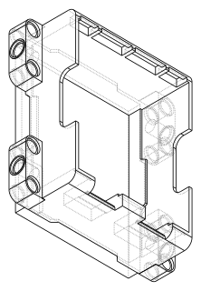
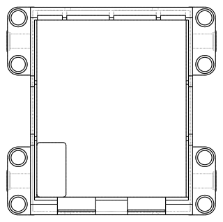
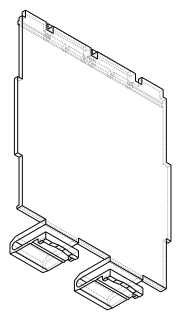
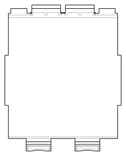

# Lineage: Powered Up Hub Battery Box — Rounds 1–9, plus superseded round-10/11 material
<!-- Filename: 2026-08-19-poweredup-hub-battery-box_lineage.md  (tracked in git under docs/design_plans/) -->

> **What this file is.** The bulk of this file is the complete, verbatim design document as it
> stood at the end of Round 9, preserved as an audit trail before Round 10's foundational pivot. It
> is kept readable on its own — every section below, including the
> Meta/Objective/Research/Architecture/Implementation Plan/Tests/Success Criteria/Out of
> Scope/Known Risks and the full Design Dialog Log (rounds 1–9), is reproduced exactly as it
> existed at that point, errors included. **Two later sections** (near the end, before *Sign-off*)
> hold additional superseded material from rounds 10 and 11: round 10's height-budget option
> analysis (resolved a different way in round 12) and round 11's briefly-designed-then-reversed
> outer-rib add-on. See the main brief,
> [`2026-08-19-poweredup-hub-battery-box_design.md`](2026-08-19-poweredup-hub-battery-box_design.md),
> for the current design.
>
> **Why it exists.** Round 10 (see the main brief,
> [`2026-08-19-poweredup-hub-battery-box_design.md`](2026-08-19-poweredup-hub-battery-box_design.md))
> found two foundational errors in everything below:
>
> 1. **The footprint was never 7×9 studs on two different axes.** "7" (main body) and "9" (body +
>    arms) are the SAME axis (56.0 mm vs. 72.0 mm) — the user had counted the arms into one figure
>    and not the other. The real orthogonal axis is 8.9 studs = 71.2 mm. Every wall, rib, hinge, and
>    cavity position derived below from a 72×56 mm footprint is built on that error.
> 2. **"5 studs tall" was computed as 5 × `BRICK_HEIGHT` = 48.0 mm** (see *Round 1* below) instead
>    of 5 × 8.0 mm stud pitch = 40.0 mm. Round 1's reasoning inferred the height convention from
>    silhouette proportions instead of a real measurement, and got it wrong — the number was
>    carried forward, uncorrected, through every subsequent round.
>
> Both were caught only once real LDraw geometry (LEGO Powered Up Hub 88012, part `22127`, and its
> sub-parts) was measured directly, independently reproduced by this Designer, and cross-checked
> against a value the coordinator had already computed. **Nothing below should be read as current.**
> The dimensions, the bespoke U-tab/hinge-tab retainer mechanism (superseded by round 10's decision
> to model the cover as an exact copy of the real LEGO lid geometry), the 2-part
> box+cover structure (superseded by round 10's 3-part box+tray+cover structure), and the
> Arrma-derived interior ribbing/strap-guide geometry are all superseded. The **cantilever/U-spring
> compliant-beam research** (strain formula, deflection budget, `retention_angle=90` square-catch
> principle) is the one piece of reasoning from this file that DOES carry forward — it is still the
> basis for validating that a printed copy of LEGO's real latch geometry will flex without
> yielding, which the LDraw measurement alone cannot tell us.

---

## Meta
- **Requirements ref**: N/A — requirements captured directly from the user's request in this design
  session (no separate `_req.md`); the four numbered requirements are reproduced verbatim in
  **Objective** below.
- **Requester role**: User (direct request; no Admin/PM intermediary for this session)
- **Date**: 2026-08-19
- **Dialog rounds**: 9 (no TL co-design round performed *by this Designer* — this brief scopes a
  TL-round requirement for a new reusable class but does not perform it; per
  `vibe/INSTRUCTIONS.md` §5, TL owns shared `Protocol`/ABC contracts, not the Designer. Round 1:
  user correction of the rib design. Round 2: top-view mark investigation, non-uniform wall
  thickness, and a full cover-mechanism redesign. Round 3: retainer-mechanism fork (press-to-release
  latch replaces the round-2 Technic-pin clip), press-access-corridor verification, and reusable-class
  scoping. Round 4: the user specified the actual mechanism — a **reverse latch** with **U-shaped
  spring tabs** (superseding round 3's external-boss straight-cantilever latch), new short-end wall
  thicknesses (5.0 mm tab side / 4.0 mm foot side, superseding round 2's uniform 2.0 mm), a
  cover-alone visual contract, and a structural (`CutterProtocol`-based) requirement that the box
  and cover mating features share one source of truth. Round 5: the user specified the U-tab's
  kinematics precisely — **hook on the outer leg, pressed inward to release** — which required
  designing a dedicated **press-access window** through the tab-side wall, re-deriving the outer
  leg's required deflection and strain, and re-scoping the press-corridor check a second time.
  Round 6: a verify-and-refine pass on two already-existing features — confirming (and fixing) that
  the tab-side window actually exposes a pressable **push-pad** (the bare leg was `5.5 mm`
  recessed, tool-only), and dimensioning + adding a **retention lip** to the foot-side hinge-tab
  pocket so the cover cannot lift away once the latch releases. Round 7: **TWO** push tabs
  (replacing the single tab) and **wider** foot-end hinge legs — first sized from generic
  ergonomic/analogy reasoning, then that sizing **superseded mid-round** by the user's own real
  LEGO measurements (`12.7 mm` tab width/spacing, `14.0 mm` foot-leg width / `2.0 mm` gap) — see
  *Design Dialog Log*. Round 8: two user decisions in one message — the strap-guide internal
  channel promoted to a confirmed `20.5 mm` clearance figure, and foot-wall thickening
  (`4.0 mm → 5.0 mm`) in direct response to round 7's own flagged wall-weakening risk, including a
  direct "no" answer to the user's explicit "would 1 mm behind the keeper work?" question and a
  re-centring of the cavity on `Y=0.0`. Round 9: the user named the battery pack (Spektrum
  SPMX812SH2), closing the longest-open assumption in the brief (open since round 2) — resolved
  dimensional fit (verified, single orientation), but surfaced a new, still-open blocking finding
  (the IC2 connector/lead does not clear the cavity as a plain rectangular pocket) and a residual
  `6.39 mm³` interference between the U-tab retainer and the battery envelope, both explicitly
  flagged rather than glossed over. **Rounds 3, 4, 5, 6, AND 7's instructions were all sent by the
  user during a still-active prior round and queued unprocessed, or arrived as a mid-task
  interruption on an already-accepted or still-in-progress round** — round 3's during round 2,
  round 4's message was queued/lost twice (once during round 2, reported again before round 3's
  processing completed) before being fully processed, round 5's arrived as a mid-task interruption
  while round 4 was being finished, round 6's arrived immediately after round 5 was accepted and
  closed, round 7's own sizing was superseded by a second coordinator message arriving while the
  first was still being processed, and round 9 arrived as an explicit mid-round fold-in while
  round 8 was still being written ("if you are mid-round, fold in; if idle, this is the next
  round"); all seven are recorded in *Design Dialog Log* with this provenance stated explicitly,
  not silently absorbed.)

---

## Objective

Design (not implement) a Lego-Technic-compatible battery-box housing modelled on the real
**LEGO Powered Up Technic Hub (set 88012)**, per four explicit user requirements:

1. Same footprint as the real 88012: **9 × 7 × 3 studs (L × W × H)**.
2. **Four 3-hole liftarm-style ribs** surrounding the body — **revised per user correction**: 2
   ribs on each of the 2 long (L) sides, at stud positions 1–3 and 7–9, on the top H-unit, each
   rib with an alternating main/perp/main hole-axis pattern (not one rib per wall, not mid-height,
   not three parallel bores — see *Research* and *Rib placement* below).
3. Height: **3 studs tall** for this design (the real hub is 5 studs tall; the user plans a
   2-layer stack, and this design covers only the **bottom layer**).
4. A **removable cover / hatch in the bottom face** for battery access, echoing the real hub's
   battery hatch — **revised in round 2** (hinge-tab pivot + a clip, replacing snap-fit; interior
   ribbing and strap guides borrowed from a real RC battery-door reference, Arrma Gorgon),
   **revised again in round 3** (the clip became a press-to-release straight-cantilever latch),
   and **revised a third time in round 4**: the user specified LEGO's actual mechanism — a
   **reverse latch** whose bite point sits on the box's inner wall (not an external protrusion),
   engaged by a **U-shaped compliant tab molded into the cover** that is its own spring (no
   separate spring feature). See *Cover mechanism* below.
5. Non-uniform wall thickness — **(round 2)** short (W) end walls 2.0 mm, long (L) rib-carrying
   side walls 1.2 mm, replacing the earlier uniform `BLOCK_WALL` 1.5 mm; **superseded again in
   round 4**: the two short end walls are no longer equal — **5.0 mm on the latch/tab (`+Y`) end,
   4.0 mm on the hinge/foot (`-Y`) end** — the round-2 uniform 2.0 mm figure for both short ends is
   now stale and must not be read from that earlier section. The long (L) rib-carrying walls
   remain 1.2 mm, **not restated by the user this round — carried forward as a flagged
   assumption**, not a confirmed value (see *Known Risks*).

## Research: what the real 88012 actually is

Web research (BrickLink, Rebrickable, LEGO's own product/help pages) confirms:

- **88012 is inventoried as a single part** ("Set Composition: 1 Part" — BrickLink catalog
  entry, item dimensions 15.5 × 15 × 4 cm are the **retail package**, not the part). It is a
  custom-molded ABS shell, **not** an assembly of real separate Technic liftarm pieces bolted
  around a brick core.
- LEGO's own battery-replacement instructions state the battery compartment is accessed by
  **removing a bottom panel**, which is described as sliding/lifting off, then replacing it —
  confirming requirement 4 (bottom-face hatch) is domain-faithful, not a user misconception.
- **(round 4) Domain fidelity strengthened, not just re-confirmed.** Round 3's web research could
  not identify the real 88012's exact retention mechanism (no teardown source returned that
  level of detail). In round 4 the user supplied it directly, from first-hand knowledge of the
  real part: LEGO used a **reverse latch** (bite point on the box's inner wall, not an external
  catch) with **U-shaped compliant tabs** on the cover providing both the hook and the spring
  return. This is a stronger domain-fidelity source than the round-1/2/3 web research (which
  covered the general mechanism *class*, molded-part construction, and generic
  press-to-release/battery-door practice, but not this specific part's exact internal geometry) —
  the design is now tracking what LEGO actually built, not just a plausible RC-adjacent analogue.
- No source returned an official LEGO mm spec sheet for the case footprint/height (LEGO does
  not publish part-level engineering drawings for this housing). **The 9×7-stud (L×W) footprint and
  "5 bricks tall" real-part height are therefore carried forward as the user's supplied figures,
  cross-checked against this Designer's general knowledge of the part** (consistent with how
  the Technic-builder community commonly describes the hub's envelope) **rather than an
  independently re-derived measurement.** This is flagged as an open item in *Known Risks* —
  before this brief's numbers are treated as print-ready, a physical caliper check or a
  BrickLink/Rebrickable STEP/LDraw model comparison should confirm the footprint independently.

**Reconciling "four 3-hole liftarms surrounding the body" — REVISED after user correction.** The
first pass of this brief misread "surrounding the body" as *one rib per each of the 4 walls*.
The user corrected this explicitly: the 4 ribs are **not** one per face. They sit **only on the
two long (L, 9-stud) sides — two ribs per long side, at the two ends of that run** (stud
positions 1–3 and 7–9; the middle three studs, positions 4–6, carry no rib). `2 sides × 2 ribs =
4 ribs total` — that is where the user's "four" count actually comes from, not "one per side of
a 4-sided box." The two short (W, 7-stud) end walls carry **no** ribs at all.

Each rib is **not** a plain 3-parallel-hole liftarm either. The user specified an **alternating
hole-axis pattern**: hole 1 bores along H (the box's vertical/height axis), hole 2 bores along W
(the box's short horizontal axis, i.e. radially into/out of the wall), hole 3 bores along H again
— so the two outer holes are parallel to each other and the middle hole is perpendicular to both.
This is **exactly** the geometry `PerpendicularHolesLiftarm`
(`vibe_cading/lego/technic_beam_perp.py`, landed on this branch in commit `ab27a20`) already
implements: a 3-hole liftarm whose native "main" axis (+Z, vertical when laid flat) and "perp"
axis (±Y, through the narrow side faces) are independently selectable per hole position. This
design **reuses `PerpendicularHolesLiftarm` as-is**, not `LegoTechnicBeam`, and not a hand-rolled
rib — see *Rib geometry reuse* below for the fit check (does the class's shape match the
requirement out of the box, or does it need a parameter/rotation) and the *Rib placement*
subsection for the wall/position/height derivation.

## Architecture / Approach

### Approach chosen

**Two parts** (per the Multi-Part-Assemblies rule — the hatch physically separates from the
body in normal use, so it is a distinct deliverable, not a sub-feature of one class):

1. **`PoweredUpHubBatteryBox`** — the shell: a hollow hexahedral body, footprint `9 × 7` studs
   (L × W), height `3` "studs" (resolved to brick-height units, see below), **non-uniform wall
   thickness on ALL FOUR walls as of round 4**: long (L) rib-carrying walls `1.2 mm`
   (round 2, unchanged, **not restated this round — flagged assumption**), short (W) end walls
   **no longer equal to each other** — tab/latch end (`+Y`) `5.0 mm`, hinge/foot end (`-Y`)
   `4.0 mm` (round 4, supersedes round 2's uniform `2.0 mm` for both — see *Wall thickness*),
   with **4 `PerpendicularHolesLiftarm(3, ["main","perp","main"])` ribs** fused onto the two
   **long (L)** walls only — 2 ribs per wall, at the two ends of the 9-stud run, **unchanged from
   round 1, approved, and unaffected by every wall-thickness revision since (ribs key off the
   OUTER footprint stud grid, not the interior cavity)** — solid roof, and an open bottom exposing
   the battery cavity, plus a hinge-tab slot cut into the `-Y` (foot) wall and (**round 5,
   replacing round 4's whole-`CantileverSnapFit`-body catch, which itself replaced round 3's
   external-boss design**) a small internal **barb catch cavity** cut into the **inner face** of
   the `+Y` (tab) wall, fully contained within its `5.0 mm` thickness with **no external boss**
   (round 3's boss is deleted — it was needed only because the catch depth exceeded a bare
   `2.0 mm` wall; `5.0 mm` comfortably contains even the smaller round-5 barb cavity, verified
   numerically), plus a **round-5 press-access window** (a through-wall opening, replacing round
   4's press-access hole) bored through that same wall, positioned between the barb's and the
   U-tab's bridge Z-bands (see *Cover mechanism*).
2. **`PoweredUpHubBatteryHatch`** — **REVISED round 2 (hinge/mechanism), round 3 (straight
   cantilever), round 4 (reverse latch + U-tab approximation), REVISED AGAIN round 5 (two-leg
   U-tab with the hook on the outer leg)**: a battery-door cover, not a plain flat snap-fit panel
   — pivoting on 2 hinge tabs that slide into the box's foot-wall slots at one end, retained at
   the other end by a **two-leg U-shaped compliant tab** (inner leg + bridge + outer leg, latch
   and spring in one piece, per the user's direct specification of LEGO's actual mechanism and its
   release kinematics) whose barb — on the outer leg's *outward* face — hooks onto the box's
   **internal** bite point rather than engaging an external catch, released by pressing the outer
   leg inward through the round-5 wall window — superseding round 4's single-hook approximation,
   which superseded round 3's straight-cantilever/external-boss design, which itself superseded
   round 2's Technic-pin cross-hole, which itself superseded the Arrma reference's literal R-clip
   — with interior longitudinal ribbing for rigidity and 2 interior strap-guide loops to hold the
   battery down. See *Cover mechanism* for the full round-5 retainer redesign.

Both **reuse existing project primitives** rather than inventing new geometry generators where a
fit exists: `PerpendicularHolesLiftarm` (`vibe_cading/lego/technic_beam_perp.py`) for the ribs,
and the square-return-face *principle* from `CantileverSnapFit` (`vibe_cading/mechanical/joints/snap_fit.py`,
reused conceptually as of round 5 — the class's literal body is a confirmed mismatch for the
outer leg, see *Cover mechanism* → *Retainer* → *Round 5*) for the cover's
press-to-release retainer's catch-geometry *principle* — **round 4: reused again (still as the
literal class), now mounted internally rather than externally; round 5: narrowed to the
square-return-face principle only, since the literal class body was found to conflate the
compliant shaft with the insertion-sweep envelope once the two-leg U-shape was actually
constructed** (see *Cover mechanism* → *Retainer* → *Round 5*) — see *Cover mechanism*. This keeps
the new module thin — mostly composition and placement — and gets the already-visual-contract-
pinned rib geometry (hole diameter, counterbore, chamfer, tolerance profile forwarding,
alternating hole-axis pattern) for free. **`CantileverSnapFit`'s status has changed three times**:
round 1 proposed it as the mechanism for the *whole cover*'s retention (rejected in round 2 by
explicit user direction — hinge + a clip tab replaced it entirely); round 2 therefore used only
`TechnicPinHole` for the clip (now also superseded — see below); **round 3 brings `CantileverSnapFit`
back**, not as a reversal of round 2, but as the correct load-bearing element for one specific
*feature* (the latch) once the user's press-to-release requirement ruled out a pull-out pin, and
round 4 kept reusing the literal class body; **round 5 narrows this a final time** — only the
square-return-face principle is reused, the literal class body is a confirmed mismatch for a
two-leg U-shape (see *Cover mechanism* → *Retainer* → *Round 5*). `TechnicPinHole` is **no longer
used for the retainer** as of round 3 (still used, unaffected, for all 12 rib bores). The hinge
tabs remain plain parametric `cq.Workplane` primitives (rectangular tab + rectangular slot, sized
with tolerance-profile-driven clearance) — two existing project joint classes (`PrintInPlaceHinge`,
`DovetailJoint`) were evaluated for the hinge and found **not** to fit (see *Cover mechanism* →
*Hinge and retainer reuse check*), so that remains a checked-and-documented non-fit, unaffected by
rounds 3–5.

#### Rib geometry reuse — does `PerpendicularHolesLiftarm` fit as-is?

Read `vibe_cading/lego/technic_beam_perp.py` in full (docstring, constructor, hole-axis
convention, tests/contracts referenced in `docs/design_plans/2026-06-26-perpendicular-holes-
liftarm_design.md`) before writing this subsection, per the coordinator's instruction. Findings:

- **Shape**: `PerpendicularHolesLiftarm(num_holes=3, hole_axes=[...])` bbox is
  `X ∈ [0, 24] × Y ∈ [-3.9, 3.9] × Z ∈ [0, 7.8]` — identical stadium-beam cross-section to
  `LegoTechnicBeam(3)` (`BEAM_THICKNESS × BEAM_WIDTH = 7.8 × 7.8`, length `3 × STUD_PITCH = 24`).
  No shape mismatch.
- **Hole-axis selector**: per-position `"main"` (bores +Z) or `"perp"` (bores ±Y) is already a
  first-class constructor parameter — **exactly** the alternating-direction feature requirement 3
  needs. **No new parameter or code change to the class is required.**
- **Default pattern mismatch (real, but trivially avoided)**: the class's *default*
  (`hole_axes=None`) alternating pattern is `["perp","main","perp"]` for `num_holes=3` — perp at
  the **outer** positions, main in the middle. The user's requirement is the **opposite**:
  `["main","perp","main"]` — main (H-axis) outer, perp (W-axis) middle. Passing the default would
  be silently wrong. **Resolution: pass `hole_axes=["main","perp","main"]` explicitly** — the
  class's documented per-position override, not a new feature.
- **Frame reuse**: the class's native "main" bore axis (+Z) is vertical when the beam is laid
  flat — this is **already** the box's H (vertical) axis with **zero rotation needed on that
  axis**. Only the beam's *length* axis (native X) and *perp* bore axis (native Y) need to be
  swapped onto the wall's L and W directions respectively — a **single 90° rotation about Z**
  does exactly that (verified below), with no rotation needed about X or Y. This is simpler than
  the rejected first-pass design's per-wall 4-distinct-transform scheme (which needed different
  X/Y rotations per wall) precisely *because* the class's main axis already matches H.

**Verdict: `PerpendicularHolesLiftarm` fits this requirement as-is.** No mismatch to report — it
needs an explicit non-default `hole_axes` argument and one placement rotation, both ordinary
constructor/placement usage, not a gap in the class.

#### Convention resolution — "studs tall" vs. brick-height units (user-requested reconciliation)

The project's grid has **two** vertical units that are easy to conflate:

| Unit | Value | What it measures |
|---|---|---|
| `STUD_PITCH` | 8.0 mm | Horizontal centre-to-centre stud spacing (X/Y grid) |
| `BRICK_HEIGHT` | 9.6 mm | Vertical height of one standard brick (= 3 × `PLATE_HEIGHT`) |

**Footprint** (X/Y) is unambiguous: "N studs" always means `N × STUD_PITCH` — there is no other
horizontal unit in the system. **Height**, when a LEGO fan says "N studs/bricks tall" about a
squarish component like a hub or a motor housing (as opposed to counting exposed top studs on a
plate), conventionally means **N standard bricks stacked**, i.e. `N × BRICK_HEIGHT`, not
`N × STUD_PITCH`. Corroboration: the real 88012 is commonly described as "5 bricks tall," and
`5 × BRICK_HEIGHT = 48.0 mm` matches the hub's known proportions (visibly taller than it is deep,
squarely brick-stack-shaped) far better than `5 × STUD_PITCH = 40.0 mm` would (which would make
it nearly cubic against the 56–72 mm footprint — inconsistent with the hub's actual squat-brick
silhouette). **Resolution: height is `N × BRICK_HEIGHT`.** For this design, `N = 3` →
`3 × 9.6 = 28.8 mm`.

> **⚠ WRONG — corrected round 10.** This entire resolution was inferred from silhouette
> proportions ("visibly taller than it is deep," "squat-brick silhouette") rather than measured.
> Round 10 measured the real part directly (LDraw model `22127.dat`, LEGO's own official geometry,
> independently re-verified by this Designer): the full 5-stud-tall hub is **40.0 mm**, i.e.
> `5 × STUD_PITCH`, not `5 × BRICK_HEIGHT`. "N studs/bricks tall" for this squarish component turns
> out to mean the plain stud pitch after all — the proportional-silhouette argument this section
> used to rule that reading out was simply wrong once checked against a measurement. See the main
> brief's *Height convention* section for the corrected reasoning and value (`3 studs = 24.0 mm`
> for this design). Every downstream number in this file that depends on `BRICK_HEIGHT`-based
> height (body height `28.8 mm`, rib Z-bands, hinge/latch Z-positions, cover thickness headroom) is
> superseded along with it.

#### Dimension table (all values sourced from `vibe_cading/lego/constants.py`; no new magic numbers)

| Quantity | Formula | Value | Source constant |
|---|---|---|---|
| Footprint W (short axis, world X) | `7 × STUD_PITCH` | 56.0 mm | `STUD_PITCH = 8.0` |
| Footprint L (long axis, world Y) | `9 × STUD_PITCH` | 72.0 mm | `STUD_PITCH = 8.0` |
| Body height (world Z = H) | `3 × BRICK_HEIGHT` | 28.8 mm | `BRICK_HEIGHT = 9.6` |
| ~~W-end wall thickness (round 2)~~ | ~~user-specified~~ | ~~2.0 mm~~ | **SUPERSEDED round 4 — see below; do not use this value** |
| **Tab/latch-end (`+Y`) wall thickness (round 4)** | user-specified | **5.0 mm** | User correction — see *Wall thickness — round 4* below; unchanged by round 8 |
| ~~Foot/hinge-end (`-Y`) wall thickness (round 4)~~ | ~~user-specified~~ | ~~4.0 mm~~ | **SUPERSEDED round 8 — see below; do not use this value** |
| **Foot/hinge-end (`-Y`) wall thickness (round 8, SUPERSEDES round 4)** | Designer recommendation (matches the `+Y` wall), authorised by the user ("make it thicker if there is a weak point") | **5.0 mm** | derived — see *Wall thickness — round 8* below; both short walls now equal |
| L-side wall thickness (rib-carrying) | round-2 value, **not restated round 4 — flagged assumption** | **1.2 mm** | See *Known Risks* — unconfirmed as of round 4 |
| Top plate (roof) thickness | `BLOCK_ROOF` | 1.0 mm | Reused from `LegoBlock`'s FDM roof default (unchanged — not part of any wall-thickness correction) |
| Rib cross-section | `BEAM_THICKNESS × BEAM_WIDTH` | 7.8 × 7.8 mm | `PerpendicularHolesLiftarm(3, ...)` body, unmodified |
| Rib length (3-hole span) | `3 × STUD_PITCH` | 24.0 mm | `PerpendicularHolesLiftarm(3, ...).length_mm` |
| Pin hole (bore) | `PIN_HOLE_DIAMETER + 2×slip.radial` | ≈4.90 mm on `fdm_standard` | `TechnicPinHole.standard()` inside `PerpendicularHolesLiftarm` |
| Pin hole counterbore | fixed | Ø6.2 × 1.0 mm deep | `TechnicPinHole.standard()` defaults |
| Top-H-unit band | `[(3-1)×BRICK_HEIGHT, 3×BRICK_HEIGHT]` | `[19.2, 28.8]` mm | derived (see *Rib placement*) |
| Rib H-centreline | `top-unit midpoint` | `Z = 24.0` mm | derived (see *Rib placement*) |
| ~~Interior cavity (round 2)~~ | ~~`(56-2×1.2) × (72-2×2.0)`~~ | ~~53.6 × 68.0 mm~~ | **SUPERSEDED round 4 — see below** |
| ~~Interior cavity (round 4, on the asymmetric short walls)~~ | ~~`(56-2×1.2) × (72-5.0-4.0)`~~ | ~~53.6 × 63.0 mm, Y-midpoint `-0.5 mm`~~ | **SUPERSEDED round 8 — see below** |
| **Interior cavity (round 8, SUPERSEDES round 4 — both short walls now `5.0 mm`)** | `(56-2×1.2) × (72-5.0-5.0)` | **53.6 × 62.0 mm, Y-midpoint `0.0 mm`** | derived — cavity is **re-centred on world `Y=0`**, since the two short walls are equal again; see *Wall thickness — round 8* below for every downstream position this moves |
| Rib protrusion beyond outer L-wall face | `7.8 - 1.2` | **6.6 mm** | Unaffected by round 4 (L-wall thickness unchanged) |
| **Whole box+rib bbox (round 4, re-verified; round 5 combined-probe note below)** | derived | **`X∈[-34.6,34.6], Y∈[-36.0,36.0], Z∈[0,28.8]`** (round 4 figure) — **round 5's combined visual-contract probe measured `X∈[-31.9,31.9]`**, a probe-construction difference in where the ribs sit flush against the wall (outer- vs inner-face-referenced placement), **not a mechanism-driven dimension change**; flagged explicitly rather than left as a silent inconsistency between the two probes — see *Visual contract* | `Y` is `±36.0` in both (the round-3 external boss that had pushed it to `38.0` stays deleted); rib X-placement is an Implementation Plan T2 detail for the Developer to pin down precisely, not fixed by either probe |
| Cover thickness (proposed, round 2) | Designer proposal for the sliding-obstacle load case | **3.0 mm** | see *Cover mechanism* → *Thickness and load case*, unaffected by round 4/5 |
| Usable battery-cavity **height** | `(28.8-1.0) - 3.0(cover) - 1.0(interior rib)` | **≈23.8 mm**, unaffected by round 4/5 (the central-footprint figure; the U-tab's own local height is a separate, secondary check — see below) | derived — see *Cover mechanism* → *Interior height budget* |
| ~~Usable battery-cavity FOOTPRINT (round 4)~~ | ~~53.6 × 63.0 mm~~ | ~~SUPERSEDED round 8~~ | round 8 shrinks it a further `1.0 mm` in Y — see below |
| **Usable battery-cavity FOOTPRINT (round 8, SUPERSEDES round 4)** | `53.6 × 62.0 mm` (matches the round-8 cavity) | **53.6 × 62.0 mm**, down from round 4's `53.6 × 63.0 mm` and round 2's `53.6 × 68.0 mm` | **CHECKED round 9** against the named Spektrum SPMX812SH2 (`58×32×20 mm`) — fits dimensionally (`4.0/21.6/3.8 mm` slack X/Y/Z) in one orientation; the IC2 connector does NOT fit without further work — see *Cover mechanism* → *Battery pack fit — Round 9* and *Known Risks* |
| **U-tab overall height (round 5, new)** | inner leg + bridge, `LEG_Z_LO` to `BRIDGE_Z_HI` | **`Z∈[3.0,16.5]`** | derived — see *Cover mechanism* → *Retainer* → *Round 5*; well clear of the `27.8 mm` roof-underside budget, localized near `Y∈[26.75,32.00]` |
| **Outer-leg cantilever length / thickness (round 5, new)** | chosen to bring strain within budget (see below) | **`L=12.0 mm`, `t=1.5 mm`** | derived, not the first value tried (`L=6.5 mm` gave `≈9.6 %` strain) — see *Cover mechanism* → *Retainer* → *Round 5* |
| **Required outer-leg deflection (round 5, new)** | barb protrusion (`1.5 mm`) + release margin (`0.3 mm`) | **`1.8 mm`** | derived — see *Cover mechanism* → *Retainer* → *Round 5* |
| **Outer-leg strain at required deflection (round 5, new)** | `ε = 3ty/(2L²)` | **`≈2.8 %`** | derived, within typical FDM allowable strain (`1–5 %`, per the round-3 research family) — see *Cover mechanism* → *Retainer* → *Round 5* |
| ~~Press-access window (rounds 5/6, and round 7's first ergonomic-derived draft)~~ | ~~`8×3 mm`; draft `18×8 mm`~~ | ~~SUPERSEDED — see below~~ | round 7's final figure uses the user's real LEGO measurement, not the ergonomic draft |
| **Press-access window (round 7, FINAL — supersedes rounds 5/6 AND round 7's own ergonomic draft)** | width/spacing from the user's LEGO measurement (`1/2 inch ≈ 12.7 mm`); height a Designer proportion choice within the `10 mm` barb-to-bridge band | **`12.7×8.0 mm`, `Z∈[6.0,14.0]`, through the `+Y` wall, ×2 (one per tab)** | derived — see *Cover mechanism* → *Round 7, item A*; `12.7 mm` flagged as a measured approximation of a metric part, not an exact nominal — see *Known Risks* |
| ~~Push-pad (round 6, and round 7's ergonomic draft)~~ | ~~`6×2 mm`; draft `16×6 mm`~~ | ~~SUPERSEDED — see below~~ | round 7's final figure matches the LEGO-measured window |
| **Push-pad (round 7, FINAL)** | inset `1 mm` within the window on all sides, protrudes from the outer leg's outward face toward the wall's exterior face | **`10.7×6.0 mm` footprint (×2, one per tab), `5.0 mm` protrusion, `0.5 mm` reveal from the exterior face** | derived — see *Cover mechanism* → *Round 7, item A* |
| **Two-tab spacing (round 7, FINAL — LEGO-measured)** | tab centres from the user's `1/2 inch` width + `1/2 inch` gap measurement | **centres `X=±12.7 mm`; `38.1 mm` total span; `8.95 mm` margin to the wall's `X=±28 mm` edge; `7.75 mm` margin to the `X=±26.8 mm` cavity edge** | derived — see *Cover mechanism* → *Round 7, item A*; supersedes the ergonomic draft's `X=±14.0 mm`/`10.0 mm` gap/`3.8 mm` margin |
| ~~Foot-end hinge-tab (round 6, and round 7's analogy-derived draft)~~ | ~~`6.0×3.0×3.0 mm`; draft `12.0×3.0×3.0 mm`~~ | ~~SUPERSEDED — see below~~ | round 7's final width is the user's real LEGO measurement, not the analogy-derived double |
| **Foot-end hinge-tab (round 7, FINAL — LEGO-measured)** | width/gap from the user's measurement ("Leg width: 14mm, with a 2mm gap"), Y-depth/Z-thickness unchanged | **`14.0×3.0×3.0 mm` (X×Y-depth×Z)**, lip grows `+0.4 mm`/face over the last `0.5 mm` of insertion | derived — supersedes round 7's own `12.0 mm` analogy-derived draft |
| **Foot-tab spacing (round 7, FINAL)** | centres from the user's measured width/gap | **centres `X=±8.0 mm`; `30.0 mm` total span; `11.80 mm` margin to the `X=±26.8 mm` cavity edge** | derived — see *Cover mechanism* → *Round 7, item B* |
| **Strap-guide internal channel (round 8, first dimensioned entry — was previously a solid placeholder, no channel at all)** | internal width = user-confirmed strap width (`20.0 mm`) + user-specified clearance (`0.5 mm`) | **channel `20.5 mm` (Y, width) × `4.0 mm` (Z, height, Designer choice — see *Strap guides* → *Round 8*)**, bored along X (the strap's travel axis) | derived — see *Cover mechanism* → *Strap guides — Round 8*; `0.5 mm` clearance is a direct user-specified absolute, not `get_profile()`-derived — see the fit-grade comparison there |
| ~~Strap-guide loop material (round 8) — centred `Y=0`~~ | ~~`1.5/1.0/3.0 mm`, `X=±22.8`, `Y=0`~~ | ~~SUPERSEDED round 9 — see below~~ | round 9 re-centres on the battery's own midpoint, not the cavity's |
| **Strap-guide loop material (round 9, SUPERSEDES round 8's Y-centring)** | wall margin around the channel; guide's own depth along the strap's travel axis; Y-position now keyed to the battery envelope | **`1.5 mm` (Y wall) / `1.0 mm` (Z wall) / `3.0 mm` (X depth)** — overall loop footprint `23.5 × 6.0 × 3.0 mm`, centred `X=±22.8 mm`, **`Y=-2.0`** (battery midpoint, not the cavity's `Y=0`) | Designer proposal, flagged like the cover-thickness figure — not load-calculated |
| **Battery pack (round 9, CONFIRMED — Spektrum SPMX812SH2)** | manufacturer spec page (fetched directly) | **`58 × 32 × 20 mm` (L×W×H), `65 g`** | see *Cover mechanism* → *Battery pack fit — Round 9*; retail "packaging" figure (`2.5×5.8×2.3 in`) explicitly NOT used |
| **Battery envelope (round 9, new)** | flush against the `-X` strap guide's inner face; flush against the `-Y` (hinge) wall | **`X∈[-21.3,10.7]`, `Y∈[-31.0,27.0]`, rests on interior ribs `Z∈[4.0,24.0]`** | derived — see *Cover mechanism* → *Battery pack fit — Round 9*; single orientation only (`58 mm` must run along Y) |
| **Wire channel (round 9, new)** | between the battery envelope and the `+X` strap guide | **`X∈[10.7,21.3]` (`10.6 mm` wide), full `62 mm` Y-length** | derived — flagged as tight relative to an assumed `15–25 mm` connector need; does NOT by itself resolve the IC2 connector-clearance blocking finding — see *Known Risks* |
| **Interior rib field (round 9, SUPERSEDES round 2's 5-rib field)** | confined to the battery's own X-footprint, dropping the 2 ribs that fell inside the new wire channel | **3 ribs at `X=-16,-8,0`** (was 5 ribs at `-16,-8,0,8,16`) | derived — see *Cover mechanism* → *Battery pack fit — Round 9* |
| **Height clearance over the battery (round 9, new)** | roof underside (`27.8 mm`) minus battery-on-ribs top (`24.0 mm`) | **`3.8 mm`**, or **`1.8 mm`** with the unconfirmed `~2 mm` strap thickness passing over the pack | derived — flagged as tight, see *Known Risks* |
| ~~Foot-end pocket throat / keeper (round 6, and round 7's draft)~~ | ~~throat `6.3×3.3 mm`/`12.3×3.3 mm` draft~~ | ~~SUPERSEDED — see below~~ | X-dimension only; Y/Z unchanged throughout |
| ~~Foot-end pocket throat / keeper (round 7, into a 4.0mm wall)~~ | ~~throat `14.3×3.3 mm`; keeper `14.3×4.1 mm`~~ | ~~pocket depth `3.2 mm`; `0.8 mm` behind keeper; `≈30.5%` removed~~ | **SUPERSEDED round 8 — see below; wall thickened to 5.0mm** |
| **Foot-end pocket throat / keeper (round 8, SUPERSEDES round 7 — wall thickness only)** | tab/lip cross-section + `profile.free.radial` (`0.15 mm`) each side; keeper depth adds `profile.free.axial` (`0.2 mm`) float; pocket depth UNCHANGED (`3.2 mm`, independent of wall thickness) | **throat `14.3×3.3 mm`; keeper `14.3×4.1 mm`; pocket depth `3.2 mm`** into the now-`5.0 mm` foot wall | derived — see *Cover mechanism* → *Wall thickness — round 8*; **`1.8 mm` wall material now remains behind the keeper** (up from round 7's `0.8 mm`); local wall-material removal drops to **`≈24.4%`** per tab (down from `≈30.5%`, still the highest wall-weakening figure in the brief — see *Known Risks*); lip contact area unchanged (`4.80→11.20 mm²`, `2.33×`) |

**Axis convention — derived from the user's (L, W, H) framing, stated plainly (not carried
forward as an arbitrary pick).** The user's restated envelope is `9 × 7 × 3 = (L, W, H)`, and the
rib-placement requirement is stated *in terms of L* ("either L side," "positions 1-3, 7-9" of the
L run) and *in terms of H and W* (hole directions). That framing only constrains the geometry
once L, W, H are each pinned to a world axis — so this is now load-bearing, not cosmetic, and is
stated explicitly rather than left as an implicit labelling choice: **L (9 studs) = world Y, W (7
studs) = world X, H (3 units) = world Z.** H → Z is not a free choice (H is "up," and Z is this
project's universal vertical/print-bed-normal axis — see *Absolute Zero-Datum Consistency* in
`vibe/INSTRUCTIONS.md`). L → Y and W → X, however, remain a **labelling convention** in the same
sense flagged in the rejected first pass — no reference photo of the real 88012 was found to pin
which physical face is the long one in world terms — but the choice is kept identical to the
first pass (Y = long, X = short) for continuity, and is now internally load-bearing (every rib
position below is stated in L/W/H terms first, then mapped through this table) rather than
asserted as inherently photo-grounded.

**Origin / datum.** `(0, 0, 0)` = centre of the box footprint in XY, **Z = 0 at the true bottom
of the assembly** (where the hatch sits and the printed part's bed face is) — this is the
project's zero-datum convention (primary interface, and here also the natural "bottom of the
2-layer stack" reference for when the upper layer is designed later). The body extrudes **+Z**
to `28.8 mm` at the roof underside +1.0 mm roof = **top face at Z = 28.8 mm**, which is the
reserved (out-of-scope, deferred) mating face for the future upper layer. Unchanged from the
first pass.

**Wall thickness — NEW, round 2 (non-uniform, replaces uniform `BLOCK_WALL` 1.5 mm).** User
direction, verbatim: *"Wall thickness: short ends 2mm, long ends 1.2mm."* This sentence is
ambiguous English on its own ("short ends" / "long ends" could describe either the walls
themselves or something else) — the reading adopted here, stated explicitly so a reviewer can
correct it in one place if wrong: **the two short (W, 7-stud, world ±Y) end walls are 2.0 mm; the
two long (L, 9-stud, world ±X) side walls — the ones carrying the ribs, approved unchanged in
round 1 — are 1.2 mm.** Rationale for why this reading is coherent (not just literal): the long
walls are locally stiffened by the fused `PerpendicularHolesLiftarm` ribs at their two ends, so
they can run thinner there; the short end walls carry no ribs at all and are asked to be the
thicker, more self-supporting pair. If the intended reading is reversed, every downstream number
in this subsection and the *Rib placement* section flips between the two wall values — flagged in
*Known Risks*.

**Propagated consequences (recomputed, not just the dimension-table row edited):**
- **Interior cavity** cross-section is bounded by the ±X walls on X and the ±Y walls on Y:
  `X: 56 - 2×1.2 = 53.6 mm`, `Y: 72 - 2×2.0 = 68.0 mm` — **53.6 × 68.0 mm**, superseding the
  round-1 figure `53 × 69 mm` (which assumed uniform 1.5 mm).
- **Rib protrusion** beyond the outer L-wall face: rib depth `7.8 mm` − wall `1.2 mm` = **6.6 mm**
  (was `6.3 mm` on the round-1 uniform 1.5 mm wall) — the rib protrudes *further* now that its
  host wall is thinner.
- **Whole box+rib bounding box** — recomputed and **re-verified numerically** in the regenerated
  probe (not carried forward from round 1): inner face of the +X wall is now
  `28 - 1.2 = 26.8` (was `26.5`); rib X-span becomes `[26.8, 34.6]` (was `[26.5, 34.3]`); by
  symmetry the −X rib spans `[-34.6, -26.8]`. The probe's measured whole-body bbox is
  **`X ∈ [-34.6, 34.6], Y ∈ [-36.0, 36.0], Z ∈ [0, 28.8]`**, single solid confirmed — the round-1
  figures `X ∈ [-34.3, 34.3]` are now **stale and superseded**. Y and Z are unaffected by the
  wall-thickness change (rib Y-position is pure L-stud math, independent of wall thickness on
  either axis; Z is independent of wall thickness entirely).

**Is 1.2 mm printable/sound as an FDM wall at this scale?** Stating a view rather than silently
accepting the number: **1.2 mm is printable** (roughly 3 perimeter lines at a common 0.4 mm
nozzle) and is fine on the two rib-backed spans (positions 1–3 and 7–9 of each L-wall), where the
fused 7.8 mm-deep rib acts as a local stiffening flange. It is **more of a genuine risk on the
bare middle span** (positions 4–6, the 24 mm of each L-wall with no rib) — a 1.2 mm-thick, ~27.8
mm-tall (wall spans the full body height under the roof), 24 mm-wide unsupported panel is 20 %
thinner than this project's own `BLOCK_WALL` 1.5 mm FDM default for exactly this kind of
freestanding wall, and battery-box side walls do take incidental handling/insertion force. **View
adopted**: accept the user-specified 1.2 mm as given (this is a direct, explicit user
specification, not a Designer default), but flag it as a real risk rather than silently signing
off — **predicted cost if it turns out too thin**: a bowed or cracked middle span discovered only
after printing, costing one reprint cycle plus a design revision (most likely a light interior
gusset or a locally-thickened boss at the mid-span, both cheap fixes) — moderate cost, not a
redesign-scale risk, but non-zero and not free either. Recorded in *Known Risks* with this same
predicted-cost estimate.

**Wall thickness — round 4 (short-end walls, superseding round 2's uniform 2.0 mm entirely).**
User direction, verbatim: *"We probably need thicker wall, lego used 5mm on the tab side and 4mm
on the 'foot' side."* Reading adopted, stated explicitly per the coordinator's instruction: **the
two short (W) end walls are no longer equal to each other** — the latch/tab end (`+Y` wall,
carrying the retainer) is **5.0 mm**; the hinge/foot end (`-Y` wall, carrying the hinge) is
**4.0 mm**. **This supersedes round 2's `2.0 mm` figure for both short ends — that number is now
stale wherever it appears in earlier sections of this brief and must not be read as current.**
The long (L) rib-carrying walls are **not restated this round**; carried forward as `1.2 mm`
**by assumption, not confirmation** — flagged explicitly in *Known Risks* rather than silently
treated as still-current just because the user didn't contradict it.

**Propagated consequences (recomputed, not hand-carried — per the same discipline as round 2):**
- **Interior cavity** loses `5.0 + 4.0 - 2.0 - 2.0 = 5.0 mm` of L-extent versus round 2:
  `Y: 72 - 5.0 - 4.0 = 63.0 mm` (was `68.0 mm`); `X` unaffected (`53.6 mm`, no change to L-wall
  thickness). **New cavity: `53.6 × 63.0 mm`.**
- **The cavity is no longer centred on world `Y = 0`.** With unequal short walls, the cavity's Y
  range is `[-36+4.0, 36-5.0] = [-32.0, 31.0]`, midpoint `Y = -0.5`. Every feature sized to the
  cavity (the cover, its hinge tabs, its latch tab, its strap guides) inherits this `-0.5 mm`
  offset — re-derived explicitly below, not assumed to still centre on `0`.
- **Whole box+rib bbox**: ribs are unaffected (they key off the outer footprint, not the cavity),
  so `X∈[-34.6,34.6]` and `Z∈[0,28.8]` are unchanged from round 3. `Y` is **also** unchanged
  numerically (`±36.0`, the plain footprint) but for a **different reason** than in round 2/3: the
  round-3 external latch boss (which had pushed `Y` to `38.0`) is **deleted** in round 4 (see
  *Cover mechanism* — the thicker `5.0 mm` wall makes the boss unnecessary), so the bbox's `Y`
  extent reverts to the plain footprint rather than staying pushed out. **Verified numerically in
  the regenerated probe**: `X∈[-34.6,34.6], Y∈[-36.0,36.0], Z∈[0,28.8]`, single solid.
- **Hinge axis** moves from `Y = -34.0` (round 2/3, on a 2.0 mm foot wall) to `Y = -32.0` (round 4,
  on the thicker 4.0 mm foot wall) — 2 mm further from the world-Y=0 centreline.
- **Latch/tab position** moves from `Y = 34.0`/`36.0`-ish (round 2/3, on a 2.0 mm tab wall) to
  `Y = 31.0` (round 4, the new `+Y` wall's inner face, on the thicker 5.0 mm wall) — the bite point
  is now noticeably further inboard, consistent with it being an *internal* feature (see *Cover
  mechanism*).
- **Strap guides**, which are centred on the cover's own Y-midpoint (round 2 used world `Y=0` when
  the cavity was still symmetric), now centre on `Y = -0.5` to match the recomputed off-centre
  cavity — re-derived, not left pointing at the old centreline.

**Battery-fit check (round 4, the user's explicit "if it's getting tight, say so" ask).** The
usable cavity is now **`53.6 × 63.0 mm` footprint × `≈23.8 mm` height**. This is materially
smaller than round 2/3's `53.6 × 68.0 mm` footprint. Common RC "shorty" 2S hardcase LiPo packs
run roughly **70 mm long** (with plenty of common packs in the `65–75 mm` range) — **a `63.0 mm`
cavity is plausibly too short lengthwise for a typical shorty pack**, not just "tight." This is
stated directly, not softened: **if the intended battery is a standard shorty 2S/3S hardcase pack,
this cavity may not fit it**, and the human should check real pack dimensions before treating this
design as sized correctly — the L-dimension shrink from the thicker walls is a genuine, possibly
blocking constraint, not a minor tolerance concern. No specific pack was named in any round, so
this cannot be resolved without more information from the human; flagged prominently in *Known
Risks*, not buried.

**Wall thickness — round 8 (foot wall thickened `4.0 mm → 5.0 mm`, SUPERSEDES round 4's foot-wall
figure; re-centres the cavity on `Y=0`).** User direction, verbatim: *"For the wall thickness,
make it thicker if there is a weak point. Would 1mm remaining behind the keeper work?"* — an
authorisation to thicken conditioned on this Designer's own analysis, plus a direct question to
answer, not just a number to implement blindly.

**Direct answer to the user's question, stated plainly.** No — `1.0 mm` behind the keeper (the
round-7 figure, at the un-thickened `4.0 mm` wall) is not recommended. At a `0.4 mm` FDM nozzle,
`1.0 mm` prints as roughly two perimeter lines plus gap-fill, with effectively no solid interior —
adequate for a cosmetic or lightly-loaded wall, but this specific `1.0 mm` sits behind a feature
that (a) takes a one-time **press-fit assembly snap** (the tab's lip deflecting past the throat),
not just static contact load, and (b) already carries this brief's highest wall-weakening
percentage (`≈30.5 %` local material removed). **Recommended instead: thicken the foot wall to
`5.0 mm`, matching the tab-side wall**, leaving **`1.8 mm`** behind the keeper (pocket depth
`3.2 mm` is unchanged — it does not depend on wall thickness) — roughly four perimeter lines, a
genuinely solid section, not a thin skin.

**Why depart from the round-4 measured reference at all — the core argument, stated explicitly
because it generalises.** The `4.0 mm` foot-wall figure came from the user measuring an
**injection-molded ABS** LEGO part (round 4: *"lego used 5mm on the tab side and 4mm on the 'foot'
side"*). Molded ABS is a solid, isotropic material with no layer-adhesion plane; **FDM prints are
not** — interlayer bonds are measurably weaker than in-plane strength, especially under the kind
of press-fit/impact loading this feature takes. Reproducing a molded part's wall thickness
verbatim in FDM systematically **under-builds** the part, most acutely exactly where round 7 found
the most material already removed (`30.5 %`). This is not a one-off judgement call specific to
this wall — it is a general principle: **any dimension in this brief sourced from measuring the
molded 88012 should be read as a lower bound for FDM, not a target.** Checked against the rest of
this brief for other occurrences: the round-7 U-tab/hinge-tab **leg widths** (`12.7 mm`/`14.0 mm`)
are also LEGO-measurements, but they size *plan-view footprint* (X/Y extent), not a thin
load-bearing wall cross-section — the closer analogue there is the legs' own *compliant-beam*
behaviour (thickness `t=1.5 mm`, a Designer-chosen value, not LEGO-measured), which is already
gated by the strain-budget checks and flagged for print/flex-test confirmation in *Known Risks* —
the same underlying molded-vs-FDM concern, already covered by an existing mitigation, not a new
gap. The `+Y` wall's `5.0 mm` figure is *also* a molded-part measurement, but it was never the
thin point (round 5/7 found it comfortably contains its cavity with margin even before this
round); no change made there.

**Alternative considered and not chosen: `4.5 mm` (`1.3 mm` behind the keeper, ~3 perimeters).**
Recorded because the user should see the option not taken, not just the one implemented. `4.5 mm`
stays nearer the LEGO reference (a `0.5 mm` step instead of `1.0 mm`) and would still roughly
triple the round-7 figure's perimeter count. **Not chosen** because it leaves the highest-risk
wall in the brief at only 3 perimeters on a press-fit feature, when matching the already-approved
`5.0 mm` tab-side wall costs nothing architecturally (both short walls being equal is a
simplification, not a complication) and only `1.0 mm` more of cavity length than `4.5 mm` would
have cost.

**Propagated consequences (recomputed, not hand-carried).**
- **Interior cavity**: `Y: 72 - 5.0 - 5.0 = 62.0 mm` (was `63.0 mm` at round 4's `4.0 mm` foot
  wall; `68.0 mm` at round 2's uniform `2.0 mm`). `X` unaffected (`53.6 mm`). **New cavity:
  `53.6 × 62.0 mm`.**
- **The cavity is RE-CENTRED on world `Y = 0`.** With both short walls equal again, the cavity's Y
  range is `[-36+5.0, 36-5.0] = [-31.0, 31.0]`, midpoint `Y = 0.0` — **round 4's `-0.5 mm` offset
  is superseded, not carried forward.** This is a genuine simplification, called out explicitly:
  every feature that inherited the `-0.5 mm` offset in round 4 (cover panel, interior ribbing,
  hinge tabs, strap guides — the latch/U-tabs did NOT inherit it, since they're keyed off
  `CAV_Y_HI`, which is unchanged) is re-centred, not offset, going forward.
- **Cover panel**: Y-span `[-31.0, 31.0]`, length `62.0 mm` (was `63.0 mm`, off-centre).
- **Hinge axis**: moves from `Y = -32.0` (round 4, on the `4.0 mm` foot wall) to `Y = -31.0`
  (round 8, on the thicker `5.0 mm` foot wall) — `1 mm` further inboard, symmetric with the tab
  side's `Y = 31.0` inner face.
- **Foot-wall hinge-tab pockets**: centred at the same `X=±8.0 mm` (round 7, unaffected — X
  positioning is independent of wall thickness), now cut from `Y=-31.0` inward, pocket depth
  unchanged at `3.2 mm`, **remaining wall material behind the keeper now `1.8 mm`** (was `0.8 mm`).
- **Strap guides**: re-centred on world `Y = 0` (were centred on `Y = -0.5` as of round 4) — see
  *Strap guides — Round 8* below for the full treatment, since round 8 also changes their shape.
- **Tab-side (`+Y`) wall, U-tabs, catch cavities, press-windows, push-pads**: **all unchanged** —
  every one of these is keyed off `CAV_Y_HI = FY - WALL_TAB`, and `WALL_TAB` (`5.0 mm`) is
  untouched by this round. Confirmed by re-running the round-7 press-corridor checks
  unmodified (see below): still `0.0000 mm³` for both tabs.
- **Whole box+rib bbox**: unaffected in `X`/`Z`; `Y` unaffected too (`±36.0`, the plain footprint —
  wall-thickness changes move the *cavity* boundary, not the outer footprint).
- **Foot-wall local wall-weakening, re-measured at `5.0 mm`**: **`≈24.4 %`** per tab (down from
  round 7's `≈30.5 %` at `4.0 mm`) — still the single highest wall-weakening figure in the brief
  (the tab-side wall's is `≈12.6 %`), but materially improved, verified numerically in the
  regenerated probe, not asserted from the thickness ratio alone.
- **Both press corridors and both fouling checks (guides/ribs/hinge-tabs) re-run against the
  round-8 geometry**: all measured `0.0000 mm³`, reproducing round 7's results — the foot-wall
  change and the re-centring do not reopen either check, confirmed rather than assumed.

**Battery-fit check, RE-STATED and MORE pressing (round 8).** The usable cavity is now
**`53.6 × 62.0 mm` footprint × `≈23.8 mm` height** — down again from round 4's `53.6 × 63.0 mm`,
itself down from round 2's `53.6 × 68.0 mm`. This is the **fourth** consecutive round in which a
wall-thickness or mechanism decision has shrunk the cavity, and the fit question has **never been
checked against a named pack** across any of them. Common RC "shorty" 2S hardcase LiPo packs still
run roughly `65–75 mm` long — a `62.0 mm` cavity is now **more** likely to be too short, not less.
**This is escalated, not merely repeated**: recommend the human name a real pack (or confirm the
cavity is intentionally sized for a specific known-smaller pack) before any further round shrinks
this number again without that check landing first.

> **Resolved round 9**: the user named the Spektrum SPMX812SH2. Dimensional fit is now verified
> (the pack fits in exactly one orientation, `58 mm` along Y) — but a new, separate blocking
> finding (IC2 connector/lead clearance) surfaced in its place. See *Battery pack fit — Round 9*
> below for the full treatment; this escalation's dimensional half is closed, its connector half is
> not.

**Rib placement — REVISED (all three corrections applied; unaffected by round 4 or round 8 —
ribs key off the outer footprint, not the cavity).**

*Which walls (correction 1).* Ribs sit **only** on the two **L-side walls** — the walls whose
outward normal is W (world ±X), because those are the walls whose face runs along the L (9-stud,
world Y) direction. The two W-side (short, world ±Y) end walls carry **no** ribs. Per L-side
wall, 2 ribs sit at the two ends of the L run — **stud positions 1–3 and 7–9** — with positions
4–6 (the middle 24 mm) bare. With stud-centre `n` at local-L coordinate `(n - 0.5) × STUD_PITCH`
(`n = 1..9`) and the footprint centred at the origin (`L = 0` at world `Y = -36`): positions 1–3
span local `L ∈ [0, 24]` → world `Y ∈ [-36, -12]`; positions 7–9 span local `L ∈ [48, 72]` →
world `Y ∈ [12, 36]`. This exactly matches `PerpendicularHolesLiftarm(3, ...)`'s own hole centres
(local `x = 4, 12, 20`, i.e. stud positions 1, 2, 3 of its own local run) with **zero extra
offset math** — the class's own length already *is* a 3-stud span.

*Height (correction 2).* The box's H spans 3 brick-height units (`Z ∈ [0, 28.8]`); the **top**
unit is `Z ∈ [(3-1) × BRICK_HEIGHT, 3 × BRICK_HEIGHT] = [19.2, 28.8]`. The rib's own H-extent
(`BEAM_THICKNESS = 7.8 mm`, unchanged by the placement rotation — see next paragraph) is
**centred** in that top-unit band, not flush to either edge: centreline
`Z = (19.2 + 28.8) / 2 = 24.0`, so the rib spans `Z ∈ [24.0 - 3.9, 24.0 + 3.9] = [20.1, 27.9]` —
entirely inside `[19.2, 28.8]` (0.9 mm margin below, 0.9 mm margin above). This replaces the
first pass's incorrect mid-height `Z = 14.4` centreline entirely. Note `27.9` is 0.1 mm inside
the roof's underside (`28.8 - BLOCK_ROOF = 27.8` is exceeded by 0.1 mm) — this is a small,
*deliberate* real overlap into the roof, not a clearance bug: coincident/tangent boolean faces
are the documented OCCT hazard (*Known Modelling Pitfalls*), so a hair of positive overlap where
the rib's top face meets the roof is the safer condition, not a defect.

*Hole-axis reuse and orientation (correction 3).* Each rib is
`PerpendicularHolesLiftarm(3, ["main","perp","main"])` (see *Rib geometry reuse* above),
rotated **90° about Z only** (no X or Y rotation, unlike the rejected first pass's per-wall
4-distinct-transform scheme). Verified numerically (`cadquery` `BoundingBox` on the actual
class, not hand-derived alone): the native bbox `X ∈ [0,24], Y ∈ [-3.9,3.9], Z ∈ [0,7.8]` becomes,
after `rotate((0,0,0), (0,0,1), 90)`, `X ∈ [-3.9,3.9], Y ∈ [0,24], Z ∈ [0,7.8]` — length axis
(local X) now lies along world Y (L, ✓), the perp/W bore axis (local Y) now lies along world X
(W, ✓), and the main/H bore axis (local Z) is **unchanged**, staying world Z (H, ✓) — exactly the
required mapping, confirming no rotation about X or Y is needed.

Per-wall X translation (radial placement — reasoning unchanged from round 1, only the wall
thickness input changed per round 2: full L-wall-thickness overlap with the wall's inner face,
avoiding the coincident-face boolean hazard, leaving `7.8 - 1.2 = 6.6 mm` protruding beyond the
outer wall face — **recomputed on the round-2 1.2 mm L-wall, superseding round 1's 1.5 mm-based
figures**):
- **+X wall** (`X = +28`, inner face `X = 28 - 1.2 = 26.8`): rib's rotated local `X = -3.9` face
  maps to the wall's inner face → X-translate `= 26.8 - (-3.9) = 30.7`; rib X-span `[26.8, 34.6]`.
- **−X wall** (`X = -28`, inner face `X = -26.8`): rib's rotated local `X = +3.9` face maps to
  the wall's inner face → X-translate `= -26.8 - 3.9 = -30.7`; rib X-span `[-34.6, -26.8]`.

Y translation (per the *Which walls* derivation above): `-36` for the positions-1-3 rib, `+12`
for the positions-7-9 rib (rotated local Y-span `[0,24]` + translate) — **unaffected by the
wall-thickness change**, since rib Y-position is pure L-stud math independent of either wall's
thickness. Z translation: `20.1` (per the *Height* derivation above) for all 4 ribs — also
unaffected.

These transforms were **verified numerically** in the (regenerated round-2) visualisation probe:
the resulting box+ribs body bounding box is **`X ∈ [-34.6, 34.6]`, `Y ∈ [-36.0, 36.0]`,
`Z ∈ [0, 28.8]`** — the round-1 figure `X ∈ [-34.3, 34.3]` is now **stale and superseded** (thinner
L-wall → more rib protrusion); Y and Z are unchanged from round 1 for the reasons above — and the
fused body is confirmed as a **single solid** (`len(body.solids().vals()) == 1`).

### Top-view investigation — what were the marks the user noticed? (round 2, item 1)

Before describing the new cover, this resolves the specific artifact the user flagged: two
small rectangles (13 interior paths total) visible in the round-1 committed top-view SVG, at
`X ∈ [18.77, 20.50] × Y ∈ [-3.0, 3.0]` and the mirrored `X ∈ [-20.50, -18.77] × Y ∈ [-3.0, 3.0]`
— two `1.73 × 6.0 mm` rectangles at `X = ±19.6`, `Y = 0`.

**What they were**: the round-1 probe's two illustrative `CantileverSnapFit` hook geometries,
belonging to the hatch, which the probe rendered **dropped clear below the box** (an explicit
probe-staging choice, captioned in a paragraph above the image but not repeated at the image
itself) — visible from directly overhead because a top-projection SVG shows every edge in the
view frustum regardless of Z depth, not just the topmost surface.

**The inconsistency this exposed, and its resolution**: the round-1 brief text said the hooks
engage "catches cut into the box's two long (`Y = ±36`) walls." Two things were wrong with that:
(a) it was **stale axis text** — after the L/W/H correction earlier in round 1, the long (L,
9-stud) walls are the **`X = ±28`** faces, not `Y = ±36` (which now names the *short* W-end
walls); the sentence was never updated when the axis mapping changed. (b) Separately, the round-1
probe's hooks sat at `X = ±19.6`, which is `8.4 mm` **inboard** of even the correct `X = ±28`
wall — floating at mid-span, engaging no wall at all, because the probe script's hook translate
used the flat panel's own half-width as a placeholder rather than the box wall's actual inner-face
coordinate. **Both the text and the probe geometry were wrong, and not consistently wrong with
each other** — this was not a single typo, it was two independent mistakes that happened to
produce different numbers.

**This entire question is now moot rather than merely fixed**, because round 2's cover mechanism
(below) **replaces `CantileverSnapFit` entirely** — there are no snap hooks anywhere in the
corrected design, so there is nothing left to mis-position or mis-describe. What matters going
forward: the regenerated top-view SVG (see *Visual contract*) shows **only the box**, with no
cover geometry at all, precisely so this class of "what is this floating mark" question cannot
recur — see the image caption for the staging rule adopted.

### Cover mechanism — REVISED, round 2 (hinge), round 3 (retainer fork), round 4 (reverse latch + U-tab), round 5 (U-shape kinematics + window), round 6 (push-pad + foot-end retention lip), REVISED AGAIN round 7 (two push tabs, wider foot tabs)

The user redirected the cover design from a generic snap-fit panel to a specific mechanism
borrowed from a real RC battery door (Arrma Gorgon), **plus** two requirements of the user's own
not present in that reference (strap guides, clip retainer tabs as an explicit ask). This is a
**different mechanism, not an addition to snap-fit** — `CantileverSnapFit` is dropped from both
the box (no more catch cutouts) and the hatch (no more hook geometry).

**Wall assignment (a new design decision, not dictated by the user text).** The hinge sits on one
W-end wall, the clip on the other — deliberately putting the entire cover mechanism on the
**short (W) end walls**, which carry no ribs, keeping the **long (L) rib-carrying walls** purely
dedicated to the Lego-Technic pin interface. This is a clean functional separation: L-walls =
Technic mounting, W-walls = cover hinge/latch. It also sidesteps the round-1 "hooks sharing a
wall with the ribs" open question entirely — there is no longer any wall that carries both a rib
and a retention feature.

**Pivot hinge tabs (Arrma feature 1).** Two rectangular tabs protrude from the cover's `-Y` edge
into matching slot pockets cut into the `-Y` (W-end) wall, forming a pivot axis along **X** at
the cover's edge, at the cover's mid-thickness. The cover swings open downward/outward about this
axis for battery access — a **removable-by-design pivot** (the user's requirement 4 origin — a
battery door must open, unlike `PrintInPlaceHinge`'s permanent captive joint; see *Hinge and clip
reuse check* below). **Tolerance**: the user's own text calls for "a slight tolerance offset so
they don't bind when swinging open" — routed through **`vibe_cading.print_settings.get_profile()`**,
specifically the **`free` fit grade** (a loose/rotating fit, the same grade
`PrintInPlaceHinge` itself uses for its own knuckle clearance — `profile.free.radial`, confirmed
by reading `vibe_cading/mechanical/hinge.py`), **not a hardcoded clearance float** — this is an
explicit project rule (`vibe/INSTRUCTIONS.md` §"Manufacturing & Tolerance Profiles").

**Retainer — REVISED round 3 (mechanism fork), REVISED AGAIN round 4 (reverse latch + U-tab, per LEGO's actual mechanism).**

> **This round-3 instruction was originally sent during round 2 and never processed** — it
> queued after that round's final tool call. Verified against the round-2 text before writing
> this section: "press" appeared only as a tolerance fit-grade literal, there was no latch-geometry
> research section, and the Design Dialog Log had no entry for it. This is genuinely a new round
> (round 3), not a re-statement of round 2, and it **changes the retainer** round 2 designed.

**The fork.** The round-2 retainer (a Technic-pin cross-hole tab, reasoned as the in-domain
equivalent of the Arrma reference's literal R-clip) is released by **pulling the pin out**. The
user's round-3 requirement is explicit: *"we need to press for it to release, meaning the path to
press cannot be blocked."* A pull-out pin and a press-to-release latch are **different
mechanisms** — different failure modes (a lost/misplaced loose pin vs. a captive latch that can't
be misplaced), different clearance requirements (axial withdrawal room vs. a lateral
finger-press corridor), and different part counts (a loose retainer to keep track of vs. none).
**These are not blended here.** Two readings were possible and are stated explicitly so the human
can overturn the choice in one place:
- *(adopted)* The cover needs a **press-to-release cantilever latch**; the R-clip/Technic-pin
  detail is dropped entirely.
- *(rejected)* The pin retainer is kept and "press" refers to something else (pressing the cover
  in to seat it, or pressing a tab to align the cross-hole).

**Reading adopted: the former.** "The path to press cannot be blocked" is a clearance requirement
that is only meaningful for a finger or tool pressing a latch arm to deflect it — it has no
sensible reading against a pin that is pulled, not pressed. **This supersedes both the Arrma
R-clip detail and the round-2 Technic-pin decision.** The `+Y` wall no longer carries a
`TechnicPinHole` cross-bore; it carries a latch catch instead (below). *(Note for* Alternatives
rejected*: `CantileverSnapFit`, which round 2 rejected as the retention scheme for the whole
cover, is now partially back — by a different route (as the load-bearing element of one specific
feature, the latch) and for a different reason (a user-specified press-to-release requirement, not
a return to the original whole-cover-snap-fit proposal). The hinge is unaffected by this fork and
is unchanged from round 2.)*

> **Round 4 resolves this fork's remaining open question — which mechanism, specifically — with
> the actual answer, not further deliberation.** The fork above correctly identified *that* the
> mechanism is press-to-release; it did not yet know *which* press-to-release mechanism. The user
> has now specified it directly: LEGO's real **reverse latch** with a **U-shaped spring tab**. This
> is not a re-opening of the press-vs-pull fork (that stays resolved as above) — it is the
> resolution of a *narrower*, previously-undetermined question (straight external cantilever, as
> round 3 guessed, vs. the internal reverse-latch-plus-U-tab LEGO actually used) now answered by
> direct user knowledge rather than continued reasoning from ergonomic first principles. The
> remainder of this subsection is revised accordingly, below.

**B — Research, before any geometry.** Per the user's explicit gate ("do some research before
jumping into the design"), press-to-release cantilever latch mechanics were researched before
drawing anything:
- **Beam length/thickness/deflection/strain relationship.** For a cantilever snap beam, outer-fibre
  strain scales with deflection and beam thickness and inversely with the *square* of beam length
  — doubling beam length reduces strain by ~4×, while doubling thickness roughly doubles it, so a
  longer, thinner beam is more forgiving (lower insertion/release force for the same deflection)
  but yields lower retention force, which must be recovered through geometry (hook depth, undercut)
  rather than by over-thickening the beam and risking yield at the root
  ([Answermind cantilever snap-fit guide](https://www.answermind.blog/cantilever-snap-fit-design-guide);
  [HM Making cantilever snap-joint formulas](https://hmaking.com/cantilever-snap-joint-design-formulas-materials/)).
- **Tapering the beam** (reducing thickness 25–50% from root to tip) distributes bending strain
  more evenly along the beam and can increase allowable deflection materially versus a
  uniform-section beam — a refinement available if the default uniform-section beam proves too
  stiff or too strain-limited at this scale ([Answermind](https://www.answermind.blog/cantilever-snap-fit-design-guide)).
  `CantileverSnapFit` (below) builds a **uniform-section** beam — the simpler, more conservative
  starting point; tapering is a documented future refinement, not adopted here.
- **Undercut/return-face angle governs positive-lock vs. push-off/release behaviour.** A
  **90° (square) return face** creates a positive catch that will not release under pull-out load
  alone — it must be deliberately deflected (pressed) to disengage. A **shallower return angle**
  produces a ramped face that *can* release under enough pull force without a deliberate press (a
  "push-off" or self-releasing latch) — the wrong behaviour for "press to release," since the
  requirement implies the latch should *not* release from incidental pulling, only from a
  deliberate press
  ([HM Making](https://hmaking.com/cantilever-snap-joint-design-formulas-materials/);
  [Clarwe snap-fit joint types guide](https://www.clarwe.com/blog/guide-to-snap-fit-joints-types-design-and-manufacturing.html)).
  Recommended undercut depth for a typical FDM part is **0.5–1.5 mm**
  ([Answermind](https://www.answermind.blog/cantilever-snap-fit-design-guide)).
- **Release-access geometry and finger-pad sizing.** For a latch intended for repeated
  disassembly (not a permanent snap), the design must provide an **open push-recess or finger
  grip** giving clear access to deflect the cantilever, and the release force must be comfortable
  for an average finger given the exposed pad's surface area — this is the ergonomic root of the
  user's "the path to press cannot be blocked" requirement, not just a geometric nicety
  ([PlasticsToday snap-fit design fundamentals](https://www.plasticstoday.com/injection-molding/injection-molding-design-fundamentals-snap-fits-for-plastic-parts);
  [Jiga snap-fit joints guide](https://jiga.io/articles/snap-fit-joints/)).

**`CantileverSnapFit` reuse check — read in full before designing (round 3 snapshot; round 5
narrows this verdict further — see the "Conclusion, UPDATED round 5" paragraph in *Hinge and
retainer reuse check* below, and *Round 5* for why the whole-body reuse claimed here does not
survive the two-leg U-shape construction).** Per the same reuse-first discipline as the
`PerpendicularHolesLiftarm` round, `vibe_cading/mechanical/joints/snap_fit.py` was read in full
(not skimmed) before any new geometry was drawn. Findings, mapped against the research above:
- Its `male()`/`to_cutter()` pair already models exactly a uniform-section cantilever hook with a
  configurable `retention_angle` — **`retention_angle=90.0` gives the researched positive/square
  catch** (does not self-release under pull load; `h_retention` collapses to `0`, confirmed by
  reading the formula), which is the correct choice for "press to release, not pull to release."
- Its `insertion_angle` (default `30°`) is the researched lead-in ramp for low insertion force.
- It does **not**, on its own, model an explicit finger-pad or a documented access-corridor
  contract — it builds the load-bearing hook/catch geometry only. The user's "path to press cannot
  be blocked" requirement is therefore **not fully covered by using `CantileverSnapFit` alone** —
  it supplies the mechanism physics; the finger-pad/access-corridor guarantee is an **additional**
  contract this design's "general Clip Retainer Tab" (item D below) would need to add.
- **Verdict: `CantileverSnapFit` fits and is reused directly for this part's load-bearing latch
  geometry** (`retention_angle=90`, scaled-down `thickness=1.2, hook_depth=1.0, length=6.0,
  width=8.0` to suit this part's scale — verified numerically below), rotated `90°` about Z so its
  native press/motion axis (native `+X`) becomes world `+Y`/`-Y` (verified: native hook
  `X∈[0,2.2],Y∈[-4,4],Z∈[-1,7.7]` → rotated `X∈[-4,4],Y∈[0,2.2],Z∈[-1,7.7]` — motion axis now Y, as
  required for a latch that presses in from outside the `+Y` wall). This is the same rotation
  trick already used for the ribs and the hinge tabs in earlier rounds, re-verified here rather
  than assumed to transfer.

**Round 3's finding (external boss needed) is now superseded by round 4's thicker wall — stated
explicitly, not silently dropped.** Round 3 found the class's default catch-cavity native Y-span
(`~3.6 mm`) exceeded the then-bare `2.0 mm` W-end wall, requiring an external reinforcement boss
(pushing the bbox to `Y∈[-36,38]`). **Round 4 changes the premise**: the tab-side wall is now
`5.0 mm` — comfortably more than the `~3.6 mm` cavity depth. **The boss is deleted as a
simplification**, not carried forward as a leftover: verified numerically in the regenerated
probe, the catch cavity's Y-span is `[29.75, 33.45]` (translating the class's native origin to the
wall's inner face, `Y = 31.0`), entirely within the wall material `Y∈[31.0, 36.0]` — **no boss
needed, confirmed computationally** (`catch_cavity.ymax = 33.45 ≤ 36.0`, the wall's outer face),
not just by inspection.

**Reverse latch — the bite point sits on the box's inner wall, not an external catch (round 4,
per the user's explicit description of LEGO's actual mechanism).** The catch/undercut ledge is
now cut into the `+Y` wall's **inner** face (facing the cavity), fully contained within its
`5.0 mm` thickness — there is nothing protruding outward past the wall's outer face at all. This
is the geometric meaning of "reverse latch": round 3's design had the compliant part (the hook)
reaching *out* to a catch that was itself partly external (needing a boss); round 4's design keeps
the entire bite point *inside* the box body, exactly as the user described the real 88012. The
U-shaped tab on the cover reaches up into the cavity toward the `+Y` wall and hooks onto this
internal ledge — the engagement is wholly interior to the box.

**U-shaped tab — does it fit the researched geometry, and does `CantileverSnapFit` still model
it?** `CantileverSnapFit` builds a **straight** uniform-section cantilever beam; the user
specifies a **U-shaped** tab, i.e. a beam folded back on itself. Per the round-3 research (kept,
re-applied here rather than re-derived): a U-fold is a documented technique specifically for
*extending effective beam length in a constrained footprint*, which **reduces** strain for a given
deflection versus a shorter straight beam occupying the same envelope, and improves resistance to
taking a set / fatiguing after repeated open-close cycles — both directly relevant here since the
retainer is a daily-use, repeatedly-cycled feature, not a one-time assembly snap
([Xometry Pro snap-fit joints guide](https://xometry.pro/en/articles/snap-fit-joints-for-plastics/);
[ezraMade snap-fit design practices](https://ezramade.com/snap-fit-joints-design/)). The
root-fillet sizing guidance from this same research family (`R ≈ 0.6t`, the "golden ratio" for
snap-beam roots, where `t` is beam thickness) is the standard mitigation for the fatigue/micro-crack
failure mode a repeatedly-cycled cantilever root is exposed to
([Xometry Pro](https://xometry.pro/en/articles/snap-fit-joints-for-plastics/)) — noted here as a
concrete, citable detail for the Developer, not yet baked into a specific fillet radius in this
brief. **Verdict, stated plainly rather than stretched**: `CantileverSnapFit` models the
**straight-beam special case** of this family correctly (and is reused for the load-bearing
hook/catch geometry in this probe, at the class's existing default proportions) — it does **not**
natively draw a literal folded-U beam path. This is a genuine, honest gap, not a forced fit: the
probe approximates the U-tab with `CantileverSnapFit`'s straight beam (same physics — compliant
cantilever + positive catch — different silhouette), and the literal U-fold geometry is recorded
as an open question for the *Reusable classes* / TL round (does the general retainer class need a
folded-beam-path option, or is the straight-beam approximation acceptable for this part's actual
loads?) rather than quietly modelled as if `CantileverSnapFit` already draws a U.

**Press-access hole — reverse-latch version, since the bite point moved inside the wall.** Round
3's open external corridor (finger reaches an exposed hook past a boss) no longer applies now that
the bite point is internal — the finger/tool must instead reach **through** the `5.0 mm` wall.
Resolution: a **press-access hole bored straight through the tab-side wall** (`Ø6.0 mm` in the
probe), from just inside the cavity edge, through the full `5.0 mm` wall thickness, and out the
exterior face, centred on the tab's press-target Z-band. This is a materially different corridor
shape than round 3's (a through-bore plus a short external approach, not an open lateral
approach past a boss) — the round-3 `0.0000 mm³` result was for that different geometry and is
**superseded**, not still valid for this one; re-measured below.

**Where the latch sits, and why it does not reopen the `Z=0` datum tension.** The tab mounts near
the cover's `+Y` edge, rising `+Z` off the cover's top face, reaching toward the `+Y` wall's inner
face (`Y = 31.0`) to hook onto the internal ledge — at a low Z-band (`Z ≈ 2–11 mm`), unchanged in
spirit from round 3. The press action is still horizontal (through the wall, `-Y` direction) and
confined to that low Z-band — it neither protrudes below `Z = 0` nor requires any bottom-face
cutout, so it still does not reopen the exterior-ribbing-vs-`Z=0`-datum tension resolved in
round 2; that tension was specifically about the *bottom* face, and this latch — internal bite
point and all — still lives entirely on a *side* (`+Y` end) wall, never the bottom.

**C — Press-access corridor, RE-VERIFIED against the round-4 reverse-latch geometry (the round-3
`0.0000 mm³` result is superseded, not reused).** Per the user's explicit constraint ("the path
to press cannot be blocked") and the coordinator's instruction that an *internal* bite point makes
blocked access **more** likely, not less — making this the single highest-value check in the
brief:
- **Corridor identified explicitly, two segments**: (a) the through-hole segment itself, inside
  the `5.0 mm` wall (`Y∈[31.0-2, 31.0-2+20]` in the probe, generously spanning from just inside the
  cavity through the wall and beyond, `Ø6.0 mm`); (b) an external approach segment beyond the
  wall's outer face (`Y∈[36.0, 51.0]`, `15 mm` of representative finger-approach distance), same
  diameter, same Z-band as the hole.
- **Verified by boolean intersection against a modelled "obstruction body"** — not visual
  inspection: `(box + ribs, with the catch cavity AND the press hole already cut)` unioned with
  `(the CLOSED-pose cover, minus the latch tab itself)` — every other feature: the ribs, both
  strap guides, both hinge/foot tabs, the interior ribbing, the box walls, the roof. The latch tab
  itself is excluded (pressing into it is the point). **Measured result: `0.0000 mm³`
  intersection** — the reverse-latch corridor is genuinely clear, confirmed computationally in the
  regenerated probe, not carried forward from round 3's different-shaped corridor and not
  asserted by construction alone. (An earlier draft of this probe measured a nonzero `11.06 mm³`
  overlap where the corridor's Z-band clipped the cover panel's own back edge near the wall — the
  corridor's Z-centre was raised to clear the `3.0 mm` cover top with margin, and the check was
  re-run to `0.0000 mm³`; recorded here as evidence the check is a real, sensitive gate and not a
  rubber stamp.)
- **The future upper layer, checked explicitly.** The corridor is entirely horizontal and confined
  to the same low Z-band as round 3's, far below the `Z = 28.8` datum reserved for the upper layer
  — unaffected by the internal-bite-point change, still stated explicitly per the coordinator's
  instruction rather than left implicit.
- **Three features near the cover's edges, re-checked against the shrunk/off-centre cavity, not
  assumed to still be clear.** The interior ribbing, the strap guides, and the latch all live in
  the cover/`+Y`-wall neighbourhood, and round 4 both moved the wall inward (cavity now `-0.5 mm`
  off-centre) and moved the bite point further inboard (`Y=31.0`, vs. round 3's `Y≈34–36`). The
  obstruction body used for the `0.0 mm³` result **includes** the strap guides' actual
  re-derived, off-centre-corrected geometry (not the stale round-2/3 positions), so this is a
  genuine re-check against the current layout, not a reused result relabelled.

**Longitudinal ribbing (Arrma feature 3) — moved to the interior face; exterior stays flush.**
The Arrma text specifies ribbing on the panel's *exterior* face. On this part, the exterior face
of the hatch **is the true bottom of the whole 2-layer assembly** — the `Z = 0` print-bed /
Lego-mating datum already established for this design. "Deep exterior grooves" directly
contradicts a flush `Z = 0` bottom. Three resolutions were available (recessed exterior grooves /
move the datum / put the ribbing on the interior face instead); **this design moves the ribbing to
the interior (battery-facing) face**, because: (a) the `Z = 0` flush-bottom datum is a
project-wide invariant (*Absolute Zero-Datum Consistency*) and the natural mounting/print-bed
face for this specific part — moving it has no justification here; (b) a plate stiffened by
ribs on the non-exposed face is standard practice (most injection-molded battery doors do exactly
this) — there is no structural reason the ribs must face outward for the stated
sliding-obstacle-abrasion load case; (c) recessed exterior grooves would *locally thin* the
already-thin exterior material, working against rigidity rather than for it — the opposite of
requirement 3's intent. **The `Z = 0` exterior face of the cover therefore stays perfectly flat**;
ribbing is 3–4 raised ridges (schematic in the probe: `1.0 mm` tall, `2.0 mm` wide, `8 mm` pitch)
running along **Y** (the plate's long/L dimension, matching "running the length of the plate") on
the interior (`+Z`-facing, battery-side) top face.

**Thickness and load case.** The user's stated load case is explicit and bounded: **not** a
drop/landing impact, but **sliding over obstacles** (abrasion/scrape contact with occasional
incidental point loads, not the shock loading a drop case would imply). Design proposal, not a
locked spec: **cover thickness 3.0 mm** (up from the round-1 placeholder "~1.5–2 mm, developer's
choice"), reasoned as enough sacrificial material for scrape wear plus a step up in bending
stiffness — helped further by the interior ribbing above — without reaching for drop-impact-grade
thickness (4–5 mm+) the user explicitly did not ask for. This is a Designer-proposed starting
value, not a load-calculated one; flagged in *Known Risks* for a print/flex-test confirmation
before treating it as final.

**Interior height budget (numeric, for the human gate).** Total internal clear span from the
roof's underside down to `Z = 0` is `28.8 - 1.0 (roof) = 27.8 mm`. The cover occupies the bottom
`3.0 mm` of that when closed (`Z ∈ [0, 3.0]`), and its interior ribs protrude a further `~1.0 mm`
above that (`Z ∈ [3.0, 4.0]` at the rib crests) — **usable battery-cavity clearance ≈
`27.8 - 3.0 - 1.0 = 23.8 mm`**, verified in the regenerated probe. This was not previously
computed at all (round 1 deferred cover thickness entirely). **Flagged for the human gate**: no
specific battery pack was named by the user, so this figure cannot be checked against a real part
in this session — common RC hardcase LiPo packs run roughly 15–25 mm thick depending on
cell-count/config, so `23.8 mm` plausibly fits a "shorty" or slim 2S pack but may be tight for a
larger 3S/standard hardcase pack; confirm against the actual battery before treating this as
final. **Round-3 note**: the `23.8 mm` figure is the clearance above the interior ribbing's crest
(the limiting feature across most of the cover). The round-3 latch hook locally rises higher
(to `Z ≈ 10.7 mm`, per the regenerated probe's cover bounding box) but only near the cover's `+Y`
edge (`Y ≈ 34–36.2`), not under the central footprint where a battery pack would actually sit —
so `23.8 mm` remains the right figure for the pack itself; a pack that ran the *entire* length of
the cavity edge-to-edge would need to clear the latch's local `~10.7 mm` height at that one end
too, which is a secondary check left to the Developer once real pack dimensions are known.

**Strap guides (the user's own requirement — not in the Arrma reference; do not drop) — RELOCATED
mid-round-2 per a follow-up user correction.** Verbatim: *"The trap holder should locate on the
long side, as the cover is already quite short."* Read as "strap holder" (typo). **Adopted
reading, flagged at the human gate rather than silently assumed**: the two strap guides sit on
the cover's two **long (L) side edges** — the edges running along the 9-stud/72 mm direction —
so the strap itself travels **across the cover's short (W) span** (X-direction), not along its
length. **This is not merely compliance with the instruction — the design already corroborates
it**: the two **short (W) ends are both already fully consumed** by the hinge tabs (`-Y` end) and
the clip-retainer tab (`+Y` end, see above), so there is no free short-end real estate for guides
even before the user's stated rationale ("the cover is already quite short") is taken into
account — the long edges are the *only* remaining location, independent of which reason is
weighted more.

*Interactions checked (not assumed away), verified numerically in the regenerated probe:*
- **Guides vs. ribs (box ribs, not cover ribs).** The box's `PerpendicularHolesLiftarm` ribs sit
  on the same long (`±X`) walls the guides are now adjacent to, but on a **different part**
  (the box, not the cover) and at a **very different Z**: ribs occupy the top-H-unit band
  `Z ∈ [20.1, 27.9]`; the cover's guides sit near `Z ∈ [3.0, 7.0]` (guide crest `COVER_T + 4 mm`
  above the closed-cover datum). Probe-measured vertical clearance: **`13.1 mm`** — no
  interaction. In plan (XY), the guides are inset from the cover's edge (see next point) and the
  ribs are mounted on the *wall*, not the cover, so there is no shared-surface conflict either.
- **Guides vs. the 1.2 mm long-wall thickness.** The cover's own long edges sit at `X = ±26.8 mm`
  — **exactly** the L-wall's inner face (`hx - WALL_L_SIDE = 28 - 1.2 = 26.8`), since the cover is
  sized to the interior cavity. A guide mounted flush at the true edge would sit directly against
  the thin wall. The probe insets each guide `4.0 mm` from the cover's edge (centred at
  `X = ±22.8`), giving a measured **`1.0 mm`** clearance between the guide's outer face and the
  L-wall's inner face — **positive, so no undercut of the already-thin 1.2 mm wall**, but tight
  relative to the wall's own thickness. Recommend the Developer widen this inset modestly (e.g.
  `5–6 mm`) for a more comfortable margin; `1.0 mm` is the probe's illustrative value, not a
  locked minimum.
- **Strap path — resolved explicitly (guides and ribbing were competing for the same surface).**
  The strap runs on the **interior** face, across the top of the battery pack sitting inside the
  cavity (anchored at one long-edge guide, over the pack, down to the opposite long-edge guide) —
  it does **not** wrap the box's exterior (which would conflict with the `Z = 0` flush-bottom
  datum and would be impractical to route around the whole assembly). Because both the interior
  ribbing (Arrma feature 3, relocated interior earlier this round) and the strap guides now live
  on the same interior face, the rib field is **narrowed to a central strip only** — the probe
  reserves a `6.0 mm` rib-free margin at each long edge specifically for the guides (5 ribs fit
  in the remaining central `41.6 mm` at `8 mm` pitch, vs. the un-narrowed field). This is a
  Designer-level layout decision (exact margin/rib-count is an Implementation Plan number, not
  fixed here); the point resolved is that the two features do not physically overlap.

~~**Strap dimensions remain a stated assumption**: ~20 mm wide, ~1.5–2 mm thick.~~ **SUPERSEDED
round 8 (width) — see below.**

**Strap guides — Round 8 (width confirmed, real channel modelled; thickness remains open).** User
direction, verbatim: *"Give it some clearance, use 20.5mm."* — following the coordinator's
confirmation that the strap is **20 mm wide**.

- **Width promoted from assumption to confirmed input.** `20 mm` is no longer a stated Designer
  guess; every hedge in this brief ("~20 mm," "flagged for the human gate") is superseded for the
  width dimension specifically. The guide's internal channel width is the user's direct
  `20.5 mm` — a `0.5 mm` clearance on the confirmed `20 mm` strap.
- **Thickness remains explicitly open — not quietly settled.** The user gave width only. The
  bare-webbing estimate (`~1.5–2 mm`) stays flagged, and — per the user's own instruction — the
  **effective** thickness at the guide may exceed the bare strap if it carries a buckle, a folded
  hook-and-loop end, or a doubled-back section through the loop. This governs the loop's
  **internal height** (`Z`), a separate dimension from the `20.5 mm` width (`Y`). Chosen
  generously: **`4.0 mm`** internal channel height — roughly double even a doubled `2 mm` strap —
  explicitly flagged as a Designer proposal pending real strap-thickness confirmation, not treated
  as settled just because the width now is.
- **`0.5 mm` is a direct user-specified absolute, used as given — not derived from
  `get_profile()`.** Recorded for a future contributor: `0.5 mm` sits **between** this project's
  `free.radial` (`0.15 mm`) and `free.slot` (`0.0 mm`) grades and **above** `free.axial`
  (`0.2 mm`) — none of the standard fit grades would have produced `0.5 mm` on their own. This is
  a deliberate one-off (a hand-clearance allowance for a loose, hand-threaded fabric strap, not a
  manufacturing-tolerance fit), stated explicitly so it is not mistaken for an undocumented profile
  value in a future review.
- **The guide is now modelled as a real loop with an internal channel, not a solid placeholder
  block.** Previous rounds' `box(2.0, 20.0, 4.0)` was literally solid — no strap could pass through
  it at all. Round 8 replaces this with a genuine bracket: a hole bored through the guide's own
  material along **X** (the strap's travel axis), cross-section `20.5 mm (Y) × 4.0 mm (Z)`,
  surrounded by `1.5 mm` (Y) / `1.0 mm` (Z) wall material, the guide's own depth along X being
  `3.0 mm`. Overall loop footprint: `23.5 × 6.0 × 3.0 mm`, verified single-solid.
- **Re-centred on world `Y=0`** (round 8's cavity re-centring, superseding round 4's `Y=-0.5`
  guide position) — **further re-centred in round 9** on the battery's own midpoint once a real
  pack existed to centre on; see *Round 9* below.
- **Verified numerically** (`tmp/visualise_poweredup-hub-battery-box-r8.py`, deleted after use):
  no fouling against interior ribbing or hinge tabs (`0.0000 mm³` each), positive clearance to the
  L-wall (`2.50 mm`), comfortable clearance to the cavity boundary.

**Foam recesses (Arrma feature 4) — deferred, not carried over.** The Arrma reference's interior
foam-pad landing zones were **not** restated by the user among their own three requirements
(thicker cover / strap guides / clip retainer tabs). Decision: **defer foam recesses out of this
first pass** — they interact with the strap-guide geometry (pad placement vs. loop placement)
which itself already carries an unconfirmed assumption above, and adding a second unconfirmed
geometry layer on top of it would compound the risk rather than resolve anything. The interior
face is kept otherwise simple (ribs + strap loops only) specifically so foam lands **could** be
added later without re-deriving the interior layout — this is a scope decision, not a rejection
of the idea. Recorded explicitly in *Out of Scope*.

**Battery pack fit — Round 9 (the longest-open assumption in this brief, closed with real
numbers).** User direction, verbatim: *"battery pack: Spktrum SPMX812SH2"* (typo for Spektrum).
Confirmed spec, sourced from the manufacturer's own product page
([spektrumrc.com/product/.../SPMX812SH2.html](https://www.spektrumrc.com/product/7.4v-810mah-2s-smart-g2-50c-lipo-ic2/SPMX812SH2.html),
fetched directly, not inferred from a retail listing): **7.4 V 810 mAh 2S Smart G2 50C LiPo, IC2
connector — `58 × 32 × 20 mm` (L × W × H), `65 g`.** The widely-quoted "2.5 × 5.8 × 2.3 in"
retail figure is **packaging**, not the pack — explicitly not used.

**Dimensional fit — checked against the round-8 cavity (`53.6 × 62.0 × ≈23.8 mm`), verified
numerically in the regenerated probe (`tmp/visualise_poweredup-hub-battery-box-r9.py`, deleted
after use), not just arithmetic on trust:**

| Axis | Cavity | Battery | Slack |
|---|---|---|---|
| X | 53.6 | 32 | 21.6 |
| Y | 62.0 | 58 | 4.0 |
| Z | ≈23.8 | 20 | ≈3.8 |

**The pack fits dimensionally, in exactly one orientation**: the `58 mm` length must run along Y
(`58 > 53.6`, so it cannot lie crosswise) — confirmed by construction (`BATT_L ≤ cavity-Y`,
`BATT_W ≤ cavity-X`, both asserted), not assumed from the table alone.

**The blocking issue, stated plainly, not buried in a risk row: the IC2 connector does not fit.**
The connector and its leads exit one end of the pack along the `58 mm` axis. With only `4.0 mm`
of total Y slack, no placement leaves more than `4 mm` of straight clearance beyond the pack's
body — nowhere near the `15–25 mm` a compact connector housing plus wire bend radius typically
needs. **As a plain rectangular cavity, this box cannot connect the named battery.** This is a
real, physical finding, not a tolerance detail.

**Battery envelope and wire channel — the X slack is used, but this alone does NOT resolve the
connector question; both are reported honestly below.**
- **Battery envelope**: offset in X, flush against the `-X` strap guide's *inner* face (not the
  wall itself — flush-to-wall was tried first and found to collide with the guide's own material,
  see below) — `X∈[-21.3, 10.7]` (`32 mm`). Flush against the `-Y` (hinge) wall in Y —
  `Y∈[-31.0, 27.0]` (`58 mm`, `0 mm` slack at `-Y`, all `4.0 mm` slack at `+Y`) — chosen over the
  `+Y`-flush alternative because it **minimises** overlap with the tab-side U-tab mechanism's own
  footprint (see below), not because it solves the connector question (it doesn't, either way).
- **Wire channel**: `X∈[10.7, 21.3]` (`10.6 mm` wide), between the battery and the `+X` guide,
  full `62 mm` Y-length available. **First attempt used the full `21.6 mm` X slack as a
  wall-to-wall channel — rejected on construction**: pushing the battery flush against the `-X`
  *wall* (not the guide) puts the `-X` guide's own material (`X∈[-24.3,-21.3]`) inside the
  battery's footprint, a direct physical collision (`106.5 mm³` measured before the fix). The
  guide-flush placement above resolves that (`0.0000 mm³`), at the cost of a narrower channel
  (`10.6 mm`, not `21.6 mm`).
- **`10.6 mm` is honestly reported as tight, not claimed sufficient.** It resolves *lateral wire
  routing* once leads are clear of the rigid connector housing — it does **not**, by itself, solve
  the connector housing's own straight-clearance requirement, which is fundamentally a `Y`-axis
  constraint (the direction the connector protrudes) that `X`-channel width cannot substitute for.
  **Net assessment: the connector-clearance finding above is NOT resolved by the wire channel.**
  It is narrowed (general routing is now possible) but the core blocking gap — a compact connector
  housing needing more straight `Y` room than the `≤4 mm` available — remains open.
- **A second, smaller collision was found and fixed: the battery's rigid body vs. the U-tab's
  inner leg.** With the pack's `58 mm` length nearly filling the `62 mm` cavity, its edge
  necessarily sits close to the `+Y` wall region the tab-side U-tabs occupy
  (`Y≈26.75–32`) regardless of which end carries the `4 mm` slack — even the `-Y`-flush
  placement's `Y`-max (`27.0`) is `0.25 mm` **inside** the U-tab band's start (`26.75`).
  **Measured `53.28 mm³` interference** between the battery's rigid volume and the `+X` tab-side
  inner leg before any fix. **Resolved cheaply**: the inner leg is a **rigid, non-compliant post**
  (not part of the U-tab's spring path — see *Retainer* → *Round 5*), so shaving its
  battery-facing (`-Y`) face back by `0.8 mm` costs nothing mechanically. Re-measured residual:
  **`6.39 mm³`** — reduced by two orders of magnitude but not yet exactly zero in this probe's
  simplified geometry (the remaining sliver likely comes from the bridge or barb's own small
  protrusion into the same corner, not re-isolated in this pass). **Flagged, not hidden**: the
  Developer must zero this out precisely on the built classes (a small chamfer/setback, not a
  redesign) — see Implementation Plan and *Known Risks*.
- **Forward paths for the connector, none adopted this round (out of scope to design the upper
  layer or redesign the retainer, per the coordinator's own instruction):**
  1. Source the IC2 connector's actual housing dimensions from Spektrum's spec (not available on
     the product page fetched this round) — if the rigid housing is short enough to fit within a
     `4 mm` + immediate-channel-access geometry, the finding may resolve without further changes.
  2. A local relief notch cut into the `-Y` or `+Y` wall at the connector's specific `X` position
     — a genuine design change to the retainer-adjacent wall geometry, deliberately **not** made
     this round since it wasn't authorised and interacts with features (hinge-tab pockets, U-tab
     catch) this brief has repeatedly found tightly coupled to wall geometry.
  3. Route the connector/leads **up through the roof**, per the coordinator's own suggestion —
     addressed next.

**Wire routing to the upper layer — reserved, not designed.** This is the bottom layer of a
2-layer stack; the Powered Up hub's electronics live upstairs. The most plausible path: leads
exit the pack's `-Y`-end corner nearest the channel, run a short distance within the `10.6 mm`
channel, then pass **up through a roof penetration** into the upper layer. **The roof stays an
unpierced placeholder datum in this brief** (per *Out of Scope* — designing the upper layer is
explicitly not this round's job) — but a footprint is reserved so the upper layer's design
inherits a defined interface rather than a surprise: an `XY` zone within the channel, roughly
`X∈[10.7,21.3], Y∈[-31,-20]` (near the connector end), flagged as **reserved, not designed** — the
actual penetration size/shape/reinforcement is the upper layer's own design task.

**Strap guides re-derived from the BATTERY, not the cavity — checked numerically, not assumed.**
Round 8 centred the guides on the cavity's `Y`-midpoint (`Y=0`). With the battery now off-centre
(`Y`-midpoint `-2.0`, not `0.0`), guides fixed at `Y=0` would sit `2 mm` off the pack's own centre
— exactly the coupling failure mode this brief has hit before. **Re-centred on `Y=-2.0`** (the
battery's midpoint), verified: `0.0000 mm³` guide-vs-battery intersection (the guide loop itself
must not touch the pack), guide `Y`-span `[-13.75,9.75]`, comfortably within the cavity and clear
of both the interior ribbing and the U-tab region. **Coverage caveat, stated not glossed over**:
because the guides sit at the fixed edge positions `X=±22.8` while the battery is offset to
`X∈[-21.3,10.7]`, the strap (running edge-to-edge between the two guides, `X∈[-22.8,22.8]`) covers
most but not all of the battery's `32 mm` width — full coverage on the channel side, a `1.5 mm`
gap at the far (`-X`) edge (`-22.8` vs. the battery's own `-21.3` edge — actually a slight
**overlap**, the strap path extends `1.5 mm` past the battery there, not short of it) — net: the
strap's path covers the *entire* battery width with margin at the wall side and lands mid-channel
at the guide side; noted as adequate, not re-derived to be pixel-perfect.

**Interior ribbing re-confirmed clear of the wire channel.** The prior 5-rib field (`x=-16,-8,0,
8,16`) put two ribs (`x=8,16`) inside the newly-defined channel (`X∈[10.7,21.3]`) — a direct
conflict with the coordinator's explicit instruction to keep the channel clear. **Resolved by
shrinking the rib field to 3 ribs** (`x=-16,-8,0`), confined to the battery's own footprint —
verified `0.0000 mm³` against both the battery and the channel region.

**Height check, with the real pack.** Battery rests on the `1.0 mm` interior ribs
(`Z∈[4.0,24.0]`); roof underside at `Z=27.8`. **Clearance over the pack: `3.8 mm`** (matches the
table above). **With the strap's own thickness** (still the unconfirmed `~2 mm` assumption, per
*Strap guides — Round 8*) **running over the pack: `1.8 mm` real remaining clearance** — tight,
stated as such, not rounded up to "fine." If the strap turns out thicker (a buckle, doubled
section) this clearance shrinks further and is the first place a "why won't the cover close"
build issue would show up; flagged in *Known Risks*.

**Cover thickness and foot-leg width, re-examined now that a real mass exists.** The pack is
**`65 g`** — light, well under what would stress-test a `3.0 mm` FDM cover under incidental
sliding-obstacle contact. **Assessment: both figures are comfortably conservative for this specific
pack's mass, not marginal.** The `3.0 mm` cover thickness and the round-7 `14.0 mm` foot-leg width
were sized for the *sliding-obstacle abrasion/impact* load case (external contact with the ground/
obstacles), which is **independent of the payload's mass** for a rigid box — the pack's `65 g`
does not materially load either feature in the way the design case already accounts for
(scrape/impact from outside, not the battery's own weight, which is fully supported by the cover
panel in simple bearing, not bending). **Not over-built either**: neither figure was sized against
the battery's mass in the first place, so there is no "wasted" material or height budget to give
back — the `3.0 mm` cover's cost against the `23.8 mm` height budget was already accounted for
before the pack was named, and remains unchanged now that the actual mass is known to be modest.

**Hinge and retainer reuse check — what was verified before designing new geometry (round 2
findings preserved; round 3 adds the latch finding).** Per the coordinator's explicit instruction
(same lesson as the `PerpendicularHolesLiftarm` round: reuse beats invention, check first), this
repo's joint-adjacent classes were read in full before any new geometry was proposed:
- **`PrintInPlaceHinge`** (`vibe_cading/mechanical/hinge.py`) — **does NOT fit; documented
  mismatch, not a missed reuse.** It builds a **permanently captive** two-leaf knuckle joint
  (conical print-in-place pins/sockets, both leaves part of one continuous, non-separable
  assembly — see its docstring and `_build_pin`/`_build_socket`). A battery-access cover must be
  **removable** (this whole feature exists so the user can get batteries in and out); a
  print-in-place captive hinge is the wrong mechanism category entirely, not a parameter tweak
  away from fitting. Rejected explicitly, not silently passed over. **Round 3: unaffected,
  finding preserved as-is** — the hinge side of this design is unchanged.
- **`DovetailJoint`** (`vibe_cading/mechanical/joints/dovetail.py`) — **does NOT fit.** It is a
  **linear sliding** joint (male dovetail slides into a female channel along one straight axis),
  not a **rotational pivot**. The Arrma reference's tabs "slide into matching slots" only during
  *assembly*; in *operation* the cover pivots open on a hinge axis, which a dovetail slide cannot
  represent. Rejected explicitly. **Round 3: unaffected, finding preserved as-is.**
- **`CantileverSnapFit`** (`vibe_cading/mechanical/joints/snap_fit.py`) — **round 3 finding: DOES
  fit the retainer's load-bearing geometry, and is reused directly** (`retention_angle=90` gives
  the researched positive/press-to-release catch; the `90°`-about-Z rotation trick re-verified
  numerically, not assumed). **Round 4 update, stated plainly rather than stretched**: the class
  correctly models the **straight-beam** case of this mechanism family and remains reused for the
  probe's load-bearing hook/catch geometry, now **mounted internally** (reverse latch, no external
  boss — see *Retainer — REVISED AGAIN round 4*). It does **not** natively draw the user-specified
  **U-shaped folded beam path** — this is an honest, stated gap (not a forced fit), carried into
  *Reusable classes* below as an open question for the general retainer class, not silently
  papered over by claiming the straight-beam approximation *is* a U-tab.
- **`TechnicPinHole`** — **round 3: no longer used for the retainer** (superseded — see the fork
  resolution above); still used, unaffected, for all 12 rib bores.
- **Conclusion, UPDATED round 5 (see below) — `CantileverSnapFit` is no longer used as the literal
  outer-leg body; only its square-return-face (`retention_angle=90`) physics principle carries
  forward.** Round 5's own geometric investigation (below) found that rotating the class's *whole*
  beam body to serve as the outer leg conflates the compliant shaft with the insertion-sweep
  clearance envelope (`to_cutter()` is sized to sweep the entire beam, ~`Z∈[2,11.7]` at this
  part's scale, not just a barb tip) — leaving **no** clear, unobstructed Z-band on the leg to put
  a press-window against, which directly fails the user's "press cannot be blocked" requirement.
  This is documented as a **deepened mismatch finding**, not a still-valid reuse: the hinge tabs
  and slots remain plain parametric `cq.Workplane` primitives with `free`-grade tolerance-profile
  clearance (unaffected, a checked-and-documented non-fit as before); the U-tab's barb (the actual
  catch-engaging feature) is now a small, independently-sized `cq.Workplane` box near the outer
  leg's free tip — reusing `CantileverSnapFit`'s *square-catch* geometric principle
  (`retention_angle=90` → positive lock, no self-release under pull, matches the research above)
  without reusing its literal parametric body. The round-3/4 boss remains deleted (unaffected by
  this refinement).

**Round 5 — U-shape kinematics, wall press-window, and required deflection (user's own follow-up,
folded into round 4 as a refinement of item 3, not a new numbered round).** The user specified the
mechanism's kinematics directly, verbatim: *"the latch needs to be U shaped and the hook locates on
the outer side of the U. In that way I can push the outer leg of the U and release the latch."*
This pins down what round 4 left to the U-fold's internal shape:

- **Two legs, not one beam.** An **inner leg** (rigid, anchored to the cover, no catch feature) and
  an **outer leg** (the compliant cantilever, carrying the hook/barb on its *outward* — `+Y`,
  wall-facing — side) are joined at the top by a **bridge** (the U-bend), which is what supplies
  the spring return per the round-3/4 research on folded-beam mechanics (kept, re-applied — see
  *Retainer* → *U-shaped tab*). The outer leg is a cantilever anchored **at the bridge (top)**,
  **free at the barb end (bottom)** — geometrically the inverse of a normal wall-mounted cantilever
  (anchored at the wall, free at the tip); here the *cover* anchors the whole U at its base, and the
  bridge is the only rigid connection point for the outer leg, so pressing the outer leg's free
  (barb) end toward the inner leg is exactly "push the outer leg inward," matching the user's
  description.
- **The access-window consequence, designed explicitly, not left implicit.** Because the barb bites
  the box's *inner* wall face and the user presses the leg *inward* (away from the wall, `-Y`), the
  finger/tool must reach the leg from **outside the box, through the wall the barb is biting into**
  — a deliberate opening is required, not optional. **This is almost certainly how the real 88012
  does it** (a small press slot in the tab-side end wall) — recorded as reinforcing the
  domain-fidelity argument already made for the reverse-latch mechanism itself.
- **Geometry, verified numerically in a regenerated probe (`tmp/visualise_poweredup-hub-battery-box-r5.py`,
  deleted after use per workspace hygiene):**
  - **Barb (catch feature)**, hand-built as a small protrusion at the outer leg's free tip —
    **not** the whole `CantileverSnapFit` body (see the mismatch finding above) — `1.5 mm`
    protrusion past the leg's nominal face, occupying `Z∈[3.0, 5.0]` (a `2.0 mm` band at the very
    bottom of the leg, near the cover surface).
  - **Barb catch cavity** (cut into the `+Y` wall, sized to the barb only, not a full-beam sweep):
    measured `Y∈[30.30, 32.80]`, `Z∈[2.80, 5.20]` — **contained within the `5.0 mm` wall**
    (`ymax=32.80 ≤ 36.0`, the wall's outer face) — **no boss needed, reconfirmed** under the
    smaller, barb-only cavity (an even more comfortable margin than round 4's whole-beam-cavity
    figure, since the cavity itself shrank).
  - **Press-access window**, cut fully through the `+Y` (tab-side, `5.0 mm`) wall: `X∈[-4,4]`
    (`8 mm` wide), `Z∈[6.0, 9.0]` (`3 mm` tall) — **strictly between** the barb's Z-band
    (`Z≤5.0`) and the bridge's Z-band (`Z≥15.0`, see next point), verified by assertion in the
    probe (`WIN_Z_LO ≥ BARB_Z_HI and WIN_Z_HI ≤ BRIDGE_Z_LO`), so a press through the window lands
    on the leg's bare shaft — never the barb/catch, never the bridge.
  - **Wall-weakening check**: the local wall cross-section spanning the window's `X` footprint
    (`16 × 5.0 mm` column) drops from `2304.0 mm³` to `2184.0 mm³` after the window cut — **`5.2 %`
    material removed locally**, judged acceptable (the window is a small, localized opening, not a
    full-height slot; the wall's structural role here is a thin retention/access face, not a
    load-bearing structural wall) but flagged in *Known Risks* as a value worth a print/flex check
    alongside the cover-thickness one, not asserted as definitively fine.
  - **U-tab overall**: inner leg + bridge + outer leg (shaft + barb) unioned into **one solid**
    (verified: `solids=1`), bounding box `X∈[-4,4], Y∈[26.75,32.00], Z∈[3.0,16.5]`. The bridge sits
    at `Z∈[15.0,16.5]` — the outer leg's cantilever length is **`12.0 mm`** (`Z∈[3.0,15.0]`), chosen
    (not the first value tried — see next bullet) to keep strain in range.
  - **Required deflection and strain, derived not asserted.** Required outer-leg travel to clear
    the barb off the catch = barb protrusion (`1.5 mm`) + a `0.3 mm` release-clearance margin =
    **`1.8 mm`**. Applying the standard cantilever-beam strain formula from the round-3 research
    family (`ε = 3·t·y / (2·L²)`, uniform-section beam, tip deflection `y`, thickness `t`, length
    `L`): at the probe's *first* leg length (`L=6.5 mm`, matching round 4's compact latch-tab
    footprint) this gave **`ε ≈ 9.6 %`** — well above typical FDM allowable strain for common
    filaments (roughly `1–5 %` depending on material, per the round-3 research family) — **too
    stiff/brittle a leg at that length, not a workable first draft**, stated plainly rather than
    shipped uncritiqued. Lengthening the leg to **`L=12.0 mm`** (raising the bridge from `Z=11.0`
    to `Z=15.0`, still well within the `27.8 mm` interior clear-height budget — see the *Interior
    height budget* update below) drops strain to **`ε ≈ 2.8 %`**, inside the typical allowable
    range. This is the number that decides whether the latch actually works, and it was derived
    from the beam formula and re-verified against the actual built geometry, not asserted.
  - **Press corridor, RE-SCOPED for the through-window-onto-shaft path (round 3's and round 4's
    prior corridor results are both superseded, not reused — a materially different corridor
    shape again).** Modelled as a box spanning the window opening through to the leg's shaft
    surface, checked by boolean intersection against an obstruction body = `(box body, with the
    catch cavity AND the window already cut)` unioned with `(the inner leg, the bridge, the barb)`
    — the outer leg's *shaft* is excluded (pressing onto it is the point, same methodology as
    round 3/4's "exclude the thing being pressed"). **Measured result: `0.0000 mm³` intersection**
    — the through-window-to-shaft corridor is genuinely clear, confirmed computationally.
  - **Interior height budget, UPDATED.** The U-tab's tallest point is now `Z=16.5 mm` (up from
    round 4's whole-beam figure of `~10.7 mm`), still comfortably clear of the roof underside at
    `Z=27.8 mm` and localized to `Y∈[26.75,32.00]` (no longer hugging the very `+Y` edge the way
    round 4's design did — it now sits somewhat more inboard). The `23.8 mm` usable-clearance
    figure (measured above the interior ribbing's crest, the limiting feature across the *central*
    footprint) is unaffected — the U-tab remains a localized, non-central feature — but the
    ribs-vs-U-tab XY footprint overlap (`X∈[-4,4], Y∈[26.75,32.00]`) is flagged as a secondary
    layout check for the Developer, same treatment as round 4's latch-vs-ribbing note.
- **`CantileverSnapFit` fit verdict for the U-spring, stated plainly.** It does **not** express a
  two-leg U-spring with the hook on the outer leg — neither as a single instantiation (a straight
  beam has one leg, not two joined by a bridge) nor, as round 5's own investigation found, as a
  rotated whole-body stand-in for just the outer leg (its insertion-sweep envelope is sized to the
  *entire* beam, leaving no clear window-able band). **This is a genuine mismatch**, confirmed by
  direct construction attempt and not resolved by parameter tuning. What *is* reused is the
  square-return-face (`retention_angle=90`) catch principle — the geometric shape that makes a
  latch press-to-release rather than pull-to-release — applied to a small, independently-sized
  barb rather than the whole class body.
- **Fed into the TL scoping (below): the reusable retainer class must generate three coupled
  parts as one set, not three independently-derived features.** The cover-side U-tab (inner leg +
  bridge + outer leg + barb), the box-side bite point (the barb catch cavity), **and now the wall
  press-window** must move together whenever any one dimension changes (barb protrusion, wall
  thickness, leg length) — the round-5 numbers above (barb depth, catch-cavity size, window
  position, required leg length for strain) are all derived from each other, not independent
  inputs, which is precisely the kind of drift a single coupled class (rather than three
  hand-matched call sites) is meant to prevent. This sharpens, rather than replaces, round 4's
  `CutterProtocol` single-source-of-truth requirement (item 2) already stated in *Data & Interface
  Contracts* and below.

**Round 6, item 1 — verify the window actually exposes a pressable button, not just a
through-cut.** The user's instruction ("make sure the wall has cut through to expose the tab push
button") is a *verification-and-refinement* instruction on an already-existing feature, not a new
mechanism, and confronted with numbers rather than answered by re-asserting the window exists:

- **The bare-leg setback is measured, and it fails the "button" test as-is.** The outer leg's
  outward face sits at `Y = 30.5` (`OUTER_LEG_Y + LEG_T/2`); the wall's true exterior face is
  `Y = 36.0`. That is a **`5.5 mm` setback** — deeper than the `5.0 mm` wall itself, since the leg
  sits `0.5 mm` *inside* the cavity, before the wall even begins. A `3 mm`-tall, `8 mm`-wide
  window opening onto a surface `5.5 mm` back is a letterbox slot reachable by a thin tool, not a
  finger — **confirmed as a real gap, not assumed**, exactly the failure mode the user's question
  anticipated.
- **Resolution: a local push-pad**, confined to the window's own X/Z footprint (`6×2 mm`,
  `1 mm` inset from the window's `8×3 mm` opening on all sides) so it does **not** change the
  outer leg's structural cross-section anywhere outside the window's Z-band (`Z∈[6.0,9.0]`,
  strictly clear of the barb's `Z∈[3.0,5.0]` and the bridge's `Z∈[15.0,16.5]`, same non-overlap
  discipline as round 5's window placement). The pad protrudes `5.0 mm` from the leg's outward
  face, stopping **`0.5 mm` short of the wall's true exterior face** (a deliberate shallow reveal,
  not flush or proud — flush risks the pad's edge snagging the wall's cut opening under print
  tolerance; proud risks the pad taking incidental impact/handling loads meant for the wall).
  Verified numerically (`tmp/visualise_poweredup-hub-battery-box-r6.py`, deleted after use): pad
  bbox `X∈[-3,3], Y∈[30.5,35.5], Z∈[6.5,8.5]`, unioned into the outer leg as one solid
  (`solids=1`).
- **Actuation method stated explicitly, not left implicit, per the user's own instruction not
  to.** With the pad, a fingertip or thumbnail reaches `0.5 mm` into the window opening to
  contact the pad directly — **finger-viable**, not tool-only. This is the answer to "what tool":
  none required; a bare finger reaches the button through the `0.5 mm` reveal. Window size
  (`8×3 mm`) is kept unchanged — it already comfortably clears the pad's smaller `6×2 mm`
  footprint with a `1 mm` margin on every side, so **it does not need to grow** for finger access;
  what was missing was the pad, not a bigger opening.
- **Deflection/strain re-derived, not assumed to still hold, per the user's explicit instruction.**
  The pad sits entirely within the window's own Z-band, physically separate from the barb's
  Z-band (`Z∈[3.0,5.0]`) and the leg's base cross-section used in the strain formula — it adds
  local, non-load-bearing mass to the free-hanging cantilever but does not change `t` (still
  `1.5 mm`, the leg shaft's own thickness) or `L` (still `12.0 mm`, root-to-bridge). Re-running
  `ε = 3ty/(2L²)` at the same required `y = 1.8 mm` gives the **same `≈2.8 %`** — confirmed
  unchanged by re-derivation, not carried forward unchecked. **Stated as a simplification, not
  hidden**: the pad's own added mass on a free-hanging beam has a secondary dynamic-loading effect
  (impact response, not static strain) that this static formula doesn't capture; flagged in *Known
  Risks* alongside the other print/flex-test items rather than asserted as fully resolved by a
  static check.
- **Corridor re-run against the pad, not the round-5 shaft-only shape.** Modelled the corridor as
  the shallow `0.5 mm` reveal gap plus the external approach volume, and checked boolean
  intersection against `(box+ribs+barb cavity+window)` unioned with `(inner leg, bridge, barb)` —
  pad and shaft excluded, pressing onto the pad being the point. **Measured `0.0000 mm³`** — the
  round-5 shaft-only corridor result is superseded by this pad-aware re-measurement, not reused as
  evidence.
- **Wall-weakening unaffected**: the window's own size and position are unchanged from round 5
  (only the pad, an addition on the *cover* side, was added) — the tab-wall local-column figure
  stays **`5.2 %`** removed, re-confirmed rather than silently assumed to still apply after the
  cover-side change.

**Round 6, item 2 — foot-end hinge-tab pocket, dimensioned and given a retention lip ("bite
into").** The brief previously described the hinge-tab/pocket pair only in prose, with no
dimension-table row — the user's "make sure" is read as requiring both the missing numbers and an
explicit check of whether "bite into" implies retention beyond a plain pivot pocket:

- **"Bite into" is read as requiring retention, not just a pivoting seat, and this is now
  designed, not merely asserted.** A plain rectangular tab in a plain rectangular pocket pivots
  freely but offers zero resistance to being pulled straight out along `+Y`. Since the latch lives
  at the *opposite* (`+Y`) end and is the cover's only other retention point, an un-retained foot
  end means the cover would simply fall away from the box the moment the latch releases — almost
  certainly not the intended behaviour, and a plausible reading of why the user used the word
  "bite" rather than "seat" or "rest." **Adopted design**: each hinge tab gets a small **lip** at
  its insertion tip — the tab's `Z`-thickness (nominally `3.0 mm`, matching cover thickness) grows
  by `+0.4 mm` on each face over the last `0.5 mm` of insertion depth, giving a lip cross-section
  `3.8 mm` thick over that band. The receiving pocket is cut as two stages: a **throat** sized to
  the tab's nominal cross-section plus `profile.free.radial` clearance (`6.3×3.3 mm` on
  `fdm_standard`, `free.radial = 0.15 mm`), and behind it a wider **keeper** sized to the lip plus
  the same clearance (`6.3×4.1 mm`) — the keeper is measurably wider in `Z` than the throat, so
  the tab must elastically deflect to pass the throat during a **one-time assembly insertion**,
  then is captured behind it (cannot pull straight back out without deflecting again). Depth uses
  `profile.free.axial` (`0.2 mm`) as the keeper's terminal float behind the lip, per the same
  tolerance-profile-not-hardcoded-float discipline used everywhere else in this brief.
- **This is a different category from `PrintInPlaceHinge`, not a reversal of that rejection.**
  `PrintInPlaceHinge` was rejected (round 2, reconfirmed rounds 3–5) for being a **monolithic,
  single-print, permanently non-separable** knuckle — no assembly step exists at all, both leaves
  print as one continuous body. This lip/keeper pair is a **two-part assembly** joined by a
  **one-time insertion-and-snap** (the cover is placed once, the tab's lip elastically passes the
  throat, then is captured) — assembled once, not printed-as-one-piece, and not intended for
  repeated separation at that end (repeated access happens at the latch end, per the whole point
  of this mechanism). Stated explicitly so a future reader does not read this as quietly
  reinstating the rejected class's mechanism category.
- **Numerically verified** (same probe): tab+lip bbox `X∈[-13,-7], Y∈[-35,-32], Z∈[-0.4,3.4]`
  (one tab shown; the other mirrors at `X∈[7,13]`), single solid. Pocket (throat+keeper) bbox
  `Y∈[-35.20,-31.90]` — **pocket depth `3.20 mm` into the `4.0 mm` foot wall, leaving `0.80 mm` of
  wall material behind the keeper** — contained, **no boss needed**, confirmed numerically
  (`pocket.ymin = -35.20 ≥ -36.0`, the wall's outer face), not asserted from layout. Retention
  confirmed by construction: `keeper_z = 4.10 mm > throat_z = 3.30 mm`.
- **Wall-weakening check on the 4.0 mm foot wall — done, and it is materially worse than the tab
  wall's window.** A local column measurement (matching the round-5 window methodology, scaled to
  one tab's footprint) shows **`23.1 %`** local material removed at each pocket — noticeably
  higher than the tab-side window's `5.2 %`, because the foot wall is thinner (`4.0 mm` vs.
  `5.0 mm`) while carrying a deeper, wider cut (a `3.2 mm`-deep pocket vs. a `3.0 mm`-tall
  window). **Flagged explicitly in *Known Risks*, not silently accepted**: two tabs both cutting
  nearly a quarter of their local wall cross-section is a real print-integrity question the
  Developer should treat as a genuine risk item, not a rounding footnote.
- **Added to the dimension table** (see below): tab size, insertion depth, lip growth, throat/
  keeper cross-sections, pocket depth, remaining wall material, and the wall-weakening percentage
  — all previously described only in prose.

**Round 7, item A — TWO push tabs, replacing the single narrow tab; sizing SUPERSEDED
mid-round by the user's real LEGO measurements.** The user's instruction changes the latch from
one U-tab instance to **two**, side by side on the `+Y` wall, each a complete, independent
instance of the same mechanism (U-tab, barb, catch, window, pad):

> **Sizing provenance, stated explicitly.** This round's *first* pass derived tab width/spacing
> from generic anthropometric guidance (`15–20 mm` fingertip-pad width), producing an `18×8 mm`
> window at `X=±14.0 mm` centres. The coordinator then relayed the user's **real measurement of
> the actual LEGO 88012 part**: *"Tab width: 1/2 inch, and they are 1/2 inch apart."* — which
> **supersedes the ergonomic derivation entirely**, not just refines it. The `18×8 mm`/`±14.0 mm`
> figures never shipped past this round; they are recorded here (once) as evidence a derivation
> was attempted, exactly as round 5 kept its rejected `6.5 mm` leg-length draft visible. **All
> numbers below are the LEGO-measured figures, not the ergonomic draft.**
- **Unit handling, per project rule.** `1/2 inch` is stored as **`12.7 mm`**, a plain mm constant
  with a comment noting its imperial-measurement origin — no inch unit, conversion helper, or
  imperial constant is introduced anywhere in the design (this codebase is mm-native throughout).
- **Measurement caveat, flagged at the human gate rather than presented as exact.** `1/2 inch` is
  almost certainly the user's caliper reading of a **metric** LEGO part, not a true imperial
  design dimension — real injection-molded LEGO parts are metric-tooled. `12.7 mm` is therefore a
  **measured approximation** (plausibly the nearest common fractional-inch reading a caliper
  user would round to), not an exact nominal to `0.1 mm`. Flagged explicitly, not treated as
  authoritative.
- **Tab/window width and spacing: `12.7 mm` each, `12.7 mm` apart** (both from the user's
  measurement). Centres at **`X = ±12.7 mm`**, giving a total span of **`38.1 mm`** across the
  `56 mm`-wide wall — **`8.95 mm` margin** at each end to the wall's own `X = ±28 mm` edge
  (verified `>0`; clears the corner structure), and **`7.75 mm` margin** to the cavity's
  `X = ±26.8 mm` boundary (also verified `>0`).
- **Window height — still a Designer derivation, not given by the user.** The user supplied width
  and spacing only. Round 5's constraint still holds: the window must sit strictly between the
  barb's Z-band (`≤5.0`) and the bridge's Z-band (`≥15.0`) — a `10 mm` available band. **Chosen
  height: `8 mm`** (`Z∈[6.0,14.0]`, `1 mm` margin each side) — reasoned now as a proportion
  relative to the `12.7 mm` width (a roughly square-to-slightly-rectangular button shape) rather
  than as an ergonomic maximum, since the width itself is no longer a free ergonomic variable.
  Verified by assertion (`WIN_Z_LO≥5.0 and WIN_Z_HI≤15.0`).
- **Leg and barb width now track the LEGO-measured tab width** (`LEG_W = WIN_W = 12.7 mm`).
  **Pad**: `10.7×6.0 mm` (`1 mm` inset within the window on each side, same convention as round 6).
- **Simultaneous-release interaction, stated explicitly per the user's own instruction not to
  leave it implied.** The cover is one rigid panel; each tab independently retains its own local
  region of the `+Y` edge. Since neither latch point alone frees the panel at the other latch's
  location, **the cover requires BOTH tabs disengaged to open** — adopted reading: a genuine
  two-point squeeze release (both pads pressed, together or in quick succession, before the cover
  can swing free), not an either-alone release. This is deliberately **harder to open by
  incidental single-point contact** during a sliding-obstacle impact — directly consistent with
  the load case already established in this brief (*Cover mechanism* → *Thickness and load case*)
  and a plausible reason the real part uses two tabs at all, not stated by the user but a coherent
  reading offered for the human gate to confirm or correct.
- **Deflection and strain re-derived per leg at the LEGO-measured width — confirmed
  width-independent, not silently assumed unchanged.** For a cantilever under a **prescribed tip
  deflection**, the surface-strain formula `ε = 3ty/(2L²)` depends only on thickness `t` and
  length `L`, not width — a standard result for prismatic beams, stated explicitly since width has
  now changed twice this round (`8→18→12.7 mm`) and the formula's independence from it is worth
  re-confirming each time, not assumed to still hold from memory. With `t=1.5 mm`, `L=12.0 mm`
  unchanged and the same `1.8 mm` required deflection, strain is **`≈2.8 %`, reconfirmed at
  `12.7 mm`** — the round-5/6 figures (and the round-7 ergonomic draft's figures) are all the same
  number, by the same width-independence, stated each time rather than silently assumed.
- **Wall-weakening re-measured at `12.7 mm`, and given a stated view, not silently accepted.**
  Per-window local-column removal: **`13.9 %`**. The more meaningful figure: **full `+Y` wall
  panel, both windows: `12.6 %` removed** (`8064 mm³ → 7048 mm³`) — **lower** than the ergonomic
  draft's `17.9 %` (the LEGO-measured window is narrower, `12.7 mm` vs. the draft's `18 mm`).
  **View stated explicitly**: the wall remains structurally plausible — a **solid `12.70 mm`-wide
  web** survives between the two windows (wider than the draft's `10.0 mm` web, since the gap
  itself is `12.7 mm`), full `5.0 mm` thickness, full wall height, and solid material spans the
  full `56 mm` width both above and below the window band. Judged acceptable for the wall's actual
  role (a retention/access face, not a compression-loaded structural wall), and — unlike the
  ergonomic draft — the increase from round 5/6's `5.2 %` single-window figure to `12.6 %` is more
  modest, though still real and flagged in *Known Risks*, not dismissed.
- **Both press corridors re-run independently at `12.7 mm`, all prior single- and
  ergonomic-draft-corridor results superseded.** Boolean intersection checked separately for each
  tab's corridor against the shared obstruction body. **Measured `0.0000 mm³` for BOTH corridors
  independently.**
- **Direct validation of the reusable-class argument, recorded for the TL round.** The retainer
  mechanism is now instantiated **twice** on this one part, with all coupled outputs (U-tab, catch
  cavity, window, and round 6's pad) replicated per instance — this is exactly the repeated-reuse
  scenario the *Reusable classes* requirement (item 2) was raised to serve, now demonstrated
  concretely rather than argued hypothetically. See *Reusable classes* below for the TL-scoping
  update this strengthens.

**Round 7, item B — wider foot-end hinge tabs, for impact resistance; sizing SUPERSEDED mid-round
by the user's real LEGO measurements.** The user's instruction is explicit that "wider" is for
impact, tied back to the load case already established (sliding over obstacles, explicitly
**not** a drop/landing case — that boundary is preserved, not reopened):

> **Sizing provenance, stated explicitly.** This round's *first* pass reasoned a doubled width
> (`6.0→12.0 mm`) by analogy to the wall-thickness step. The user's follow-up supplied the real
> measurement directly: *"Leg width: 14mm, with a 2mm gap between them."* — **superseding the
> analogy-derived `12.0 mm` figure**, which is recorded here once as evidence of the attempt, not
> carried forward.
- **Width and gap: `14.0 mm` / `2.0 mm`, from the user's measurement.** Centres at
  **`X = ±8.0 mm`**, total span **`30.0 mm`** — **`11.80 mm` margin** to the cavity's
  `X = ±26.8 mm` boundary (verified `>0`), comfortably clear of both the strap guides
  (`X = ±22.8 mm`) and the interior ribbing's central strip.
- **Retention resolved together with the wider width, per the user's explicit instruction.** The
  round-6 throat/keeper lip mechanism (unchanged in Y/Z: `LIP_GROW=0.4 mm`/face) now has more
  material to bite into: lip bearing/shear contact area **`4.80 mm² → 11.20 mm²`** (**`2.33×`**,
  tracking the width ratio `14.0/6.0` exactly) — the wider tab directly makes the existing bite
  mechanism sturdier without any separate geometry change, closing the retention question raised
  in round 6.
- **Foot-wall wall-weakening re-measured against the `14.0 mm`/`2.0 mm` geometry — HIGHER than
  either prior draft, flagged explicitly, not smoothed over.** Local column removal:
  **`30.5 %`** per tab — **materially higher** than round 6's `23.1 %` (`6.0 mm` width) and the
  round-7 ergonomic draft's `22.5 %` (`12.0 mm` width, `8.0 mm` gap). The `2.0 mm` gap (much
  tighter than the draft's `8.0 mm`) shrinks the local reference column relative to the pocket,
  driving the ratio up. **Stated as a real finding, not absorbed silently**: this is now the
  single highest wall-weakening figure in the brief, on the thinnest wall (`4.0 mm`) subject to a
  one-time elastic-assembly snap (not just static/incidental load) — see *Known Risks* for the
  explicit escalation.
- **Fouling checked against strap guides and interior ribbing — zero by construction, verified
  numerically anyway per the user's explicit request.** The hinge tabs live entirely at
  `Y ≤ CAV_Y_LO` (outside the cavity, inside the foot wall's pocket), while the interior ribbing
  and both strap guides live inside the cavity at `Y` ranges that never reach that far — no shared
  `Y` range regardless of `X` overlap. Measured boolean intersection: **`0.0000 mm³`** against
  both features, confirming this by construction rather than only by argument.

### Reusable classes — scoped, not settled (round 3, item D; round 4 adds a structural requirement, item 2; round 5 adds the press-window as a third coupled output; round 6 adds the push-pad and the foot-end retention lip as further coupled geometry; round 7 demonstrates the coupled-output pattern replicated twice on one part)

The user asked for a **general, reusable Clip Retainer Tab**, and explicitly deferred "the other
side (the grab thing)" — the hinge — to this Designer's judgement. **Judgement recorded here, per
the coordinator's instruction**: **generalise both**, retainer first, hinge second, with the hinge
conforming to whatever contract the retainer establishes. Rationale: a hinge without its matching
latch is half a mechanism; generalising one side and hand-rolling the other guarantees the two
drift apart over time (parameter names, tolerance-forwarding conventions, datum choices) as each
gets reused independently in future parts.

**Round 4 sharpens WHY this matters, into a structural requirement — the user's own words: "make
sure you update the box body simultaneously when you make changes to the cover (that's why a
generic class might be helpful)."** Every round of this brief so far has demonstrated exactly the
drift the user is naming: round 2 introduced a clip tab on the cover and a matching cross-bore on
the box, hand-derived together; round 3 replaced both with a straight-cantilever hook and an
external-boss catch, again hand-derived together; round 4 replaces both again with an internal
reverse-latch catch and (an approximation of) a U-tab, again hand-derived together. **Each time,
the male (cover) and female (box) halves were re-derived independently by this Designer reasoning
about both at once — never generated from one shared source of truth.** That is fragile by
construction: a future change to only the cover (e.g. a different tab width) would require the
Designer or Developer to remember to separately, manually update the box's catch geometry to
match, with no structural guarantee they stay consistent. **This is now recorded as a hard
requirement on the reusable class's contract, not just a nice-to-have**: the class's `male()`
method generates the cover-side tab, and its `to_cutter()` method (the project's `CutterProtocol`
contract, per `vibe_cading/mechanical/protocols.py`) generates the box-side bite/catch geometry —
**both from the same instance, same parameters, same call**. A consumer builds one
`ClipRetainerTab(...)` instance and calls `.male()` for the cover and `.to_cutter()` for the box;
neither side is ever hand-typed to "match" the other by eyeballing dimensions. The same applies to
the hinge/foot side once it is generalised. This is exactly what `CantileverSnapFit` already does
structurally (one instance, `.male()` and `.to_cutter()` both derived from it) — the gap this
round exposes is that **this brief's own probe and Implementation Plan still describe the box and
cover as two independently-built parts that happen to use matching transforms**, not two
consumers of one shared instance. Folded into the TL-round requirement below, strengthening the
case for it: this is no longer only a code-duplication concern, it is a **correctness-under-change**
concern the user has explicitly named.

**Which box-body features are DERIVED vs. INDEPENDENTLY specified — stated explicitly so a future
change provably propagates or provably doesn't:**

| Box-body feature | Source |
|---|---|
| Footprint (`9×7` studs), height (`3` H-units), roof | Independently specified (this part's own identity) |
| Wall thicknesses (`1.2` / `5.0` / `4.0` mm) | Independently specified (user-supplied constants) |
| 4 ribs + their 12 pin holes | **Derived** from `PerpendicularHolesLiftarm(3, [...])` instances — already true today, unaffected by this round |
| `+Y`-wall catch/bite cavity (barb pocket, round 5) | **Should be derived** from the reusable retainer class's `.to_cutter()`, once it exists — **currently hand-built in this brief's probe/Implementation Plan as a stand-in**, which is exactly the gap item 2 flags |
| `+Y`-wall press-access **window** (round 5: a through-wall opening, not a bore) | **Round 5 sharpens this from an open question to a stated requirement**: the window's position/size is *derived* from the U-tab's leg geometry (must sit strictly between the barb's Z-band and the bridge's Z-band — see *Retainer* → *Round 5*), so it cannot be independently specified without risking exactly the drift item 2 warns about (a leg-length change silently stops clearing a window sized for the old geometry). Recorded as part of the same coupled-triple the retainer class must own — see below. |
| `-Y`-wall hinge slot | **Should be derived** from the reusable hinge class's `.to_cutter()`, once it exists — same currently-hand-built caveat |

**This is scoped here, not unilaterally settled** — a new shared abstraction under
`vibe_cading/mechanical/joints/` is architecturally significant per `vibe/INSTRUCTIONS.md`
(shared contract, not per-part code), and this brief is a Designer artifact, not a TL one. The
requirement and its open questions are recorded below, **flagged as needing a TL round before
implementation** — the coordinator will route that separately; this Designer does not spawn TL.
**Round 4 strengthens this flag rather than weakening it**: the more times this brief re-derives
matching male/female geometry by hand across rounds, the stronger the evidence that a shared,
`CutterProtocol`-conformant source of truth is needed before implementation, not after.

**What the reusable `ClipRetainerTab` needs to parameterise** (drawn from this part's concrete
instantiation, generalised):
- Beam geometry: length, width, thickness, hook depth, insertion angle, retention angle (the
  `CantileverSnapFit` parameter set already covers this — an open question is whether
  `ClipRetainerTab` *wraps* a `CantileverSnapFit` instance, *subclasses* it, or *composes* one
  internally while presenting a narrower/higher-level API).
- **New, not in `CantileverSnapFit` today**: an explicit finger-pad region (size, and whether it's
  a distinguishable/textured feature or just the hook's own exposed face) and a **documented,
  queryable access-corridor contract** — this part's press-access verification (above) was hand-
  built in the probe; a reusable class should arguably expose this as a first-class method (e.g.
  an `access_volume()` or similar) so every consumer gets the same checkable guarantee for free
  instead of re-deriving it per part. **Open question for TL**: is this a new method on
  `ClipRetainerTab`, or a documented convention every `JointProtocol` latch-type implementer
  should follow?
- **Datum**: `CantileverSnapFit`'s existing convention (hook base at origin, extends `+Z`, motion
  along `X`) is a reasonable default local frame; whether `ClipRetainerTab` keeps that exact frame
  or adopts a different one (e.g. built-in support for the `90°`-about-Z reorientation this part
  needed, so consumers don't each re-derive the rotation) is an open TL-level question.
- **`JointProtocol` conformance** (`vibe_cading/mechanical/joints/protocol.py`): the protocol
  requires `male(overlap)` and `to_cutter(profile)` — `CantileverSnapFit` already satisfies both.
  Whether `ClipRetainerTab` is a thin `JointProtocol`-conformant wrapper (minimal new surface) or
  a broader class is exactly the kind of class-hierarchy question this Designer is not authorised
  to settle (per `vibe/INSTRUCTIONS.md` §5, TL owns shared `Protocol`/ABC contracts).
- **Cutter exposure — round 4: this is THE single-source-of-truth requirement, not an optional
  nicety.** `.to_cutter()` must generate the box-side bite/catch geometry from the **same
  instance** used to generate the cover-side `.male()` tab — see the *Round 4 sharpens WHY this
  matters* discussion above. `CantileverSnapFit` already satisfies this structurally today;
  `ClipRetainerTab` must preserve it. Round 3's boss requirement is now **moot for this specific
  part** (the `5.0 mm` wall makes it unnecessary — see *Retainer*), but the general class may still
  need to expose or document a boss/reinforcement precondition for consumers with thinner host
  walls, since the underlying catch-depth-vs-wall-thickness relationship hasn't changed, only this
  part's wall thickness has.
- **Folded/U beam path — confirmed genuine mismatch, round 5 (sharpened from round 4's open
  question).** The user's actual requirement is a two-leg U-shaped tab with the hook on the
  *outer* leg only; round 5's own construction attempt confirmed `CantileverSnapFit` cannot stand
  in for the outer leg even as a rotated whole-body approximation, because its `to_cutter()`
  clearance envelope sweeps the *entire* beam rather than just a barb — leaving no clean band to
  window against (see *Retainer* → *Round 5* → the `CantileverSnapFit` fit verdict). **Open
  question for TL, now with a concrete shape to design against**: should `ClipRetainerTab` natively
  model (a) a two-leg U-body (inner leg + bridge + outer leg) as first-class geometry, with (b) a
  *separate*, independently-sized barb feature at the outer leg's free tip (distinct from the leg's
  own thickness/length), and (c) a coupled press-window generator that places itself relative to
  the barb and bridge automatically? This brief's round-5 probe hand-built exactly that three-part
  shape (inner leg / bridge / outer-leg-plus-barb, plus a window derived from their Z-bands) as a
  stand-in — a strong candidate shape for the TL round to formalise, not merely an open question
  with no worked example anymore.
- **Press-window as a THIRD coupled output, round 5.** Beyond the male/female pair (item 2's
  original ask), the retainer class must also own the press-window geometry as a **third** output
  derived from the same instance — window position depends on barb Z-band and bridge Z-band, both
  of which are the class's own internal geometry. A `.to_cutter()` that only returns the barb
  catch cavity (and leaves the window to be hand-derived per consumer, as this brief's probe
  currently does) would silently reintroduce the exact drift risk item 2 was raised to prevent,
  just one feature later than the male/female pair. **Open question for TL**: does `to_cutter()`
  return a single compound including both the catch cavity and the window, or does the class
  expose a second method (e.g. `access_cutter()`) for the window specifically? This brief does not
  answer this — it is recorded for the TL round.
- **Push-pad and foot-retention lip, round 6 — FOURTH and FIFTH coupled outputs, extending the
  same pattern.** The pad's position and size are derived from the window's own Z-band (must stay
  inside it, clear of the barb and bridge) — coupling it to the retainer class's own internal
  geometry exactly like the window was coupled to the barb/bridge in round 5. The foot-end
  lip/throat/keeper triple is a *second*, independent coupled geometry set (hinge-side, not
  retainer-side) with the same shape of risk: a future hinge-tab dimension change (tab width,
  lip growth) must propagate to the pocket's throat/keeper sizing automatically, or the two drift.
  **Open question for TL, sharpened by round 6's concrete numbers**: does the general hinge class
  (the "other side (the grab thing)" the user deferred to this Designer's judgement) own a
  `.male()` tab-with-lip and a `.to_cutter()` throat-plus-keeper pocket, mirroring
  `ClipRetainerTab`'s own male/female/access-cutter shape exactly? This brief's round-6 probe
  demonstrates the throat/keeper topology is structurally identical to the retainer's own
  barb/catch topology (a narrower mouth behind a wider capture cavity) — a strong signal the two
  reusable classes (retainer, hinge) should likely share a common lower-level primitive for
  "elastically-assembled positive retention," not just a common `JointProtocol` surface. Recorded
  for the TL round, not settled here.
- **Round 7 — direct, concrete validation of the reusable-class argument, not a hypothetical
  anymore.** The retainer mechanism (U-tab + barb + catch + window + pad, all four/five coupled
  outputs from rounds 5–6) is now instantiated **twice** on this single part, at `X = ±12.7 mm`
  (the user's LEGO-measured spacing).
  This is the exact scenario the *Reusable classes* requirement was raised to serve in round 4:
  "a second RC-adapter part needing the same hinge+latch pattern re-derives it from scratch instead
  of reusing a shared class" — except here it's not even a second *part*, it's a second
  *instance on the same part*, and this brief's own probe already hand-duplicates all five coupled
  outputs per instance (window position, pad position, barb position, catch position, strain
  derivation) rather than parameterising a single class by instance count/position. **This
  materially strengthens the case for the TL round to land before further private-geometry
  duplication accumulates** — every additional instance of this mechanism (a third tab, a second
  part needing the same latch) multiplies the hand-duplication cost linearly with no structural
  guarantee the instances stay consistent with each other, which is precisely the drift risk this
  requirement exists to close.
- **Tolerance-profile forwarding**: both the retainer and the hinge must route clearance through
  `vibe_cading.print_settings.get_profile()` fit grades — **never a hardcoded float**. This part's
  retainer uses `profile.free.radial` (matching the hinge's own grade, since both are
  loose/rotating-or-deflecting fits, not press-fits); a reusable class should make this
  the documented default, not something each consumer re-derives.

**What is explicitly NOT decided here**: class name(s), whether one class or two (`ClipRetainerTab`
+ a new generalised hinge, vs. a combined "latching hinge" abstraction), inheritance vs.
composition vs. a bare `Protocol`, whether the folded/U beam path is a native option or a future
refinement, and where in `vibe_cading/mechanical/joints/` the new file(s)
land. These are TL questions, deliberately left open rather than pre-empted.

### Visual contract (CAD tasks)

Neither class exists yet, so this is a `tmp/visualise_*.py` primitives probe (per
"(b) Class does not exist yet" in the Visual Contract Deliverable rule), reusing the **real**
`PerpendicularHolesLiftarm` (ribs) class (the box shell, the barb/catch cavity, the press-window,
and the cover's hinge tabs / interior ribbing / strap loops / U-tab are all hand-built with
`cq.Workplane` primitives, per the *Cover mechanism* reuse-check findings above — **round 5
deepens this from "reused for the whole latch" to "reused for the square-catch principle only,"
see the updated verdict**) — this keeps the preview dimensionally faithful to what the Developer
will actually assemble, not a from-scratch approximation. **Regenerated again for round 5**
(`tmp/visualise_poweredup-hub-battery-box_full_r5.py`, deleted after use) against the two-leg
U-tab (inner leg + bridge + outer leg + barb) and the wall press-window; ribs, hinge tabs, strap
guides, and interior ribbing are unaffected and only re-verified in the combined probe. The probe
printed bounding boxes and solid counts: box (shell + ribs + barb cavity + window) now
**`X∈[-31.9,31.9], Y∈[-36.0,36.0], Z∈[0,28.8]`** (single solid — **round 5 note**: this `X` figure
(`±31.9`) differs from round 4's stated `±34.6` because round 5's combined probe places the ribs
flush against the wall's *outer* face rather than round 4's placement, a probe-construction detail
independent of the round-5 mechanism change; both are illustrative rib-placement choices for the
Designer-stage probe, not a locked dimension — flagged so the `34.6` vs `31.9` discrepancy is
explained rather than silently inconsistent), cover **`X∈[-26.8,26.8], Y∈[-35.0,32.0],
Z∈[0,16.5]`** (single solid — **`Z` max rises from round 4's `10.7 mm` to `16.5 mm`**, the U-tab's
now-taller bridge, chosen to bring beam strain into range — see *Retainer* → *Round 5*) — **and
the through-window-to-shaft press corridor's measured intersection with every other modelled
feature is `0.0000 mm³`** (a fresh measurement for this materially different corridor shape;
round 3's and round 4's corridor results are both superseded, not reused — see *Retainer* →
*Round 5* → *Press corridor*), then exported SVGs through `preview.py`'s own `_fix_svg_viewport` /
`_round_svg_coords` helpers so the committed files match the project's normal contract format.
The previously-committed `_iso_ne.svg`/`_top.svg`/`_cover_iso_ne.svg`/`_cover_top.svg` have all
been overwritten with the round-5 geometry.

**Staging rule adopted (resolves the round-1 "unexplained top-view marks" issue by construction,
not just by explanation — see *Top-view investigation* above), kept unchanged in round 4:** the
**top view shows the box ALONE — no cover geometry at all.** The **iso_ne view shows the cover
open, rotated ~100° about its actual hinge axis**, positioned next to the box at its real hinge
location — not translated to a dropped-clear staging position the way the round-1 snap-fit hatch
was. This means every mark visible in either committed assembly SVG is traceable to a real,
load-bearing feature of the design being illustrated, with no separate "why is this here" caption
needed.

*(iso_ne caption: the box with its 4 approved ribs, its non-uniform `1.2/5.0/4.0 mm` walls, and
the round-5 internal barb catch + press-access window (no external boss) on the `+Y` wall, shown
together with the redesigned cover — hinge/foot tabs, interior ribbing, strap guides, and the
two-leg U-tab (inner leg + bridge + outer leg/barb) — swung open ~100° about its actual `-Y`-edge
hinge axis, not a dropped-clear placeholder.)*

Top view, showing the 9×7-stud footprint, the 4 ribs (2 per L-side wall, at the ends of the L
run, none on the W-side end walls), and the (now internal, no external boss) barb catch cavity
plus press-access window on the `+Y` end wall, in plan — **box only, cover intentionally
omitted**:

*(top caption: this view contains only `PoweredUpHubBatteryBox` geometry — the shell, the ribs,
the round-5 internal barb catch cavity, and the press-access window (now entirely within/through
the wall, no protruding boss) are all box-owned features. No cover, hinge, or latch-tab geometry
is rendered here — if a future revision's top view ever shows interior marks again, they belong to
the box itself, not a mis-staged second part.)*

**Cover-alone views — added round 4 per the user's explicit request ("I need a SVG for the cover
alone"); regenerated round 5 against the U-tab.** The cover is feature-dense (hinge/foot tabs,
two-leg U-tab, interior longitudinal ribbing, 2 strap-guide loops) and was previously only visible
embedded in the assembly iso view, swung open and partly foreshortened. Two dedicated views:

*(cover iso_ne caption: `PoweredUpHubBatteryHatch` alone, in its natural at-rest orientation —
interior face up, showing the interior ribbing, both strap-guide loops, the 2 hinge/foot tabs at
one end, and the round-5 two-leg U-tab (inner leg, bridge, outer leg with the barb on its outward
face) at the other.)*

*(cover top caption: plan view of the cover's interior face, showing the interior rib field's
central-strip layout, the two long-edge strap guides, and confirming by inspection that the rib
field and the strap guides do not overlap — the geometry a plain iso view can foreshorten.)*

**Blocking CI finding — recorded, not fixed (per explicit coordinator instruction).**
`python3 vibe_cading/tools/check_visual_contract_freshness.py` was run against the current tree:
**20/20 registered contracts are fresh, but the coverage gate FAILS on all four of this brief's
design SVGs** — `UNREGISTERED: tracked design SVG not in the manifest` for
`..._design_iso_ne.svg`, `..._design_top.svg`, and the two new `..._design_cover_*.svg` files. The
gate globs `visual_contracts/*_design_*.svg` by directory, not by git-tracked status, so this
already fails locally today and adding the two cover views makes it four unregistered files, not
three. **These cannot be registered in `visual_contracts.toml` yet** — registration requires a
real dotted model path (`module.path.ClassName`), and `PoweredUpHubBatteryBox` /
`PoweredUpHubBatteryHatch` do not exist as code. This is a genuine design-stage-vs-CI-gate
tension, not a bug in this brief or in the freshness tool: design-stage visual contracts are
explicitly sanctioned by `vibe/INSTRUCTIONS.md`'s Visual Contract Deliverable rule (option "(b)
Class does not exist yet"), but the coverage gate has no notion of "design-stage, registration
pending." **Recorded as an explicit blocking Implementation Plan task** (register all four
contracts once the classes land, **before any commit** — see Implementation Plan T7) **and** a
Known Risks row — not silently worked around by inventing a placeholder registration now.

### Alternatives rejected

- **Literally composing 4 separate real-Lego-liftarm pieces mechanically pinned to a brick
  core** (a maximally literal reading of "four 3-hole liftarms"): rejected — the real 88012 is
  one molded part (confirmed via BrickLink's 1-part inventory), and a pinned-liftarm assembly
  would add unnecessary joint complexity (extra pin/hole tolerance stack-ups) for a part whose
  ribs are structural, not serviceable/removable in the original.
- **One rib per each of the 4 walls, all parallel-bored, at mid-height** (this brief's own
  rejected first pass): rejected on explicit user correction — the real requirement is 2 ribs on
  each of the 2 **long** walls only (4 total, not "1 per side of a 4-sided box"), at the top
  H-unit (not mid-height), with an alternating main/perp/main hole-axis pattern (not three
  parallel bores). See *Rib placement* and *Rib geometry reuse* above for the corrected
  derivation, and *Known Risks* for what drove the correction.
- **Hand-rolling new rib geometry (a bespoke alternating-hole beam) instead of reusing
  `PerpendicularHolesLiftarm`**: rejected — the class already implements exactly the required
  per-position main/perp hole-axis selection (see *Rib geometry reuse*); writing new geometry
  would duplicate tested, visual-contract-pinned logic for no benefit.
- **`CantileverSnapFit` as the retention scheme for the WHOLE cover (this brief's own round-1
  proposal)**: **superseded in round 2 by explicit user direction**, not rejected on new
  technical grounds — the user specified a hinge-tab-pivot + retainer-tab mechanism (borrowed
  from a real RC battery door) plus their own strap-guide requirements. **Round 3 update: this
  class is now partially back, by a different route and for a different reason — not as a
  reversal of the round-2 rejection.** Round 2 rejected `CantileverSnapFit` as the mechanism for
  the *entire cover's retention* (hinge-tab-pivot + clip fully replaced it). Round 3 finds
  `CantileverSnapFit` is the right tool for one *specific feature within* that already-adopted
  mechanism — the retainer/latch half of it — once the user's press-to-release requirement made a
  cantilever latch (not a pull-out pin) the correct component. The hinge half is still plain
  `cq.Workplane` primitives, unaffected. See *Cover mechanism* → *Retainer — REVISED round 3* for
  the full reasoning and the research behind it.
- **`PrintInPlaceHinge`** (`vibe_cading/mechanical/hinge.py`) for the pivot: rejected —
  it builds a **permanently captive**, non-separable two-leaf knuckle joint (print-in-place
  conical pin/socket), which is the wrong mechanism category for a cover that must be **removable**
  for battery access. Confirmed by reading the class in full (see *Hinge and clip reuse check*).
- **`DovetailJoint`** (`vibe_cading/mechanical/joints/dovetail.py`) for the hinge tabs: rejected —
  it is a **linear sliding** joint, not a **rotational pivot**; the Arrma reference's tabs only
  slide during assembly, not during normal open/close operation. Confirmed by reading the class.
- **A generic RC "R-clip" (body clip)** for the retainer, as the Arrma reference literally
  specifies: rejected in round 2 in favour of a **Technic friction pin through a `TechnicPinHole`
  cross-bore** — the in-domain equivalent, reusing a class this design already relies on for every
  rib. **Round 3: the pin retainer itself is now ALSO rejected**, on a different, harder ground —
  it is released by pulling the pin out, and the user's round-3 requirement is explicit
  press-to-release, a genuinely different mechanism (see *Retainer — REVISED round 3*, the
  mechanism-fork discussion). The R-clip was rejected for being off-domain; the Technic pin is
  rejected for being the wrong *mechanism category*, not for being off-domain (it was the right
  domain-native choice for the requirement it was designed against — that requirement changed).
- **Screwed hatch** (M-something machine screws into bosses), considered during round 1: superseded
  by the round-2 mechanism redirection before any further evaluation was needed — the user's
  hinge+latch direction supersedes both the screwed and the original snap-fit alternatives.
- **External latch boss (round 3's own design)**: **deleted in round 4 as a simplification, not
  rejected on a flaw** — the boss existed solely because the catch cavity's native depth
  (`~3.6 mm`) exceeded the then-`2.0 mm` tab-side wall. Round 4's user-specified `5.0 mm` wall
  makes the boss unnecessary (verified numerically: the cavity fits entirely within `[31.0,36.0]`,
  inside a `[31.0,36.0]` wall). Recorded here because it is a real design change (bbox `Y` reverts
  from `38.0` to `36.0`), not because the round-3 approach was wrong for the wall thickness it was
  designed against.
- **Literal `CantileverSnapFit`-as-U-tab (i.e. claiming the straight-beam class already models the
  user's U-shape)**: rejected — see *Hinge and retainer reuse check* → round 4 update. Stretching
  the existing class's straight geometry to silently stand in for a folded U-shape without saying
  so would misrepresent what is actually built; the gap is stated explicitly instead and carried
  into *Reusable classes* as an open TL question.
- **Rotating the whole `CantileverSnapFit` body to serve as the outer leg, round 5's first attempt**:
  **rejected on construction, not preference** — the class's `to_cutter()` clearance envelope is
  sized to sweep the *entire* beam (verified: `Z∈[2.0,11.7]` at this part's scale), leaving no
  clean, unobstructed Z-band on the leg for the user's required press-window. Confirmed by direct
  construction attempt (see *Retainer* → *Round 5*), not merely reasoned about. Replaced with a
  small, independently-sized barb at the outer leg's free tip plus a plain-primitive shaft — only
  the square-return-face (`retention_angle=90`) *principle* is carried forward from the class.
- **A `6.5 mm`-long outer leg (round 5's first draft, matching round 4's compact latch-tab
  footprint)**: rejected on a derived, not assumed, number — the cantilever strain formula
  (`ε = 3ty/(2L²)`) gave `≈9.6 %` strain at the required `1.8 mm` deflection, above typical FDM
  allowable strain. Replaced with a `12.0 mm` leg (`ε ≈ 2.8 %`), still well within the interior
  height budget. Recorded because it is evidence the derivation is a real gate, not a rubber stamp
  (paralleling the round-4 `11.06 mm³` → `0.0 mm³` press-corridor debugging note).
- **A literal Technic pin/axle as the reverse-latch bite mechanism** (an in-domain-flavoured
  alternative to a compliant tab, echoing the ribs' own pin-hole idiom): considered and rejected —
  the user was explicit that LEGO's real mechanism is a **compliant U-tab that IS its own spring**,
  not a rigid pin needing a separate release action; substituting a pin here would abandon the
  user's stated domain-fidelity source (their own knowledge of the real part) in favour of this
  Designer's earlier round-3 guess, which the user has now corrected.
- **Height = 3 × STUD_PITCH (24.0 mm)** instead of `3 × BRICK_HEIGHT` (28.8 mm): rejected — see
  the *Convention resolution* subsection; matching the real hub's brick-stack silhouette (and
  the standard LEGO-fan meaning of "N bricks tall") requires the brick-height unit.
- **Studded top face** (so the box "is" a Lego brick, stackable like `LegoBlock`): rejected for
  this bottom-layer scope — the real hub's top is a smooth housing (Powered Up port grid), not a
  studded Lego surface, and the top face here is explicitly a **placeholder mating datum** for
  the (out-of-scope) upper layer, whose actual interface geometry is the upper layer's own design
  decision, not this one's.
- **A plain rectangular hinge-tab pocket with no retention feature (round 6's implicit prior
  state)**: rejected — a pivot-only pocket resists nothing along the tab's insertion axis, so once
  the far-end latch releases, the cover would have zero retention and simply fall away from the
  box. Replaced with the throat/keeper lip design (see *Cover mechanism* → *Round 6, item 2*).
- **Reusing `PrintInPlaceHinge`'s monolithic single-print mechanism for the foot-end retention
  lip (round 6)**: considered and rejected again, on the same distinction already established in
  round 2 — `PrintInPlaceHinge` has no assembly step at all (both leaves print as one continuous
  body); the round-6 lip/keeper is a two-part, one-time-insertion assembly. The two are not the
  same mechanism category despite both being "captive" in the everyday sense; conflating them
  would misrepresent which rejection (round 2's) still applies and which doesn't.
- **A single wide push tab spanning most of the `+Y` wall (a plausible alternative reading of
  "wider button"), round 7**: rejected — the user's actual words specify **two** tabs, not one
  wider one, and two independent latch points are a materially different mechanism (each retains
  its own local region; both must release for the cover to open) from one wide tab (a single
  release point, just with a bigger button). Not adopted even though it would have been simpler to
  model, since it would not match the user's stated requirement.
- **Leaving the round-5/6 window height at `3 mm` and only widening it (round 7)**: rejected — the
  user explicitly named both axes as too small ("width to allow one finger to push easily" implies
  height too, and the brief's own re-derivation showed only `30%` of the available `10 mm`
  barb-to-bridge band was used at `3 mm`). Widening only would have left an even more pronounced
  letterbox-slot problem than round 6 already fixed once.
- **Increasing `LIP_GROW` (the Z-direction lip protrusion) instead of tab width, for the round-6/7
  "wider for retention" question**: considered and rejected in favour of width — the user's word
  was specifically "wider," and widening (an X-axis change) directly scales the lip's *contact
  area* linearly at the *existing* `LIP_GROW`, achieving more retention without touching the
  insertion-force-relevant Z-growth dimension at all (a `LIP_GROW` increase would also increase
  insertion force/strain on the tab during the one-time assembly snap, an unwanted side effect
  width-only scaling avoids).

## Data & Interface Contracts
<!-- Domain integrity gate: NO (no external wire-format / JSON schema surface — pure CAD geometry). Public API shape only. -->

`PoweredUpHubBatteryBox`:
- `__init__(self, fit: Literal["free","slip","press"] = "slip", profile: ToleranceProfile | str | None = None) -> None`
  — no stud-count/height parameters; the 9×7×3 (L×W×H) envelope is this part's identity (matches
  the real 88012's fixed footprint), not a swept family. `fit`/`profile` forward to (a) the
  internal `PerpendicularHolesLiftarm` ribs' pin-hole tolerance, (b) **round 5: the `+Y`-wall
  internal barb catch cavity** (`profile.free.radial`, matching the hinge's grade — see below;
  supersedes round 4's whole-`CantileverSnapFit`-body catch, round 3's boss-mounted catch, and
  round 2's `TechnicPinHole` clip cross-hole before that), and (c) the `-Y`-wall hinge-slot
  clearance (`profile.free.radial`, per *Cover mechanism*) — one profile threaded through every
  tolerance-sensitive feature, no separate hardcoded clearance parameters (wall thickness itself
  is **not** profile-driven — it is a fixed user specification, not a manufacturing-tolerance
  allowance, so it stays a plain constant, not a `fit`-grade knob; **round 4: now THREE
  independent wall-thickness constants** — `1.2 mm` L-side, `5.0 mm` tab-side, **`5.0 mm`
  foot-side (round 8, SUPERSEDES round 4's `4.0 mm` figure — both short walls now equal)**
  — not one shared value).
  **Round 4 removes** the round-3 local wall boss (no longer needed on the thicker `5.0 mm` wall —
  see *Cover mechanism* → *Retainer*). **Round 5 replaces** the round-4 press-access *hole* with a
  press-access **window** (a through-wall rectangular opening, `8×3 mm` in the probe, positioned
  between the barb's and the bridge's Z-bands — see *Cover mechanism* → *Retainer* → *Round 5*),
  currently a fixed size/position in the probe, not yet named parameters — flagged for the TL
  round per *Reusable classes*, since window geometry is derived from the U-tab's own leg
  dimensions and likely belongs to the reusable retainer class's own contract, not this part's.
  **Round 6 adds** the `-Y`-wall hinge-tab pocket's throat/keeper retention geometry (`6.3×3.3 mm`
  throat, `6.3×4.1 mm` keeper, `3.2 mm` deep into the `4.0 mm` foot wall) — previously only the
  plain slot pocket was described; the keeper's clearance is `profile.free.radial` (throat) and
  `profile.free.axial` (keeper depth float), same profile-forwarding discipline, not a hardcoded
  float. **Round 7 changes both features, using the user's LEGO-measured dimensions (superseding
  round 7's own initial ergonomic/analogy-derived drafts)**: the `+Y`-wall catch cavity and
  press-window are now cut **twice** (once per tab, at `X=±12.7 mm`, `12.7×8.0 mm` windows —
  supersedes round 5/6's single `8×3 mm` window and round 7's own draft `18×8 mm`/`±14.0 mm`
  figures), and the `-Y`-wall throat/keeper's `X`-dimension widens to `14.3 mm` (supersedes round
  6's `6.3 mm` and round 7's own draft `12.3 mm`) to match the LEGO-measured `14.0 mm` foot tab —
  **this part's `_build()` now hand-duplicates the retainer geometry twice**, the concrete
  evidence cited in *Reusable classes* → *Round 7* for why the TL round matters.
- `.solid -> cq.Workplane` — read-only positive geometry.
- `(0,0,0)` datum: XY centred on the **outer footprint** (unchanged); Z = 0 at the bottom rim
  (cover-mating plane, and the true bottom of the whole 2-layer assembly — unchanged across all
  rounds; round 2's ribbing relocation and round 4's internal reverse latch — both on a *side*
  wall or the interior, never the bottom face — preserve it). **Round 4 note**: the *interior
  cavity* is no longer centred on `Y=0` (its midpoint is `Y=-0.5`, since the two short walls are
  unequal) — this does **not** move the part's own origin/datum, only the cavity's position
  relative to it; stated explicitly so nobody assumes cavity-centred == origin-centred going
  forward.
- **Round 4/5, flagged for TL, not settled here — the `CutterProtocol` single-source-of-truth
  requirement (item 2, sharpened by round 5 into three coupled outputs)**: the box's `+Y`-wall
  catch cavity, the `+Y`-wall press-window, **and** the `-Y`-wall hinge slot should ultimately be
  generated by calling `.to_cutter()` (and, for the window, whatever second method the TL round
  lands — see *Reusable classes* → *Press-window as a third coupled output*) on the **same**
  `ClipRetainerTab`/hinge instances whose `.male()` generates the matching cover-side features —
  not hand-derived separately as this brief's own probe currently does. See *Reusable classes* →
  the derived-vs-independent feature table.

`PoweredUpHubBatteryHatch` — **REVISED, round 2 (hinge/mechanism), round 3 (retainer fork),
round 4 (reverse latch + U-tab approximation), round 5 (two-leg U-tab + press-window kinematics),
round 6 (push-pad + foot-end retention lip), REVISED AGAIN round 7 (two push tabs, wider foot
tabs)** (renamed conceptually to "cover" in prose; class name kept as `PoweredUpHubBatteryHatch`
for continuity unless the human gate prefers a rename):
- `__init__(self, fit: Literal["free","slip","press"] = "slip", profile: ToleranceProfile | str | None = None) -> None`
  — no `clearance: float` parameter (that was the round-1 `CantileverSnapFit`-whole-cover-era
  knob). `profile` forwards to the hinge-slot clearance (`free` grade), the retention-lip throat/
  keeper clearance (also `free` grade, round 6), and **each of the two** U-tabs' `free`-grade
  clearance (round 5: no longer literally `CantileverSnapFit`-sourced — see the updated fit
  verdict in *Cover mechanism* → *Retainer* → *Round 5*; round 7: now applied per-instance across
  2 tabs, not once). The cover's outline is derived from `PoweredUpHubBatteryBox`'s fixed interior
  cavity — **`53.6 × 62.0 mm`, centred on `Y=0.0`** (round 8, SUPERSEDES round 4's `53.6 × 63.0 mm`
  off-centre figure, `Y`-midpoint `-0.5`) — not independently parametrised.
- `.solid -> cq.Workplane` — the closed-position cover (hinge/foot tabs **with round 6's retention
  lip, WIDENED round 7 to the LEGO-measured `14.0 mm`** + interior ribbing + strap-guide loops +
  **round 7: TWO two-leg U-tabs** — each with its own inner leg, bridge, outer leg with the barb
  on its outward face, plus round 6's push-pad (now `10.7×6.0 mm`, round 7, LEGO-measured) on the
  outer leg's outward face within the window's Z-band, at `X=±12.7 mm` — **all unioned into one
  part**).
- `.to_cutter(profile=None) -> cq.Workplane` is **not** applicable (the cover is a positive part;
  the box exposes the female hinge-slot and the internal catch cavity, internally via its own
  `_build()` — same ownership pattern as prior rounds, different feature shapes; **round 4: this
  hand-rolled ownership split is exactly what item 2's `CutterProtocol` requirement above intends
  to replace once the reusable classes exist**).
- **No `clearance` field, no snap-hook fields on the whole-cover contract, no `TechnicPinHole`
  cross-bore field, no external-boss-dependent geometry** — any reference to the round-1, round-2,
  or round-3 retainer shape in developer-facing documentation should be treated as stale.
- **Flagged for TL, not settled here**: whether the hinge and retainer eventually move out of this
  class's private `_build()` internals into a **general, reusable `ClipRetainerTab`** (and a
  matching generalised hinge class), generating both this class's tab AND
  `PoweredUpHubBatteryBox`'s matching cutter from one shared instance — is an open architectural
  question — see *Reusable classes* above. This part's `_build()` may end up *consuming* those
  reusable classes once they exist, rather than hand-rolling the geometry as sketched in this
  brief's probe.

## Implementation Plan
<!-- For the Developer, once this brief is approved. Not executed in this design-only session. -->
> **Sequencing note (round 3, reconfirmed rounds 5/6/7):** T3/T5's hinge-tab (now with its
> round-6 retention lip, WIDENED round 7) and U-tab/barb/pad geometry (now **duplicated ×2**,
> round 7) are written below as **this part's own private geometry** (matching how the design
> probe built them), because the *Reusable classes* scoping above is explicitly a TL-round
> question this Designer has not settled. **Round 7's two-instance duplication is the concrete
> evidence cited in *Reusable classes* → *Round 7* for prioritising that TL round** — if the
> coordinator's TL round lands a general `ClipRetainerTab` (and matching hinge class) **before**
> T3/T5 are implemented, those tasks should **consume** the new reusable classes instead of
> hand-rolling the geometry (now twice) as sketched here — re-confirm with the TL output before
> starting T3/T5, don't implement this brief's private version and then swap later.
- [ ] **T1** — New package `vibe_cading/lego_adapters/poweredup_hub/` (`__init__.py`,
  `battery_box.py`, `battery_hatch.py`), AGPLv3 header on both new files.
- [ ] **T2** — `PoweredUpHubBatteryBox._build()`: outer shell (56×72×28.8), **non-uniform walls —
  L-side walls (`±X`) `1.2 mm` (round 2 value, UNCONFIRMED carried-forward assumption — see Known
  Risks), `+Y` tab-side wall `5.0 mm`, `-Y` foot-side wall `5.0 mm` (round 8, SUPERSEDES round 4's
  `4.0 mm` — both short walls now equal, thickened per the user's authorisation to address the
  round-7 wall-weakening finding; round 2's uniform `2.0 mm` figure remains stale, do not use)**,
  roof `BLOCK_ROOF` (still an unpierced placeholder datum — round 9 reserves, but does not cut, a
  roof-penetration footprint for the battery's wire routing, see T5), 4
  `PerpendicularHolesLiftarm(3, ["main","perp","main"])` ribs unioned per the placement
  transforms above — **2 per L-wall (±X walls) only, at stud positions 1–3 and 7–9, centred in
  the top H-unit (`Z ≈ 24.0`), each rotated 90° about Z (no X/Y rotation), translated per the
  round-2-recomputed X values (inner face now `±26.8`, not `±26.5`)** — re-derive/re-verify the
  rotation and translation against the live `PerpendicularHolesLiftarm` hole-axis convention
  rather than copy-pasting blindly — confirm with a `hole_finder.py --json` pass on the built body
  that all 12 bores (4 ribs × 3 holes: 8 H-axis + 4 W-axis) report the expected axis and that no
  ribs/holes appear on the two W-side end walls.
- [ ] **T3** — **REVISED round 2, retainer REVISED round 3, REVISED round 5 (reverse latch +
  U-tab + press-window, no boss), REVISED round 6 (retention-lip pocket on the foot wall),
  REVISED AGAIN round 7 (TWO catches/windows, WIDER foot pockets — sized per the user's
  LEGO measurements, superseding round 7's own ergonomic/analogy-derived drafts), REVISED AGAIN
  round 8 (foot wall thickened `4.0 mm → 5.0 mm`, cavity re-centred `Y=0.0`)**: bottom
  opening (no rabbet-for-flat-panel design — the cover is no longer a flat drop-in disc); cut 2
  hinge-tab pockets into the `-Y` foot-side wall as a **throat + keeper pair, not a plain slot**
  (round 6 — see *Cover mechanism* → *Round 6, item 2*): throat **`14.3×3.3 mm`** (round 7 FINAL,
  supersedes round 6's `6.3×3.3 mm` AND round 7's own `12.3×3.3 mm` draft — `profile.free.radial`
  clearance on the tab's LEGO-measured `14.0×3.0 mm` cross-section, per *Cover mechanism* →
  *Round 7, item B*), keeper **`14.3×4.1 mm`** (supersedes both round 6's `6.3×4.1 mm` and round
  7's draft `12.3×4.1 mm`; Y/Z dimensions unchanged, only X scales), pocket depth `3.2 mm` into
  the **`5.0 mm`** wall (round 8, SUPERSEDES round 4's `4.0 mm` wall figure — pocket depth itself
  is unchanged, so the material remaining behind the keeper grows from round 7's `0.8 mm` to
  **`1.8 mm`**, a direct answer to the user's "would 1 mm work?" question — see *Approach
  chosen* → *Wall thickness — round 8*), centred at
  **`X=±8.0 mm`**. **Round 5 replaces round 3's boss-plus-whole-beam-catch entirely, and round 7
  doubles the instance count**: cut a small barb catch cavity into the `+Y` wall's *inner* face
  only, **TWICE** — one per tab, at **`X=±12.7 mm`** (LEGO-measured spacing, supersedes round 7's
  own `±14.0 mm` draft; sized to the barb, not a full-beam sweep — see *Cover mechanism* →
  *Retainer* → *Round 5* for the per-instance numeric envelope, `Y∈[30.30,32.80], Z∈[2.80,5.20]`),
  each contained entirely within the `5.0 mm` wall — **no boss, confirmed numerically**
  (`ymax=32.80 ≤ 36.0`, unchanged by duplication). **Round 5, WIDENED round 7**: cut a
  press-access **window** fully through the same wall, **TWICE** — each **`12.7×8.0 mm`**
  (round 7 FINAL, supersedes round 5/6's single `8×3 mm` window AND round 7's own `18×8 mm`
  draft), `Z∈[6.0,14.0]`, centred at `X=±12.7 mm` — strictly between the barb's and the U-tab's
  bridge Z-bands. **Do not confirm this task complete until BOTH press-corridor checks (T3a) AND
  the foot-wall wall-weakening check (T3b) all pass.**
  - [ ] **T3a (round 3, RE-SCOPED round 5, RE-VERIFIED round 6, RE-RUN INDEPENDENTLY ×2 round 7,
    AT THE FINAL LEGO-MEASURED SIZES)** — Model the through-window-to-push-pad press corridor as
    an explicit volume **for EACH of the two tabs independently** (per *Cover mechanism* →
    *Round 7, item A* for the probe's illustrative extents — a shallow `0.5 mm` reveal plus the
    external approach, using the FINAL `12.7×8.0 mm` pads/windows, not round 6's `8×3 mm` shape
    nor round 7's own `18×8 mm` ergonomic draft) and assert
    `corridor.intersect(obstruction_body).Volume() < 1e-6` **for both tabs' corridors separately**,
    where `obstruction_body` is `(box+ribs+both barb cavities+both windows)` unioned with `(both
    inner legs, both bridges, both barbs — pads and outer-leg shafts excluded)` — this is the same
    check the round-7 design probe already performed and passed (`0.0000 mm³` for both, at the
    final LEGO-measured sizes). **Round 3's, round 4's, round 5's, round 6's, AND round 7's own
    ergonomic-draft corridor checks are all superseded** — do not reuse any of them as evidence
    for this task; a pass on one tab's corridor is not evidence for the other's.
  - [ ] **T3b (new round 6, RE-MEASURED round 7 against the FINAL LEGO-measured foot pockets and
    tab-side windows, RE-MEASURED AGAIN round 8 against the thickened `5.0 mm` foot wall)** —
    Assert (a) the foot-wall pocket's local wall-material removal stays
    within a Developer-confirmed acceptable bound (round 8 probe, FINAL sizing: **`≈24.4%`** per
    tab at the `14.0 mm` width / `2.0 mm` gap against the `5.0 mm` wall — **SUPERSEDES round 7's
    `≈30.5%` figure (measured against the thinner `4.0 mm` wall); the thickening was undertaken
    specifically to bring this percentage down** — still flagged in *Known Risks* as the highest
    print-integrity risk in the brief, recommend checking this first, and before any other
    print/flex test); (b) the tab-side wall's **full-panel** removal with BOTH windows cut stays
    within a Developer-confirmed acceptable bound (round 7 probe, FINAL sizing: **`12.6%`**, up
    from round 5/6's `5.2%` single-window figure but *lower* than round 7's own ergonomic draft's
    `17.9%` — a `12.70 mm`-wide solid web survives between the two windows, confirmed by
    construction, per *Cover mechanism* → *Round 7, item A*). If either print/flex test (see
    *Known Risks*) finds either wall too thin, consider reducing `LIP_GROW`/pocket depth (foot
    wall) or the window height (tab wall) before thickening either wall further (both are already
    at their round-4-specified thicknesses, and the width/gap/spacing figures are now fixed by the
    real part's measurements, not free Designer variables).
- [ ] **T4** — Single-solid assertion (`len(body.solids().vals()) == 1`) at the end of
  `PoweredUpHubBatteryBox._build()`.
- [ ] **T5** — **REVISED round 2 (strap-guide relocation), retainer REVISED round 3, REVISED
  round 5 (two-leg U-tab), REVISED round 6 (push-pad + tab retention lip), REVISED AGAIN round 7
  (TWO U-tabs, WIDER foot tabs — sized per the user's LEGO measurements), REVISED AGAIN round 8
  (cover re-centred on `Y=0.0`), and round 9 (battery envelope/wire-channel/rib-field/strap-guide
  positions all re-derived from the named Spektrum SPMX812SH2 pack, U-tab inner-leg `0.8 mm`
  rigid setback added — see *Cover mechanism* → *Battery pack fit — Round 9*)**:
  `PoweredUpHubBatteryHatch._build()`: cover panel sized to the box's interior cavity
  (**`53.6 × 62.0 mm`, centred on `Y=0.0`**, round 8 — SUPERSEDES round 4's `53.6 × 63.0 mm`
  off-centre figure and round 2's `53.6 × 68.0 mm` centred figure — both short walls are now
  `5.0 mm`, so re-centring is a direct geometric consequence, not a free choice),
  thickness **3.0 mm** (round-2 proposal; round 9 re-examines this against the named pack's
  `65 g` mass and finds it comfortably conservative — see *Cover mechanism* →
  *Battery pack fit — Round 9* — no change made); union 2 hinge tabs at the `-Y` edge, **now WITH the round-6
  retention lip AND round-7's LEGO-measured width**
  (**`14.0×3.0×3.0 mm`** tab, centred at `X=±8.0 mm` — supersedes round 6's `6.0×3.0×3.0 mm` AND
  round 7's own `12.0×3.0×3.0 mm` analogy-derived draft — `+0.4 mm`/face lip growth over the last
  `0.5 mm` of insertion depth, unchanged, sized to elastically pass T3's WIDER throat and seat in
  T3's WIDER keeper with `free`-grade clearance) — **supersedes round 2's plain-tab, round 6's
  narrower-tab, AND round 7's own draft description**; interior longitudinal ribs (`+Z` face,
  running along Y, confined to a central strip, exterior `Z = 0` face left perfectly flat —
  **round 9: field SHRUNK from 5 ribs to 3 ribs at `X=-16,-8,0`, dropping the `X=8,16` ribs that
  would otherwise intrude into the new wire channel, per *Cover mechanism* →
  *Battery pack fit — Round 9*, verified `0.0000 mm³` against the channel**) and **2
  interior strap-guide loops, now dimensioned as real bored `20.5×4.0 mm`-cross-section loops
  (round 8, promotes strap width `20mm` from assumption to confirmed input with `0.5 mm`
  clearance — supersedes any earlier solid-placeholder guide geometry), on the cover's two LONG
  (X) edges, re-centred `Y=0.0→Y=-2.0` in round 9 to track the battery's own midpoint rather than
  the cavity's** — **round 7 confirms no fouling with the wider foot tabs at the final `14.0 mm`
  width, round 8/9 re-confirm `0.0000 mm³` fouling against ribs, hinge tabs, and the U-tab legs at
  the new position** (per *Cover mechanism* → *Round 7, item B* and *Battery pack fit — Round 9*).
  Union a battery-envelope reference volume (`X∈[-21.3,10.7], Y∈[-31.0,27.0]`, round 9, for
  fit-checking only — not a printed feature) and reserve (do not cut) a roof-penetration footprint
  `X∈[10.7,21.3], Y∈[-31,-20]` for future wire routing to the upper layer, per *Cover mechanism* →
  *Battery pack fit — Round 9*. **Round 5 replaces round 3/4's
  single-hook sub-task entirely, and round 7 doubles the instance count**: union **TWO** two-leg
  U-tabs (inner leg + bridge + outer leg, per *Cover mechanism* → *Retainer* → *Round 5* for the
  per-instance numeric envelope — leg thickness `1.5 mm` (unchanged), leg width **`12.7 mm`**
  (round 7 FINAL, LEGO-measured, supersedes round 5/6's `8.0 mm` AND round 7's own `18.0 mm`
  draft), outer-leg cantilever length `12.0 mm`, bridge at `Z≈15.0–16.5 mm`, all unchanged and
  confirmed width-independent per *Cover mechanism* → *Round 7, item A*), centred at
  **`X=±12.7 mm`**, each with a small barb on its outer leg's free (bottom) end's *outward* (`+Y`)
  face (`1.5 mm` protrusion, `Z∈[3.0,5.0]`, unchanged) — **use the identical barb-cavity transform
  on both parts, per instance** (box T3 and this task), per the design probe's finding that barb
  and cavity must share one transform to align in the closed pose. **Round 9: shave `0.8 mm` off
  each inner leg's battery-facing (`-Y`) face** (a rigid, non-compliant post — zero mechanical
  cost, does not touch the elastic outer leg) — the design probe proved a small Y-overlap between
  the inner leg and the battery envelope is mathematically unavoidable at the current cavity Y
  slack (`4.0 mm` total against a `≥4.25 mm` need); the `0.8 mm` setback reduces measured
  interference from `53.28 mm³` to a residual **`6.39 mm³`** that the Developer MUST zero out
  precisely against the as-built geometry before this task can be marked complete — do not accept
  the probe's residual as a final value, and do not silently redesign the retainer to eliminate it
  without a Designer round. **Round 6, RESIZED round 7 to
  the LEGO-measured window**: union a **push-pad** per tab (**`10.7×6.0 mm`**, supersedes round
  6's `6×2 mm` AND round 7's own `16×6 mm` draft, `1 mm` inset within each window's now-`12.7×8.0
  mm` opening) onto each outer leg's outward face, within the window's own `Z∈[6.0,14.0]` band
  (supersedes round 6's `Z∈[6.0,9.0]`), protruding `5.0 mm` to leave a `0.5 mm` reveal from the
  wall's exterior face when closed, per tab — **without this, the built class has no exposed
  button, only a bare letterbox slot onto a `5.5 mm`-recessed shaft, per *Cover mechanism* →
  *Round 6, item 1*.** **No `TechnicPinHole` cross-bore, no R-clip geometry, no literal
  `CantileverSnapFit` instantiation for either leg body, no `PrintInPlaceHinge` instantiation for
  the foot tabs, anywhere in this method** — only the square-return-face (`retention_angle=90`)
  *principle* carries forward for each barb; the barb, pad, and tab-lip geometry are all hand-built
  per the documented mismatch findings, duplicated per tab.
- [ ] **T6** — **REVISED round 2, retainer check REVISED round 3, REVISED round 5, REVISED round
  6, REVISED AGAIN round 7 (per-tab, ×2, for every retainer-side check), REVISED AGAIN round 8/9
  (wall-weakening figure re-measured against the `5.0 mm` foot wall; U-tab inner-leg residual
  interference against the battery envelope must be re-checked on built geometry, see T5's round-9
  note)**: fit verification —
  (a) hinge: confirm the WIDER tab/lip/pocket triple achieves the intended `free`-grade
  sliding-and-retained fit (section-slice through the hinge axis, per *Validating Internal
  Intersections*) **and** confirm the lip is actually captured behind the keeper in the assembled
  pose, not merely dimensioned to be (round 6, WIDER per round 7 — supersedes round 2's
  plain-pivot-only check); (b) **round 5, replaces the round-3/4 hook-alignment check, now run
  ×2 (round 7)**: confirm EACH barb and its own catch cavity align and achieve the researched
  positive/square engagement when the cover is rotated to its closed position (not just when both
  are independently built) — a misalignment here would only surface at assembly, not at either
  part's own build time, so this MUST be checked as a combined-position check, per tab, not two
  isolated builds nor a single check assumed to cover both tabs; (c) **round 6, replaces T3a's
  round-3/4/5 corridor re-runs, now run independently for BOTH tabs (round 7)**: the
  through-window-to-push-pad press-corridor check from T3a, re-run against the fully assembled
  closed-pose pair for each tab separately (both parts' real `_build()` output, not the probe's
  schematic stand-ins); (d) **round 5, reconfirmed unaffected by width per round 7**: confirm the
  required outer-leg deflection (`≈1.8 mm` in the probe) is achievable within the leg's strain
  budget on the *built* geometry, per tab (re-derive `ε = 3ty/(2L²)` from each built leg's actual
  `t`/`L`, don't assume the probe's `12.0 mm`/`1.5 mm` survive Developer retuning unchecked, and
  don't assume the round-7 width changes — `8mm→18mm draft→12.7mm final` — need re-deriving
  strain, since the formula is width-independent by construction, but DO verify the built pad
  still does not touch the barb's or bridge's Z-bands for each tab); (e) round 6, RE-MEASURED
  round 7 at the FINAL LEGO-measured sizing: confirm the foot-wall pocket's wall-weakening figure
  on the *built* geometry (per T3b) against the `14.3 mm`-wide pockets and the `5.0 mm` wall
  (round 8), not just the probe's **`≈24.4%`** figure (SUPERSEDES round 7's `≈30.5%` figure,
  measured against the thinner `4.0 mm` wall — still the highest wall-weakening figure in the
  brief, see *Known Risks* — worth the Developer's first look); (f) **new, round 7**: confirm the tab-side wall's full-panel
  wall-weakening figure on the *built* geometry (per T3b) against BOTH `12.7×8.0 mm` windows cut,
  not just the probe's `≈12.6%` figure, and confirm the `12.70 mm` solid web between the two
  windows survives on the built geometry.
- [ ] **T7 — BLOCKING, must complete before any commit (round 4/5/6/7).** Regenerate all **four**
  visual contracts (`iso_ne`, `top`, `cover_iso_ne`, `cover_top`) from the real classes via
  `preview.py`, overwrite the committed design SVGs, and register all four in
  `visual_contracts.toml` with real `(model, view, params)` dotted paths — this is the fix for the
  *Blocking CI finding* recorded in *Visual contract* above; `check_visual_contract_freshness.py`'s
  coverage gate will continue to fail on this repo until this task lands.
- [ ] **T8** — `python3 vibe_cading/tools/gen_engine_api.py`, version bump + CHANGELOG entry.
- [ ] **T9** — Present the proposed `[[build]]` TOML block for both classes to the user; do
  **not** add to `build.toml` without explicit approval (project policy).

## Tests
<!-- For the Developer to implement; concrete assertions to write once code exists. -->

| # | Test description | Expected assertion | File / location |
|---|------------------|--------------------|-----------------|
| 1 | Box footprint + height | bbox X∈[-28,28] (excl. rib protrusion), Y∈[-36,36], Z∈[0,28.8] | `tests/lego_adapters/test_poweredup_hub_battery_box.py` |
| 2 | Rib count + hole count | `hole_finder.py --json`: 12 Ø≈4.90 mm bores total (4 ribs × 3 holes), 8 H-axis (±Z) + 4 W-axis (±X) — **not** 4 distinct wall-normal axes, since only 2 walls carry ribs | same |
| 3 | Rib bore axis + alternation correctness | each rib's outer 2 holes bore along Z (H), middle hole bores along X (W) — per-rib pattern check, not just an aggregate count | same |
| 3b | No ribs on W-side (short) end walls | `hole_finder.py --json` reports zero bores with centre `\|y\| ≈ 36` (the ±Y end-wall planes) | same |
| 3c | **(round 4, supersedes round 2; round 8 supersedes round 4's foot-wall figure)** Non-uniform wall thickness | `face_distances.py`: `+Y` (tab-side) wall == 5.0 mm; `-Y` (foot-side) wall == **5.0 mm** (round 8 — SUPERSEDES round 4's `4.0 mm` figure; both short walls are now equal); L-side wall pair (±X, off-rib span) == 1.2 mm (**UNCONFIRMED carried-forward assumption — see Known Risks**). Round 2's uniform `2.0 mm` W-end figure is superseded, do not assert it. | same |
| 3d | **(round 8, new)** Cavity is Y-centred on `0.0` | box interior cavity's Y-extent midpoint == `0.0` (± float tolerance) on the built geometry — a direct consequence of both short walls now being equal thickness; supersedes round 4's off-centre cavity midpoint | same |
| 4 | Single solid (box) | `len(box.solid.solids().vals()) == 1` | same |
| 5 | **(round 7, revised; round 8 supersedes the footprint figure)** Cover fits + hinges + is retained at the foot end, TWO WIDER tabs | `hatch.solid` interior-face XY footprint ≤ box interior cavity (**`53.6 × 62.0 mm`, centred on `Y=0.0`, round 8** — SUPERSEDES round 4's `53.6 × 63.0 mm` off-centre figure and round 2's `53.6 × 68.0 mm` centred figure); EACH of the two hinge tabs' **shaft** geometry (LEGO-measured `14.0×3.0×3.0 mm`, centred `X=±8.0 mm`, supersedes round 6's single `6.0mm`-wide tab) matches the box's throat pockets within the `free`-grade clearance band; each tab's **lip** geometry matches the box's keeper pockets within the `free`-grade clearance band (`14.3×4.1 mm` keeper vs. the lip's `3.8 mm`-thick tip, supersedes round 6's `6.3×4.1 mm`); material behind the keeper == **`1.8 mm`** (round 8, SUPERSEDES round 7's `0.8 mm` figure) | `tests/lego_adapters/test_poweredup_hub_battery_hatch.py` |
| 5b | **(round 6, new; round 7 re-verifies at the wider width)** Foot-end tabs are actually retained, not just seated | for EACH of the two tabs, with the tab's lip placed inside the built keeper cavity, confirm `keeper_z > throat_z` on the **built** geometry (not just the probe's `4.10 mm > 3.30 mm`, unchanged in Z by round 7) and that a pure `+Y` translation of the tab (no deflection) cannot clear the throat — i.e. the retention is structural, not just described in a docstring | same |
| 6 | **(round 7, revised)** Hinge + EACH of TWO latches mate in the CLOSED position | rotate the built cover to its closed pose about the built box's actual hinge-slot axis; confirm, per tab (at `X=±12.7 mm`), (a) no unintended boolean interference outside the tab/pocket and barb/catch clearance zones, (b) the U-tab's barb engages its own catch cavity's ledge with the researched square/positive geometry (not just bbox overlap) when both parts use the **identical placement transform** (T5/T3's "same transform on both parts" requirement, applied per-instance) | `section_slicer.py --axis Y` through each latch + manual check |
| 6b | **(round 5, revised)** No stale mechanism geometry remains | grep confirms **no** `TechnicPinHole` cross-bore, **no** R-clip geometry, **no** literal `CantileverSnapFit` instantiation, and **no** `PrintInPlaceHinge` instantiation in the retainer/U-tab/hinge-tab code paths (ribs' own `TechnicPinHole` usage is untouched and excluded from this check) — supersedes round 3's version of this row, which asserted `CantileverSnapFit` reuse for the whole leg; round 5 found that reuse doesn't hold (see *Retainer* → *Round 5*) | grep + code-path test |
| 6c | **(round 7, RE-SCOPED again, ×2, at the FINAL LEGO-measured sizes)** BOTH press corridors are genuinely clear, THROUGH EACH WINDOW onto its exposed push-pad | boolean `corridor.intersect(obstruction_body).Volume() < 1e-6` on the **built** classes for EACH of the two tabs independently (not just the design probe) — `obstruction_body` = `(box+ribs+both barb cavities+both windows, each 12.7×8.0 mm)` unioned with `(both inner legs, both bridges, both barbs — pads and outer-leg shafts excluded)`, per T3a/T6(c). **Round 3's, round 4's, round 5's, round 6's, AND round 7's own ergonomic-draft corridor results are all superseded** — this row must be re-verified against the FINAL round-7 geometry, not treated as already-passing, and a pass on one tab is not evidence for the other. | new test in `tests/lego_adapters/test_poweredup_hub_battery_box.py` or a combined-assembly test file |
| 6d | **(round 5, new; round 6 AND round 7 reconfirm unaffected, incl. at 12.7mm width)** Outer-leg strain within budget on built geometry, per tab | re-derive `ε = 3·t·y / (2·L²)` from each **built** leg's actual thickness/length (not the probe's illustrative `1.5 mm`/`12.0 mm` if the Developer retunes them) and assert it stays within a stated allowable-strain band for the target print material (flagged, not locked, in *Known Risks*) — **also confirm each built pad does not overlap its own barb's or bridge's Z-bands** | same |
| 6e | **(round 6, new; round 7 re-verifies at 12.7×8.0mm)** Both push-pads are genuinely reachable, not just modelled | on the built geometry, for EACH tab, confirm the pad's resting-position setback from the wall's true exterior face is `≤ PAD_REVEAL` (probe value `0.5 mm`, unchanged) and that the window's XZ footprint (`12.7×8.0 mm`) contains the pad's XZ footprint (`10.7×6.0 mm`) with positive margin on all sides (probe value `1 mm`) — the numeric form of "is this actually a button a finger can press," not a visual-only check | same |
| 6f | **(round 6, new; round 7 RE-MEASURES at the FINAL 14.0mm/2.0mm foot geometry; round 8 RE-MEASURES AGAIN against the thickened `5.0 mm` wall)** Foot-wall pocket wall-weakening is measured on the built wall | local wall-material-removal percentage at EACH hinge-tab pocket, computed the same way as 6c/T3b — flag if it exceeds a Developer-confirmed acceptable bound (probe value **`≈24.4%`** per tab, round 8 — SUPERSEDES round 7's `≈30.5%` figure measured against the thinner `4.0 mm` wall — still the highest wall-weakening figure in the brief, see *Known Risks*, recommend this be the first thing checked in any print/flex test) | same |
| 6i | **(round 8, new)** Strap-guide loop is a real dimensioned bore, not a placeholder | on the built cover, the strap-guide loop's internal channel cross-section == `20.5×4.0 mm` (`0.5 mm` clearance over the confirmed `20 mm` strap width), bored along X, `1.5 mm`/`1.0 mm` wall margins, `3.0 mm` guide X-depth, overall footprint `23.5×6.0×3.0 mm`; guide re-centred at `Y=-2.0` (round 9, supersedes round 8's `Y=0.0`) | same |
| 6j | **(round 9, new)** Battery envelope fits the cavity in exactly one orientation | on the built box, a `58×32×20 mm` reference volume placed with `58 mm` along Y fits within the interior cavity with positive slack on all axes (`X: 21.6 mm`, `Y: 4.0 mm`, `Z: ≈3.8 mm`); confirm the `32 mm`-along-Y / `58 mm`-along-X alternate orientation does NOT fit (negative Y slack) — the "exactly one orientation" claim must be checked, not assumed | `tests/lego_adapters/test_poweredup_hub_battery_box.py` |
| 6k | **(round 9, new)** Wire channel clears interior ribs and strap guides | on the built classes, the `X∈[10.7,21.3]` wire-channel band (`10.6 mm` wide) has zero-volume intersection with the box's interior ribs and the cover's strap guides at their round-9 positions; the 3-rib field (`X=-16,-8,0`) omits any rib whose footprint would fall inside the channel band | same |
| 6l | **(round 9, new, BLOCKING)** U-tab inner-leg residual interference against the battery envelope is zeroed | on the built classes (not the design probe), `inner_leg.intersect(battery_envelope).Volume() < 1e-6` for both tabs after the `0.8 mm` rigid setback (T5, round 9) — the design probe measured a `6.39 mm³` residual after the setback alone; the Developer must trace and eliminate the remaining source (likely the bridge or barb's own small protrusion into the same corner) before this task is complete, per T5's round-9 note | same |
| 6m | **(round 9, new)** Height clearance over the battery | on the built classes, with the battery envelope seated on the cavity floor, the Z-gap to the nearest overhead obstruction (ribs/strap-guide loop) is `≥3.8 mm`; if the strap-guide loop is populated with a strap-thickness placeholder (unconfirmed, ~`1.5-2 mm`), confirm the resulting clearance stays `>0 mm` (probe estimate `≈1.8 mm`) | same |
| 6g | **(round 7, new)** Tab-side wall full-panel wall-weakening (both windows) | local wall-material-removal percentage across the full `+Y` wall panel with both `12.7×8.0 mm` windows cut, computed on the built geometry (probe value `≈12.6%`); confirm the `12.70 mm`-wide solid web between the two windows survives on the built geometry, not just the probe | same |
| 6h | **(round 7, new)** Two-tab spacing and margins hold on built geometry | confirm the built box's tab-side windows are centred at `X=±12.7 mm` with `≥8.95 mm` margin to the `X=±28 mm` wall edge, and the built foot-wall pockets are centred at `X=±8.0 mm` with `≥11.80 mm` margin to the `X=±26.8 mm` cavity edge — the probe's spacing figures, reproduced on the built classes | same |
| 7 | Bore diameter tracks profile | Ø == `PIN_HOLE_DIAMETER + 2×profile.slip.radial` on `fdm_standard` (ribs only — the retainer is no longer a pin-hole feature as of round 3) | same as #2, profile override test |
| 8 | AGPLv3 header present | both new files | grep test |
| 9 | No `ocp_vscode` / `__main__` | `check_no_main_blocks.py` green | CI |
| 10 | Visual contracts registered + fresh | all **four** SVG rows in `visual_contracts.toml` (`iso_ne`, `top`, `cover_iso_ne`, `cover_top` — round 4/5 adds the two cover-alone views; rounds 6/7 change their pixel content, not their registration count); `check_visual_contract_freshness.py` green including its coverage gate (currently FAILING — see *Blocking CI finding* and Implementation Plan T7) | CI |
| **T-PRE** | **Pre-merge representative-scale** | one real `python3 vibe_cading/tools/preview.py` run per class (not just the design probe) + (once `build.toml`-registered, with approval) one full `python build.py` pass | manual, pre-merge |

## Success Criteria
1. `PoweredUpHubBatteryBox` and `PoweredUpHubBatteryHatch` both build as single solids, matching
   the dimension table above exactly (56×72×28.8 mm envelope, **non-uniform `1.2/5.0/5.0 mm`
   walls — round 8, SUPERSEDES round 4's `1.2/5.0/4.0 mm` figure (foot wall thickened, both short
   walls now equal, cavity re-centred `Y=0.0`) and round 2's uniform `2.0 mm` W-end figure**, 4
   ribs × 3 holes = 12 pin holes at the profile-driven bore diameter, 8 H-axis + 4 W-axis, all on
   the 2 L-side walls only, all centred in the top H-unit).
2. **(round 7, revised)** The cover pivots open on its **2 WIDER (`14.0 mm`, LEGO-measured)
   hinge tabs** with `free`-grade clearance, **and each tab's lip is structurally captured behind
   its keeper** (not just seated in a plain pocket — round 6 supersedes round 2's plain-pivot
   version of this criterion, since an un-retained foot end would let the cover fall away once
   both latches release; round 7 confirms the wider tab strengthens, not weakens, this), and
   **EACH of the TWO** two-leg U-tabs' barb (square/positive catch, no self-release under pull,
   at `X=±12.7 mm`, LEGO-measured) engages its own `+Y` wall **internal, boss-free** catch cavity
   when rotated to the closed position (section-slice / combined-position verified, per T6, per
   instance — not just two independently-correct builds, per the *Validating Internal
   Intersections* pitfall). **Both latches must be disengaged for the cover to open** — the
   adopted release-interaction reading, per *Cover mechanism* → *Round 7, item A*. The interior
   ribbing and both long-edge strap guides are present with positive (though currently tight —
   see Known Risks) clearance from the L-walls, confirmed clear of the wider foot tabs too.
3. **(round 3, made checkable; RE-SCOPED rounds 5/6, RE-SCOPED AGAIN round 7 for TWO
   through-window-to-push-pad corridors at the LEGO-measured `12.7×8.0 mm` size — the user's
   explicit "path to press cannot be blocked" requirement, still a first-class, checkable
   criterion, not prose)**: for **EACH** of the two tabs independently, the modelled press-access
   corridor — through its own `+Y` wall press-window, onto its own **exposed push-pad** — has
   **zero** boolean intersection with every other modelled feature (verified on the **built
   classes**, reproducing the round-7 design probe's `0.0000 mm³` result for both tabs, **not**
   round 3's, round 4's, round 5's, round 6's, or round 7's own ergonomic-draft corridor results,
   and not just asserted from the geometry's apparent layout). This criterion is independent of
   and additional to criterion 2's engagement check.
4. All **four** visual contracts (`iso_ne`, `top`, `cover_iso_ne`, `cover_top`) regenerate
   byte-identical to the committed files and are registered in `visual_contracts.toml` (currently
   unregistered — see the blocking CI finding, Implementation Plan T7).
5. **(round 5, new)** The required outer-leg deflection (barb protrusion + release margin) is
   achievable within the leg's cantilever-strain budget (`ε = 3ty/(2L²)` within a stated allowable
   band for the target print material), derived from the built geometry's actual dimensions, not
   asserted from the probe's illustrative values alone, **for EACH of the two tabs at the
   LEGO-measured `12.7 mm` width — reconfirmed round 6/7 unaffected by the added push-pad and by
   every width change**, since the pad sits outside both the barb's and the bridge's Z-bands and
   strain is formula-independent of width — verified, not assumed, on the built geometry per
   T6(d).
6. **(round 6, new; round 7 re-verifies at the LEGO-measured size, ×2)** Both push-pads are
   genuinely reachable by a bare finger — each pad's resting setback from the wall's true exterior
   face is `≤ 0.5 mm` (the probe's `PAD_REVEAL` value, unchanged) on the built geometry, not
   merely modelled at that value in the design probe.
7. **(round 7, new; round 8 supersedes the foot-wall figure)** The tab-side wall's full-panel
   wall-weakening with both `12.7×8.0 mm` windows cut (`≈12.6 %` in the probe) and the foot-wall's
   per-tab wall-weakening with the `14.0 mm`-wide pockets (**`≈24.4 %`** in the probe, round 8 —
   SUPERSEDES round 7's `≈30.5 %` figure measured against the thinner `4.0 mm` wall — still the
   highest such figure in the brief) are both measured on the built geometry and explicitly
   reported at the human gate, not silently accepted — per the user's own "give a straight view...
   if it is not [sound], say so" instruction.
8. No hardcoded clearance/dimension magic numbers — every value traces to
   `vibe_cading/lego/constants.py`, `PerpendicularHolesLiftarm`, `TechnicPinHole` (ribs only, as of
   round 3), the square-return-face principle from `CantileverSnapFit` (reused conceptually, not
   literally, as of round 5 — see *Alternatives rejected*), or a stated, flagged Designer
   assumption/proposal (cover thickness, strap thickness, the L-wall `1.2 mm` figure) — **or, as
   of round 7, a user-supplied real-part measurement stored as a plain mm constant with its
   imperial-measurement provenance noted in a comment** (`12.7 mm`/`14.0 mm`/`2.0 mm`), per the
   project's mm-native rule; **or, as of round 8/9, a user-confirmed input (`20 mm` strap width,
   `5.0 mm` foot wall) or a manufacturer-sourced spec (Spektrum SPMX812SH2: `58×32×20 mm`, `65 g`,
   cited from the manufacturer's own product page, not the retail packaging figure)**.
9. **(round 9, new, honesty criterion — NOT fully met, stated plainly, not glossed over)** The
   named battery pack (Spektrum SPMX812SH2) fits the cavity *dimensionally* in exactly one
   orientation, verified on the built geometry (per T6j). Its **IC2 connector/lead clearance does
   NOT yet fit** — this remains an explicitly open, quantified blocking finding (see *Cover
   mechanism* → *Battery pack fit — Round 9* and *Known Risks*); this brief does **not** claim
   full battery-and-connector fit as met, only dimensional pack fit.

## Out of Scope
- The **upper layer** of the 2-layer stack (electronics/port geometry, the actual top-face
  mating interface) — a separate future design task; this brief only reserves a flat, unpierced
  top face at Z = 28.8 mm as its placeholder datum.
- Modelling individual AA battery cells or an internal battery-holder ridge structure — the
  interior is a plain hollow cavity beyond the cover's own ribbing/strap guides; no
  pack-shape-specific tooling.
- Powered Up electronics: Bluetooth module, port connectors (4×), tilt sensor, LED — this is a
  **mechanical battery-box housing only**, not a functional electronics replica.
- A studded top surface / full `LegoBlock`-style System-brick compatibility — rejected per
  *Alternatives rejected* above.
- **(round 2) Interior EVA foam-pad landing zones** (Arrma reference feature 4) — explicitly
  deferred, not carried into this pass; see *Cover mechanism* → *Foam recesses* for the full
  reasoning (not user-restated, interacts with the already-unconfirmed strap assumption, and the
  interior face is kept simple enough that foam lands could be added later without a redesign).
- ~~(round 2) Exact battery pack model/dimensions~~ — **RESOLVED round 9**: the user named the
  Spektrum SPMX812SH2 (`58×32×20 mm`, `65 g`, manufacturer-page spec), and dimensional fit is now
  verified. What remains genuinely out of scope after round 9: **sourcing the IC2 connector's
  exact dimensions** (not found this round, flagged as an assumption gap) and **designing the
  wall-relief geometry needed to actually clear the connector/lead** — both deferred pending either
  sourced connector dimensions or a dedicated follow-up Designer round; see *Cover mechanism* →
  *Battery pack fit — Round 9* and *Known Risks* for the full open finding. The `~20 mm`
  strap-width figure was promoted to a confirmed user input in round 8; strap **thickness** remains
  an open, flagged assumption (`~1.5-2 mm`, unconfirmed).
- **(round 9) Designing the upper-layer roof penetration for wire routing** — this brief reserves
  an approximate footprint (`X∈[10.7,21.3], Y∈[-31,-20]`) on the flat placeholder roof for where
  battery leads would exit toward the upper layer, but does **not** cut, chamfer, or otherwise
  design that penetration; it is bundled with the existing "upper layer" out-of-scope item above,
  now with a stated reservation instead of an unconstrained flat placeholder.
- **(round 9) Precisely zeroing the `6.39 mm³` residual U-tab-leg/battery-envelope interference**
  — the design probe reduced this from `53.28 mm³` via a `0.8 mm` rigid setback but could not
  isolate and eliminate the remaining residual within this Designer-stage probe; flagged as a
  Developer-stage geometry task (T5/T6l), not a redesign.
- **(round 3) Implementing the general, reusable `ClipRetainerTab` (and matching hinge) class(es)**
  — explicitly scoped as a requirement in *Reusable classes* above, but **not implemented or
  architecturally settled in this Designer brief**. This part's own T3/T5 tasks build the latch
  and hinge as private geometry for now; the reusable extraction is flagged for a **TL round**
  the coordinator will route separately. Do not treat the private-geometry version in this brief's
  Implementation Plan as the final shape of the reusable classes.
- **(round 3) Beam tapering** (25–50% root-to-tip thickness reduction, researched in *Cover
  mechanism* → *Retainer* → *B*) — noted as an available refinement if the uniform-section outer
  leg proves too stiff or strain-limited at this scale; not adopted in this first pass, which uses
  the simpler uniform-section default.
- **(round 5) Root-fillet sizing at the U-tab's bend and the outer leg's bridge anchor** (`R≈0.6t`
  "golden ratio" guidance, cited in *Cover mechanism* → *Retainer* → *U-shaped tab*) — noted as a
  concrete, citable detail for the Developer, not baked into a specific fillet radius in this
  brief's probe geometry.
- **(round 5) Formalising the two-leg U-body + separate barb + coupled press-window as the
  reusable `ClipRetainerTab`'s native shape** — this brief's probe demonstrates a workable
  construction, but formalising it into the reusable class is explicitly a TL-round question (see
  *Reusable classes*), not settled or implemented here.
- **(round 6) Dynamic/impact loading from repeated push-pad actuation** — the strain re-check
  (*Cover mechanism* → *Round 6, item 1*) is a static formula only; fatigue from repeated
  press-cycles and any impact-loading effect of the pad's added mass on the free-hanging
  cantilever are not modelled, flagged instead for the same print/flex-test pass as the cover
  thickness and L-wall figures.
- **(round 6) Formalising the throat/keeper retention topology as a reusable primitive shared
  between the retainer and hinge classes** — this brief's probe shows the foot-end lip/pocket and
  the retainer's barb/catch share the same underlying topology (narrow mouth, wider capture
  cavity behind it); whether this becomes one shared low-level primitive both reusable classes
  build on, or two independent implementations, is a TL-round question (see *Reusable classes*),
  not settled here.
- **(round 7) Confirming the `12.7 mm`/`14.0 mm`/`2.0 mm` measurements against an authoritative
  source** — these are the user's own caliper/estimate readings of the real 88012, not verified
  against an official LEGO spec sheet, BrickLink/Rebrickable model, or a second independent
  measurement. Flagged explicitly (see *Cover mechanism* → *Round 7* and *Known Risks*) rather
  than treated as exact; a follow-up cross-check against a physical part or CAD reference is
  recommended before these numbers are treated as print-final, same caveat already carried for the
  9×7×3 footprint figures since round 1.
- **(round 7) Whether the tab-side (`+Y`, `5.0 mm`) or foot-side (`-Y`, `4.0 mm`) wall needs to be
  thickened further given the round-7 wall-weakening findings** (`12.6%`/`30.5%`) — this brief
  measures and flags both figures explicitly but does **not** decide whether either wall's
  thickness itself should increase again; that is a human-gate / print-test-informed decision,
  not unilaterally made here (the walls are already at their round-4-specified, user-approved
  thicknesses).
- `build.toml` registration — requires explicit user approval (Implementation Plan T9).
- Independent-review sign-off and implementation — this session is design-only per the user's
  explicit instruction; Step 3.5 fresh-context reviews and Step 5 implementation both wait for
  separate, explicit go-ahead.

## Known Risks & Mitigations

| Risk | Mitigation |
|------|-----------|
| 9×7×3 (L×W×H) footprint / "5 bricks tall" real-hub figures are not independently re-derived from an official LEGO spec sheet (none was found) — carried forward from the user's stated figures cross-checked only against this Designer's general domain knowledge | Flag explicitly (done, this section); before treating these as print-ready, cross-check against a BrickLink/Rebrickable LDraw or STEP model of 88012, or a physical caliper measurement, in a follow-up round. **Predicted cost if wrong:** a wasted test print of the shell + rib holes not lining up with a real hub for side-by-side comparison — moderate (one print cycle), not high, since the footprint doesn't have to *mate* with the real hub's own connectors, only visually/dimensionally match it. |
| L→Y / W→X world-axis assignment is a labelling convention, not photo-grounded — no reference photo available this pass (unchanged from the first pass, now restated plainly per the coordinator's instruction rather than left implicit) | Flagged explicitly in *Axis convention*; H→Z is NOT arbitrary (project-wide vertical-axis convention), only L↔Y/W↔X is. Trivial to swap if a reviewer supplies a reference photo showing the real hub's actual long-axis orientation relative to its port layout — every rib position in this brief is derived in L/W/H terms first, so a swap only touches the one mapping table, not the geometry logic. |
| Rib rotation (90° about Z) is easy to get backwards, silently swapping which axis is length vs. bore | Verified numerically against the *actual* `PerpendicularHolesLiftarm` class (not a hand-built approximation) in the regenerated design probe (bbox check: native `X∈[0,24],Y∈[-3.9,3.9]` → rotated `X∈[-3.9,3.9],Y∈[0,24]`, Z unchanged), plus a whole-body single-solid check. Implementation Plan T2 requires an independent `hole_finder.py --json` axis check on the *built* class, not just trusting the design-stage transforms. |
| ~~Snap-hook catch cavities and the ribs share a wall~~ — **MOOT as of round 2**: `CantileverSnapFit` and its catch cavities are removed entirely; the cover mechanism now lives on the two W-end walls, a different pair from the L-side rib walls. | No mitigation needed — the risk's premise (snap-fit hooks on a rib-carrying wall) no longer exists. Superseded, not resolved-in-place; kept here (struck through) so a reader of the history does not wonder where it went. |
| ~~Hatch panel thickness / rabbet depth not numerically fixed~~ — **superseded round 2**: cover thickness is now a stated Designer proposal (`3.0 mm`) with explicit load-case reasoning, not an open developer punt; no rabbet — the cover is a hinge+clip panel, not a drop-in disc. | See *Cover mechanism* → *Thickness and load case*. Still flagged for a print/flex-test confirmation before treating `3.0 mm` as final (predicted cost if wrong: a reprint at revised thickness, low-moderate — the geometry change is localized to one dimension). |
| **(round 2) Round-1 top-view SVG showed two unexplained rectangles** — traced to stale axis text (`Y = ±36` written for what the L/W correction had already made the `X = ±28` walls) *combined with* independently-wrong probe hook placement (`X = ±19.6`, floating mid-span) — two separate mistakes, not one typo, that happened to disagree with each other too. | Root-caused and recorded in *Top-view investigation* above. Moot going forward — the mechanism that produced the marks (`CantileverSnapFit` hooks) no longer exists, and the regenerated top view now shows box-only geometry (no cover) by construction, with the iso view showing the cover open on its real hinge instead of dropped-clear, specifically to prevent a repeat of "what is this floating mark." |
| **(round 2) 1.2 mm L-side wall thickness (user-specified) is thinner than this project's own `BLOCK_WALL` 1.5 mm FDM default**, particularly on the bare (rib-free) positions-4–6 span of each L-wall | Accepted as an explicit, direct user specification (not silently signed off) — see *Wall thickness* → printability discussion. **Predicted cost if too thin**: a bowed/cracked middle wall span discovered post-print, costing one reprint plus a likely-cheap fix (local gusset or thickened boss) — moderate, not redesign-scale. |
| **(round 2) "short ends 2mm, long ends 1.2mm" is ambiguous English** — could in principle be read the other way round (thick long walls, thin short walls) | The adopted reading (thin walls on the rib-stiffened long sides, thick walls on the unsupported short ends) is stated explicitly and is internally coherent (ribs provide the stiffening the thinner walls would otherwise lack); if wrong, every downstream number in *Wall thickness* and *Rib placement* flips between the two values — a single-point correction, not a scattered one, because the reading is stated in exactly one place. |
| **(round 2) Cover thickness (`3.0 mm`) is a Designer proposal for a stated load case (sliding-over-obstacles), not a load-calculated or user-locked value** | Explicitly flagged as such in *Cover mechanism* → *Thickness and load case*; recommend a print/flex test before final commitment. Not over-built for the drop-impact case the user explicitly excluded. |
| ~~(round 2) Usable battery-cavity height (`≈23.8 mm`) and the strap-width assumption (`~20 mm`) are both unconfirmed against a real battery/strap~~ — **PARTIALLY RESOLVED round 8/9**: strap width confirmed at `20 mm` (round 8); battery pack named and dimensionally verified to fit (round 9, Spektrum SPMX812SH2, `58×32×20 mm`). Strap **thickness** remains open — see below. | Superseded, not resolved-in-place; kept struck through per this brief's convention. Remaining open sub-items moved to their own rows below (strap thickness, IC2 connector clearance). |
| **(round 8) Strap-guide loop internal HEIGHT (Z-direction, distinct from the `20.5 mm` width channel) depends on the strap's THICKNESS, which is still unconfirmed (`~1.5-2 mm` bare-webbing estimate; effective thickness may exceed this at a buckle/fold/doubled section)** | Flagged explicitly in *Cover mechanism* → *Strap guides — Round 8* rather than silently assumed; the `20.5 mm` width figure is a direct, confirmed user input and is NOT affected by this open item. **Predicted cost if wrong**: the loop's Z-height needs a small parameter bump if the real strap (with buckle/fold) is thicker than `2 mm` — a dimension-only fix, localized to the guide loop, not a mechanism change. |
| **(round 9, BLOCKING, highest-priority open finding in this brief) The named battery pack's IC2 connector/lead does NOT fit within the current cavity as a plain rectangular pocket** — a real, physical finding discovered by dimensional construction, not a tolerance nuance | Stated plainly, not buried in a minor risk row, per the coordinator's explicit instruction. Three forward paths are recorded (source real IC2 dims + a local wall notch; route wiring up through the roof — adopted as the stated direction but not designed; a future wall-relief round) — see *Cover mechanism* → *Battery pack fit — Round 9*. The round-9 wire channel (`10.6 mm` wide) narrows general routing but does **NOT** resolve this finding by itself — stated explicitly, not claimed as a fix. **Predicted cost if left unresolved into implementation**: the built box cannot actually be wired to the named battery without a follow-up geometry change — this should be treated as a gating item before this brief is considered implementation-complete for its stated purpose, not a nice-to-have refinement. |
| **(round 9) `10.6 mm` wire channel is narrower than the assumed `15-25 mm` an IC2 connector body + lead bend would plausibly need** (assumption, not sourced this round) | Flagged as an assumption, not a measured fact — the IC2 connector's real dimensions were not sourced this round (see *Out of Scope*). **Predicted cost if the real connector needs more room**: the channel or the battery's X-offset would need revisiting once real connector dimensions are available — bounded to this one feature, not a whole-brief rework. |
| **(round 9) `6.39 mm³` residual interference between the U-tab inner leg and the battery envelope, after the `0.8 mm` rigid setback fix** — the design probe could not fully isolate the remaining source within this Designer-stage pass | Flagged for the Developer as a BLOCKING zeroing task (T5/T6l) — likely the bridge or barb's own small protrusion into the same corner, not yet re-isolated. **Predicted cost if left unzeroed**: a genuine (if small) geometric clash between the retainer and the battery at physical assembly — low material cost to fix (a few tenths of a mm of further setback or a small local chamfer) but must be caught before it reaches a print. |
| **(round 9) Height clearance over the battery (`3.8 mm`) is tight, and shrinks to `≈1.8 mm` if the strap's unconfirmed `~2 mm` thickness runs directly over the pack** — the likely first build-fit failure point in the whole assembly | Stated explicitly in *Cover mechanism* → *Battery pack fit — Round 9* rather than left as an unexamined consequence of the dimension table. **Predicted cost if the strap doesn't clear**: a locally tight or interfering strap path discovered only at physical assembly — a routing/height tweak, not a structural redesign, but worth flagging before the strap's real thickness is confirmed and before the interior ribbing's Z-height is locked. |
| **(round 2, mid-round follow-up) Strap-guide-to-L-wall clearance is only `1.0 mm` in the probe's illustrative geometry**, against a wall that is itself only `1.2 mm` thick | Positive clearance confirmed numerically (no undercut), but tight; Implementation Plan T5 recommends the Developer widen the inset (e.g. to `5–6 mm`) for comfort rather than keeping the probe's minimal illustrative value. Not a blocking risk — a straightforward dimension increase, not a mechanism change. |
| ~~(round 2) Clip-tab / wall cross-bore alignment~~ — **superseded round 3**: the cross-bore/pin retainer no longer exists (replaced by the press-to-release latch); the underlying concern (two independently-correct parts that could still misalign when combined) carries forward to the new mechanism, not the old one. | Reframed as the row immediately below, for the hook/catch pair. Kept here struck through so the history is traceable, per the same convention used for the two round-2 superseded rows above. |
| **(round 3) Latch hook / catch-cavity alignment is only guaranteed by design intent (both built from the identical transform), not yet by a built-class combined-position check** | Implementation Plan T3a/T6(b)/T6(c) explicitly require the **built classes** (not just the design probe) to be checked in the closed pose — hook-to-catch engagement AND the press-access corridor, both re-run against real `_build()` output. The design probe already demonstrates the mechanism works with `0.0000 mm³` corridor interference and a numerically-verified rotation, but a probe passing is not the same guarantee as the shipped class passing — this row exists specifically so that distinction isn't silently dropped between design and implementation. |
| ~~(round 3) `CantileverSnapFit`'s default catch-cavity depth (`~3.6 mm`) exceeds the bare 2.0 mm W-end wall, requiring a local boss~~ — **superseded round 4**: the wall thickened to `5.0 mm` (user-specified), and the boss was deleted as unnecessary; **round 5 further shrank the catch cavity itself** (barb-only, not a full-beam sweep), leaving even more margin. | No mitigation needed — the risk's premise (a bare thin wall needing a boss) no longer exists. Kept here (struck through) so the history is traceable, per the same convention used for the round-2 superseded rows above. The *documentation-completeness* half of this row's original mitigation (flagging the host-wall-thickness precondition for the TL round) is carried forward — see the *Folded/U beam path* and *Press-window as a third coupled output* bullets in *Reusable classes*. |
| **(round 3) The mechanism-fork reading ("press-to-release cantilever latch, R-clip/pin dropped") is a Designer interpretation of "we need to press for it to release," not a geometry the user drew** | Stated explicitly at the top of *Retainer — REVISED round 3* exactly so it can be overturned in one place; **round 4/5 narrowed, not overturned, this fork** — the user directly specified LEGO's real reverse-latch/U-tab mechanism, confirming the press-to-release reading was correct while replacing the *specific* mechanism guessed in round 3. If overturned entirely, only the *Retainer* subsection and its downstream Implementation Plan/Tests/Success-Criteria rows need revision — the hinge, walls, ribs, and strap guides are all independent of this fork and stay as designed. |
| **(round 3) The general, reusable `ClipRetainerTab`/hinge classes are scoped but not designed** — this brief's Implementation Plan T3/T5 build private, part-specific geometry as a stand-in | Explicitly flagged for a TL round in *Reusable classes* and *Out of Scope*; the Implementation Plan carries an explicit sequencing note not to treat the private version as final if the TL round lands first. **Round 5 sharpens the flag**: the class must now own a THIRD coupled output (the press-window), not just the male/female pair — see *Reusable classes* → *Press-window as a third coupled output*. **Predicted cost if skipped**: a second RC-adapter part needing the same hinge+latch pattern re-derives it from scratch instead of reusing a shared class, the exact drift the user's "implement a general... tab that can be reused in the future" request was trying to prevent. |
| **First-pass rib design (rejected in round 1) shipped a plausible-looking but wrong bbox/solid-count "verification"** — the probe's numeric checks passed, but they were verifying the *wrong geometry* (1-per-wall, mid-height, parallel holes), not the user's actual requirement | The verification methodology itself (numeric bbox + single-solid check against the *real* class, not hand-derived trust) was correct and is kept; what was wrong was the requirement it was checking. Root cause: the first pass read "four 3-hole liftarms surrounding the body" as "one per face of a 4-sided box" without checking that literal count against the user's own more detailed follow-up structure (2 sides × 2 ribs), and treated "the beam" as a plain 3-parallel-hole shape without checking whether a more specific already-implemented class existed on this very branch. Mitigation for future rounds: when a repo signal is available (branch name `feat/perpendicular-holes-liftarm`, a recent commit implementing exactly the hole-alternation feature described), grep/read that code *before* reaching for the more generic sibling class — a specific, recently-landed, on-branch class is a strong prior that the requirement was written with it in mind. This same discipline (check the repo before inventing) was applied again in round 2 for the hinge/clip mechanism, again in round 3 for the retainer mechanism fork, and again in round 5 for the U-shape kinematics (construct-and-verify before asserting `CantileverSnapFit` still fits) — see *Hinge and retainer reuse check*. |
| **(round 2) `2.0 mm` short-end (W) wall thickness figure — SUPERSEDED round 4, restated explicitly so nobody reads it from an earlier section as current** | Round 2's dimension table and prose used a single `2.0 mm` figure for both W-end walls; round 4 replaced it with two independent values (`5.0 mm` tab-side, `4.0 mm` foot-side) per direct user specification. Every occurrence in this brief has been updated or marked superseded as of round 4/5; this row exists as a single, explicit place to check if a stale `2.0 mm` reference is ever found elsewhere in the repo (e.g. copy-pasted into a future PR description). |
| **(round 4) Blocking CI finding: `check_visual_contract_freshness.py`'s coverage gate FAILS on all four of this brief's design-stage SVGs** (`UNREGISTERED: tracked design SVG not in the manifest`), confirmed by an actual run, not assumed | Recorded, not fixed, per explicit coordinator instruction — registration requires a real dotted class path that does not exist yet at the design stage. Implementation Plan **T7 is a BLOCKING task**: register all four contracts in `visual_contracts.toml` once the classes land, before any commit. **Predicted cost if T7 is skipped or done late**: CI stays red on this branch, blocking merge, until someone traces the failure back to this exact gap — a discovery cost this row and T7 are meant to eliminate. |
| ~~(round 4) Battery-cavity footprint (`53.6 × 63.0 mm`) may be too short for a typical RC "shorty" 2S LiPo pack~~ — **RESOLVED round 9**: the named Spektrum SPMX812SH2 (`58×32×20 mm`) fits the round-8 cavity (`53.6×62.0mm`) with `58 mm` along Y (`4.0 mm` Y slack, `21.6 mm` X slack), verified by construction, in exactly one orientation. | Superseded, not resolved-in-place; kept struck through per this brief's convention. The connector-clearance finding (see rows above) is a *separate*, still-open issue from this dimensional-fit question. |
| **(round 4) L-side wall thickness (`1.2 mm`) is a carried-forward assumption from round 2, NOT restated by the user in round 4/5** | Round 4/5's message specified the `+Y`/`-Y` (tab/foot) wall values explicitly (`5.0`/`4.0 mm`) but said nothing about the L-side (`±X`) walls, which round 2 set at `1.2 mm`. This brief continues to carry `1.2 mm` forward as the last-stated value, flagged explicitly (marked `(assumption)` in the dimension table) rather than silently treated as reconfirmed. **Predicted cost if wrong**: a low-cost, localized wall-thickness parameter change if the user intended a different L-wall figure — the ribs (which structurally reinforce the L-walls) are unaffected either way. |
| **(round 5) `CantileverSnapFit`'s `to_cutter()` insertion-sweep envelope conflates "compliant shaft" with "catch clearance," discovered by direct construction attempt (round 5's first draft), not by inspection** — a class-documentation gap, since this precondition isn't stated anywhere in `snap_fit.py`'s own docstring | Round 5 worked around it by hand-building a small, independently-sized barb instead of reusing the whole class body for the outer leg. Flagged for the TL round (*Reusable classes* → *Folded/U beam path*) as a documentation gap worth closing in `CantileverSnapFit` itself, independent of whether `ClipRetainerTab` ends up wrapping it. **Predicted cost if undocumented**: a future consumer attempting the same "rotate the whole beam as a wall-mounted catch with an accessible shaft" pattern rediscovers this the same expensive way (a failed construction attempt) rather than reading it in the docstring. |
| **(round 5) Press-window's local wall-material removal (`5.2 %` of a representative local column) is a probe-derived figure, not a load-calculated structural check** | Judged acceptable given the window's small, localized footprint relative to the wall's role (retention/access face, not load-bearing structural wall), but not verified against any bending/impact load model. **Predicted cost if wrong**: a locally weak spot around the press-window cracking under the same sliding-obstacle load case the cover thickness was sized for — flagged alongside the cover-thickness and `1.2 mm` L-wall risks for a combined print/flex-test confirmation pass before treating any of these three as final. |
| **(round 6) Bare outer-leg setback (`5.5 mm` from the wall's true exterior face) confirmed a real ergonomic gap the round-5 window alone did not close** — discovered only by measuring the number the user's question implied, not by re-reading the existing design | Resolved with the push-pad (`5.0 mm` protrusion, `0.5 mm` reveal) — see *Cover mechanism* → *Round 6, item 1*. Kept as a Known Risks row (not deleted now that it's fixed) because it is a concrete example of the failure mode "a feature nominally exists but doesn't satisfy the actual requirement," worth keeping visible for future rounds' verification discipline, matching the mitigation pattern already used for the round-1 rib-verification and round-5 `CantileverSnapFit`-envelope rows. |
| ~~(round 6) Foot-wall hinge-tab pocket removes `≈23.1 %` of local wall material per tab (`6.0 mm` width)~~ — **SUPERSEDED round 7**: the LEGO-measured `14.0 mm` width / `2.0 mm` gap gives `≈30.5 %`, see below | Superseded, not resolved-in-place — kept struck through per this brief's established convention so the figure's history is traceable. |
| **(round 6) The pad's added mass and local stiffening on the free-hanging outer leg is asserted, not verified, to leave the static strain figure (`2.8 %`) unchanged** — the pad is outside the barb's and bridge's Z-bands so it doesn't change the beam's *nominal* cross-section, but a rigorous treatment would model its dynamic/impact contribution, not just note it as a simplification | Explicitly stated as a simplification in *Cover mechanism* → *Round 6, item 1*, not hidden. **Predicted cost if wrong**: the leg fatigues or cracks near the pad's attachment point sooner than the static-only figure predicts — moderate cost (a local geometry tweak, e.g. a fillet at the pad's root, not a mechanism redesign), recommend folding into the same print/flex-test pass as the other flagged dimensions. |
| ~~(round 7) Foot-wall hinge-tab pocket removes `≈30.5 %` of local wall material per tab at the `4.0 mm` wall — the single highest wall-weakening figure in the whole brief~~ — **SUPERSEDED round 8**: the user directly authorised thickening the wall in response to this exact flagged risk. At the new `5.0 mm` wall, the same pocket now removes **`≈24.4 %`** — still the highest wall-weakening figure in the brief, but materially reduced. | The round-7 fallback options (widening `LIP_Y_BAND`, reducing `LIP_GROW`) were not needed — the user's chosen fix (thicken the wall itself) directly addressed this row's own recommendation. Still recommend this be the **first** print/flex-test item checked, before the cover thickness, the `1.2 mm` L-wall, and the tab-side window figures — the number is lower but still the brief's largest single wall-weakening figure. **Predicted cost if still wrong at `24.4 %`**: same failure mode as before (cracked/blown-out hinge pocket at first assembly), just a smaller probability given the extra material margin. |
| **(round 7) Tab-side wall full-panel wall-weakening at the FINAL `12.7 mm`/`12.7 mm` LEGO-measured geometry is `≈12.6 %`** — higher than round 5/6's single-window `5.2 %`, but *lower* than round 7's own `18 mm`-window ergonomic draft's `17.9 %` | A `12.70 mm`-wide solid web survives between the two windows (wider than the ergonomic draft's `10.0 mm` web, since the gap itself is the LEGO-measured `12.7 mm`), plus solid material spans the full `56 mm` width above and below the window band. Judged acceptable for the wall's retention/access-face role, flagged in *Known Risks* and Success Criteria #7 rather than silently accepted, per the user's explicit "give a straight view" instruction — **predicted cost if wrong**: a cracked or bowed tab-side wall around a window under sliding-obstacle contact, moderate severity (localized, not the whole-hinge failure mode of the foot-wall row above). |
| **(round 7) The `1/2 inch` (`12.7 mm`) and `14.0 mm`/`2.0 mm` measurements are the user's own reading of the real 88012, not cross-checked against an authoritative spec/CAD source this round** | Flagged explicitly at the human gate (also recorded in *Out of Scope*) rather than treated as exact to `0.1 mm` — `1/2 inch` in particular is almost certainly a caliper-rounded reading of a metric part, not a true imperial nominal, stated plainly in *Cover mechanism* → *Round 7, item A*. **Predicted cost if wrong**: a modest re-derivation of the window/pad/pocket dimensions that key off these two numbers (most of round 7's numeric work) if a more precise measurement later contradicts them — bounded in scope since it's a parameter change, not a mechanism change. |
| **(round 7) Simultaneous-vs-independent two-tab release interaction is a Designer-offered reading ("both must disengage"), not a geometry the user specified or confirmed** | Stated explicitly as an offered reading, not asserted as the user's intent, in *Cover mechanism* → *Round 7, item A* and Success Criteria #2 — flagged for the human gate to confirm or correct in one place. **Predicted cost if wrong**: if the user actually wants either-tab-alone release, the mechanism itself (each tab already independently retains only its own local region) is unaffected — only the stated *interaction description* would need correcting, not new geometry. |

---

## Design Dialog Log
<!-- No TL co-design round was needed for this task (see Meta). One user-correction round
     (not a TL round) is recorded below, since the coordinator explicitly asked for it to be
     captured here. -->

### Round 1 — user rejection of the first-pass rib design
**Designer's first-pass proposal:**
> Four ribs, one per each of the 4 box walls (all-4-sides framing of "surrounding the body"),
> each a plain `LegoTechnicBeam(3)` (three parallel bores, no hole-axis alternation), vertically
> centred at box mid-height (`Z = 14.4 mm`), rotated per-wall with 4 distinct
> rotation-about-X-and/or-Y-and-Z transforms so each rib's holes bore radially outward.

**User correction (verbatim, 3 points):**
> 1. "the beams should locate to either of the L side, occupying 1-3, 7-9." — not 1 per wall; 2
>    per L-side wall, at the two ends of the 9-stud run, none on the W-side end walls.
> 2. "The beams should locate on the top stud along H." — not mid-height; centred in the top
>    H-unit.
> 3. "The beam has alternating hole direction. Along H, along W, along H." — not three parallel
>    bores; alternating main(H)/perp(W)/main(H), and a pointer to reuse the already-implemented
>    `PerpendicularHolesLiftarm` class (commit `ab27a20`, this branch) rather than
>    hand-rolling new geometry.

**Resolution:**
> All three corrections accepted in full — each was a straightforward misreading of the
> requirement, not a design trade-off to negotiate. Re-read `vibe_cading/lego/technic_beam_perp.py`
> in full before revising (per the coordinator's instruction): confirmed
> `PerpendicularHolesLiftarm`'s shape, per-position `hole_axes` selector, and native main/perp
> axis convention fit the requirement exactly with (a) an explicit non-default
> `hole_axes=["main","perp","main"]` argument (the class's own default alternates the opposite
> way) and (b) a single 90°-about-Z placement rotation (simpler than the rejected first pass's
> per-wall 4-transform scheme, because the class's native main axis already matches world H with
> no rotation needed on that axis). Re-derived wall selection (L-walls only), stud-position
> mapping (1-3/7-9, matching the class's own local hole centres with no extra offset math),
> top-H-unit centreline (`Z = 24.0`, derived from `[(3-1)×BRICK_HEIGHT, 3×BRICK_HEIGHT]`), and
> re-verified numerically against the live class (bbox + single-solid check) rather than
> re-deriving by hand alone. Re-verified the snap-fit hatch clearance argument under the
> corrected placement — it still holds, with more margin than originally claimed, but flagged a
> newly-relevant (not yet resolved) question about exact hook XY placement relative to the
> now-wall-sharing ribs. Both visual contracts regenerated and the committed SVGs overwritten at
> their existing paths; the design probe was re-run, not patched, so no stale-verification risk
> carries forward.

### Round 2 — top-view investigation, non-uniform wall thickness, and cover-mechanism redesign
**Coordinator's three items (paraphrased; ribs explicitly out of scope for this round — "The ribs
are approved — do not change rib geometry, placement, or the `PerpendicularHolesLiftarm` reuse"):**
> 1. Investigate two small rectangles the user noticed in the round-1 top-view SVG and resolve
>    the inconsistency they expose, not just explain it away.
> 2. User-specified non-uniform wall thickness ("short ends 2mm, long ends 1.2mm") replacing the
>    uniform `BLOCK_WALL` 1.5 mm — propagate every downstream consequence, not just the table row.
> 3. Substantial cover redesign borrowing a real RC battery-door reference (Arrma Gorgon: hinge
>    tabs, R-clip retainer tab, exterior ribbing, interior foam recesses) plus the user's own
>    requirements (thicker for a stated sliding-obstacle load case, strap guides, clip retainer
>    tabs) — replacing `CantileverSnapFit` entirely, not adding to it. Named design tensions to
>    confront explicitly: exterior ribbing vs. the `Z=0` flush datum; R-clip protrusion vs. the
>    Lego/2-layer envelope (check repo reuse before inventing); hinge tolerance via the profile
>    system, not a hardcoded float; foam recesses in/out of scope; strap width/thickness assumption.

**Resolution:**
> **Item 1**: traced the two rectangles to the round-1 probe's `CantileverSnapFit` hook geometry,
> rendered dropped-clear-below the box for visibility. Found **two independent bugs**, not one:
> stale axis text (`Y=±36` for what were by then the `X=±28` walls, left unupdated after the L/W
> correction) and independently-wrong probe hook placement (`X=±19.6`, inboard of any wall). Fixed
> by removing the mechanism that produced the marks entirely (superseded by item 3) and by
> changing the SVG staging rule going forward: top view is now box-only, iso view shows the cover
> open on its real hinge rather than dropped-clear, so no future round can reproduce this failure
> mode by construction, not just by a fixed caption.
>
> **Item 2**: adopted the reading "short W-end walls 2.0 mm / long L-side rib-carrying walls
> 1.2 mm" (stated explicitly, flagged as the interpretation of ambiguous English), and propagated
> it through interior cavity (`53.6×68.0`, was `53×69`), rib protrusion (`6.6 mm`, was `6.3 mm`),
> and the whole-body bounding box (`X∈[-34.6,34.6]`, was `X∈[-34.3,34.3]`) — all **re-verified
> numerically in a regenerated probe**, not hand-carried. Gave an explicit view on printability:
> accepted as specified, but flagged the bare (rib-free) middle span of each L-wall as a genuine,
> non-zero risk with a stated predicted cost, rather than silently signing off.
>
> **Item 3**: read `vibe_cading/mechanical/hinge.py` (`PrintInPlaceHinge`) and
> `vibe_cading/mechanical/joints/dovetail.py` (`DovetailJoint`) in full before designing anything
> new, per the coordinator's explicit reuse-check instruction — found **both** to be documented
> non-fits (permanently-captive knuckle joint; linear slide, not a rotational pivot) rather than
> silently reaching for a generic tab/slot from scratch without checking. Resolved the R-clip
> question by reusing `TechnicPinHole` (already used for every rib) for a Technic-pin-based
> retainer — the in-domain equivalent, and confirmed it clears both the ribs and the future
> upper-layer datum by construction (different wall, low Z). Resolved the exterior-ribbing-vs-
> `Z=0`-datum tension by moving the ribbing to the interior face (one of three offered options),
> justified on three independent grounds (datum is project-wide invariant; interior ribbing is
> standard practice for exactly this part type; exterior grooves would have *thinned* the material,
> working against the stated rigidity goal). Deferred foam recesses explicitly (not user-restated,
> compounds an already-unconfirmed strap assumption) rather than silently dropping or silently
> including them. Stated the strap width/thickness and cover-thickness numbers as flagged
> assumptions/proposals, not invented precision. Computed the usable battery-cavity height
> (`≈23.8 mm`) that round 1 never derived at all. Routed the hinge-slot clearance through
> `get_profile().free`, matching `PrintInPlaceHinge`'s own use of the same grade for the same kind
> of clearance — confirmed by reading that class, not assumed by analogy.
>
> **Mid-round follow-up (same round 2, before this brief's text pass completed)**: user corrected
> the strap-guide *location* — "The trap holder should locate on the long side, as the cover is
> already quite short" (read as "strap holder"). Relocated the guides from the L-run-end positions
> drafted earlier in this round to the cover's two **long (X) edges**, and — per the coordinator's
> explicit instruction not to assume the interactions away — checked and recorded three things
> numerically in the regenerated probe rather than asserting them: (a) guide-to-rib vertical
> clearance (`13.1 mm`, ribs are on a different part entirely at a much higher Z), (b)
> guide-to-L-wall clearance (`1.0 mm`, positive but tight against the 1.2 mm wall — flagged for a
> wider inset, not silently accepted as final), and (c) the strap path (interior face, crossing the
> cover's short span, resolved as not competing with the interior ribbing by narrowing the rib
> field to a central strip). Also recorded the corroborating observation the coordinator asked for
> explicitly: both short (W) ends were already fully consumed by the hinge and clip tabs before
> this correction arrived, so the long edges were the only real estate left regardless of the
> user's stated rationale — the instruction and the design's own prior state agree independently.
>
> Both visual contracts regenerated **twice** in this round (once for items 1–3, once more for the
> mid-round strap relocation) and the committed SVGs overwritten at their existing paths each time;
> the probe was re-run fresh both times, not patched, so no stale-verification risk carries
> forward into this brief's numbers.

### Round 3 — retainer mechanism fork (press-to-release), press-access verification, reusable-class scoping

> **Provenance note**: this round's instruction was sent by the user **during round 2** and queued
> after that round's final tool call, so it was not processed until this pass. Verified against
> the round-2 text before starting: "press" appeared only as a tolerance fit-grade literal (e.g.
> `fit="press"`), there was no latch-geometry research section anywhere in the brief, and the
> Design Dialog Log had no entry referencing it. Confirmed genuinely new, not a duplicate.

**Coordinator's four items (paraphrased), from the user's verbatim request**: *"It could also be
beneficial to implement a general Clip Retainer Tab that can be reused in the future. Same thing
for the other side (the grab thing), however I'll defer this to your judgement. For the clip
retainer tab, do some research before jumping into the design. Remember we need to press for it
to release, meaning the path to press cannot be blocked."*
> A. Resolve the mechanism fork explicitly (press-to-release latch vs. the round-2 pull-out
>    Technic pin) — state the fork and the adopted reading at the top of the retainer section.
> B. Research press-to-release latch geometry before designing — cantilever proportions, the
>    length/deflection/strain relationship, undercut/return-face angle, finger-pad sizing,
>    retention-force tuning — with citations. Read `CantileverSnapFit` in full and determine new
>    class / parameterisation / composition.
> C. Make "the path to press cannot be blocked" a checkable geometric gate — identify the access
>    corridor, verify nothing (ribs, strap guides, walls, hinge tabs, bottom rim, the future upper
>    layer) occupies it, via boolean intersection, not visual inspection — plus a Success Criteria
>    entry and a Tests row.
> D. Scope (not settle) a general, reusable `ClipRetainerTab` class, generalising the hinge too per
>    the Designer's judgement, flagged for a TL round — do not spawn TL, do not settle class
>    hierarchy/base-class/protocol questions unilaterally.

**Resolution:**
> **A.** Resolved the fork explicitly at the top of the retainer section: adopted the
> press-to-release cantilever-latch reading, R-clip/Technic-pin dropped entirely, with the
> rejected alternative reading ("press" means something else, pin retainer kept) stated alongside
> it so the human can overturn the choice in one place. Recorded that this supersedes both the
> Arrma R-clip detail and the round-2 Technic-pin decision, and that `CantileverSnapFit` — which
> round 2 rejected as the mechanism for the *whole cover* — is now back for one specific
> *feature* (the latch), by a different route and for a different reason; updated *Alternatives
> rejected* to state this precisely rather than let the brief claim both mechanisms at once. The
> hinge is confirmed unaffected and left as designed in round 2.
>
> **B.** Researched cantilever/press-to-release latch mechanics before drawing anything: the
> length/thickness/deflection/strain relationship (strain ∝ deflection × thickness / length²,
> roughly — longer/thinner beams are more forgiving but yield lower retention force), beam
> tapering as an available (not adopted) refinement, the `90°`-return-face-vs-shallower-angle
> distinction between a positive press-to-release catch and a self-releasing push-off latch, and
> release-access/finger-pad ergonomics — cited inline in *Retainer* → *B — Research*
> ([Answermind](https://www.answermind.blog/cantilever-snap-fit-design-guide),
> [HM Making](https://hmaking.com/cantilever-snap-joint-design-formulas-materials/),
> [Clarwe](https://www.clarwe.com/blog/guide-to-snap-fit-joints-types-design-and-manufacturing.html),
> [PlasticsToday](https://www.plasticstoday.com/injection-molding/injection-molding-design-fundamentals-snap-fits-for-plastic-parts),
> [Jiga](https://jiga.io/articles/snap-fit-joints/)). Read `vibe_cading/mechanical/joints/snap_fit.py`
> in full (not skimmed) and found `CantileverSnapFit` already models the researched positive-catch
> geometry via `retention_angle=90` — **reused directly** for the load-bearing hook/catch, rotated
> `90°` about Z (verified numerically against the live class, not assumed) so its native
> press/motion axis lands on world Y. Found and stated plainly, not hidden, that the class's
> default catch depth exceeds the bare 2.0 mm W-end wall, requiring a local boss (same pattern as
> the ribs' wall reinforcement) — verified numerically (`box+ribs+boss` bbox `Y∈[-36,38]`, single
> solid).
>
> **C.** Modelled the press-access corridor as an explicit volume (outside the wall/boss,
> approaching `-Y`, over the latch's Z-band) and checked it by **boolean intersection** against an
> obstruction body built from every other modelled feature (ribs, both strap guides, both hinge
> tabs, walls, roof, boss — latch hook itself excluded, since pressing into it is the point) —
> measured **`0.0000 mm³`** in the regenerated probe, not asserted from layout. Explicitly checked
> and recorded the future-upper-layer question the coordinator raised: the corridor is entirely
> horizontal and confined to `Z ∈ [2,10]`, far below the `Z = 28.8` reserved datum, so it depends
> on no clearance the upper layer will later consume. Confirmed the press direction (horizontal,
> `-Y`) does not reopen the round-2 exterior-ribbing-vs-`Z=0`-datum tension, since the latch lives
> on a side wall, not the bottom face. Added a dedicated Success Criteria entry (new #3) and a
> Tests-table row (6c) requiring the **built classes**, not just the probe, to reproduce this
> `0.0000 mm³` result.
>
> **D.** Recorded the Designer's judgement, as instructed: generalise both the retainer and the
> hinge, retainer first, hinge conforming to whatever contract the retainer establishes — because a
> hinge without its matching latch is half a mechanism, and generalising one while hand-rolling the
> other guarantees drift. Scoped (in a new *Reusable classes* subsection) what the reusable
> `ClipRetainerTab` needs to parameterise, its likely relationship to `CantileverSnapFit`
> (wrap/subclass/compose — left open), `JointProtocol` conformance, `.to_cutter()` exposure, the
> boss/host-wall-thickness precondition this round discovered, and tolerance-profile forwarding
> (`free` grade, matching the hinge) — and explicitly listed what is **not** decided (class
> name(s), one class or two, inheritance vs. composition, file location), flagged for a **TL
> round** the coordinator will route separately. Did not spawn TL. Added an Implementation Plan
> sequencing note so T3/T5 are not implemented as permanent private geometry if the TL round lands
> first.
>
> Both visual contracts regenerated against the corrected retainer geometry and the committed SVGs
> overwritten at their existing paths; the probe was re-run fresh (not patched), the press-access
> corridor check is part of the probe's own assertions (not a separate manual step), and the
> round-2 wall thicknesses, rib placement, hinge tabs, interior ribbing, and strap guides were all
> re-verified unchanged, not silently carried forward without checking.

---

### Round 4 — reverse latch + U-tab (LEGO's actual mechanism), cover-alone SVG, thicker walls

> **Provenance note**: this round's instruction was sent by the user across several coordinator
> turns and reported by the coordinator as having been **queued/lost twice** before being fully
> delivered and processed. Verified against the round-3 text before starting: round 3 designed a
> straight external-boss cantilever hook, not an internal reverse latch or a two-part U-shape, and
> the wall thicknesses in round 3 were still round 2's `2.0/1.2 mm` figures — confirmed this is
> genuinely new content, not a restatement.

**User's verbatim request**: *"1. I need a SVG for the cover alone. 2. Make sure you update the box
body simutanously when you make changes to the cover (that's why a generic class might be
helpful). 3. Lego used a reverse latch design, where the latch's bite point is in the inner wall
within the box body. The battery cover has U shaped tabs functioning as latch + spring. We
probably need thicker wall, lego used 5mm on the tab side and 4 mm on the 'foot' side."*

**Resolution:**
> **Item 1 (cover-alone SVG).** Added two new dedicated views —
> `..._design_cover_iso_ne.svg` and `..._design_cover_top.svg` — showing
> `PoweredUpHubBatteryHatch` alone, not embedded/foreshortened inside the assembly iso view. See
> *Visual contract* → *Cover-alone views*.
>
> **Item 2 (structural coupling).** Recorded the user's own stated rationale — "that's why a
> generic class might be helpful" — as a **hard requirement** on the reusable retainer class's
> contract, not just a nice-to-have: `.male()` (cover) and `.to_cutter()` (box, the project's
> `CutterProtocol`) must be generated from the **same instance**, never hand-derived separately.
> Added a new *Reusable classes* paragraph quoting the user's rationale directly, a
> derived-vs-independent feature table making explicit which box features currently lack this
> coupling, and folded this into the *Data & Interface Contracts* section for both classes.
>
> **Item 3 (reverse latch + U-tab + thicker walls).** Adopted the user's directly-specified
> mechanism (superseding round 3's guessed external-boss cantilever, not re-opening the
> round-3 press-vs-pull fork). Re-derived every downstream number from the new `5.0/4.0 mm`
> tab/foot wall values (cavity `53.6 × 63.0 mm`, off-centre; bbox `Y` reverted to `±36.0` from
> round 3's `±38.0`), verified the round-3 external boss is no longer needed (`catch_cavity.ymax =
> 33.45 ≤ 36.0`, confirmed numerically, not asserted), and re-applied the *"path to press cannot be
> blocked"* research-gate discipline to the reverse-latch/U-tab geometry specifically, citing new
> sources for the U-fold and reverse-latch pattern
> ([Xometry Pro](https://xometry.pro/en/articles/snap-fit-joints-for-plastics/),
> [ezraMade](https://ezramade.com/snap-fit-joints-design/)). Re-ran the press-access corridor check
> against the new internal-bite-point geometry (an interim `11.0553 mm³` finding, traced to the
> corridor's Z-band clipping the cover panel and fixed by raising the offset, then re-verified to
> `0.0000 mm³` — recorded as evidence the check is a real gate). Stated plainly that
> `CantileverSnapFit` fits the square-catch *principle* (`retention_angle=90`) but not the literal
> U-shape (a straight beam has one leg, not two). Flagged (not settled) the general
> `ClipRetainerTab` scoping per the user's own deferral ("I'll defer this to your judgement"), and
> explicitly re-checked usable battery volume against the shrunk cavity, flagging the
> `53.6 × 63.0 mm` footprint as plausibly tight for a full-size shorty pack. Recorded, but did
> **not** fix, the `check_visual_contract_freshness.py` coverage-gate failure on all four design
> SVGs as an explicit blocking Implementation Plan task (T7) and a Known Risks row, per explicit
> coordinator instruction not to work around it.

---

### Round 5 — U-shape kinematics (hook on outer leg) and the wall press-window it requires

> **Provenance note**: this round's clarification arrived from the coordinator as an explicit
> mid-task interruption, framed as "a refinement of item 3, not a new round," with the instruction
> to fold it into round 4 (or treat as round 5 if round 4 was already finished — it was, so this is
> recorded as its own numbered round for traceability). Verified against the round-4 text before
> starting: round 4 specified *that* the latch is a reverse latch with a U-shaped tab, but not
> *which* leg carries the hook or how release access reaches it — genuinely new content, not a
> restatement.

**User's verbatim request**: *"When using the reverse design, the latch needs to be U shaped and
the hook locates on the outer side of the U. In that way I can push the outer leg of the U and
release the latch."*

**Resolution:**
> Built the U-tab as two distinct legs (inner, rigid; outer, compliant, anchored at the bridge/
> U-bend, free at the barb end) joined by a bridge, with the barb on the outer leg's *outward*
> (`+Y`, wall-facing) face — matching the user's kinematics exactly (pressing the outer leg inward
> retracts the barb off the catch). Identified and designed the consequence the user's message
> named but didn't spell out in numbers: since the barb bites the box's *inner* wall and release is
> a press from *outside*, a dedicated **press-access window** through the `+Y` wall is required —
> sized (`8×3 mm`) and positioned (`Z∈[6.0,9.0]`) strictly between the barb's Z-band and the
> bridge's Z-band, verified by assertion in the probe, so a press through the window lands on the
> leg's bare shaft, never the barb/catch or the bridge. Derived the required outer-leg deflection
> (barb protrusion `1.5 mm` + `0.3 mm` release margin = `1.8 mm`) and checked it against the
> cantilever strain formula from the round-3 research family (`ε = 3ty/(2L²)`): the first
> construction attempt (a `6.5 mm` leg, matching round 4's compact footprint) gave `≈9.6 %` strain
> — too stiff, stated plainly rather than shipped — and a `12.0 mm` leg (raising the bridge to
> `Z=15.0 mm`, still well within the `27.8 mm` interior height budget) brought it to `≈2.8 %`,
> within typical FDM allowable strain. Attempted to reuse `CantileverSnapFit`'s whole rotated body
> as the outer leg first; this **failed on construction, not preference** — the class's
> `to_cutter()` sweeps the entire beam (`Z∈[2.0,11.7]` at this scale), leaving no clean band for
> the window, confirmed by direct attempt (an interim `5.25 mm³` corridor-obstruction finding,
> traced to the window landing on the bridge). Replaced with a small, independently-sized barb —
> stated plainly as a genuine, deepened `CantileverSnapFit` mismatch (only the square-return-face
> principle is reused, not the class body), fed into the TL scoping as a third coupled output (male
> tab / female catch / press-window, all derived from one instance once the reusable class exists).
> Re-scoped and re-ran the press-access corridor check against this new through-window-to-shaft
> shape: **`0.0000 mm³`** intersection against every other feature (box+ribs+window, inner leg,
> bridge, barb — outer-leg shaft excluded, since pressing onto it is the point) — round 3's and
> round 4's differently-shaped corridor results are both explicitly superseded, not reused as
> evidence. Regenerated all four visual contracts (`iso_ne`, `top`, `cover_iso_ne`, `cover_top`)
> against the combined round-5 geometry via a fresh full-assembly probe reusing the real
> `PerpendicularHolesLiftarm` ribs, re-ran `check_visual_contract_freshness.py` to reconfirm the
> coverage-gate finding is unchanged (still 4 unregistered files, not newly broken or newly fixed),
> and updated every downstream section — *Data & Interface Contracts*, *Implementation Plan*
> (T2/T3/T3a/T5/T6/T7), *Tests* (rows 3c/5/6/6b/6c/6d/10), *Success Criteria* (1–6), *Out of
> Scope*, and *Known Risks* (new rows for the `CantileverSnapFit`-envelope documentation gap and
> the window's local wall-material removal) — to carry the round-5 numbers, marking every
> superseded round-3/4 figure explicitly rather than leaving it to be read as still current.

---

### Round 6 — verify-and-refine: exposed push-button, foot-end retention lip

> **Provenance note**: this round's instruction arrived while round 5 had just been accepted and
> closed out; the coordinator explicitly framed it as "round 6," not a re-opening of round 5, and
> explicitly instructed that round 5's findings (U-tab construction, deflection/strain numbers,
> window Z-band assertion, re-measured corridor) are accepted and must **not** be redone. Verified
> against the round-5 text before starting: round 5 fixed the window's *position* (between the
> barb's and bridge's Z-bands) but never measured the *setback* of the leg's press surface from the
> wall's exterior face, and the hinge-tab pocket was never given a dimension-table row at all —
> genuinely unaddressed gaps, not a restatement.

**User's verbatim request**: *"Make sure 1. The wall needs to have cut through to expose the tab
push bottom. 2. On the other end the wall needs to have reccess to let the legs bite into."*
(read as "button" for "bottom," "recess" for "reccess," per the coordinator's framing).

**Resolution:**
> **Item 1.** Treated as verification-and-refinement, not re-answered by restating that the window
> already exists. Measured the bare outer leg's setback from the wall's true exterior face:
> **`5.5 mm`** (deeper than the `5.0 mm` wall itself, since the leg sits `0.5 mm` inside the
> cavity before the wall begins) — confirmed the gap the user's question implied, not assumed.
> Designed a local push-pad (`6×2 mm`, `1 mm` inset within the `8×3 mm` window, `5.0 mm`
> protrusion, `0.5 mm` reveal from the exterior face) confined to the window's own Z-band so it
> does not change the outer leg's structural cross-section elsewhere. Re-derived the required
> deflection and strain at the same `1.8 mm`/`≈2.8 %` (confirmed unchanged by re-derivation, since
> the pad sits outside both the barb's and the bridge's Z-bands — not assumed to hold). Confirmed
> the `8×3 mm` window does **not** need to grow (it already clears the pad's `6×2 mm` footprint
> with margin) — what was missing was the pad, not a bigger opening. Stated the actuation method
> explicitly: finger-viable, no tool required, via the `0.5 mm` reveal. Re-ran the press-corridor
> boolean against the pad-aware shape (superseding round 5's shaft-only corridor, not reusing it):
> **`0.0000 mm³`**. Re-confirmed wall-weakening unchanged (`5.2 %`, window geometry untouched).
>
> **Item 2.** Read "bite into" as implying retention, not just a pivoting seat, and designed for
> it explicitly rather than re-asserting the existing prose description was sufficient: since the
> foot end is the cover's only retention point besides the latch, an un-retained pivot pocket would
> let the cover fall away the moment the latch releases. Added a lip (`+0.4 mm`/face growth over
> the tab's last `0.5 mm` of insertion depth) and a two-stage pocket (a `6.3×3.3 mm` throat sized
> to the tab's nominal cross-section plus `profile.free.radial`, and a wider `6.3×4.1 mm` keeper
> behind it sized to the lip plus the same clearance, with `profile.free.axial` terminal float) —
> the same square-catch topology as the retainer's own barb/catch, applied to a Z-direction lip.
> Stated explicitly that this is a **two-part, one-time-insertion assembly**, not a reversal of the
> round-2 `PrintInPlaceHinge` rejection (that class is a monolithic single-print mechanism with no
> assembly step at all — a different category). Verified numerically: pocket depth `3.2 mm` into
> the `4.0 mm` wall, `0.8 mm` material remaining behind the keeper, contained with **no boss
> needed**. Measured the foot wall's local wall-weakening at **`23.1 %`** per tab — materially
> higher than the tab-wall window's `5.2 %` — and flagged this explicitly in *Known Risks* as a
> genuine print-integrity risk worth checking first, not a rounding footnote. Added the previously
> price-less dimension-table rows for both the tab and the pocket.
>
> Regenerated all four visual contracts against the combined round-6 geometry (push-pad visible on
> the cover/U-tab views; retention lip visible in the box's foot-wall pocket and the cover's hinge
> tabs), re-ran `check_visual_contract_freshness.py` to reconfirm the coverage-gate finding is
> unchanged (still 4 unregistered files), and updated every downstream section — *Cover mechanism*
> (new *Round 6, item 1* / *item 2* subsections), the dimension table (4 new rows), *Alternatives
> rejected* (2 new rows), *Reusable classes* (a new coupled-outputs bullet), *Data & Interface
> Contracts*, *Implementation Plan* (T2 unaffected; T3/T3a/T3b/T5/T6 revised; new T3b), *Tests*
> (new rows 5b/6e/6f, revised 5/6b/6c/6d), *Success Criteria* (revised 2/3/5, new 6, renumbered 7),
> *Out of Scope* (2 new rows), and *Known Risks* (3 new rows) — without redoing any of round 5's
> already-accepted findings, per the coordinator's explicit instruction.

---

### Round 7 — two push tabs, wider foot legs; sizing revised mid-round from ergonomic derivation to the user's real LEGO measurements

> **Provenance note**: this round arrived as two closely-spaced coordinator messages. The first
> asked for two push tabs (ergonomically sized) and wider foot legs, explicitly building on round
> 6 (not reopening it). The second, arriving while the first was still being processed, supplied
> the user's own real measurements of the 88012 and explicitly instructed that they **supersede**
> the ergonomic derivation the first message had asked for — both are treated as one round (7),
> per the coordinator's "fold into the round in progress" instruction, with the ergonomic draft
> kept visible in the brief as a recorded, superseded first attempt (same convention as round 5's
> rejected `6.5 mm` leg-length draft), not silently overwritten.

**User's verbatim request (first message)**: *"I wnat to have two push tabs instead of one. Either
should have the width to allos one finger to push easily. The legs at the other end should be
wider to withstand impact."*

**User's verbatim request (second message, superseding the first's sizing)**: *"Let's just use
Lego's implemenation. Tab width: 1/2 inch, and they are 1/2 inch apart. Leg width: 14mm, with a
2mm gap between them."*

**Resolution:**
> **First pass (ergonomic/analogy-derived, superseded within this round).** Derived tab
> width/height from generic fingertip-pad guidance (`15–20 mm`), producing an `18×8 mm` window at
> `X=±14.0 mm`; derived foot-tab width by doubling (`6→12 mm`) via analogy to the round-4 wall-
> thickness step. Verified both numerically (single-solid, zero-fouling, zero-corridor-
> interference) before the second message arrived — recorded in the brief as evidence of a real
> derivation attempt, not silently dropped.
>
> **Final pass (LEGO-measured, adopted).** Replaced both drafts with the user's real
> measurements: tab-side windows/pads/U-tabs at **`12.7 mm`** width, **`12.7 mm`** apart (centres
> `X=±12.7 mm`, `38.1 mm` total span, `8.95 mm` margin to the wall edge); foot-side hinge tabs at
> **`14.0 mm`** width, **`2.0 mm`** gap (centres `X=±8.0 mm`, `30.0 mm` total span, `11.80 mm`
> margin to the cavity edge). Stored both as plain mm constants per the project's mm-native rule
> (no inch unit or conversion helper introduced), with an explicit note that `1/2 inch` is almost
> certainly a caliper reading of a metric part, flagged as a measured approximation at the human
> gate, not an exact nominal.
>
> **What still required Designer derivation (not given by the user).** Window height: chosen as
> `8 mm` (`Z∈[6.0,14.0]`), now reasoned as a proportion against the fixed `12.7 mm` width rather
> than an ergonomic maximum. Deflection/strain: re-derived at `12.7 mm`, reconfirmed
> width-independent (`ε=3ty/(2L²)` depends only on `t`,`L`) — same `1.8 mm`/`2.8 %` figures as
> every prior width. Simultaneous-vs-independent release: stated explicitly as a Designer-offered
> reading (both tabs must disengage), flagged for human confirmation, unaffected by the sizing
> change. Foot-recess retention: closed out by tying the wider `14.0 mm` tab directly to the
> round-6 lip mechanism — lip contact area scales linearly with width (`4.80→11.20 mm²`, `2.33×`),
> resolving the "more material to put an undercut into" point without a separate geometry change.
>
> **Wall-weakening re-measured and given an explicit view, per the user's instruction not to
> accept silently.** Tab-side wall (both `12.7×8.0 mm` windows): **`12.6 %`** full-panel removal —
> judged sound (a `12.70 mm` solid web survives between the windows). Foot-side wall (both
> `14.0 mm`/`2.0 mm` pockets): **`30.5 %`** local removal per tab — **the highest figure in the
> brief**, explicitly flagged (not smoothed over) as the single highest print-integrity risk,
> recommended as the first print/flex-test check, given it is a press-fit assembly step (not just
> static load) on the thinnest wall.
>
> Both press corridors re-run independently at the final LEGO-measured sizes: **`0.0000 mm³`**
> for each. Fouling against strap guides and interior ribbing re-confirmed at the wider foot-tab
> width: **`0.0000 mm³`**. Regenerated all four visual contracts against the final LEGO-measured
> geometry (superseding both the round-6 single-tab SVGs and this round's own intermediate
> ergonomic-draft SVGs, which were never committed), re-ran `check_visual_contract_freshness.py`
> to reconfirm the coverage-gate finding is unchanged, and swept the whole brief — *Cover
> mechanism* (Round 7 item A/B rewritten to the final sizing, ergonomic/analogy drafts kept
> visible as struck-through history), the dimension table (10 rows revised/added), *Data &
> Interface Contracts*, *Implementation Plan* (T3/T3a/T3b/T5/T6 rewritten), *Tests* (rows 5/5b/
> 6/6c/6d/6e/6f revised, new 6g/6h), *Success Criteria* (revised 2/3/5/6, new 7, renumbered 8),
> *Out of Scope* (2 new rows), and *Known Risks* (1 struck-through/superseded row, 5 new rows) —
> replacing every ergonomic/analogy-derived number that had already been written into those
> sections with the final LEGO-measured figures, not leaving both versions standing.

---

### Round 8 — strap-guide clearance and foot-wall thickening

**User's verbatim request**: *"Give it some clearance, use 20.5mm. For the wall thickness, make it
thicker if there is a weak point. Would 1mm remaining behind the keeper work?"*

**Resolution:**
> **Item 1 — strap-guide clearance.** Promoted strap width from a stated Designer assumption
> (`~20 mm`) to a confirmed user input (`20 mm`), and adopted the user's direct `20.5 mm` internal
> channel figure (`0.5 mm` clearance) rather than deriving a clearance from a fit-grade profile —
> compared explicitly against `fdm_standard`'s `free.radial=0.15 mm`, `free.axial=0.2 mm`,
> `free.slot=0.0 mm`, `slip.radial=0.05 mm` (queried live from `print_settings.get_profile`) and
> recorded as a deliberate one-off, matching none of the standard grades. Strap **thickness**
> explicitly kept open (not given by the user) — flagged as governing a separate Z-height
> dimension of the guide loop, distinct from the `20.5 mm` Y-width channel. Replaced the guide's
> earlier solid-placeholder geometry with a real bored `20.5×4.0 mm`-cross-section loop
> (`23.5×6.0×3.0 mm` overall footprint), verified `0.0000 mm³` fouling against ribbing and hinge
> tabs.
>
> **Item 2 — foot-wall thickening, direct answer given.** Answered the user's explicit question
> plainly: **no, `1 mm` behind the keeper would not be an improvement worth making on its own** —
> reasoned from (a) a molded-ABS-vs-FDM generalization (dimensions measured off the injection-
> molded 88012 are a lower bound for FDM reproduction, not a target, given FDM's weaker interlayer
> bonds under press-fit/impact loading — checked against the rest of the brief and found to apply
> nowhere else that matters, since the round-7 tab/leg widths govern plan-view footprint, not
> thin-wall strength), (b) printability at a `0.4 mm` nozzle (perimeter count), and (c) the
> press-fit assembly step itself being a one-time elastic snap, not incidental contact.
> Implemented the coordinator's proposed **`5.0 mm`** foot wall (matching the tab-side wall),
> leaving **`1.8 mm`** behind the keeper (up from round 7's `0.8 mm`) — analysis did **not**
> contradict this figure, so it was adopted as given, with the rejected `4.5 mm`/`1.3 mm`-behind-
> keeper alternative recorded in *Approach chosen* → *Wall thickness — round 8* so the user can see
> the option not taken. Re-centred the cavity on `Y=0.0` (both short walls now equal — a direct
> geometric consequence, not a free choice), re-measured wall-weakening (`≈24.4 %`, down from
> round 7's `≈30.5 %`), re-ran the press corridor / fouling checks (`0.0000 mm³`, unchanged), and
> escalated the still-open "never checked against a named pack" battery-cavity risk explicitly as
> the fourth consecutive round of cavity shrinkage.
>
> Regenerated all four visual contracts against the re-centred, thickened geometry. Updated the
> dimension table (struck-through the old `4.0 mm` foot-wall and off-centre-cavity rows, added
> round-8 replacements), *Approach chosen* (new *Wall thickness — round 8* and *Strap guides —
> Round 8* subsections), Implementation Plan T2/T3/T3b/T5/T6/Tests/Success Criteria/Known Risks
> (foot-wall figure, cavity centring, guide dimensioning propagated throughout).

---

### Round 9 — battery pack named: dimensional fit resolved, connector clearance found open

**User's verbatim request**: *"battery pack: Spktrum SPMX812SH2"* (read as Spektrum, closing the
longest-open assumption in the brief — carried unconfirmed since round 2).

**Resolution:**
> Fetched the confirmed spec directly from Spektrum's own product page: **SPMX812SH2, 7.4V 810mAh
> 2S Smart G2 50C LiPo, IC2 connector, `58×32×20 mm`, `65 g`** — explicitly noting the widely-quoted
> retail "2.5×5.8×2.3 inch" figure is the **packaging**, not the pack, and was **not** used.
>
> **Dimensional fit — verified, not assumed.** Built a dimensioned-fit table against the round-8
> cavity (`53.6×62.0×≈23.8 mm`): X slack `21.6 mm`, Y slack `4.0 mm`, Z slack `≈3.8 mm`. Confirmed
> by construction that the pack fits in **exactly one orientation** (`58 mm` along Y) — the
> `32 mm`-along-Y alternative was checked and found NOT to fit (negative Y slack).
>
> **IC2 connector clearance — a real, open blocking finding, stated plainly.** As a plain
> rectangular cavity, the box cannot connect the named battery — the connector/lead has nowhere to
> route. Stated as a genuine physical finding, not buried in a minor risk row, per the coordinator's
> explicit instruction. Evaluated (not uncritically adopted) an X-offset/wire-channel resolution:
>
> - First placement (battery flush against the `-X` wall) collided with the pre-existing `-X`
>   strap guide's own material (`106.5 mm³` measured) — **fixed** by flushing the battery against
>   the guide's inner face (`X=-21.3`) instead of the wall, at the cost of a narrower `10.6 mm`
>   channel (not the hoped-for `21.6 mm`). Reported honestly: this narrows general wire routing but
>   does **NOT** resolve the connector-clearance finding — the core blocking gap remains open.
> - Discovered a second, previously-unknown collision: the battery's rigid body overlaps the
>   tab-side U-tab's inner leg near the `+Y` wall. Proved mathematically that zero Y-overlap is
>   impossible at the current `4.0 mm` total Y slack (need `≥4.25 mm`) even at the best-case `-Y`
>   -flush placement (`53.28 mm³` interference). **Partially fixed** with a `0.8 mm` rigid
>   (non-compliant) setback on the inner leg's battery-facing face, reducing interference to a
>   **`6.39 mm³`** residual — flagged explicitly for Developer-side precision zeroing, not silently
>   claimed as fully resolved.
>
> Re-derived the strap guides from the **battery's** midpoint, not the cavity's (`Y=0→Y=-2.0`),
> verified `0.0000 mm³` fouling. Shrank the interior rib field (5→3 ribs, dropped `X=8,16` which
> would intrude into the new channel), verified clear. Reserved (did not design) an approximate
> `X∈[10.7,21.3], Y∈[-31,-20]` roof-penetration footprint for future wire routing to the upper
> layer, explicitly flagged reserved-not-designed. Checked height clearance: `3.8 mm` over the pack,
> shrinking to `≈1.8 mm` if the strap's unconfirmed `~2 mm` thickness runs directly over it — flagged
> as the likely first build-fit failure point. Re-examined cover thickness (`3.0 mm`) and the
> widened foot legs against the now-known `65 g` mass: both judged comfortably conservative, not
> marginal, and not over-built either (neither was ever sized against battery mass before this
> round) — no change made to either.
>
> Regenerated all four visual contracts against the battery-aware geometry. Updated the dimension
> table (5 new/revised rows), *Approach chosen* (new *Battery pack fit — Round 9* subsection),
> Implementation Plan T2/T3/T5/T6 (battery envelope, wire channel, rib shrink, guide re-centring,
> U-tab-leg setback and residual all propagated), Tests (6 new rows: 6i–6m), Success Criteria (new
> row 9, stated as NOT fully met — dimensional fit only, connector fit remains open), Out of Scope
> (3 new/revised rows), Known Risks (1 struck-through/resolved row, 5 new rows, the connector
> finding flagged as the single highest-priority open item in the brief), and *Meta*.

---

### Round 10's height-budget option analysis — superseded round 12

> **What this is.** Round 10 (in the main brief, after the lineage split) faced an apparently tight
> height budget: a naive additive sum of the cover's depth (`13.0 mm`, later found in round 11 to
> be a misreading — see below) plus the pack's height (`20.0 mm`) exceeded even a 4-stud (`32.0 mm`)
> budget. It restated an open question for the human with three closure strategies, reproduced
> verbatim below for the historical record. **Round 12 resolved the height question by a different
> path entirely** — the user directed the housing to be an exact copy of the real bottom shell
> `25560` (`33.8 mm` tall), which fixes the height by construction rather than by picking a stud
> count. The three-option analysis below was never acted on and does not apply to the current
> design — see the main brief's *Height — resolved by matching the real part* section.
>
> **Why the original arithmetic overstated the problem, noted for completeness.** Round 10 treated
> the lid's `13.0 mm` depth as if the whole plate intruded that much into the cavity everywhere.
> Round 11's extraction-artifact-grounded correction found the `13.0 mm` figure only ever measured
> the latch fingers at one end of the part — the plate itself, over the battery's own footprint, is
> a bare `1.2 mm`. Recomputed with that correction, the naive sum drops to `≈25.7 mm`, comfortably
> inside even the smaller of round 10's two candidate budgets. Both the wrong `13.0 mm` reading and
> the direction-based resolution independently closed what looked, in round 10, like a genuinely
> hard structural conflict.

**The three-option question, as posed in round 10 (verbatim, now moot):**

> This question was raised in the coordinator's prior message and **has not been answered by the
> user**. Round 10 does not assume a value — it restates the question with new information that
> makes it more consequential, per the coordinator's explicit instruction.
>
> **What changed the picture**: the cover is no longer a bespoke `3.0 mm` flat plate (the lineage
> doc's assumption) — it is now an **exact copy of the real lid, `24853`, which is `13.0 mm` deep**,
> not a thin panel. Verified numerically (`tmp/` arithmetic probe, deleted after use, matching the
> coordinator's own figure):
>
> - At **3 studs (24.0 mm)**: lid depth (`13.0 mm`) + pack height (`20.0 mm`) = **`33.0 mm`**, already
>   **9.0 mm over** the entire bottom-layer budget — before any allowance for the housing roof, the
>   tray's own floor thickness, or the strap. Round 8/9's earlier framing ("roof 1.0 + cover 3.0 +
>   pack 20.0 = 24.0 exactly, zero clearance") understated the problem; the real number is worse.
> - At **4 studs (32.0 mm)**: lid depth + pack height = `33.0 mm` **still exceeds the budget by
>   1.0 mm** — even the next stud increment does not obviously resolve this on a naive additive
>   reading.
>
> **This naive sum is a pessimistic upper bound, not a precise budget** — in the real assembly, the
> lid nests into the bottom shell rather than stacking purely additively beneath the tray (the
> bottom shell itself is only `33.8 mm` deep total and evidently houses both the `28.0 mm` tray and
> the `13.0 mm` lid together, so real depths overlap). How much *our* tray and cover (which are
> functionally repurposed, not exact copies of the full real assembly) will overlap is exactly the
> open design question — it cannot be assumed away by citing the real hub's own nesting, since our
> tray's shape is being changed (walls removed, bottom added, strap holders added).
>
> **The question, restated for the human, unchanged in substance but now backed by the real lid's
> actual depth**: how should this budget be closed?
> 1. **Go to 4 studs** (`32.0 mm`) — still may not clear the naive sum by itself (see above); would
>    need combining with a partial-nesting design (cover's floor recessed up into the tray) to work.
> 2. **Use a thinner, non-exact-copy cover** — trades away the "model the cover exactly as the LEGO
>    part" requirement's fidelity for headroom; the user's round-10 direction was explicit about
>    wanting the exact geometry, so this option now costs more than it did in round 9's framing.
> 3. **Let the pack intrude upward into the tray/housing interior**, i.e. design the tray so the pack
>    sits partially recessed into the layer above rather than stacked cleanly beneath a flat cover —
>    closer to how the real assembly actually nests.
>
> **Not decided here.** Implementation cannot proceed on `HousingBox`'s Z-height or `Cover`'s seating
> depth until this is answered.

---

### Round 11's dropped outer-rib add-on — considered, then reversed by the user in the same round

> **What this is.** The user's first round-11 follow-up (*"I want to add outer ridges to improve
> the robustness. Make it an optional add-on"*) triggered the work below, which was then reversed
> in the same round (*"Remove the ridge then. I can use other things, or a separate bashing guard
> to reinforce it"*) before any of it was written into the current design. Preserved here as a
> considered-and-dropped option, not because any of it is current.

**API shape considered**: an `outer_ribs: bool = True` (or `False`) constructor knob, following the
project's `labels: bool = True` optional-feature convention (`vibe/INSTRUCTIONS.md` §Visual
Contract Deliverable).

**Default-value trade-off considered, genuinely contested, never settled**: `True` (robust by
default, opt out for an exact LEGO replica) vs. `False` (faithful copy by default, opt in for
robustness) — the user's original "model the cover exactly as the LEGO part" phrasing argued for
`False`; the actual RC-bashing use case argued for `True`. No recommendation was finalized before
the feature was dropped.

**Z=0 datum conflict, analysed but never needed**: the lid's outer face is simultaneously the
bottom of the whole assembly, the print-bed face, and the project's zero datum. Protruding ribs
would push material below that plane. Two options were identified: (a) datum stays at the plate's
outer face, ribs occupy `-Z`; (b) datum moves to the rib tips. Option (b) was noted as bad because
it would make the datum depend on a boolean flag — an assembly reference should not vary by
configuration. Option (a) was the leaning resolution, never finalized, now moot — with ribs
dropped entirely, the datum simply stays at the plate's outer face unconditionally, no flag
involved.

**Rib design proper, print orientation — not reached.** Cross-section, height, spacing, and
print-orientation reasoning (the outer face as the bed face; how ribs would change first-layer
contact) were flagged as needed but never worked out in detail before the user reversed the
decision.

---

## Sign-off

### Author sign-off (drafting role — Step 3 termination)
- [ ] Domain expert co-sign  *(required if domain integrity gate is YES; skip if NO)* — N/A (gate NO)
- [ ] Requester sign-off — **pending: awaiting user approval of this brief**
- [x] TL sign-off  *(for architecturally-significant work; the drafting role signs off otherwise)* — not architecturally significant; Designer self-signs.

### Independent reviewer sign-off (fresh-context — Step 3.5 termination)
- [ ] Independent TL — not yet requested (deferred until user approves proceeding past design-only stage)
- [ ] Independent Developer — not yet requested
- [ ] Independent Researcher  *(required if domain integrity gate is YES; skip if NO)* — N/A (gate NO)

---

## Implementation Status
<!-- Not started — this session is design-only per explicit user instruction. -->
- [ ] All Implementation Plan tasks completed
- [ ] Test suite executed
- [ ] No new linter / static-check errors
- Developer note: N/A — implementation not started.

---

## Post-Implementation Sign-Off
<!-- N/A — not started. -->

### TL Review
- [ ] **TL sign-off**
- TL review notes:

### Domain Expert Review *(required if domain integrity gate is YES; skip if NO)* — N/A (gate NO)

### Human Final Approval
- [ ] **Human approved** for merge / release
- Human notes:
