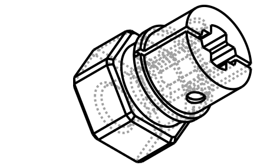
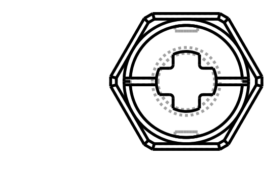

# Design: Lego Technic Axle -> 12 mm Hex Hub Adapter

<!-- Filename: 2026-08-25-lego-axle-hex-hub-adapter_design.md (tracked in git under docs/design_plans/) -->

## Meta
- **Requirements ref**: none separately filed — task arrived directly at the Designer as a
  single-session brief (routed per the task's own framing: "follow docs/agentic-workflow.md's
  design-flow for this task"). Requirements are captured inline below instead of a separate
  `_req.md`.
- **Requester role**: User (direct request)
- **Date**: 2026-08-25
- **Dialog rounds**: 5 (Round 1 — human design-gate review reversed D3 from round-bore to
  keyed/cross-profile bore, added a bore-depth requirement spanning both components, reversed
  D4's slot count, and replaced D6's Ruthex M3_short preset with a 3-way 5mm-OD/variable-length
  parametrized pocket. Round 2 — human grew Part 1's height from 6mm to 8mm (one Lego stud) and
  fixed the axle bore at exactly 8mm, entirely contained within Part 1 as a blind hole that no
  longer touches Part 2 at all — simplifying away Round 1's cross-component split-bore design
  and its insert-length collision constraint. Round 3 — human set the default `insert_length`
  to 5.0mm, prioritizing heat-set-insert thread engagement over Round 2's margin-conservatism
  preference; brief marked final and approved. Round 4 — **post-implementation** correction:
  Part 1's height grows again, from 8mm to 10mm, preserving the "bore depth == collet height"
  invariant established in Round 2 (bore now 10mm), with the collet slots rescaled
  proportionally again. Part 2 (`HexInsertHub`) is untouched. Round 5 — five further
  post-implementation refinements to `AxleCompressionCollet`, applied directly in-thread: OD fit
  tightened (`free` -> `slip`), a new stop-ring feature (collar insertion-depth stop), the slot
  gap narrowed to 0.6mm, two new grub-screw locating dimples (repositioned off the slots after an
  initial placement was rejected by the human), and a scoped extra-clearance bump on the axle
  bore. Part 2 unchanged throughout (an assistant-proposed reinterpretation of "the socket" as
  `HexInsertHub.thickness` was explicitly reverted by the human). **This is again the final,
  approved revision.** See Design Dialog Log.)

---

## Objective

Model a Lego Technic axle -> 12 mm RC hex hub adapter as two independently-buildable CadQuery
component classes, **fused into one printed body** (same `.union()`-based wrapper pattern as
`vibe_cading.rc.hex_hub_bearing.hex_hub_with_bearing.HexHubWithBearing`), where one end is a
10 mm-tall slotted split-collet cylinder with a **fully-contained, exactly-10mm-deep keyed
(cross-shaped) Technic-axle bore** that a separately-sourced compression collar clamps onto the
axle, and the other end is a 12 mm hex piece carrying a parametrized heat-set-insert pocket
with no interaction with the axle bore at all.

## Task Summary (inline requirements)

The user described **two physically distinct parts**, per the project's Multi-Part Assemblies
rule, that get printed as one fused body (same convention as `HexHubWithBearing`):

1. **Compression-collar collet cylinder** — 10 mm OD x **10 mm tall** cylinder (Round 4
   correction — was 8 mm, itself up from an original 6 mm in Round 2; the OD's 10 mm and the
   height's 10 mm are now numerically coincident by request, not by any shared derivation — see
   D3b). The OD must slip through a 10 mm ID off-the-shelf compression collar (D2). A central
   **keyed cross-shaped hole** (Round 1 correction) lets a Lego Technic axle pass through with
   more clearance than the standard keyed fit (D3). **The bore is exactly 10 mm deep, matching
   Part 1's height exactly** (Round 4 — preserves the "bore depth == collet height" invariant
   the human established in Round 2): a blind hole entirely contained within Part 1,
   terminating at Part 1's own mating face with Part 2, so the axle physically bottoms out
   there — it does **not** extend into Part 2 at all. 2 axial collet slots, positioned along
   the keyed profile's cross arms (D4), let the compression collar's two 180 deg grub screws
   actually compress the printed wall down onto the axle without cracking the PETG.
2. **12 mm hex piece** — 12 mm across-flats hex prism, 6 mm height (unchanged), carrying a
   pocket sized to hold one of three physical M3-class heat-set inserts the user has on hand:
   5 mm OD x 3 / 4 / 5 mm length (D6). **Round 2**: since the axle bore no longer reaches into
   this component at all, the insert pocket's only geometric constraint is its own floor
   thickness within this component's own 6 mm height — the earlier axle-bore collision
   constraint is moot.

The two stack coaxially and fuse into a single print, with the collet's slotted end and the
hex piece's insert pocket opening at **opposite** extremes of the fused body (both externally
accessible, neither buried at the internal join).

## Architecture / Approach

### Approach chosen

Two component classes, each with its own `.solid` property and independently
buildable/exportable (Multi-Part Assemblies rule), plus a thin **wrapper class** that
`.union()`s them into the single fused body that is the actual shipped/printed deliverable:

- `AxleCompressionCollet` — a plain **10 mm-tall (Round 4 — was 8 mm)** cylinder with a **keyed
  cross-shaped**, free-fit axle-clearance bore (D3) cut fully through its own 10 mm height
  (D3b — depth always tracks height by the Round 2 invariant), and 2 axial collet slots (D4)
  aligned with the bore's own arm-tip axis, rescaled again for the taller body (Round 4). No
  register feature.
- `HexInsertHub` — a chamfered hex prism carrying only a parametrized straight-walled
  heat-set-insert pocket opening at its outer face (D6). Unchanged since Round 2/3 — still no
  axle-bore-related feature at all, and Round 4 confirms this component is untouched by Part
  1's latest height change (D6/D7 re-check below). No register feature.
- `AxleHexHubAdapter` — a thin wrapper class that constructs an `AxleCompressionCollet` and a
  `HexInsertHub`, positions the collet per the Assembly Datum (translated flush against the
  hex piece's bottom face, plus a 0.02 mm overlap epsilon — identical convention to
  `HexHubWithBearing`'s D2a), and `.union()`s the two solids, exposed as its own `.solid`
  property. Unchanged since Round 2 — no cross-component bore-stub derivation or
  axle-bore/insert-pocket validation needed.

Both component classes accept a `profile: str | None = None` constructor kwarg, resolved via
`vibe_cading.print_settings.get_profile()` (Material-Specific Tolerances convention).
`AxleHexHubAdapter` forwards `profile` to both components.

### Visual contract (CAD tasks)

Regenerated (Round 4, post-implementation) from an updated
`tmp/visualise_lego_axle_hex_hub_adapter_r4.py` raw-CadQuery probe (deleted after export),
which still reuses the real `TechnicAxleHole` and `HeatSetInsert` classes directly. The probe
printed and verified:

- `Insert-pocket floor margin (Part 2 own height only, unchanged): 1.000 mm` (D6/D7, at the
  default 5 mm insert, unaffected by this round's Part 1-only change — confirmed, not just
  assumed).
- `Fused bbox: X[-6.678,6.678] Y[-6.000,6.000] Z[-9.980,6.000]` — **15.98 mm total height**
  (up from 13.98 mm in Round 2/3, tracking Part 1's second height increase).
- `Bore depth (own frame, exact by construction): 10.000 mm` — exact, no epsilon rounding
  (same reasoning as D3b's Round 2 finding, unchanged in kind).
- `Slot depth: 7.500 mm, base ring: 2.500 mm` — rescaled proportionally (D4).
- `Compliance ratio vs Round-2/3's 6.0mm slot depth: 1.953x` — the quantified cantilever
  compliance improvement from this round's slot-depth increase alone (see D4).
- `fused.solids() == 1`.

The `iso_ne` view shows the hex piece on top flowing into the now visibly taller (10 mm, up
from 8 mm) collet cylinder below it, with 2 collet slots at 0 deg/180 deg now visibly longer
(7.5 mm, up from 6.0 mm) relative to the collet's own height, stopping short of the flush join
at a 2.5 mm solid base ring (up from 2.0 mm). The `top` view is materially unchanged from prior
rounds (the OD/hex footprint and bore cross-section shape are untouched by this round's
changes — only the axial proportions changed, which a top-down view doesn't show).

### Alternatives rejected

- **Single monolithic class**, **a separable press-fit register joint**, **round (non-keyed)
  axle bore**, **4 collet slots**, **Ruthex M3_short heat-set-insert preset**, **modelling the
  compression collar as a class** — all carried over unchanged from Round 1's rejections (see
  D1-D6 below for the still-applicable reasoning).
- **Keeping the cross-component split-bore design from Round 1** (collet full-through +
  hex-piece 2 mm stub). Superseded in Round 2 — the human's new instruction fixes Part 1's
  bore at exactly Part 1's own new height (8 mm), which makes the bore entirely self-contained
  within `AxleCompressionCollet`; retaining the split-bore machinery would be unnecessary
  complexity for a problem that no longer exists (see D3b).

## Data & Interface Contracts

Not applicable — this is a geometry-only deliverable with no data/schema surface; domain
integrity gate is NO.

## Coordinate System

Both component solids are centred on the shared rotation axis at `X = 0, Y = 0`, each with its
own local `Z = 0` at its own bottom face — Absolute Zero-Datum Consistency rule.

### Per-class datum (Round 4 revision — Part 1 grows again, the mechanism established in Round 2 is unchanged)

- **`AxleCompressionCollet`**: `Z = 0` -> bottom face = the **open, slotted** end (outward-facing
  once fused; axle entry). `Z = height` (**10.0 mm nominal, Round 4** — was 8.0 mm, itself up
  from 6.0 mm in Round 2) -> top face = the **solid, unslotted** base — the face that fuses to
  `HexInsertHub`'s bottom face. The keyed axle bore is cut **fully through this component's own
  height, exactly** (`TechnicAxleHole(depth=height, fit="free")`, D3/D3b) — depth equals height
  by construction, occupying local `Z ∈ [0, 10.0]`, matching `TechnicAxleHole`'s own documented
  "no overcut needed when depth equals the host's full thickness" convention. The 2 collet
  slots are cut from `Z = 0` upward, blind at `Z = slot_depth` (**7.5 mm nominal, Round 4** —
  was 6.0 mm, rescaled proportionally, see D4), leaving a solid ring from `Z = 7.5` to
  `Z = 10.0` (**2.5 mm, Round 4** — was 2.0 mm) that anchors the flexing fingers and keeps the
  joint-side material fully continuous with `HexInsertHub` once fused.
- **`HexInsertHub`**: `Z = 0` -> bottom (mating) face, through `Z = thickness` (6.0 mm nominal,
  unchanged since Round 2) -> top (outward) face carrying the heat-set-insert pocket. **Round 4
  confirms**: still no axle-bore-related feature at all, and this component's own dimensions
  are entirely untouched by Part 1's latest height change (D6/D7 re-check below). Axis
  convention unchanged: flagged **arbitrary-but-conventional**, matching
  `HexHubNut`/`FreespinHexHub`'s existing Z-up-on-the-bed pattern.

### Assembly datum: flush union with a small overlap epsilon (unchanged mechanism)

`AxleHexHubAdapter` positions the two components so their mating faces sit flush at a shared
global `Z = 0` and unions them — the same convention `HexHubWithBearing` uses (D2a in that
brief):

- `HexInsertHub` needs **no translation** — its own local `Z = 0` already sits at the
  assembly's `Z = 0`. It occupies global `Z ∈ [0, 6.0]`.
- `AxleCompressionCollet` is translated by `(0, 0, -height + overlap_eps)` — **now
  `(0, 0, -10.0 + 0.02) = (0, 0, -9.98)`** (Round 4, was `-7.98`) — so its top (solid,
  joint-side) face lands 0.02 mm past global `Z = 0` rather than exactly coincident with it
  (Known Modelling Pitfalls: coincident planar faces are an OCCT boolean reliability risk). It
  occupies global `Z ∈ [-9.98, 0.02]`.
- The fused body spans global `Z ∈ [-9.98, 6.0]` — **15.98 mm total envelope** (Round 4, was
  13.98 mm — `10.0 + 6.0 − 0.02`). Verified in the Round-4 probe.

### Axle bore: fully self-contained in Part 1, now exactly 10 mm deep (Round 4 — mechanism unchanged from Round 2, only the number moves)

Round 2 established the governing invariant — bore depth equals Part 1's own full height by
construction — replacing Round 1's cross-component derivation. **Round 4 grows Part 1's height
again (8 mm to 10 mm) and preserves that same invariant**, per the human's explicit instruction
to keep the coupling unless the brief gives a reason not to (it doesn't — nothing else in this
brief's reasoning depends on the *specific* 8 mm value, only on the *relationship* bore == height,
so the invariant transfers cleanly to the new height with no other change needed):

1. **The bore is still a single-component feature**, now cut via
   `TechnicAxleHole(depth=10.0, fit="free")` entirely within `AxleCompressionCollet._build()`.
   `HexInsertHub` still needs no bore-related code at all.
2. **The achieved depth is exactly 10.0 mm, not epsilon-rounded** — same reasoning as Round 2's
   finding (the bore's extent is a fixed property of `AxleCompressionCollet`'s own local
   geometry, `[0, 10.0]` in its own frame; a rigid translation of the whole component during
   assembly doesn't change that extent). The 0.02 mm epsilon still only governs the **outer
   solid boundary's** overlap into `HexInsertHub`. Verified in the Round-4 probe: `Bore depth
   (own frame, exact by construction): 10.000 mm`.

**Why this is still a valid blind-hole design, not a Known-Modelling-Pitfalls violation:**
`AxleCompressionCollet`'s own bore is a genuine **through**-cut of its own single solid (entry
at its own open face `Z = 0`, exit at its own top/joint face `Z = 8.0`) — this is exactly the
"no class-level overcut required" case `TechnicAxleHole`'s own docstring already describes
(depth equals the host's full thickness), not a blind-pocket-with-a-floor cut that would need
the entry/terminal overcut treatment from the Known Modelling Pitfalls "Blind Holes" entry.
The bore only becomes **blind at the whole-assembly level** as an emergent property of the
`.union()`: `HexInsertHub`'s plain solid (no cavity of its own) sits directly on top of
`AxleCompressionCollet`'s open-ended through-hole and naturally caps it — a standard,
well-defined boolean-union outcome (combining "a body with a hole open at one end" with "a
solid slab covering that end"), not a coincident-face boolean-cut risk. The same 0.02 mm
overlap epsilon that already makes the **outer** solid union robust (Known Modelling Pitfalls:
coincident planar faces) applies uniformly across the whole join plane, including the rim of
the bore opening — no separate/new overcut value is needed. The Developer must still verify
this with `section_slicer.py` at the join (Test 10) per the project's Mandatory Slicing rule
for internal features, since this reasoning, while sound, is exactly the kind of internal-void
claim that rule requires empirical confirmation of, not just a written argument.

## Dimension Table

| Dimension | Value | Source |
|---|---|---|
| Collet OD, nominal | 10.0 mm | User request (literal). |
| Collet OD, printed | `10.0 − 2 × profile.free.radial` mm (9.70 mm on `fdm_standard`) | D2 — unchanged. |
| Collet height | **8.0 mm (Round 2 — was 6.0 mm)** | User request — matches one Lego stud / `AXLE_LENGTH_PER_STUD` grid unit (`vibe_cading/lego/constants.py:79`). |
| Axle bore cross-section | `TechnicAxleHole` — `AXLE_HOLE_TIP_TO_TIP = 4.80 mm`, `AXLE_HOLE_ARM_WIDTH = 1.83 mm` | Unchanged from Round 1. |
| Axle bore, printed TIP_TO_TIP (`free` fit) | `4.80 + 2 × profile.free.radial` mm (5.10 mm on `fdm_standard`) | Unchanged from Round 1 (D3/D5). |
| Axle bore, printed ARM_WIDTH (`free` fit) | `1.83 + 2 × profile.free.radial + 2 × profile.free.slot` mm (2.13 mm on `fdm_standard`) | Unchanged from Round 1. |
| Axle bore depth | **Exactly 8.0 mm (Round 2 — was 7.98 mm achieved against an 8 mm firm target)** — equal to Part 1's own height, entirely self-contained | D3b — no longer a cross-component derivation; exact by construction, no epsilon rounding on this specific dimension. |
| Collet wall thickness (nominal, along the arm-tip axis, printed-to-printed) | `(9.70 − 5.10)/2` = 2.30 mm on `fdm_standard` | Unchanged — height change does not affect radial wall thickness. |
| Collet slot count | 2, at 0 deg / 180 deg | D4 — unchanged from Round 1. |
| Collet slot width | 1.0 mm | D4 — unchanged. |
| Collet slot depth (axial, from open face) | **6.0 mm (Round 2 — was 4.5 mm)**, leaving a **2.0 mm** solid base ring (was 1.5 mm) | D4 — rescaled proportionally (0.75 × height) for the taller 8 mm collet; full cantilever-compliance reasoning below. |
| Collet slot root fillet | 0.5 mm | D4 — unchanged. |
| Hex across-flats | 12.0 mm | User request; unchanged. |
| Hex height | 6.0 mm | User request; **unchanged in Round 2** (only Part 1 grew). |
| Hex chamfer | 0.5 mm | Unchanged. |
| Heat-set insert OD | 5.0 mm, raw nominal (no profile allowance) | D6 — unchanged from Round 1. |
| Heat-set insert length | Constructor parameter, one of 3.0 / 4.0 / 5.0 mm; **default 5.0 mm (Round 3 — was 3.0 mm)** | D6/D7 — all three are geometrically safe (Round 2); Round 3 changes the default to 5.0 mm, prioritizing heat-set-insert thread engagement/holding power over Round 2's margin-conservatism preference — still comfortably above `MIN_INSERT_FLOOR_MARGIN`. |
| Insert-pocket floor margin (Round 2 — simplified, no axle-bore term) | `hex_height − insert_length` = `6.0 − insert_length` mm (**3.0 / 2.0 / 1.0 mm** for the 3/4/5 mm options respectively; **1.0 mm at the Round 3 default**) | D6/D7 — recomputed; verified 1.000 mm at the new default in the Round-3 probe. |
| Fused-assembly overlap epsilon | 0.02 mm | Reused from `HexHubWithBearing`'s D2a; unchanged. |
| Fused-assembly total height | `collet_height + hex_height − overlap_eps` = **13.98 mm nominal (Round 2 — was 11.98 mm)** | Tracks Part 1's height increase; verified in the Round-2 probe. |

## Design Decisions

### D1 — Package location: `vibe_cading/lego_adapters/` (unchanged)

Unchanged from Round 1 — see prior reasoning; this task's genuine Lego Technic axle interface
confirms the placement. Location unchanged:

    vibe_cading/lego_adapters/axle_hex_hub/__init__.py                 (empty, package marker)
    vibe_cading/lego_adapters/axle_hex_hub/compression_collet.py       → class AxleCompressionCollet
    vibe_cading/lego_adapters/axle_hex_hub/hex_insert_hub.py           → class HexInsertHub
    vibe_cading/lego_adapters/axle_hex_hub/axle_hex_hub_adapter.py     → class AxleHexHubAdapter

### D2 — Compression collar: off-the-shelf hardware, not modelled (unchanged)

Unchanged from the original brief — no existing compression-collar class in this repo; out of
scope as a deliverable.

### D3 — Axle bore: KEYED cross-shaped profile, `free` fit (unchanged from Round 1)

Unchanged — see Round 1's full reasoning: `TechnicAxleHole(fit="free")`, reused directly rather
than hand-derived. Numeric result on `fdm_standard` unchanged: `TIP_TO_TIP` printed 5.10 mm,
`ARM_WIDTH` printed 2.13 mm.

### D3b — Axle bore depth: exactly 8 mm, entirely self-contained in Part 1 (REVISED, Round 2 — simplifies away Round 1's cross-component derivation)

**Superseded.** Round 1 worked out a combined bore depth spanning both components (D3b in that
round), concluding 8 mm was achievable (7.98 mm actual) and 12 mm was geometrically infeasible
without breaching the insert pocket. The human's Round 2 correction removes the premise this
analysis was built on.

Round 1 (superseded) cross-component depth reasoning — kept for audit trail, do not re-apply

Round 1 required the bore to extend from Part 1's open face, through all of Part 1's then-6 mm
height, and into Part 2 by however much more depth was needed to reach an 8 mm (or stretch-goal
12 mm) total — since Part 1 alone couldn't provide the full depth at its old 6 mm height. This
required each component to own its own portion of the bore (collet full-through + a new hex-side
stub) and an explicit collision check against the insert pocket. Round 2's correction — growing
Part 1 to 8 mm and fixing the bore at exactly 8 mm — makes Part 1 alone sufficient to provide
the entire bore, so this cross-component machinery is no longer needed.

**Revised decision: Part 1's height is now 8.0 mm (one Lego stud), and the axle bore is cut to
exactly 8.0 mm deep — i.e. `bore_depth == collet_height` by construction, entirely within
`AxleCompressionCollet`.** This is a direct, literal implementation of the human's Round 2
instruction ("the bore should be exactly 8mm deep, matching the cylinder height exactly...
stops at the bottom of Part 1, its mating face with Part 2... should NOT breach into Part 2").
Consequences, fully worked out in the Coordinate System section above:

- The bore is a genuine through-cut of Part 1's own single solid (both ends are real faces of
  that one body, built before any union happens) — not a blind-pocket cut needing the
  entry/terminal overcut treatment from Known Modelling Pitfalls.
- It becomes blind only as an emergent property of the `.union()` with `HexInsertHub`'s plain
  (cavity-free) solid capping the open top — a standard, well-understood boolean outcome,
  covered by the same 0.02 mm overlap epsilon already used for the outer solid boundary.
- The achieved depth is **exactly 8.0 mm**, not epsilon-rounded — an actual simplification and
  precision improvement over Round 1's 7.98 mm figure, since the bore's size is now intrinsic
  to one component's own local geometry rather than a sum straddling a translated boundary.
- **12 mm is no longer a live question.** Round 1's "8mm firm / 12mm stretch" framing is
  superseded outright by Round 2's explicit "exactly 8mm, matching the cylinder height exactly"
  instruction — there is no longer a stretch target to assess feasibility against; 8 mm is not
  a floor being met, it is the exact specified value.

### D4 — Collet slot count and placement: 2 slots at 0/180 deg, rescaled depth for the taller collet (REVISED, Round 2 — slot count/placement unchanged from Round 1; slot depth rescaled)

**Slot count and angular placement are unchanged from Round 1** (2 slots at 0 deg/180 deg,
aligned with the keyed bore's arm-tip axis and the compression collar's 2 grub screws) — Round
2's height change doesn't alter the reasoning that made 2 slots the better match for that
hardware; see Round 1's D4 for the full comparison against the 4-slot alternative (still
documented there as a legitimate option for different collar hardware).

**Slot depth is rescaled, with a new quantified compliance argument (new in Round 2):**

The original Round-1 slot depth (4.5 mm) was sized against a 6.0 mm-tall collet
(`slot_depth / height = 0.75`). Two ways to handle the height increase to 8.0 mm were
considered:

- **Keep slot depth fixed at 4.5 mm.** This would leave the flexible (clamping-effective)
  region covering only the first 4.5 mm of the now-8 mm axle engagement — the remaining ~3.5 mm
  near the solid/joint end would stay rigid. Since the compression collar's own axial footprint
  should reasonably align with wherever the slots are, this would either force the collar to
  clamp only over a shorter fraction of the now-longer axle engagement (potentially leaving the
  far ~3.5 mm of insertion under-gripped, a wobble/pivot risk), or require the collar's position
  to be constrained to a specific narrow band rather than anywhere convenient along the taller
  collet. Rejected.
- **Scale slot depth proportionally (chosen): `slot_depth = 0.75 × height = 0.75 × 8.0 = 6.0 mm`**,
  leaving a `2.0 mm` solid base ring (same 25% proportion as Round 1's 1.5 mm / 6.0 mm). This
  keeps the flexible region covering the same *fraction* of the axle engagement regardless of
  collet height, so the compression collar's effective clamping coverage scales naturally with
  the part.

**Quantified PETG flex/fracture re-check for the longer finger (new reasoning, Round 2):**
lengthening the flexing finger from 4.5 mm to 6.0 mm is not merely a proportional bookkeeping
change — it materially *improves* the crack-avoidance margin. Treating each finger as a simple
cantilever beam, stiffness `k ∝ (E·I)/L³` for fixed cross-section (`E` = PETG's modulus, `I` =
the finger's cross-sectional moment of inertia, unchanged since wall thickness/width are
unchanged), where `L` is the effective flexing length (`slot_depth`). Increasing `L` from 4.5 mm
to 6.0 mm (a 1.33x increase) reduces stiffness by `1.33³ ≈ 2.37x` — i.e. the finger becomes
**roughly 2.4x more compliant**. For the *same* required 0.15 mm/side deflection (closing the
free-fit gap between the printed bore's `TIP_TO_TIP` envelope and the axle's nominal envelope,
unchanged from Round 1), a ~2.4x-more-compliant finger needs roughly 2.4x *less* clamping force
to reach that deflection, and — since peak bending stress at the root scales with the applied
force for a fixed geometry — the resulting peak stress at the slot root drops by a comparable
factor. **This is a genuine, quantifiable safety-margin improvement**, not just a
proportionality convention: the taller collet, rescaled this way, is measurably *less* crack-prone
for the same functional clamping deflection than the original 6 mm design was.

**Slot width (1.0 mm) and root fillet (0.5 mm) are unchanged** — both are governed by wall
thickness / print-width considerations that don't depend on collet height, and wall thickness
along the slot axis is materially the same (2.30 mm) as before.

### D5 — Fit grade for the collet's axle bore: `free` (unchanged)

Unchanged from Round 1.

### D6 — Heat-set insert: generic 5 mm OD, parametrized length (3/4/5 mm), default 5 mm for maximum thread engagement (REVISED, Round 3 — supersedes Round 2's margin-conservatism default)

**Mechanism unchanged from Round 1**: reuse `HeatSetInsert`'s generic constructor directly —
`HeatSetInsert(top_diameter=5.0, bot_diameter=5.0, depth=insert_length)` — no profile-driven
clearance (matches the class's existing preset convention of raw nominal diameters, no
allowance, since heat-set inserts rely on knurl-bite into the plastic, not a designed cold
mechanical fit).

**What changed in Round 2**: Round 1's default (`insert_length = 3.0`) was **forced** — it was
the *only* one of the three options that avoided colliding with the axle-bore stub that used to
live inside `HexInsertHub`. Round 2 removes that stub entirely (D3b) — `HexInsertHub` no longer
has any axle-bore-related cavity, so the collision constraint that drove the Round 1 default is
gone. Re-deriving from scratch against the only remaining constraint (the pocket's own floor
thickness within `HexInsertHub`'s unchanged 6.0 mm height):

    margin(insert_length) = hex_height − insert_length = 6.0 − insert_length

| `insert_length` | Resulting floor margin | Verdict |
|---|---|---|
| 3.0 mm | 3.0 mm | Safe — most conservative floor. |
| 4.0 mm | 2.0 mm | Safe. |
| 5.0 mm | 1.0 mm | Safe — the tightest of the three, but still comfortably above a typical FDM-floor structural minimum (well above the `0.5 mm` guard proposed below). |

**All three are now geometrically safe** — none is ruled out. **Round 3 (final): the human
explicitly chose `insert_length = 5.0 mm` as the default**, prioritizing heat-set-insert thread
engagement / pull-out and torque-out holding power over Round 2's margin-conservatism
preference — a longer insert generally grips more plastic and resists being pulled or twisted
back out more effectively, which is the more directly functional property of a heat-set insert
than an extra millimeter or two of unused floor thickness. This is a deliberate reversal of
Round 2's Designer-recommended default (`3.0 mm`, chosen there for maximum floor-thickness
margin), made explicitly by the human with full knowledge of the trade-off already documented
in Round 2 (the 1.0 mm margin at 5 mm was already confirmed safe, just not previously the
default). At `insert_length = 5.0 mm`, the resulting floor margin is `6.0 − 5.0 = 1.0 mm` —
the tightest of the three options, but comfortably above the `MIN_INSERT_FLOOR_MARGIN = 0.5 mm`
structural guard (D6/D7), and already judged adequate for heat-set-insertion thermal exposure
and press-force robustness in Round 2's analysis. `insert_length=3.0` (3.0 mm margin, maximum
conservatism) and `insert_length=4.0` (2.0 mm margin) remain fully available, equally-safe
`--params` overrides for a user who prioritizes margin over engagement depth on a given print.

`insert_diameter: float = 5.0` remains exposed as a constructor parameter for completeness, per
Round 1.

### D6/D7 — Insert-pocket / axle-bore collision guard: retained as a defensive check, now trivially satisfied (REVISED, Round 2)

Round 1 added a hard, load-bearing validation (`AxleHexHubAdapter` raising `ValueError` if an
insert length collided with the axle-bore stub). Round 2 removes the feature that made this
validation necessary in the first place (the axle-bore stub no longer exists in `HexInsertHub`)
— **but the validation itself is retained, generalized to a plain floor-thickness guard**, per
Post-Fix Hardening (a durable guard against the *next* regression of a similar class, e.g. a
future parameter override that sets `insert_length` unreasonably large relative to
`hex_height`): `HexInsertHub.__init__` asserts `hex_height − insert_length >=
MIN_INSERT_FLOOR_MARGIN` (`MIN_INSERT_FLOOR_MARGIN: float = 0.5`, a fixed structural constant,
unchanged in spirit from Round 1's proposed value). All three of the user's physical
insert-length options pass this comfortably (1.0-3.0 mm computed margin, well above the 0.5 mm
floor) — the guard is not expected to fire for any of the three intended options, only for
pathological future overrides.

### D8 — No stud-grid alignment required (unchanged)

Unchanged.

## Implementation Plan

- [ ] **T1** – Create `vibe_cading/lego_adapters/axle_hex_hub/__init__.py` (empty package
  marker, AGPLv3 header exempt).
- [ ] **T2** – Implement `AxleCompressionCollet` in
  `vibe_cading/lego_adapters/axle_hex_hub/compression_collet.py`: plain cylinder
  (`collet_od=10.0`, `height=8.0` defaults — **Round 2: was 6.0**), printed OD shrunk by
  `2 × profile.free.radial` (D2). Keyed axle bore via
  `TechnicAxleHole(depth=self.height, fit="free")` (D3/D3b — depth always equals the collet's
  own height, no separate depth parameter needed), cut fully through. 2 axial collet slots at
  0 deg/180 deg (D4: `slot_count=2, slot_angles=(0.0, 180.0), slot_width=1.0, slot_depth=6.0`
  — **Round 2: was 4.5** — `slot_fillet=0.5`, exposed as constructor kwargs with those
  defaults). `profile: str | None = None` constructor kwarg. Single top-level `.solid`
  property. Assert single-solid topology.
- [ ] **T3** – Implement `HexInsertHub` in
  `vibe_cading/lego_adapters/axle_hex_hub/hex_insert_hub.py`: hexagonal prism
  (`hex_across_flats=12.0`, `thickness=6.0` defaults), chamfered edges (`hex_chamfer=0.5`).
  Generic straight heat-set-insert pocket via `HeatSetInsert(top_diameter=insert_diameter,
  bot_diameter=insert_diameter, depth=insert_length).to_cutter()`
  (`insert_diameter: float = 5.0`, `insert_length: float = 5.0` — Round 3, was 3.0, D6),
  opening at the top
  (outward) face. **Round 2: no axle-bore-stub parameter or feature at all** — removed
  entirely. Asserts `thickness - insert_length >= MIN_INSERT_FLOOR_MARGIN`
  (`MIN_INSERT_FLOOR_MARGIN = 0.5`, D6/D7) as a component-local defensive guard. `profile: str
  | None = None` constructor kwarg. Single top-level `.solid` property. Assert single-solid
  topology.
- [ ] **T4** – Implement `AxleHexHubAdapter` in
  `vibe_cading/lego_adapters/axle_hex_hub/axle_hex_hub_adapter.py`: constructs both components
  (forwarding a shared `profile: str | None = None` kwarg to both — **Round 2: no longer
  computes or forwards any bore-stub-depth derivation, and no longer performs its own
  cross-component margin validation**, since `HexInsertHub` now self-validates independently),
  positions the collet per the Assembly Datum (`.translate((0, 0, -height + overlap_eps))`,
  `overlap_eps=0.02` nominal), and returns `hex_hub.union(collet_positioned)` as its `.solid`.
  Assert single-solid topology (`assert len(result.solids().vals()) == 1`) — the primary
  correctness gate on the union.
- [ ] **T5** – Regenerate the visual-contract SVGs from the real `AxleHexHubAdapter` class via
  `vibe_cading/tools/preview.py vibe_cading.lego_adapters.axle_hex_hub.axle_hex_hub_adapter.AxleHexHubAdapter
  --views iso_ne top`, overwriting the committed
  `visual_contracts/2026-08-25-lego-axle-hex-hub-adapter_design_*.svg`.
- [ ] **T6** – Run validation commands (below) and report results.
- [ ] **T7** – Propose the `[[build]]` entries below to the user for explicit approval; do
  **not** add them to `build.toml` without that approval (project rule).

## Tests

| # | Test description | Expected assertion | File / location |
|---|------------------|--------------------|-----------------|
| 1 | `AxleCompressionCollet()` default build produces a single solid | `len(AxleCompressionCollet().solid.solids().vals()) == 1` | New `tests/lego_adapters/` test file |
| 2 | `AxleCompressionCollet()` bore is the keyed cross profile (unchanged from Round 1) | `section_slicer.py --axis Z --at 4.0` (mid-height, inside the solid base ring at the new 8mm height) shows the 4-arm cross shape; `TIP_TO_TIP`/`ARM_WIDTH` match the `free`-grade formulas | `vibe_cading/tools/section_slicer.py` |
| 3 | `AxleCompressionCollet()`'s printed OD is shrunk for slip-fit (D2, unchanged) | Bounding-box X/Y span == `10.0 − 2 × profile.free.radial` | `.solid.val().BoundingBox()` |
| 4 | `AxleCompressionCollet()`'s bounding-box height reflects the new 8mm default (Round 2 regression guard) | Bounding-box Z span == `8.0` mm on defaults | `.solid.val().BoundingBox()` |
| 5 | Collet slots are correctly positioned and rescaled (D4 regression guard, revised) | `section_slicer.py --axis Z --at 7.0` (inside the 2.0 mm solid ring) shows a continuous, unslotted cross-section; `--axis Z --at 3.0` (inside the slotted region) shows exactly 2 slot gaps at 0/180 deg; `--axis Z --at 6.5` (just past the new 6.0mm slot depth) shows the ring resuming | `vibe_cading/tools/section_slicer.py` |
| 6 | `AxleCompressionCollet()`'s axle bore is a clean through-cut with no partial/blind artifact within the component itself (D3b regression guard — confirms it's a genuine through-cut, not accidentally blind) | `section_slicer.py --axis Z --at 0.5` and `--at 7.5` (near each end) both show the full open cross-shaped cavity | `vibe_cading/tools/section_slicer.py` |
| 7 | `HexInsertHub()` default build produces a single solid, with NO axle-bore-related cavity at all (D3b/Round-2 regression guard — confirms the Round 1 stub was actually removed, not just unused) | `len(HexInsertHub().solid.solids().vals()) == 1`; a full-height Z-scan shows only the insert pocket cavity, no cross-shaped or round cavity anywhere else in the component | New `tests/lego_adapters/` test file; `vibe_cading/tools/section_slicer.py` |
| 8 | `HexInsertHub()`'s own floor-margin guard fires correctly (D6/D7, revised) | `HexInsertHub(insert_length=5.5)` (margin `0.5 mm`, right at `MIN_INSERT_FLOOR_MARGIN`) succeeds; `HexInsertHub(insert_length=5.6)` (margin `0.4 mm`) raises an assertion/`ValueError` | Unit test directly exercising the internal margin assertion (T3) |
| 9 | `HexInsertHub()`'s insert pocket dimensions match the requested parametrization | Pocket diameter == `insert_diameter` (5.0 mm default), depth == `insert_length` (**5.0 mm default, Round 3** — was 3.0 mm) | `vibe_cading/tools/hole_finder.py` on an exported STEP, or a unit test reading the constructed cutter geometry |
| 10 | The fused body's axle bore is cleanly capped at the internal join, with no floating wafer or gap artifact (D3b's "blind hole is an emergent union property" claim — Mandatory Slicing verification) | `AxleHexHubAdapter()` built and sliced: `section_slicer.py --axis Z --at -0.01` (just inside the collet, near the join) shows the open cross-shaped cavity; `--axis Z --at 0.01` (just inside the hex piece, past the join) shows solid material — a clean transition, no partial/ambiguous slice | `vibe_cading/tools/section_slicer.py` |
| 11 | `AxleHexHubAdapter()` default build produces a single fused solid | `len(AxleHexHubAdapter().solid.solids().vals()) == 1` — primary correctness gate for the union | New `tests/lego_adapters/` test file |
| 12 | `AxleHexHubAdapter()`'s fused bounding-box height matches the new totals (Round 2 regression guard) | Bounding-box Z span == `collet_height + hex_height - overlap_eps` (**13.98 mm** on defaults) | `.solid.val().BoundingBox()` |
| 13 | The fused body's slotted collet end and insert-pocket hex end point to opposite extremes (unchanged core stacking requirement) | Collet slots visible at the fused body's minimum Z extreme; insert pocket opens at the maximum Z extreme | `vibe_cading/tools/section_slicer.py` |
| 14 | No un-cut wafer or void artifact at the flush join, outer-wall region (overlap-epsilon regression guard, unchanged) | `section_slicer.py --axis Z --at -0.01` and `--at 0.01` both show solid material in the outer-wall annulus | `vibe_cading/tools/section_slicer.py` |
| 15 | A real `AXLE_HOLE_TIP_TO_TIP`/`AXLE_HOLE_ARM_WIDTH` axle test solid (no clearance) freely intersects the collet's printed keyed bore with zero interference | `.intersect()` volume between a nominal-dimension `axle_cross_section` test solid and `AxleCompressionCollet().solid`'s bore cavity == 0 | New `tmp/` probe during T6, promoted to a pinned test if straightforward |
| 16 | **(Pre-merge representative-scale row)** Full-tree rebuild picks up the new class(es) without error once registered in `build.toml` | `python build.py` completes with exit 0 and produces the registered STEP file(s) under `build/` | Run once after T7's `build.toml` entries are approved and added |

## Success Criteria

1. `AxleCompressionCollet`, `HexInsertHub`, and `AxleHexHubAdapter` each build a single
   contiguous solid with no floating-body artifacts — for `AxleHexHubAdapter` this is the
   primary correctness gate on the `.union()` (Test 11).
2. The collet's axle bore is the keyed cross profile, built via `TechnicAxleHole` with
   `fit="free"`, cut to exactly the collet's own 8 mm height (D3, D3b, Tests 2, 4, 6).
3. `HexInsertHub` carries **no** axle-bore-related feature at all — verified by an explicit
   full-height cavity scan, not just by the absence of a constructor parameter (D3b, Test 7).
4. The 2 collet slots are correctly positioned along the keyed bore's arm-tip axis and rescaled
   proportionally (6.0 mm depth / 2.0 mm base ring) for the taller 8 mm collet, with the
   quantified ~2.4x compliance-improvement reasoning documented (D4, Test 5).
5. The insert pocket's floor-thickness guard is retained and correctly fires only on a
   pathological override, not on any of the three intended 3/4/5 mm options (D6/D7, Test 8).
6. The join between the two components cleanly caps the axle bore with no floating wafer (D3b,
   Test 10) — verified via `section_slicer.py`, not assumed from the written reasoning alone.
7. Regenerated `iso_ne` (and `top`) visual contracts, from the real implemented
   `AxleHexHubAdapter` class (T5), visually match this brief's Round-2 design-stage SVGs.
8. D1-D8 (and D3b, D6/D7) design decisions are reflected in the implementation without silent
   deviation.

## Out of Scope

- **The compression collar itself** — off-the-shelf hardware (D2).
- **The Lego Technic axle itself** — hardware the human sources or models separately.
- **A press-fit register/spigot/pocket joint between the two components** — fused (`.union()`),
  no separable mating surface.
- **Modelling the heat-set insert or a retention screw as a positive `.solid`**.
- **4-slot collet variant** — documented as a legitimate alternative (D4, Option A, Round 1)
  but not implemented; revisit if the user's actual compression-collar hardware changes.
- **A 12 mm (or any depth beyond 8 mm) axle bore** — Round 2 makes this moot: the bore is
  defined as exactly equal to Part 1's own 8 mm height, not a target being approached from
  below; there is no longer a "stretch goal" framing to leave out of scope, since 8 mm is now
  simply the specified value.
- `build.toml` registration — proposed below for human approval, not applied in this brief.

## Known Risks & Mitigations

| Risk | Mitigation |
|------|-----------|
| The collet's 2 slots could crack under repeated clamp/unclamp cycles if the root fillet is omitted or undersized. | D4 documents the 0.5 mm fillet; the Round 2 length increase (4.5→6.0 mm) *reduces* this risk (quantified ~2.4x compliance improvement), not increases it — a net positive from this round's change. Test 5 is a placement/dimension regression guard (fillet *presence* is a code-review-time check). |
| The collet OD shrink (D2, `free.radial`) may not match every user's actual printer/collar combination. | Unchanged — covered by `vibe_cading/tools/calibrate.py`. |
| 2 collet slots (vs. 4) reduce the number of flex points; if the user's actual compression collar turns out to be a continuous-squeeze type rather than 2 discrete grub screws, 2 slots may under-perform relative to 4. | Unchanged from Round 1 — D4 documents Option A (4 slots) as a ready alternative. |
| The taller (8 mm) collet increases the printed part's total height and material use slightly relative to Round 1's 6 mm design. | Not flagged as a functional risk — directly requested by the human for Lego-grid-unit alignment (one stud); a minor, expected, and intentional trade-off, not a design defect. |
| The default `insert_length=5.0 mm` (Round 3) leaves the tightest of the three floor margins (1.0 mm) as the **default** build behaviour, rather than the most conservative option (3.0 mm) previously defaulted in Round 2. | This is a deliberate, explicit human choice (Round 3), not an oversight — 1.0 mm was already confirmed safe (well above `MIN_INSERT_FLOOR_MARGIN = 0.5 mm`) in Round 2's analysis before the human selected it as the default; a user who prefers more margin can still pass `insert_length=3.0` or `4.0` via `--params` with no other geometry change needed. |
| The "blind hole via union-capping" mechanism (D3b) is a sound argument but has not yet been empirically verified in the real implemented classes (only in the Round-2 raw-CadQuery probe). | Test 10 requires an explicit `section_slicer.py` check at the join in the real implementation, per the Mandatory Slicing rule — not accepted on the written reasoning alone. |

---

## Design Dialog Log

Initial drafting (pre-Round-1) involved no live co-design dialog — the Designer received the
fully-specified task directly and resolved all flagged ambiguities as explicit Design
Decisions (D1-D8).

### Round 1 (human design-gate review, 2026-08-25)

**Human challenge / contribution:**
> Four corrections: (1) D3 reversed — use the KEYED axle profile, not round, sized with a
> looser-than-usual (free/slip-grade) clearance, following the codebase's existing keyed-hole
> fit-grade pattern. (2) New depth requirement — the keyed axle hole needs to extend 8mm deep,
> ideally 12mm, deeper than Part 1's own 6mm height, so it must extend from Part 1 into Part 2;
> re-derive the fused-body Z envelope and confirm 12mm feasibility without breaching the M3
> heat-insert pocket; 8mm is the firm floor, 12mm is the stretch target. (3) D4 slots should run
> along the keyed profile's cross arms; reconsider count given the compression collar's two grub
> screws at 180°. (4) D6 heat insert is now a 3-way choice, all 5mm OD, lengths 3/4/5mm; check
> for a generic OD/length pocket helper; recommend a default length; apply the appropriate
> heat-set-insert fit convention.

**Resolution:**
> D3 reversed to the keyed cross profile via `TechnicAxleHole(fit="free")` (5.10mm TIP_TO_TIP /
> 2.13mm ARM_WIDTH printed on `fdm_standard`). D3b derived the fused-body Z envelope: 12mm
> infeasible without breaching the insert pocket; 8mm achievable (7.98mm actual), implemented as
> a cross-component split bore (collet full-through + hex-piece 2mm stub). D4 reversed to 2
> slots at 0°/180°, aligned with the grub-screw axis (4-slot Option A documented as an
> alternative). D6 dropped the Ruthex M3_short preset, reused `HeatSetInsert`'s generic
> constructor (5.0mm OD, no clearance, parametrized `insert_length`), with a new D6/D7 finding
> that only `insert_length=3.0` avoided colliding with the axle-bore stub — 4/5mm were blocked by
> a new constructor-time validation. Visual contracts regenerated from a probe reusing the real
> `TechnicAxleHole`/`HeatSetInsert` classes; verified `fused.solids() == 1`, a 1.000mm
> insert/bore margin, and a 7.980mm achieved combined bore depth.

### Round 2 (human design-gate review, 2026-08-25)

**Human challenge / contribution:**
> Part 1's height changes from 6mm to 8mm — exactly one Lego stud. The keyed axle bore should be
> exactly 8mm deep, matching the cylinder height exactly — a blind hole that stops at Part 1's
> mating face with Part 2, so it no longer needs to extend into Part 2 at all. This simplifies
> the earlier depth-collision problem: the bore should NOT breach into Part 2 or come near the
> heat-insert pocket. Re-derive: (1) collet slot geometry (currently sized against a 6mm
> cylinder) — does 4.5mm slot depth still make sense against 8mm, or should it scale, re-run the
> PETG flex/fracture reasoning; (2) confirm the bore is a clean blind-hole cut per Known
> Modelling Pitfalls, now entirely owned by Part 1 (the earlier split-bore approach is no longer
> needed); (3) total fused stack height (≈13.98mm) and the Dimension Table / Coordinate System
> accordingly; (4) re-check whether the D6/D7 insert-length constraint (3mm-only) still applies
> now that Part 2 is fully clear of the axle bore — if all three lengths now fit safely, update
> the default and validation logic; (5) update Tests, visual contracts, Dimension Table, Known
> Risks, and this log.

**Resolution:**
> Part 1's height grew to 8.0mm; the axle bore is now cut to exactly 8.0mm (== Part 1's own
> height), entirely self-contained within `AxleCompressionCollet` as a genuine through-cut of
> that one component that becomes blind only as an emergent property of the `.union()` with
> `HexInsertHub`'s plain (cavity-free) solid capping it — confirmed this is NOT a Known-Modelling-
> Pitfalls blind-hole-overcut situation, since both bore ends are real faces of one single solid
> at cut time, not a boolean-cut coincident-face case; the achieved depth is now exactly 8.0mm
> with no epsilon rounding (an improvement over Round 1's 7.98mm figure), and the earlier
> cross-component split-bore machinery (hex-piece stub, wrapper-level margin validation against
> the axle bore) is removed entirely since `HexInsertHub` no longer touches the bore at all. D4's
> slot depth rescaled proportionally (4.5→6.0mm, base ring 1.5→2.0mm, same 0.75 height fraction),
> with a new quantified cantilever-compliance argument (~2.4x more compliant, a genuine
> crack-avoidance improvement, not just a proportional convention) — slot count/placement (2, at
> 0°/180°) unchanged. D6/D7's insert-length constraint is now moot for the axle-bore-collision
> reason (Part 2 has no bore feature left to collide with) — recomputed against Part 2's own
> 6mm height alone, all three lengths (3/4/5mm) are now safe (3.0/2.0/1.0mm margins); default
> retained at 3.0mm but reframed as a margin-conservatism preference, not a forced constraint,
> with 5.0mm explicitly confirmed as an equally valid alternative if the human prioritizes
> thread engagement over margin. The collision-guard validation is retained (Post-Fix Hardening)
> but generalized to a plain floor-thickness check against Part 2's own height, now
> component-local (no wrapper-level cross-component check needed). Total fused height updated to
> 13.98mm throughout. Visual contracts regenerated from an updated probe; verified
> `fused.solids() == 1`, a 3.000mm insert floor margin at the default, a 13.980mm total height,
> and an exact 8.000mm bore depth.

### Round 3 (human design-gate review, 2026-08-25)

**Human challenge / contribution:**
> Default `insert_length` = 5.0mm, prioritizing thread engagement over margin conservatism, per
> the Round-2 note that 5mm is an equally valid default with 1.0mm floor margin. Update the
> brief everywhere the default appears (constructor default, Dimension Table, Tests table
> expectations, prose justification — flip the framing to explain why 5.0mm was chosen). Keep
> `MIN_INSERT_FLOOR_MARGIN = 0.5` as-is (5mm still passes with 1.0mm margin). No other geometry
> changes.

**Resolution:**
> `insert_length` default changed from 3.0mm to 5.0mm throughout (Dimension Table, D6, T3's
> constructor default, Test 9's expected assertion, the Known Risks row). D6's framing reversed:
> the default is now explicitly the human's own choice to prioritize heat-set-insert thread
> engagement / pull-out and torque-out holding power, not the Designer's Round-2
> margin-conservatism recommendation — 3.0mm and 4.0mm remain fully valid, equally-safe
> `--params` overrides. `MIN_INSERT_FLOOR_MARGIN = 0.5mm` unchanged; 5.0mm's 1.0mm margin
> comfortably clears it (verified in an updated probe: `Insert-pocket floor margin: 1.000 mm`).
> No other geometry changed — collet height, axle-bore depth, slot geometry, hex dimensions,
> and the fused envelope (13.98mm) are all unchanged from Round 2; visual contracts regenerated
> for consistency (byte-different due to the internal pocket-depth change, though not visibly
> different externally, since the pocket is blind). **This brief is now final and approved —
> ready for Developer implementation.**

### Round 4 (post-implementation, human request applied directly in-thread, 2026-08-25)

**Human challenge / contribution:**
> "the cylinder need to be 10mm long" — `AxleCompressionCollet.height` grows again, from 8mm
> (Round 2) to 10mm. Per the "bore depth == collet height" invariant established in Round 2, the
> axle bore grows with it, to exactly 10mm — still entirely self-contained in Part 1.

**Resolution:**
> Collet height 8.0mm -> 10.0mm; axle bore depth 8.0mm -> 10.0mm (unchanged construction
> mechanism — `TechnicAxleHole(depth=self.height, ...)`, still a genuine through-cut of Part 1's
> own solid that becomes blind only as an emergent property of the union with `HexInsertHub`).
> Collet slots rescaled proportionally (`slot_depth / height = 0.75`, unchanged ratio): depth
> 6.0mm -> 7.5mm, base ring 2.0mm -> 2.5mm. Total fused envelope: 13.98mm -> 15.98mm. Part 2
> (`HexInsertHub`) untouched. Applied directly in the main thread per explicit human instruction
> ("Just do it in the main thread") rather than a full Designer round-trip — small enough in
> scope (three related numeric parameters, no new features) to not warrant it. Visual contracts,
> `engine_api.json`, and the affected unit tests were regenerated/updated to match.

### Round 5 (post-implementation, human requests applied directly in-thread, 2026-08-25 – 2026-08-26)

**Human challenge / contribution (four separate, incrementally-issued requests):**
> 1. "Decrease the tolerance for OD. Currently there is some small play." 2. "Add a small stop
> ring at 6.5mm starting from the shaft end. The collar has 10mm ID so the ring doesn't have to
> be large." 3. "Decrease the size of the gap, try 0.6mm." 4. "Add two small dents for the grab
> screws on the collar to settle in" — initially assumed aligned with the slots, corrected by the
> human to "The dent should not be on the gap, it should be on the 90 side," with the exact Z
> position pinned down separately: "the collar has a height of 6mm, so the dent center should be
> 3mm away from the ring." A fifth, later request: "Increase the axle hole's clearance a little
> bit, it's too tight."

**Resolution:**
> All five applied directly in `AxleCompressionCollet` (and forwarded through
> `AxleHexHubAdapter`), without a full Designer round-trip — each is a small, independently
> reasoned parametric/feature addition, not a scope or interface change:
> 1. **OD fit tightened**: `_od_printed` now reads `profile.slip.radial` instead of
>    `profile.free.radial` (D2) — total diametral play on `fdm_standard` drops from 0.30mm to
>    0.10mm.
> 2. **Stop ring** (new feature): a raised ring, `stop_ring_offset=6.5mm` from the open (shaft)
>    end, `stop_ring_height=1.0mm` thick, `stop_ring_od=11.0mm` — 1.0mm diametrically proud of
>    the collar's 10mm ID, printed at raw nominal (no fit-grade shrink; a hard mechanical stop,
>    not a mating surface). Unioned onto the base cylinder before the bore/slot/dent cuts, so it
>    inherits the same slot interruption at 0/180deg as the rest of the wall — a full,
>    uninterrupted ring was explicitly not required.
> 3. **Slot gap narrowed**: `slot_width` 1.0mm -> 0.6mm (D4). The existing defensive
>    `cap_radius = min(slot_fillet, slot_width / 2)` clamp now actually engages (0.3mm effective
>    fillet vs. the nominal 0.5mm default) — pre-existing code, newly exercised.
> 4. **Grub-screw dimples** (new feature): two 2.0mm-diameter, 0.5mm-deep cylindrical cuts,
>    `dent_z=3.5mm` from the open end. An initial default of `dent_angles=None` (reusing
>    `slot_angles`, i.e. dimples directly over the split) was **explicitly rejected by the
>    human** ("The dent should not be on the gap, it should be on the 90 side") — corrected to a
>    fixed default `dent_angles=(90.0, 270.0)`, on solid wall between the two flexing fingers.
>    `dent_z` was derived from the human's stated 6mm-tall physical compression collar: pushed
>    flush against the stop ring, the collar spans `[0.5, 6.5]`, and its grub screw sits at the
>    collar's own mid-height — 3mm from either end, i.e. 3mm from the ring, giving `dent_z = 3.5`.
> 5. **Axle bore clearance loosened**: new `axle_bore_extra_clearance` parameter (default 0.1mm)
>    adds on top of the `free` grade's own `radial` value, for the axle bore only — via a local
>    `dataclasses.replace()`-derived `ToleranceProfile` copy (`_bore_profile`), never mutating
>    `self._prof`. Necessary because `free` is already the loosest named fit grade in this
>    project's tolerance-profile model (`docs/print-tolerances.md`), so a plain grade swap
>    couldn't answer "still too tight" — this is a scoped, per-bore bump that doesn't affect the
>    collet OD's own `slip` fit or any other `free`-fit consumer elsewhere in the library.
>
> Two candidate reinterpretations raised mid-thread by the assistant — "the socket" possibly
> meaning `HexInsertHub.thickness` (raise 6mm -> 8mm to match the collet's stud-grid framing) and
> the stop ring/dent positions possibly needing to move to 8mm alongside it — were both
> **explicitly reverted by the human** ("My bad, socket stays at 6mm, just adjust the clearance"
> / ring and dent "stays at the old place"). Part 2 (`HexInsertHub`) and the stop-ring/dent
> positions from earlier in Round 5 are therefore unchanged from their first-issued values.
>
> Verified live (devcontainer, cadquery 2.7.0, matching the project's actual build/CI
> environment — the host shell used for the Round 4 edits lacked cadquery entirely): all three
> component classes and the fused `AxleHexHubAdapter` still build as a single contiguous solid
> after every incremental change; `_od_printed` and `_bore_profile.free.radial` read back the
> expected numeric values directly (not inferred from a whole-part `BoundingBox`, which the stop
> ring / dents / slots each locally perturb at different Z). Unit test coverage added for all
> five changes (`tests/lego_adapters/test_axle_hex_hub_adapter.py`); the pre-existing OD test was
> corrected from a stale `free.radial` expectation to `slip.radial` and re-derived to avoid
> reading the OD off a dented/slotted cross-section. Visual contracts and `engine_api.json`
> regenerated; full repo test suite re-run clean before commit.

<!-- Add rounds as needed -->

---

## Sign-off

### Author sign-off (drafting role — Step 3 termination)
- [ ] Domain expert co-sign *(domain integrity gate is NO — not required)*
- [x] Requester sign-off — human approved at the Step 4 design gate, 2026-08-25, Round 3
  ("this brief is now final and approved, ready for the Developer to implement")
- [ ] TL sign-off *(everyday single-part creation flow — Designer -> Developer without a TL
  consult; not architecturally significant)*

### Independent reviewer sign-off (fresh-context — Step 3.5 termination)
- [ ] Independent TL
- [ ] Independent Developer
- [ ] Independent Researcher *(domain integrity gate is NO — skip)*

---

## Implementation Status
<!-- Populated by @developer at the start of Step 5 Phase A. -->
- [ ] All Implementation Plan tasks completed (every `[ ]` above marked `[x]`)
- [ ] Test suite executed — result:
- [ ] No new linter / static-check errors
- Developer note:

---

## Post-Implementation Sign-Off

### TL Review
- [ ] **TL sign-off** — implementation matches design; tests pass; no unintended scope creep;
  strict-ops pass
- TL review notes:

### Domain Expert Review
*(domain integrity gate is NO — not required)*

### Human Final Approval
- [ ] **Human approved** for merge / release
- Human notes:
