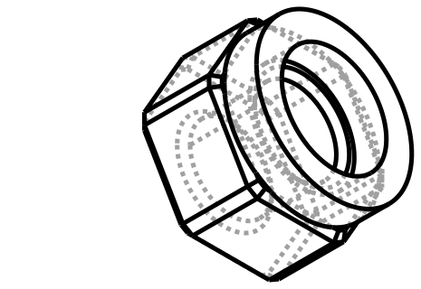
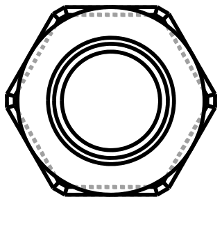

# Design: RC 12 mm Hex Hub + MR85 Bearing-Bore Housing

<!-- Filename: 2026-08-25-rc-hex-hub-bearing_design.md (tracked in git under docs/design_plans/) -->

## Meta
- **Requirements ref**: none separately filed — task arrived directly at the Designer as a
  single-session brief (Admin routed straight to Designer per the task's own framing:
  "Step 1-3 of the design flow"). Requirements are captured inline below instead of a
  separate `_req.md`.
- **Requester role**: User (direct request)
- **Date**: 2026-08-25
- **Dialog rounds**: 5 (Round 1 — human design-gate review resolved D2 from "independent
  pair" to "coaxial stacked assembly" and requested a joint-mechanism decision. Round 2 —
  human simplified the joint away entirely: no press-fit register: the two parts print as one
  **fused/unioned** body. Round 3 — human approved the design at Step 4 and requested a pure
  rename of the wrapper class (`HexHubAssembly` → `HexHubWithBearing`). Round 4 —
  post-implementation correction: `HexHubNut`'s through-bore changes from 4 mm to 6 mm,
  resolving D8's stepped-shaft assumption into a direct match with `FreespinHexHub`'s
  established clearance-bore convention. Round 5 — post-implementation addition: `HexHubNut`
  gains its own blind bearing pocket (same MR85-2RS bearing as the shaft side), and both
  bearing pockets switch from `press` to `free` fit grade so the bearing is user-replaceable
  at both ends. See Design Dialog Log / D9.)

---

## Objective

Model a standard 1:10-scale RC "12 mm hex" wheel-hub adapter and an MR85-2RS ball-bearing
housing as two independently-buildable CadQuery component classes under `vibe_cading/rc/`,
**fused into one printed body** (Round 2 revision — see Meta and Design Dialog Log) via a
`.union()`-based wrapper.

## Task Summary (inline requirements)

The user asked for "a 12mm RC hex hub with ball bearings" and described it as **two physically
distinct parts**, per the project's Multi-Part Assemblies rule:

1. **Hex nut part** — 12 mm across-flats hex prism, 6 mm thickness, 4 mm through-bore
   *(original request — corrected to a 6 mm through-bore in Round 4; see D8 and the Design
   Dialog Log)*. The standard RC hex-wheel-adapter shape.
2. **Bearing-bore cylinder part** — 12 mm OD × 2.5 mm height cylinder with an 8 mm-nominal ID
   bore, sized to house one MR85-2RS ball bearing (5 × 8 × 2.5 mm ID × OD × width) under a
   printed-clearance allowance rather than a bare 8.000 mm hole.

## Architecture / Approach

### Approach chosen

**Revised 2026-08-25 (Round 2).** Two component classes, each with its own `.solid` property
and independently buildable/exportable (per the Multi-Part Assemblies rule), in a new
`vibe_cading/rc/` subpackage (location rationale in Design Decision D1 below) — plus a third,
thin **wrapper class** that `.union()`s them into the single fused body that is the actual
shipped/printed deliverable (D2a, revised — see Meta and Design Dialog Log). There is no
longer any press-fit register/spigot/pocket feature — see D2a for why that mechanism was
removed in Round 2.

- `HexHubNut` — a plain hexagonal prism with a chamfered outer edge and a tolerance-profiled
  through-bore. No register feature (removed, Round 2). Built with the same
  `polygon(6, circumdia)` 2D-sketch-then-extrude pattern already used by
  `vibe_cading.rc.freespin_hex_hub.FreespinHexHub`.
- `BearingHexHousing` — a plain cylinder with the `Bearing` class's `outer_pocket()` cutter
  applied through it. No register feature (removed, Round 2). This **reuses**
  `vibe_cading.mechanical.bearings.Bearing` (per the project's Utility Reuse rule) rather than
  hand-rolling a clearance-added circle — the `Bearing` class already encapsulates the
  "nominal OD + tolerance-profile radial allowance" math the task explicitly asks for.
- `HexHubWithBearing` *(new, Round 2; name per D2a)* — a thin wrapper class that constructs a
  `HexHubNut` and a `BearingHexHousing`, positions the housing per the Assembly Datum
  translation plus a small overlap epsilon (D2a), and `.union()`s them into one solid, exposed
  as its own `.solid` property. This is the class the human actually prints; the two component
  classes remain independently buildable for isolated preview/debug (see D2a and the
  `build.toml` proposal note for why both levels are still worth exporting).

Both component classes accept a `profile: str | None = None` constructor kwarg, resolved via
`vibe_cading.print_settings.get_profile()`, per the project's Material-Specific Tolerances
convention — no hardcoded clearance floats. `HexHubWithBearing` forwards `profile` to both
components so the whole fused body reads one consistent tolerance profile.

### Visual contract (CAD tasks)





**Revised 2026-08-25 (Round 2, then re-regenerated in Round 4 for the bore-diameter
correction).** Both SVGs were most recently regenerated from a fresh `tmp/` raw-CadQuery
probe (`tmp/visualise_rc_hex_hub_bearing_fused_r4.py`, deleted after export, per the Visual
Contract Deliverable "part (b)" procedure) after the Round 4 correction changed the hex nut's
through-bore from 4 mm to 6 mm nominal. The SVGs show the **actual final printed geometry**:
one continuous fused solid, not two touching-but-separate solids with a visible seam or
register feature — this property is unchanged from Round 2; only the bore diameter shown is
updated.

The `iso_ne` view shows: the hex nut's chamfered hexagonal prism on top with its central
through-bore (now visibly larger than the Round 1–3 images, though still comfortably clear of
the hex flats — see D8's wall-thickness check), flowing directly into the housing's
cylindrical base below it with no visible step, spigot, or pocket at the join — because there
isn't one; the boundary between the two components is purely a construction-time detail
invisible in the fused output except where the housing's outer 12 mm OD is narrower than the
hex nut's ≈13.86 mm circumdiameter (visible as a slight footprint step at the join, an honest
artifact of the two different outer profiles meeting, not a modelled feature). The `top` view
(looking straight down the shared axis) confirms concentricity: the hex nut's 6.3 mm printed
bore *(Round 4 — was 4.3 mm)* and the housing's bearing-pocket region are both centred on the
same axis, with the hex outline visible around the housing's circular outline underneath. The
probe verified `union()` still produces a single contiguous solid (`fused.solids() == 1`)
with the larger bore, using the same 0.02 mm overlap epsilon between the two components
(D2a) — this is a probe-side sanity check only, not a substitute for the real
`HexHubWithBearing` class's own topology assertion (already implemented — this brief revision
is a post-implementation correction the Developer will re-sync code against).

### Alternatives rejected

- **Single combined class modelling both features as one part.** Rejected — the user
  explicitly described two independently-dimensioned physical objects, and the project's
  Multi-Part Assemblies rule requires separate classes with their own `.solid` for
  physically-distinct bodies, even when (as here) their exact assembled relationship is
  ambiguous.
- **Hand-rolled bearing-pocket cutter (bare `circle(D/2 + fixed_offset)`).** Rejected —
  `vibe_cading.mechanical.bearings.Bearing.outer_pocket()` already exists, already reads the
  tolerance-profile system, and is the codebase's own canonical example for this exact fit
  (`docs/print-tolerances.md` §2.1 cites `Bearing.outer_pocket` as the `press.radial`
  worked example). Duplicating it would violate the Utility Reuse rule.
- **Extending `FreespinHexHub` with new constructor kwargs** instead of new classes.
  Rejected — `FreespinHexHub` is a materially different part (16 mm-tall hub with **two**
  integrated bearing pockets and a 6 mm running-clearance centre bore for a *fixed* stub
  axle it spins around). The task's hex nut is thinner (6 mm) and has no integrated bearing
  pockets — a materially different intent (see D3) even though, after the Round 4 bore
  correction, its 6 mm bore now happens to numerically match `FreespinHexHub`'s own 6 mm
  default (the two parts independently converging on the same free-running-clearance
  convention for a 5 mm stub axle is a point *in favour* of this brief's approach, per D8 —
  it is not, on its own, a reason to merge the two classes). Retrofitting one class to cover
  both would either break `FreespinHexHub`'s existing `build.toml` registrations or require
  enough optional kwargs to defeat the "intuitive parameters" rule.
- **Two-part press-fit register spigot/pocket joint** (the Round 1 decision, D2a). Superseded
  in Round 2 — the human explicitly simplified this away: no separable mating feature, no
  fit-grade correction at the join, because the two components are not separately printed and
  assembled — they are one printed body. Keeping the register geometry would have added
  unrequested complexity (an 11.0/11.08 mm spigot/pocket, a new asymmetric-correction
  convention, thin-wall risk) to solve a problem — post-print assembly retention — that a
  fused single body doesn't have. See D2a (Round 2) for the full replacement decision.
- **Fully monolithic single class** (one `_build()` producing the whole fused shape directly,
  no component classes at all). Rejected — the project's Multi-Part Assemblies rule requires
  each physically distinct printed body to be its own class with its own `.solid`,
  independently buildable and exportable via `build.toml`; a single monolithic class would
  lose the ability to preview/debug the hex-nut half and the bearing-housing half in
  isolation (still useful even though the shipped deliverable is their union — see D2a and
  the `build.toml` proposal note). The chosen shape (two component classes + a thin union
  wrapper) keeps both properties: independent component buildability *and* one fused
  deliverable.

## Data & Interface Contracts

Not applicable — this is a geometry-only deliverable with no data/schema surface; domain
integrity gate is NO.

## Coordinate System

**Revised 2026-08-25 (Round 2)** — the register-pocket references from Round 1 are removed;
the assembly datum is now a plain flush union with a small overlap epsilon, not a
spigot/pocket registration. Both component classes keep their own per-class datum (unchanged
from the original brief; each remains independently buildable/exportable with its own local
`Z = 0`, per the project's Absolute Zero-Datum Consistency rule).

### Per-class datum (unchanged from the original brief)

Both component solids are centred on the shared rotation axis at `X = 0, Y = 0`, with
`Z = 0` at each one's own bottom (print-bed) face — consistent with the project's Absolute
Zero-Datum Consistency rule and matching `FreespinHexHub`'s existing convention.

- **`HexHubNut`**: `Z = 0` → bottom (mating) face, plain flat — no register feature — through
  `Z = thickness` (6 mm nominal) → top face (chamfered, outward-facing hex). The through-bore
  runs the full Z extent, centred on the hex's own hexagonal-prism axis. Axis convention
  justified by the geometry itself being rotationally symmetric under the hex's 6-fold
  symmetry — there is no reference drawing to cite for orientation (no attached reference
  image), so per the Designer persona's axis-grounding rule this is flagged as
  **arbitrary-but-conventional**: Z-up with the flat hex face on the bed matches how every
  other flat-prism part in this codebase (`FreespinHexHub`, hex nuts in
  `mechanical/nuts/metric.py`) is modelled, and is also the natural print orientation
  (chamfered faces both print-clean without supports).
- **`BearingHexHousing`**: `Z = 0` → bottom (non-mating, axle-entry) face, through
  `Z = bearing_width` (2.5 mm nominal) → top (mating) face, plain flat — no register
  feature. The bearing pocket through-cut (D4, unchanged) spans the full height.

### Assembly datum: flush union with a small overlap epsilon (revised, Round 2)

`HexHubWithBearing` (the new wrapper class, D2a) positions the two components so their mating
faces sit flush at a shared global `Z = 0` and unions them:

- `HexHubNut` needs **no translation** — its own local `Z = 0` (bottom face) already sits at
  the assembly's `Z = 0`. It occupies global `Z ∈ [0, 6.0]`.
- `BearingHexHousing` is translated by `(0, 0, -bearing_width + overlap_eps)` — nominally
  `(0, 0, -2.5 + 0.02) = (0, 0, -2.48)` — so its top face lands **0.02 mm past** global `Z = 0`
  rather than exactly coincident with it. This deliberate small overlap (verified in the
  Round-2 probe) is required per this project's Known Modelling Pitfalls: `.union()` between
  two solids sharing an *exactly* coincident planar face is a well-known OCCT boolean
  reliability risk, so a tiny overlap (0.02 mm — invisible externally, well under any print
  tolerance) guarantees a robust fuse instead. It occupies global
  `Z ∈ [-2.48, 0.02]`.
- The fused body spans global `Z ∈ [-2.48, 6.0]` (8.48 mm total envelope — 0.02 mm less than
  the un-overlapped 8.50 mm sum, an intentional and negligible reduction, not a modelling
  error). The shared axle passes through the whole span: entering at the housing's bottom face
  (`Z ≈ -2.48`), through the bearing (occupying the base cylinder's ≈2.5 mm width), across the
  flush join near `Z = 0`, and out through the hex nut's through-bore to `Z = 6.0`. **Revised,
  Round 4:** the *printed* bore diameter still changes at this join (8.08 mm bearing pocket in
  the housing region vs. 6.3 mm clearance bore in the nut region), but see D8 — as of the
  Round 4 correction this is no longer an axle-diameter step at all. The axle itself is now a
  single uniform 5 mm-nominal shaft throughout; the housing's 8.08 mm printed pocket holds the
  bearing's *outer* race (the axle never touches it directly), and the nut's 6.3 mm printed
  bore is simply a generous running-clearance hole around that same 5 mm axle — the printed
  diameters differ because the two regions serve different features (a bearing-OD pocket vs.
  an axle-clearance hole), not because the axle itself changes size.

This assembly-datum convention is implemented directly inside `HexHubWithBearing.__init__` — it
does not change either component class's own **exported** `.solid`, which per Absolute
Zero-Datum Consistency keeps its own independent `Z = 0` at its own bottom face, unmodified
from the original brief. Verified working in the Round-2 probe
(`tmp/visualise_rc_hex_hub_bearing_fused.py`, since deleted): `fused.solids() == 1` with these
exact translations.

## Dimension Table

| Dimension | Value | Source |
|---|---|---|
| Hex across-flats | 12.0 mm | User request; confirmed as the standard 1:10-scale RC hex convention by existing in-repo precedent `vibe_cading/rc/freespin_hex_hub.py` docstring: *"the '12 mm hex' standard used by most 1:10-scale RC wheels"* — this is a **domain/dimensional** precedent (confirms the numeric convention name), not an axis-orientation claim, so it needs no visual source per the Designer persona rule (that rule gates orientation claims, not dimension-naming conventions). |
| Hex nut thickness | 6.0 mm | User request (literal). |
| Hex nut through-bore, nominal | 6.0 mm *(Round 4 correction — was 4.0 mm)* | Human correction, post-implementation — see D8 and the Design Dialog Log Round 4 entry. Matches `FreespinHexHub`'s existing 6 mm centre-bore default (`vibe_cading/rc/freespin_hex_hub.py`), which is sized for the same 5 mm MR85-2RS stub-axle free-running-clearance convention. |
| Hex nut through-bore, printed | `6.0 + 2 × profile.free.radial` mm (6.30 mm on `fdm_standard`) | Design Decision D5 (unchanged — `free` fit-grade still applies, only the nominal input changed). |
| Hex nut wall thickness (bore edge to nearest hex flat) | `12.0/2 − 6.30/2` = 2.85 mm on `fdm_standard` | New (D8, Round 4) — sanity-checked in the Round 4 probe; comfortably clear of any thin-wall risk (well above typical multi-perimeter FDM minimums), not flagged as a risk. |
| Radial clearance around the 5 mm axle, nut region | `(6.30 − 5.0)/2` = 0.65 mm per side on `fdm_standard` | New (D8, Round 4) — looser than `FreespinHexHub`'s bare-nominal ~0.5 mm/side (that class doesn't layer a tolerance-profile allowance onto its bore; this brief's D5 does, per this project's profile-driven-tolerance convention). Still squarely in the same "generous non-contact clearance" category — see D8. |
| Housing OD | 12.0 mm | User request (literal). |
| Housing height | 2.5 mm | User request; matches MR85-2RS width exactly (see below), so the bearing sits flush both faces with no overhang. |
| Housing ID bore, nominal | 8.0 mm | User request (matches MR85-2RS OD). |
| Housing ID bore, printed | `8.0 + 2 × profile.press.radial` mm (8.08 mm on `fdm_standard`) | Design Decision D6 — `press` fit-grade chosen; see rationale below. |
| MR85-2RS ID (shaft bore) | 5.0 mm | User request; confirmed against existing in-repo constant `MR85_ID = 5.0` in `vibe_cading/rc/freespin_hex_hub.py:52` — no separate bearing datasheet reference exists in `docs/`, so this in-repo constant (already used in a shipped, `build.toml`-registered part) is the authoritative in-repo source. Not consumed directly by either new part (the housing only cuts the OD envelope), but recorded here since it's the value that makes "MR85-2RS" identifiable and is needed if a future part models the bearing's own `.solid` via `Bearing(5.0, 8.0, 2.5)`. |
| MR85-2RS OD | 8.0 mm | Same source; matches user's stated "8mm OD". |
| MR85-2RS width | 2.5 mm | Same source; matches user's stated "2.5mm height". |
| Hex nut chamfer | 0.5 mm | Carried over from `FreespinHexHub`'s existing default (`hex_chamfer: float = 0.5`) for visual/print-edge consistency across the RC-hex-part family. Not a user-specified value — flagged as a Developer-adjustable default, not a hard requirement. |
| Fused-assembly overlap epsilon | 0.02 mm | New (D2a, Round 2 — **replaces** the Round 1 register spigot/pocket rows, removed). Not a fit-grade value — a fixed, small geometric overlap so `HexHubWithBearing`'s `.union()` doesn't rely on an exactly-coincident planar face (Known Modelling Pitfalls). Verified working in the Round-2 probe; negligible relative to print layer height (0.2 mm typical) so it has no visible/functional effect on the fused body's external dimensions. |
| Fused-assembly total height | `thickness + bearing_width - overlap_eps` = 8.48 mm nominal (`6.0 + 2.5 - 0.02`) | D2a — the two component heights minus the overlap epsilon; both components' own individual dimensions (6.0 mm hex nut, 2.5 mm housing) are unchanged from the original brief. |

## Design Decisions

### D1 — Package location: `vibe_cading/rc/`, not `vibe_cading/lego_adapters/`

The task description suggested `vibe_cading/lego_adapters/`, but explicitly asked me to
"survey first and pick an appropriate location following existing conventions." Surveying
both packages:

- `vibe_cading/lego_adapters/` contents (`axle_to_pin_bore_adapter.py`,
  `technic_axle_to_bearing_sleeve.py`, `servos/sg90/servo_mount*.py`, `servos/shaft*.py`) are
  **all** parts that physically interface with Lego Technic geometry — 8 mm stud-grid pin
  holes, Technic axle cross-sections, or beam-mount clusters. Every file in this package has
  a Lego-side mating feature.
- `vibe_cading/rc/` (`freespin_hex_hub.py`, `servo/sg90.py`) hosts pure RC-hardware
  surrogate/adapter geometry with **no** Lego Technic interface at all — confirmed by reading
  `freespin_hex_hub.py` in full: no stud-grid alignment, no `TechnicPinHole`/`TechnicAxleHole`
  usage anywhere in the file. It is registered in `build.toml:33` as
  `vibe_cading.rc.freespin_hex_hub.FreespinHexHub`, i.e. the project's own build manifest
  already treats "12 mm RC hex hub with MR85 bearings" as `rc/`-scoped precedent.

Both new parts in this task — described purely by hex-across-flats, bore diameter, and
bearing envelope, with **zero** stud-grid or Technic-hole content — match the `rc/` pattern
exactly, not the `lego_adapters/` pattern. Per the "Reference-Doc Freshness" / convention-
following spirit of the project (pick location from precedent, not from the literal words of
a one-line task description), I am placing both classes under:

    vibe_cading/rc/hex_hub_bearing/hex_hub_nut.py       → class HexHubNut
    vibe_cading/rc/hex_hub_bearing/bearing_hex_housing.py → class BearingHexHousing
    vibe_cading/rc/hex_hub_bearing/__init__.py            → (empty, package marker)

A subpackage (mirroring `vibe_cading/rc/servo/` and `vibe_cading/lego_adapters/servos/sg90/`)
rather than two flat sibling files, because this is explicitly a **matched pair** delivered
together (the task's own framing) — grouping communicates that relationship structurally,
the way `rc/servo/` groups the SG90 servo files. This is a location/packaging recommendation
for the Developer to execute, not a claim about code structure (class/method decomposition
inside each file remains the Developer's call per the project's role boundaries).

**Flag for human review**: if the human reviewer's intent was specifically to file these
under `lego_adapters/` (e.g. because a future Lego-mounting variant is already planned), say
so at the Step 4 gate and I will revise — this is a non-blocking, reversible naming/location
choice, not a geometry decision.

### D2 — Relationship between Part 1 and Part 2: coaxial stacked assembly (REVISED, Round 1)

**Superseded.** The original brief resolved this as an "independent pair" (reasoning
preserved below, struck through, for the audit trail). Human design-gate review (Round 1)
overrode that resolution with an explicit clarification: the two parts **do** stack together
and are meant to be handled/move as one assembled hub unit — a shared axle passes through
the hex nut's bore *(6 mm as of the Round 4 correction — see D8; 4 mm at the time of this
Round 1 clarification)* *and* through the bearing seated in the housing's 8 mm bore. This is
now the governing resolution; the rest of this brief (Coordinate System, Dimension Table,
Implementation Plan, Tests, Visual Contract) has been updated to match.

<details>
<summary>Original (superseded) reasoning — kept for audit trail, do not re-apply</summary>

The original brief argued for "independent pair" because the two parts' bore diameters don't
match (4 mm vs. 5 mm bearing ID), Part 2's height exactly matches the bearing width with no
extra shoulder material, and `FreespinHexHub`'s precedent integrates its bearing pockets
directly into the hex body rather than as a separate stacked part. This reasoning weighed
plausible geometric self-consistency over the human's actual intent — the human's Round 1
clarification directly resolves the ambiguity this reasoning was inferring around, so the
inference is moot, not wrong given the information available at the time. The bore-diameter
mismatch it flagged is real and is now addressed explicitly in D8 below, not dismissed.

</details>

**Revised decision:** `HexHubNut` and `BearingHexHousing` are joined coaxially, mating faces
flush, forming one physically-**fused** hub (Round 2 — see D2a): `BearingHexHousing` below
(axle enters from its exposed bottom face, passes through the bearing), `HexHubNut` above
(axle continues through the through-bore — 6 mm nominal as of Round 4, see D8 — hex face
outward for the wheel-hex interface). See D2a for the fusing mechanism and D8 for the
resulting axle-clearance sizing.

### D2a — Fusing mechanism: `.union()`-based wrapper class, no register joint (REVISED, Round 2)

**Superseded.** Round 1 decided a press-fit register spigot/pocket joint between two
separately-printed parts (reasoning preserved below, collapsed, for the audit trail). The
human's Round 2 message explicitly simplified this away: **no** press-fit register — the two
components print as **one single fused part**, conceptually "one part with two components,"
not a multi-part assembly joined by a mating feature. This is now the governing decision.

<details>
<summary>Round 1 (superseded) reasoning — kept for audit trail, do not re-apply</summary>

Round 1 chose a press-fit annular register spigot (`BearingHexHousing`, 11.0 mm nominal OD,
1.0 mm tall, raw nominal) into a matching blind pocket (`HexHubNut`, 11.08 mm printed
diameter, 1.20 mm printed depth, `press`-fit correction on the pocket side only) — reasoning
that the two parts needed a physical retention/alignment feature for post-print assembly, and
that splitting the bearing housing out let the bearing be pressed in before joining to the
bulkier hex nut. The Round 2 clarification removes the premise this was solving (post-print
assembly of two separate prints) — there is no longer a separable mating surface to size a
fit grade for, so the register geometry, its dimensions, and its "first printed-vs-printed
joint" fit-grade convention are all removed, not merely deprioritized.

</details>

**Revised decision: two component classes + a thin `.union()` wrapper (`HexHubWithBearing`),
no register feature.**

- **Why keep two component classes at all** (rather than one monolithic `_build()`): the
  project's Multi-Part Assemblies rule requires each physically distinct printed body to
  remain its own class with its own `.solid`, independently buildable and exportable via
  `build.toml` — this project convention holds regardless of whether the final shipped
  geometry is their union (see "Alternatives rejected" above). It also keeps the practical
  benefit noted in Round 1: a Developer can preview/debug `HexHubNut` and `BearingHexHousing`
  each in isolation via `preview.py`/`section_slicer.py` even though neither is what actually
  gets printed.
- **Why a wrapper class, not a bare module function:** matches this project's Object-Oriented
  Component API convention (mechanical/joint/assembly-style utilities as classes, not bare
  functions) and gives the fused body its own `.solid` property + independent
  topology-assertion, consistent with every other model class in the codebase. Named
  `HexHubWithBearing` *(renamed at Step 4 human approval from the initial `HexHubAssembly`
  draft — "Assembly" reads as a multi-part-wrapper name, which is exactly the framing the
  human wanted to avoid now that the deliverable is one single fused object; `HexHubWithBearing`
  states plainly what the object is, not how it was constructed)*.
- **Geometry: flush union, no register.** `HexHubWithBearing.__init__` builds a `HexHubNut` and
  a `BearingHexHousing` (forwarding a shared `profile` kwarg to both), positions the housing
  per the Assembly Datum section (translated so its top face sits flush against the hex nut's
  bottom face, plus a 0.02 mm overlap epsilon), and calls `.union()`. **No fit-grade knob
  applies at this join** — per the human's explicit instruction, this is not a boolean
  interface between two separately-printed parts, so there is nothing to correct for print
  shrink/growth; the two flat faces are simply the same material, one continuous print.
  Result asserted single-solid (`assert len(result.solids().vals()) == 1`) per the project's
  Topological Validation rule.
- **Overlap epsilon (0.02 mm), not a mating fit:** the only numeric addition at the join is a
  fixed, tiny geometric overlap so `.union()` doesn't rely on an exactly-coincident planar
  face — a known OCCT boolean reliability risk per this project's Known Modelling Pitfalls
  (documented precisely in the revised Coordinate System section above). This is
  **categorically different** from the removed `press.radial`/`press.axial` correction: it is
  not a manufacturing-tolerance compensation (nothing is being 3D-printed *into* something
  else here), just a boolean-robustness margin, so it is a fixed constant rather than a
  `print_settings`-profile-derived value.

**Verified working** in the Round-2 visual-contract probe
(`tmp/visualise_rc_hex_hub_bearing_fused.py`, since deleted): `hex_nut.solids() == 1`,
`housing.solids() == 1` standalone, and `fused.solids() == 1` after `.union()` with the
0.02 mm overlap — fused bounding-box `Z` span `[-2.48, 6.0]` (8.48 mm total), exactly matching
the Assembly Datum section's math.

### D3 — Part 1's through-bore: direct shaft/axle interface, now within the fused body

The bore (6 mm nominal as of the Round 4 correction — see D8; originally specified as 4 mm)
is modelled as what it most plausibly is on a standard RC hex-wheel adapter: a
**direct clearance bore for a shaft/axle** passing through the hex nut, continuing down
through the fused housing/bearing region below it (per D2's revised, now-fused relationship).
No separate retention geometry (grub screw, E-clip) is modelled — see Out of Scope. This still
matches how RC "hex hub" adapters function in the drivetrains they come from (the hex mates
with the wheel; the bore carries the axle) — the revision is that the bore's *far* end now
continues into the bearing region rather than terminating independently, per D8 below.

### D4 — Bearing pocket cutter must be recentred to avoid a coincident entry face

`Bearing.outer_pocket()` extrudes its cutter from `Z = 0` to `Z = thickness + press.axial`
(one-sided — see `bearings.py:88-91`). Applied directly to a housing cylinder also built from
`Z = 0`, the cutter's *bottom* face would be exactly coincident with the housing's bottom
face — the exact "coincident planar face" failure mode flagged in this project's Known
Modelling Pitfalls ("Blind Holes and Internal Geometry Under-visibility": *the entry face...
must have an outward overcut*). Because Part 2's pocket is a **through-cut** (both faces are
functionally entry faces, per the Coordinate System section above), the Developer MUST
translate the `outer_pocket()` cutter down by half the axial allowance before cutting, e.g.:

```python
pocket = bearing.outer_pocket(profile=prof).translate((0, 0, -prof.press.axial / 2.0))
housing = housing.cut(pocket)
```

This centres the `press.axial` overcut symmetrically across both faces (each face gets
`press.axial / 2` of overcut) rather than leaving one face exactly coincident. Verified
working in the visual-contract probe (`tmp/visualise_rc_hex_hub_bearing.py`, since deleted) —
the housing cuts cleanly to a single solid with this translation; omitting it is untested and
should not be assumed safe.

### D5 — Fit grade for Part 1's bore: `free`

Per `docs/print-tolerances.md` §6 ("A through-hole the screw floats in → `free`"), and
matching the codebase's own canonical `free`-grade consumers (`ClearanceHole.to_cutter`,
etc.) — a hex nut's centre bore that a shaft/axle passes freely through, with no press or
snug-fit function claimed by the task, is exactly the `free` archetype: loose, no-binding,
the wall is not a functional contact/retention surface (retention is via the external
fastener mechanism noted in D3, out of scope here). This also follows the "do not model as a
bare nominal" spirit the task explicitly required for Part 2, applied consistently to Part 1.

### D6 — Fit grade for Part 1's bore: `press` (radial, diametral)

The task requires justifying the fit grade for Part 2's ID bore explicitly. Per
`docs/print-tolerances.md` §1 and §2.1, `press` is:

- The project's own **canonical example** for exactly this feature — the print-tolerances
  doc's worked-example table lists `Bearing.outer_pocket` under `press.radial` by name
  (`docs/print-tolerances.md:33,67`), and the module docstring of `bearings.py` itself
  describes `outer_pocket()` as "burying the outer race into a printed housing."
- Physically appropriate for a **standalone housing insert** (per D2, this part is not
  described as needing to be user-serviceable/removable) — a press-fit prevents the bearing's
  outer race from spinning inside the printed pocket under load, which a looser fit would
  risk. `FreespinHexHub` chose `free` for its *own* bearing pockets deliberately because it
  documents an explicit design intent ("drop-in / pop-out... without press-fitting tools") —
  no such intent was stated for this task's housing, so the project's own default/canonical
  choice (`press`) applies rather than the special-cased exception.
- The correct **axis**: `radial`, since the bearing OD → housing-bore fit is a diametral
  (cross-sectional) clearance, not a depth/axial one — matching the task's own framing
  ("radial in this case, since the OD is a diametral/radial fit"). `press.axial` is also
  read (per D4) for the through-cut overcut, consistent with `Bearing.outer_pocket()`'s own
  signature (it always returns both).

**Numeric result on `fdm_standard`:** `8.0 + 2 × 0.04 = 8.08 mm` printed ID — an MR85-2RS's
8.000 mm OD presses into an 8.08 mm printed bore, matching the exact worked-example ratio the
project's own reference doc already validates for `Bearing.outer_pocket`.

### D7 — Stud-grid alignment: does not apply

Per the task's own open question — checked `vibe_cading/rc/freespin_hex_hub.py` (the closest
in-repo precedent) and confirmed it has **no** 8 mm stud-grid alignment anywhere; its hole
centres are simply `(0, 0)` (rotationally symmetric parts have no grid to align to). Both new
parts here are pure RC-side rotational components (a hex prism and a bearing housing), with
no Lego Technic mounting holes or beam interface described by the task. The 8 mm stud-grid
constraint in `vibe_cading/lego-technic.md` / project instructions applies to parts that
physically mount onto Lego Technic beams via pin/axle holes — neither part here does that.
**Not applicable; no grid alignment required.**

### D8 — Axle/bearing diameter relationship: 6 mm clearance bore around a uniform 5 mm axle, matching `FreespinHexHub`'s established convention (REVISED, Round 4 — supersedes the Round 1/2 "stepped-shaft" resolution)

**Superseded.** Round 1/2 resolved the original 4 mm hex-nut bore vs. 5 mm bearing ID
mismatch as an intentional **stepped/shouldered axle** assumption (reasoning preserved below,
collapsed, for the audit trail). The human's Round 4 correction changes the hex nut's
through-bore from 4 mm to **6 mm** nominal, which removes the mismatch this reasoning was
built around — there is no longer a stepped-shaft question to answer. This is now the
governing resolution.

<details>
<summary>Round 1/2 (superseded) "stepped-shaft" reasoning — kept for audit trail, do not re-apply</summary>

With a 4.0 mm nominal (4.3 mm printed) hex-nut bore against the MR85-2RS's fixed 5.0 mm ID,
a single constant-diameter axle couldn't both pass through the hex nut with clearance and
register snugly against the bearing's inner race — those wanted two different diameters. The
brief resolved this as a deliberate stepped/shouldered axle (⌀4 mm through the nut, stepping
up to ⌀5 mm at the bearing), explicitly out of scope to model, and flagged for human
confirmation "if a uniform-diameter axle was actually intended." The human's Round 4 message
is exactly that confirmation — a uniform-diameter axle **was** intended, and the fix is
correcting the bore's nominal value (as anticipated) rather than reworking either printed
part.

</details>

**Revised resolution: no diameter mismatch — a single uniform 5 mm-nominal axle throughout,
directly matching `FreespinHexHub`'s existing convention.** With the hex nut's bore now 6.0 mm
nominal (6.30 mm printed on `fdm_standard`, per D5's unchanged `free`-fit-grade treatment):

- The hex-nut region's printed bore (6.30 mm) is simply a **generous running-clearance hole**
  around a 5 mm-nominal axle — radial clearance `(6.30 − 5.0)/2 = 0.65 mm` per side. The wall
  is explicitly *not* a contact/registration surface (unchanged from D5's original `free`-grade
  reasoning) — the axle floats through this region.
- The housing region's printed bearing pocket (8.08 mm) is unrelated to the axle diameter at
  all — it holds the bearing's **outer** race (per D6, `press`-fit). The axle only ever
  contacts the bearing's **inner** race (5.0 mm ID, a fixed MR85-2RS hardware dimension), via
  a slip fit — the same canonical pattern `docs/print-tolerances.md` documents for
  `Bearing.shaft_cutter`.
- **This is now exactly the pattern already established by `FreespinHexHub`** (cited in D1 as
  the closest in-repo precedent): its own docstring states *"The 6 mm centre bore provides
  free running clearance for the 5 mm stub axle while transferring radial and axial wheel
  loads through the two bearings... does not transmit torque."* This brief's `HexHubWithBearing`
  now follows the identical logic — one difference in the *implementation* worth noting
  explicitly rather than leaving as a silent numeric mismatch: `FreespinHexHub`'s bore is a
  **bare nominal** 6.0 mm (no profile allowance layered on), giving a flat ~0.5 mm/side
  clearance regardless of print profile, whereas this brief's `HexHubNut` applies D5's
  `free.radial` tolerance-profile correction on top of the 6.0 mm nominal (per this project's
  Manufacturing & Tolerance Profiles rule — no hardcoded magic clearances), giving a
  slightly looser 0.65 mm/side on `fdm_standard` and a value that scales with the active
  profile. Both are comfortably within the "generous non-contact clearance" archetype the
  bore is meant to provide; this brief keeps its own profile-driven convention (consistent
  with every other through-hole in this codebase) rather than copying `FreespinHexHub`'s bare
  literal, and flags the minor numeric divergence here so it isn't mistaken for an oversight.
- **No stepped/shouldered axle is required or assumed anymore.** The axle out-of-scope note
  in "Out of Scope" is updated accordingly.

**Wall-thickness / structural-margin check (human's point 3, this round):** with the larger
6.30 mm printed bore, the material remaining between the bore edge and the nearest hex flat is
`12.0/2 − 6.30/2 = 2.85 mm` (hex inradius 6.0 mm minus bore radius 3.15 mm) — verified in the
Round 4 probe. This is comfortably thick for FDM (well above a typical multi-perimeter
minimum), **not flagged as a risk**. The housing-side wall (bearing-pocket edge to 12 mm OD,
≈1.96 mm, unchanged from the original brief) is untouched by this bore change and was already
accepted. At the flush join, the printed bore (6.30 mm) stays strictly smaller than the
housing's bearing-pocket printed diameter (8.08 mm), so the through-passage nests cleanly with
no new material conflict — verified single-solid (`fused.solids() == 1`) in the Round 4 probe.

## Implementation Plan

- [ ] **T1** – Create `vibe_cading/rc/hex_hub_bearing/__init__.py` (empty package marker, AGPLv3
  header exempt per project convention for empty `__init__.py`).
- [ ] **T2** *(implemented; re-sync per Round 4 — see below)* – Implement `HexHubNut` in
  `vibe_cading/rc/hex_hub_bearing/hex_hub_nut.py`: hexagonal prism (`hex_across_flats=12.0`,
  `thickness=6.0` defaults), chamfered edges (`hex_chamfer=0.5` default), through-bore
  (`bore_diameter=6.0` nominal *(Round 4 correction — was `4.0`)*, `free`-fit per D5). **No
  register feature (removed, Round 2).** `profile: str | None = None` constructor kwarg.
  Single top-level `.solid` property. Assert single-solid topology. **Round 4 re-sync**: the
  Developer already implemented this class with `bore_diameter=4.0`; update the default to
  `6.0` and re-run T6's validation commands — no other change to this class.
- [ ] **T3** – Implement `BearingHexHousing` in
  `vibe_cading/rc/hex_hub_bearing/bearing_hex_housing.py`: cylinder
  (`housing_od=12.0`, `bearing_width=2.5` defaults), reusing
  `vibe_cading.mechanical.bearings.Bearing(bearing_id, bearing_od, bearing_width)` +
  `.outer_pocket(profile=...)` per D4's recentring fix. **No register feature (removed,
  Round 2).** `profile: str | None = None` constructor kwarg. Single top-level `.solid`
  property. Assert single-solid topology. MR85-2RS defaults: `bearing_id=5.0, bearing_od=8.0,
  bearing_width=2.5`.
- [ ] **T3b** *(new, Round 2 — required, not optional)* – Implement `HexHubWithBearing` in
  `vibe_cading/rc/hex_hub_bearing/hex_hub_with_bearing.py`: constructs a `HexHubNut` and a
  `BearingHexHousing` internally (forwarding a shared `profile: str | None = None` kwarg to
  both), positions the housing per the Assembly Datum section
  (`.translate((0, 0, -bearing_width + overlap_eps))`, `overlap_eps=0.02` nominal, exposed as
  a constructor kwarg with that default — not profile-derived, per D2a), and returns
  `hex_nut.union(housing_positioned)` as its `.solid`. Assert single-solid topology
  (`assert len(result.solids().vals()) == 1`) — this is the **primary correctness gate** for
  this class, since a failed/partial union would silently produce a multi-solid or
  non-manifold result. This is the class that represents the actual shipped/printed
  deliverable.
- [ ] **T4** *(optional, low-risk reuse improvement — flagged, not required)* – Consider
  adding a `Bearing.mr85()` classmethod to `vibe_cading/mechanical/bearings.py`, mirroring
  the existing `b608()` / `b623()` / `f623()` / `b624()` / `b6702()` preset pattern
  (`Bearing.mr85() = cls(5.0, 8.0, 2.5)`), so `BearingHexHousing` (and any future MR85
  consumer) reads a named preset instead of duplicating the three raw floats. Not
  architecturally significant (same shape as five existing classmethods) — Developer may
  do this without a TL consult, or skip it and use raw floats if it doesn't fit cleanly.
- [ ] **T5** – Regenerate the visual-contract SVGs from the real `HexHubWithBearing` class via
  `vibe_cading/tools/preview.py vibe_cading.rc.hex_hub_bearing.hex_hub_with_bearing.HexHubWithBearing
  --views iso_ne top`, overwriting the committed
  `visual_contracts/2026-08-25-rc-hex-hub-bearing_design_*.svg`. Since `HexHubWithBearing` is now
  a normal single-`.solid` class, this is a plain `preview.py` invocation — no assembly-module
  workaround needed (simpler than the Round 1 plan, which needed T3c for exactly this reason).
- [ ] **T6** – Run validation commands (below) and report results.
- [ ] **T7** – Propose the `[[build]]` entries below to the user for explicit approval; do
  **not** add them to `build.toml` without that approval (project rule). The primary entry is
  `HexHubWithBearing` (the actual print deliverable); see the `build.toml` proposal note below
  for whether the two component classes are also worth registering separately.

## Tests

| # | Test description | Expected assertion | File / location |
|---|------------------|--------------------|-----------------|
| 1 | `HexHubNut()` default build produces a single solid | `len(HexHubNut().solid.solids().vals()) == 1` | Developer smoke test, or `tests/lego_adapters/` / new `tests/rc/` test file |
| 2 | `HexHubNut()` bounding box matches nominal hex geometry | Bounding-box X/Y span ≈ hex circumdiameter (`12.0 / cos(30°)` ≈ 13.856 mm); Z span == 6.0 mm | Same test file, via `.solid.val().BoundingBox()` |
| 3 | `HexHubNut()` through-bore diameter reflects `free` fit-grade | Measured bore radius (via `hole_finder.py` or a boolean probe) == `4.0/2 + profile.free.radial` for the active profile, not bare `2.0 mm` | `vibe_cading/tools/hole_finder.py` on an exported STEP, or a unit test reading the constructed cutter geometry |
| 4 | `BearingHexHousing()` default build produces a single solid | `len(BearingHexHousing().solid.solids().vals()) == 1` | New `tests/rc/` test file |
| 5 | `BearingHexHousing()` pocket is a clean through-cut, no floating ring / thin wafer | `section_slicer.py --axis Z --at 1.25` (mid-height) shows one continuous annulus, inner radius == `8.0/2 + profile.press.radial`, outer radius == `12.0/2` | `vibe_cading/tools/section_slicer.py` |
| 6 | `BearingHexHousing()` pocket cutter does not leave a coincident-face artifact at either Z face (D4 regression guard) | `section_slicer.py --axis Z --at 0.01` and `--at 2.49` (just inside each face) both show the same clean annulus as the mid-height slice — no un-cut wafer at either end | `vibe_cading/tools/section_slicer.py` |
| 7 | A real 8.000 mm-diameter cylinder (nominal bearing OD, no clearance) intersects the housing's printed bore by a strictly positive volume, proving the printed bore is *larger* than nominal (D6's clearance claim is load-bearing, not decorative) | `.intersect()` volume between an 8.000 mm test cylinder and `BearingHexHousing().solid`'s pocket cavity == 0 (no interference — i.e. the real bearing fits); a second probe with an oversized e.g. 8.10 mm cylinder shows nonzero interference, confirming the check can fail | New `tmp/` probe during T6, promoted to a pinned test if straightforward |
| 8 | **(Pre-merge representative-scale row)** Full-tree rebuild picks up the new class(es) without error once registered in `build.toml` | `python build.py` completes with exit 0 and produces the registered STEP file(s) under `build/` | Run once after T7's `build.toml` entries are approved and added — **not** before; this row gates the eventual merge, not this design-phase brief |
| 9 | *(revised, D2a Round 2)* `HexHubWithBearing()` default build produces a single fused solid | `len(HexHubWithBearing().solid.solids().vals()) == 1` — this is the primary correctness gate for the union (T3b) | New `tests/rc/` test file |
| 10 | *(new, D2a Round 2)* `HexHubWithBearing()`'s fused bounding-box height matches the two components' heights minus the overlap epsilon | Bounding-box Z span == `thickness + bearing_width - overlap_eps` (8.48 mm on defaults); no unexpected gap or extra protrusion at the join | Same test file, via `.solid.val().BoundingBox()` |
| 11 | *(revised, D2a Round 2; bore value updated Round 4)* The fused body's coaxial through-passage is intact: the hex-nut region's 6.3 mm printed bore *(was 4.3 mm)* and the housing region's bearing pocket are both still present and centred on the same axis after `.union()` (the boolean didn't silently merge/erase either bore) | `section_slicer.py --axis Z --at 3.0` (mid-hex-nut) shows the 6.3 mm bore; `--axis Z --at -1.25` (mid-housing) shows the bearing pocket annulus; both centred at `X=0, Y=0` | `vibe_cading/tools/section_slicer.py` |
| 12 | *(new, D2a Round 2)* No un-cut wafer or void artifact at the flush join, specifically in the **outer wall region** (radius > 4.04 mm, i.e. outside the housing's bearing-pocket edge, where both components have continuous solid material and the overlap epsilon is the only thing standing between a clean fuse and a boolean gap) — the overlap-epsilon regression guard, mirroring D4's Test 6 for the bearing-pocket cutter | `section_slicer.py --axis Z --at -0.01` and `--at 0.01` (either side of the join) both show solid material in the outer-wall annulus (no gap, no doubled wall thickness) | `vibe_cading/tools/section_slicer.py` |
| 13 | *(new, D8 Round 4)* Hex-nut wall thickness (bore edge to nearest hex flat) is not thin enough to risk print failure | Measured minimum wall (bore edge to hex inradius) == `12.0/2 − 6.30/2` = 2.85 mm on `fdm_standard` — comfortably above a typical multi-perimeter FDM minimum | `hole_finder.py` / `face_distances.py` on an exported STEP, or a unit test computing the geometric value directly |

## Success Criteria

1. `HexHubNut`, `BearingHexHousing`, and `HexHubWithBearing` each build a single contiguous solid
   with no floating-body artifacts (topology assertion in code, per Known Modelling
   Pitfalls) — for `HexHubWithBearing` this is the primary correctness gate on the `.union()`
   (Test 9).
2. Both component classes read fit-grade clearances through
   `vibe_cading.print_settings.get_profile()` — no hardcoded magic clearance floats (D5, D6).
   The fused assembly's overlap epsilon is a deliberate fixed constant, not profile-derived
   (D2a) — this is documented, not an oversight.
3. `BearingHexHousing`'s pocket demonstrably admits an 8.000 mm nominal-OD bearing envelope
   with zero interference, and a probe at a tighter diameter demonstrably shows interference
   (Test 7) — the fit claim is falsifiable, not decorative.
4. Regenerated `iso_ne` (and `top`) visual contracts, from the real implemented
   `HexHubWithBearing` class (per T5), visually match this brief's revised design-stage SVGs in
   gross geometry (hex profile, bore placement, housing proportions, **one continuous fused
   body with no visible seam/register feature**).
5. D1–D8 design decisions are reflected in the implementation without silent deviation; any
   deviation is escalated back to this brief per the Escalation Protocol.
6. *(revised, D2a Round 2; bore value updated Round 4)* The fused body's coaxial
   through-passage (6.3 mm hex-nut bore, 8.08 mm bearing pocket) survives the `.union()`
   intact and centred, and no boolean gap/wafer artifact exists at the flush join — Tests 11
   and 12 pass.
7. *(new, D8 Round 4)* The hex-nut wall thickness around the enlarged bore is not a thin-wall
   risk (2.85 mm, per D8's wall-thickness check) — Test 13 passes.

## Out of Scope

- Any fastener/retention geometry for the axle bore (grub screw, E-clip, set-screw boss) — the
  task described only the bore itself.
- The axle/shaft itself — hardware the human sources or models separately; this brief only
  records the dimensional constraint it must satisfy: a uniform 5 mm-nominal shaft, running
  with clearance through the hex nut's 6 mm bore and registering (slip-fit) inside the
  bearing's 5 mm ID *(Round 4 — no longer a stepped-diameter shoulder; see D8)*.
- **A press-fit register/spigot/pocket joint** — removed in Round 2. The two components are
  fused (`.union()`), so there is no separable mating surface, no fit-grade correction needed
  at the join, and (as a direct consequence) no anti-rotation-keying concern either — a fused
  single printed body cannot rotate relative to itself, so the Round 1 "no keying feature"
  risk this would have raised is now moot, not merely deferred.
- A host structure beyond the fused hub (e.g. a knuckle or chassis mount the hub itself would
  be journaled into) — out of scope; the fused body *is* the deliverable.
- Modelling the bearing itself as a positive `.solid` (e.g. via `Bearing(5.0, 8.0, 2.5).solid`)
  — only the printed housing/nut geometry is in scope; the bearing is off-the-shelf hardware.
- `build.toml` registration — proposed below for human approval, not applied in this brief.
- A `Bearing.mr85()` preset classmethod (T4) is optional, not required for sign-off.

## Known Risks & Mitigations

| Risk | Mitigation |
|------|-----------|
| *(superseded, Round 1)* D2's original "independent pair" interpretation was wrong. | Resolved in Round 1 — no longer a live risk; D2 now reflects the human's clarification. |
| *(superseded, Round 2)* The Round 1 register spigot/pocket's anti-rotation-keying gap, thin-wall margins, and novel pocket-only fit-grade convention. | All three risks are **moot**, not fixed — Round 2 removed the register mechanism entirely, so there is no separable joint, no fit-grade convention to establish, and no relative-rotation possibility in a fused single body. See Out of Scope. |
| `Bearing.outer_pocket()`'s one-sided extrusion (D4) causes a coincident-face boolean failure if the Developer omits the recentring translate. | D4 documents the exact fix and cites the verified-working probe; regression-guard testing (Test 6 in the original Tests table) covers this specific failure mode. Independent of the Round 2 change — D4 still applies to `BearingHexHousing` standalone. |
| `press.radial` default (`0.04 mm` on `fdm_standard`) may be too tight/loose on an untested printer, causing the bearing to crack the housing or spin freely. | Already covered by the project's existing calibration workflow (`vibe_cading/tools/calibrate.py press`) — no new calibration tooling needed; document in the class docstring per `FreespinHexHub`'s existing pattern. |
| *(new, D2a Round 2)* `HexHubWithBearing`'s `.union()` could fail or silently produce a non-manifold/multi-solid result if the 0.02 mm overlap epsilon is insufficient or omitted (e.g. a future constructor-kwarg change accidentally sets `overlap_eps=0.0`). | Test 9 (single-solid assertion) is the primary gate and runs on every default-parameter build; Test 12 is a dedicated regression guard for the specific overlap-epsilon failure mode, mirroring D4's own regression-guard pattern for the bearing-pocket cutter. |
| *(new, D2a Round 2)* Because the hex nut's footprint (≈13.86 mm hex circumdiameter) is wider than the housing's 12 mm OD, the fused body has a visible step in outer profile at the join (not a defect, just an honest consequence of the two different outer diameters) — could read as an unintended artifact if not called out. | Documented explicitly in the Visual Contract section as an expected, non-modelled feature — not something the Developer needs to smooth over or chamfer unless the human asks for that in a follow-up round. |
| *(superseded, Round 4)* The 4 mm hex-nut bore / 5 mm bearing ID mismatch implied a stepped-shaft axle that was out of scope for this deliverable. | Resolved in Round 4 — no longer a live risk. The human confirmed a uniform-diameter axle was intended (the Round 1/2 "flag for human review" note anticipated exactly this); the bore's nominal value was corrected from 4 mm to 6 mm, matching `FreespinHexHub`'s established convention. See D8's revised resolution. |
| *(new, D8 Round 4)* The larger 6 mm bore reduces the hex nut's wall thickness around the bore compared to the original 4 mm design. | Checked explicitly in D8 and Test 13 — 2.85 mm minimum wall on `fdm_standard`, comfortably clear of thin-wall risk; not flagged as a concern, but the number is now on record so a future dimension change can be checked against it. |

---

## Design Dialog Log

Initial drafting (pre-Round-1) involved no live co-design dialog — the Designer received the
fully-specified task directly, without an interactive requester channel, and resolved all
flagged ambiguities as explicit Design Decisions (D1–D7).

### Round 1 (human design-gate review, 2026-08-25)

**Human challenge / contribution:**
> Human review resolved ambiguity D2: the two parts DO stack together and are meant to
> move/be handled as one assembled piece — not an independent pair. The 4mm bore (in
> `HexHubNut`) is for the shaft/axle to pass through; the 8mm bore (in `BearingHexHousing`)
> is for the MR85-2RS bearing. The axle passes through the assembled stack — through the hex
> nut's 4mm bore and through the bearing seated in the housing. Requested: (1) revise D2's
> resolution, (2) decide and document the stacking geometry (fused single body vs. two parts
> mating via a press-fit joint, with the spigot/pocket sized to an appropriate fit grade, and
> how the shared axis / Z-stacking mating face is set up), (3) re-verify the 4mm bore and the
> 5mm bearing ID are compatible with one continuous axle, flagging a genuine design choice if
> that's what it is, (4) regenerate the visual contracts showing the assembled stack, (5)
> update the `build.toml` proposal if the class/module shape changed.

**Resolution:**
> D2 revised to a coaxial stacked assembly (see D2 above). D2a decides the joint mechanism:
> two separate classes (per the Multi-Part Assemblies rule — a fused single class was
> rejected outright, not just on preference), joined by a press-fit annular register
> spigot/pocket (`BearingHexHousing`'s spigot into `HexHubNut`'s pocket), `press`-fit
> correction applied to the pocket (female) side only, spigot (male) left at raw nominal —
> the first printed-vs-printed joint in this codebase, flagged for Independent TL attention.
> A new Assembly Datum convention defines the shared mating face at global `Z = 0`, with
> `BearingHexHousing` translated by `(0, 0, -bearing_width)` relative to its own per-class
> datum. D8 addresses the 4 mm/5 mm bore mismatch: resolved as an intentional
> stepped-shaft-axle constraint (out of scope for this deliverable, axle not modelled),
> flagged for human confirmation rather than silently reconciled. Visual contracts
> regenerated from a fresh `tmp/` probe showing the parts stacked mating-face-to-mating-face
> (superseding the side-by-side layout); `build.toml` proposal unchanged in shape (each part
> still builds its own STEP independently — `build.toml` has no assembly concept), only the
> descriptive comment updated.

### Round 2 (human design-gate re-review, 2026-08-25)

**Human challenge / contribution:**
> Further clarification: simplify away the joint entirely. No press-fit register/spigot/
> pocket between the two parts — drop that whole mechanism (D2a's annular register). The two
> components print out as **one single fused part**, not two parts assembled together
> post-print — conceptually "one part with two components" stacked along the same axis, not a
> multi-part assembly joined by a mating feature. Still fine to keep two classes per the
> Multi-Part Assemblies rule, but the actual print/assembly output should be their union —
> flush stacked faces at the shared Z=0 datum, verified single-solid. Remove the D2a joint
> dimensions (11.0 mm spigot, 11.08 mm/1.20 mm pocket) since there's no separable mating
> surface — no fit-grade needed there. Keep D8 as-is. Re-verify the bore/bearing-ID alignment
> still holds after removing the register. Regenerate the visual contracts showing the actual
> fused geometry. Update the `build.toml` proposal — likely a single registered target now,
> but note if exporting the two components separately still has value.

**Resolution:**
> D2a fully revised: the press-fit register is removed (Round 1 reasoning collapsed into an
> audit-trail block, not deleted). `HexHubNut` and `BearingHexHousing` remain separate,
> independently-buildable classes (unchanged in their own geometry from the *original* brief —
> neither ever needed a register feature once it's gone), plus a new required wrapper class
> `HexHubAssembly` (named after the `ServoMountAssembly` precedent — **renamed to
> `HexHubWithBearing` in Round 3 below**) that positions the housing
> flush against the hex nut with a fixed 0.02 mm overlap epsilon (a boolean-robustness margin,
> not a fit-grade value) and `.union()`s them, asserting single-solid topology. D8 re-verified
> unchanged and, if anything, simplified — the axle-diameter step now falls at one precise,
> unambiguous location (the flush join) instead of "somewhere in a mating-face region."
> Visual contracts regenerated from a fresh `tmp/` probe showing the actual fused single body
> (verified `fused.solids() == 1` with the overlap epsilon). `build.toml` proposal revised:
> `HexHubWithBearing` is now the primary/recommended entry (the real print deliverable); the two
> component classes are proposed as optional secondary entries for isolated preview/debug
> value, left to human discretion (see the proposal section below).

### Round 3 (human Step 4 approval + naming change, 2026-08-25)

**Human challenge / contribution:**
> Human approved the design at Step 4 — one final naming change before handoff to
> implementation: rename the wrapper class `HexHubAssembly` → `HexHubWithBearing` throughout
> the brief (class name, module path, `build.toml` proposal path/entry naming, any prose
> references) — the human wants the name to make clear this is one single fused object, not a
> multi-part assembly wrapper.

**Resolution:**
> Pure rename pass, no other content changes: `HexHubAssembly` → `HexHubWithBearing`
> throughout (class name, all prose references, Tests table, Success Criteria, Known Risks,
> Sign-off notes); module path `vibe_cading/rc/hex_hub_bearing/hex_hub_assembly.py` →
> `hex_hub_with_bearing.py`; `build.toml` proposal model path and output filename
> (`rc/hex_hub_bearing_assembly.step` → `rc/hex_hub_with_bearing.step`) updated to match. The
> D2a naming-rationale prose (previously "mirrors the `ServoMountAssembly` precedent") is
> updated to state the actual reason for the final name, since the old rationale no longer
> matches the chosen name. **Design approved at Step 4** — see Sign-off below.

### Round 4 (human post-implementation correction, 2026-08-25)

**Human challenge / contribution:**
> Correction to the approved, already-implemented brief: `HexHubNut`'s through-bore changes
> from 4 mm to 6 mm. Requested: (1) update the Dimension Table / relevant sections; (2)
> re-check D8 — with a 6 mm bore and a 5 mm-ID MR85-2RS bearing, this now matches
> `FreespinHexHub`'s established convention (6 mm bore over a 5 mm stub axle, free-running
> clearance, not a press/interference fit — the bearing carries the fixed axle, the nut's
> bore just needs running clearance through the same axle diameter); re-word D8 accordingly
> unless the fused-body geometry gives a reason it doesn't hold; (3) sanity-check wall
> thickness / structural margin around the fused join with the bigger bore, flag if thin; (4)
> update Dimension Table math, Tests, Known Risks that referenced the 4 mm bore; (5)
> regenerate visual contracts if visually material; (6) log as Round 4, persist.

**Resolution:**
> Bore nominal changed 4.0 mm → 6.0 mm throughout (Dimension Table, D2, D3, Implementation
> Plan T2, Tests, Success Criteria, Out of Scope, Known Risks); printed diameter (D5's
> unchanged `free`-fit-grade treatment) is 6.30 mm on `fdm_standard` (was 4.30 mm). D8 fully
> reworded (Round 1/2's stepped-shaft reasoning collapsed into an audit-trail block): the
> mismatch this was solving no longer exists — the design is now a single uniform 5 mm-nominal
> axle throughout, running with 0.65 mm/side clearance through the nut's bore and slip-fitting
> the bearing's inner race in the housing, **exactly** matching `FreespinHexHub`'s own
> documented convention (with one flagged, deliberate divergence: this brief keeps D5's
> profile-driven tolerance correction on the bore rather than `FreespinHexHub`'s bare literal
> nominal, per this project's Manufacturing & Tolerance Profiles rule). Wall-thickness check
> (human's point 3): bore-edge-to-hex-flat margin is 2.85 mm on `fdm_standard` — verified in a
> fresh probe, comfortably clear, **not** flagged as a thin-wall risk; the housing-side wall
> (bearing-pocket edge to OD) is untouched by this change. Visual contracts regenerated from a
> fresh `tmp/` probe (bore size change is visible but not dramatic — wall thickness and fused
> single-solid topology reconfirmed). This is a correction to an **already-implemented**
> brief — the Developer's existing code (verified present in `tmp/` build artifacts:
> `HexHubWithBearing` preview SVGs, `fused.step`, section slices) still has `bore_diameter=4.0`
> and needs to be re-synced to `6.0`; Implementation Plan T2 carries an explicit re-sync note
> for this.

---

## Sign-off

### Author sign-off (drafting role — Step 3 termination)
- [ ] Domain expert co-sign *(domain integrity gate is NO — geometry-only deliverable, no
  data/schema surface — this box is N/A, not required)*
- [x] Requester sign-off *(human approved at Step 4 — Round 3, 2026-08-25; see Design Dialog
  Log)*
- [ ] TL sign-off *(not architecturally significant — reuses existing `Bearing` /
  `print_settings` contracts unchanged; Designer self-signs per project convention for
  everyday single/paired-part work)*

### Independent reviewer sign-off (fresh-context — Step 3.5 termination)
- [ ] Independent TL *(recommended given the new subpackage + `Bearing.outer_pocket()`
  recentring pattern in D4, even though not strictly architecturally significant — TL's call
  at Step 3.5. **Round 1's** ask about D2a's pocket-only-correction convention is now moot —
  that mechanism was removed in Round 2. **Round 2 addition**: specifically asked to confirm
  the `HexHubWithBearing.union()` + 0.02 mm overlap-epsilon approach is sound and that keeping
  `HexHubNut`/`BearingHexHousing` as separate classes underneath a union wrapper is the right
  shape for the Multi-Part Assemblies rule, rather than a monolithic single class.)*
- [ ] Independent Developer
- [ ] Independent Researcher *(domain integrity gate is NO — skip)*

---

## Implementation Status
- [x] All Implementation Plan tasks completed (T1–T3b, T5, T6; T4 skipped — see note;
  T7 presented for human approval, not applied)
- [x] Test suite executed — result: 8/8 new tests pass (`tests/rc/test_hex_hub_bearing.py`);
  full-repo `pytest -q` run for regressions (see note for status)
- [x] No new linter / static-check errors — `flake8` clean on new files;
  `check_no_main_blocks.py` OK; `check_visual_contract_freshness.py` 18/18 fresh
- Developer note:
  - T1–T3b implemented as specified: `HexHubNut`, `BearingHexHousing`,
    `HexHubWithBearing` under `vibe_cading/rc/hex_hub_bearing/`. D4's pocket
    recentring translate, D5/D6 fit grades, and D2a's 0.02 mm overlap epsilon
    all implemented exactly per brief; numeric results match the brief's
    Dimension Table precisely (4.30 mm nut bore, 8.08 mm housing ID, 8.48 mm
    fused height, Z ∈ [-2.48, 6.0]) — verified via `section_slicer.py` and
    direct bounding-box probes, not just asserted.
  - T4 (optional `Bearing.mr85()` preset) skipped — `BearingHexHousing` reads
    raw MR85 floats (`MR85_ID/OD/W` module constants) instead; low-risk,
    non-blocking per the brief, left for a future pass if a second MR85
    consumer appears.
  - T5: visual contracts regenerated from the real `HexHubWithBearing` class
    via `preview.py` and registered in `visual_contracts.toml` (new addition —
    the brief did not include a manifest entry; required for the freshness/
    coverage CI gate to pass). Confirmed fresh (`check_visual_contract_freshness.py`
    → 18/18).
  - Minor, non-blocking observation (not a deviation): `HexHubNut`'s
    `.edges("<Z")`/`.edges(">Z")` chamfer selectors also lightly chamfer the
    through-bore's entry edges (same selector shape as
    `FreespinHexHub`'s existing precedent) — a print-friendly lead-in, not a
    defect; documented inline in the code. The bulk mid-thickness bore
    diameter (Test 3) is unaffected.
  - T7: `build.toml` NOT modified per project rule — proposal left as-is in
    the brief above for explicit human approval.
- **Round 4 addendum (Designer, post-implementation, not a Developer edit):** the numeric
  results recorded above (4.30 mm nut bore, and any downstream figure derived from it) are
  **stale as of the Round 4 correction** — the brief's Dimension Table, D8, and Tests now
  specify a 6.0 mm nominal / 6.30 mm printed bore instead. The Developer's own status entry
  above is left unedited (it accurately records what was implemented *at the time*); T2 in
  the Implementation Plan above carries the explicit re-sync instruction. This checklist's
  boxes should be treated as **pending re-verification** against the corrected brief until
  the Developer re-runs T6's validation commands against `bore_diameter=6.0` and updates this
  section themselves.
- **Round 4 re-sync (Developer, 2026-08-25) — verified against the corrected brief:**
  - `HexHubNut.bore_diameter` default changed `4.0` → `6.0` mm in
    `vibe_cading/rc/hex_hub_bearing/hex_hub_nut.py`; `HexHubWithBearing`'s forwarding
    `bore_diameter` default changed to match in
    `vibe_cading/rc/hex_hub_bearing/hex_hub_with_bearing.py`. `BearingHexHousing` was
    unchanged (not implicated by the correction). Docstrings on both files reworded to
    drop the superseded stepped-shaft framing and state the uniform-5-mm-axle /
    `FreespinHexHub`-convention match (D8).
  - Re-verified numerically (direct probe against the live classes, not just re-asserted):
    `HexHubNut().bore_diameter == 6.0`, printed bore `== 6.30` mm on `fdm_standard`,
    wall thickness `12.0/2 − 6.30/2 == 2.85` mm — exact match to the Dimension Table and
    D8's wall-thickness check. `HexHubWithBearing()`'s fused bounding box: `Z ∈
    [-2.48, 6.000000000000001]` (float noise only), height `8.48` mm — unchanged from the
    original Round 2 numbers, since the bore change doesn't affect the outer envelope.
  - All three classes re-confirmed single-solid: `HexHubNut`, `BearingHexHousing`,
    `HexHubWithBearing` each assert (and independently probed)
    `len(solid.solids().vals()) == 1`.
  - `section_slicer.py --report` re-run against a fresh STEP export of the fused body at
    `Z = 3.0` (mid hex-nut: confirms a single Ø 6.300 mm circle centred at `(0, 0)` — Test
    11), `Z = -1.25` (mid housing: Ø 8.080 mm bearing-pocket circle centred at `(0, 0)`,
    unchanged — Test 11), and `Z = ±0.01` either side of the flush join (both show
    continuous solid material in the outer-wall annulus outside the housing's bearing
    pocket, no gap/void — Test 12; the `Z = +0.01` slice additionally shows the bore's
    chamfer lead-in transitioning from the 6.30 mm bulk bore to a locally wider chamfered
    opening, the pre-existing documented chamfer-selector side effect, not a defect).
  - Test 3 updated to assert against the corrected `6.0` mm nominal; new **Test 13**
    (`test_hex_hub_nut_wall_thickness_not_thin`) added to `tests/rc/test_hex_hub_bearing.py`,
    computing the wall thickness directly from live geometry and asserting it exceeds a
    1.5 mm floor (well under the measured 2.85 mm) — a falsifiable floor, not a bare
    existence check. `tests/rc/test_hex_hub_bearing.py` now 9/9 passing (was 8/8).
  - Visual contracts regenerated via `check_visual_contract_freshness.py --update` from the
    real (corrected) `HexHubWithBearing` class — only the two contracts registered to this
    brief changed; all 18 tracked contracts confirmed fresh afterward
    (`check_visual_contract_freshness.py` → 18/18, 0 drifted).
  - `gen_engine_api.py` re-run; `vibe_cading/engine_api.json` diff confirmed scoped to this
    brief's three classes' `bore_diameter` default/docstring fields plus the separate
    `FreespinHexHub` deprecation-docstring update (Task 2, unrelated to this correction) —
    no other class's entry touched. No `pyproject.toml` version bump required beyond the
    `0.1.5` already cut for this brief (wire *shape* unchanged, only default values/docs).
  - `flake8` clean on all touched files; `check_no_main_blocks.py` OK.
  - Full-repo `pytest -q` re-run for regressions after the bore re-sync — see the
    top-level session report for the pass/fail count (recorded once the run completes;
    this section will not be marked fully re-verified below until that count is in hand).
  - This checklist's boxes above (Round 4 addendum) are now **re-verified against the
    corrected `bore_diameter=6.0` brief** for every item except the full-repo regression
    count, which is being tracked to completion separately.

---

## Post-Implementation Sign-Off

### TL Review
- [ ] **TL sign-off**
- TL review notes:

### Domain Expert Review
*(domain integrity gate is NO — skip)*

### Human Final Approval
- [ ] **Human approved** for merge / release
- Human notes:

---

## Proposed `build.toml` entries (for human approval — NOT added yet)

**Revised 2026-08-25 (Round 2).** The primary entry is now `HexHubWithBearing` — the fused
single body that is the actual shipped/printed deliverable:

```toml
# ── RC hex hub + bearing housing, fused single-print assembly ────────────────

[[build]]
model  = "vibe_cading.rc.hex_hub_bearing.hex_hub_with_bearing.HexHubWithBearing"
output = "rc/hex_hub_with_bearing.step"
```

**Should the two component classes also be registered separately?** My recommendation:
**yes, worth it, but as clearly-labelled secondary entries** — not because they're an
alternative deliverable (the human was explicit: the fused body is *the* print), but because:

- They give a Developer a fast, isolated way to `preview.py`/`section_slicer.py` each half
  when debugging a geometry issue in one component without rebuilding/re-slicing the fused
  whole — a real, recurring workflow benefit, not a hypothetical one.
- They cost nothing extra to maintain — both classes already exist as `HexHubWithBearing`'s own
  internal dependencies (T2/T3), so registering them is zero additional implementation, just
  two more manifest lines.
- Precedent: this codebase's `build.toml` already registers plenty of component-level classes
  that aren't final assemblies in their own right (e.g. individual servo-mount pieces).

If the human prefers a lean manifest with only the actual print target, the two lines below
are easy to drop — flagging as optional, not bundling them into the "primary" entry above so
the approval decision is separable:

```toml
[[build]]
model  = "vibe_cading.rc.hex_hub_bearing.hex_hub_nut.HexHubNut"
output = "rc/hex_hub_nut_12mm.step"

[[build]]
model  = "vibe_cading.rc.hex_hub_bearing.bearing_hex_housing.BearingHexHousing"
output = "rc/bearing_hex_housing_mr85.step"
```

Output path convention verified live against `build.toml:32-33` (`rc.freespin_hex_hub.FreespinHexHub` →
`output = "rc/hex_wheel_hub_12mm.step"`) — flat `rc/<descriptive-name>.step`, not nested under
the module's subpackage path. Matched that convention above (flat under `rc/`, even though the
source modules live in the new `rc/hex_hub_bearing/` subpackage per D1). This is still a
proposal for human approval, not a final decision.

---

## Round 5 — Hex-side bearing pocket + free-fit for both bearings

**Request (direct to Developer, no separate Designer round):** the user asked for a pocket
on the hex side of `HexHubNut` for the *same* MR85-2RS ball bearing already seated on the
shaft side by `BearingHexHousing`, plus advice on whether a depth-tolerance margin is
warranted. Two decisions were confirmed with the user via structured questions before
implementation (equivalent to a Designer round, folded into this addendum rather than a
separate dialog-log entry since the two decisions are the entire scope of this round):

1. **Fit grade for both bearings: `free`** (not the shaft side's existing `press`). The user
   chose `free` for *both* ends, not just the new hex-side pocket — this round therefore also
   changes `BearingHexHousing`'s existing pocket from `press` to `free`, so both bearings are
   user-replaceable (drop-in/pop-out by hand) rather than one press-fit and one free-fit.
2. **Depth margin: FreespinHexHub's `+0.5 mm` proud-margin formula** (`bearing_width +
   free.axial + 0.5`), not just the raw profile axial allowance `BearingHexHousing` uses for
   its through-cut pocket. Applies to the new hex-side pocket only — it is blind, so unlike
   `BearingHexHousing`'s through-cut the bearing can sit proud of the face and be pressed
   flush by hand.

### D9 — Hex-side pocket is blind, sequenced after the through-bore, sized via native
### workplane cuts (not `Bearing.outer_pocket()`)

`HexHubNut`'s bottom face (`Z = 0`) is the union seam with `BearingHexHousing` in the fused
`HexHubWithBearing` body — it must stay flat, so the new pocket can only open at the top
(outward, wheel-facing) face and must be **blind**, not through. This mirrors
`FreespinHexHub`'s existing two-blind-pocket pattern exactly: the narrower shaft-clearance
bore is cut through-all *first*, then the wider bearing-OD pocket is cut blind from the
outward face *second*, so the pocket swallows the bore's opening and the bore's end becomes a
smaller-diameter step centred in the pocket floor. A runtime assertion
(`_pocket_depth < thickness`) guards against a pocket deep enough to reach the union seam.

Implementation reuses `HexHubNut`'s own existing native-workplane cut style
(`.faces(">Z").workplane().circle(...).cutBlind(...)`) rather than
`Bearing.outer_pocket()` (which `BearingHexHousing` uses) — `HexHubNut` never adopted that
helper for its existing bore cut, and matching the file's own established style avoids
introducing a second construction idiom into one class for no functional benefit.

`Bearing.outer_pocket()` gained a `fit: str = "press"` parameter (defaulting to the prior
behavior, so every other existing caller is unaffected) so `BearingHexHousing` could switch to
`fit="free"` without hand-rolling a second clearance-circle helper.

**Wall-thickness check (new, mirrors D8's Test 13 for the bore):** the pocket radius
(`bearing_od/2 + free.radial` = 4.15 mm on `fdm_standard`, MR85-2RS defaults) is closer to the
hex flats (inradius 6.0 mm) than the bore radius (3.15 mm) was, giving a 1.85 mm wall at the
pocket — thinner than D8's 2.85 mm bore-wall but still comfortably clear of a typical
multi-perimeter FDM thin-wall minimum. Asserted as a test floor (`wall > 1.5`), not just an
existence check.

### Round 5 Dimension Table additions

| Dimension | Value | Source |
|---|---|---|
| Hex-side bearing pocket diameter, printed | `8.0 + 2 × free.radial` = 8.30 mm on `fdm_standard` | New (D9) — `free.radial` per the user's fit-grade decision, doubled for diameter. |
| Hex-side bearing pocket depth | `2.5 + free.axial + 0.5` = 3.20 mm on `fdm_standard` | New (D9) — mirrors `FreespinHexHub._pocket_depth` exactly, per the user's depth-margin decision. |
| Hex-side pocket wall thickness (pocket edge to nearest hex flat) | `12.0/2 − 8.30/2` = 1.85 mm on `fdm_standard` | New (D9) — see wall-thickness check above. |
| Shaft-side bearing pocket diameter, printed | `8.0 + 2 × free.radial` = 8.30 mm on `fdm_standard` *(was 8.08 mm at `press` grade)* | Changed (D9) — `BearingHexHousing` switches from `press` to `free` per the user's fit-grade decision. |

### Round 5 Tests

| # | Test | Assertion | Location |
|---|---|---|---|
| 14 | `HexHubNut`'s hex-side pocket admits a nominal 8.000 mm bearing at the pocket's achievable depth with zero interference | `intersect()` volume ≈ 0.0 | `tests/rc/test_hex_hub_bearing.py::test_hex_hub_nut_bearing_pocket_admits_nominal_bearing` |
| 15 | Positive control for #14: an oversized 8.40 mm probe MUST interfere | `intersect()` volume > 0.0 | `tests/rc/test_hex_hub_bearing.py::test_hex_hub_nut_bearing_pocket_rejects_oversized_probe` |
| 16 | Hex-side pocket wall thickness floor | `wall == 1.85 mm` and `wall > 1.5` | `tests/rc/test_hex_hub_bearing.py::test_hex_hub_nut_bearing_pocket_wall_thickness_not_thin` |
| 17 | Hex-side pocket depth stays clear of the union-seam bottom face | `_pocket_depth < thickness` | `tests/rc/test_hex_hub_bearing.py::test_hex_hub_nut_bearing_pocket_depth_clears_union_seam` |
| 18 | `BearingHexHousing`'s shaft-side pocket, now at `free` fit, rejects an oversized 8.40 mm probe (updated from the prior `press`-grade 8.10 mm positive control, which the wider `free` pocket now admits) | `intersect()` volume > 0.0 | `tests/rc/test_hex_hub_bearing.py::test_bearing_hex_housing_pocket_rejects_oversized_probe` |

### Round 5 Verification

Confirmed via `vibe_cading/tools/section_slicer.py --axis X --at 0 --report` on an exported
`HexHubNut` STEP: pocket radius 4.15 mm from the chamfered top face down to the pocket floor
(depth matches `_pocket_depth` = 3.20 mm including the chamfer lead-in), then the bore
continues at radius 3.15 mm to the bottom — a clean step, no floating slivers, no coincident-face
artifact. All 606 project tests pass; `engine_api.json` regenerated;
`check_visual_contract_freshness.py --update` refreshed the two `HexHubWithBearing` contract
SVGs (`_iso_ne.svg`, `_top.svg`) — the only two contracts affected.

### Round 5 PR Review Findings Addressed (PR #88)

Multi-role isolated review (`tl` + `designer` + `admin`) surfaced two blockers and several
non-blocking nits in the first review cycle, all addressed in the same PR — but the fix
itself introduced a new anchor-drift defect, caught in cycles 2 and 3 (see the Iteration 2/3
notes below; three review cycles total, not one, correcting the record here). Verify against
the reviewers' comments directly; this section is a pointer, not a restatement:

- **Blocker (admin):** `BearingHexHousing`'s class-docstring summary line still read
  "press-fit-house" after the module docstring and `profile` param doc were updated to
  `free` — corrected; the stale string had shipped verbatim into `engine_api.json`.
- **Blocker (admin):** the Reference-Doc Freshness sweep was missed for
  `docs/print-tolerances.md`, which documents `Bearing.outer_pocket`'s fit-grade consumers
  with pinned line anchors — the anchors had drifted (`outer_pocket` gained a leading
  docstring + validation block) and the doc didn't record that `outer_pocket` is now
  parametrized or that `BearingHexHousing`/`HexHubNut` are new `free`-grade consumers.
  Anchors corrected; new consumer rows and a footnote added, mirroring the existing
  `TechnicAxleHole`/`TechnicPinHole` `fit=` convention.
- **Question → correction (tl + designer, independently):** `Bearing.outer_pocket`'s new
  `fit` parameter resolved via bare `getattr(prof, fit)` — a typo fails late with an opaque
  `AttributeError`. Fixed to raise `ValueError` on an unrecognized grade, matching
  `MetricHexNut.to_cutter`'s existing convention; typed as
  `Literal["press", "free", "slip"]` matching `TechnicAxleHole`'s convention.
  `Bearing`'s module docstring ("with press-fit clearances") was also stale — corrected.
- **Question → correction (tl + admin, independently):** the version bump was originally
  0.1.6 -> 0.1.7 (patch). Per `docs/releasing.md`'s explicit policy, a *behavior* change to
  an already-shipped class's printed geometry (not merely an additive parameter) is
  **breaking** in the 0.x scheme — corrected to a minor bump, 0.1.6 -> 0.2.0.
- **Nit (tl):** the depth-formula test derived its own probe geometry from `_pocket_depth`,
  so it couldn't fail if the formula itself regressed — added a direct assertion pinning
  `_pocket_depth == bearing_width + free.axial + 0.5` against independently-computed inputs.
  Also added a regression test asserting `HexHubWithBearing` forwards `bearing_od` /
  `bearing_width` to *both* sub-components (previously only checked indirectly via visual
  contract freshness).
- **Not applied (nit, tl):** consolidating `FreespinHexHub` / `HexHubNut` / `Bearing` into a
  single shared blind-pocket helper — deferred as a follow-up refactor rather than folded
  into this PR (architectural, out of scope for an addendum whose scope is the two decisions
  in R1-R3). Tracked as a `TODO.md` row per the second review cycle's request (see below).
- **Not applied (question, tl):** whether the `+0.5 mm` proud-margin docstring wording is
  physically accurate (pocket is deeper than the bearing, so a fully-seated bearing is
  recessed, not proud) — the phrasing is inherited verbatim from `FreespinHexHub`'s
  pre-existing, out-of-diff docstring; not corrected here to avoid scope creep into an
  unrelated file's prose, but flagged for a future doc pass.

**Iteration 2 (second review cycle):** the first fix commit's own re-derived line anchors in
`docs/print-tolerances.md` were themselves wrong (off by 9 and 13 lines respectively) --
caught independently by both `tl` and `admin`. Corrected against the actual post-edit file
(verified by `grep -n` against `bearings.py`, not recomputed by hand a second time); the
matching comment anchor in `bearing_hex_housing.py` was also stale and fixed. Also applied:
`ValueError` (not `assert`) for the pocket-depth guard, a single source of truth for the
`fit` grade names (`typing.get_args` instead of a second literal tuple), the `TODO.md` row
above, and a correction to the live PR body's stale `0.1.7` mention. Full method/detail:
PR #88 review-comment history.

**Iteration 3 (third review cycle):** the same anchor-correction commit had itself made one
more edit to `bearings.py` (the `typing.get_args` import + `_FitGradeName` module alias)
*after* computing the "fixed" anchors, shifting every subsequent line by 4 more -- the same
failure mode recurring a third time from re-deriving line numbers mid-edit instead of after
all edits landed. Fixed by verifying via `grep -n` against the file with zero pending edits,
immediately before this cycle's re-review, rather than trusting a hand recount. All three
reviewers (`tl`, `designer`, `admin`) independently re-verified the final anchors against the
diff's own hunk arithmetic this round and returned unanimous `approve` with nits only (no
blockers) -- ending the review cycle within the workflow's 2-rewrite loop cap (2
review-triggered rewrites: cycle 1 -> cycle 2's fix, cycle 2 -> cycle 3's fix; this cycle's
own anchor correction was self-caught before review, not review-triggered, so it does not
count as a third rewrite).

## Acceptance Contract

### Success criteria

- [ ] `HexHubNut` exposes `bearing_od` (default 8.0 mm) and `bearing_width` (default 2.5 mm)
  constructor parameters and cuts a blind bearing pocket into its top (outward) face, sized
  and positioned per D9.
- [ ] The hex-side pocket is cut *after* the existing through-bore, so the bore's end forms a
  smaller-diameter step centred in the pocket floor (no coincident-face artifact, single
  contiguous solid).
- [ ] `HexHubNut._pocket_dia` == `bearing_od + 2 * profile.free.radial`; `_pocket_depth` ==
  `bearing_width + profile.free.axial + 0.5`.
- [ ] `Bearing.outer_pocket()` accepts a `fit: str = "press"` parameter; every existing call
  site not touched by this round (i.e. every caller other than `BearingHexHousing`) keeps its
  prior behavior unchanged (default `fit="press"`).
- [ ] `BearingHexHousing` calls `outer_pocket(profile=self._prof, fit="free")` and its
  symmetric-overlap translate uses `self._prof.free.axial` (not `.press.axial`).
- [ ] `HexHubWithBearing` forwards `bearing_od` / `bearing_width` to *both* `HexHubNut` and
  `BearingHexHousing`, so both ends of the fused body seat the identical bearing.
- [ ] A runtime assertion prevents `_pocket_depth >= thickness` (pocket reaching the
  union-seam face) from silently producing broken geometry.
- [ ] `tests/rc/test_hex_hub_bearing.py` covers: pocket admits nominal 8.000 mm bearing (zero
  interference); an oversized probe is rejected (positive control); pocket wall thickness
  floor; pocket depth clears the union seam; the pre-existing `BearingHexHousing` oversized-probe
  positive control is updated for the new `free`-grade pocket diameter (8.30 mm, not 8.08 mm).
- [ ] Full test suite passes (no regressions in any other consumer of
  `Bearing.outer_pocket()` — the parameter is additive/backward-compatible).
- [ ] `vibe_cading/engine_api.json` regenerated (public constructor signatures changed) and
  `pyproject.toml` `[project].version` bumped in the same PR (CI's `version-bump-guard`
  requires this whenever `engine_api.json` changes).
- [ ] The two `HexHubWithBearing` visual-contract SVGs
  (`visual_contracts/2026-08-25-rc-hex-hub-bearing_design_{iso_ne,top}.svg`) are regenerated
  via `check_visual_contract_freshness.py --update` to reflect the new visible pocket geometry;
  no other registered visual contract drifts.
- [ ] `CHANGELOG.md` gets an `[Unreleased]` entry describing the change.
- [ ] No new `build.toml` registration (none was requested, and the project rule requires
  explicit human approval before adding one).
