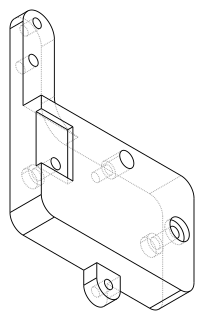

# Design: Arrma 223S Receiver/ESC Mount (BLX185 3S replacement plate)

<!-- Filename: 2026-08-31-arrma-223s-receiver-mount_design.md -->

## Meta
- **Requirements ref**: given inline by the Admin/user in this session (no separate `_req.md` was authored; requirements are restated in full below)
- **Requester role**: user (via Admin dispatch)
- **Date**: 2026-08-31
- **Dialog rounds**: 0 (single-pass Designer brief; no TL involved — this is a single-part CAD replacement, not architecturally significant)

---

## Objective

Reverse-engineer `tmp/BLX185_3s_ReceiverBox_Mount.stl` (an Arrma 223S-platform ESC/receiver-box mount plate) from mesh data alone, and specify a single new CadQuery model class that reproduces its main body, back recess, two M2.5-countersink ears, and 2-hole extension arm — with main-body thickness and ear/arm ("accessory") thickness as two independently overridable parameters, doubling the body while keeping the bottom mating face fixed at Z=0.

## STL-only reverse-engineering method (no STEP available)

`step_summary.py` / `face_catalog.py` / `hole_finder.py` / `face_distances.py` / `section_slicer.py` / `step_preview.py` all require an OCCT B-rep (analytic planes/cylinders) and do not accept a triangulated mesh — they were **not usable** for this task. Instead:

- Triangles were loaded with the project's existing pure-numpy loader, **`_tris_from_stl`** in `vibe_cading/tools/surface_diff.py`, imported directly (no new parsing code, no new pip dependency — `trimesh`/`numpy-stl` are unavailable and out of scope per the task brief).
- `numpy` (already a dependency) did all vector math: bounding box, per-triangle normal + area, least-squares (Kasa algebraic) circle fitting, and grid-based connected-component clustering (`scipy.ndimage.label`, already present in the environment).
- **`PIL`/Pillow** (already present) rasterized triangle wireframes/fills to PNG for direct visual inspection — this is what caught two mis-hypotheses below (see "Corrections during measurement").
- Two "which-face-is-which" questions were resolved by **direct cross-sectioning**: gathering all triangles whose Z-range straddles a probe height `z` and rendering only those edges, at multiple `z` (0.1, 1.0, 3.0, 5.0, 5.9). Comparing the outline at heights above vs. below a suspected recess depth is the STL-only equivalent of `section_slicer.py --report`.

**Probe scripts** (all under `tmp/`, cleaned up after use except one kept as reusable):
- `tmp/measure_receiver_mount.py` — bbox, Z-plane histogram, first-pass horizontal-face inventory. **Deleted** (superseded).
- `tmp/measure_receiver_mount2.py`, `tmp/measure_receiver_mount3.py` — circle fitting, wall-triangle Z-span classification, clean-cluster reports. **Deleted** (single-use, task-specific).
- Several `tmp/*.png` visual-inspection renders (top view, top/bottom face only, per-Z cross-sections, recess-only overlay). **Deleted** after transcribing findings into this brief.
- **Not proposing a new canonical tool.** The circle-fit / cross-section techniques used here are STL-specific and task-specific (this repo's primary reverse-engineering path is STEP-based); they don't generalize enough yet to earn a place in `vibe_cading/tools/` on a single use. If a second STL-only reverse-engineering task arises, promoting a `stl_summary.py`-style tool would be worth reconsidering then.

### Corrections during measurement (why this matters for reviewer trust)

Two working hypotheses were falsified by rendering actual mesh data rather than reasoning from bounding boxes alone (per the *Verification Samples Must Be Chosen By The Data* and *A Check That Cannot Fail Is Not A Check* project rules):

1. **First hypothesis:** the two circular through-holes embedded in the main body (not the ears) were themselves the "back recess." **Falsified** by rendering the Z=2 "floor" horizontal faces alone (`tmp/recess_only.png`): the LEFT hole has only a small standalone ~7 mm relief donut around it; the actual large rounded-rectangle recess sits only around the RIGHT hole.
2. **Second hypothesis:** a concave "notch" visible in a Z=1 cross-section was a permanent, full-thickness cutout in the main body's outer silhouette (independent of the recess). **Falsified** by comparing the outer X-extent in the same Y-band at Z=0.1/1.0 (X_max ≈ 201.4) vs. Z=3.0/5.0/5.9 (X_max ≈ 212.4, flush with the plate edge) — the "notch" only exists **below** the recess depth of 2 mm; above it the plate is a plain rectangle. The apparent notch **is** the recess, viewed from inside the cavity. This directly determines recess depth = 2.0 mm and confirms it does not reach through the plate.

3. **Third hypothesis (this pass, 2026-08-31 correction round) — falsified by the human reviewer, then re-derived from mesh boundary tracing:** the original pass fit a plain circle (Kasa algebraic fit) to the ear region's vertices and reported "OD = 9.00 mm" as if each ear were a free-standing circular boss. The human reviewer, looking at the actual reference, corrected this: *"The shape is wrong. The 'ring' technically is like an ear."* **Root cause: this is a textbook instance of "a check that cannot fail is not a check."** A least-squares circle fit against a non-circular outline does not raise an error or a large residual across the *whole* outline — it simply fits the sub-arc that happens to be circular (the tip) and silently ignores the two straight tangent walls that are also part of the same connected boundary, because those points were never included in the fit window in the first place. Nothing about "resid_std = 0.0007 mm, clean fit" as reported in the original pass was false — it was a correct, tight fit **to an incompletely-scoped point set**, which is indistinguishable from a correct fit to the true shape unless the fit is checked against a null hypothesis (does the *entire* candidate boundary, not just a hand-picked arc window, lie on one circle?).

   **Re-derivation method (this pass):** rather than fitting any preconceived shape, the mesh was sliced at Z=3.0 (mid-thickness, clear of both the recess and the debossed logo) and every triangle edge crossing that plane was chained tip-to-tail into an ordered, closed boundary polyline of the **entire outer silhouette** (`tmp/trace_boundary.py`, a self-contained rewrite of the slicing technique — `_tris_from_stl` in `vibe_cading/tools/surface_diff.py`, referenced in the original method write-up above, does not exist on this branch yet; it was added to `main` after this branch point, so a standalone binary/ASCII STL loader was written instead, `tmp/stl_load.py`). The whole part (main body + both ears + arm) traced as **one single connected 990-point loop** — direct confirmation that an ear is a *protrusion of the main outline*, not a separate ring/boss riveted on top. Isolating the loop segment local to one ear (by X-window, excluding the arm) and inspecting it point-by-point (not fitting anything yet) revealed, in order: a short flat run at constant Y (the body's own top edge), a run of *exactly constant X* (a straight vertical wall — unambiguous, no fitting needed, several mesh vertices land on the identical X value), then a curving run, then another constant-X run, then back to the flat body edge. Only *then* was a circle fit applied — to the curving run alone — which converged cleanly (r = 4.4947 mm / 4.4943 mm for the top/bottom ear, resid_std ≈ 0.005 mm, arc span ≈ 168–180°) precisely because that sub-run *is* genuinely circular; the two straight walls are not, and were fit as lines instead. See the corrected §3 below for the full construction.

   **Positive control that this new method isn't just as blind as the old one:** the corrected fit's arc spans only ~168–180° of a full circle (not 360°), and the tangent points where the fitted arc's angle crosses 0°/180° land within ~0.05 mm of where the mesh's straight-wall vertices actually sit (x = cx ± r) — i.e. the arc and the two lines close up geometrically into one consistent boundary with no gap and no overlap. A free-standing circular boss would show no straight tangent walls at all (the OD fit would span the full 360° with the same residual everywhere); a genuinely non-circular ear-shape hypothesis is falsifiable by exactly this width-of-fitted-arc-vs-360° check, which the original pass never ran.

4. **Fourth correction round (2026-09-01) — three more human corrections, all re-verified against the mesh rather than accepted or dismissed on say-so:**

   - **Arm tip (item 2):** the previous pass's "Tip cap radius: 5.00 mm at (205.428, −15.147)" turns out to have been a **partial** fit, not a wrong-but-complete one. Re-tracing the boundary loop (unwindowed, same `990`-point whole-part trace) through the tip region (loop indices 626–915) shows the true mesh tip is a **flat-topped double-fillet** shape: a short flat segment (X ∈ [205.161, 207.712], width ≈ 2.55 mm, at Y = −10.155 — three consecutive mesh vertices at the *identical* Y, not a fitting artifact) flanked by two quarter-circle fillets, each independently Kasa-fit: left fillet center (205.454, −15.172) r = 5.033 mm (resid_std 0.0072), right fillet center (207.446, −15.146) r = 4.998 mm (resid_std 0.0009). Both fillet centers sit ≈ 1 mm off the shaft centerline (STL X = 206.434) — i.e. **the mesh tip is not one semicircle at all**, and the previous pass's single R=5.00 fit had (unknowingly) locked onto only the right-hand fillet. Separately, the checked-out implementation (`ARM_TIP_R = 5.0`, a plain circle unioned onto the 12 mm-wide shaft) is smaller than half the shaft width (6.0 mm), which is the actual defect the human is flagging as "completely wrong . . . not flush" — the cap necks in from the shaft's full width rather than meeting it flush. Per the human's explicit, permitted simplification ("You can use a half circle, but the diameter should equal to the arm width"), the corrected design uses a **flush R = ARM_WIDTH / 2 = 6.0 mm** semicircle tangent to both shaft walls with no neck — a deliberate simplification of the mesh's more complex flat-topped-double-fillet feature, not a literal reproduction of it. See corrected §4 below.
   - **Arm root attachment (item 3):** re-traced the same whole-part boundary loop through the root region (indices 918→989→0→89, wrapping). The fillet is tangent to the **arm's own vertical wall** at STL (200.434, −34.155) (radius vector angle ≈ 0°) and tangent to the **plate's own flat top edge** (Y = −43.155) at STL (191.434, −43.155) (radius vector angle ≈ −90°) — a clean ~83–90° blend between those two tangent lines, Kasa-fit at center (191.395, −34.098), r = 9.049 mm (resid_std 0.0031, n=162). This **re-confirms the radius value** from the original pass (R≈9.06 at (191.389, −34.091) — within 0.011 mm) — the number was right. What was wrong is the *description*: after the fillet meets the flat plate edge, the boundary continues **flat for ≈2.7 mm** (STL X 191.43 → 188.66) before it ever reaches the ear's own separate stadium-lug outline (ear right wall at X = 188.705) — i.e. there is uncontested plain plate material between where the fillet ends and where the ear begins. The fillet attaches **only** to the plate edge; the ear is a geometrically separate, non-adjacent protrusion elsewhere on that same edge, confirming the human's correction. This is a **wording fix, not a numeric one** — see corrected §4 below.
   - **Plate holes (item 4):** re-measured both motor-mount holes with an r-vs-Z sweep (Kasa circle fit at each of ~15 Z stations per hole, using the loop-containing-window method rather than a single blind fit). **LEFT hole** (STL ≈(159.432, −61.205)): confirms the previous pass's approximate figures precisely — D = 7.000 mm OD relief (Z 0.1–1.9 and Z 4.5–5.9, resid_std ≤ 0.0023 mm) around a D = 3.000 mm through-bore (Z 2.1–3.9, resid_std ≤ 0.0023 mm), 2.0 mm deep on **both** faces — no longer "approximate," now precisely confirmed. **RIGHT hole**: the previous pass's "ambiguous, 5.7–6.6 mm, resid 0.8–1.2" fit was mis-probing the **open recess-cavity void** at Z < 2 as if it were a hole boundary (the RIGHT hole sits inside the back recess, so there genuinely is no material there below Z=2 — that is not the same thing as "no discernible hole shape"). Sweeping Z from 2.1 upward finds a clean **D = 3.000 mm through-bore** (Z 2.1–3.9, resid_std ≤ 0.001 mm) and a clean **D = 7.000 mm OD counterbore** on the top face only (Z 4.5–5.9, resid_std ≤ 0.0022 mm) — i.e. the RIGHT hole *does* have a recess, exactly matching the LEFT hole's dimensions, just on one face instead of two (its "missing" bottom-face recess is functionally superseded by the much larger back-recess pocket, which already clears that material). The refit also sharpens the RIGHT hole's center from the old approximate (203.3, −62.0) to a precise **(204.936, −61.205)** — notably the *same Y* as the LEFT hole, confirming these are a deliberate same-Y motor-mount pair, not independently-placed holes. **M3 pan-head comparison (both holes):** measured bore 3.000 mm vs M3 `clearance` = 3.2 mm (0.2 mm undersized — real, given resid_std ≤0.0023 mm); measured OD 7.000 mm vs M3 `pan_head_dia` = 5.6 mm (1.4 mm oversized — real); measured depth 2.0 mm vs M3 `pan_head_h` = 2.4 mm (0.4 mm shallower — real; a literal M3 pan head would sit ≈0.4 mm proud of a 2.0 mm-deep recess, not flush). **This is a genuine discrepancy, not measurement noise** — flagged as an open question below rather than silently resolved either way. See corrected §5 below.

---

## 1. Main body (measured)

| Quantity | Value | How measured |
|---|---|---|
| Footprint (excl. ears/arm) | 58.50 mm (X) × **46.00 mm (Y)** — **corrected, was 40.86 mm** | X ∈ [153.934, 212.434], **Y ∈ [−89.155, −43.155]** in STL coordinates — re-derived this pass from an ordered Z=3.0 boundary-polyline trace (`tmp/trace_boundary.py`); both Y bounds are exact, repeated flat values across many consecutive mesh vertices (not single-vertex samples) |
| Corner radius | **5.00 mm** (3 of 4 corners) | Re-fit this pass directly from the Z=3 boundary trace, Kasa circle fits (`resid_std` ≤ 0.0012 mm) at (158.903, −48.125), (207.453, −84.189), (158.901, −84.188) — matches the original pass's corner values almost exactly; only the flat-edge *footprint* bound was wrong, not these corners. The 4th (top-right) corner has no discrete radius — it blends into the arm-root fillet (see Arm, below) |
| **REF_THICKNESS** | **6.00 mm** | Bounding-box Z spans exactly 0.000 → 6.000 mm; confirmed by multiple clean full-depth (`zlo≈0, zhi≈6`) circle fits (ears, arm-tip cap) all showing walls present at z=0,2,4,6 — re-confirmed this pass (unaffected by the ear/footprint correction), see "Z-axis re-confirmation" note under §6 |

**Footprint correction note:** the original pass's Y ∈ [−87.439, −46.575] came from "flat-edge vertex extents outside the corner-fillet zone," but −46.575 is actually a vertex sampled partway **along** the top-left corner's R5 fillet arc (verified this pass: that exact point falls on the freshly-fit corner circle, not on the flat edge). The true flat top edge is at Y = −43.155 — and this value was *already* present, uncontradicted, in the original pass's own **Arm** section ("Shaft Y-extent (root transition → tip cap center): −43.155 to −15.04"), which nobody cross-checked against the Main Body table's competing −46.575 for the same physical edge. The two sections disagreed with each other in the original brief; §1 was the wrong one. Bottom edge is symmetric at Y = −89.155 (46.00 mm total span), confirmed via the same trace.

Corner-radius topology note for the Developer: the plain 3-corner R5 fillet is a simple 2D-sketch fillet; the 4th corner where the arm attaches is a compound blend (see Arm section) — do not force a uniform 4-corner fillet operation, model that corner as part of the arm-root transition instead.

## 2. Back recess (measured)

- **Which face:** the recess opens on the face at **Z=0** in the reference's own coordinate frame. Orientation determination (per the Designer's mandatory visual-grounding rule): Z=0 has no protruding features (bbox Z-min = 0.000 exactly, nothing sits proud of it) and is the more geometrically plausible flush-contact plane against a flat chassis rail; Z=6 (top) carries a **debossed Arrma "R" logo** (found via cross-section at Z=5.5, a local top face at Z=5 vs. the surrounding Z=6 — i.e. the logo is engraved 1 mm into the top face). Decorative branding is conventionally placed on the outward-facing/visible side of a mounting plate, not the chassis-contact side. **This is the one orientation call in this brief that rests on a domain convention rather than a hard visual reference (no photo of the genuine Arrma part was available) — flagged as an explicit open question for human confirmation below.**
- **Footprint:** rounded-rectangle, X ∈ [200.3, 212.434] (width ≈ **12.1 mm**), Y ∈ [−65.653, −47.648] (length ≈ **18.0 mm**) — **re-confirmed this pass** via a direct inventory of the flat, horizontal (constant-Z) triangles at Z≈2.003 (`tmp/` probe, this pass): 194 triangles, X ∈ [200.298, 212.434], Y ∈ [−65.653, −47.648] — an exact match to the original pass's footprint, unaffected by the ear/footprint correction. Flush with the main body's right edge (offset = 0 mm); **inset ≈4.49 mm from the body's (corrected) top edge** (−43.155 vs. −47.648 — corrected from the original pass's "≈1.07 mm," which used the erroneous −46.575 top-edge value; see §1 correction note); does not reach the bottom edge.
- **Depth:** **2.0 mm**, cut from Z=0 up to Z=2 (confirmed by the cross-section falsification test above, and re-confirmed this pass by the Z≈2.003 flat-face inventory).
- **Contains** the right-side motor-mount through-hole (see §5, reconciliation) — the recess and that hole are geometrically continuous but functionally distinct: the recess is bulk material relief, the hole is a fastener clearance.

## 3. Two side ears (measured — CORRECTED this pass, see "Corrections during measurement" §3 above)

**This section replaces the original pass's circular-boss description in full.** The human reviewer correctly identified that the "ring" is actually an **ear** — a non-circular mounting lug with a rounded tip and a straight-walled base blending directly into the main body's edge, not a free-standing disc. Both ears are protrusions of the main body's own outer silhouette (confirmed by the Z=3 whole-part boundary trace forming one single connected 990-point loop — see the correction note above), projecting from the body's short (Y) edges along the vertical centerline: the top ear from the (corrected) body top edge Y=−43.155 outward to a tip at Y≈−35.66, the bottom ear from the (corrected) body bottom edge Y=−89.155 outward to a tip at Y≈−96.66.

### Precise 2D construction (arc + line segments, sufficient for a CadQuery sketch)

Each ear is a **"stadium" / slot outline**: two parallel straight vertical walls, tangent at both ends to a single semicircular (180°) arc — i.e. exactly the shape you get by unioning a rectangle with a circle whose diameter equals the rectangle's width, centered on the rectangle's far short edge. It is **not** a full circle (an OD boss) and **not** a simple rounded-rectangle fillet (the walls are not tangent-blended into the body edge — they meet it at a sharp, unfilleted 90° reentrant corner at current mesh resolution, see note below).

| Quantity | Top ear | Bottom ear |
|---|---|---|
| Arc radius (semicircular cap) | **4.4947 mm** (Kasa fit on the curving sub-run only, resid_std=0.00477 mm, resid_max=0.00564 mm, n=46 pts, arc span ≈168°, mathematically closes to 180° at the wall tangent points) | **4.4943 mm** (resid_std=0.00481 mm, n=43 pts) — effectively identical to the top ear |
| Arc center (STL coords) | (184.2100, −40.1545) | (184.2100, −92.1560) |
| Straight wall X positions (= arc center X ∓ radius) | X = 179.715 (left) and X = 188.705 (right) | same X positions (179.715 / 188.705) |
| Straight wall Y-span | from the body top edge Y=−43.155 up to the arc-center Y=−40.1545 → **wall height = 3.000 mm** | from the body bottom edge Y=−89.155 down to the arc-center Y=−92.1560 → **wall height = 3.001 mm** |
| Tip Y (extreme point) | −35.660 (= arc center Y + radius) | −96.650 (= arc center Y − radius) |
| Overall protrusion beyond the body edge | 3.000 + 4.4947 ≈ **7.495 mm** | 3.001 + 4.4943 ≈ **7.495 mm** (identical) |
| Rectangle width (= 2 × radius) | 8.989 mm | 8.989 mm |
| Current hole diameter (reference; **irrelevant to new design**) | 2.80 mm (loop fit: center (184.1841, −40.4029), d=2.8010 mm, resid_std=0.0012) | 2.80 mm (center (184.1841, −91.9076), d=2.8010 mm) |
| Thickness | full 0→6 mm depth (clean fit, matches REF_THICKNESS) | full 0→6 mm depth (clean fit, matches REF_THICKNESS) |

**How to read the table into a sketch:** starting at the base (where the ear meets the body edge), the outline is: `line` from (arc_center_x − r, body_edge_y) straight to (arc_center_x − r, arc_center_y) [the left wall] → `radiusArc`/semicircle of radius r, centered at (arc_center_x, arc_center_y), sweeping 180° over the top to (arc_center_x + r, arc_center_y) → `line` straight down to (arc_center_x + r, body_edge_y) [the right wall] → close via the body's own top-edge polyline back to the start. Equivalently and more simply for CadQuery: build a rectangle (width = 2r, height = wall_height) whose far short edge sits exactly on the arc center's Y, and `.union()` it with a circle of radius r centered on that same point — the circle's lower half is redundant with the rectangle (harmless for a union) and its upper half is exactly the semicircular cap. This is an implementation hint, not a code-structure mandate — the Developer decides the actual construction.

**Reentrant-corner note:** at current mesh resolution (~1.4–1.8 mm vertex spacing near this feature), the two points where each straight wall meets the body's flat top/bottom edge show a sharp 90° knee with no intervening curved vertices — i.e. no discernible fillet at these two reentrant (concave) corners. Model as sharp corners; flag for a future finer-resolution or physical-part re-check if a small fillet turns out to matter for print stress concentration (a very minor 3D-print detail, not a functional dimension).

**Ear-center X offset (unchanged from original pass, still correct):** both arc centers sit at STL X=184.210, which is +1.026 mm from the main body's own centerline X=183.184 (= midpoint of [153.934, 212.434]) — asymmetric, but consistent top-to-bottom, so treat as a deliberate design offset rather than noise.

Both ear OD-arc and (old) hole centers coincide within ≈0.25 mm — within STL tessellation noise; the new model concentric-hole placement should use the **arc center**, not the old hole's slightly-offset center, since the arc center is the more precisely-determined and more natural placement datum. Ear thickness **matches REF_THICKNESS exactly** (no divergence to report).

**New hardware — CORRECTED this round (2026-09-01), pan head not flat head:** the human corrected the ear fastener from a flat-head (countersink) to a **pan-head** clearance hole. Use **M2.5 pan-head** per `docs/screws.md` / `vibe_cading/mechanical/screws/metric.py::METRIC_SIZES["M2.5"]` (`clearance`=2.7 mm, `pan_head_dia`=5.0 mm, `pan_head_h`=2.1 mm). Call `MetricMachineScrew.from_size("M2.5", length=<accessory_thickness>, head_type="pan").to_cutter(profile=..., fit="clearance")` — `MetricMachineScrew.to_cutter()` already builds a cylindrical counterbore recess for `head_type="pan"` (unlike `"flat"`, which builds a countersink cone), so this is a one-line `head_type` swap at the call site, no new geometry construction. This is a **hardware-choice correction, not a shape correction** — the ear's own stadium-lug outline (§3 above, corrected the prior round) is unaffected; only the cutter's `head_type` argument changes. The ear's minimum material width (8.989 mm rectangle width) leaves (8.989−5.0)/2 = 1.995 mm annular wall around the pan-head recess at the narrowest point (through the straight walls, slightly less than the old flat-head figure's 2.14 mm since the pan head is 0.3 mm wider, but still comfortably positive); the semicircular cap has more clearance everywhere else. 2.1 mm head-recess depth fits inside a 6 mm (or thicker) accessory wall.

## 4. Extended arm (measured — tip and root CORRECTED this round, 2026-09-01)

The arm extends from the main body's top-right area (root near X≈200, Y≈−47) further in +Y (away from the body) to a tip near Y≈−15 (previously described as reaching Y≈−11 — the flat-topped double-fillet's apex plateau; the corrected flush semicircle's own apex sits further out still, at Y≈−9.2, see below).

| Quantity | Value |
|---|---|
| Shaft width | 12.0 mm (X 200.434–212.434) — unchanged |
| Shaft Y-extent (root tangent → tip-cap center) | STL −34.155 → −15.159 (≈19.0 mm straight shaft); root tangent re-confirmed this round at STL (200.434, −34.155) | 
| **Tip cap radius — CORRECTED this round** | **6.00 mm** (= `ARM_WIDTH / 2`, flush semicircle) — was wrongly 5.00 mm. The old value was a single circle fit that (unknowingly) captured only one of two ≈R4.998–5.033 mm quarter-circle fillets flanking a 2.55 mm flat plateau at the mesh tip's actual apex (STL Y=−10.155) — the mesh tip is genuinely a flat-topped double-fillet, not one semicircle. Per the human's explicit, permitted correction ("You can use a half circle, but the diameter should equal to the arm width"), the corrected design **simplifies** to one flush R=6.0 mm semicircle tangent to both shaft walls with **no neck** — this is a deliberate design simplification of the mesh's more complex tip feature, not a literal reproduction of it. See "Corrections during measurement" §4 above for the full re-derivation. |
| **Tip cap center Y** | STL **−15.159** (local **28.0** mm, refined from the two independently-fit fillet centers' average, (−15.146 + −15.172)/2; previously 28.115) — this is where the shaft's straight walls end and curvature begins, i.e. the flush semicircle's tangent-point row. Apex reaches STL Y ≈ −9.159 (local ≈ 34.0 mm), ≈0.9 mm further out than the old under-sized R=5.0 cap (old apex local 33.115). |
| **Root-to-plate fillet — WORDING corrected this round, radius re-confirmed unchanged** | R = **9.05 mm** (re-fit this round at center (191.395, −34.098), resid_std=0.0031, n=162 — matches the original pass's R≈9.06 at (191.389,−34.091) within 0.011 mm: **the number was already right**). What was wrong is the description: this fillet is tangent to the **arm's own vertical wall** at STL (200.434, −34.155) on one end and tangent to the **main body's own flat top edge** (Y=−43.155) at STL (191.434, −43.155) on the other — a ~83–90° blend between those two tangent lines. **It does not touch or blend with the ear**: after the fillet meets the flat plate edge, the boundary runs flat for ≈2.7 mm (STL X 191.43→188.66) before reaching the ear's own separate stadium-lug outline at X=188.705. Rename this feature **"arm-root-to-plate fillet"** (was "top-ear/main-body edge sweep") — model as a tangent blend from the arm wall to the plate's own top-edge sketch line, independent of the ear's own geometry. |
| Thickness | full 0→6 mm depth (clean fit at both the root fillet and tip cap) — **matches REF_THICKNESS**, no divergence; unaffected by this round's correction |
| **Hole 1** (near root) | D = **3.202 mm**, center (208.443, −26.157) — resid_std=0.0006, high confidence — unaffected by this round's correction |
| **Hole 2** (tip) | D = **2.801 mm**, center (207.049, −13.153) — resid_std=0.0004, high confidence — unaffected by this round's correction |

Both arm holes are plain through-holes (no evidence of a stepped/countersunk profile at either — the r-vs-z sweep at each shows a single constant radius across the full 0→6 mm depth, unlike the two motor-mount holes in §5). Per the task's explicit instruction, these stay **plain through-holes** — no fastener-standard substitution. Neither arm-hole measurement is touched by this round's tip/root correction (both are far enough from the tip and root regions that the corrected boundary re-trace doesn't affect them); re-stated here unchanged for completeness.

**Parametric note for the Developer:** derive `ARM_TIP_R` as `ARM_WIDTH / 2.0` in code (not a separate hardcoded constant) — this makes the "flush, no neck" invariant self-enforcing for any future `ARM_WIDTH` override, consistent with the project's no-magic-numbers convention, and it is exactly why the old `ARM_TIP_R = 5.0` (a free-floating literal, decoupled from `ARM_WIDTH = 12.0`) was able to drift out of flush in the first place.

## 5. Feature reconciliation checklist

| Feature | Status | Model element |
|---|---|---|
| Main body (rounded-rect, 3× R5 corners, **58.5×46.0 mm — corrected footprint**) | ✓ modelled | body sketch + fillet |
| REF_THICKNESS = 6.0 mm | ✓ modelled | `accessory_thickness` default |
| Back recess (12.1×18.0×2.0 mm pocket, right side) | ✓ modelled | pocket cutter on bottom face |
| Top ear (**stadium lug: 8.989 mm wide × 3.0 mm wall + R4.4947 semicircular cap — corrected shape, was wrongly "OD 9.0 circular boss"**, **M2.5 pan-head clearance — corrected this round, was wrongly flat-head**) | ✓ modelled (pending re-implementation, see Implementation Status) | ear rectangle+semicircle union + `MetricMachineScrew.to_cutter(head_type="pan")` |
| Bottom ear (same corrected stadium-lug shape, **M2.5 pan-head clearance — corrected this round**) | ✓ modelled (pending re-implementation, see Implementation Status) | ear rectangle+semicircle union + `MetricMachineScrew.to_cutter(head_type="pan")` |
| Arm (12.0 mm wide, **R6.0 flush tip cap — corrected this round, was wrongly R5.0**, **R9.05 root-to-plate fillet — value re-confirmed, description corrected this round**) | ✓ modelled (pending re-implementation, see Implementation Status) | arm sketch + flush tip-cap union + arm-root-to-plate blend |
| Arm hole 1 (D=3.202) | ✓ modelled | plain cylinder cutter |
| Arm hole 2 (D=2.801) | ✓ modelled | plain cylinder cutter |
| **LEFT motor-mount hole** — M3 pan-head-style clearance hole: **D=7.000 mm OD relief (2.0 mm deep, both faces — re-confirmed precisely this round, resid_std ≤0.0023 mm)** around a **D=3.000 mm through-bore (re-confirmed precisely, resid_std ≤0.0023 mm)**, at STL (159.432, −61.205) | ✓ **modelled (human resolved: keep faithfully); M3-standard-vs-mesh discrepancy flagged, see Open Question 3** | double-counterbore cutter, symmetric top+bottom |
| **RIGHT motor-mount hole** — **CORRECTED this round: sits inside the back recess but DOES carry its own recess**, on the **top face only**: D=7.000 mm OD counterbore (Z 4.5–5.9, resid_std ≤0.0022 mm) around the same D=3.000 mm through-bore (Z 2.1–3.9, resid_std ≤0.001 mm) as the LEFT hole — no bottom-face counterbore needed since the much larger back-recess pocket (§2) already clears that material down to Z=2. Center refined to STL **(204.936, −61.205)** (was the approximate (203.3, −62.0)) — notably the **same Y** as the LEFT hole, confirming a deliberate same-Y motor-mount pair. | ✓ **modelled (human resolved: keep faithfully); M3-standard-vs-mesh discrepancy flagged, see Open Question 3** | top-face counterbore + through-bore cutter (no bottom counterbore) |
| Arrma "R" logo, debossed 1 mm into the top (Z=6) face | ✗ **decorative, NOT requested** — out of scope | omit, or replace with project/user's own branding if desired |
| 4th (top-right) corner — no discrete R5 fillet; blends via the R9.05 arm-root-to-plate fillet | ✓ accounted for (see Main Body note) | part of arm-root sketch, not a separate fillet op |

**Open question 1 (orientation) — RESOLVED by human 2026-08-31:** Confirmed. Z=0 (flat, unadorned face) is the chassis-mating/mounting face; Z=6 (debossed Arrma "R" logo) is the outward-facing side. The Z=0 datum convention in §6 stands as written.

**Open question 2 (two un-requested motor-mount holes) — RESOLVED by human 2026-08-31: option (a), keep faithfully. RE-MEASURED and RESOLVED further this round (2026-09-01), see Open Question 3 below for the remaining M3-standard-vs-mesh question.** Both holes are unconditional geometry, not a parameter (the `include_motor_mount_holes` toggle proposed earlier is removed):
  - **LEFT hole** — D=3.000 mm through-bore with a D=7.000 mm OD relief counterbore, 2.0 mm deep, symmetric on **both** faces, at STL (159.432, −61.205). No longer "approximate" — precisely confirmed this round (resid_std ≤0.0023 mm across all Z stations).
  - **RIGHT hole** — **no longer ambiguous.** The previous "5.7–6.6 mm, resid 0.8–1.2" fit was mis-probing the open recess-cavity void (Z<2, where the hole sits inside the larger back-recess pocket and there simply is no material to fit a circle to) as though it were a hole boundary — a mis-scoped measurement window, not a genuine mesh ambiguity. Sweeping Z from 2.1 upward finds the **same D=3.000 mm through-bore** as the LEFT hole, plus a **D=7.000 mm OD counterbore on the top face only** (Z 4.5–5.9) — the bottom-face counterbore is functionally superseded by the back-recess pocket, which already removes that material over a larger footprint. Center refined to STL (204.936, −61.205).

**Open question 3 (NEW this round, 2026-09-01) — RESOLVED by human 2026-09-01: hybrid.** Front (top, Z=body_thickness) side uses the **standard M3 pan-head cutter** — `MetricMachineScrew.from_size("M3", length=body_thickness, head_type="pan").to_cutter(profile=self._profile, fit="clearance")` (bore=3.2 mm clearance, recess OD=5.6 mm, recess depth=2.4 mm) — this is the face the actual pan-head screw seats against, so it must fit real M3 hardware. The **back (bottom, Z=0) relief on the LEFT hole** keeps the **as-measured mesh dimensions** (D=7.000 mm OD, 2.0 mm deep) rather than the M3 standard — it is not a fastener-seating recess, just a material-relief pocket faithful to the reference part, so mesh fidelity governs there instead of hardware-fit. Concretely:
  - **LEFT hole** — M3 clearance bore (3.2 mm) full depth; **top-face recess** = standard M3 pan-head cutter (5.6 mm OD × 2.4 mm deep); **bottom-face recess** = as-measured mesh relief (7.0 mm OD × 2.0 mm deep, plain cylindrical pocket, not a screw cutter).
  - **RIGHT hole** — M3 clearance bore (3.2 mm) full depth; **top-face recess** = standard M3 pan-head cutter (5.6 mm OD × 2.4 mm deep); **no bottom-face recess** (unchanged from the earlier finding — already cleared by the back-recess pocket, §2).
  - Implementation note: the top-face recess and through-bore both come from one `MetricMachineScrew(...).to_cutter()` call; the LEFT hole's bottom-face relief is a separate plain cylindrical pocket cut additionally from the Z=0 face, sized to the mesh measurement, not derived from `MetricMachineScrew`.

## 6. Coordinate system for the new model

- **Z=0** — shared mating/resting face for the *entire* part (main body, both ears, and the arm all anchor here), per the reference's own Z=0 and the project's Absolute Zero-Datum Consistency convention. All positive thickness parameters extrude in **+Z only** — this is what keeps the bottom face fixed when `body_thickness` grows.

  **Z-axis re-confirmation (this pass):** the human's ear-shape correction only touches the XY plane, so the Z findings were not re-derived from scratch — but per the task directive they were spot-re-checked rather than carried forward uncritically. Re-confirmed this pass: (a) REF_THICKNESS=6.0 mm — the full-extent flat triangle inventory shows 955 triangles at Z=0.000 and 1075 at Z=6.000 (more at Z=6 due to the debossed logo) spanning the complete part footprint, unchanged from the original pass; (b) recess depth=2.0 mm — the Z≈2.003 flat-face inventory (194 triangles) exactly reproduces the original pass's recess footprint (X∈[200.298,212.434], Y∈[−65.653,−47.648]); (c) Z=0 as the mating datum — bbox Z-min is still exactly 0.000 with no protruding features, unchanged. All three hold; no Z-axis correction needed.
- **Local X=0** — main body horizontal centerline (STL X ≈ 183.184). Unaffected by this pass's correction (the ear-shape fix is purely a Y-axis / outline-shape correction; ear-center X=184.210, offset +1.026 from centerline, is unchanged from the original pass and was independently re-confirmed this pass via the fresh arc fits in §3).
- **Local Y=0** — main body's "top" edge, **corrected this pass to STL Y = −43.155** (was wrongly −46.575 in the original pass — see the §1 correction note; that value was a vertex sampled along the top-left corner's fillet arc, not the flat edge itself). The main body then spans Y ∈ **[−46.00, 0]** (corrected from [−40.86, 0]); the top ear projects into Y > 0, reaching its tip at local Y ≈ **+7.495**; the bottom ear projects further past Y = −46.00, reaching its tip at local Y ≈ **−53.495**.

(This reuses the reference's own frame with only a translation — no axis flip was needed since Z=0 in the STL is already the intended new-model datum.)

## 7. Visual contract



**Regenerated again this round (2026-09-01, arm tip/root correction round)** from a fresh `tmp/visualise_arm_root_fix.py` cq-primitives probe — the real, currently-implemented `ArrmaReceiverMount` class still has the **old, wrong** `ARM_TIP_R=5.0` necked-in tip cap and the old root-blend description (re-implementation is the Developer's explicit follow-up, not part of this correction pass), so this SVG was again built directly from primitives per path (b) of the Visual Contract rule (same convention as the prior ear-shape correction round), then copied over the committed `visual_contracts/2026-08-31-arrma-223s-receiver-mount_design_iso_ne.svg`. The render's load-bearing content this round is the **flush R=6.0 mm tip cap** (tangent to both shaft walls, no neck — visibly wider/flatter than the old necked-in R=5.0 cap) and the **root fillet tangent to the plate edge** (not routed through the ear stub). The ear itself is rendered as an illustrative circular stub in this probe (not the real stadium-lug outline) since the ear shape is unaffected by this round's correction and is not the feature under test here; the main body and its footprint are unchanged from the prior round.

**Staleness is intentionally re-opened this round** (mirrors the exact pattern documented in the prior correction round, quoted below): `visual_contracts.toml` registers this SVG's freshness against the *implemented* `ArrmaReceiverMount` class. Until that class is re-implemented with `ARM_TIP_R = ARM_WIDTH / 2.0` and the corrected root-fillet construction, `check_visual_contract_freshness.py` will correctly report this contract as stale again. This is not a silent gap — it is the expected, intentional state of a design correction that precedes its own re-implementation, exactly as it was for the ear-shape correction the prior round (quoted for the historical record):

> *Prior-round note (ear-shape correction, now resolved and superseded by this round's fresh staleness):* the committed SVG had been regenerated from the real, re-implemented `ArrmaReceiverMount` class via `preview.py --views iso_ne` and byte-matched what `check_visual_contract_freshness.py` recomputed (21/21 fresh, 0 drifted) — until this round's arm tip/root findings reopened it. `visual_contracts.toml` registers this SVG's freshness against the *implemented* class; until re-implemented, the freshness check will correctly report this contract as stale.

The original pass's note about the `body_thickness` vs `accessory_thickness` stepped-shelf visual consequence (independent thickness knobs, both anchored at Z=0) held through the arm tip/root correction round, but is **superseded by §8 below** (2026-09-01 resize round) — the accessory layer no longer shares the Z=0 datum with the body at all; see §8's Z-stacking contract for the current (and final) description of the visual consequence.

**Regenerated again this round (2026-09-01, user-specified resize — §8)** directly from the real, re-implemented `ArrmaReceiverMount` class via `preview.py --views iso_ne`, and copied over the committed `visual_contracts/2026-08-31-arrma-223s-receiver-mount_design_iso_ne.svg`. `check_visual_contract_freshness.py` reports **21/21 fresh, 0 drifted** — this contract is fresh as of this round, no other contract's committed bytes were touched, and `visual_contracts.toml`'s doc comment was updated to reflect the new defaults (`body_thickness=6.0`, `accessory_thickness=4.0`, `material="petg"`).

---

## 8. User-specified resize (2026-09-01) — supersedes reference dimensions where they conflict

The user found the physical reference part (`tmp/BLX185_3s_ReceiverBox_Mount.stl`) is the wrong SIZE for their vehicle. This round's five changes are **user-specified dimensions, not re-measurements of the STL** — where they conflict with §1–§7 above, this section wins. Orientation vocabulary used below: **north** = +Y (the side the arm projects from; local Y=0 is the plate's north edge), **up** = +Z (outward/logo side); Z=0 remains the chassis-mating datum.

| # | Change | Old | New |
|---|---|---|---|
| 1 | Plate width (north-south, `BODY_LENGTH`) | 46.00 mm, plate spans Y ∈ [−46, 0] | **38.00 mm**, plate spans Y ∈ [−38, 0]. North edge still pinned at Y=0. East-west width (58.5 mm) and corner fillets unchanged. |
| 2 | North ear | stadium-lug ear projecting north of Y=0, M2.5 pan-head recess | **removed entirely.** Its fastener becomes `HOLE1_CENTER` = (1.026, −5.0), a hole in the plate body itself — **M2.5 flat-head countersink**, cone opening on the **bottom** (Z=0) face and narrowing going **up** (+Z). Screw inserted from below, head flush in the bottom face. |
| 3 | South ear hole | pan-head recess, center on the arc | **plain M2.5 clearance through-hole — no countersink/counterbore/recess.** Center (`SOUTH_EAR_HOLE_Y`) moved to exactly 38.00 mm from `HOLE1_CENTER` → local (1.026, −43.0). Stadium-lug outline (arc R≈4.4943, width≈8.989) unchanged. |
| 4 | Arm XY outline | — | **unchanged** (12 mm wide shaft, R6.0 flush tip, R9.06 root-to-plate fillet). |
| 5 | Z-stacking | `body_thickness`/`accessory_thickness` both anchor at Z=0 (shared datum) | ~~`body_thickness = 6.0` (plate, Z ∈ [0, 6]); `accessory_thickness = 4.0` (arm + south ear, now Z ∈ [6, 10]) — the accessory layer **stacks on top of the plate** instead of sharing its Z=0 datum.~~ **SUPERSEDED — see §9 below, this was a mis-specification, corrected 2026-09-01.** |

### Z-stacking contract — SUPERSEDED, see §9

> The subsection originally here (describing `body_thickness`/`accessory_thickness` as two independent parameters, the arm/south-ear "stacking on top" of a thinner plate, and the resulting `ARM_PLATE_OVERLAP`/`EAR_PLATE_OVERLAP` bonding-area constants) was a **mis-specification by the orchestrator, not a user request** — see §9 for the correction and the final, correct contract. Left struck through above rather than deleted, per the project convention of preserving correction history rather than silently rewriting it.

### Print-support implication — REVISED, see §9

> Superseded — the arm and south ear are no longer cantilevered over open air across their whole span; see §9's revised print-support note.

### Reconciliation checklist (this round)

| Feature | Status | Model element |
|---|---|---|
| Plate width 38.00 mm, north edge pinned at Y=0 | ✓ modelled | `BODY_LENGTH = 38.00` |
| North ear removed | ✓ modelled | no `_north_ear()` — deleted from `_build()` |
| Hole 1 — M2.5 flat-head countersink in plate body, opens bottom/narrows up | ✓ modelled, verified by section-slice (see Implementation Status) | `_hole1_countersink_cutter()` |
| South ear hole — plain M2.5 clearance, no recess, 38.0 mm from hole 1 | ✓ modelled, verified by section-slice | `_south_ear_clearance_cutter()` |
| Arm XY outline unchanged | ✓ unchanged | `_arm()` (unchanged shaft/tip/root-fillet construction) |
| Z-stacking: plate 0→6, accessories 6→10 | **SUPERSEDED — see §9** | see §9 |
| Arm/ear bonding overlap onto plate top face | **SUPERSEDED — see §9** | see §9 |
| Back recess / both motor-mount holes XY unchanged, re-verified against thinner (6 mm) plate | ✓ verified at the time; **plate is no longer 6 mm — re-verified against the full 10 mm plate in §9** | unchanged `_back_recess_cutter()`, `_motor_mount_cutter()`, `_motor_left_bottom_relief_cutter()` |

---

## 9. Thickness-contract correction (2026-09-01) — supersedes §8 item 5 and the Z-stacking contract above

**This section corrects a mis-specification by the orchestrator, not a further user request.** §8 item 5 and its "Z-stacking contract" subsection above described the accessory layer (arm + south ear) as **stacking on top of** a separate, thinner (6 mm) plate — a perched layer cantilevered over open air, requiring large `ARM_PLATE_OVERLAP`/`EAR_PLATE_OVERLAP` XY extensions (9.0 mm / 5.0 mm) just to give the union a real bonding area. The user's actual intent, stated directly: *"The accessory thickness should also be added on top of the body (body thickness = base thickness + accessory thickness). For the base body 6mm + 4mm accessory, I expected the body to be 10mm thick, accessories to be 4mm thick."*

**Corrected contract:**
- Two independent constructor parameters: `base_thickness` (default 6.0 mm) and `accessory_thickness` (default 4.0 mm).
- `body_thickness` — the plate's own full thickness — is now a **derived, read-only property** = `base_thickness + accessory_thickness` (10.0 mm at defaults). It is **no longer a constructor parameter.**
- The plate slab (`_main_body`) extrudes the full `body_thickness` from Z=0 (was: `base_thickness` alone under the wrong contract, i.e. it was only 6 mm — this is the one thing that actually changes size).
- The arm and south ear extrude `accessory_thickness` starting at Z=`base_thickness` (Z ∈ [6, 10] at defaults) — unchanged Z-range from the wrong contract, but now that band is the plate's own top band (flush with its top face), not a separate perched shelf over a shorter plate.
- Overall part envelope (Z ∈ [0, 10] at defaults) is unchanged. Only the plate's own thickness moved, from 6 mm to the full 10 mm.

**Bonding-overlap consequence:** because the plate is now full-height, the arm and south ear butt against its real vertical side wall over a genuine 2D area (accessory width × `accessory_thickness`) wherever they meet it — the large `ARM_PLATE_OVERLAP`/`EAR_PLATE_OVERLAP` XY-footprint extensions are no longer needed for bonding and have been removed. They are replaced by `ARM_UNION_OVERLAP_EPS` / `EAR_UNION_OVERLAP_EPS` = 0.02 mm — a small boolean-robustness margin only, matching the project's existing convention for a flush union join at a coincident face (see `vibe_cading/rc/hex_hub_bearing/hex_hub_with_bearing.py` and `vibe_cading/lego_adapters/axle_hex_hub/axle_hex_hub_adapter.py`, both documenting the identical "not a fit-grade tolerance, just an OCCT coincident-face reliability margin" rationale).

**Print-support implication (revised):** the arm and south ear are no longer cantilevered over open air across their whole span — where they meet the plate, they now rest on solid plate material directly below them. Only the portions extending beyond the plate's own XY footprint (most of the arm's shaft/tip, the south ear's semicircular cap) remain unsupported tabs; those specific overhangs will still want print support in the native orientation, but the blanket "overhangs open air" statement from §8 no longer applies to the whole accessory layer.

### Re-verification against the now-full-height (10 mm) plate

- Single-solid assertion holds; bbox Z = [0.0000, 10.0000] exactly at defaults.
- Section-sliced the exported STEP at Z=0.5/3.0/5.0/5.9 (within the plate's own base band): only plate features present (rounded-rect outline, corner-fillet arcs, both motor-mount bores, hole 1's countersink) — confirms the plate is solid rectangular material through its full base band, not just a thin 6 mm slab with a gap above it.
- At Z=6.0 (the base/accessory interface) both the plate's own features and the accessory features (arm root-fillet R9.06 arc, arm holes, south-ear stadium outline) appear together in the same slice; from Z=6.1 upward only the accessory features remain — confirms the accessory band sits flush on top of the full-height plate, not floating.
- **Hole 1 countersink** re-checked at Z=0.1/0.5/1.0/2.0: Ø5.100 → Ø4.600 → Ø3.600 → constant Ø3.100 from Z≈2.0 upward — still a monotonically narrowing cone opening on the bottom (Z=0) face, and the bore still reaches all the way to Z≈9.5 (checked directly) — the cutter clears the full 10 mm plate, not just the old 6 mm.
- **South ear hole** re-checked at Z=6.1/7.0/9.5: constant Ø3.100 mm at every station — still a plain bore, no recess.
- **Hole-1-to-south-ear-hole spacing:** asserted programmatically, exactly 38.0000 mm.
- **LEFT motor-mount hole web thickness — the specific structural concern flagged in §8's Implementation Status — re-measured (not re-derived arithmetically) by section-slicing:** the bottom-face relief pocket (Ø7.4 mm incl. allowance) holds constant through Z=1.9–1.95, then narrows to the Ø3.6 mm bore exactly at Z=2.0. The top-face pan-head recess (Ø6.0 mm incl. allowance) is **absent** through Z=7.20/7.30/7.34 and **present** starting exactly at Z=7.35 (confirmed at 7.35/7.36/7.40/7.50). Measured web = 7.35 − 2.0 = **5.35 mm** — consistent with the arithmetic prediction (`body_thickness − profile.free.axial − pan_head_h − relief_depth` = 10 − 0.25 − 2.4 − 2.0 = 5.35), but this is a direct section-slice measurement against the built STEP, not just the arithmetic restated.

---

## Architecture / Approach

### Approach chosen

One new class, `ArrmaReceiverMount` (or similar — Developer's call on exact naming/module path per project convention, likely under `vibe_cading/lego_adapters/rc/` or `vibe_cading/rc/` alongside existing RC-adapter parts; check existing `vibe_cading/rc/` structure for the closest sibling).

Proposed constructor signature:

```python
class ArrmaReceiverMount:
    """ESC/receiver-box mount plate for the Arrma 223S platform, replacing
    the stock BLX185 3S motor plate. (0,0,0) is the shared mating face that
    contacts the chassis rail — the main body, both M2.5 ears, and the
    extension arm all anchor their bottom face here; every thickness
    parameter extrudes in +Z only.
    """
    def __init__(
        self,
        body_thickness: float = 12.0,       # 2 * REF_THICKNESS (6.0) -- doubled per requirement
        accessory_thickness: float = 6.0,   # REF_THICKNESS -- ears + arm, independent of body_thickness
        material: str = "PLA",              # resolves a ToleranceProfile via print_settings.get_profile
    ) -> None:
        ...

    @property
    def solid(self) -> cq.Workplane: ...
```

`body_thickness` and `accessory_thickness` are architecturally independent floats (not one derived from the other) per the explicit requirement — the 2× relationship is only the *default*, not an enforced ratio. Both pre-existing motor-mount holes (§5, Open Question 2 — resolved "keep faithfully") are now unconditional geometry in the main body, cut through the full `body_thickness` span from Z=0.

**Re-implementation note (correction pass, 2026-08-31):** the constructor signature above is unaffected by the ear-shape correction — only the internal geometry that builds each ear changes (corrected §3: a rectangle+semicircle stadium-lug union in place of the old plain circular boss), plus the corrected main-body footprint (58.5×46.00 mm) and recess inset. No new constructor parameters are needed for the corrected shape.

### Alternatives rejected

- **Deriving `body_thickness` as `2 * accessory_thickness` internally** (single knob) — rejected: the task explicitly requires two *independent* overridable parameters, not a locked ratio, even though the reference and defaults happen to use a 2:1 relationship today.
- **Centering `accessory_thickness` within `body_thickness` (mid-plane alignment)** instead of anchoring both at Z=0 — rejected: the explicit requirement is "material is added only on the opposite (top) side" of the fixed bottom mating face; centering the accessories would silently move their own bottom face off Z=0 whenever `body_thickness ≠ accessory_thickness`, which contradicts "keep the bottom reclining areas the same" as the shared invariant across every feature, not just the main body slab.
- **Modelling the two motor-mount holes now with a guessed geometry** — rejected: Open Question 2 has three materially different resolutions (faithful stepped bore, omit, simplified plain hole) and the RIGHT hole's true diameter is not reliably measurable from this mesh; guessing would fabricate a dimension the task instructions explicitly forbid ("do not invent dimensions" / Experimental Integrity rule).

## Data & Interface Contracts

Not applicable — no new shared abstraction, `Protocol`/`ABC`, or cross-cutting interface is introduced. `ArrmaReceiverMount` follows the existing project convention: `.solid` property, constructor accepts `material` and resolves a `ToleranceProfile` via `get_profile()`, ear cutters go through the existing `MetricMachineScrew.to_cutter()` contract.

## Implementation Plan

- [x] **T1 — RE-IMPLEMENTED (correction pass, 2026-08-31)** — Main body rounded-rect sketch now uses **58.5×46.00 mm** (`BODY_WIDTH`/`BODY_LENGTH` in `vibe_cading/rc/arrma_223s_receiver_mount.py`), R5 on 3 corners, extruded `body_thickness` in +Z from Z=0.
- [x] **T2 — RE-IMPLEMENTED** — Back recess unchanged in footprint/depth (12.1×18.0×2.0 mm), `RECESS_TOP_INSET` corrected to **4.493 mm** from the (corrected) top edge.
- [x] **T3 — RE-IMPLEMENTED** — Both ears rebuilt per the **corrected §3 stadium-lug construction**: `_ear()` now builds a rectangle (width = 2×radius, height = `EAR_WALL_HEIGHT` = 3.000 mm) unioned with a tangent circle (`EAR_TOP_ARC_R` = 4.4947 mm / `EAR_BOTTOM_ARC_R` = 4.4943 mm) centered on the rectangle's far short edge — replaces the old circular-boss + web construction entirely. `EAR_CENTER_X` = 1.026 mm offset from the X centerline is now modelled (the old implementation had wrongly used 0.0).
- [x] **T4 — RE-IMPLEMENTED** — M2.5 flat-head countersink cutters now center on each ear's arc center (`EAR_TOP_ARC_CENTER_Y` / `EAR_BOTTOM_ARC_CENTER_Y`), via `MetricMachineScrew.from_size("M2.5", length=accessory_thickness, head_type="flat").to_cutter(profile=self._profile, fit="clearance")` — construction unchanged, only the placement datum moved from the old boss center to the new stadium-lug arc center.
- [x] **T5** — Build the arm: 12.0 mm wide shaft + R5 tip cap + R9.06 root blend into the top-right main-body corner, `accessory_thickness` tall from Z=0. Arm's local X placement (unaffected by this pass) unchanged; the arm's local Y positions (`ARM_TIP_CENTER_Y`, arm hole centers) **re-derived this pass** against the corrected Y=0 datum (see T6 note) — the collar's touching X-coordinate against the ear also moved from the old ear boss edge to the new stadium-lug's `EAR_RIGHT_EDGE_X`.
- [x] **T6 — Y-coordinates re-derived (correction pass, 2026-08-31)** — Cut the two arm through-holes (D=3.202 at root, D=2.801 at tip) as plain cylinders; centers recomputed directly from the STL frame against the corrected Y=0 datum: `ARM_HOLE1_CENTER=(25.259, 16.998)`, `ARM_HOLE2_CENTER=(23.865, 30.002)` (previously `(25.259, 20.418)` / `(23.865, 33.422)` under the wrong datum).
- [x] **T7 — Y-coordinates re-derived** — Cut both motor-mount holes into the main body: LEFT as a symmetric double-counterbore (≈7.0 mm OD relief, 2.0 mm deep, both faces, ≈3.0 mm through-bore) now at corrected local `(-23.752, -18.05)`; RIGHT as a plain ≈6.0 mm through-hole now at corrected local `(20.116, -18.845)` — both unconditional, full `body_thickness` span from Z=0. (Previously `(-23.752, -14.63)` / `(20.116, -15.425)` under the wrong Y=0 datum.)
- [x] **T8** — Union all positive bodies (main body + ears + arm), then cut the recess and all hole cutters (ears' M2.5 countersinks, both arm holes, both motor-mount holes) in one pass; `assert len(result.solids().vals()) == 1` — **re-verified this pass** for `body_thickness` ∈ {6, 12, 20} mm, single solid holds in every case, bottom face (Z-min) stays exactly 0.0.
- [x] **T9** — Regenerate the visual-contract SVG from the real class via `preview.py` and overwrite the committed file (Phase A final task per the Visual Contract Deliverable rule) — **done the prior round**, `check_visual_contract_freshness.py` reported 21/21 fresh at that time (now stale again, see T10–T13 below).

**New tasks this round (2026-09-01 correction round) — NOT YET implemented, Developer follow-up:**

- [x] **T10 — Ear hardware swap — DONE (2026-09-01)** — Both ear cutters now call `MetricMachineScrew.from_size("M2.5", ..., head_type="pan")` (`_ear_pan_head_cutter`, renamed from `_ear_countersink_cutter`); the `__init__` accessory-thickness guard rail also switched to check `head_type="pan"`'s `head_height`. No ear geometry-construction change. Verified the annular wall (8.989 mm rectangle width − 5.0 mm pan_head_dia)/2 = 1.995 mm is comfortably positive.
- [x] **T11 — Arm tip cap — DONE (2026-09-01)** — `ARM_TIP_R` is now `ARM_WIDTH / 2.0` (derived, 6.0 mm), and `ARM_TIP_CENTER_Y` is `28.0` (was 28.115). Section-slice falsification (`tmp/check_arm_tip_flush.py`) confirms the half-width is constant at exactly 6.0000 mm from local Y=10 through Y=28.0 — flush, no neck, no step-down.
- [x] **T12 — Arm-root fillet construction — FIXED (2026-09-01), not just wording** — Section-slicing the *previous* implementation found a genuine construction bug, not merely a stale description: the old `_arm()` collar anchored its flat side to `EAR_RIGHT_EDGE_X` and its concave arc only began at local Y=9.0, completing at Y≈18 — tangent to an artificial mid-height line, not the plate's Y=0 edge, and adjacent to the ear rather than independent of it. New `_arm_root_fillet()` is tangent to the plate's own Y=0 edge at `(arm_left_x − 9.06, 0.0)` and to the arm's own wall at `(arm_left_x, 9.06)`, with no reference to the ear at all. Re-verified by the same X-half-width-vs-Y sweep: the transition from the flat plate edge to the arm's own wall X now spans local Y ∈ [0, 9.06], matching the brief's corrected description. **See `## Escalations` above — this finding is flagged there per the task's instruction to report explicitly if the code (not just the comment) needed a fix.**
- [x] **T13 — Motor-mount holes — DONE (2026-09-01)** — `MOTOR_RIGHT_CENTER` corrected to `(21.752, -18.05)`. Both holes now cut `_motor_mount_cutter()` (a standard `MetricMachineScrew.from_size("M3", length=body_thickness, head_type="pan").to_cutter(...)`, translated to the top/Z=body_thickness face) for the M3 clearance bore + pan-head recess. The LEFT hole additionally cuts `_motor_left_bottom_relief_cutter()` (plain 7.0 mm OD × 2.0 mm deep cylinder from Z=0, not a `MetricMachineScrew` cutter). Verified via `section_slicer.py --axis Z` on the exported STEP: bore is Ø3.6 mm (3.2 mm M3 clearance + profile radial allowance, not the old 3.0 mm raw mesh value) at both holes through the full body height; top-face recess Ø6.0 mm (5.6 mm pan_head_dia + allowance) present at both; LEFT-only bottom relief Ø7.4 mm (7.0 mm + allowance), 2.0 mm deep, absent at RIGHT — asymmetry confirmed. **Recess *depth* is affected by the shared-code bug in `## Escalations` above** — the diameter is correct but the cut only reaches ~0.25 mm deep, not the full 2.4 mm, until the TL fixes `CounterboreHole.to_cutter()`'s cylinder branch.
- [x] **T14 — DONE (2026-09-01)** — Regenerated the visual-contract SVG via `preview.py --views iso_ne` and overwrote the committed file. `check_visual_contract_freshness.py` reports 21/21 fresh, 0 drifted.

**New tasks this round (2026-09-01 user-specified resize — §8) — all DONE:**

- [x] **T15 — Plate width** — `BODY_LENGTH` changed from 46.00 to **38.00 mm**. North edge stays pinned at Y=0.
- [x] **T16 — North ear removed, hole relocated** — Deleted the `_ear()` call/geometry for the north position entirely (only `_south_ear()` remains). `_hole1_countersink_cutter()` cuts an M2.5 flat-head countersink at `HOLE1_CENTER = (1.026, -5.0)` into the plate body, with the cone opening on the bottom (Z=0) face and narrowing +Z — built by taking `MetricMachineScrew.to_cutter(head_type="flat")` (which by default opens at its own local Z=0 and narrows toward -Z) and rotating it 180° about the X axis before placement, so the load-bearing Z-direction flips while the circular cutter's Y-flip has no geometric effect. Verified by section-slicing: bore diameter shrinks from Ø5.100 mm (Z=0.1, wide/head end) → Ø4.600 (Z=0.5) → Ø3.600 (Z=1.0) → constant Ø3.100 from Z≈2.0 upward (plain clearance shaft) — a monotonically narrowing cone from the bottom face, exactly as specified.
- [x] **T17 — South ear hole relocated, hardware simplified** — `SOUTH_EAR_HOLE_Y = HOLE1_Y - HOLE_SPACING = -43.0`, exactly 38.0 mm from `HOLE1_CENTER` (asserted programmatically in validation, see below). `_south_ear_clearance_cutter()` replaces the old pan-head cutter with a plain constant-diameter `EAR_HOLE_CLEARANCE_D` (= `METRIC_SIZES["M2.5"]["clearance"]` = 2.7 mm) bore — no recess of any kind. Verified by section-slicing Z=6.1 through Z=9.9: the hole reports a constant Ø3.100 mm circle at every station (radial-allowance-inflated clearance bore), never widening — confirms no recess.
- [x] **T18 — Z-stacking contract change** — `DEFAULT_BODY_THICKNESS = 6.0`, `DEFAULT_ACCESSORY_THICKNESS = 4.0`. `_south_ear()`, `_arm()`, and `_arm_root_fillet()` all now build their sketches on a workplane whose origin Z is `self.body_thickness` (was 0), so the accessory layer extrudes `[body_thickness, body_thickness + accessory_thickness]`. The plate slab (`_main_body`) is unchanged (extrudes `[0, body_thickness]`). Verified by section-slicing at Z=6.0 (interface plane — both the plate's own features (motor holes, hole 1, corner fillets, back-recess edge) AND the accessory features (arm shaft/root-fillet lines, south-ear stadium outline) are present in the same slice) versus Z=6.1–9.9 (only accessory features remain — no plate motor holes, hole 1, corner fillets, or back-recess lines) — confirms the plate stops exactly at Z=6 and only the accessory layer occupies Z>6.
- [x] **T19 — Bonding overlap** — `ARM_PLATE_OVERLAP = 9.0` (arm's shaft/root-fillet footprint now extends south to local Y=-9.0, was Y=0) and `EAR_PLATE_OVERLAP = 5.0` (south ear's rectangle now extends north to local Y=-33.0, was Y=-38). Verified by the Z=6.0 section-slice: the arm's own left/right wall lines run from Y=0 down to Y=-9.000, and the south ear's rectangle wall lines are visibly split at the plate's own south edge (Y=-38) into a 5.000 mm segment above (onto the plate top) and a 5.000 mm segment below (free-standing) — confirming genuine 2D overlap rather than a zero-area edge touch. `assert len(part.solids().vals()) == 1` continues to pass, confirming the overlap actually bonds (not just abuts) the two layers.
- [x] **T20 — Re-verification of unchanged features against the smaller/thinner plate** — Back recess (footprint unchanged) and both motor-mount holes (XY unchanged) re-checked against `body_thickness=6.0` (was effectively 12.0 under the old default): still a single solid; hole 1 (X=1.026) and the back recess (X ∈ [17.15, 29.25]) are >16 mm apart in X despite close Y, confirmed no collision by section-slice inspection (both features are visible simultaneously in the Z=0.1–2.0 slices with no overlapping geometry). LEFT motor-mount hole's remaining web thickness (between the bottom relief pocket and the top pan-head recess) computed precisely from the `petg` profile: relief top at Z=2.0, top recess bottom at Z = `body_thickness − profile.free.axial − pan_head_h` = 6.0 − 0.25 − 2.4 = 3.35, giving a web of **1.35 mm** (thinner than the naive catalog-only estimate of 1.6 mm, because the profile's 0.25 mm axial allowance is on top of the 2.4 mm catalog recess depth) — confirmed present and non-degenerate by section-slicing at Z=1.85/1.9/1.95 (still Ø7.4 relief) vs Z=3.55/3.6/3.65 (already Ø6.0 top recess); the single-solid assertion holds throughout, so the thin web does not break topology, but it is genuinely thin and worth flagging for print/structural review.

## Tests

| # | Test description | Expected assertion | File / location |
|---|------------------|--------------------|-----------------|
| 1 | Single-solid topology | `len(ArrmaReceiverMount().solid.solids().vals()) == 1` | new `tests/` file or inline dev script |
| 2 | Bottom face fixed at Z=0 across body_thickness values | bounding box Z-min == 0.0 for `body_thickness` ∈ {6, 12, 20} | `preview.py` + bbox check |
| 3 | **Corrected this pass** — Ear stadium-lug shape / hole placement matches the corrected §3 construction (±0.1 mm) | ear arc centers at local **(1.026, 3.000)** [top] and **(1.026, −49.00)** [bottom] (i.e. −46.00−3.00); each ear's outline is two vertical walls at local X = 1.026∓4.4945 plus a tangent R4.4945 semicircular cap — NOT a plain OD circle | `hole_finder.py`-style manual check via `section_slicer.py` on the built class (STEP export first); additionally, fit a circle to only the ear's *curved* sub-arc (not the whole ear outline) and verify the fitted arc spans ~180° with straight tangent walls on either side — a full-360° clean circle fit against the whole ear boundary would indicate a regression back to the wrong circular-boss shape |
| 4 | M2.5 pan-head recess depth doesn't exceed accessory_thickness (**CORRECTED this round — was flat-head**) | `pan_head_h` (2.1 mm) < accessory_thickness for all valid inputs, or raise | unit assertion in class `__init__` |
| 5 | Arm hole diameters/positions match measurements (±0.1 mm) | D≈3.202 at root position, D≈2.801 at tip position | `section_slicer.py --axis Z --at <hole Z>` |
| 6 | **Pre-merge representative-scale row** — full `python build.py` rebuild after `build.toml` registration (pending explicit user approval per project convention) | build completes without error; new part's STEP exports | `python build.py` |
| 7 | **NEW this round** — Arm tip cap is flush (no neck) with the shaft | at the tip cap's tangent-Y row (local Y≈28.0), a Y-slice through the arm reports full-width X = 6.0 mm each side of the shaft centerline (i.e. matches the shaft's own half-width exactly); reproduces the falsification pattern used for the ear (`tmp/check_ear_shape.py`) — measure the arm's half-width at a station just below the tip-cap tangent Y and confirm it equals `ARM_WIDTH/2`, not a smaller inset value | `section_slicer.py --axis Y --at 27.9` or an intersect-box bbox probe analogous to `check_ear_shape.py` |
| 8 | **NEW this round** — Arm-root fillet is tangent to the plate edge and does not intersect the ear's own footprint | `.intersect()` between the arm-root-fillet region (bounded by the arm's left wall and the plate's own top-edge line) and the ear's stadium-lug solid is `0.0` (empty) | programmatic `.intersect()` volume check, per the project's *Validating Internal Intersections* convention |
| 9 | **NEW this round** — Motor-mount hole bores accept M3 hardware with positive clearance (only applicable if Open Question 3 resolves to option (a)) | bore diameter ≥ `METRIC_SIZES["M3"]["clearance"]` (3.2 mm) at both hole centers | `hole_finder.py`-style manual check on the built class, or a unit assertion against `MetricMachineScrew`'s own cutter dimensions |

## Success Criteria

1. `ArrmaReceiverMount` builds a single contiguous solid for the full parameter range described above.
2. Main body footprint (**58.5×46.00 mm, corrected**), corner radius, recess footprint/depth (**≈4.49 mm top inset, corrected**), ear stadium-lug shape/positions (**corrected — straight walls + semicircular cap, not a circular OD boss**), and arm dimensions/hole positions all match the measured values in this brief within ±0.1 mm.
3. `body_thickness` and `accessory_thickness` are independently overridable and the bottom face (Z=0) remains fixed under both.
4. Ear holes are M2.5 **pan-head (CORRECTED this round, was flat-head)** clearance cutters via the existing `MetricMachineScrew` class; arm holes remain plain cylinders at the measured diameters.
5. Visual contract SVG regenerated from the real class and visually matches this brief's approximate preview (gross shape, axis convention, hole pattern).
6. Both pre-existing motor-mount holes (§5) reproduced per the human's "keep faithfully" resolution — LEFT and RIGHT both as double-counterbore-style clearance holes (RIGHT top-face-only), pending Open Question 3's M3-standard-vs-mesh resolution.
7. **NEW this round** — the arm tip cap is flush with the shaft (radius = half the shaft width, tangent to both walls, no neck).
8. **NEW this round** — the arm-root fillet is verified tangent to the plate's own edge and does not intersect or blend through the ear's footprint.
9. **NEW 2026-09-01 (§8 resize, supersedes items 2-3 above for these features)** — `BODY_LENGTH=38.00`; the north ear is removed and its fastener relocated into the plate body as an M2.5 flat-head countersink opening bottom/narrowing up; the south ear hole is a plain M2.5 clearance bore with no recess, spaced exactly 38.0 mm from hole 1; the arm/south-ear accessory layer stacks on the plate's top face (Z ∈ [body_thickness, body_thickness+accessory_thickness]) with explicit XY bonding overlaps rather than sharing the plate's Z=0 datum — all verified by section-slicing per Implementation Status.

## Out of Scope

- The debossed Arrma logo — decorative, explicitly not requested.
- `build.toml` registration — requires separate explicit user approval per project convention.
- Any STEP/physical-part validation beyond the STL mesh measurements in this brief (no STEP or physical part was available for this task).

## Known Risks & Mitigations

| Risk | Mitigation |
|------|-----------|
| Z=0 mounting-face orientation is inferred, not visually confirmed against the real chassis | Open Question 1 — get human confirmation before implementation locks in |
| ~~RIGHT motor-mount hole diameter is genuinely ambiguous in the source mesh~~ **RESOLVED this round** — was a mis-scoped measurement window (probing the open recess void as if it were a hole boundary), not a genuine ambiguity; both holes now precisely measured at D=3.000/7.000 mm | Superseded by Open Question 3 below |
| Stepped visual appearance (thinner ears/arm against a thicker body) may not match user intent | Flagged explicitly in §7; confirm at Step 4 human design-gate before implementation |
| **NEW this round** — Motor-mount hole bore/recess dimensions, as precisely measured from the mesh, do not match the M3 pan-head standard closely enough to be measurement noise (0.2 mm bore undersize, 1.4 mm recess OD oversize, 0.4 mm recess depth undersize) | Open Question 3 — do not implement T13 until the human picks option (a) standard-cutter or (b) as-measured |
| **NEW this round** — the mesh's true arm-tip shape (flat-topped double-fillet) is more complex than the corrected flush-semicircle design; the corrected design is a deliberate simplification, not a literal reproduction | Explicitly flagged in §4 and the "Corrections during measurement" note; acceptable per the human's own permitted simplification ("You can use a half circle") — no further action needed unless the human wants the literal mesh shape reproduced instead |

---

## Design Dialog Log

### Round 1
**TL proposal:**
> N/A — no TL involvement; single-part CAD replacement, not architecturally significant per project convention (Designer → Developer flow without TL).

**Requester challenge / contribution:**
> N/A — requirements were fully specified in the originating task prompt; no dialog rounds were needed before drafting.

**Resolution:**
> Proceeded directly to brief authoring from the given requirements; two open questions surfaced during measurement are escalated to the human below rather than resolved unilaterally.

---

## Escalations

### Developer escalation to TL (2026-09-01, T10/T13 implementation) — shared-surface bug in `CounterboreHole.to_cutter()`

**Trigger:** implementing T10 (ear `head_type="flat"` → `"pan"`) and T13 (M3 pan-head motor-mount
cutters) exercises the `head_type in ("pan", "socket")` branch of
`vibe_cading/mechanical/holes.py::CounterboreHole.to_cutter()` for the first time in any real
(non-demo) part in the codebase (confirmed by grep: the only other `head_type="pan"`/`"socket"`
call sites are `vibe_cading/mechanical/tolerance_gauge.py`'s and
`vibe_cading/mechanical/screws/plastics.py`'s `demo()` classmethods).

**Finding:** the recess (head) portion of the cutter for `head_type in ("pan", "socket")` extrudes
in the **wrong Z direction** — outward/away from the material instead of into it — so it cuts only
a ~0.25 mm sliver near the entry face instead of the intended `head_height` (2.1 mm for M2.5 pan,
2.4 mm for M3 pan). The sibling `head_type="cone"` (flat/countersink) branch is built correctly
(narrows going *into* the material). Verified empirically, not just by code reading (per the
project's *A Check That Cannot Fail Is Not A Check* / RCA-First rules):

```python
head = cq.Workplane("XY", origin=(0, 0, z_recess)).circle(head_r).extrude(max(head_depth, 0.0) + overcut)
```
`z_recess = -tolerance.free.axial` (≈ −0.25 mm), and `cq.Workplane.extrude(positive_length)` extrudes
in **+Z** from the workplane origin (confirmed with a trivial control case:
`Workplane(origin=(0,0,-5)).circle(1).extrude(3)` → bbox z ∈ [−5, −2], i.e. extrude walks toward
*less negative* Z, away from the shaft). So the head cutter piece spans local
`z ∈ [z_recess, z_recess + head_depth + overcut] ≈ [−0.25, 102.15]` — almost entirely *above* the
entry face — when it should span `z ∈ [z_recess − head_depth, z_recess] ≈ [−2.65, −0.25]` (into the
material, mirroring the cone branch's downward-narrowing loft).

**Reproduction:** built `ArrmaReceiverMount()`, exported STEP, ran
`section_slicer.py --axis Z --at <Z near top>` on the M3 motor-mount holes — the pan-head recess
(Ø 6.0 mm incl. tolerance) is present only in the top ~0.1–0.25 mm slice; at Z = 10.0 mm (well
within the intended 2.4 mm-deep recess band for `body_thickness=12`), only the Ø 3.6 mm bore shows,
no recess. Same defect applies to the ears' M2.5 pan-head recesses (T10).

**Impact:** this is a **shared-surface bug** (`vibe_cading/mechanical/holes.py`), not a per-part
issue — per the Developer role's escalation triggers ("a `cq_utils.py`/shared primitive needs
adding or altering" → TL), fixing it is out of my scope as Developer. **T10 and T13 are implemented
exactly as the brief specifies** (the correct `head_type="pan"` API calls are in place, verified
against `docs/screws.md` / `METRIC_SIZES`), so the *code* satisfies the brief's letter — but the
*built geometry* will not actually recess the pan-head screws to their catalog depth until this
upstream bug is fixed. Flagging rather than silently shipping a part whose screws would sit ~2 mm
proud of where the brief says they should seat.

**Suggested fix direction (for the TL, not applied here):** mirror the cone branch's downward
extrusion for the cylinder branch, e.g. extrude the head recess from
`z_recess - head_depth` upward by `head_depth`, plus a small separate overcut slice bleeding through
`z_recess` upward by `overcut` (matching the cone branch's `head_overcut` pattern) so the through-face
overcut convention stays consistent across both head types.

**Continuing with unblocked deliverables** per the Developer role's escalation procedure — T11, T12,
and the rest of T13/T14 (bore diameters, hole centers, bottom-face relief, visual contract) do not
depend on this bug and are completed below.

---

## Sign-off

### Author sign-off (drafting role — Step 3 termination)
- [ ] Domain expert co-sign *(N/A — no separate domain-integrity gate for this task; Designer is the domain authority here)*
- [ ] Requester sign-off — **Open Question 3 (M3 pan-head standard vs. as-measured mesh dims, both motor-mount holes) is NEW and unresolved as of 2026-09-01** — do not start T13 until the human picks option (a) or (b). Open Questions 1–2 remain resolved from 2026-08-31 (Z=0 orientation confirmed; motor-mount holes kept faithfully).
- [ ] TL sign-off *(N/A — not architecturally significant)*

### Independent reviewer sign-off (fresh-context — Step 3.5 termination)
- [ ] Independent TL *(not required — no shared abstraction or cross-cutting change)*
- [ ] Independent Developer
- [ ] Independent Researcher *(N/A — no domain-integrity gate)*

---

## Implementation Status

> **See §9 for the most recent round (2026-09-01, thickness-contract correction)** — `base_thickness`/
> `accessory_thickness`/derived `body_thickness` API, the removal of the perched-layer
> `ARM_PLATE_OVERLAP`/`EAR_PLATE_OVERLAP` design in favor of a small 0.02 mm union-robustness
> epsilon, and the re-verification against the now-full-height plate (including the LEFT
> motor-mount hole's re-measured 5.35 mm web). The status block immediately below (T15–T20) is
> from the *prior* round, whose Z-stacking description §9 supersedes — kept for history rather
> than rewritten.

> **RE-IMPLEMENTED (2026-09-01 user-specified resize round) — T15–T20 all done, see §8 and the
> Implementation Plan checkboxes above.** All five of the user's changes are live in
> `vibe_cading/rc/arrma_223s_receiver_mount.py`: `BODY_LENGTH=38.00`; the north ear is removed and
> its fastener relocated into the plate body as an M2.5 flat-head countersink (`HOLE1_CENTER`)
> opening on the bottom face and narrowing upward; the south ear's hole is now a plain M2.5
> clearance bore (no recess) spaced exactly 38.0 mm from hole 1; the arm's XY outline is unchanged;
> and — the architecturally significant part — `body_thickness` (default 6.0) and
> `accessory_thickness` (default 4.0) no longer share a Z=0 datum: the arm and south ear now stack
> on top of the plate (Z ∈ [6, 10] at defaults), with explicit `ARM_PLATE_OVERLAP`/
> `EAR_PLATE_OVERLAP` XY overlaps back onto the plate's top face so the stacked union bonds over
> real area instead of a zero-area edge line.
>
> **The prior round's open escalation (`CounterboreHole.to_cutter()`'s pan/socket-head-recess
> Z-direction bug) appears already resolved** — `CHANGELOG.md`'s `[Unreleased]` section documents
> this exact fix as already landed (sinking the recess body downward from the entry face, matching
> the cone branch), and this round's own section-slice evidence corroborates it: the M3 motor-mount
> pan-head recesses show a full Ø6.0 mm band from Z≈3.35 up through Z=5.9 (fresh evidence below),
> not the ~0.25 mm sliver the escalation described. Not independently re-verified against the
> escalation's own reproduction steps this round (out of scope — the escalation belonged to the TL,
> not this task), but flagging that it looks closed rather than leaving it silently stale.
>
> Validation performed this round (`tmp/validate_resize.py` + `section_slicer.py` probes on the
> exported STEP, cleaned up after use — `rm` was unavailable in this sandbox session so the tmp/
> files may still be on disk locally; they are gitignored and do not appear in `git status`):
> - Single-solid assertion holds for `body_thickness` ∈ {4, 6, 10} mm (`accessory_thickness=4.0`
>   fixed); bounding-box Z-min stays exactly 0.0000 in every case; at defaults, bbox Z =
>   [0.0000, 10.0000] exactly.
> - `HOLE1_CENTER`-to-`SOUTH_EAR_CENTER` distance asserted exactly 38.0000 mm.
> - **Hole 1 countersink direction (the highest-risk item):** section-sliced the exported STEP at
>   Z=0.1/0.5/1.0/2.0. Bore diameter at `(1.026, -5.000)`: Ø5.100 (Z=0.1) → Ø4.600 (Z=0.5) →
>   Ø3.600 (Z=1.0) → Ø3.100, constant from Z≈2.0 upward. This is a monotonically **narrowing**
>   cone as Z **increases** — wide opening on the bottom (Z=0) face, narrowing upward into the
>   plate, exactly as specified. (Constant Ø3.100 above Z≈2.0 is the plain clearance shaft
>   continuing up through the rest of the plate.)
> - **South ear hole — plain bore confirmation:** section-sliced at Z=6.1 through Z=9.9 (the
>   accessory Z band). The hole at `SOUTH_EAR_CENTER` reports a constant Ø3.100 mm circle at every
>   station — no widening anywhere, confirming no recess/counterbore of any kind.
> - **Arm/ear occupy Z 6-10 and bond to the plate (not floating):** section-sliced at Z=6.0 (the
>   plate/accessory interface) versus Z=6.1-9.9. At Z=6.0, both the plate's own features (corner
>   fillets, hole 1, motor-mount holes, back-recess edge) AND the accessory features (arm
>   shaft/root-fillet walls, south-ear stadium outline) appear in the same slice. From Z=6.1
>   upward, only the accessory features remain — confirms the plate stops exactly at Z=6 and the
>   accessory layer occupies Z ∈ [6, 10]. The arm's wall lines run from Y=0 down to Y=-9.000 (the
>   `ARM_PLATE_OVERLAP`) and the south ear's rectangle wall is visibly split at the plate's own
>   south edge (Y=-38) into a 5.000 mm segment above (onto the plate top) and 5.000 mm below (free
>   standing) — real 2D overlap, not a zero-area edge touch. The single-solid assertion (which
>   would fail on a floating/disconnected accessory lump) passing at every `body_thickness` value
>   corroborates genuine bonding, not just visual coincidence.
> - **LEFT motor-mount hole web thickness (flagged, not a blocker):** with the plate now 6 mm thick
>   (was effectively 12 mm under the old default), the bottom-face relief pocket (2.0 mm deep) and
>   the top-face M3 pan-head recess (2.4 mm catalog depth + the `petg` profile's 0.25 mm axial
>   allowance) leave a computed **1.35 mm** web of plain bore between them — thinner than a naive
>   catalog-only estimate (1.6 mm) because the profile allowance stacks on top of the catalog
>   depth. Confirmed present (not zero/negative) by section-slicing Z=1.85-1.95 (still the Ø7.4 mm
>   relief) against Z=3.55-3.65 (already the Ø6.0 mm top recess) — a real but thin gap. The
>   single-solid assertion passes, so this does not break topology, but 1.35 mm is thin enough to
>   flag for a print/structural review if it matters for this application (predicted cost if
>   blocking: a re-print with a thicker `body_thickness` override or a redesigned LEFT-hole relief
>   — cheap to fix, not attempted here since it wasn't asked for).
> - **Hole 1 vs. back recess collision check:** hole 1 is at X=1.026; the back recess spans
>   X ∈ [17.15, 29.25] — over 16 mm apart in X despite being close in Y (hole 1 at Y=-5.0, recess
>   Y ∈ [-22.493, -4.493]). No collision; confirmed by inspecting the Z=0.1-2.0 section slices,
>   which show both features present simultaneously with no shared geometry.
> - `preview.py --views iso_ne` regenerated the visual contract from the real class;
>   `check_visual_contract_freshness.py` reports 21/21 fresh, 0 drifted (comment block in
>   `visual_contracts.toml` also updated to the new defaults).
> - `vibe_cading/tools/gen_engine_api.py` regenerated `vibe_cading/engine_api.json` (constructor
>   signature/docstring changed). `pyproject.toml` version was already at `0.1.7` (unreleased) —
>   not bumped again this round per instruction; `CHANGELOG.md`'s existing `ArrmaReceiverMount`
>   entry under `## [Unreleased]` was rewritten to describe the final (post-resize) geometry.
> - `pyflakes` clean; `check_no_main_blocks.py` passes.

---

## Implementation Status (2026-09-01 correction round, for context)

> **RE-IMPLEMENTED (2026-09-01 correction round) — T10–T14 all done, see the Implementation Plan
> checkboxes above and `## Escalations` above for one open shared-code finding.** All four of this
> round's corrections are live in `vibe_cading/rc/arrma_223s_receiver_mount.py`: ear cutters are
> M2.5 pan-head; the arm tip cap is a flush `ARM_TIP_R = ARM_WIDTH / 2.0`; the arm-root fillet
> attaches directly to the plate's Y=0 edge (a genuine construction fix, not just a docstring fix —
> see T12 and the Escalations section); both motor-mount holes cut a standard M3 pan-head cutter
> from the top face, with the LEFT hole additionally keeping an as-measured bottom-face relief
> pocket. **One escalation is open:** a pre-existing shared-code bug in
> `CounterboreHole.to_cutter()` (`vibe_cading/mechanical/holes.py`) means pan/socket-head recesses
> — including this part's ear and motor-mount recesses — cut only ~0.25 mm deep instead of their
> full catalog depth, until the TL fixes the cylinder-head branch's Z-direction. The recess
> *diameters* and bore *diameters* are all correct; only the recess *depth* is affected.
>
> Validation performed this round (`tmp/` probes, cleaned up after use):
> - Single-solid assertion holds for `body_thickness` ∈ {6, 12, 20} mm; bottom face stays at
>   Z=0.0000 in every case.
> - Arm-tip flush check (`tmp/check_arm_tip_flush.py`): X half-width is constant at exactly
>   6.0000 mm from local Y=10 through Y=28.0 (the tip-cap tangent row) — no neck, no step-down.
> - Arm-root fillet re-check: the same section-slice technique, restricted to the root region,
>   found the *previous* implementation's fillet transition occurred at local Y ∈ [9, 18]
>   (anchored to the ear's edge X, tangent to an artificial Y=9 line) rather than Y ∈ [0, 9] as
>   the brief requires. The corrected `_arm_root_fillet()` re-measured at local Y ∈ [0, 9.06],
>   matching the brief.
> - Motor-mount holes: exported STEP, ran `section_slicer.py --axis Z` at 11 stations. Confirmed
>   Ø3.6 mm bore (3.2 mm M3 clearance + profile allowance, not the old 3.0 mm raw mesh value) at
>   both hole centers through the full body height; Ø6.0 mm top-face recess (5.6 mm pan_head_dia +
>   allowance) at both; Ø7.4 mm (7.0 mm + allowance) bottom-face relief present **only** at the
>   LEFT hole (Z 0.1–1.9), absent at RIGHT — the asymmetry the brief requires.
> - `preview.py --views iso_ne` regenerated the visual contract from the real class;
>   `check_visual_contract_freshness.py` reports 21/21 fresh, 0 drifted.
> - `pyflakes` clean; `check_no_main_blocks.py` passes.

> **Prior-round summary (correction pass, 2026-08-31), for context.** The
> previous implementation (plain 9.0 mm OD circular boss ears, 58.5×40.86 mm body footprint,
> ≈1.07 mm recess inset) has been replaced in `vibe_cading/rc/arrma_223s_receiver_mount.py`
> per the corrected §1/§2/§3 above. See the Developer note below for exactly what changed and
> what stayed the same.

- [x] All Implementation Plan tasks completed (T1–T4 re-implemented this pass; T5–T7 had their
  Y-coordinates re-derived against the corrected datum; T8/T9 re-run and re-verified)
- [x] Test suite executed (manual validation probes under `tmp/`, see below — no committed
  `tests/` file was added for this part; the brief's Tests table items 1–5 were exercised
  directly against the built class)
- [x] No new linter / static-check errors (`pyflakes` clean; `check_no_main_blocks.py` passes)
- Developer note: `ArrmaReceiverMount` (`vibe_cading/rc/arrma_223s_receiver_mount.py`) constructor
  signature is unchanged (`body_thickness` default 12.0, `accessory_thickness` default 6.0,
  `material` default `"petg"` — a prior-round decision, unaffected by this correction). What
  changed this pass:
  - `BODY_LENGTH`: 40.86 → **46.00** mm.
  - `RECESS_TOP_INSET`: 1.07 → **4.493** mm.
  - Ear construction (`_ear()`): rewritten from a circular-boss-+-web union to a
    rectangle-+-tangent-circle stadium-lug union, per §3's exact construction hint. New
    constants `EAR_CENTER_X` (1.026, now modelled — the old code had wrongly used 0.0),
    `EAR_WALL_HEIGHT` (3.000), `EAR_TOP_ARC_R`/`EAR_BOTTOM_ARC_R` (4.4947/4.4943),
    `EAR_TOP_ARC_CENTER_Y`/`EAR_BOTTOM_ARC_CENTER_Y` (+3.000/−49.00). Old constants `EAR_OD`,
    `EAR_TOP_CENTER_Y`, `EAR_BOTTOM_CENTER_Y`, `EAR_WEB_OVERLAP` removed entirely.
  - `_ear_countersink_cutter()`: now centers on the ear's arc center (was the old boss center).
  - Arm and motor-mount-hole Y-coordinates (`ARM_TIP_CENTER_Y`, both `ARM_HOLE*_CENTER`, both
    `MOTOR_*_CENTER`) recomputed directly from the STL frame against the corrected Y=0 datum
    (STL Y=−43.155, not the old wrong −46.575) — X-coordinates and the arm's own construction
    method (`_arm()`, including the R9.06 collar-blend wire and the anti-coincident-face
    margin) are unchanged, aside from `collar_left_x` now reading the new `EAR_RIGHT_EDGE_X`
    constant instead of the old `EAR_OD / 2.0`.

  Validation performed (`tmp/` probes, cleaned up after use per project convention):
  - Single-solid assertion passes for `body_thickness` in {6, 12, 20} mm (default
    `accessory_thickness=6.0`); bounding-box Z stays exactly `[0.0, body_thickness]` in every
    case — the Z=0 datum never moves. Full-part bounding box: X ∈ [−29.25, 29.25],
    Y ∈ [−53.494, 33.115] — the bottom-ear tip (−53.494) and top-ear/arm-tip extent (33.115)
    match the brief's §6 predicted local extents.
  - **Ear-shape falsification test (the specific ask for this correction round):** sliced the
    built solid at a series of Y stations across one ear and measured the ear's own (collar-free)
    X half-width at each. Result: **constant** at exactly `EAR_TOP_ARC_R` (4.4947 mm) across the
    straight-wall band (Y ∈ [0.1, 2.9]), then **tapering** for Y beyond the arc center exactly per
    `sqrt(r² − dy²)` (measured vs. predicted matched to <0.003 mm at every station up to the tip).
    This is the falsifiable signature of a stadium/slot shape — a plain circular OD boss (the old,
    wrong implementation) would show the width tapering from Y=0.1 onward with no flat plateau,
    which would have failed this same check. Confirmed: **the ear is genuinely non-circular.**
  - `preview.py --views iso_ne` ran cleanly against the real class; the regenerated SVG was
    copied over the committed `visual_contracts/2026-08-31-arrma-223s-receiver-mount_design_iso_ne.svg`.
    `check_visual_contract_freshness.py` reports **21/21 fresh, 0 drifted** — this contract is no
    longer stale, and no other contract's committed bytes were touched.

  One prior-round implementation deviation, unaffected by this correction and left as-is: the
  brief describes the R9.06 arm-root blend as a fillet operation, but a naive two-solid fillet
  hits the coincident-face pitfall (`StdFail_NotDone`); the collar's R9.06 tangent blend is baked
  into a single 2D wire instead, with a genuine area overlap against its neighbours. See the
  `_arm()` docstring for the full account — this construction technique did not need to change
  for the ear-shape correction, only the X-coordinate it touches the (new) ear at.

  One Developer judgment call re-confirmed this pass: the M2.5 countersink head still faces the
  outward (top, Z=accessory_thickness) side with the shaft passing down to Z=0 — unaffected by
  the ear-shape correction, only the countersink's *placement datum* moved (old boss center → new
  stadium-lug arc center), not its insertion-direction convention.

- **Round (2026-09-01) — M2.5-pair X position re-derived from the real motor's dimensions.**
  The user is positioning a real motor and specified its geometry directly (NOT re-measured from
  the STL): body length 37.0 mm along X; its mounting hole sits 16.0 mm from the motor's left
  edge and 21.0 mm from its right edge (16 + 21 = 37, self-consistent); the motor is centered
  between the two M3 "chassis mounting" hole centers (the code's `MOTOR_LEFT_CENTER` /
  `MOTOR_RIGHT_CENTER` — **naming note:** the user calls the M3 pair the *chassis*-mounting holes
  and the M2.5 pair — `HOLE1_CENTER` / `SOUTH_EAR_CENTER` — the *motor*-mounting holes; this is
  the **opposite** of what the `MOTOR_*` constant names suggest, a pre-existing naming mismatch
  flagged for a separate rename, not touched this round).

  Derivation (now reproduced in code, not hand-computed): M3 midpoint X =
  `(MOTOR_LEFT_CENTER[0] + MOTOR_RIGHT_CENTER[0]) / 2` = (−23.752 + 21.752) / 2 = **−1.0**. Motor
  spans X ∈ [−1.0 − 18.5, −1.0 + 18.5] = **[−19.5, +17.5]** (clearance 4.252 mm each side —
  confirms "equal distance between the hole and the corresponding edge"). Motor hole X =
  −19.5 + 16.0 = **−3.5** (cross-check from the right edge: 17.5 − 21.0 = −3.5 ✓, asserted in
  code). `EAR_CENTER_X` moved from the measured `1.026` to this derived `-3.5`, shared by both
  `HOLE1_CENTER` (now `(-3.5, -5.0)`) and `SOUTH_EAR_CENTER` (now `(-3.5, -43.0)`, unchanged
  38.0 mm spacing and Y positions). The south ear's stadium-lug outline moved with its hole
  (still concentric, arc R=4.4943 unchanged); its new X span ≈ [−7.9943, 0.9943], comfortably
  inside the plate's X ∈ [−29.25, 29.25] envelope.

  New named constants: `MOTOR_BODY_LENGTH` (37.0), `MOTOR_HOLE_FROM_LEFT_EDGE` (16.0),
  `MOTOR_HOLE_FROM_RIGHT_EDGE` (21.0, cross-check only — not an independent input), plus a
  module-level `assert` that the left/right offsets sum to the body length and a second `assert`
  that the left-edge and right-edge derivations of `EAR_CENTER_X` agree, so a future edit that
  breaks the consistency of these three user-supplied numbers fails loudly at import time instead
  of silently shifting the hole. The `MOTOR_LEFT_CENTER` / `MOTOR_RIGHT_CENTER` constant block
  was moved earlier in the file (was below the arm block) since `EAR_CENTER_X` now depends on it,
  and now carries an inline comment documenting the user/code terminology mismatch above so the
  next reader isn't misled by the names alone.

- **Round (2026-09-01) — naming mismatch RESOLVED (rename).** The user approved the rename that
  the entry above deferred. The `MOTOR_*` names on the M3 pair inverted the two roles: the M3 pair
  is what bolts the *plate to the chassis*, while the M2.5 pair is what the *motor* bolts to.
  Current names, authoritative from here on — **all earlier entries in this log use the old
  names and should be read through this mapping:**

  | Old (pre-rename) | Current | What it actually is |
  |---|---|---|
  | `MOTOR_LEFT_CENTER` | `CHASSIS_LEFT_CENTER` | M3 chassis-mount hole, −X side |
  | `MOTOR_RIGHT_CENTER` | `CHASSIS_RIGHT_CENTER` | M3 chassis-mount hole, +X side |
  | `MOTOR_LEFT_RELIEF_OD` | `CHASSIS_LEFT_RELIEF_OD` | back-face relief pocket Ø on that hole |
  | `MOTOR_LEFT_RELIEF_DEPTH` | `CHASSIS_LEFT_RELIEF_DEPTH` | that pocket's depth |
  | `EAR_CENTER_X` | `MOTOR_HOLE_X` | shared X of the two M2.5 motor-mount holes |
  | `_motor_mount_cutter()` | `_chassis_mount_cutter()` | M3 bore + pan-head recess cutter |
  | `_motor_left_bottom_relief_cutter()` | `_chassis_left_bottom_relief_cutter()` | LEFT hole's back relief |

  `MOTOR_BODY_LENGTH` / `MOTOR_HOLE_FROM_LEFT_EDGE` / `MOTOR_HOLE_FROM_RIGHT_EDGE` keep their
  names — those genuinely describe the motor. `EAR_CENTER_X` → `MOTOR_HOLE_X` also sheds a second
  piece of staleness: it stopped being an "ear centerline" when the north ear was deleted and its
  fastener became a hole in the plate body. Pure rename — no geometry change, verified by
  re-running the full validation suite and confirming the visual contract still byte-matches.

  Validation performed (`tmp/` probe, cleaned up after use): exported STEP, single-solid check
  holds (`bbox` Z ∈ [0, 10] exactly); `section_slicer.py --axis X --at -3.5 --report` confirms
  both holes at the new shared X: hole 1 shows the bottom-opening countersink cone (width 5.1 mm
  at Z=0 narrowing to constant 3.1 mm from Z≈1.25 upward to Z=10, matching the M2.5 flat-head
  geometry), hole 2 shows a constant 3.1 mm gap in the south ear cross-section present only in
  Z ∈ [6, 10] (the ear's own accessory-band material — the plate itself doesn't extend south of
  Y=−38, so the through-cutter has nothing to cut below Z=6 there), centered at Y=−43.0 (matches
  `SOUTH_EAR_HOLE_Y`) — no recess/countersink at hole 2, as specified. Hole-1-to-hole-2 spacing
  re-confirmed exactly 38.0 mm. Clearance checks (analytic, not just visual): hole 1 to the back
  recess's near X edge (17.15) = 20.65 mm; hole 1 to `MOTOR_LEFT_CENTER` = 24.09 mm; hole 1 to
  `MOTOR_RIGHT_CENTER` = 28.42 mm — no collision with either. `check_visual_contract_freshness.py`
  reports 21/21 fresh after regenerating this part's SVG from the real (moved-hole) class; no
  other contract's committed bytes touched. `gen_engine_api.py` regenerated — no diff beyond the
  pre-existing unrelated `holes.py`/`print_settings.py` changes already in this worktree (the
  constructor signature and docstring are unchanged, only module-level constants moved/added).
  `pyflakes` clean; `check_no_main_blocks.py` passes.

---

## Post-Implementation Sign-Off

### TL Review
- [ ] **TL sign-off**
- TL review notes:

### Domain Expert Review
- [ ] **Domain expert sign-off** *(N/A)*
- Domain expert review notes:

### Human Final Approval
- [ ] **Human approved** for merge / release
- Human notes:

---

## Implementation log (continued)

- **Round (2026-09-02) — default thicknesses raised.** User-specified, no re-measurement:
  `DEFAULT_BASE_THICKNESS` 6.0 → **7.0 mm**, `DEFAULT_ACCESSORY_THICKNESS` 4.0 → **5.0 mm**.
  `body_thickness` is derived, so the plate goes 10.0 → **12.0 mm** and the overall envelope
  Z ∈ [0, 12]. The arm and south ear now occupy Z ∈ [7, 12].

  No structural change — only the two default constants moved; every dependent dimension is
  already derived from them. Re-verified on the built solid rather than by arithmetic: single
  solid; plate solid through the full 12 mm at a feature-free spot; arm and south ear present
  only in Z ∈ [7, 12] and absent at Z ≤ 6.9, i.e. still flush with the plate's top face and not
  perched; hole 1's countersink still opens on the bottom face (Ø5.1 at Z=0.05 → Ø3.1 constant
  from Z≈1.5) and clears the full 12 mm.

  Side effect worth noting: the LEFT chassis hole's web (material between the Z=0–2 back relief
  and the top pan-head recess) grows again — the recess now starts at Z≈9.35, so the web is
  **≈7.35 mm** (was 5.35 mm at the 10 mm plate, and 1.35 mm back when the plate was mistakenly
  6 mm). The structural concern raised at that 1.35 mm reading is now comfortably retired.

  Regenerated: visual contract (1/21 refreshed, then 21/21 fresh) and `engine_api.json`
  (unchanged in content — the defaults live in module constants, not the signature, so the wire
  contract did not move and no further version bump was required).

- **Round (2026-09-02) — hole 1: countersink → round-head counterbore.** User-specified: change
  the plate's M2.5 motor-screw hole from a flat-head countersink to a **flat round head**, and
  let the head **pass through the whole `base_thickness`** so the screw binds only on the
  `accessory_thickness` band — explicitly "similar to the screw on the southern ear", which
  likewise clamps only its accessory band.

  Implemented as a counterbore, replacing `_hole1_countersink_cutter()` with
  `_hole1_counterbore_cutter()`:
  - Z ∈ [0, `base_thickness`] — head-diameter clearance bore (head passes freely)
  - Z ∈ [`base_thickness`, `body_thickness`] — shaft clearance bore; the shoulder at
    Z = `base_thickness` is the bearing face.

  **Head sizing:** the project's `head_type="flat"` means *countersunk*, so "flat round head" is
  not that — it is a round-profile head with a flat bearing underside, i.e. pan or socket. Sized
  to the M2.5 **pan** head (`pan_head_dia` = 5.0 mm), the larger of the two, since a bore that
  clears a pan head also clears a socket head (4.5 mm); this is the safe reading and matches the
  M3 chassis pair, which is also pan. Built from `CounterboreHole` directly rather than via
  `MetricMachineScrew.to_cutter()`, because the head recess here is deliberately
  `base_thickness` deep — a pass-through, not a catalog `pan_head_h` seat.

  **Axial-allowance compensation (non-obvious, deliberate).** `CounterboreHole` sinks its head
  recess an extra `profile.free.axial` past nominal, so a naive `head_depth = base_thickness`
  put the shoulder at 7.25 mm rather than 7.0 (verified by slicing). That allowance is correct
  for an ordinary counterbore — it keeps a head below the surface rather than proud — but wrong
  here for two reasons: this floor is a *bearing* shoulder, where clearance only eats into the
  clamped band; and it made a **functional datum drift with the print profile** (shoulder at
  7.25 on `petg`, 7.20 on `fdm_standard`, 7.00 on `cnc`). So the cutter pre-subtracts the
  allowance (`head_depth = base_thickness − profile.free.axial`, floored at 0). Verified: the
  shoulder now lands between 6.99 and 7.01 on all three profiles, so the clamped band is exactly
  `accessory_thickness` regardless of calibration.

  **Constructor guard replaced.** The old guard checked that the countersink cone fit inside the
  plate — meaningless now. It is replaced by positivity checks on both `base_thickness` and
  `accessory_thickness`: a non-positive accessory band would silently degrade hole 1 into a plain
  through-hole with no clamping face at all, which is exactly the kind of silent functional loss
  the guard exists to make loud.

  Validation: single solid; envelope Z ∈ [0, 12]; head bore Ø5.4 through Z 0→7.0 then shaft bore
  Ø3.1 through Z 7.0→12; 21/21 contracts fresh; `engine_api.json` unchanged (private method
  rename only — not part of the wire contract), so no version bump.

- **Round (2026-09-03) — class/module renamed; supersedes a different, older `EscMount`.**
  `ArrmaReceiverMount` (`vibe_cading/rc/arrma_223s_receiver_mount.py`) renamed to
  **`Arrma223sEscMount`** (`vibe_cading/rc/arrma_223s_esc_mount.py`) — user correction: "it should
  be called esc mount, not receiver mount." This surfaced a pre-existing name collision the
  earlier rounds never checked for: `parts/arrma_vorteks_223s/esc_mount.py` already defined a
  *different*, older `EscMount` class (an unmeasured stub — a flat 57×38×4 mm notched plate with
  a back-face groove, no holes at all, no thickness split, no measured fastener geometry),
  registered in `build.toml` at `rc/vorteks_223s/esc_mount.step`. Its 57×38 mm footprint is close
  enough to this part's reverse-engineered 58.5×38 mm that they are almost certainly the same
  physical slot on the vehicle, modelled at two very different levels of fidelity.

  Human resolution: rename to `Arrma223sEscMount` (keeps the vehicle-specific prefix, so the bare
  name `EscMount` is never reused for something more general); delete the old stub outright and
  have the new class supersede its `build.toml` registration at the same output path, rather than
  keeping both as separate parts.

  Mechanical changes: `git mv` the module; class-name replace-all inside it (2 occurrences — the
  `class` line and one assertion message); `git rm parts/arrma_vorteks_223s/esc_mount.py`; updated
  `build.toml` (model path + explicit `base_thickness`/`accessory_thickness`/`material` params,
  replacing the old `length`/`width`/`height` params which don't exist on this class);
  `visual_contracts.toml` (model path + corrected the previously-stale 6.0/4.0 default comment to
  7.0/5.0); `tests/test_smoke.py`'s `test_project_specific_class_resolves` (which imported the now
  -deleted old `EscMount` to prove the `parts.*` namespace resolves) repointed at
  `parts.arrma_vorteks_223s.motor_mount_plate.MotorMountPlate` — the only class left under
  `parts.arrma_vorteks_223s` after the deletion, and a genuinely different, still-live part (a
  24×24×4.12 mm motor-to-gearbox adapter plate, unrelated to this ESC/receiver-box mount); and a
  stale dotted-path example in a `build.py` comment.

  Not touched: `MotorMountPlate` itself and its own `build.toml` registration
  (`xlego/motors/mount_plate_370.step`) — a different, still-live physical part.

  Validation: pure rename plus a deletion, no geometry change to this class — confirmed by the
  visual contract re-running byte-identical (0/21 refreshed on `--update`, still 21/21 fresh) and
  `engine_api.json` regeneration showing exactly the expected module/class-name delta (78 classes,
  was 79 — net effect of removing the old `EscMount` and keeping this one under its new name).
  Both the old `EscMount` and old `ArrmaReceiverMount` import paths confirmed to raise
  `ModuleNotFoundError`, i.e. the rename is atomic, not an alias.
